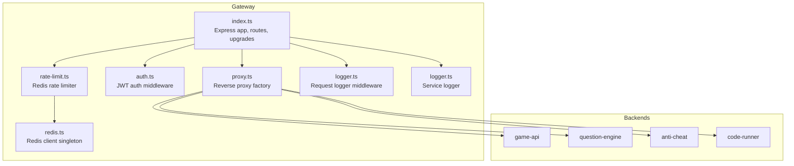
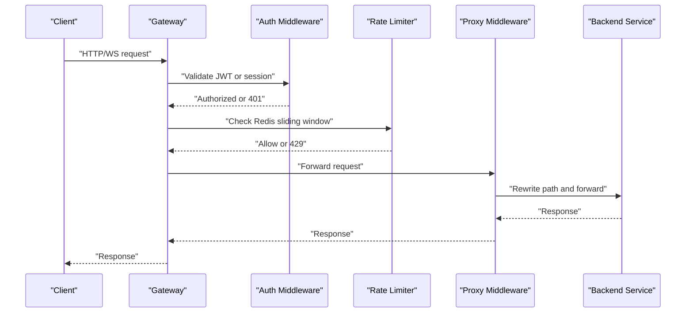
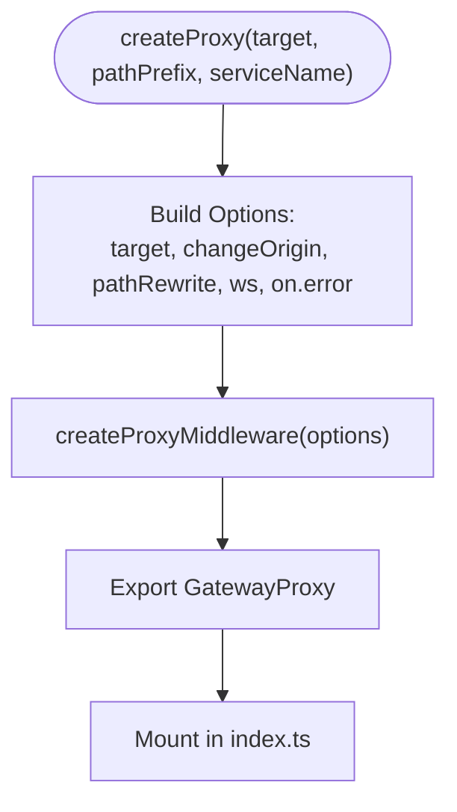
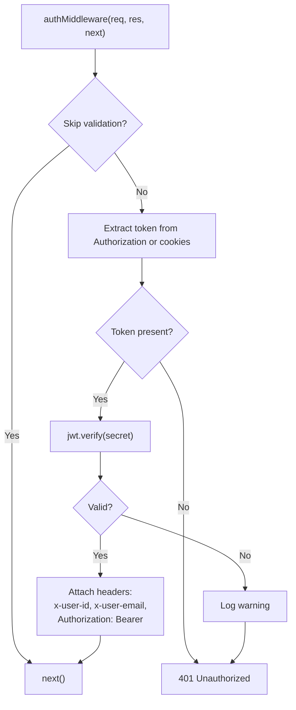
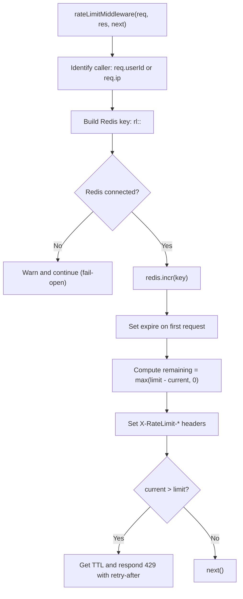
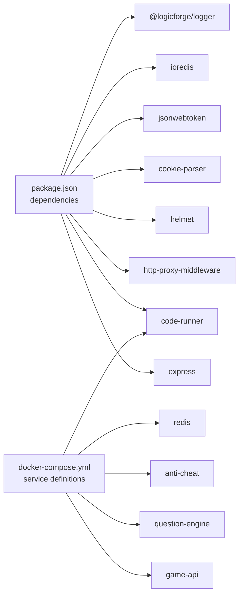

# API Gateway

<cite>
**Referenced Files in This Document**
- [index.ts](file://apps/gateway/src/index.ts)
- [proxy.ts](file://apps/gateway/src/proxy.ts)
- [auth.ts](file://apps/gateway/src/middleware/auth.ts)
- [rate-limit.ts](file://apps/gateway/src/middleware/rate-limit.ts)
- [logger.ts](file://apps/gateway/src/middleware/logger.ts)
- [redis.ts](file://apps/gateway/src/redis.ts)
- [logger.ts](file://apps/gateway/src/logger.ts)
- [package.json](file://apps/gateway/package.json)
- [Dockerfile](file://apps/gateway/Dockerfile)
- [docker-compose.yml](file://docker-compose.yml)
- [README.md](file://README.md)
</cite>

## Table of Contents
1. [Introduction](#introduction)
2. [Project Structure](#project-structure)
3. [Core Components](#core-components)
4. [Architecture Overview](#architecture-overview)
5. [Detailed Component Analysis](#detailed-component-analysis)
6. [Dependency Analysis](#dependency-analysis)
7. [Performance Considerations](#performance-considerations)
8. [Troubleshooting Guide](#troubleshooting-guide)
9. [Conclusion](#conclusion)
10. [Appendices](#appendices)

## Introduction
This document describes the Logic Forge API Gateway service, which acts as a unified entry point for all client-facing traffic. It centralizes routing to backend microservices, enforces authentication and rate limiting, manages request/response transformations, and provides robust logging and error handling. The gateway is deployed behind a reverse proxy/load balancer and exposes a single public endpoint while internally communicating with internal services over Docker networks.

## Project Structure
The gateway is implemented as a Node.js/Express application with TypeScript. Key areas:
- Entry point initializes Express, middleware, and routes.
- Proxy factory creates reverse proxies to backend services.
- Authentication middleware validates JWT tokens and enriches requests.
- Rate limiter uses Redis sliding-window counters.
- Request logger records metrics and contextual metadata.
- Redis client provides connection lifecycle and readiness checks.
- Docker packaging builds and runs the service in production.

**Diagram sources**
- [index.ts](file://apps/gateway/src/index.ts#L24-L100)
- [proxy.ts](file://apps/gateway/src/proxy.ts#L10-L78)
- [auth.ts](file://apps/gateway/src/middleware/auth.ts#L18-L64)
- [rate-limit.ts](file://apps/gateway/src/middleware/rate-limit.ts#L15-L79)
- [logger.ts](file://apps/gateway/src/middleware/logger.ts#L5-L24)
- [redis.ts](file://apps/gateway/src/redis.ts#L9-L52)
- [logger.ts](file://apps/gateway/src/logger.ts#L1-L7)

**Section sources**
- [index.ts](file://apps/gateway/src/index.ts#L1-L117)
- [proxy.ts](file://apps/gateway/src/proxy.ts#L1-L78)
- [auth.ts](file://apps/gateway/src/middleware/auth.ts#L1-L65)
- [rate-limit.ts](file://apps/gateway/src/middleware/rate-limit.ts#L1-L80)
- [logger.ts](file://apps/gateway/src/middleware/logger.ts#L1-L25)
- [redis.ts](file://apps/gateway/src/redis.ts#L1-L55)
- [logger.ts](file://apps/gateway/src/logger.ts#L1-L7)
- [package.json](file://apps/gateway/package.json#L1-L33)
- [Dockerfile](file://apps/gateway/Dockerfile#L1-L55)
- [docker-compose.yml](file://docker-compose.yml#L157-L189)
- [README.md](file://README.md#L8-L18)

## Core Components
- Express server with security headers, CORS, and cookie parsing.
- Health check endpoint exposed without authentication.
- Centralized proxy middleware for four backend services:
  - Game API (HTTP + WebSocket)
  - Question Engine
  - Anti-Cheat
  - Code Runner
- Authentication middleware supporting JWT Bearer tokens and NextAuth session cookies.
- Rate limiting middleware using Redis with sliding windows.
- Request logging middleware capturing method, path, status, response time, and user identity.
- Redis client with exponential backoff and readiness gating.
- Global error handler returning standardized gateway errors.

**Section sources**
- [index.ts](file://apps/gateway/src/index.ts#L24-L100)
- [proxy.ts](file://apps/gateway/src/proxy.ts#L10-L78)
- [auth.ts](file://apps/gateway/src/middleware/auth.ts#L18-L64)
- [rate-limit.ts](file://apps/gateway/src/middleware/rate-limit.ts#L15-L79)
- [logger.ts](file://apps/gateway/src/middleware/logger.ts#L5-L24)
- [redis.ts](file://apps/gateway/src/redis.ts#L9-L52)

## Architecture Overview
The gateway sits between clients and backend services. It authenticates requests, applies rate limits, logs activity, and forwards traffic to the appropriate backend. WebSocket upgrades for the Game API are passed through to the backend service.

**Diagram sources**
- [index.ts](file://apps/gateway/src/index.ts#L48-L96)
- [auth.ts](file://apps/gateway/src/middleware/auth.ts#L18-L64)
- [rate-limit.ts](file://apps/gateway/src/middleware/rate-limit.ts#L15-L79)
- [proxy.ts](file://apps/gateway/src/proxy.ts#L17-L42)

## Detailed Component Analysis

### Entry Point and Routing
- Initializes Express, sets trust proxy for Docker environments, and mounts security middleware.
- Exposes a health check endpoint at GET /health.
- Applies authentication and request logging to all /api/* routes.
- Mounts service-specific proxies with rate limiting:
  - /api/game → gameProxy (generalRateLimit)
  - /api/questions → questionsProxy (generalRateLimit)
  - /api/anticheat → antiCheatProxy (generalRateLimit)
  - /api/run → codeRunnerProxy (codeRunnerRateLimit)
- Registers a global error handler to prevent unhandled exceptions from crashing the server.
- Handles WebSocket upgrade events for /api/game/* by delegating to the game proxy.

**Section sources**
- [index.ts](file://apps/gateway/src/index.ts#L24-L100)

### Reverse Proxy Factory
- Creates a reusable reverse proxy middleware configured with:
  - Upstream target URL from environment variables.
  - Path rewriting to strip the gateway prefix before forwarding.
  - WebSocket support enabled.
  - Centralized error handling that returns a standardized Bad Gateway response.
- Exports named proxies for each backend service.

**Diagram sources**
- [proxy.ts](file://apps/gateway/src/proxy.ts#L17-L42)

**Section sources**
- [proxy.ts](file://apps/gateway/src/proxy.ts#L10-L78)

### Authentication Middleware
- Skips validation for:
  - Health check endpoint
  - NextAuth callback routes under /api/auth/*
- Supports two token sources:
  - Authorization: Bearer header
  - NextAuth session cookies (development and secure variants)
- Verifies JWT using the shared secret and attaches:
  - x-user-id and x-user-email headers for downstream services
  - Authorization: Bearer header for forwarded requests
- On failure, logs a warning and responds with 401 Unauthorized.

**Diagram sources**
- [auth.ts](file://apps/gateway/src/middleware/auth.ts#L18-L64)

**Section sources**
- [auth.ts](file://apps/gateway/src/middleware/auth.ts#L18-L64)

### Rate Limiting Middleware
- Uses Redis sliding-window counters keyed by user ID or IP address.
- Fail-open behavior when Redis is unavailable or errors occur.
- Sets X-RateLimit-Limit and X-RateLimit-Remaining response headers.
- Returns 429 Too Many Requests with retry-after hint derived from TTL.

**Diagram sources**
- [rate-limit.ts](file://apps/gateway/src/middleware/rate-limit.ts#L15-L79)
- [redis.ts](file://apps/gateway/src/redis.ts#L9-L52)

**Section sources**
- [rate-limit.ts](file://apps/gateway/src/middleware/rate-limit.ts#L15-L79)
- [redis.ts](file://apps/gateway/src/redis.ts#L9-L52)

### Request Logging Middleware
- Captures start time and emits structured logs upon response finish.
- Logs include method, path, status code, response time, and user ID.

**Section sources**
- [logger.ts](file://apps/gateway/src/middleware/logger.ts#L5-L24)

### Redis Client
- Lazy connection with exponential backoff retry strategy.
- Tracks connection state and logs lifecycle events.
- Provides isRedisConnected() to gate rate limiting behavior.

**Section sources**
- [redis.ts](file://apps/gateway/src/redis.ts#L9-L52)

### Service Discovery and Load Balancing
- Service discovery relies on Docker service names and ports:
  - game-api:3001
  - question-engine:3002
  - anti-cheat:3003
  - code-runner:3004
- Load balancing is handled by Docker networking and the upstream services themselves; the gateway does not implement intra-cluster load balancing.

**Section sources**
- [docker-compose.yml](file://docker-compose.yml#L157-L189)
- [proxy.ts](file://apps/gateway/src/proxy.ts#L46-L53)

### Request/Response Transformation Patterns
- Path rewriting strips the gateway prefix before forwarding to upstream services.
- Authentication headers are forwarded downstream:
  - Authorization: Bearer <token>
  - x-user-id
  - x-user-email
- WebSocket upgrades are delegated to the game proxy for real-time communication.

**Section sources**
- [proxy.ts](file://apps/gateway/src/proxy.ts#L22-L41)
- [auth.ts](file://apps/gateway/src/middleware/auth.ts#L53-L59)
- [index.ts](file://apps/gateway/src/index.ts#L86-L96)

### Error Handling Mechanisms
- Proxy errors are captured and transformed into a standardized Bad Gateway response.
- Global Express error handler ensures unhandled errors return a consistent 502 response.
- Redis errors trigger fail-open behavior to maintain availability.

**Section sources**
- [proxy.ts](file://apps/gateway/src/proxy.ts#L29-L38)
- [index.ts](file://apps/gateway/src/index.ts#L66-L81)
- [rate-limit.ts](file://apps/gateway/src/middleware/rate-limit.ts#L59-L63)

### Logging Capabilities
- Structured logging via a shared logger package with service tagging.
- Request logger emits timing and identity metrics.
- Redis lifecycle and error events are logged for observability.

**Section sources**
- [logger.ts](file://apps/gateway/src/logger.ts#L1-L7)
- [logger.ts](file://apps/gateway/src/middleware/logger.ts#L10-L21)
- [redis.ts](file://apps/gateway/src/redis.ts#L22-L40)

## Dependency Analysis
- Runtime dependencies include Express, http-proxy-middleware, helmet, cors, cookie-parser, jsonwebtoken, ioredis, and the shared logger package.
- The gateway depends on environment variables for backend URLs, secrets, and Redis connectivity.
- Docker Compose defines service topology and interdependencies.

**Diagram sources**
- [package.json](file://apps/gateway/package.json#L12-L22)
- [docker-compose.yml](file://docker-compose.yml#L157-L189)

**Section sources**
- [package.json](file://apps/gateway/package.json#L12-L22)
- [docker-compose.yml](file://docker-compose.yml#L157-L189)

## Performance Considerations
- Redis sliding-window rate limiting is efficient and scales horizontally with Redis clustering.
- Path rewriting and header forwarding are lightweight operations.
- WebSocket passthrough avoids additional serialization overhead.
- Fail-open behavior prevents cascading failures during Redis outages.
- Consider enabling gzip compression and keep-alive at the reverse proxy level for improved throughput.

[No sources needed since this section provides general guidance]

## Troubleshooting Guide
Common issues and remedies:
- Unauthorized responses:
  - Verify Authorization header format and token validity.
  - Confirm NextAuth session cookies are present for browser flows.
- Rate limit exceeded:
  - Inspect X-RateLimit-* headers and wait for the window to reset.
  - Check Redis connectivity and keyspace.
- Proxy errors:
  - Review backend service health and network connectivity.
  - Confirm path rewriting and WebSocket upgrade handling.
- Gateway crashes:
  - Inspect global error handler logs and ensure graceful shutdown signals are received.

**Section sources**
- [auth.ts](file://apps/gateway/src/middleware/auth.ts#L47-L63)
- [rate-limit.ts](file://apps/gateway/src/middleware/rate-limit.ts#L48-L56)
- [proxy.ts](file://apps/gateway/src/proxy.ts#L29-L38)
- [index.ts](file://apps/gateway/src/index.ts#L66-L81)

## Conclusion
The Logic Forge API Gateway provides a secure, observable, and resilient entry point for the platform’s microservices. It centralizes authentication, enforces usage limits, and forwards traffic with minimal overhead while preserving real-time capabilities for gaming sessions.

[No sources needed since this section summarizes without analyzing specific files]

## Appendices

### API Endpoints
- GET /health — Health check (no authentication)
- All other /api/* endpoints:
  - Authentication: JWT Bearer or NextAuth session cookie
  - Rate limiting: general or code-runner tiers
  - Proxies:
    - /api/game → game-api
    - /api/questions → question-engine
    - /api/anticheat → anti-cheat
    - /api/run → code-runner

**Section sources**
- [index.ts](file://apps/gateway/src/index.ts#L44-L64)
- [proxy.ts](file://apps/gateway/src/proxy.ts#L46-L77)

### Environment Variables
- PORT: Gateway listen port (default 8080)
- WEB_URL: Allowed origin for CORS
- GAME_API_URL, QUESTION_ENGINE_URL, ANTI_CHEAT_URL, CODE_RUNNER_URL: Upstream targets
- NEXTAUTH_SECRET: Shared secret for JWT verification
- REDIS_URL: Redis connection string
- NODE_ENV: Production mode for runtime behavior

**Section sources**
- [index.ts](file://apps/gateway/src/index.ts#L21-L22)
- [proxy.ts](file://apps/gateway/src/proxy.ts#L46-L53)
- [redis.ts](file://apps/gateway/src/redis.ts#L5-L5)
- [docker-compose.yml](file://docker-compose.yml#L165-L174)

### Middleware Setup Examples
- Authentication:
  - Apply to all /api/* routes before logging.
  - Supports Bearer tokens and NextAuth cookies.
- Request logging:
  - Attach after auth to capture authenticated metrics.
- Rate limiting:
  - General tier for most endpoints.
  - Stricter tier for code execution.

**Section sources**
- [index.ts](file://apps/gateway/src/index.ts#L48-L64)
- [auth.ts](file://apps/gateway/src/middleware/auth.ts#L18-L64)
- [rate-limit.ts](file://apps/gateway/src/middleware/rate-limit.ts#L67-L79)
- [logger.ts](file://apps/gateway/src/middleware/logger.ts#L5-L24)

### Service Integration Patterns
- Path rewriting removes gateway prefixes before forwarding to upstream services.
- Downstream services receive:
  - Authorization: Bearer <token>
  - x-user-id
  - x-user-email
- WebSocket upgrades are delegated to the game proxy.

**Section sources**
- [proxy.ts](file://apps/gateway/src/proxy.ts#L22-L41)
- [auth.ts](file://apps/gateway/src/middleware/auth.ts#L53-L59)
- [index.ts](file://apps/gateway/src/index.ts#L86-L96)

### Monitoring and Observability
- Structured logs include method, path, status, response time, and user identity.
- Redis lifecycle and error events are logged for rate limiting visibility.
- Consider integrating external monitoring for latency, error rates, and rate limit saturation.

**Section sources**
- [logger.ts](file://apps/gateway/src/middleware/logger.ts#L10-L21)
- [redis.ts](file://apps/gateway/src/redis.ts#L22-L40)
- [logger.ts](file://apps/gateway/src/logger.ts#L1-L7)