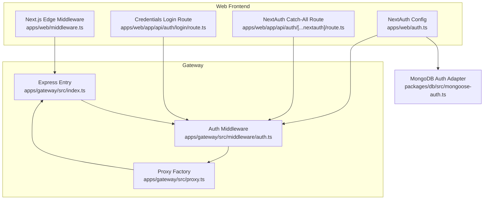
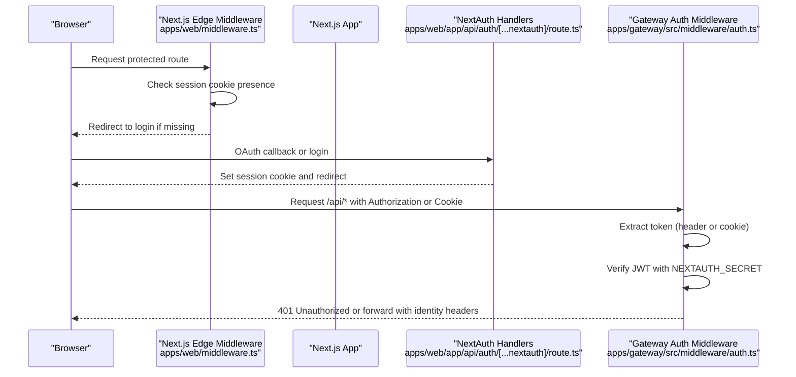
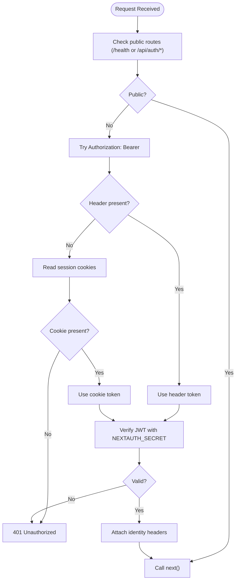
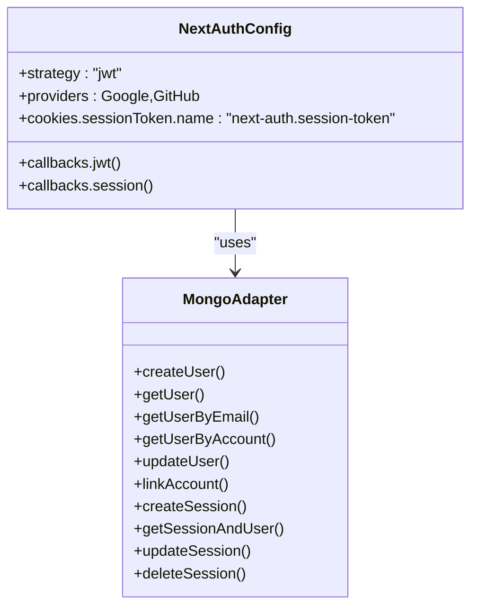
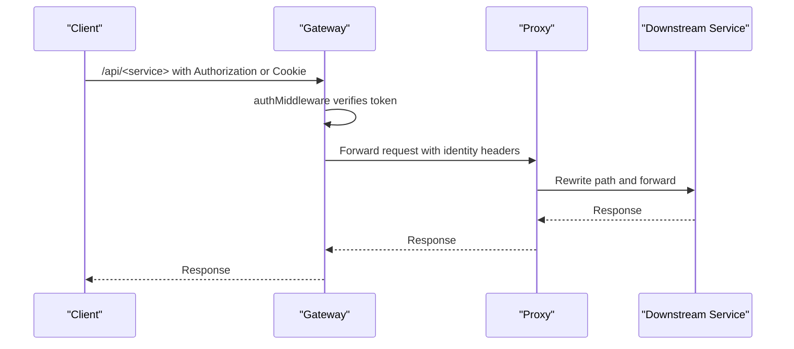
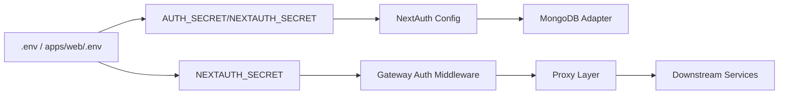

# Authentication and Authorization Middleware

<cite>
**Referenced Files in This Document**
- [apps/gateway/src/middleware/auth.ts](file://apps/gateway/src/middleware/auth.ts)
- [apps/gateway/src/index.ts](file://apps/gateway/src/index.ts)
- [apps/gateway/src/proxy.ts](file://apps/gateway/src/proxy.ts)
- [apps/web/middleware.ts](file://apps/web/middleware.ts)
- [apps/web/auth.ts](file://apps/web/auth.ts)
- [apps/web/auth.config.ts](file://apps/web/auth.config.ts)
- [apps/web/app/api/auth/[...nextauth]/route.ts](file://apps/web/app/api/auth/[...nextauth]/route.ts)
- [apps/web/app/api/auth/login/route.ts](file://apps/web/app/api/auth/login/route.ts)
- [packages/db/src/mongoose-auth.ts](file://packages/db/src/mongoose-auth.ts)
- [.env](file://.env)
- [apps/web/.env](file://apps/web/.env)
- [apps/web/hooks/use-game-engine.ts](file://apps/web/hooks/use-game-engine.ts)
</cite>

## Table of Contents
1. [Introduction](#introduction)
2. [Project Structure](#project-structure)
3. [Core Components](#core-components)
4. [Architecture Overview](#architecture-overview)
5. [Detailed Component Analysis](#detailed-component-analysis)
6. [Dependency Analysis](#dependency-analysis)
7. [Performance Considerations](#performance-considerations)
8. [Troubleshooting Guide](#troubleshooting-guide)
9. [Conclusion](#conclusion)

## Introduction
This document explains the Logic Forge API Gateway authentication and authorization middleware. It covers JWT token validation, session management with NextAuth, cookie-based authentication handling, and the integration with external OAuth providers. It also documents the authentication flow, token verification mechanisms, user session validation, and how the gateway proxies authenticated requests downstream. Guidance is included for configuration, token extraction, authorization checks, security considerations, token refresh mechanisms, and troubleshooting.

## Project Structure
The authentication system spans three primary areas:
- Frontend Next.js application with NextAuth configuration and middleware
- API Gateway Express server with JWT verification and proxying
- Database adapter for NextAuth-backed sessions and user data

**Diagram sources**
- [apps/web/middleware.ts](file://apps/web/middleware.ts#L1-L39)
- [apps/web/auth.ts](file://apps/web/auth.ts#L59-L171)
- [apps/web/app/api/auth/[...nextauth]/route.ts](file://apps/web/app/api/auth/[...nextauth]/route.ts#L1-L5)
- [apps/web/app/api/auth/login/route.ts](file://apps/web/app/api/auth/login/route.ts#L1-L79)
- [apps/gateway/src/index.ts](file://apps/gateway/src/index.ts#L1-L117)
- [apps/gateway/src/middleware/auth.ts](file://apps/gateway/src/middleware/auth.ts#L1-L65)
- [apps/gateway/src/proxy.ts](file://apps/gateway/src/proxy.ts#L1-L78)
- [packages/db/src/mongoose-auth.ts](file://packages/db/src/mongoose-auth.ts#L158-L285)

**Section sources**
- [apps/gateway/src/index.ts](file://apps/gateway/src/index.ts#L1-L117)
- [apps/gateway/src/middleware/auth.ts](file://apps/gateway/src/middleware/auth.ts#L1-L65)
- [apps/gateway/src/proxy.ts](file://apps/gateway/src/proxy.ts#L1-L78)
- [apps/web/middleware.ts](file://apps/web/middleware.ts#L1-L39)
- [apps/web/auth.ts](file://apps/web/auth.ts#L59-L171)
- [apps/web/app/api/auth/[...nextauth]/route.ts](file://apps/web/app/api/auth/[...nextauth]/route.ts#L1-L5)
- [apps/web/app/api/auth/login/route.ts](file://apps/web/app/api/auth/login/route.ts#L1-L79)
- [packages/db/src/mongoose-auth.ts](file://packages/db/src/mongoose-auth.ts#L158-L285)

## Core Components
- Gateway Auth Middleware: Validates JWTs and forwards identity headers downstream.
- NextAuth Configuration: Manages session cookies, JWT strategy, OAuth providers, and session storage via MongoDB.
- Edge Middleware: Enforces presence of session cookies for protected routes.
- Proxy Layer: Routes authenticated requests to backend services.
- Database Adapter: Provides NextAuth adapters for users, accounts, and sessions backed by MongoDB.

Key responsibilities:
- Token extraction from Authorization header or NextAuth session cookie
- JWT verification using the configured secret
- Identity propagation to downstream services
- Session enforcement for frontend routes
- OAuth callback delegation and session persistence

**Section sources**
- [apps/gateway/src/middleware/auth.ts](file://apps/gateway/src/middleware/auth.ts#L18-L64)
- [apps/web/auth.ts](file://apps/web/auth.ts#L59-L171)
- [apps/web/middleware.ts](file://apps/web/middleware.ts#L8-L34)
- [apps/gateway/src/proxy.ts](file://apps/gateway/src/proxy.ts#L17-L77)
- [packages/db/src/mongoose-auth.ts](file://packages/db/src/mongoose-auth.ts#L158-L285)

## Architecture Overview
The authentication flow integrates frontend session cookies, NextAuth JWT strategy, and gateway JWT verification. Protected frontend routes rely on cookie presence enforced by Edge middleware. Backend requests are authenticated by the gateway middleware, which validates either a Bearer token or a NextAuth session cookie and forwards identity headers to downstream services.

**Diagram sources**
- [apps/web/middleware.ts](file://apps/web/middleware.ts#L8-L34)
- [apps/web/app/api/auth/[...nextauth]/route.ts](file://apps/web/app/api/auth/[...nextauth]/route.ts#L1-L5)
- [apps/gateway/src/middleware/auth.ts](file://apps/gateway/src/middleware/auth.ts#L18-L64)

## Detailed Component Analysis

### Gateway Auth Middleware
Responsibilities:
- Skip validation for public endpoints (/health and NextAuth callbacks)
- Extract token from Authorization header or NextAuth session cookie
- Verify JWT using NEXTAUTH_SECRET
- Attach identity headers for downstream services

Processing logic:
- Header-first token extraction
- Cookie fallback with secure and non-secure variants
- JWT verification and payload casting
- Identity propagation via headers (authorization, x-user-id, x-user-email)
- Error handling with 401 responses

**Diagram sources**
- [apps/gateway/src/middleware/auth.ts](file://apps/gateway/src/middleware/auth.ts#L18-L64)

**Section sources**
- [apps/gateway/src/middleware/auth.ts](file://apps/gateway/src/middleware/auth.ts#L18-L64)

### NextAuth Configuration and Session Management
Key aspects:
- Strategy: JWT for session storage
- Providers: Google and GitHub
- Cookie configuration: Secure and non-secure prefixes depending on environment
- Callbacks: Embed user data into JWT, expose a signed access token for gateway usage
- Session persistence: MongoDB via adapter

**Diagram sources**
- [apps/web/auth.ts](file://apps/web/auth.ts#L59-L171)
- [packages/db/src/mongoose-auth.ts](file://packages/db/src/mongoose-auth.ts#L158-L285)

**Section sources**
- [apps/web/auth.ts](file://apps/web/auth.ts#L59-L171)
- [packages/db/src/mongoose-auth.ts](file://packages/db/src/mongoose-auth.ts#L158-L285)

### Edge Middleware (Frontend Session Enforcement)
Responsibilities:
- Detect presence of NextAuth session cookies (including secure variants)
- Redirect to login for protected paths when cookies are absent
- Matcher excludes static assets and API routes

Behavior:
- Protected paths include dashboard, arcade, lobby, story, settings, arena
- Redirect preserves callbackUrl for seamless return after login

**Section sources**
- [apps/web/middleware.ts](file://apps/web/middleware.ts#L8-L34)

### NextAuth Catch-All Route
Delegates all /api/auth/* requests to NextAuth handlers, enabling OAuth flows and session management endpoints.

**Section sources**
- [apps/web/app/api/auth/[...nextauth]/route.ts](file://apps/web/app/api/auth/[...nextauth]/route.ts#L1-L5)

### Credentials Login Endpoint (Short-lived Tokens)
The login endpoint generates:
- Short-lived access token (15 minutes) for immediate API usage
- Long-lived refresh token (7 days) for refresh flows
- Returns user profile alongside tokens

Notes:
- Uses JWT secrets configured in environment variables
- Returns structured JSON with tokens and user info

**Section sources**
- [apps/web/app/api/auth/login/route.ts](file://apps/web/app/api/auth/login/route.ts#L7-L79)

### Proxy Layer and Downstream Identity Propagation
The gateway proxies authenticated requests to backend services and forwards identity headers:
- Authorization: Bearer <token>
- X-User-Id: user identifier
- X-User-Email: user email

**Diagram sources**
- [apps/gateway/src/middleware/auth.ts](file://apps/gateway/src/middleware/auth.ts#L52-L63)
- [apps/gateway/src/proxy.ts](file://apps/gateway/src/proxy.ts#L17-L42)

**Section sources**
- [apps/gateway/src/proxy.ts](file://apps/gateway/src/proxy.ts#L17-L77)
- [apps/gateway/src/index.ts](file://apps/gateway/src/index.ts#L48-L64)

### Socket Authentication and Token Updates
Frontend establishes Socket.io connections with Authorization headers containing the Bearer token. The socket library updates headers dynamically when the session accessToken becomes available.

**Section sources**
- [apps/web/hooks/use-game-engine.ts](file://apps/web/hooks/use-game-engine.ts#L36-L70)

## Dependency Analysis
- Gateway depends on NEXTAUTH_SECRET for JWT verification
- NextAuth depends on AUTH_SECRET/NEXTAUTH_SECRET and MongoDB adapter
- Edge middleware aligns cookie naming with NextAuth configuration
- Proxy downstream services receive forwarded identity headers

**Diagram sources**
- [.env](file://.env#L18-L21)
- [apps/web/.env](file://apps/web/.env#L1)
- [apps/gateway/src/middleware/auth.ts](file://apps/gateway/src/middleware/auth.ts#L16)
- [apps/web/auth.ts](file://apps/web/auth.ts#L62-L62)
- [apps/gateway/src/proxy.ts](file://apps/gateway/src/proxy.ts#L17-L77)

**Section sources**
- [.env](file://.env#L18-L21)
- [apps/web/.env](file://apps/web/.env#L1)
- [apps/gateway/src/middleware/auth.ts](file://apps/gateway/src/middleware/auth.ts#L16)
- [apps/web/auth.ts](file://apps/web/auth.ts#L62-L62)
- [apps/gateway/src/proxy.ts](file://apps/gateway/src/proxy.ts#L17-L77)

## Performance Considerations
- JWT verification is lightweight; avoid excessive middleware overhead by keeping validation logic minimal.
- Use appropriate rate limiting on proxy endpoints to prevent abuse.
- Prefer cookie-based auth for frontend SPA navigation; use Bearer tokens for API and WebSocket calls to reduce cookie parsing overhead.
- Ensure consistent cookie domain/path settings to minimize cross-origin issues and redundant requests.

## Troubleshooting Guide
Common issues and resolutions:
- Missing NEXTAUTH_SECRET or AUTH_SECRET
  - Symptom: JWT verification failures in gateway middleware
  - Resolution: Set NEXTAUTH_SECRET or AUTH_SECRET in environment variables
  - References:
    - [apps/gateway/src/middleware/auth.ts](file://apps/gateway/src/middleware/auth.ts#L16)
    - [.env](file://.env#L18-L21)
    - [apps/web/.env](file://apps/web/.env#L1)

- Unauthorized due to missing Authorization header or session cookie
  - Symptom: 401 responses for /api/* routes
  - Resolution: Ensure Authorization: Bearer <token> or a valid NextAuth session cookie is present
  - References:
    - [apps/gateway/src/middleware/auth.ts](file://apps/gateway/src/middleware/auth.ts#L32-L50)

- Edge middleware redirect loop
  - Symptom: Redirects to login despite valid cookies
  - Resolution: Confirm cookie names match configured prefixes (__Secure- in production)
  - References:
    - [apps/web/middleware.ts](file://apps/web/middleware.ts#L9-L13)
    - [apps/web/auth.ts](file://apps/web/auth.ts#L68-L78)

- OAuth callback misconfiguration
  - Symptom: Redirects to unexpected URLs or missing callback handling
  - Resolution: Verify NEXTAUTH_URL and provider credentials; ensure catch-all route is mounted
  - References:
    - [apps/web/auth.ts](file://apps/web/auth.ts#L98-L122)
    - [apps/web/app/api/auth/[...nextauth]/route.ts](file://apps/web/app/api/auth/[...nextauth]/route.ts#L1-L5)

- Session persistence errors
  - Symptom: Session not found or user not persisted
  - Resolution: Confirm MONGO_URL and adapter initialization
  - References:
    - [packages/db/src/mongoose-auth.ts](file://packages/db/src/mongoose-auth.ts#L9-L35)

- Socket authentication failures
  - Symptom: WebSocket handshake fails or unauthorized events
  - Resolution: Ensure Authorization header is updated with latest accessToken and socket auth object
  - References:
    - [apps/web/hooks/use-game-engine.ts](file://apps/web/hooks/use-game-engine.ts#L36-L70)

- Token refresh mechanism
  - Current implementation: Credentials login endpoint returns short-lived access token and long-lived refresh token
  - Recommendation: Implement a dedicated refresh endpoint to exchange refresh tokens for new access tokens
  - References:
    - [apps/web/app/api/auth/login/route.ts](file://apps/web/app/api/auth/login/route.ts#L42-L57)

## Conclusion
The Logic Forge authentication system combines NextAuth’s robust session and OAuth capabilities with a lightweight gateway middleware that validates JWTs and propagates user identity downstream. By aligning cookie naming, secrets, and callback routing, the system provides a cohesive authentication experience across frontend navigation, API calls, and WebSocket connections. For production hardening, ensure secure cookie settings, consistent secrets, and implement refresh token handling to maintain secure and reliable user sessions.