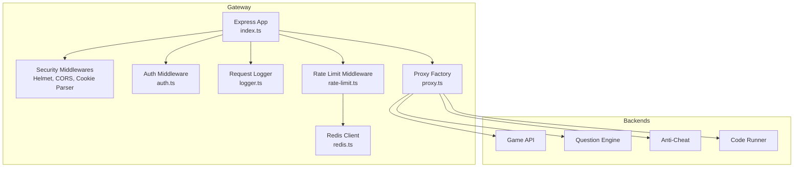
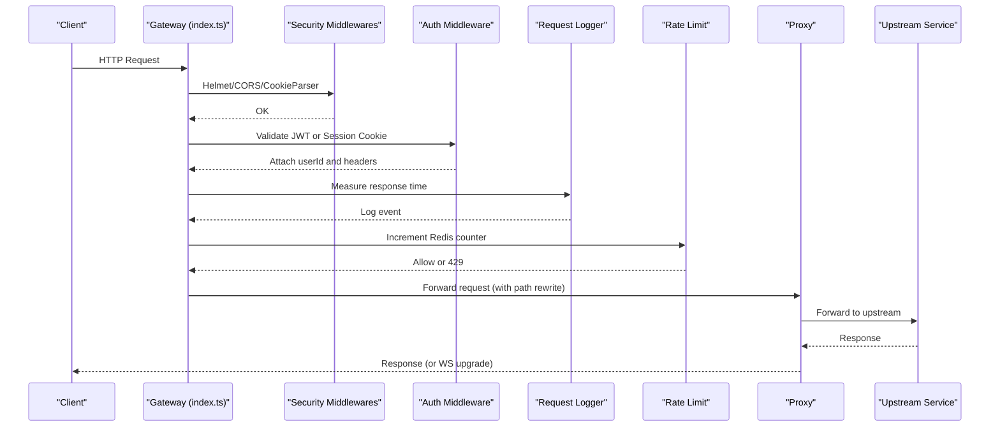
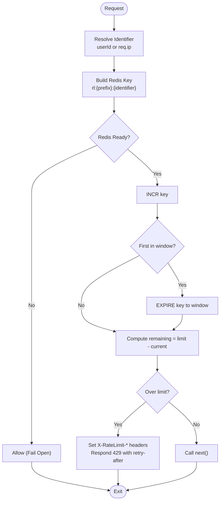
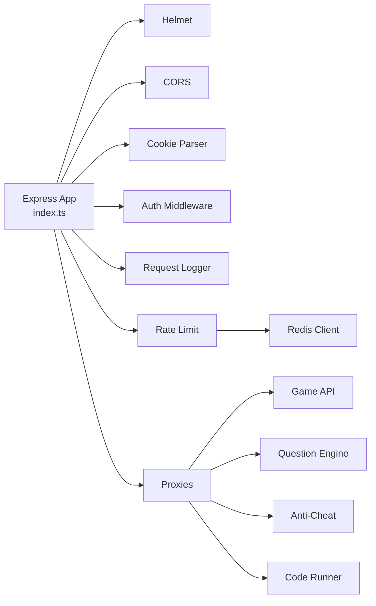

# Rate Limiting and Security

<cite>
**Referenced Files in This Document**
- [index.ts](file://apps/gateway/src/index.ts)
- [rate-limit.ts](file://apps/gateway/src/middleware/rate-limit.ts)
- [logger.ts](file://apps/gateway/src/middleware/logger.ts)
- [auth.ts](file://apps/gateway/src/middleware/auth.ts)
- [proxy.ts](file://apps/gateway/src/proxy.ts)
- [redis.ts](file://apps/gateway/src/redis.ts)
- [logger-pkg.ts](file://packages/logger/src/index.ts)
- [docker-compose.yml](file://docker-compose.yml)
- [Dockerfile](file://apps/gateway/Dockerfile)
</cite>

## Table of Contents
1. [Introduction](#introduction)
2. [Project Structure](#project-structure)
3. [Core Components](#core-components)
4. [Architecture Overview](#architecture-overview)
5. [Detailed Component Analysis](#detailed-component-analysis)
6. [Dependency Analysis](#dependency-analysis)
7. [Performance Considerations](#performance-considerations)
8. [Troubleshooting Guide](#troubleshooting-guide)
9. [Conclusion](#conclusion)
10. [Appendices](#appendices)

## Introduction
This document explains the Logic Forge API Gateway’s rate limiting and security measures. It covers:
- General and code-runner–specific sliding-window rate limiting with Redis-backed counters
- IP-based throttling fallback and request frequency controls
- Security middleware stack: Helmet for security headers, CORS configuration, and cookie parsing
- Request logging, audit trail capabilities, and monitoring integration
- Practical examples for configuration, security header setup, and logging patterns
- Performance impact, best practices, incident response, and tuning guidance

## Project Structure
The gateway is implemented as an Express server with middleware and proxy layers. It integrates Redis for rate limiting, structured logging, and proxies traffic to backend services.

**Diagram sources**
- [index.ts](file://apps/gateway/src/index.ts#L24-L100)
- [rate-limit.ts](file://apps/gateway/src/middleware/rate-limit.ts#L15-L80)
- [logger.ts](file://apps/gateway/src/middleware/logger.ts#L5-L25)
- [auth.ts](file://apps/gateway/src/middleware/auth.ts#L18-L65)
- [proxy.ts](file://apps/gateway/src/proxy.ts#L17-L78)
- [redis.ts](file://apps/gateway/src/redis.ts#L9-L55)

**Section sources**
- [index.ts](file://apps/gateway/src/index.ts#L24-L100)
- [docker-compose.yml](file://docker-compose.yml#L157-L189)

## Core Components
- Security middleware stack: Helmet, CORS, and cookie parser configured globally
- Authentication middleware: JWT validation with bearer tokens and session cookie fallback
- Request logging: Structured logging with response timing and user identity
- Rate limiting: Sliding-window implementation backed by Redis with fail-open behavior
- Proxies: Reverse proxy factory with WebSocket support and error handling

**Section sources**
- [index.ts](file://apps/gateway/src/index.ts#L27-L41)
- [auth.ts](file://apps/gateway/src/middleware/auth.ts#L18-L65)
- [logger.ts](file://apps/gateway/src/middleware/logger.ts#L5-L25)
- [rate-limit.ts](file://apps/gateway/src/middleware/rate-limit.ts#L15-L80)
- [proxy.ts](file://apps/gateway/src/proxy.ts#L17-L78)
- [redis.ts](file://apps/gateway/src/redis.ts#L9-L55)

## Architecture Overview
The gateway applies security and request handling before routing to backend services. Rate limiting is enforced per user (preferred) or per IP (fallback). Proxies forward requests to upstream services and handle WebSocket upgrades.

**Diagram sources**
- [index.ts](file://apps/gateway/src/index.ts#L27-L100)
- [auth.ts](file://apps/gateway/src/middleware/auth.ts#L18-L65)
- [logger.ts](file://apps/gateway/src/middleware/logger.ts#L5-L25)
- [rate-limit.ts](file://apps/gateway/src/middleware/rate-limit.ts#L15-L80)
- [proxy.ts](file://apps/gateway/src/proxy.ts#L17-L78)

## Detailed Component Analysis

### Security Middleware Stack
- Helmet: Applies secure headers to responses
- CORS: Restricts origins to the web frontend URL and allows credentials
- Cookie parser: Parses cookies for session tokens

Configuration highlights:
- Trust proxy is enabled to resolve client IP correctly behind Docker
- CORS origin is controlled by the WEB_URL environment variable
- Cookie parsing enables session token extraction for authentication

Operational notes:
- Requests to public endpoints (health checks and NextAuth callbacks) bypass JWT validation
- Auth middleware forwards the validated token and user identity to downstream services

**Section sources**
- [index.ts](file://apps/gateway/src/index.ts#L27-L41)
- [auth.ts](file://apps/gateway/src/middleware/auth.ts#L18-L65)

### Request Logging and Audit Trail
- Request logger records method, path, status code, response time, and user ID
- Structured logging uses Pino with service metadata and error serializers
- Audit trail: Anti-cheat service maintains append-only telemetry events for session and candidate data

Logging patterns:
- Use the gateway logger for request lifecycle events
- Use the anti-cheat audit log service for behavioral telemetry

**Section sources**
- [logger.ts](file://apps/gateway/src/middleware/logger.ts#L5-L25)
- [logger-pkg.ts](file://packages/logger/src/index.ts#L19-L66)
- [audit-log.service.ts](file://apps/anti-cheat/src/services/audit-log.service.ts#L4-L18)

### Rate Limiting Implementation
- Sliding-window algorithm using Redis:
  - Keys are scoped by prefix and identifier (userId or IP)
  - First request in a window sets TTL equal to the window
  - Remaining requests derive from limit minus current count
- Fail-open behavior:
  - When Redis is unavailable or errors occur, requests are allowed
- Two built-in configurations:
  - General rate limit: higher allowance suitable for general APIs
  - Code-runner rate limit: stricter allowance for compute-intensive endpoints

**Diagram sources**
- [rate-limit.ts](file://apps/gateway/src/middleware/rate-limit.ts#L15-L80)
- [redis.ts](file://apps/gateway/src/redis.ts#L9-L55)

**Section sources**
- [rate-limit.ts](file://apps/gateway/src/middleware/rate-limit.ts#L15-L80)
- [redis.ts](file://apps/gateway/src/redis.ts#L9-L55)

### Proxy Layer and WebSocket Upgrade
- Reverse proxy factory with path rewriting and WebSocket passthrough
- Error handling emits structured logs and returns a standardized gateway error
- WebSocket upgrade is forwarded for game API routes

**Section sources**
- [proxy.ts](file://apps/gateway/src/proxy.ts#L17-L78)
- [index.ts](file://apps/gateway/src/index.ts#L83-L96)

## Dependency Analysis
- Express app composes middleware in order: security → auth → request logging → rate limiting → proxy
- Redis is a singleton with retry strategy and connection state tracking
- Proxies depend on environment variables for upstream URLs
- Logging is centralized via the shared logger package

**Diagram sources**
- [index.ts](file://apps/gateway/src/index.ts#L27-L100)
- [rate-limit.ts](file://apps/gateway/src/middleware/rate-limit.ts#L15-L80)
- [redis.ts](file://apps/gateway/src/redis.ts#L9-L55)
- [proxy.ts](file://apps/gateway/src/proxy.ts#L17-L78)

**Section sources**
- [index.ts](file://apps/gateway/src/index.ts#L27-L100)
- [rate-limit.ts](file://apps/gateway/src/middleware/rate-limit.ts#L15-L80)
- [redis.ts](file://apps/gateway/src/redis.ts#L9-L55)
- [proxy.ts](file://apps/gateway/src/proxy.ts#L17-L78)

## Performance Considerations
- Redis latency and throughput:
  - The sliding-window approach performs two Redis operations per request (INCR and EXPIRE on first request)
  - TTL computation on quota exceeded adds an extra TTL lookup
- Fail-open behavior:
  - Ensures availability under Redis failure but increases risk exposure
- Connection strategy:
  - Lazy connect with bounded retries reduces startup overhead and prevents thundering herds
- Logging overhead:
  - Structured logging is lightweight; ensure log levels are tuned for production
- Proxy overhead:
  - Path rewriting and WebSocket passthrough add minimal CPU overhead

[No sources needed since this section provides general guidance]

## Troubleshooting Guide
Common issues and resolutions:
- Redis connectivity problems:
  - Symptoms: frequent fail-open behavior, warnings logged
  - Actions: verify REDIS_URL, network connectivity, and Redis health
- Rate limit exceeded (429):
  - Inspect X-RateLimit-* headers to determine remaining quota and retry-after
  - Adjust limits for the endpoint or user segment
- CORS or cookie issues:
  - Verify WEB_URL and cookie names; ensure credentials are allowed
- Proxy errors:
  - Review proxy error logs and upstream service health checks
- Unhandled gateway errors:
  - A global error handler returns a standardized Bad Gateway response

**Section sources**
- [redis.ts](file://apps/gateway/src/redis.ts#L32-L45)
- [rate-limit.ts](file://apps/gateway/src/middleware/rate-limit.ts#L25-L33)
- [index.ts](file://apps/gateway/src/index.ts#L66-L81)
- [proxy.ts](file://apps/gateway/src/proxy.ts#L29-L38)

## Conclusion
The gateway enforces robust security and request control through layered middleware, structured logging, and Redis-backed rate limiting. The design balances safety and resilience with fail-open behavior and clear observability. Proper configuration of Redis, CORS, and rate limits ensures reliable operation across services.

[No sources needed since this section summarizes without analyzing specific files]

## Appendices

### Rate Limit Configuration Examples
- General API endpoints:
  - Apply general rate limit middleware to routes under /api/game, /api/questions, and /api/anticheat
  - Typical configuration: 120 requests per 60 seconds per user/IP
- Code runner endpoints:
  - Apply code-runner rate limit middleware to /api/run
  - Typical configuration: 10 requests per 60 seconds per user/IP

Tuning guidance:
- Start conservative for compute-heavy endpoints (code runner)
- Monitor X-RateLimit-* headers and adjust windows and limits based on observed usage
- Consider per-route differentiation for high-frequency endpoints

**Section sources**
- [index.ts](file://apps/gateway/src/index.ts#L54-L64)
- [rate-limit.ts](file://apps/gateway/src/middleware/rate-limit.ts#L67-L79)

### Security Header Setup
- Helmet is applied globally to set secure headers
- CORS restricts origins to WEB_URL and allows credentials
- Cookie parsing enables session token extraction for authentication

Environment variables:
- WEB_URL: Controls CORS origin
- NEXTAUTH_SECRET: Used by auth middleware for JWT verification
- REDIS_URL: Configures Redis client

**Section sources**
- [index.ts](file://apps/gateway/src/index.ts#L27-L41)
- [auth.ts](file://apps/gateway/src/middleware/auth.ts#L16-L16)
- [docker-compose.yml](file://docker-compose.yml#L165-L174)

### Logging Patterns and Monitoring Integration
- Request logging captures method, path, status, response time, and userId
- Structured logs include service metadata and error serializers
- Use the gateway logger for operational events and the anti-cheat audit log for behavioral telemetry
- Integrate with external monitoring systems by consuming structured logs

**Section sources**
- [logger.ts](file://apps/gateway/src/middleware/logger.ts#L5-L25)
- [logger-pkg.ts](file://packages/logger/src/index.ts#L19-L66)
- [audit-log.service.ts](file://apps/anti-cheat/src/services/audit-log.service.ts#L4-L18)

### Deployment Notes
- Dockerized deployment exposes port 8080 and mounts the gateway service
- Environment variables configure upstream URLs, secrets, and Redis connectivity
- Health checks ensure dependent services are ready before starting the gateway

**Section sources**
- [Dockerfile](file://apps/gateway/Dockerfile#L50-L55)
- [docker-compose.yml](file://docker-compose.yml#L157-L189)