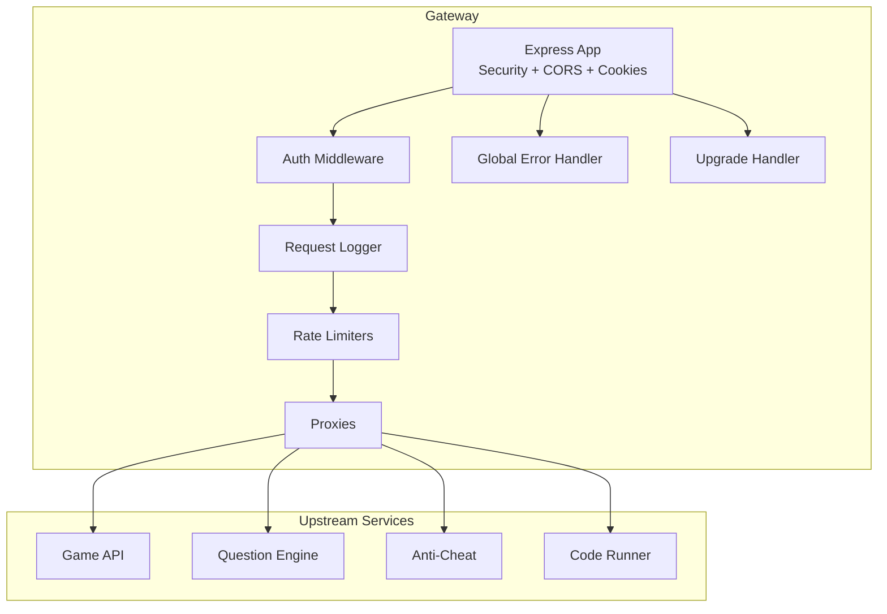
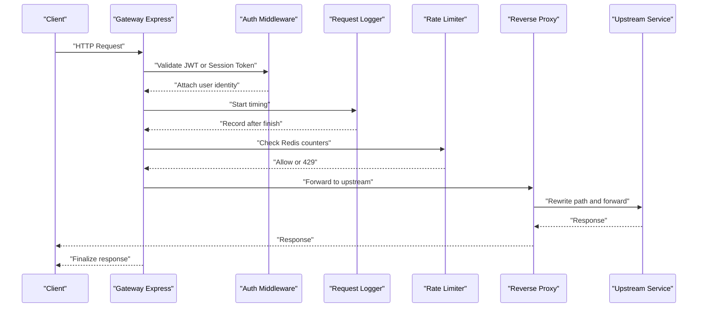
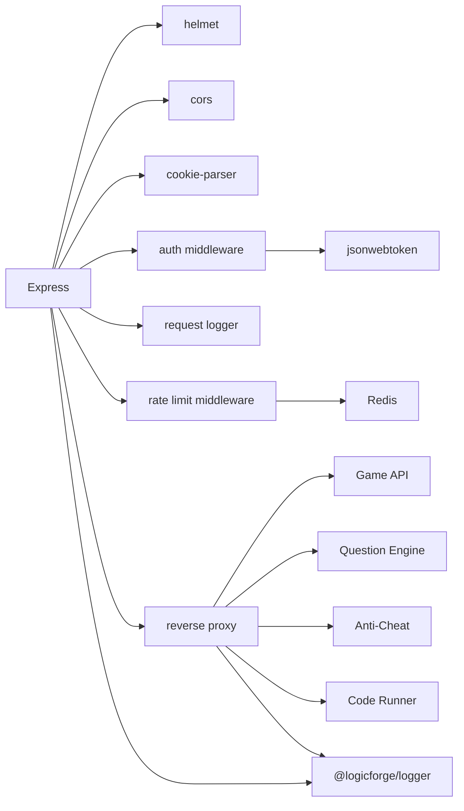

# Request/Response Processing

<cite>
**Referenced Files in This Document**
- [index.ts](file://apps/gateway/src/index.ts)
- [auth.ts](file://apps/gateway/src/middleware/auth.ts)
- [logger.ts](file://apps/gateway/src/middleware/logger.ts)
- [rate-limit.ts](file://apps/gateway/src/middleware/rate-limit.ts)
- [proxy.ts](file://apps/gateway/src/proxy.ts)
- [redis.ts](file://apps/gateway/src/redis.ts)
- [logger.ts](file://apps/gateway/src/logger.ts)
- [package.json](file://apps/gateway/package.json)
- [Dockerfile](file://apps/gateway/Dockerfile)
- [.env.example](file://.env.example)
- [docker-compose.yml](file://docker-compose.yml)
- [error.middleware.ts](file://apps/question-engine/src/middleware/error.middleware.ts)
- [app.ts](file://apps/game-api/src/app.ts)
</cite>

## Table of Contents
1. [Introduction](#introduction)
2. [Project Structure](#project-structure)
3. [Core Components](#core-components)
4. [Architecture Overview](#architecture-overview)
5. [Detailed Component Analysis](#detailed-component-analysis)
6. [Dependency Analysis](#dependency-analysis)
7. [Performance Considerations](#performance-considerations)
8. [Troubleshooting Guide](#troubleshooting-guide)
9. [Conclusion](#conclusion)
10. [Appendices](#appendices)

## Introduction
This document explains the Logic Forge API Gateway’s request and response processing pipeline. It covers the Express.js middleware chain, request preprocessing, response transformation, error handling, logging and tracing, monitoring hooks, graceful shutdown, and server lifecycle management. It also provides practical guidance for configuration, debugging, performance tuning, and robustness against edge cases.

## Project Structure
The Gateway is a Node.js/Express application that:
- Initializes Express and applies security and CORS middleware
- Enforces authentication and request logging for protected routes
- Applies rate limiting per route group
- Proxies requests to backend services (Game API, Question Engine, Anti-Cheat, Code Runner)
- Handles WebSocket upgrades for real-time features
- Provides a global error handler and graceful shutdown

**Diagram sources**
- [index.ts](file://apps/gateway/src/index.ts#L24-L100)
- [proxy.ts](file://apps/gateway/src/proxy.ts#L17-L42)

**Section sources**
- [index.ts](file://apps/gateway/src/index.ts#L24-L100)
- [package.json](file://apps/gateway/package.json#L12-L22)

## Core Components
- Express initialization and middleware stack
- Authentication middleware (JWT and session token extraction)
- Request logging middleware (response timing and user context)
- Redis-backed sliding-window rate limiter
- Reverse proxy factory with error handling and WebSocket support
- Global error handler and graceful shutdown
- Logging integration via a shared logger package

**Section sources**
- [index.ts](file://apps/gateway/src/index.ts#L24-L100)
- [auth.ts](file://apps/gateway/src/middleware/auth.ts#L18-L64)
- [logger.ts](file://apps/gateway/src/middleware/logger.ts#L5-L24)
- [rate-limit.ts](file://apps/gateway/src/middleware/rate-limit.ts#L15-L79)
- [proxy.ts](file://apps/gateway/src/proxy.ts#L17-L77)
- [redis.ts](file://apps/gateway/src/redis.ts#L9-L54)
- [logger.ts](file://apps/gateway/src/logger.ts#L1-L7)

## Architecture Overview
The Gateway acts as a single entrypoint for clients. Requests are preprocessed and routed to appropriate backend services. Responses are returned to clients, while WebSocket connections are upgraded for real-time features.

**Diagram sources**
- [index.ts](file://apps/gateway/src/index.ts#L48-L64)
- [auth.ts](file://apps/gateway/src/middleware/auth.ts#L18-L64)
- [logger.ts](file://apps/gateway/src/middleware/logger.ts#L5-L24)
- [rate-limit.ts](file://apps/gateway/src/middleware/rate-limit.ts#L15-L79)
- [proxy.ts](file://apps/gateway/src/proxy.ts#L17-L42)

## Detailed Component Analysis

### Express Initialization and Middleware Chain
- Security headers, CORS, and cookie parsing are applied globally.
- Health endpoint is exposed without authentication.
- Authentication and request logging are scoped to /api routes.
- Route groups apply distinct rate limits and proxies.

Key behaviors:
- Trust proxy is enabled for correct client IP detection behind Docker.
- CORS allows credentials from the configured web origin.
- Helmet sets strict security headers.

Operational notes:
- Upgrade handler selectively forwards WebSocket upgrades for /api/game/* to the Game API.

**Section sources**
- [index.ts](file://apps/gateway/src/index.ts#L24-L100)

### Authentication Middleware
Responsibilities:
- Skip auth for health checks and NextAuth callback paths.
- Extract tokens from Authorization header or session cookies.
- Verify JWT using the configured secret and attach user identity to the request.
- Propagate user identity via headers to upstream services.

Edge cases:
- Missing token results in 401.
- JWT verification failures log a warning and return 401.
- On success, downstream services receive standardized identity headers.

**Section sources**
- [auth.ts](file://apps/gateway/src/middleware/auth.ts#L18-L64)

### Request Logging Middleware
Responsibilities:
- Measure response time per request.
- Emit structured logs with method, path, status code, response time, and userId.

Monitoring hooks:
- Use userId for correlation across services.
- Use responseTimeMs for latency metrics.

**Section sources**
- [logger.ts](file://apps/gateway/src/middleware/logger.ts#L5-L24)

### Rate Limiting Middleware (Sliding-Window with Redis)
Implementation highlights:
- Identifier preference: JWT userId, fallback to IP.
- Redis key schema: rl:{prefix}:{identifier}.
- Sliding window semantics: incr + expire on first request.
- X-RateLimit-* headers inform clients of limits and remaining quota.
- Fail-open behavior when Redis is unavailable or errors occur.

Configurations:
- General rate limit: 120 requests per 60 seconds.
- Code runner rate limit: 10 requests per 60 seconds.

Operational notes:
- When exceeding the limit, responds with 429 and retry-after hint derived from TTL or window.

**Section sources**
- [rate-limit.ts](file://apps/gateway/src/middleware/rate-limit.ts#L15-L79)
- [redis.ts](file://apps/gateway/src/redis.ts#L9-L54)

### Reverse Proxy Factory and Upstream Routing
Factory behavior:
- Creates http-proxy-middleware with path rewriting and WebSocket support.
- Strips the gateway prefix before forwarding to upstream services.
- Centralized error handling emits structured logs and returns 502 to clients.

Registered routes:
- /api/game → Game API
- /api/questions → Question Engine
- /api/anticheat → Anti-Cheat
- /api/run → Code Runner

WebSocket:
- Upgrade events for /api/game/* are forwarded to the Game API proxy.

**Section sources**
- [proxy.ts](file://apps/gateway/src/proxy.ts#L17-L77)
- [index.ts](file://apps/gateway/src/index.ts#L87-L96)

### Global Error Handler and Graceful Shutdown
Global error handler:
- Ensures unhandled Express errors do not crash the process.
- Logs the error and returns a standardized 502 Bad Gateway response when headers are not sent.

Graceful shutdown:
- SIGTERM/SIGINT triggers server.close(), ensuring active connections are drained.
- Process exits cleanly after server closes.

**Section sources**
- [index.ts](file://apps/gateway/src/index.ts#L66-L116)

### Logging Integration and Tracing
Logging:
- Shared logger package provides structured logs with service name, environment, and standard serializers.
- Gateway logger is used across middleware and proxy error handlers.

Tracing:
- Request logger attaches userId to logs for cross-service correlation.
- Upstream services can enrich logs with request IDs if implemented.

**Section sources**
- [logger.ts](file://apps/gateway/src/logger.ts#L1-L7)
- [packages/logger/src/index.ts](file://packages/logger/src/index.ts#L19-L66)

### Server Lifecycle and Deployment
Lifecycle:
- HTTP server creation, route registration, upgrade handling, and listener startup.
- Graceful shutdown on SIGTERM/SIGINT.

Deployment:
- Production runtime uses tsx to execute TypeScript directly.
- Exposes port 8080 and reads environment variables for service URLs and secrets.

**Section sources**
- [index.ts](file://apps/gateway/src/index.ts#L83-L116)
- [Dockerfile](file://apps/gateway/Dockerfile#L48-L54)
- [.env.example](file://.env.example#L52-L62)
- [docker-compose.yml](file://docker-compose.yml#L157-L189)

## Dependency Analysis
External dependencies and their roles:
- Express: Application framework and middleware chain
- helmet: Security headers
- cors: Cross-origin policy
- cookie-parser: Cookie parsing
- http-proxy-middleware: Reverse proxy with WebSocket support
- ioredis: Redis client for rate limiting
- jsonwebtoken: JWT verification

Internal dependencies:
- Shared logger package for structured logging
- Redis singleton for rate limiting

**Diagram sources**
- [package.json](file://apps/gateway/package.json#L12-L22)
- [index.ts](file://apps/gateway/src/index.ts#L24-L100)
- [proxy.ts](file://apps/gateway/src/proxy.ts#L17-L42)
- [rate-limit.ts](file://apps/gateway/src/middleware/rate-limit.ts#L15-L79)
- [redis.ts](file://apps/gateway/src/redis.ts#L9-L54)
- [auth.ts](file://apps/gateway/src/middleware/auth.ts#L18-L64)
- [logger.ts](file://apps/gateway/src/logger.ts#L1-L7)

**Section sources**
- [package.json](file://apps/gateway/package.json#L12-L22)

## Performance Considerations
- Redis-backed rate limiting is efficient but fail-open when Redis is unavailable. Ensure Redis availability for strict enforcement.
- Path rewriting and WebSocket passthrough are lightweight; avoid unnecessary transformations.
- Use X-RateLimit-* headers to help clients self-regulate.
- Keep request logging minimal; rely on userId and responseTimeMs for observability.
- Prefer streaming responses from upstream services to reduce latency.

[No sources needed since this section provides general guidance]

## Troubleshooting Guide
Common issues and resolutions:
- Unauthorized requests:
  - Verify Authorization header or session cookies.
  - Confirm NEXTAUTH_SECRET matches across services.
- Rate limit exceeded:
  - Inspect X-RateLimit-Limit and X-RateLimit-Remaining headers.
  - Check Redis connectivity and keys for the user/IP.
- Proxy errors:
  - Review proxy error logs; upstream services return 502 Bad Gateway.
  - Validate upstream service URLs and health checks.
- WebSocket upgrade failures:
  - Ensure only /api/game/* upgrades are forwarded.
  - Confirm upstream service supports WebSocket on the target path.
- Global error handler triggered:
  - Inspect logs for unhandled errors and stack traces.
  - Verify middleware order and ensure no uncaught exceptions reach the global handler.

Operational tips:
- Use userId from request logger to correlate logs across services.
- Monitor responseTimeMs to detect slow endpoints.
- Confirm graceful shutdown completes by checking server close logs.

**Section sources**
- [auth.ts](file://apps/gateway/src/middleware/auth.ts#L18-L64)
- [rate-limit.ts](file://apps/gateway/src/middleware/rate-limit.ts#L15-L79)
- [proxy.ts](file://apps/gateway/src/proxy.ts#L29-L38)
- [index.ts](file://apps/gateway/src/index.ts#L66-L116)

## Conclusion
The Gateway provides a robust, observable, and resilient entrypoint for Logic Forge services. Its middleware chain enforces security, tracks requests, throttles usage, and proxies traffic with clear error handling. The global error handler and graceful shutdown protect uptime, while structured logging and tracing enable effective monitoring and debugging.

[No sources needed since this section summarizes without analyzing specific files]

## Appendices

### A. Middleware Configuration Examples
- Enable auth and request logging for /api routes:
  - Apply auth middleware followed by request logger.
- Apply rate limits:
  - Use generalRateLimit for most routes.
  - Use codeRunnerRateLimit for compute-intensive endpoints.
- Register proxies:
  - Mount gameProxy, questionsProxy, antiCheatProxy, codeRunnerProxy under /api/{game|questions|anticheat|run} respectively.

**Section sources**
- [index.ts](file://apps/gateway/src/index.ts#L48-L64)
- [rate-limit.ts](file://apps/gateway/src/middleware/rate-limit.ts#L67-L79)
- [proxy.ts](file://apps/gateway/src/proxy.ts#L55-L77)

### B. Error Response Formatting
- Standardized 502 Bad Gateway for proxy errors.
- Standardized 401 Unauthorized for missing or invalid tokens.
- Standardized 429 Too Many Requests with retry-after hint for rate limit violations.
- Upstream services may return structured API errors; ensure consistent error shape across services.

**Section sources**
- [index.ts](file://apps/gateway/src/index.ts#L66-L81)
- [proxy.ts](file://apps/gateway/src/proxy.ts#L29-L38)
- [error.middleware.ts](file://apps/question-engine/src/middleware/error.middleware.ts#L6-L48)
- [app.ts](file://apps/game-api/src/app.ts#L47-L62)

### C. Server Startup and Shutdown Processes
- Startup:
  - Initialize Express, apply middleware, mount routes, and listen on configured port.
- Shutdown:
  - On SIGTERM/SIGINT, close the HTTP server and exit the process.

**Section sources**
- [index.ts](file://apps/gateway/src/index.ts#L83-L116)

### D. Environment Variables and Service URLs
- Required variables:
  - NEXTAUTH_SECRET, WEB_URL, GAME_API_URL, QUESTION_ENGINE_URL, ANTI_CHEAT_URL, CODE_RUNNER_URL, REDIS_URL, PORT.
- Defaults and overrides are defined in the environment configuration.

**Section sources**
- [.env.example](file://.env.example#L13-L62)
- [docker-compose.yml](file://docker-compose.yml#L157-L189)
- [index.ts](file://apps/gateway/src/index.ts#L21-L22)
- [proxy.ts](file://apps/gateway/src/proxy.ts#L46-L53)