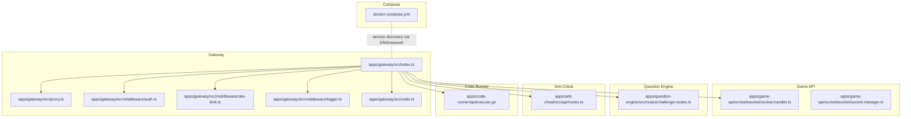
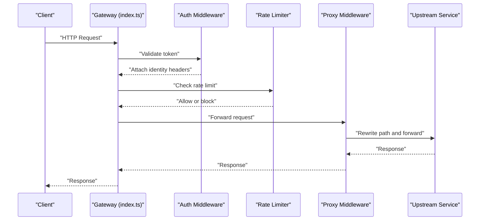
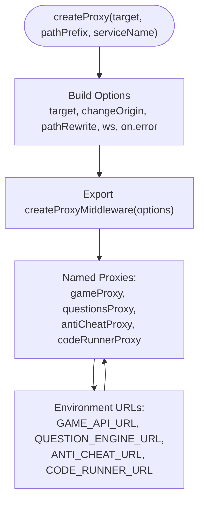
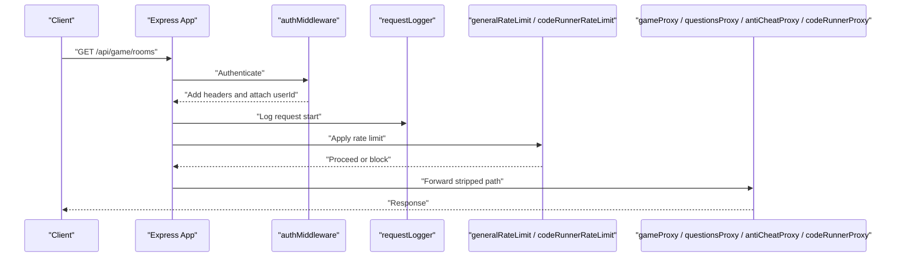
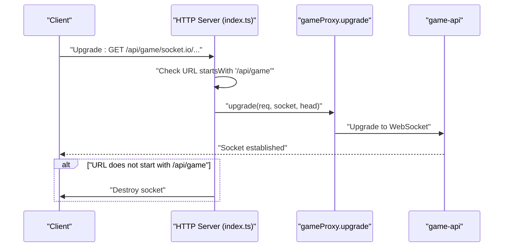
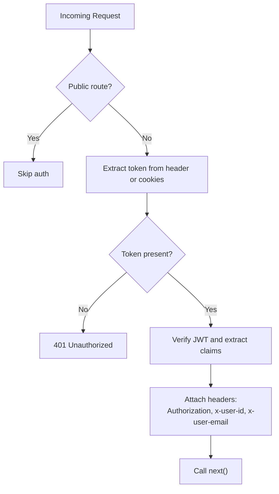
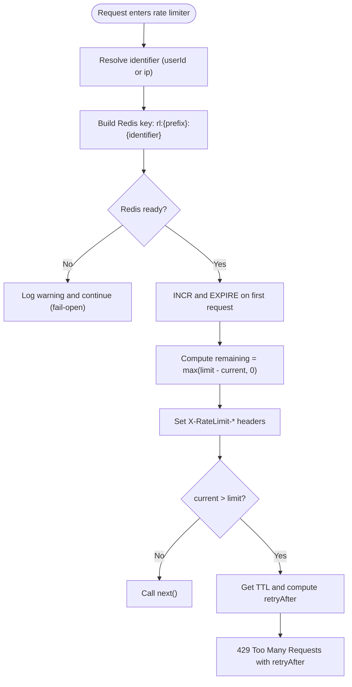
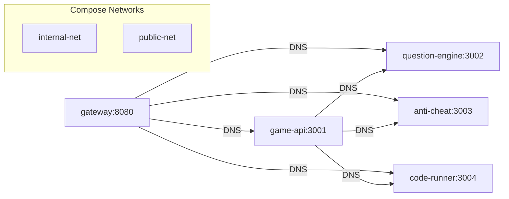
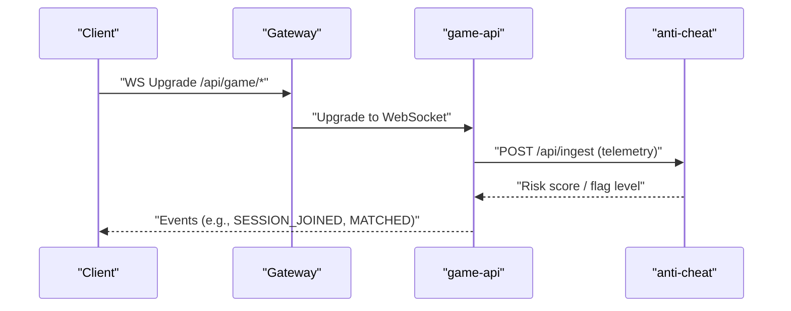
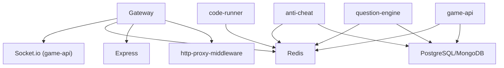

# Routing and Service Discovery

<cite>
**Referenced Files in This Document**
- [index.ts](file://apps/gateway/src/index.ts)
- [proxy.ts](file://apps/gateway/src/proxy.ts)
- [auth.ts](file://apps/gateway/src/middleware/auth.ts)
- [rate-limit.ts](file://apps/gateway/src/middleware/rate-limit.ts)
- [logger.ts](file://apps/gateway/src/middleware/logger.ts)
- [redis.ts](file://apps/gateway/src/redis.ts)
- [docker-compose.yml](file://docker-compose.yml)
- [Dockerfile](file://apps/gateway/Dockerfile)
- [socket.handler.ts](file://apps/game-api/src/websocket/socket.handler.ts)
- [socket.manager.ts](file://apps/game-api/src/websocket/socket.manager.ts)
- [challenge.routes.ts](file://apps/question-engine/src/routes/challenge.routes.ts)
- [routes.ts](file://apps/anti-cheat/src/api/routes.ts)
- [execute.go](file://apps/code-runner/api/execute.go)
</cite>

## Table of Contents
1. [Introduction](#introduction)
2. [Project Structure](#project-structure)
3. [Core Components](#core-components)
4. [Architecture Overview](#architecture-overview)
5. [Detailed Component Analysis](#detailed-component-analysis)
6. [Dependency Analysis](#dependency-analysis)
7. [Performance Considerations](#performance-considerations)
8. [Troubleshooting Guide](#troubleshooting-guide)
9. [Conclusion](#conclusion)

## Introduction
This document explains the Logic Forge API Gateway’s routing and service discovery mechanisms. It covers how incoming requests are proxied to backend microservices (game-api, question-engine, anti-cheat, and code-runner), how HTTP and WebSocket traffic are handled, and how rate limiting and authentication are enforced. It also documents the configuration and operational characteristics visible in the repository, including environment-driven service discovery via Docker networking and explicit URL overrides.

## Project Structure
The gateway is implemented as a Node.js/Express application that:
- Applies authentication and request logging
- Enforces rate limits
- Proxies HTTP requests to backend services
- Handles WebSocket upgrades for Socket.io sessions

**Diagram sources**
- [index.ts](file://apps/gateway/src/index.ts#L1-L117)
- [proxy.ts](file://apps/gateway/src/proxy.ts#L1-L78)
- [auth.ts](file://apps/gateway/src/middleware/auth.ts#L1-L65)
- [rate-limit.ts](file://apps/gateway/src/middleware/rate-limit.ts#L1-L80)
- [logger.ts](file://apps/gateway/src/middleware/logger.ts#L1-L25)
- [redis.ts](file://apps/gateway/src/redis.ts#L1-L55)
- [socket.handler.ts](file://apps/game-api/src/websocket/socket.handler.ts#L1-L310)
- [socket.manager.ts](file://apps/game-api/src/websocket/socket.manager.ts#L1-L56)
- [challenge.routes.ts](file://apps/question-engine/src/routes/challenge.routes.ts#L1-L28)
- [routes.ts](file://apps/anti-cheat/src/api/routes.ts#L1-L85)
- [execute.go](file://apps/code-runner/api/execute.go#L1-L54)
- [docker-compose.yml](file://docker-compose.yml#L1-L238)

**Section sources**
- [index.ts](file://apps/gateway/src/index.ts#L1-L117)
- [docker-compose.yml](file://docker-compose.yml#L157-L189)

## Core Components
- HTTP Proxy factory: Creates reverse proxies with path rewriting, origin changes, and WebSocket support.
- Route registration: Mounts proxies under /api/game, /api/questions, /api/anticheat, and /api/run.
- Authentication middleware: Extracts tokens from Authorization header or session cookies, attaches identity headers, and forwards tokens to upstream services.
- Request logging middleware: Measures response time and logs metadata.
- Rate limiter: Sliding-window implementation using Redis with fail-open behavior.
- Redis client: Lazy connection with retry strategy and readiness gating.
- WebSocket upgrade: Forwards upgrade requests for /api/game/* to the game-api service.

**Section sources**
- [proxy.ts](file://apps/gateway/src/proxy.ts#L1-L78)
- [index.ts](file://apps/gateway/src/index.ts#L52-L96)
- [auth.ts](file://apps/gateway/src/middleware/auth.ts#L1-L65)
- [logger.ts](file://apps/gateway/src/middleware/logger.ts#L1-L25)
- [rate-limit.ts](file://apps/gateway/src/middleware/rate-limit.ts#L1-L80)
- [redis.ts](file://apps/gateway/src/redis.ts#L1-L55)

## Architecture Overview
The gateway acts as a reverse proxy and orchestrator:
- Requests arrive at the gateway and are authenticated and rate-limited.
- HTTP requests are forwarded to appropriate backend services.
- WebSocket upgrade requests for game sessions are passed through to the game-api service.
- Backend services are discovered via Docker Compose networking and environment variables.

**Diagram sources**
- [index.ts](file://apps/gateway/src/index.ts#L48-L81)
- [auth.ts](file://apps/gateway/src/middleware/auth.ts#L18-L64)
- [rate-limit.ts](file://apps/gateway/src/middleware/rate-limit.ts#L15-L64)
- [proxy.ts](file://apps/gateway/src/proxy.ts#L17-L42)

## Detailed Component Analysis

### HTTP Proxy Implementation
The gateway uses http-proxy-middleware to create reverse proxies. Each proxy:
- Targets a backend service URL resolved from environment variables.
- Strips the gateway prefix before forwarding.
- Enables WebSocket support.
- Logs and returns a standardized error on proxy failures.

**Diagram sources**
- [proxy.ts](file://apps/gateway/src/proxy.ts#L17-L78)
- [docker-compose.yml](file://docker-compose.yml#L167-L170)

**Section sources**
- [proxy.ts](file://apps/gateway/src/proxy.ts#L1-L78)

### Route Definitions and Request Forwarding
Routes mounted by the gateway:
- /api/game → game-proxy (with general rate limit)
- /api/questions → questions-proxy (with general rate limit)
- /api/anticheat → anti-cheat proxy (with general rate limit)
- /api/run → code-runner proxy (with stricter rate limit)

**Diagram sources**
- [index.ts](file://apps/gateway/src/index.ts#L54-L64)
- [auth.ts](file://apps/gateway/src/middleware/auth.ts#L18-L64)
- [rate-limit.ts](file://apps/gateway/src/middleware/rate-limit.ts#L67-L79)
- [proxy.ts](file://apps/gateway/src/proxy.ts#L55-L77)

**Section sources**
- [index.ts](file://apps/gateway/src/index.ts#L52-L64)

### WebSocket Upgrade Handling for Socket.io
The gateway forwards WebSocket upgrade requests for /api/game/* to the game-api service. The upgrade handler is accessed via the gameProxy middleware’s exposed upgrade function.

**Diagram sources**
- [index.ts](file://apps/gateway/src/index.ts#L86-L96)
- [proxy.ts](file://apps/gateway/src/proxy.ts#L27-L38)

**Section sources**
- [index.ts](file://apps/gateway/src/index.ts#L86-L96)

### Authentication and Identity Propagation
The auth middleware:
- Skips validation for health checks and NextAuth callbacks.
- Accepts tokens from Authorization header or session cookies.
- Verifies the token and attaches identity headers for downstream services.

**Diagram sources**
- [auth.ts](file://apps/gateway/src/middleware/auth.ts#L18-L64)

**Section sources**
- [auth.ts](file://apps/gateway/src/middleware/auth.ts#L1-L65)

### Rate Limiting with Redis
The gateway implements sliding-window rate limiting:
- Identifiers: user ID (preferred) or IP address.
- Redis keys include a prefix per endpoint.
- Fail-open behavior when Redis is unavailable.
- Exposes X-RateLimit-* headers and responds with retry timing when exceeded.

**Diagram sources**
- [rate-limit.ts](file://apps/gateway/src/middleware/rate-limit.ts#L15-L64)
- [redis.ts](file://apps/gateway/src/redis.ts#L47-L52)

**Section sources**
- [rate-limit.ts](file://apps/gateway/src/middleware/rate-limit.ts#L1-L80)
- [redis.ts](file://apps/gateway/src/redis.ts#L1-L55)

### Service Discovery Strategies
- Docker Compose networking: Services communicate using service names as hostnames within the compose network.
- Environment overrides: The gateway reads explicit URLs from environment variables to override defaults.
- Health checks: Services define health endpoints to coordinate startup order.

**Diagram sources**
- [docker-compose.yml](file://docker-compose.yml#L157-L189)
- [index.ts](file://apps/gateway/src/index.ts#L167-L170)

**Section sources**
- [docker-compose.yml](file://docker-compose.yml#L1-L238)
- [index.ts](file://apps/gateway/src/index.ts#L167-L170)

### Backend Service Interfaces

#### Game API (HTTP + WebSocket)
- HTTP routes are handled by the game-api service.
- WebSocket events are registered and relay telemetry to anti-cheat.

**Diagram sources**
- [index.ts](file://apps/gateway/src/index.ts#L86-L96)
- [socket.handler.ts](file://apps/game-api/src/websocket/socket.handler.ts#L19-L60)
- [routes.ts](file://apps/anti-cheat/src/api/routes.ts#L44-L82)

**Section sources**
- [socket.handler.ts](file://apps/game-api/src/websocket/socket.handler.ts#L1-L310)
- [routes.ts](file://apps/anti-cheat/src/api/routes.ts#L1-L85)

#### Question Engine
- Exposes challenge-related endpoints under /api/v1.

**Section sources**
- [challenge.routes.ts](file://apps/question-engine/src/routes/challenge.routes.ts#L1-L28)

#### Anti-Cheat
- Provides ingestion endpoint for telemetry and retrieval endpoints for risk and flags.

**Section sources**
- [routes.ts](file://apps/anti-cheat/src/api/routes.ts#L1-L85)

#### Code Runner
- Executes code submissions with configurable time and memory limits.

**Section sources**
- [execute.go](file://apps/code-runner/api/execute.go#L1-L54)

## Dependency Analysis
- The gateway depends on:
  - http-proxy-middleware for reverse proxying
  - Express for routing and middleware composition
  - Redis for rate limiting
  - Socket.io for WebSocket handling (via game-proxy upgrade)
- Backend services depend on shared infrastructure (PostgreSQL, MongoDB, Redis) and inter-service secrets.

**Diagram sources**
- [proxy.ts](file://apps/gateway/src/proxy.ts#L4-L4)
- [index.ts](file://apps/gateway/src/index.ts#L4-L13)
- [redis.ts](file://apps/gateway/src/redis.ts#L2-L2)
- [docker-compose.yml](file://docker-compose.yml#L1-L238)

**Section sources**
- [proxy.ts](file://apps/gateway/src/proxy.ts#L1-L78)
- [index.ts](file://apps/gateway/src/index.ts#L1-L117)
- [redis.ts](file://apps/gateway/src/redis.ts#L1-L55)
- [docker-compose.yml](file://docker-compose.yml#L1-L238)

## Performance Considerations
- Path rewriting avoids redundant prefixes on upstream requests.
- WebSocket support is enabled for real-time features with minimal overhead.
- Redis lazy connection and retry strategy reduce startup latency and transient failure impact.
- Rate limiting is applied per endpoint with distinct limits to protect resource-intensive services.
- The gateway sets trust proxy to ensure accurate client IP detection behind Docker networks.

[No sources needed since this section provides general guidance]

## Troubleshooting Guide
Common issues and diagnostics:
- Proxy errors: The proxy emits a structured error and returns a standardized Bad Gateway response when upstream services are unreachable or misbehaving.
- Unhandled gateway errors: A global Express error handler ensures a safe 502 response if an unexpected error occurs.
- Rate limit failures: When Redis is unavailable, the limiter fails open and logs a warning; monitor connectivity to restore enforcement.
- WebSocket upgrades: Only /api/game/* upgrades are accepted; other paths are destroyed to prevent misuse.
- Authentication failures: Missing or invalid tokens result in 401 responses; verify Authorization header or session cookies.

**Section sources**
- [proxy.ts](file://apps/gateway/src/proxy.ts#L29-L38)
- [index.ts](file://apps/gateway/src/index.ts#L66-L81)
- [rate-limit.ts](file://apps/gateway/src/middleware/rate-limit.ts#L25-L33)
- [index.ts](file://apps/gateway/src/index.ts#L86-L96)
- [auth.ts](file://apps/gateway/src/middleware/auth.ts#L47-L50)

## Conclusion
The Logic Forge API Gateway provides a robust, modular foundation for routing traffic to backend microservices. It enforces authentication and rate limits, supports both HTTP and WebSocket traffic, and leverages Docker Compose for service discovery. The proxy configuration is centralized and extensible, while Redis-backed rate limiting offers resilience with fail-open semantics. Together, these components form a scalable and observable entry point for the platform.