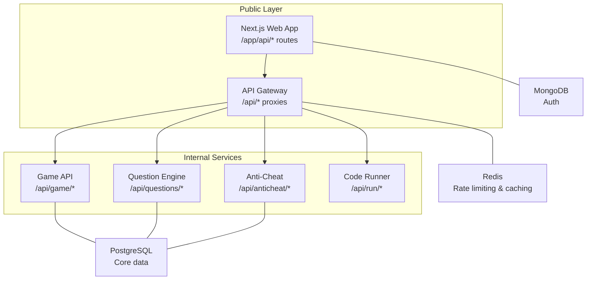
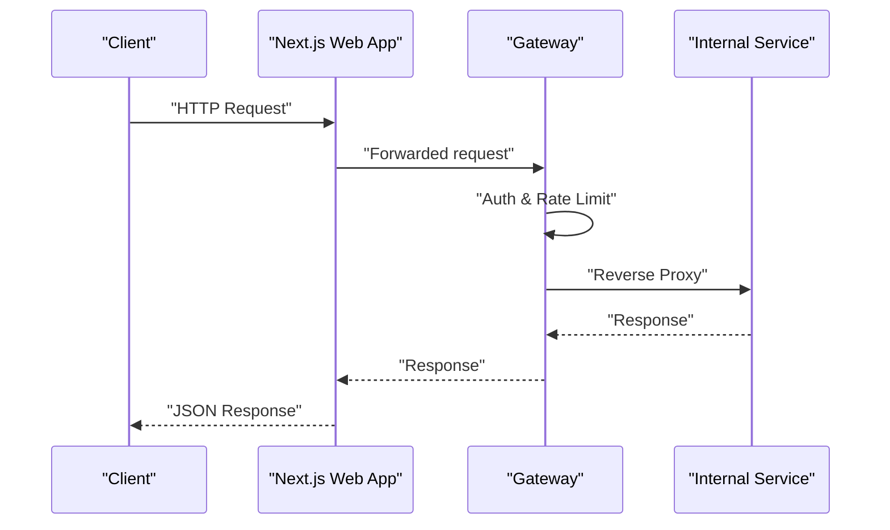
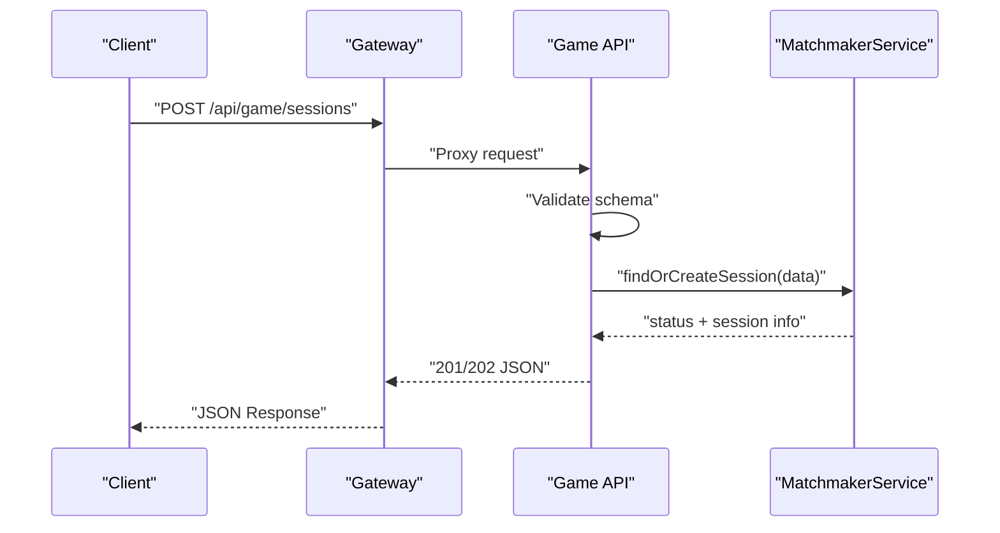
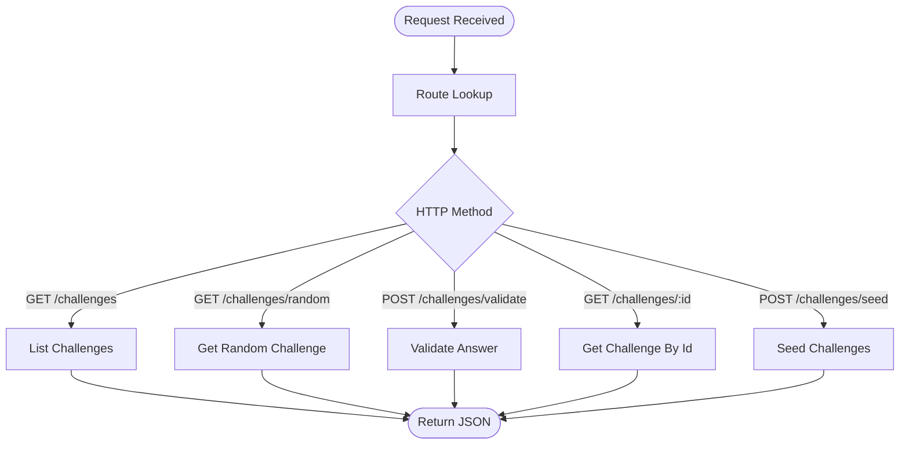
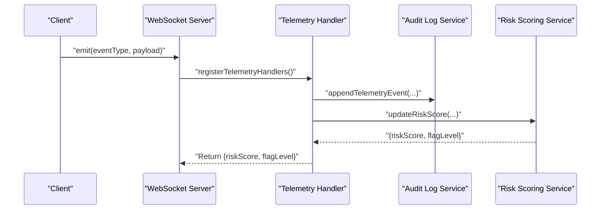
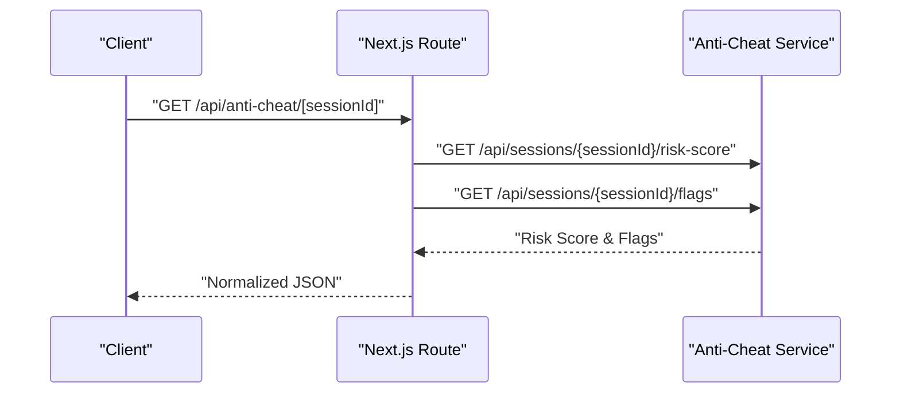
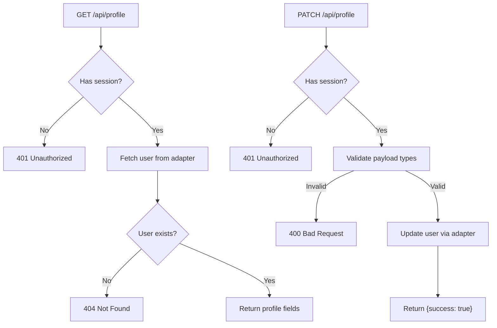
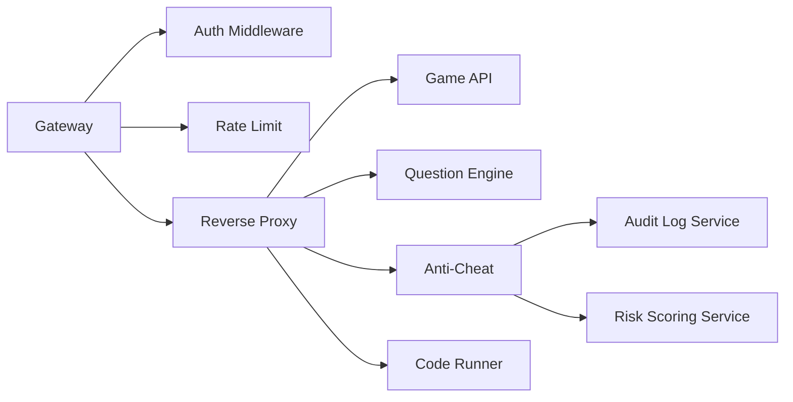

# API Documentation Standards

<cite>
**Referenced Files in This Document**
- [README.md](file://README.md)
- [session.routes.ts](file://apps/game-api/src/routes/session.routes.ts)
- [challenge.routes.ts](file://apps/question-engine/src/routes/challenge.routes.ts)
- [error.middleware.ts](file://apps/question-engine/src/middleware/error.middleware.ts)
- [auth.ts](file://apps/gateway/src/middleware/auth.ts)
- [rate-limit.ts](file://apps/gateway/src/middleware/rate-limit.ts)
- [proxy.ts](file://apps/gateway/src/proxy.ts)
- [telemetry.handler.ts](file://apps/anti-cheat/src/handlers/telemetry.handler.ts)
- [route.ts](file://apps/web/app/api/anti-cheat/[sessionId]/route.ts)
- [profile.route.ts](file://apps/web/app/api/profile/route.ts)
</cite>

## Table of Contents
1. [Introduction](#introduction)
2. [Project Structure](#project-structure)
3. [Core Components](#core-components)
4. [Architecture Overview](#architecture-overview)
5. [Detailed Component Analysis](#detailed-component-analysis)
6. [Dependency Analysis](#dependency-analysis)
7. [Performance Considerations](#performance-considerations)
8. [Troubleshooting Guide](#troubleshooting-guide)
9. [Conclusion](#conclusion)
10. [Appendices](#appendices)

## Introduction
This document defines API documentation standards and patterns for Logic Forge services. It consolidates consistent request/response formatting, error handling, status code conventions, versioning strategy, documentation generation processes, and consistency guidelines across all API implementations. It also covers standardized error response formats, validation patterns, security headers, CRUD operation patterns, real-time API patterns, testing methodologies, mock data generation, documentation maintenance procedures, API evolution strategies, backward compatibility considerations, and deprecation policies.

## Project Structure
Logic Forge is a monorepo organized around Turborepo and pnpm workspaces. The API surface is exposed via:
- A public API Gateway that proxies internal services and supports WebSockets.
- Internal services: Game API, Question Engine, Anti-Cheat, and Code Runner.
- A Next.js web application that exposes selected endpoints and orchestrates client-side flows.

**Diagram sources**
- [README.md](file://README.md#L8-L18)
- [proxy.ts](file://apps/gateway/src/proxy.ts#L46-L77)

**Section sources**
- [README.md](file://README.md#L8-L18)

## Core Components
This section documents the foundational patterns used across Logic Forge APIs.

- Versioning Strategy
  - All public endpoints include a versioned path segment (for example, /api/v1). This enables controlled evolution and safe coexistence of multiple API versions.
  - Example: Challenge endpoints use /api/v1/challenges.

- Request Validation
  - Strong typing and schema validation are enforced at the route boundary using a schema library.
  - Validation failures return structured error responses with field-specific details.

- Error Handling
  - Centralized error middleware converts validation errors and typed API errors into consistent JSON responses.
  - Unhandled exceptions are logged and returned as a generic internal error.

- Status Codes
  - 200 OK for successful GET/PUT/PATCH/DELETE.
  - 201 Created for resource creation outcomes.
  - 202 Accepted for asynchronous initiation.
  - 400 Bad Request for validation and request errors.
  - 401 Unauthorized for missing or invalid authentication.
  - 403 Forbidden for insufficient permissions.
  - 404 Not Found for absent resources.
  - 429 Too Many Requests for rate limit violations.
  - 500 Internal Server Error for unexpected failures.

- Security Headers and Authentication
  - JWT-based bearer tokens are preferred via Authorization: Bearer <token>.
  - For development/production, session cookies are supported as a fallback.
  - On successful validation, downstream headers are forwarded to internal services for identity propagation.

- Rate Limiting
  - Sliding-window rate limiting via Redis with fail-open behavior when Redis is unavailable.
  - Separate limits for general usage and code execution.

- Real-Time APIs
  - WebSocket events are defined with explicit event types and payloads.
  - Event handlers process telemetry and update risk scores asynchronously.

**Section sources**
- [challenge.routes.ts](file://apps/question-engine/src/routes/challenge.routes.ts#L12-L25)
- [session.routes.ts](file://apps/game-api/src/routes/session.routes.ts#L19-L35)
- [error.middleware.ts](file://apps/question-engine/src/middleware/error.middleware.ts#L6-L48)
- [auth.ts](file://apps/gateway/src/middleware/auth.ts#L18-L64)
- [rate-limit.ts](file://apps/gateway/src/middleware/rate-limit.ts#L15-L79)
- [telemetry.handler.ts](file://apps/anti-cheat/src/handlers/telemetry.handler.ts#L22-L51)

## Architecture Overview
The API architecture centers on a single public entrypoint (Gateway) that routes traffic to internal services and manages authentication, rate limiting, and WebSocket upgrades.

**Diagram sources**
- [proxy.ts](file://apps/gateway/src/proxy.ts#L17-L42)
- [auth.ts](file://apps/gateway/src/middleware/auth.ts#L18-L64)
- [rate-limit.ts](file://apps/gateway/src/middleware/rate-limit.ts#L15-L79)

## Detailed Component Analysis

### Session Management API (Game API)
- Purpose: Create and manage game sessions with matchmaking outcomes.
- Validation: Strict schema validation for session creation parameters.
- Responses:
  - 201 Created when a match is found.
  - 202 Accepted when queued for a future match.
  - 400 Bad Request for validation failures.
  - 400 Bad Request for internal errors.

**Diagram sources**
- [session.routes.ts](file://apps/game-api/src/routes/session.routes.ts#L19-L35)

**Section sources**
- [session.routes.ts](file://apps/game-api/src/routes/session.routes.ts#L7-L35)

### Question Engine API (Versioned)
- Purpose: Retrieve challenges, validate answers, seed data, and fetch individual challenges.
- Versioning: All endpoints include /api/v1.
- Methods:
  - GET /api/v1/challenges
  - GET /api/v1/challenges/random
  - POST /api/v1/challenges/validate
  - GET /api/v1/challenges/:id
  - POST /api/v1/challenges/seed

**Diagram sources**
- [challenge.routes.ts](file://apps/question-engine/src/routes/challenge.routes.ts#L12-L25)

**Section sources**
- [challenge.routes.ts](file://apps/question-engine/src/routes/challenge.routes.ts#L12-L25)

### Anti-Cheat Telemetry API (Real-Time)
- Purpose: Capture telemetry events and compute risk scores.
- Event Types: Defined set of telemetry event types.
- Handlers: Register event listeners and process events through audit logging and risk scoring services.
- Response: Returns computed risk score and flag level.

**Diagram sources**
- [telemetry.handler.ts](file://apps/anti-cheat/src/handlers/telemetry.handler.ts#L54-L81)

**Section sources**
- [telemetry.handler.ts](file://apps/anti-cheat/src/handlers/telemetry.handler.ts#L22-L51)

### Web App Orchestration (Anti-Cheat Aggregation)
- Purpose: Expose aggregated anti-cheat metrics via Next.js app routes.
- Behavior: Fetches risk score and flags concurrently and returns normalized JSON.

**Diagram sources**
- [route.ts](file://apps/web/app/api/anti-cheat/[sessionId]/route.ts#L15-L37)

**Section sources**
- [route.ts](file://apps/web/app/api/anti-cheat/[sessionId]/route.ts#L1-L38)

### Profile API (CRUD)
- Purpose: Retrieve and update user profile information.
- Authentication: Requires an active session.
- Validation: Payload types validated before update.
- Responses:
  - 401 Unauthorized for missing session.
  - 404 Not Found if user does not exist.
  - 400 Bad Request for invalid payload.
  - 200 OK with success indicator on update.

**Diagram sources**
- [profile.route.ts](file://apps/web/app/api/profile/route.ts#L5-L48)

**Section sources**
- [profile.route.ts](file://apps/web/app/api/profile/route.ts#L5-L48)

## Dependency Analysis
The Gateway acts as a central coordinator for authentication, rate limiting, and proxying to internal services. Anti-Cheat telemetry integrates with audit logging and risk scoring services. The Web app orchestrates cross-service calls for anti-cheat metrics.

**Diagram sources**
- [proxy.ts](file://apps/gateway/src/proxy.ts#L17-L42)
- [auth.ts](file://apps/gateway/src/middleware/auth.ts#L18-L64)
- [rate-limit.ts](file://apps/gateway/src/middleware/rate-limit.ts#L15-L79)
- [telemetry.handler.ts](file://apps/anti-cheat/src/handlers/telemetry.handler.ts#L33-L50)

**Section sources**
- [proxy.ts](file://apps/gateway/src/proxy.ts#L46-L77)
- [auth.ts](file://apps/gateway/src/middleware/auth.ts#L18-L64)
- [rate-limit.ts](file://apps/gateway/src/middleware/rate-limit.ts#L15-L79)
- [telemetry.handler.ts](file://apps/anti-cheat/src/handlers/telemetry.handler.ts#L33-L50)

## Performance Considerations
- Use versioned endpoints to enable progressive rollout and A/B testing.
- Apply sliding-window rate limiting with fail-open behavior to maintain availability under Redis failure.
- Normalize client-facing responses to reduce payload sizes and improve caching.
- For real-time telemetry, batch and debounce events to minimize network overhead.
- Prefer concurrent fetching for composite data retrieval (for example, anti-cheat risk score and flags).

## Troubleshooting Guide
- Authentication Failures
  - Verify Authorization header format and token validity.
  - Confirm session cookie names for development and production environments.
  - Inspect forwarded headers for downstream propagation.

- Rate Limiting
  - Check X-RateLimit-* headers to understand remaining quota.
  - Investigate Redis connectivity when limits appear inconsistent.

- Proxy Errors
  - Review Gateway proxy error logs for upstream service failures.
  - Validate service URLs and path prefixes.

- Validation Errors
  - Inspect structured validation error details returned by the error middleware.
  - Ensure request payloads conform to documented schemas.

**Section sources**
- [auth.ts](file://apps/gateway/src/middleware/auth.ts#L32-L63)
- [rate-limit.ts](file://apps/gateway/src/middleware/rate-limit.ts#L25-L63)
- [proxy.ts](file://apps/gateway/src/proxy.ts#L30-L37)
- [error.middleware.ts](file://apps/question-engine/src/middleware/error.middleware.ts#L12-L23)

## Conclusion
These standards unify API behavior across Logic Forge services by enforcing consistent versioning, validation, error handling, status codes, authentication, rate limiting, and real-time patterns. They provide a foundation for reliable documentation, predictable client integrations, and safe API evolution.

## Appendices

### API Versioning Strategy
- All public endpoints include a versioned path segment (for example, /api/v1).
- Maintain backward compatibility for at least one major release cycle after introducing breaking changes.
- Announce deprecations with migration timelines and provide upgrade paths.

**Section sources**
- [challenge.routes.ts](file://apps/question-engine/src/routes/challenge.routes.ts#L12-L25)

### Documentation Generation Processes
- Generate OpenAPI/Swagger definitions from route handlers and shared schemas.
- Use automated tooling to keep documentation synchronized with code changes.
- Publish documentation to a centralized location and link from the developer portal.

### Consistency Guidelines
- Use plural nouns for collections and consistent naming for query parameters and body fields.
- Return consistent top-level JSON shapes: { data } for successful reads and { success } for write confirmations.
- Employ standardized error envelopes with fields for code, message, and optional details.

### Standardized Error Response Formats
- Validation errors: { success: false, error: { code: "VALIDATION_ERROR", message: "...", details: { ... } } }
- Typed API errors: { success: false, error: { code, message, details? } }
- Internal errors: { success: false, error: { code: "INTERNAL_ERROR", message: "An unexpected error occurred" } }

**Section sources**
- [error.middleware.ts](file://apps/question-engine/src/middleware/error.middleware.ts#L14-L46)

### Validation Patterns
- Define strict schemas at the route boundary.
- Flatten and normalize validation errors for client consumption.
- Avoid leaking internal validation messages; prefer concise, actionable messages.

**Section sources**
- [session.routes.ts](file://apps/game-api/src/routes/session.routes.ts#L20-L22)

### Security Headers and Authentication
- Prefer Authorization: Bearer <JWT> for API clients.
- Support session cookies as a fallback for browser-based flows.
- Propagate identity headers downstream: x-user-id, x-user-email.

**Section sources**
- [auth.ts](file://apps/gateway/src/middleware/auth.ts#L32-L59)

### Real-Time API Patterns
- Define explicit event types and payload contracts.
- Use WebSocket handlers to process events and update state asynchronously.
- Return minimal acknowledgment payloads and stream updates via events.

**Section sources**
- [telemetry.handler.ts](file://apps/anti-cheat/src/handlers/telemetry.handler.ts#L54-L81)

### API Testing Methodologies
- Unit tests for route handlers with mocked services.
- Integration tests validating end-to-end flows through the Gateway.
- Contract tests ensuring stable API contracts between services.

### Mock Data Generation
- Maintain deterministic fixtures for challenges and seeds.
- Use factories to generate realistic but synthetic datasets for load testing.

### Documentation Maintenance Procedures
- Treat API documentation as code: review alongside pull requests.
- Automate checks to prevent drift between implementation and docs.
- Establish a review process for any API changes.

### API Evolution Strategies
- Introduce new endpoints under new paths or versions.
- Mark deprecated endpoints with appropriate status codes and headers.
- Provide deprecation timelines and migration guides.