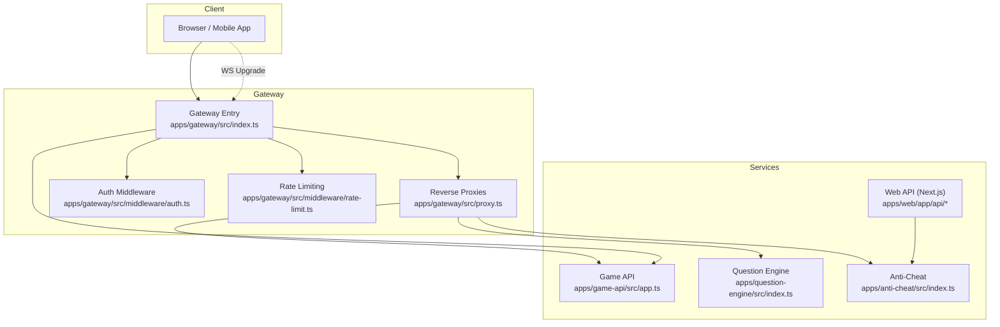
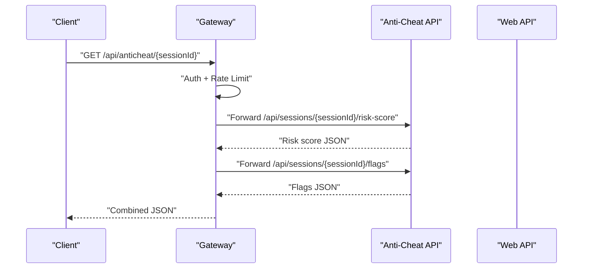
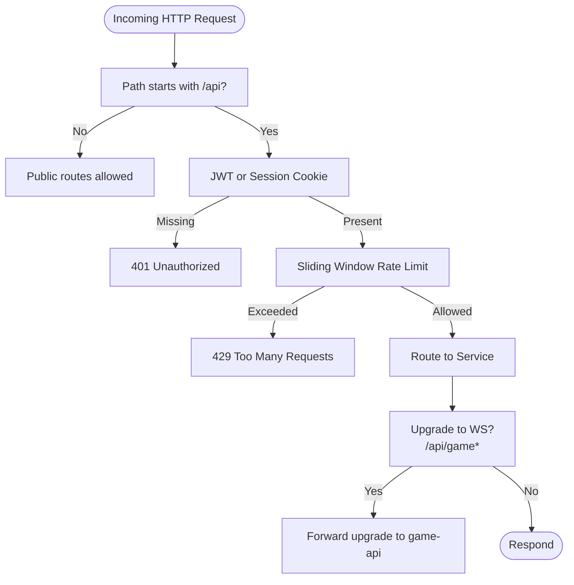
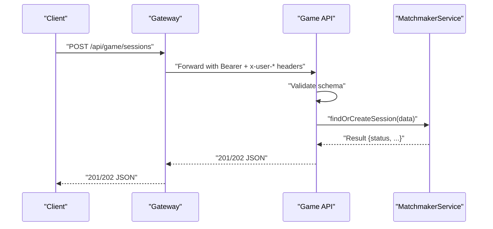
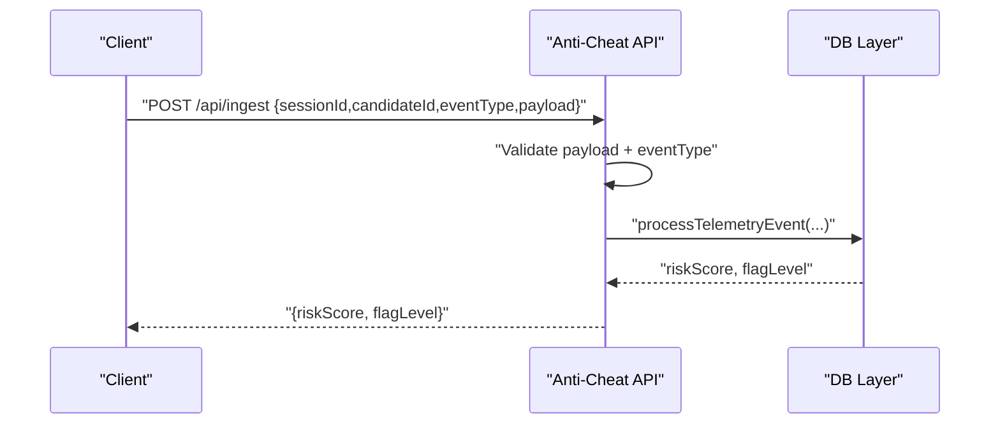
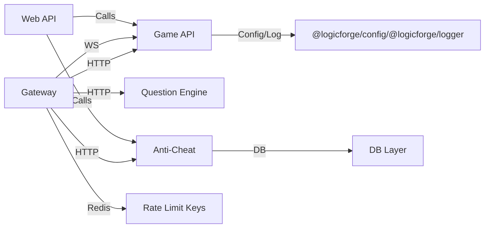

# API Reference

<cite>
**Referenced Files in This Document**
- [apps/gateway/src/index.ts](file://apps/gateway/src/index.ts)
- [apps/gateway/src/proxy.ts](file://apps/gateway/src/proxy.ts)
- [apps/gateway/src/middleware/auth.ts](file://apps/gateway/src/middleware/auth.ts)
- [apps/gateway/src/middleware/rate-limit.ts](file://apps/gateway/src/middleware/rate-limit.ts)
- [apps/game-api/src/app.ts](file://apps/game-api/src/app.ts)
- [apps/game-api/src/routes/session.routes.ts](file://apps/game-api/src/routes/session.routes.ts)
- [apps/anti-cheat/src/index.ts](file://apps/anti-cheat/src/index.ts)
- [apps/anti-cheat/src/api/routes.ts](file://apps/anti-cheat/src/api/routes.ts)
- [apps/question-engine/src/index.ts](file://apps/question-engine/src/index.ts)
- [apps/question-engine/src/routes/index.ts](file://apps/question-engine/src/routes/index.ts)
- [apps/web/app/api/auth/[...nextauth]/route.ts](file://apps/web/app/api/auth/[...nextauth]/route.ts)
- [apps/web/app/api/profile/route.ts](file://apps/web/app/api/profile/route.ts)
- [apps/web/app/api/match-history/route.ts](file://apps/web/app/api/match-history/route.ts)
- [apps/web/app/api/activity-heatmap/route.ts](file://apps/web/app/api/activity-heatmap/route.ts)
- [apps/web/app/api/anti-cheat/[sessionId]/route.ts](file://apps/web/app/api/anti-cheat/[sessionId]/route.ts)
- [apps/web/app/api/story/chat/route.ts](file://apps/web/app/api/story/chat/route.ts)
</cite>

## Table of Contents
1. [Introduction](#introduction)
2. [Project Structure](#project-structure)
3. [Core Components](#core-components)
4. [Architecture Overview](#architecture-overview)
5. [Detailed Component Analysis](#detailed-component-analysis)
6. [Dependency Analysis](#dependency-analysis)
7. [Performance Considerations](#performance-considerations)
8. [Troubleshooting Guide](#troubleshooting-guide)
9. [Conclusion](#conclusion)
10. [Appendices](#appendices)

## Introduction
This document provides comprehensive API documentation for Logic Forge services. It covers:
- REST endpoints across the Gateway, Game API, Question Engine, Anti-Cheat, and Web API layers
- WebSocket connections for real-time interactions
- Internal service APIs and proxying
- Authentication, rate limiting, and security posture
- Error handling, status codes, and versioning strategy
- Practical examples, client implementation guidelines, and performance tips
- Testing, debugging, and monitoring approaches

## Project Structure
Logic Forge is a microservices-based system with a central Gateway that routes traffic to backend services and a Web application that serves the frontend and exposes Next.js API routes. The Gateway applies authentication and rate limiting, proxies requests to services, and forwards WebSocket upgrades for the Game API.

**Diagram sources**
- [apps/gateway/src/index.ts](file://apps/gateway/src/index.ts#L24-L100)
- [apps/gateway/src/proxy.ts](file://apps/gateway/src/proxy.ts#L17-L78)
- [apps/gateway/src/middleware/auth.ts](file://apps/gateway/src/middleware/auth.ts#L18-L64)
- [apps/gateway/src/middleware/rate-limit.ts](file://apps/gateway/src/middleware/rate-limit.ts#L15-L79)
- [apps/game-api/src/app.ts](file://apps/game-api/src/app.ts#L12-L31)
- [apps/question-engine/src/index.ts](file://apps/question-engine/src/index.ts#L13-L28)
- [apps/anti-cheat/src/index.ts](file://apps/anti-cheat/src/index.ts#L12-L34)
- [apps/web/app/api/anti-cheat/[sessionId]/route.ts](file://apps/web/app/api/anti-cheat/[sessionId]/route.ts#L3-L37)

**Section sources**
- [apps/gateway/src/index.ts](file://apps/gateway/src/index.ts#L24-L100)
- [apps/gateway/src/proxy.ts](file://apps/gateway/src/proxy.ts#L17-L78)
- [apps/gateway/src/middleware/auth.ts](file://apps/gateway/src/middleware/auth.ts#L18-L64)
- [apps/gateway/src/middleware/rate-limit.ts](file://apps/gateway/src/middleware/rate-limit.ts#L15-L79)
- [apps/game-api/src/app.ts](file://apps/game-api/src/app.ts#L12-L31)
- [apps/question-engine/src/index.ts](file://apps/question-engine/src/index.ts#L13-L28)
- [apps/anti-cheat/src/index.ts](file://apps/anti-cheat/src/index.ts#L12-L34)
- [apps/web/app/api/anti-cheat/[sessionId]/route.ts](file://apps/web/app/api/anti-cheat/[sessionId]/route.ts#L3-L37)

## Core Components
- Gateway: Centralized entrypoint applying security, auth, rate limiting, and proxying to services. It also handles WebSocket upgrades for the Game API.
- Game API: Exposes session creation and health checks via REST; integrates with WebSocket for real-time gameplay.
- Question Engine: Provides challenge and health endpoints.
- Anti-Cheat: Exposes telemetry ingestion and session risk/flag retrieval via REST; supports WebSocket channels for live telemetry.
- Web API: Next.js API routes for authentication, profile, match history, activity heatmap, anti-cheat summary, and story chat.

**Section sources**
- [apps/gateway/src/index.ts](file://apps/gateway/src/index.ts#L24-L100)
- [apps/game-api/src/app.ts](file://apps/game-api/src/app.ts#L12-L31)
- [apps/question-engine/src/index.ts](file://apps/question-engine/src/index.ts#L13-L28)
- [apps/anti-cheat/src/index.ts](file://apps/anti-cheat/src/index.ts#L12-L34)
- [apps/web/app/api/auth/[...nextauth]/route.ts](file://apps/web/app/api/auth/[...nextauth]/route.ts#L1-L5)
- [apps/web/app/api/profile/route.ts](file://apps/web/app/api/profile/route.ts#L5-L48)
- [apps/web/app/api/match-history/route.ts](file://apps/web/app/api/match-history/route.ts#L6-L40)
- [apps/web/app/api/activity-heatmap/route.ts](file://apps/web/app/api/activity-heatmap/route.ts#L10-L42)
- [apps/web/app/api/anti-cheat/[sessionId]/route.ts](file://apps/web/app/api/anti-cheat/[sessionId]/route.ts#L6-L37)
- [apps/web/app/api/story/chat/route.ts](file://apps/web/app/api/story/chat/route.ts#L87-L178)

## Architecture Overview
The Gateway acts as a reverse proxy and orchestrator:
- Applies Helmet and CORS for security and cross-origin allowance
- Enforces authentication via JWT or NextAuth session cookies
- Enforces sliding-window rate limits using Redis
- Proxies HTTP requests to backend services
- Upgrades WebSocket connections for the Game API

**Diagram sources**
- [apps/gateway/src/index.ts](file://apps/gateway/src/index.ts#L52-L64)
- [apps/gateway/src/middleware/auth.ts](file://apps/gateway/src/middleware/auth.ts#L18-L64)
- [apps/gateway/src/middleware/rate-limit.ts](file://apps/gateway/src/middleware/rate-limit.ts#L15-L79)
- [apps/anti-cheat/src/api/routes.ts](file://apps/anti-cheat/src/api/routes.ts#L13-L42)
- [apps/web/app/api/anti-cheat/[sessionId]/route.ts](file://apps/web/app/api/anti-cheat/[sessionId]/route.ts#L15-L33)

## Detailed Component Analysis

### Gateway
- Purpose: Single entrypoint for all client traffic; enforces auth and rate limits; proxies to services; handles WebSocket upgrades.
- Key behaviors:
  - Health check: GET /health
  - Auth middleware: Bearer token or NextAuth session cookie
  - Rate limiting: General and code-runner variants
  - Proxies: /api/game → game-api, /api/questions → question-engine, /api/anticheat → anti-cheat, /api/run → code-runner
  - WebSocket upgrade: Only for /api/game/*

**Diagram sources**
- [apps/gateway/src/index.ts](file://apps/gateway/src/index.ts#L44-L96)
- [apps/gateway/src/middleware/auth.ts](file://apps/gateway/src/middleware/auth.ts#L18-L64)
- [apps/gateway/src/middleware/rate-limit.ts](file://apps/gateway/src/middleware/rate-limit.ts#L15-L79)
- [apps/gateway/src/proxy.ts](file://apps/gateway/src/proxy.ts#L17-L42)

**Section sources**
- [apps/gateway/src/index.ts](file://apps/gateway/src/index.ts#L44-L100)
- [apps/gateway/src/middleware/auth.ts](file://apps/gateway/src/middleware/auth.ts#L18-L64)
- [apps/gateway/src/middleware/rate-limit.ts](file://apps/gateway/src/middleware/rate-limit.ts#L15-L79)
- [apps/gateway/src/proxy.ts](file://apps/gateway/src/proxy.ts#L17-L78)

### Game API
- Versioning: /api/v1
- Base path: /api/v1
- Endpoints:
  - POST /api/v1/sessions
    - Purpose: Create or join a session via matchmaker
    - Auth: Requires JWT forwarded by Gateway
    - Request schema: mode, playerFormat, sessionType, category, userId, socketId (optional)
    - Validation: Zod schema enforced; invalid inputs return 400 with flattened error details
    - Responses:
      - 201: MATCHED
      - 202: QUEUED
      - 400: Validation or business error
    - Example request path: [apps/game-api/src/routes/session.routes.ts](file://apps/game-api/src/routes/session.routes.ts#L19-L35)
    - Example response path: [apps/game-api/src/routes/session.routes.ts](file://apps/game-api/src/routes/session.routes.ts#L31-L34)
- Health check: GET /api/v1/health
- Error handling: ZodError → 400; ApiError → pass-through; others → 500 INTERNAL_ERROR

**Diagram sources**
- [apps/gateway/src/index.ts](file://apps/gateway/src/index.ts#L54-L55)
- [apps/game-api/src/app.ts](file://apps/game-api/src/app.ts#L25-L31)
- [apps/game-api/src/routes/session.routes.ts](file://apps/game-api/src/routes/session.routes.ts#L19-L35)

**Section sources**
- [apps/game-api/src/app.ts](file://apps/game-api/src/app.ts#L25-L62)
- [apps/game-api/src/routes/session.routes.ts](file://apps/game-api/src/routes/session.routes.ts#L7-L35)

### Question Engine
- Versioning: /api/v1
- Base path: /api/v1
- Endpoints:
  - /health: GET /api/v1/health
  - /challenges: Mounted under /api/v1/challenges
- Error handling: Centralized error middleware

**Section sources**
- [apps/question-engine/src/index.ts](file://apps/question-engine/src/index.ts#L13-L28)
- [apps/question-engine/src/routes/index.ts](file://apps/question-engine/src/routes/index.ts#L7-L8)

### Anti-Cheat
- REST API:
  - GET /api/sessions/{id}/risk-score: Returns latest risk score and metadata
  - GET /api/sessions/{id}/flags: Returns recent flags for a session
  - POST /api/ingest: Ingests telemetry events; validates payload and event type
- WebSocket:
  - Namespace: /telemetry
  - Event: JOIN_TELEMETRY { sessionId }
  - Handlers registered for telemetry events
- Health: GET /api/health

**Diagram sources**
- [apps/anti-cheat/src/api/routes.ts](file://apps/anti-cheat/src/api/routes.ts#L44-L82)
- [apps/anti-cheat/src/index.ts](file://apps/anti-cheat/src/index.ts#L24-L29)

**Section sources**
- [apps/anti-cheat/src/api/routes.ts](file://apps/anti-cheat/src/api/routes.ts#L13-L82)
- [apps/anti-cheat/src/index.ts](file://apps/anti-cheat/src/index.ts#L15-L34)

### Web API (Next.js)
- Authentication:
  - GET /api/auth/[...nextauth]: Delegates to NextAuth v5
- Profile:
  - GET /api/profile: Returns displayName and bio; requires auth
  - PATCH /api/profile: Updates displayName and bio; requires auth
- Match History:
  - GET /api/match-history: Returns last 50 records and global score for the user
- Activity Heatmap:
  - GET /api/activity-heatmap: Returns daily counts for the past year
- Anti-Cheat Summary:
  - GET /api/anti-cheat/{sessionId}: Aggregates risk score and flags from Anti-Cheat service
- Story Chat:
  - POST /api/story/chat: Streams Gemini responses as Server-Sent Events; includes retry with exponential backoff

**Section sources**
- [apps/web/app/api/auth/[...nextauth]/route.ts](file://apps/web/app/api/auth/[...nextauth]/route.ts#L1-L5)
- [apps/web/app/api/profile/route.ts](file://apps/web/app/api/profile/route.ts#L5-L48)
- [apps/web/app/api/match-history/route.ts](file://apps/web/app/api/match-history/route.ts#L6-L40)
- [apps/web/app/api/activity-heatmap/route.ts](file://apps/web/app/api/activity-heatmap/route.ts#L10-L42)
- [apps/web/app/api/anti-cheat/[sessionId]/route.ts](file://apps/web/app/api/anti-cheat/[sessionId]/route.ts#L6-L37)
- [apps/web/app/api/story/chat/route.ts](file://apps/web/app/api/story/chat/route.ts#L87-L178)

## Dependency Analysis
- Gateway depends on:
  - Redis for rate limiting
  - Services via http-proxy-middleware
  - NextAuth secret for JWT verification
- Game API depends on:
  - Matchmaker service injected into the Express app
  - Config and logging packages
- Anti-Cheat depends on:
  - DB layer for persistence
  - Socket.IO for telemetry channel
- Web API depends on:
  - NextAuth for session management
  - DB adapter for user data
  - External Gemini API for story chat

**Diagram sources**
- [apps/gateway/src/proxy.ts](file://apps/gateway/src/proxy.ts#L46-L53)
- [apps/gateway/src/middleware/rate-limit.ts](file://apps/gateway/src/middleware/rate-limit.ts#L36-L41)
- [apps/anti-cheat/src/index.ts](file://apps/anti-cheat/src/index.ts#L12-L29)
- [apps/game-api/src/app.ts](file://apps/game-api/src/app.ts#L9-L10)

**Section sources**
- [apps/gateway/src/proxy.ts](file://apps/gateway/src/proxy.ts#L46-L53)
- [apps/gateway/src/middleware/rate-limit.ts](file://apps/gateway/src/middleware/rate-limit.ts#L36-L41)
- [apps/anti-cheat/src/index.ts](file://apps/anti-cheat/src/index.ts#L12-L29)
- [apps/game-api/src/app.ts](file://apps/game-api/src/app.ts#L9-L10)

## Performance Considerations
- Rate limiting:
  - General: 120 requests per 60 seconds per user/IP
  - Code Runner: 10 requests per 60 seconds per user/IP
  - Behavior: Fail-open when Redis is unavailable; exposes X-RateLimit headers
- WebSocket:
  - Only /api/game/* is upgraded; ensure clients connect to the correct path
- Caching:
  - Web anti-cheat summary uses no-store to avoid stale data
- Streaming:
  - Story chat streams SSE; client should handle partial chunks and [DONE] marker

[No sources needed since this section provides general guidance]

## Troubleshooting Guide
- 401 Unauthorized:
  - Missing or invalid Authorization header or NextAuth session cookie
  - Verify NEXTAUTH_SECRET and cookie names
- 429 Too Many Requests:
  - Exceeded rate limit; inspect X-RateLimit-Remaining and retry-after behavior
- 502 Bad Gateway:
  - Proxy error to upstream service; check service health and network connectivity
- 500 Internal Error:
  - Application-level error; review service logs and error middleware responses
- WebSocket failures:
  - Ensure upgrade path matches /api/game/*
  - Confirm Socket.IO server is running and accepting connections

**Section sources**
- [apps/gateway/src/middleware/auth.ts](file://apps/gateway/src/middleware/auth.ts#L47-L63)
- [apps/gateway/src/middleware/rate-limit.ts](file://apps/gateway/src/middleware/rate-limit.ts#L48-L56)
- [apps/gateway/src/proxy.ts](file://apps/gateway/src/proxy.ts#L30-L37)
- [apps/gateway/src/index.ts](file://apps/gateway/src/index.ts#L66-L81)
- [apps/anti-cheat/src/index.ts](file://apps/anti-cheat/src/index.ts#L24-L29)

## Conclusion
This API reference outlines the REST and WebSocket surfaces across Logic Forge services, the Gateway’s role in enforcing auth and rate limits, and the internal service integrations. Clients should:
- Authenticate via Bearer tokens or NextAuth cookies
- Respect rate limits and handle 429 responses
- Use appropriate WebSocket paths for real-time features
- Implement robust error handling and retries for external services

[No sources needed since this section summarizes without analyzing specific files]

## Appendices

### Authentication Methods
- JWT Bearer:
  - Header: Authorization: Bearer <token>
  - Gateway verifies against NEXTAUTH_SECRET and forwards identity headers
- NextAuth Session Cookies:
  - Cookie names: next-auth.session-token or __Secure-next-auth.session-token
  - Gateway extracts token and injects identity headers

**Section sources**
- [apps/gateway/src/middleware/auth.ts](file://apps/gateway/src/middleware/auth.ts#L32-L59)

### Rate Limiting Policies
- General: 120 requests per 60 seconds per user/IP
- Code Runner: 10 requests per 60 seconds per user/IP
- Headers: X-RateLimit-Limit, X-RateLimit-Remaining
- Behavior: Fail-open on Redis errors

**Section sources**
- [apps/gateway/src/middleware/rate-limit.ts](file://apps/gateway/src/middleware/rate-limit.ts#L67-L79)

### API Versioning Strategy
- Game API: /api/v1
- Question Engine: /api/v1
- Anti-Cheat: /api (no version in routes shown)
- Web API: No versioning on Next.js routes

**Section sources**
- [apps/game-api/src/app.ts](file://apps/game-api/src/app.ts#L25-L31)
- [apps/question-engine/src/index.ts](file://apps/question-engine/src/index.ts#L18-L19)
- [apps/anti-cheat/src/api/routes.ts](file://apps/anti-cheat/src/api/routes.ts#L13-L30)

### Error Handling Patterns and Status Codes
- Validation errors:
  - ZodError → 400 with flattened details
- Business errors:
  - ApiError → 400 with code/message
- Internal errors:
  - 500 INTERNAL_ERROR with generic message
- Proxy errors:
  - 502 BAD GATEWAY for upstream failures

**Section sources**
- [apps/game-api/src/app.ts](file://apps/game-api/src/app.ts#L34-L62)
- [apps/gateway/src/proxy.ts](file://apps/gateway/src/proxy.ts#L30-L37)

### WebSocket API
- Connection:
  - Upgrade path: /api/game/*
  - Handled by Gateway; forwarded to Game API
- Anti-Cheat Telemetry:
  - Namespace: /telemetry
  - Join event: JOIN_TELEMETRY { sessionId }
  - Real-time delivery to room per sessionId

**Section sources**
- [apps/gateway/src/index.ts](file://apps/gateway/src/index.ts#L87-L96)
- [apps/anti-cheat/src/index.ts](file://apps/anti-cheat/src/index.ts#L24-L29)

### Security Considerations
- Helmet headers enabled at Gateway and service level
- CORS configured per environment variable
- Strict WebSocket upgrade policy (only /api/game/*)
- Identity propagation via x-user-id and x-user-email

**Section sources**
- [apps/gateway/src/index.ts](file://apps/gateway/src/index.ts#L29-L38)
- [apps/gateway/src/middleware/auth.ts](file://apps/gateway/src/middleware/auth.ts#L55-L58)
- [apps/game-api/src/app.ts](file://apps/game-api/src/app.ts#L14-L22)

### API Usage Examples and Client Guidelines
- REST:
  - Use Authorization: Bearer <token> or rely on session cookies
  - Respect rate limit headers and back off on 429
- WebSocket:
  - Connect to /api/game/* for real-time gameplay updates
- Story Chat:
  - POST /api/story/chat with messages, zone, and playerState
  - Consume SSE stream; handle [DONE] marker
- Anti-Cheat Summary:
  - GET /api/anti-cheat/{sessionId} to fetch risk score and flags

**Section sources**
- [apps/web/app/api/story/chat/route.ts](file://apps/web/app/api/story/chat/route.ts#L87-L178)
- [apps/web/app/api/anti-cheat/[sessionId]/route.ts](file://apps/web/app/api/anti-cheat/[sessionId]/route.ts#L6-L37)
- [apps/gateway/src/middleware/auth.ts](file://apps/gateway/src/middleware/auth.ts#L32-L59)

### Common Use Cases and Integration Patterns
- Matchmaking:
  - POST /api/game/sessions to queue or create a session
- Telemetry:
  - POST /api/anticheat/ingest for event ingestion
  - Subscribe to /telemetry JOIN_TELEMETRY for live updates
- User Management:
  - GET/PATCH /api/profile for display info
- Analytics:
  - GET /api/match-history and /api/activity-heatmap for user metrics

**Section sources**
- [apps/game-api/src/routes/session.routes.ts](file://apps/game-api/src/routes/session.routes.ts#L19-L35)
- [apps/anti-cheat/src/api/routes.ts](file://apps/anti-cheat/src/api/routes.ts#L44-L82)
- [apps/web/app/api/profile/route.ts](file://apps/web/app/api/profile/route.ts#L5-L48)
- [apps/web/app/api/match-history/route.ts](file://apps/web/app/api/match-history/route.ts#L6-L40)
- [apps/web/app/api/activity-heatmap/route.ts](file://apps/web/app/api/activity-heatmap/route.ts#L10-L42)

### API Testing, Debugging, and Monitoring
- Testing:
  - Use curl or Postman to hit REST endpoints
  - For WebSocket, use a client that supports upgrades and rooms
- Debugging:
  - Inspect X-RateLimit headers
  - Check Gateway and service logs for error payloads
- Monitoring:
  - Track 429 responses and Redis TTL for rate limit windows
  - Observe upstream health endpoints (/health) and proxy error rates

[No sources needed since this section provides general guidance]