# Internal Service APIs

<cite>
**Referenced Files in This Document**
- [README.md](file://README.md)
- [gateway/index.ts](file://apps/gateway/src/index.ts)
- [gateway/proxy.ts](file://apps/gateway/src/proxy.ts)
- [gateway/middleware/auth.ts](file://apps/gateway/src/middleware/auth.ts)
- [gateway/middleware/rate-limit.ts](file://apps/gateway/src/middleware/rate-limit.ts)
- [gateway/redis.ts](file://apps/gateway/src/redis.ts)
- [game-api/app.ts](file://apps/game-api/src/app.ts)
- [game-api/index.ts](file://apps/game-api/src/index.ts)
- [game-api/services/session.service.ts](file://apps/game-api/src/services/session.service.ts)
- [game-api/services/matchmaker.service.ts](file://apps/game-api/src/services/matchmaker.service.ts)
- [game-api/services/round.service.ts](file://apps/game-api/src/services/round.service.ts)
- [game-api/websocket/socket.handler.ts](file://apps/game-api/src/websocket/socket.handler.ts)
- [anti-cheat/services/risk-scoring.service.ts](file://apps/anti-cheat/src/services/risk-scoring.service.ts)
- [anti-cheat/services/audit-log.service.ts](file://apps/anti-cheat/src/services/audit-log.service.ts)
</cite>

## Table of Contents
1. [Introduction](#introduction)
2. [Project Structure](#project-structure)
3. [Core Components](#core-components)
4. [Architecture Overview](#architecture-overview)
5. [Detailed Component Analysis](#detailed-component-analysis)
6. [Dependency Analysis](#dependency-analysis)
7. [Performance Considerations](#performance-considerations)
8. [Troubleshooting Guide](#troubleshooting-guide)
9. [Conclusion](#conclusion)
10. [Appendices](#appendices)

## Introduction
This document describes internal service communication APIs within Logic Forge. It covers inter-service communication patterns, proxy configurations, and middleware implementations used by the API Gateway. It also documents the API gateway functionality including request routing, authentication delegation, and rate limiting enforcement. Service discovery and load balancing strategies are explained, along with circuit breaker patterns. The document details the internal APIs for the matchmaker service, session management, and other core services, including request/response schemas, error propagation, and retry mechanisms. Examples of service-to-service communication, monitoring integration, fault tolerance patterns, security considerations, and debugging approaches for distributed interactions are included.

## Project Structure
Logic Forge is a monorepo organized around Turborepo and pnpm workspaces. The internal service topology includes:
- Web (Next.js) frontend
- API Gateway (Express + http-proxy-middleware)
- Game API (Express + Socket.IO)
- Question Engine (internal)
- Anti-Cheat (internal)
- PostgreSQL and MongoDB (auth database)
- Redis (real-time cache and rate limiting)

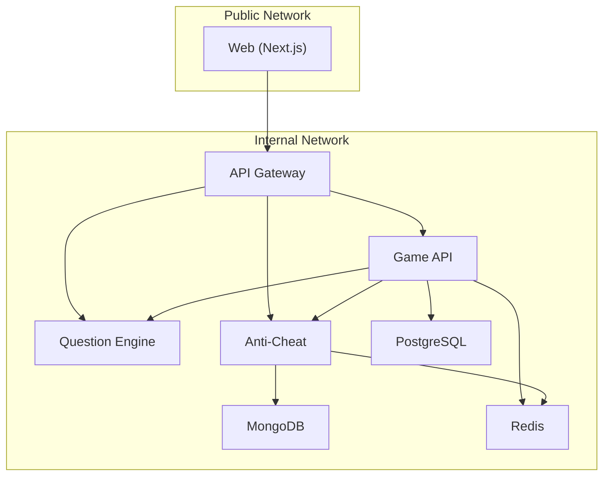

**Diagram sources**
- [README.md](file://README.md#L8-L18)

**Section sources**
- [README.md](file://README.md#L8-L18)

## Core Components
- API Gateway: Central entrypoint for internal services, enforcing auth, rate limits, and proxying requests with WebSocket passthrough.
- Game API: HTTP + WebSocket service implementing session lifecycle, matchmaking, and round orchestration.
- Question Engine: Supplies randomized challenges to Game API.
- Anti-Cheat: Receives telemetry events from Game API and computes risk scores.
- Shared infrastructure: Redis for session state, rate limiting, and pending match queues; databases for persistent state.

**Section sources**
- [gateway/index.ts](file://apps/gateway/src/index.ts#L1-L117)
- [game-api/index.ts](file://apps/game-api/src/index.ts#L1-L45)
- [README.md](file://README.md#L8-L18)

## Architecture Overview
The gateway acts as a reverse proxy and orchestrator:
- Authentication: Validates JWT or falls back to session cookies; injects identity headers for downstream services.
- Rate Limiting: Sliding-window implementation using Redis; fail-open when Redis is unavailable.
- Routing: Strips /api prefixes and forwards to upstream services.
- WebSocket: Upgrades /api/game/* to Socket.IO in the Game API.

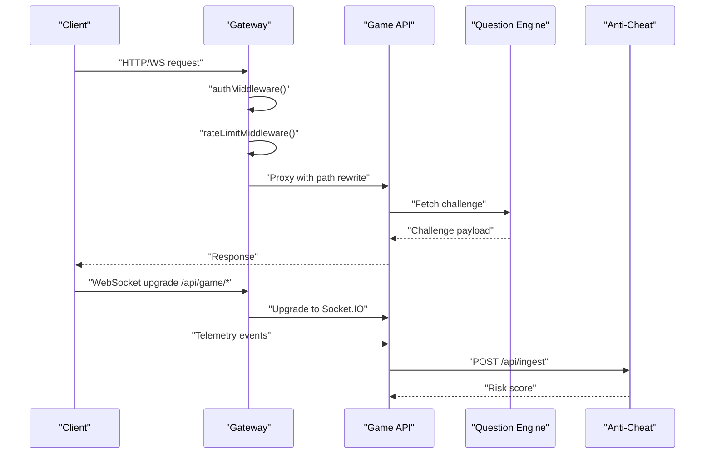

**Diagram sources**
- [gateway/index.ts](file://apps/gateway/src/index.ts#L48-L96)
- [gateway/proxy.ts](file://apps/gateway/src/proxy.ts#L10-L42)
- [game-api/websocket/socket.handler.ts](file://apps/game-api/src/websocket/socket.handler.ts#L291-L297)
- [game-api/services/round.service.ts](file://apps/game-api/src/services/round.service.ts#L206-L285)

## Detailed Component Analysis

### API Gateway
- Entry point initializes Express, security headers, CORS, cookie parsing, health endpoint, and middleware stack.
- Routes:
  - /api/game → Game API (general rate limit)
  - /api/questions → Question Engine (general rate limit)
  - /api/anticheat → Anti-Cheat (general rate limit)
  - /api/run → Code Runner (strict rate limit)
- WebSocket upgrade: Only /api/game/* is upgraded to Socket.IO.
- Error handling: Global Express error handler returns a generic Bad Gateway on unhandled errors.

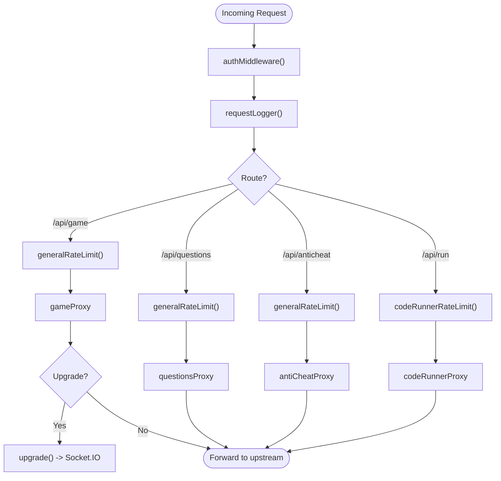

**Diagram sources**
- [gateway/index.ts](file://apps/gateway/src/index.ts#L48-L96)
- [gateway/proxy.ts](file://apps/gateway/src/proxy.ts#L44-L78)

**Section sources**
- [gateway/index.ts](file://apps/gateway/src/index.ts#L1-L117)
- [gateway/proxy.ts](file://apps/gateway/src/proxy.ts#L1-L78)

#### Authentication Delegation
- Accepts Authorization: Bearer or session cookies.
- On success, injects x-user-id and x-user-email headers for downstream services.
- Public routes: /health and /api/auth/* bypass JWT checks.

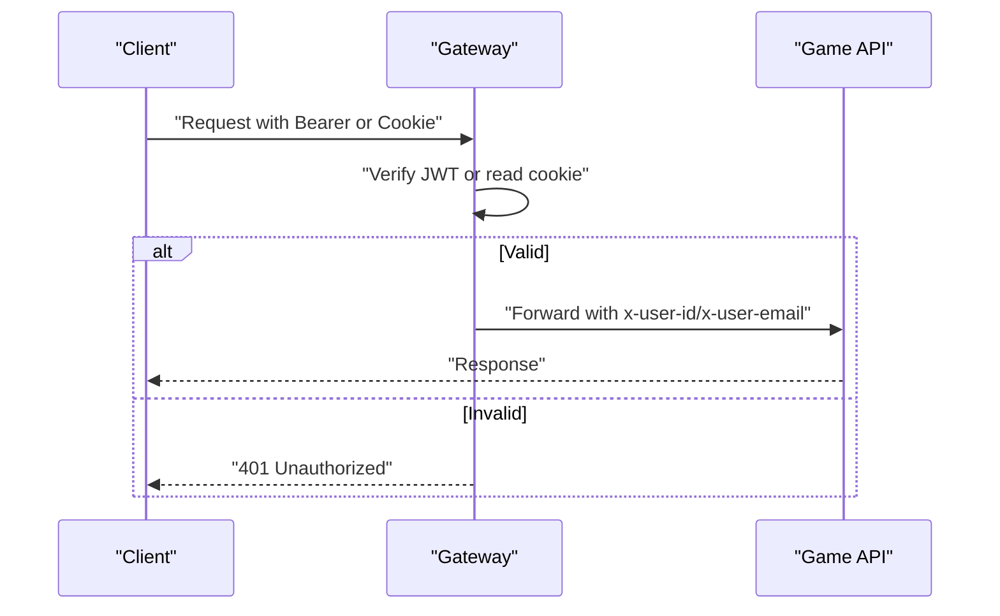

**Diagram sources**
- [gateway/middleware/auth.ts](file://apps/gateway/src/middleware/auth.ts#L18-L64)

**Section sources**
- [gateway/middleware/auth.ts](file://apps/gateway/src/middleware/auth.ts#L1-L65)

#### Rate Limiting Enforcement
- Sliding-window using Redis incr + expire.
- Fail-open when Redis is unavailable.
- Exposes X-RateLimit-* headers and responds with retry-after hint on 429.

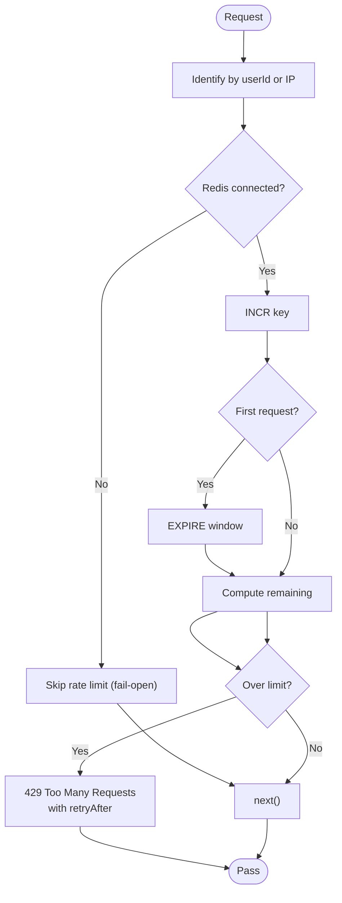

**Diagram sources**
- [gateway/middleware/rate-limit.ts](file://apps/gateway/src/middleware/rate-limit.ts#L15-L65)

**Section sources**
- [gateway/middleware/rate-limit.ts](file://apps/gateway/src/middleware/rate-limit.ts#L1-L80)

### Game API
- HTTP server with Helmet, CORS, JSON body parser, and routes for sessions.
- WebSocket server (Socket.IO) with CORS and transport options.
- Services:
  - SessionService: Manages session state, player readiness/joined sets, sockets, and pending matches.
  - MatchmakerService: Implements waiting room logic and session creation.
  - RoundService: Orchestrates challenges, evaluation, timers, and outcomes; integrates with Question Engine and Anti-Cheat.
- Error handling middleware standardizes API error responses.

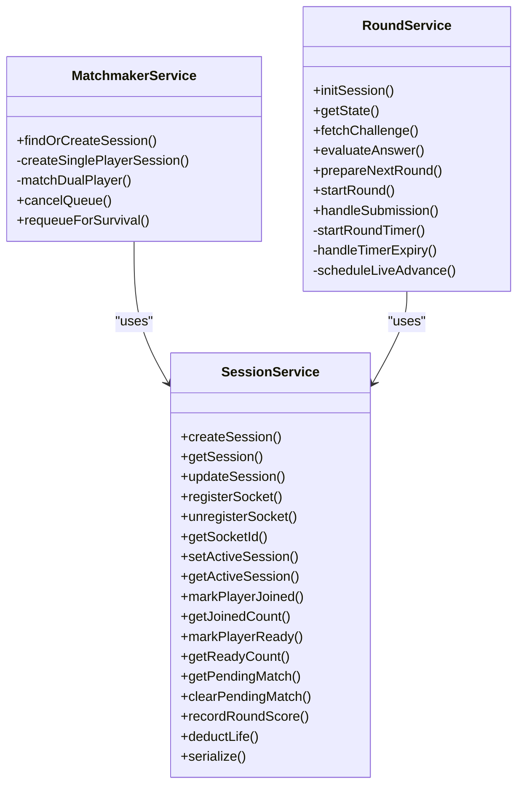

**Diagram sources**
- [game-api/services/session.service.ts](file://apps/game-api/src/services/session.service.ts#L18-L167)
- [game-api/services/matchmaker.service.ts](file://apps/game-api/src/services/matchmaker.service.ts#L41-L206)
- [game-api/services/round.service.ts](file://apps/game-api/src/services/round.service.ts#L179-L800)

**Section sources**
- [game-api/app.ts](file://apps/game-api/src/app.ts#L1-L63)
- [game-api/index.ts](file://apps/game-api/src/index.ts#L1-L45)
- [game-api/services/session.service.ts](file://apps/game-api/src/services/session.service.ts#L1-L167)
- [game-api/services/matchmaker.service.ts](file://apps/game-api/src/services/matchmaker.service.ts#L1-L206)
- [game-api/services/round.service.ts](file://apps/game-api/src/services/round.service.ts#L1-L1006)

#### Internal Session Management API
- HTTP routes:
  - GET /api/v1/health
  - Routes mounted under /api/v1/sessions (session-related endpoints)
- WebSocket events:
  - IDENTIFY: Associates socket with user ID and restores pending match or active session rooms.
  - JOIN_SESSION: Joins a session room, marks joined, sets active session, serializes players.
  - PLAYER_READY: Tracks readiness; starts round when all players are ready.
  - TYPING_TELEMETRY: Relays opponent telemetry to other players.
  - SUBMIT_ANSWER: Evaluates answers and emits round results.
  - SURVIVAL_REQUEUE: Requeues winners for next match (single/dual modes).
  - Telemetry events relayed to Anti-Cheat: PASTE_DETECTED, FOCUS_LOST, FOCUS_RESTORED, KEYSTROKE_BURST, MOUSE_INACTIVE, SOLUTION_SUBMITTED, FAST_SOLUTION.

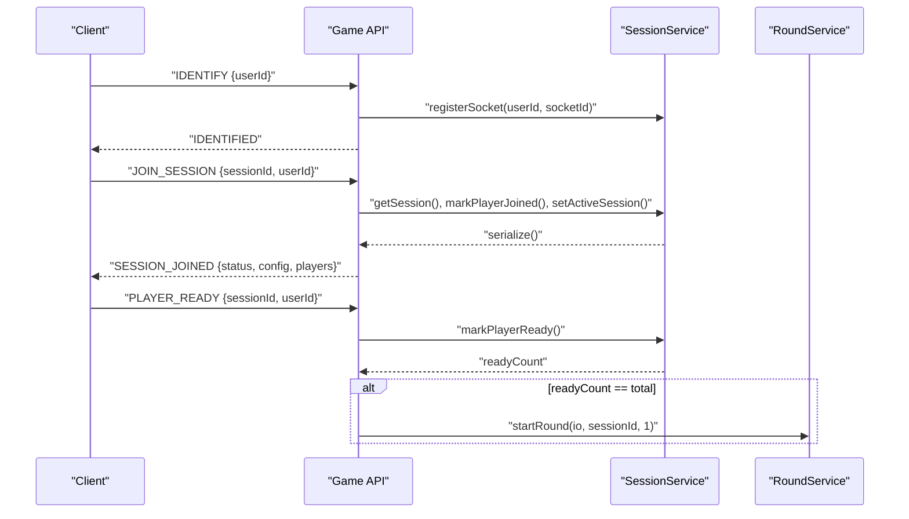

**Diagram sources**
- [game-api/websocket/socket.handler.ts](file://apps/game-api/src/websocket/socket.handler.ts#L72-L202)
- [game-api/services/session.service.ts](file://apps/game-api/src/services/session.service.ts#L62-L98)
- [game-api/services/round.service.ts](file://apps/game-api/src/services/round.service.ts#L451-L467)

**Section sources**
- [game-api/app.ts](file://apps/game-api/src/app.ts#L25-L31)
- [game-api/websocket/socket.handler.ts](file://apps/game-api/src/websocket/socket.handler.ts#L62-L310)
- [game-api/services/session.service.ts](file://apps/game-api/src/services/session.service.ts#L1-L167)

#### Matchmaking and Queue Management
- Waiting room entries keyed by session type and category segment with TTL eviction.
- Dual-player matching pairs users; emits MATCHED to the waiting player via socket or pending:match Redis key.
- Single-player sessions created immediately.
- Requeue logic supports survival mode continuation.

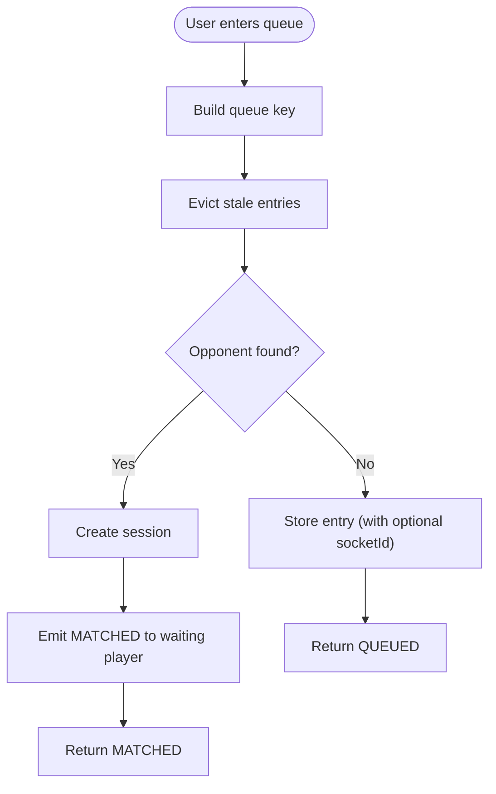

**Diagram sources**
- [game-api/services/matchmaker.service.ts](file://apps/game-api/services/matchmaker.service.ts#L74-L169)

**Section sources**
- [game-api/services/matchmaker.service.ts](file://apps/game-api/src/services/matchmaker.service.ts#L1-L206)

#### Round Orchestration and Evaluation
- Fetches challenges from Question Engine with fallback strategies (drop language, then category-only).
- Evaluates answers based on challenge category and updates session scores/lives.
- Manages timers and auto-submission on expiry; schedules live-mode advances.
- Emits round start, results, opponent telemetry, and session end events.

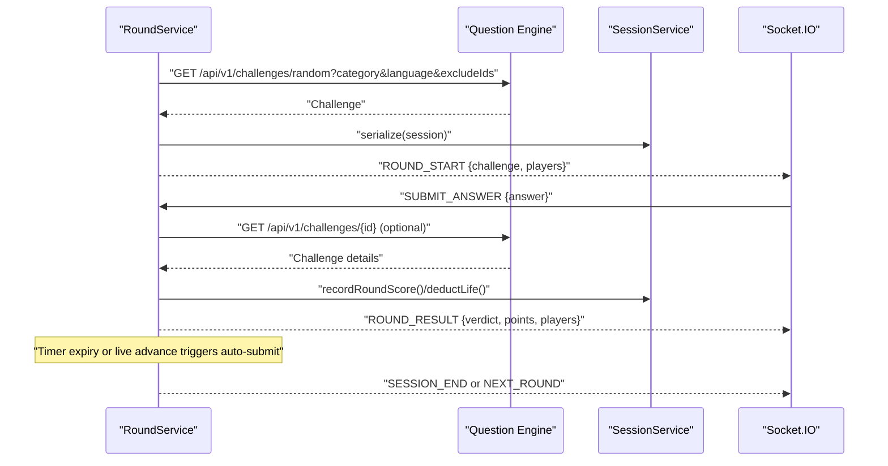

**Diagram sources**
- [game-api/services/round.service.ts](file://apps/game-api/src/services/round.service.ts#L206-L285)
- [game-api/services/round.service.ts](file://apps/game-api/src/services/round.service.ts#L313-L423)
- [game-api/services/round.service.ts](file://apps/game-api/src/services/round.service.ts#L470-L589)

**Section sources**
- [game-api/services/round.service.ts](file://apps/game-api/src/services/round.service.ts#L1-L1006)

#### Anti-Cheat Telemetry Relay
- Game API relays telemetry events to Anti-Cheat service via HTTP POST /api/ingest.
- Payload includes sessionId, candidateId, eventType, timestamp, and optional payload.
- Anti-Cheat updates risk score and may create flags; logs telemetry events.

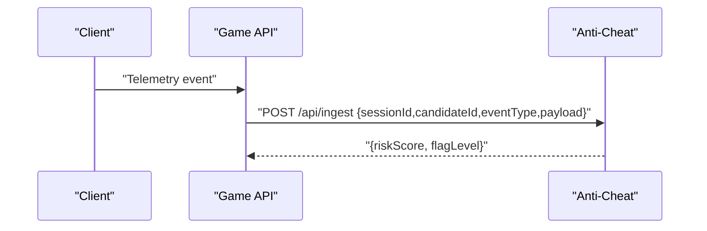

**Diagram sources**
- [game-api/websocket/socket.handler.ts](file://apps/game-api/src/websocket/socket.handler.ts#L19-L60)
- [anti-cheat/services/risk-scoring.service.ts](file://apps/anti-cheat/src/services/risk-scoring.service.ts#L18-L75)
- [anti-cheat/services/audit-log.service.ts](file://apps/anti-cheat/src/services/audit-log.service.ts#L4-L18)

**Section sources**
- [game-api/websocket/socket.handler.ts](file://apps/game-api/src/websocket/socket.handler.ts#L291-L297)
- [anti-cheat/services/risk-scoring.service.ts](file://apps/anti-cheat/src/services/risk-scoring.service.ts#L1-L76)
- [anti-cheat/services/audit-log.service.ts](file://apps/anti-cheat/src/services/audit-log.service.ts#L1-L19)

### Service Discovery and Load Balancing
- The gateway uses fixed upstream targets configured via environment variables for each service.
- No built-in dynamic service discovery or client-side load balancing is present in the gateway; upstreams are expected to be resolvable by container/network name.
- Recommendations:
  - Use Kubernetes-style service discovery or DNS-based resolution for dynamic endpoints.
  - Implement circuit breakers at the gateway level to protect upstreams from cascading failures.

**Section sources**
- [gateway/proxy.ts](file://apps/gateway/src/proxy.ts#L46-L53)

### Circuit Breaker Patterns
- Not implemented in the current codebase.
- Recommended approach:
  - Track failure rates and latency thresholds.
  - Switch to fallback behavior or return cached responses when thresholds are exceeded.
  - Reset state after a cool-down period.

[No sources needed since this section provides general guidance]

### Monitoring Integration
- Logging:
  - Gateway logs structured errors and warnings for proxy and rate-limit failures.
  - Game API uses a logger package and logs significant events (matches, submissions, errors).
- Metrics:
  - Expose Prometheus metrics for request counts, latency, and error rates.
  - Track rate limiter hits and Redis connectivity status.

**Section sources**
- [gateway/index.ts](file://apps/gateway/src/index.ts#L66-L81)
- [game-api/app.ts](file://apps/game-api/src/app.ts#L52-L62)

### Security Considerations
- Authentication:
  - JWT verification with secret from environment; injects identity headers downstream.
  - Supports session cookies for delegated auth scenarios.
- Transport:
  - All internal services operate on internal networks; ensure proper firewalling and secrets management.
- Rate Limiting:
  - Redis-backed sliding window; fail-open to avoid single points of failure.
- CORS:
  - Strict origins enforced in both gateway and Game API.

**Section sources**
- [gateway/middleware/auth.ts](file://apps/gateway/src/middleware/auth.ts#L16-L64)
- [gateway/index.ts](file://apps/gateway/src/index.ts#L29-L38)
- [game-api/app.ts](file://apps/game-api/src/app.ts#L14-L22)

### Debugging Distributed Interactions
- Enable verbose logging for gateway and Game API.
- Verify WebSocket upgrades for /api/game/*.
- Inspect Redis keys for session state, pending matches, and readiness sets.
- Monitor Question Engine and Anti-Cheat availability and response codes.

**Section sources**
- [gateway/index.ts](file://apps/gateway/src/index.ts#L83-L96)
- [game-api/services/session.service.ts](file://apps/game-api/src/services/session.service.ts#L62-L98)

## Dependency Analysis
- Gateway depends on:
  - Express, helmet, cors, cookie-parser
  - http-proxy-middleware for reverse proxying
  - Redis client for rate limiting
- Game API depends on:
  - Socket.IO for real-time events
  - Redis for session state and counters
  - Question Engine and Anti-Cheat for external integrations
- Anti-Cheat depends on:
  - Database for telemetry and risk state persistence

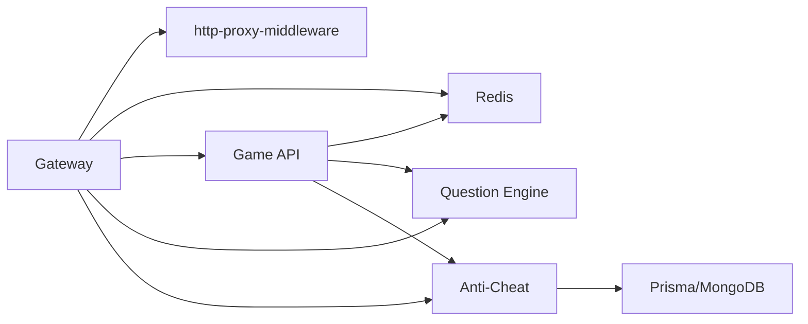

**Diagram sources**
- [gateway/proxy.ts](file://apps/gateway/src/proxy.ts#L4-L41)
- [game-api/services/round.service.ts](file://apps/game-api/src/services/round.service.ts#L12-L15)

**Section sources**
- [gateway/proxy.ts](file://apps/gateway/src/proxy.ts#L1-L78)
- [game-api/services/round.service.ts](file://apps/game-api/src/services/round.service.ts#L1-L1006)

## Performance Considerations
- Use Redis for low-latency session state and counters.
- Implement connection pooling for database clients.
- Tune rate limiter windows and limits per service.
- Consider caching frequently accessed data (e.g., challenge metadata) at the Game API layer.

[No sources needed since this section provides general guidance]

## Troubleshooting Guide
- 401 Unauthorized:
  - Missing or invalid Authorization header or session cookie.
- 429 Too Many Requests:
  - Redis connectivity issues or hitting rate limits; inspect X-RateLimit-* headers.
- 502 Bad Gateway:
  - Upstream service unreachable; verify service health and network connectivity.
- WebSocket upgrade failures:
  - Ensure only /api/game/* is upgraded; verify Socket.IO server binding.

**Section sources**
- [gateway/middleware/auth.ts](file://apps/gateway/src/middleware/auth.ts#L47-L64)
- [gateway/middleware/rate-limit.ts](file://apps/gateway/src/middleware/rate-limit.ts#L48-L63)
- [gateway/index.ts](file://apps/gateway/src/index.ts#L66-L81)
- [gateway/index.ts](file://apps/gateway/src/index.ts#L87-L96)

## Conclusion
Logic Forge’s internal communication relies on a robust gateway that enforces authentication and rate limits while proxying requests and upgrading WebSockets. Game API coordinates sessions, matchmaking, and rounds, integrating with Question Engine and Anti-Cheat. Redis and databases provide durable state for sessions and telemetry. Extending the system with dynamic service discovery, circuit breakers, and comprehensive metrics will further improve resilience and observability.

## Appendices

### API Definitions

- Gateway
  - GET /health
    - Purpose: Health check
    - Response: { status: "ok", ts: number }
  - Proxy routes:
    - /api/game/* → Game API
    - /api/questions/* → Question Engine
    - /api/anticheat/* → Anti-Cheat
    - /api/run/* → Code Runner (stricter rate limit)

- Game API
  - GET /api/v1/health
    - Response: { status: "ok", service: "game-api" }
  - WebSocket events:
    - IDENTIFY { userId }
    - JOIN_SESSION { sessionId, userId } → ACK { ok, payload } or SESSION_ERROR
    - PLAYER_READY { sessionId, userId }
    - TYPING_TELEMETRY { sessionId, userId, wpm, codeLength, ... }
    - SUBMIT_ANSWER { sessionId, userId, answer, roundNumber }
    - SURVIVAL_REQUEUE { playerFormat, sessionType, category?, userId? }
    - Telemetry events: PASTE_DETECTED, FOCUS_LOST, FOCUS_RESTORED, KEYSTROKE_BURST, MOUSE_INACTIVE, SOLUTION_SUBMITTED, FAST_SOLUTION

- Anti-Cheat
  - POST /api/ingest
    - Body: { sessionId, candidateId, eventType, timestamp, payload? }
    - Response: { riskScore: number, flagLevel: "MEDIUM"|"HIGH"|null }

**Section sources**
- [gateway/index.ts](file://apps/gateway/src/index.ts#L44-L64)
- [game-api/app.ts](file://apps/game-api/src/app.ts#L28-L31)
- [game-api/websocket/socket.handler.ts](file://apps/game-api/src/websocket/socket.handler.ts#L72-L297)
- [anti-cheat/services/risk-scoring.service.ts](file://apps/anti-cheat/src/services/risk-scoring.service.ts#L18-L75)