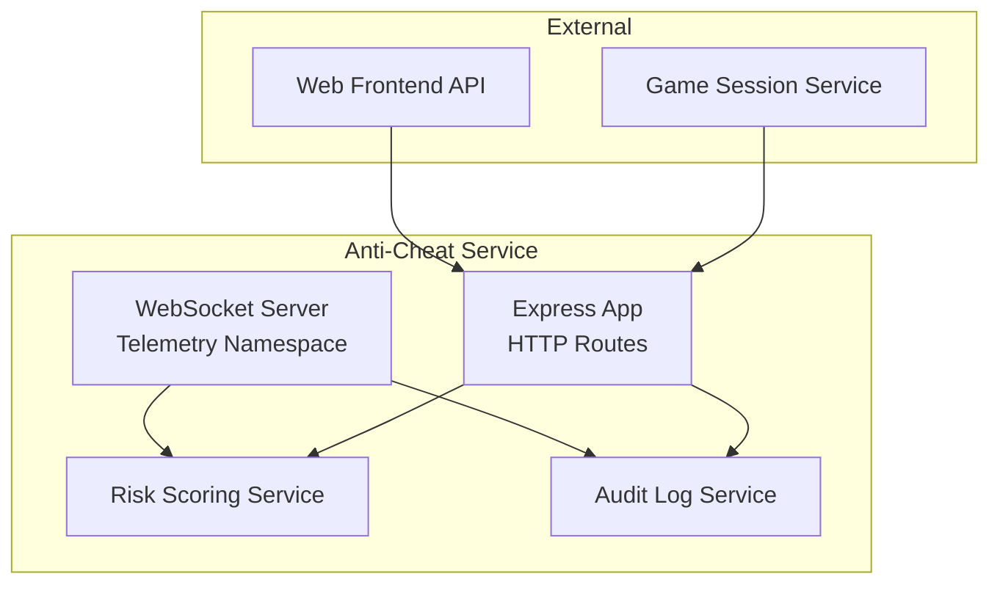
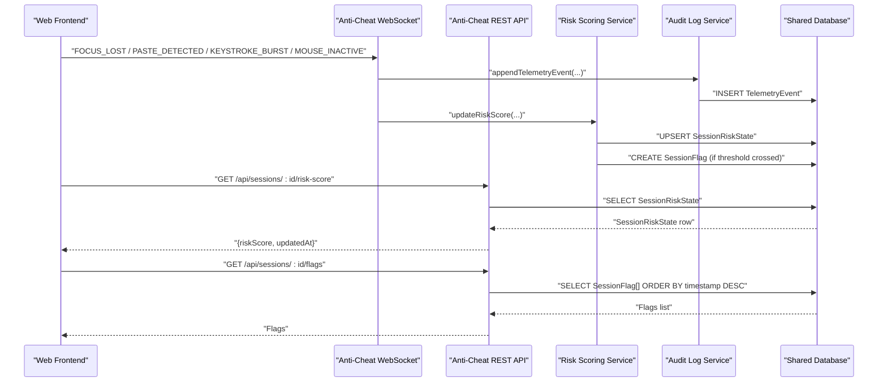
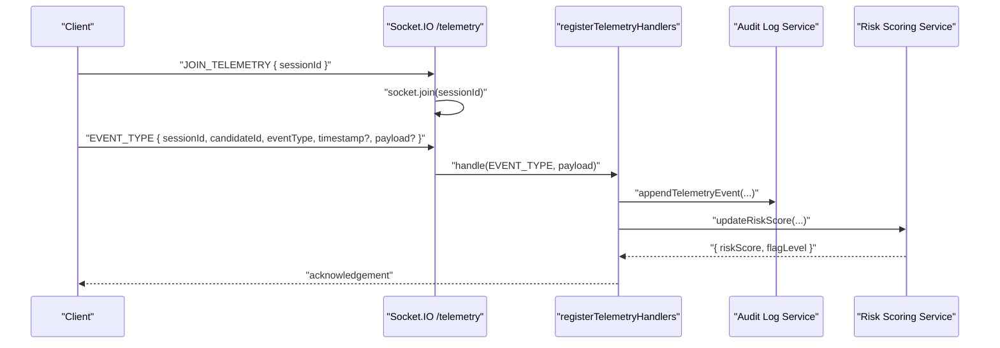
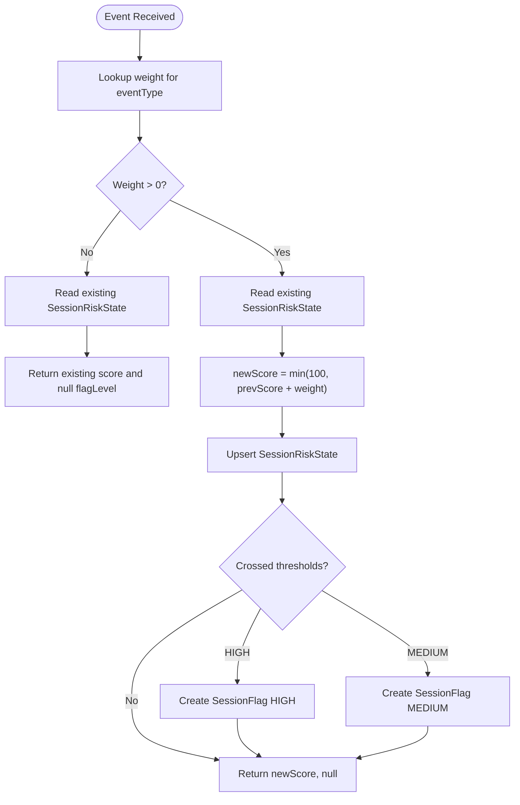
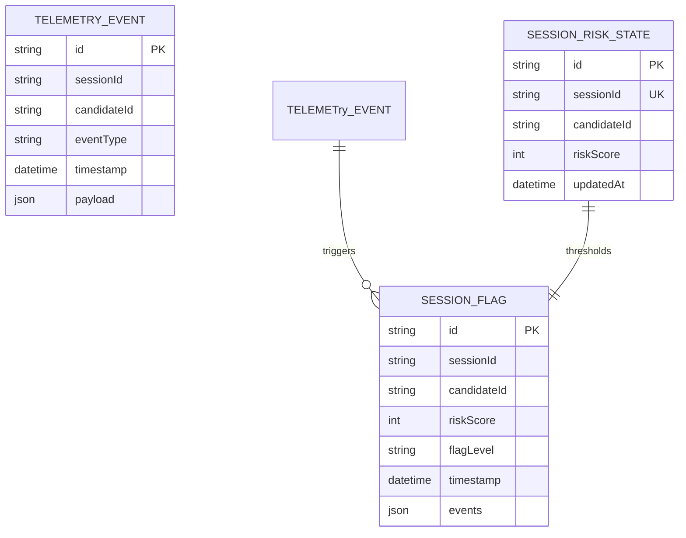
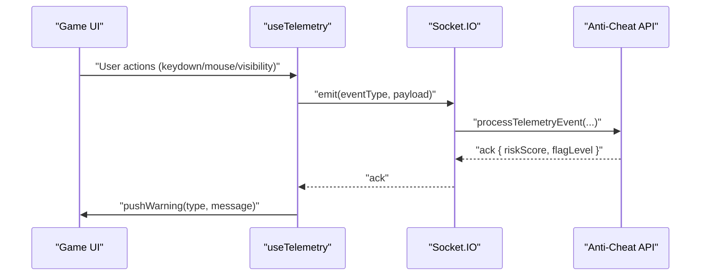
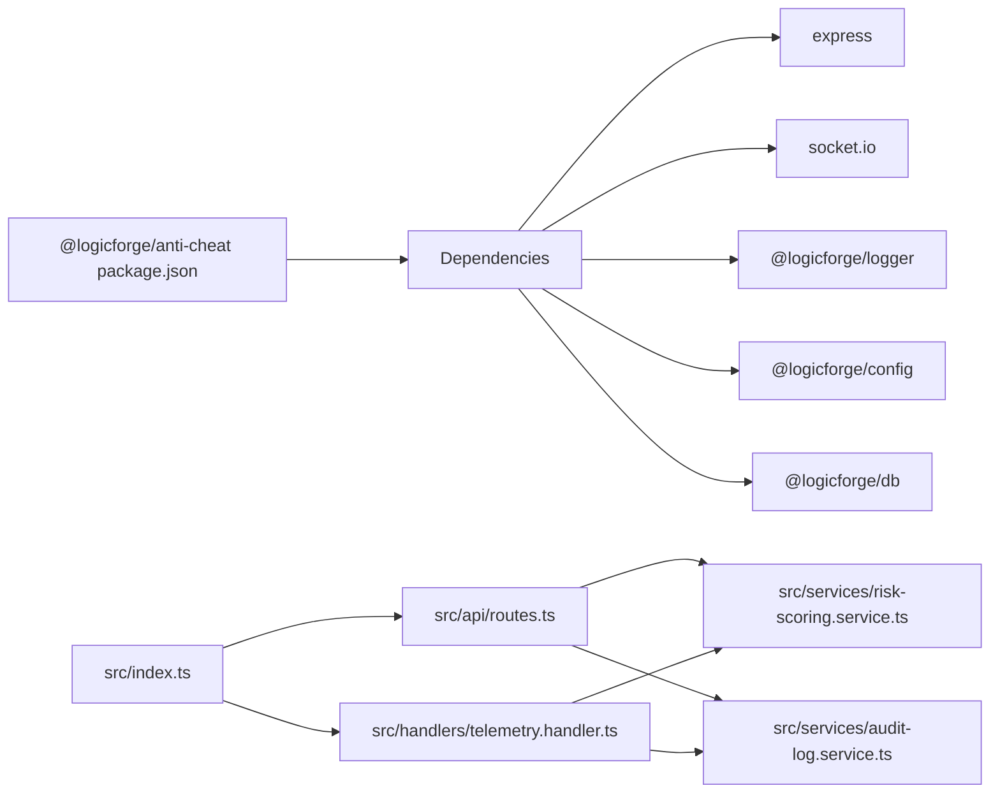

# Anti-Cheat REST Endpoints

<cite>
**Referenced Files in This Document**
- [apps/anti-cheat/src/index.ts](file://apps/anti-cheat/src/index.ts)
- [apps/anti-cheat/src/api/routes.ts](file://apps/anti-cheat/src/api/routes.ts)
- [apps/anti-cheat/src/handlers/telemetry.handler.ts](file://apps/anti-cheat/src/handlers/telemetry.handler.ts)
- [apps/anti-cheat/src/services/risk-scoring.service.ts](file://apps/anti-cheat/src/services/risk-scoring.service.ts)
- [apps/anti-cheat/src/services/audit-log.service.ts](file://apps/anti-cheat/src/services/audit-log.service.ts)
- [apps/web/app/api/anti-cheat/[sessionId]/route.ts](file://apps/web/app/api/anti-cheat/[sessionId]/route.ts)
- [apps/web/hooks/use-telemetry.ts](file://apps/web/hooks/use-telemetry.ts)
- [apps/web/store/anti-cheat-store.ts](file://apps/web/store/anti-cheat-store.ts)
- [packages/db/prisma/schema.prisma](file://packages/db/prisma/schema.prisma)
- [apps/anti-cheat/package.json](file://apps/anti-cheat/package.json)
- [apps/anti-cheat/.env.example](file://apps/anti-cheat/.env.example)
</cite>

## Table of Contents
1. [Introduction](#introduction)
2. [Project Structure](#project-structure)
3. [Core Components](#core-components)
4. [Architecture Overview](#architecture-overview)
5. [Detailed Component Analysis](#detailed-component-analysis)
6. [Dependency Analysis](#dependency-analysis)
7. [Performance Considerations](#performance-considerations)
8. [Troubleshooting Guide](#troubleshooting-guide)
9. [Conclusion](#conclusion)
10. [Appendices](#appendices)

## Introduction
This document provides comprehensive REST API documentation for the Anti-Cheat service. It covers telemetry submission endpoints for keystroke dynamics, mouse movement patterns, and behavioral analytics, along with risk scoring calculation endpoints and audit log management for compliance tracking. It also documents request schemas, real-time monitoring via WebSocket, data retention policies, privacy considerations, and integration with the main game session.

## Project Structure
The Anti-Cheat service exposes:
- An HTTP REST API for ingestion and retrieval of telemetry and risk data
- A WebSocket namespace for real-time telemetry streaming
- Services for risk scoring and audit logging backed by a shared database

**Diagram sources**
- [apps/anti-cheat/src/index.ts](file://apps/anti-cheat/src/index.ts#L12-L34)
- [apps/anti-cheat/src/api/routes.ts](file://apps/anti-cheat/src/api/routes.ts#L1-L85)
- [apps/anti-cheat/src/handlers/telemetry.handler.ts](file://apps/anti-cheat/src/handlers/telemetry.handler.ts#L1-L82)
- [apps/anti-cheat/src/services/risk-scoring.service.ts](file://apps/anti-cheat/src/services/risk-scoring.service.ts#L1-L76)
- [apps/anti-cheat/src/services/audit-log.service.ts](file://apps/anti-cheat/src/services/audit-log.service.ts#L1-L19)

**Section sources**
- [apps/anti-cheat/src/index.ts](file://apps/anti-cheat/src/index.ts#L1-L35)
- [apps/anti-cheat/src/api/routes.ts](file://apps/anti-cheat/src/api/routes.ts#L1-L85)

## Core Components
- REST API router exposing:
  - GET /api/sessions/:id/risk-score
  - GET /api/sessions/:id/flags
  - POST /api/ingest
- WebSocket telemetry handler registering event listeners for:
  - FOCUS_LOST
  - FOCUS_RESTORED
  - PASTE_DETECTED
  - KEYSTROKE_BURST
  - MOUSE_INACTIVE
  - SOLUTION_SUBMITTED
  - FAST_SOLUTION
- Risk scoring service computing incremental risk scores and flagging thresholds
- Audit log service persisting telemetry events append-only

**Section sources**
- [apps/anti-cheat/src/api/routes.ts](file://apps/anti-cheat/src/api/routes.ts#L13-L82)
- [apps/anti-cheat/src/handlers/telemetry.handler.ts](file://apps/anti-cheat/src/handlers/telemetry.handler.ts#L4-L51)
- [apps/anti-cheat/src/services/risk-scoring.service.ts](file://apps/anti-cheat/src/services/risk-scoring.service.ts#L18-L75)
- [apps/anti-cheat/src/services/audit-log.service.ts](file://apps/anti-cheat/src/services/audit-log.service.ts#L4-L18)

## Architecture Overview
The Anti-Cheat service integrates with the Web frontend and Game session lifecycle. The frontend emits telemetry events via WebSocket and retrieves risk and flags via a Next.js API route that proxies to the Anti-Cheat service.

**Diagram sources**
- [apps/anti-cheat/src/index.ts](file://apps/anti-cheat/src/index.ts#L24-L29)
- [apps/anti-cheat/src/handlers/telemetry.handler.ts](file://apps/anti-cheat/src/handlers/telemetry.handler.ts#L30-L51)
- [apps/anti-cheat/src/services/risk-scoring.service.ts](file://apps/anti-cheat/src/services/risk-scoring.service.ts#L42-L75)
- [apps/anti-cheat/src/services/audit-log.service.ts](file://apps/anti-cheat/src/services/audit-log.service.ts#L10-L18)
- [apps/anti-cheat/src/api/routes.ts](file://apps/anti-cheat/src/api/routes.ts#L13-L42)

## Detailed Component Analysis

### REST API Endpoints

#### GET /api/sessions/:id/risk-score
- Purpose: Retrieve the latest risk score and metadata for a given session
- Path parameters:
  - id: string (session identifier)
- Responses:
  - 200 OK: { sessionId, candidateId, riskScore, updatedAt }
  - 404 Not Found: { error: "Session risk state not found" }
  - 500 Internal Server Error: { error: "Failed to fetch risk score" }

**Section sources**
- [apps/anti-cheat/src/api/routes.ts](file://apps/anti-cheat/src/api/routes.ts#L13-L30)

#### GET /api/sessions/:id/flags
- Purpose: Retrieve recent flags for a session ordered by timestamp descending
- Path parameters:
  - id: string (session identifier)
- Responses:
  - 200 OK: Array of flags
  - 500 Internal Server Error: { error: "Failed to fetch flags" }

**Section sources**
- [apps/anti-cheat/src/api/routes.ts](file://apps/anti-cheat/src/api/routes.ts#L32-L42)

#### POST /api/ingest
- Purpose: Ingest telemetry events via HTTP
- Request body schema:
  - sessionId: string
  - candidateId: string
  - eventType: string (must be one of accepted telemetry event types)
  - timestamp?: string (ISO 8601)
  - payload?: object (optional structured data)
- Validation:
  - eventType must pass isTelemetryEventType
- Responses:
  - 200 OK: { riskScore, flagLevel }
  - 400 Bad Request: { error: "...required" or { error: "Invalid eventType: ..." } }
  - 500 Internal Server Error: { error: "Ingest failed" }

**Section sources**
- [apps/anti-cheat/src/api/routes.ts](file://apps/anti-cheat/src/api/routes.ts#L44-L82)
- [apps/anti-cheat/src/handlers/telemetry.handler.ts](file://apps/anti-cheat/src/handlers/telemetry.handler.ts#L22-L28)

### Telemetry Submission Endpoints

#### WebSocket Namespace: /telemetry
- Connection: Establishes a Socket.IO server and listens on "/telemetry"
- Joining:
  - Clients emit "JOIN_TELEMETRY" with { sessionId }
  - Server joins the room by sessionId
- Event Types:
  - FOCUS_LOST, FOCUS_RESTORED, PASTE_DETECTED, KEYSTROKE_BURST, MOUSE_INACTIVE, SOLUTION_SUBMITTED, FAST_SOLUTION
- Payload normalization:
  - Extracts sessionId and candidateId from payload or socket data
  - Ensures timestamp defaults to current time if omitted
- Processing:
  - Persists to audit log
  - Updates risk score and may create flags

**Diagram sources**
- [apps/anti-cheat/src/index.ts](file://apps/anti-cheat/src/index.ts#L24-L29)
- [apps/anti-cheat/src/handlers/telemetry.handler.ts](file://apps/anti-cheat/src/handlers/telemetry.handler.ts#L54-L81)

**Section sources**
- [apps/anti-cheat/src/index.ts](file://apps/anti-cheat/src/index.ts#L24-L29)
- [apps/anti-cheat/src/handlers/telemetry.handler.ts](file://apps/anti-cheat/src/handlers/telemetry.handler.ts#L54-L81)

### Risk Scoring Calculation

#### Algorithm Overview
- Weighted scoring model:
  - Each eventType has a predefined weight
  - Score is capped at 100
- Thresholds:
  - MEDIUM: >= 60
  - HIGH: >= 80
- Persistence:
  - Upserts SessionRiskState
  - Creates SessionFlag when crossing thresholds
- Inputs:
  - sessionId, candidateId, eventType, optional payload

**Diagram sources**
- [apps/anti-cheat/src/services/risk-scoring.service.ts](file://apps/anti-cheat/src/services/risk-scoring.service.ts#L3-L11)
- [apps/anti-cheat/src/services/risk-scoring.service.ts](file://apps/anti-cheat/src/services/risk-scoring.service.ts#L18-L75)

**Section sources**
- [apps/anti-cheat/src/services/risk-scoring.service.ts](file://apps/anti-cheat/src/services/risk-scoring.service.ts#L18-L75)

### Audit Log Management

#### Append-Only Audit Trail
- Append-only policy: never updates or deletes records
- Schema fields:
  - sessionId, candidateId (userId), eventType, timestamp, payload
- Indexes:
  - sessionId, candidateId, timestamp for efficient queries

**Diagram sources**
- [packages/db/prisma/schema.prisma](file://packages/db/prisma/schema.prisma#L224-L260)

**Section sources**
- [apps/anti-cheat/src/services/audit-log.service.ts](file://apps/anti-cheat/src/services/audit-log.service.ts#L4-L18)
- [packages/db/prisma/schema.prisma](file://packages/db/prisma/schema.prisma#L224-L260)

### Real-Time Monitoring and Frontend Integration

#### Frontend Telemetry Hook
- Emits telemetry events over WebSocket:
  - Visibility change -> FOCUS_LOST / FOCUS_RESTORED
  - Paste/Copy -> PASTE_DETECTED
  - Right-click blocked
  - Keystroke burst detection (windowed counting)
  - Mouse inactivity detection
- Warning messages surfaced to the UI store

**Diagram sources**
- [apps/web/hooks/use-telemetry.ts](file://apps/web/hooks/use-telemetry.ts#L35-L54)
- [apps/web/hooks/use-telemetry.ts](file://apps/web/hooks/use-telemetry.ts#L62-L69)
- [apps/web/hooks/use-telemetry.ts](file://apps/web/hooks/use-telemetry.ts#L73-L85)
- [apps/web/hooks/use-telemetry.ts](file://apps/web/hooks/use-telemetry.ts#L98-L105)
- [apps/web/hooks/use-telemetry.ts](file://apps/web/hooks/use-telemetry.ts#L107-L114)
- [apps/anti-cheat/src/handlers/telemetry.handler.ts](file://apps/anti-cheat/src/handlers/telemetry.handler.ts#L30-L51)

**Section sources**
- [apps/web/hooks/use-telemetry.ts](file://apps/web/hooks/use-telemetry.ts#L19-L157)
- [apps/web/store/anti-cheat-store.ts](file://apps/web/store/anti-cheat-store.ts#L20-L47)

#### Web API Proxy for Risk and Flags
- Next.js route aggregates risk score and flags from Anti-Cheat service
- Fetches:
  - GET /api/sessions/:id/risk-score
  - GET /api/sessions/:id/flags
- Returns normalized payload for the UI

**Section sources**
- [apps/web/app/api/anti-cheat/[sessionId]/route.ts](file://apps/web/app/api/anti-cheat/[sessionId]/route.ts#L16-L33)

## Dependency Analysis

**Diagram sources**
- [apps/anti-cheat/package.json](file://apps/anti-cheat/package.json#L12-L21)
- [apps/anti-cheat/src/index.ts](file://apps/anti-cheat/src/index.ts#L1-L10)
- [apps/anti-cheat/src/api/routes.ts](file://apps/anti-cheat/src/api/routes.ts#L1-L11)

**Section sources**
- [apps/anti-cheat/package.json](file://apps/anti-cheat/package.json#L12-L21)

## Performance Considerations
- WebSocket batching: Group related events to reduce connection overhead
- Rate limiting: Apply rate limits at the API boundary to prevent abuse
- Indexing: Ensure database indexes on sessionId, candidateId, and timestamp are leveraged for fast queries
- Caching: Cache recent risk scores for short TTLs to reduce DB load
- Asynchronous processing: Persist telemetry and compute risk scores asynchronously to avoid blocking clients

## Troubleshooting Guide
- Health check:
  - GET /api/health returns service status
- Common errors:
  - 400 on invalid ingest body or invalid eventType
  - 404 when risk state does not exist
  - 500 on internal failures during ingestion or retrieval
- Logging:
  - API logs successful ingest with riskScore and flagLevel
  - Errors logged with payload context for debugging

**Section sources**
- [apps/anti-cheat/src/index.ts](file://apps/anti-cheat/src/index.ts#L15-L17)
- [apps/anti-cheat/src/api/routes.ts](file://apps/anti-cheat/src/api/routes.ts#L67-L81)

## Conclusion
The Anti-Cheat service provides a robust foundation for behavioral telemetry, real-time risk scoring, and compliance-grade audit logging. Its REST API and WebSocket integration enable seamless front-end telemetry emission and risk monitoring, while database models support scalable querying and reporting.

## Appendices

### Request Schemas

- Ingest payload (POST /api/ingest):
  - Required: sessionId (string), candidateId (string), eventType (string)
  - Optional: timestamp (string, ISO 8601), payload (object)
- WebSocket event payload:
  - Required: sessionId (string), candidateId (string), eventType (string)
  - Optional: timestamp (string, ISO 8601), payload (object)

**Section sources**
- [apps/anti-cheat/src/api/routes.ts](file://apps/anti-cheat/src/api/routes.ts#L44-L63)
- [apps/anti-cheat/src/handlers/telemetry.handler.ts](file://apps/anti-cheat/src/handlers/telemetry.handler.ts#L22-L28)

### Risk Scoring Parameters
- Weights:
  - FOCUS_LOST: 10
  - FOCUS_RESTORED: 0
  - PASTE_DETECTED: 25
  - KEYSTROKE_BURST: 5
  - MOUSE_INACTIVE: 5
  - SOLUTION_SUBMITTED: 0
  - FAST_SOLUTION: 30
- Thresholds:
  - MEDIUM: >= 60
  - HIGH: >= 80

**Section sources**
- [apps/anti-cheat/src/services/risk-scoring.service.ts](file://apps/anti-cheat/src/services/risk-scoring.service.ts#L3-L11)

### Data Retention Policies
- TelemetryEvent: Append-only audit log; maintain for compliance period as defined by policy
- SessionFlag: Maintain historical flags for review and reporting
- SessionRiskState: Keep latest risk state for current session; historical snapshots can be derived from flags and events

**Section sources**
- [apps/anti-cheat/src/services/audit-log.service.ts](file://apps/anti-cheat/src/services/audit-log.service.ts#L3-L3)
- [packages/db/prisma/schema.prisma](file://packages/db/prisma/schema.prisma#L224-L260)

### Privacy Considerations
- Minimize data: Only collect telemetry necessary for detecting automation
- Anonymization: Use candidateId (userId) instead of personally identifiable information where possible
- Consent: Ensure users are informed about telemetry collection
- Access control: Restrict read/write access to audit and risk data to authorized roles
- Storage encryption: Encrypt sensitive fields at rest
- Transmission security: Enforce HTTPS/TLS for API endpoints and WSS for WebSocket connections

### Security Measures
- Transport security:
  - HTTPS for REST API
  - WSS for WebSocket
- Access controls:
  - API keys or JWT-based authentication for ingestion endpoints
  - Role-based access to audit data retrieval
- Data protection:
  - Encrypt sensitive fields at rest
  - Sanitize payloads to prevent injection
- Operational:
  - Environment variables for ports and secrets (.env.example)
  - Network policies to restrict inbound/outbound traffic

**Section sources**
- [apps/anti-cheat/.env.example](file://apps/anti-cheat/.env.example#L1-L3)

### Integration with Game Session
- Frontend:
  - useTelemetry hook emits events during gameplay
  - useAntiCheatStore manages UI warnings and risk level
- Backend:
  - Anti-Cheat API receives events and updates risk state
  - Next.js proxy route serves risk and flags to the UI

**Section sources**
- [apps/web/hooks/use-telemetry.ts](file://apps/web/hooks/use-telemetry.ts#L19-L157)
- [apps/web/store/anti-cheat-store.ts](file://apps/web/store/anti-cheat-store.ts#L20-L107)
- [apps/web/app/api/anti-cheat/[sessionId]/route.ts](file://apps/web/app/api/anti-cheat/[sessionId]/route.ts#L16-L33)