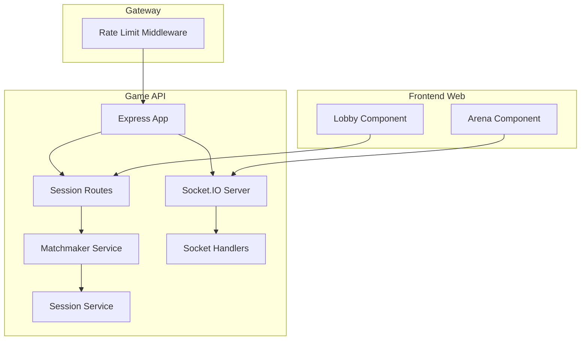
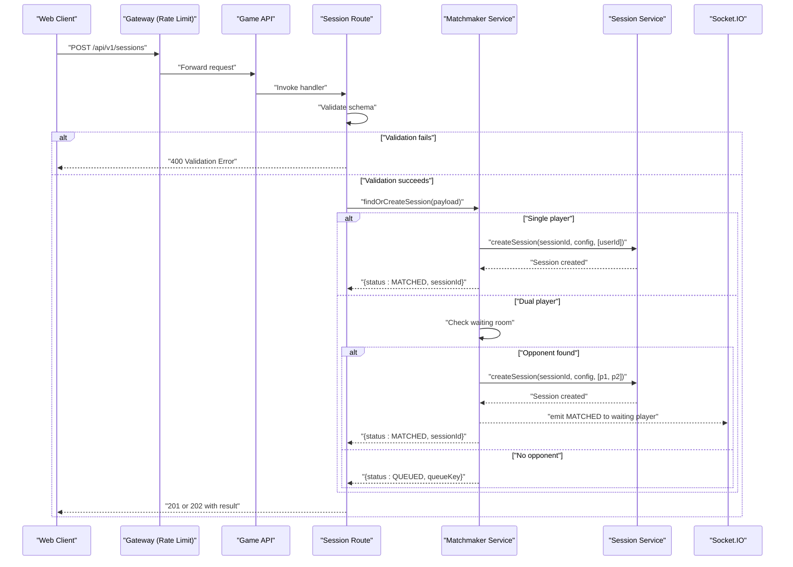
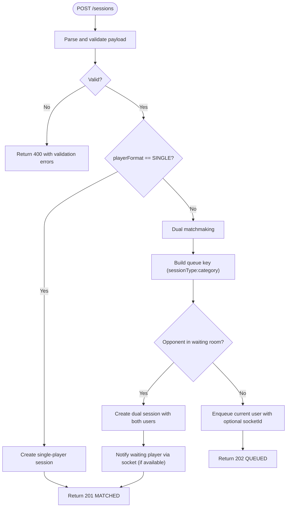
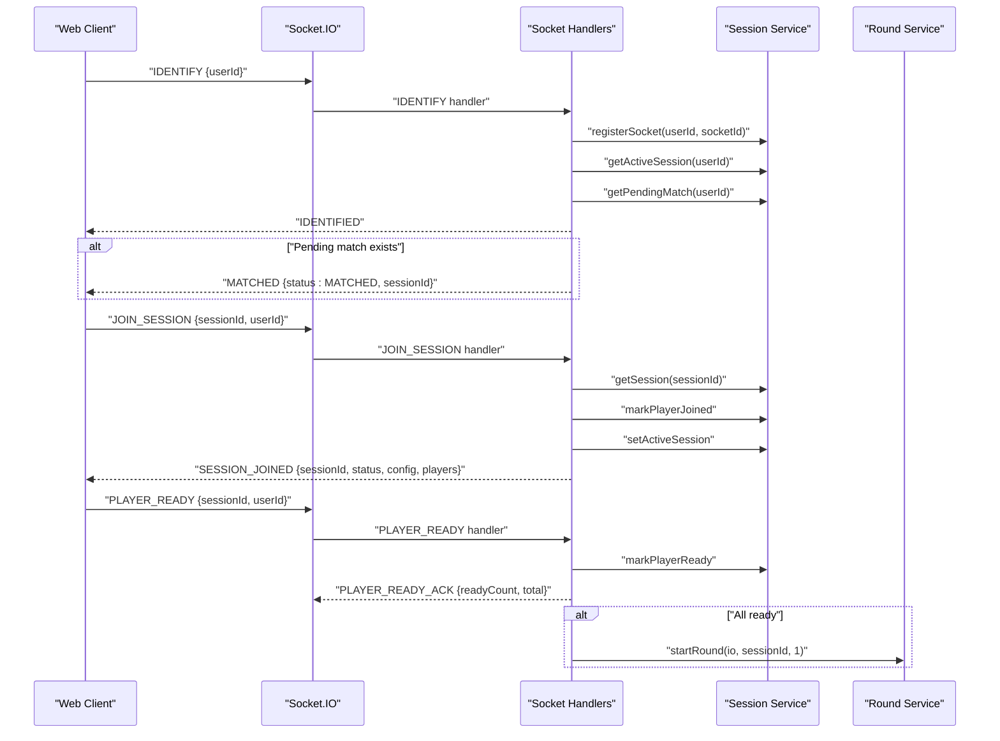
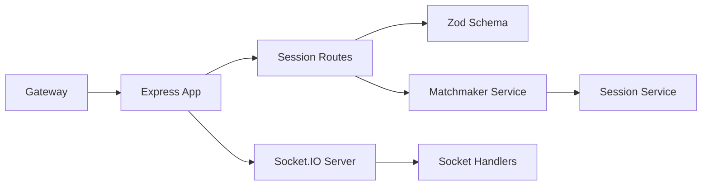

# Game API REST Endpoints

<cite>
**Referenced Files in This Document**
- [session.routes.ts](file://apps/game-api/src/routes/session.routes.ts)
- [matchmaker.service.ts](file://apps/game-api/src/services/matchmaker.service.ts)
- [session.service.ts](file://apps/game-api/src/services/session.service.ts)
- [socket.handler.ts](file://apps/game-api/src/websocket/socket.handler.ts)
- [index.ts](file://apps/game-api/src/index.ts)
- [app.ts](file://apps/game-api/src/app.ts)
- [rate-limit.ts](file://apps/gateway/src/middleware/rate-limit.ts)
- [session.ts](file://packages/types/src/session.ts)
- [lobby.tsx](file://apps/web/components/game/lobby.tsx)
- [arena.tsx](file://apps/web/components/game/arena.tsx)
</cite>

## Table of Contents
1. [Introduction](#introduction)
2. [Project Structure](#project-structure)
3. [Core Components](#core-components)
4. [Architecture Overview](#architecture-overview)
5. [Detailed Component Analysis](#detailed-component-analysis)
6. [Dependency Analysis](#dependency-analysis)
7. [Performance Considerations](#performance-considerations)
8. [Troubleshooting Guide](#troubleshooting-guide)
9. [Conclusion](#conclusion)
10. [Appendices](#appendices)

## Introduction
This document provides comprehensive REST API documentation for the Game API session creation endpoint. It covers request schema validation, matchmaking logic, response status codes, error handling, authentication requirements, rate limiting considerations, and integration patterns with frontend game components. It also includes concrete usage examples for candidate registration, session management, and real-time game coordination.

## Project Structure
The Game API exposes a single primary endpoint for session creation and integrates with a WebSocket server for real-time coordination. Supporting services manage sessions, matchmaking, and round orchestration. The gateway enforces rate limiting, and shared types define the request schema and constants.

**Diagram sources**
- [index.ts](file://apps/game-api/src/index.ts#L15-L31)
- [app.ts](file://apps/game-api/src/app.ts#L25-L31)
- [session.routes.ts](file://apps/game-api/src/routes/session.routes.ts#L19-L35)
- [matchmaker.service.ts](file://apps/game-api/src/services/matchmaker.service.ts#L47-L57)
- [session.service.ts](file://apps/game-api/src/services/session.service.ts#L18-L46)
- [socket.handler.ts](file://apps/game-api/src/websocket/socket.handler.ts#L62-L106)
- [lobby.tsx](file://apps/web/components/game/lobby.tsx#L9-L16)
- [arena.tsx](file://apps/web/components/game/arena.tsx#L48-L56)

**Section sources**
- [index.ts](file://apps/game-api/src/index.ts#L15-L31)
- [app.ts](file://apps/game-api/src/app.ts#L25-L31)

## Core Components
- Session Creation Endpoint: POST /api/v1/sessions with strict schema validation and matchmaking logic.
- Matchmaker Service: Handles single/dual player modes, queue management, and session creation.
- Session Service: Manages Redis-backed session state, player readiness, and round data.
- WebSocket Integration: Real-time events for identification, joining sessions, ready-ups, telemetry, and anti-cheat relays.
- Rate Limiting: Applied at the gateway for general requests.

**Section sources**
- [session.routes.ts](file://apps/game-api/src/routes/session.routes.ts#L7-L17)
- [matchmaker.service.ts](file://apps/game-api/src/services/matchmaker.service.ts#L41-L57)
- [session.service.ts](file://apps/game-api/src/services/session.service.ts#L18-L46)
- [socket.handler.ts](file://apps/game-api/src/websocket/socket.handler.ts#L62-L106)
- [rate-limit.ts](file://apps/gateway/src/middleware/rate-limit.ts#L15-L80)

## Architecture Overview
The session creation flow validates the request, delegates to the matchmaker, and returns either a queued or matched result. Successful matches trigger WebSocket notifications to clients. Sessions are persisted in Redis and coordinated via Socket.IO rooms.

**Diagram sources**
- [session.routes.ts](file://apps/game-api/src/routes/session.routes.ts#L19-L35)
- [matchmaker.service.ts](file://apps/game-api/src/services/matchmaker.service.ts#L47-L169)
- [session.service.ts](file://apps/game-api/src/services/session.service.ts#L18-L46)
- [socket.handler.ts](file://apps/game-api/src/websocket/socket.handler.ts#L108-L157)

## Detailed Component Analysis

### Session Creation Endpoint: POST /api/v1/sessions
- Path: /api/v1/sessions
- Method: POST
- Purpose: Create a new game session and initiate matchmaking.

Request Schema (validated server-side):
- mode: Literal "ARCADE"
- playerFormat: Enum "SINGLE" | "DUAL"
- sessionType: Enum "TIMER" | "LIVE"
- category: Enum "MISSING_LINK" | "BOTTLENECK" | "TRACING" or null
- userId: Non-empty string
- socketId: Optional string (used to target the correct tab when notifying MATCHED)

Validation rules:
- TIMER mode requires category to be non-null.
- userId must be present.

Response:
- 201 Created: Session matched immediately with sessionId.
- 202 Accepted: Player queued for dual matchmaking with queueKey.
- 400 Bad Request: Validation error or server-side exception.

Error handling:
- Zod validation failures return structured error details.
- Unhandled exceptions return a generic internal error.

Example request payload:
{
  "mode": "ARCADE",
  "playerFormat": "DUAL",
  "sessionType": "TIMER",
  "category": "BOTTLENECK",
  "userId": "user-123",
  "socketId": "tab-abc"
}

Successful response (matched):
{
  "data": {
    "status": "MATCHED",
    "sessionId": "uuid-v4"
  }
}

Successful response (queued):
{
  "data": {
    "status": "QUEUED",
    "queueKey": "TIMER:BOTTLENECK"
  }
}

Validation error response:
{
  "error": {
    "field": "_errors",
    "fieldWithCategory": {
      "category": {
        "code": "too_small",
        "minimum": 1,
        "type": "string",
        "inclusive": true,
        "message": "Timer Mode requires a category"
      }
    }
  }
}

Server-side exception response:
{
  "error": "An unexpected error occurred"
}

**Section sources**
- [session.routes.ts](file://apps/game-api/src/routes/session.routes.ts#L7-L17)
- [session.routes.ts](file://apps/game-api/src/routes/session.routes.ts#L19-L35)
- [app.ts](file://apps/game-api/src/app.ts#L33-L62)
- [session.ts](file://packages/types/src/session.ts#L25-L36)

### Matchmaking Logic
- Single-player sessions: Immediately create a session and return MATCHED.
- Dual-player sessions:
  - Build a waiting room key from sessionType and category.
  - If an opponent exists and is different user, pair them and create a session.
  - Otherwise, enqueue the current user with optional socketId for precise notification.
  - Emit MATCHED to the waiting player via WebSocket if available; otherwise rely on pending match Redis key for later delivery.

**Diagram sources**
- [matchmaker.service.ts](file://apps/game-api/src/services/matchmaker.service.ts#L47-L169)

**Section sources**
- [matchmaker.service.ts](file://apps/game-api/src/services/matchmaker.service.ts#L47-L169)

### Session Management (Redis-backed)
- Session creation stores session metadata and initializes player data.
- Player joined/ready tracking uses Redis sets with TTL.
- Pending match keys link users to sessions for re-delivery after reconnect.
- Active session tracking associates users with current sessions.

Key operations:
- createSession: Persist session and player data with TTL.
- getSession/updateSession: Retrieve and update session state.
- markPlayerJoined/markPlayerReady: Track participation.
- getPendingMatch/clearPendingMatch: Manage post-reconnect notifications.
- serialize: Build player list with scores/lives for round/result payloads.

**Section sources**
- [session.service.ts](file://apps/game-api/src/services/session.service.ts#L18-L166)

### WebSocket Integration for Real-Time Coordination
- IDENTIFY: Associate userId with socketId and re-join active/pending session rooms; re-deliver MATCHED if pending.
- JOIN_SESSION: Join a session room, mark as active, and notify client with session state.
- PLAYER_READY: Track readiness; start round when all players are ready.
- TYPING_TELEMETRY: Relay opponent progress to live sessions.
- SURVIVAL_REQUEUE: Requeue winners for next match (single creates new session; dual returns to queue).
- SUBMIT_ANSWER: Handle answer submissions per round.
- DISCONNECT: Cancel queue and unregister socket.

**Diagram sources**
- [socket.handler.ts](file://apps/game-api/src/websocket/socket.handler.ts#L72-L202)

**Section sources**
- [socket.handler.ts](file://apps/game-api/src/websocket/socket.handler.ts#L62-L308)

### Frontend Integration Patterns
- Lobby Component:
  - Single-player: Auto-ready after countdown.
  - Dual-player: Show queued/searching state; enable Ready Up when matched.
- Arena Component:
  - Render appropriate UI based on challenge type (code, MCQ, tracing).
  - Emit typing telemetry for live sessions.
  - Submit answers and coordinate round progression.

**Section sources**
- [lobby.tsx](file://apps/web/components/game/lobby.tsx#L9-L16)
- [arena.tsx](file://apps/web/components/game/arena.tsx#L48-L56)

## Dependency Analysis
- Express app mounts session routes and applies CORS/security middleware.
- Route depends on Zod schema and Matchmaker Service.
- Matchmaker Service depends on Session Service and Socket.IO server.
- Socket.IO server registers handlers and manages rooms/events.
- Gateway applies rate limiting middleware before reaching Game API.

**Diagram sources**
- [app.ts](file://apps/game-api/src/app.ts#L25-L31)
- [session.routes.ts](file://apps/game-api/src/routes/session.routes.ts#L19-L35)
- [matchmaker.service.ts](file://apps/game-api/src/services/matchmaker.service.ts#L41-L45)
- [session.service.ts](file://apps/game-api/src/services/session.service.ts#L18-L46)
- [index.ts](file://apps/game-api/src/index.ts#L15-L31)
- [rate-limit.ts](file://apps/gateway/src/middleware/rate-limit.ts#L15-L80)

**Section sources**
- [app.ts](file://apps/game-api/src/app.ts#L25-L31)
- [index.ts](file://apps/game-api/src/index.ts#L15-L31)
- [rate-limit.ts](file://apps/gateway/src/middleware/rate-limit.ts#L15-L80)

## Performance Considerations
- Queue eviction: Waiting room entries older than a TTL are evicted to prevent stale queues.
- Redis TTLs: Sessions and auxiliary keys expire predictably to control memory usage.
- Retry logic: Socket notifications for matched players include retries to handle transient disconnects.
- Rate limiting: Gateway middleware prevents abuse with sliding-window counters.

[No sources needed since this section provides general guidance]

## Troubleshooting Guide
Common issues and resolutions:
- Validation errors (400): Ensure mode, playerFormat, sessionType, category, and userId conform to schema. TIMER mode requires a non-null category.
- Internal errors (500): Inspect server logs for unhandled exceptions; verify Redis connectivity and Socket.IO initialization.
- No opponent matched (202): Confirm dual mode parameters and that another user is queued under the same key.
- Missing MATCHED after reconnect: Pending match keys ensure delivery on next IDENTIFY; verify Redis keys and socket registration.

**Section sources**
- [session.routes.ts](file://apps/game-api/src/routes/session.routes.ts#L19-L35)
- [app.ts](file://apps/game-api/src/app.ts#L33-L62)
- [matchmaker.service.ts](file://apps/game-api/src/services/matchmaker.service.ts#L80-L88)
- [socket.handler.ts](file://apps/game-api/src/websocket/socket.handler.ts#L72-L106)

## Conclusion
The Game API provides a robust session creation endpoint with strict validation, efficient dual-player matchmaking, and seamless WebSocket integration for real-time coordination. Combined with gateway rate limiting and Redis-backed persistence, it supports scalable candidate registration, session management, and live game coordination across frontend components.

[No sources needed since this section summarizes without analyzing specific files]

## Appendices

### API Definition Summary
- Endpoint: POST /api/v1/sessions
- Authentication: Not enforced at route level; gateway middleware handles auth/limits.
- Rate Limiting: General limit applied at gateway.
- Request Body Fields:
  - mode: "ARCADE"
  - playerFormat: "SINGLE" | "DUAL"
  - sessionType: "TIMER" | "LIVE"
  - category: "MISSING_LINK" | "BOTTLENECK" | "TRACING" | null
  - userId: string (required)
  - socketId: string (optional)
- Responses:
  - 201: { data: { status: "MATCHED", sessionId } }
  - 202: { data: { status: "QUEUED", queueKey } }
  - 400: Validation error or server error
  - 500: Internal error

**Section sources**
- [session.routes.ts](file://apps/game-api/src/routes/session.routes.ts#L7-L17)
- [session.routes.ts](file://apps/game-api/src/routes/session.routes.ts#L19-L35)
- [rate-limit.ts](file://apps/gateway/src/middleware/rate-limit.ts#L67-L79)