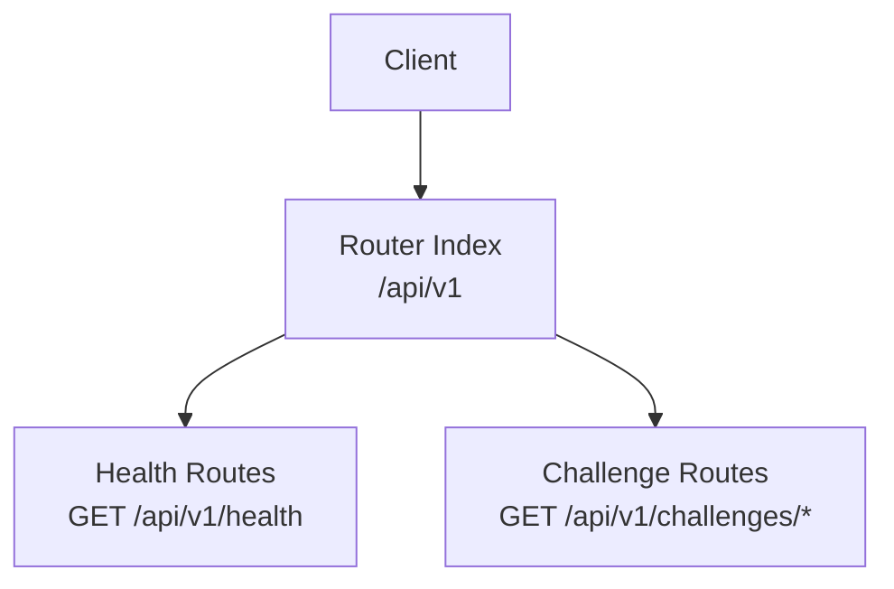
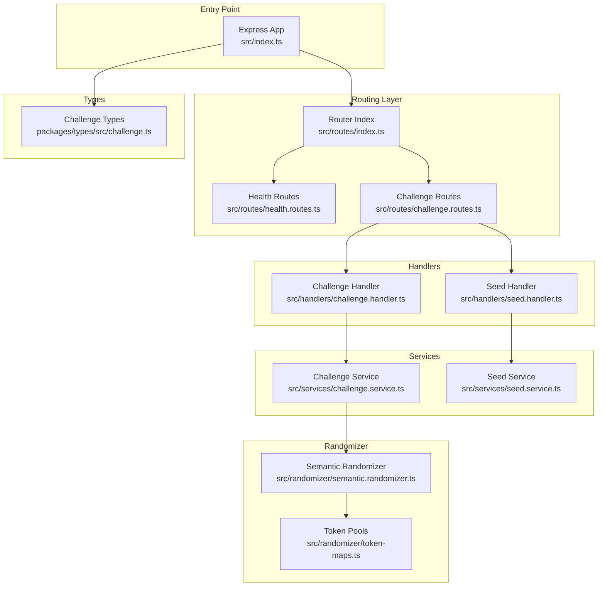
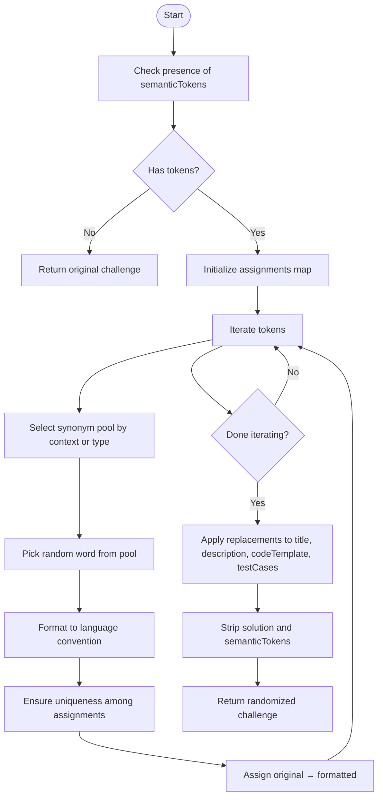
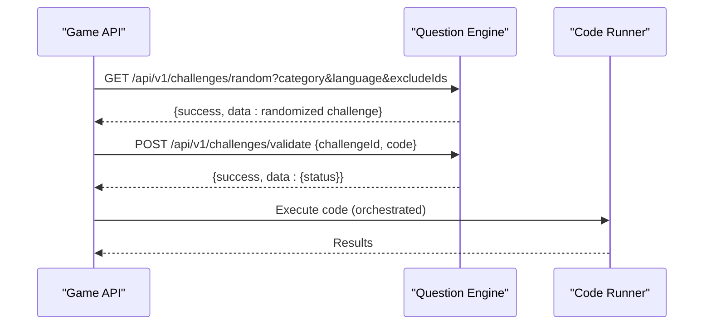
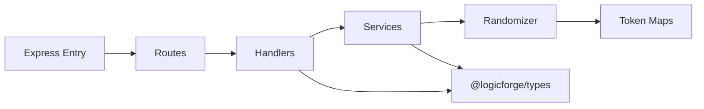

# Question Engine REST Endpoints

<cite>
**Referenced Files in This Document**
- [src/index.ts](file://apps/question-engine/src/index.ts)
- [src/routes/index.ts](file://apps/question-engine/src/routes/index.ts)
- [src/routes/challenge.routes.ts](file://apps/question-engine/src/routes/challenge.routes.ts)
- [src/routes/health.routes.ts](file://apps/question-engine/src/routes/health.routes.ts)
- [src/handlers/challenge.handler.ts](file://apps/question-engine/src/handlers/challenge.handler.ts)
- [src/handlers/seed.handler.ts](file://apps/question-engine/src/handlers/seed.handler.ts)
- [src/services/challenge.service.ts](file://apps/question-engine/src/services/challenge.service.ts)
- [src/services/seed.service.ts](file://apps/question-engine/src/services/seed.service.ts)
- [src/randomizer/semantic.randomizer.ts](file://apps/question-engine/src/randomizer/semantic.randomizer.ts)
- [src/randomizer/token-maps.ts](file://apps/question-engine/src/randomizer/token-maps.ts)
- [packages/types/src/challenge.ts](file://packages/types/src/challenge.ts)
- [apps/question-engine/data/challenges/missing-link.json](file://apps/question-engine/data/challenges/missing-link.json)
- [apps/question-engine/data/challenges/bottleneck-breaker.json](file://apps/question-engine/data/challenges/bottleneck-breaker.json)
- [apps/question-engine/data/challenges/state-tracing.json](file://apps/question-engine/data/challenges/state-tracing.json)
- [apps/question-engine/src/middleware/error.middleware.ts](file://apps/question-engine/src/middleware/error.middleware.ts)
- [apps/game-api/src/services/round.service.ts](file://apps/game-api/src/services/round.service.ts)
</cite>

## Table of Contents
1. [Introduction](#introduction)
2. [Project Structure](#project-structure)
3. [Core Components](#core-components)
4. [Architecture Overview](#architecture-overview)
5. [Detailed Component Analysis](#detailed-component-analysis)
6. [Dependency Analysis](#dependency-analysis)
7. [Performance Considerations](#performance-considerations)
8. [Troubleshooting Guide](#troubleshooting-guide)
9. [Conclusion](#conclusion)
10. [Appendices](#appendices)

## Introduction
This document provides comprehensive REST API documentation for the Question Engine service. It covers challenge management endpoints for retrieving and generating programming challenges with semantic randomization, the health check endpoint for service monitoring, and the challenge seeding endpoint for populating the database from JSON fixtures. It also documents request/response schemas, challenge categories and difficulty levels, language-specific parameters, and error handling behavior. Integration points with the code execution service and the game API are described to support orchestration of challenge delivery and validation.

## Project Structure
The Question Engine is implemented as an Express-based microservice with modular routing, handlers, services, and randomization utilities. The routes expose:
- Health check endpoint under /api/v1/health
- Challenge endpoints under /api/v1/challenges

**Diagram sources**
- [src/routes/index.ts](file://apps/question-engine/src/routes/index.ts#L1-L11)
- [src/routes/health.routes.ts](file://apps/question-engine/src/routes/health.routes.ts#L1-L11)
- [src/routes/challenge.routes.ts](file://apps/question-engine/src/routes/challenge.routes.ts#L1-L28)

**Section sources**
- [src/routes/index.ts](file://apps/question-engine/src/routes/index.ts#L1-L11)
- [src/index.ts](file://apps/question-engine/src/index.ts#L1-L46)

## Core Components
- Express server initialization, CORS, JSON parsing, and error middleware registration
- Route composition mounting health and challenge routes under /api/v1
- Challenge handlers for listing, fetching by ID, selecting random challenges, validating answers, and seeding challenges
- Services for querying challenges, randomizing content, and seeding from JSON fixtures
- Randomizer implementing semantic token substitution with language-aware formatting and uniqueness preservation
- Type definitions for categories, difficulty levels, languages, and request/response schemas

Key responsibilities:
- Validation: Zod-based request validation and standardized error responses
- Randomization: Semantic replacement of tokens in titles, descriptions, templates, and test cases
- Seeding: Bulk insertion/upsert of challenges from local JSON files into the database

**Section sources**
- [src/index.ts](file://apps/question-engine/src/index.ts#L1-L46)
- [src/routes/challenge.routes.ts](file://apps/question-engine/src/routes/challenge.routes.ts#L1-L28)
- [src/handlers/challenge.handler.ts](file://apps/question-engine/src/handlers/challenge.handler.ts#L1-L71)
- [src/services/challenge.service.ts](file://apps/question-engine/src/services/challenge.service.ts#L1-L76)
- [src/randomizer/semantic.randomizer.ts](file://apps/question-engine/src/randomizer/semantic.randomizer.ts#L1-L94)
- [packages/types/src/challenge.ts](file://packages/types/src/challenge.ts#L1-L59)

## Architecture Overview
The service follows a layered architecture:
- Entry point initializes Express, registers middleware, and mounts routes
- Routes delegate to handlers
- Handlers call services for business logic
- Services interact with the database and randomizer
- Randomizer transforms challenge content using semantic token maps

**Diagram sources**
- [src/index.ts](file://apps/question-engine/src/index.ts#L1-L46)
- [src/routes/index.ts](file://apps/question-engine/src/routes/index.ts#L1-L11)
- [src/routes/health.routes.ts](file://apps/question-engine/src/routes/health.routes.ts#L1-L11)
- [src/routes/challenge.routes.ts](file://apps/question-engine/src/routes/challenge.routes.ts#L1-L28)
- [src/handlers/challenge.handler.ts](file://apps/question-engine/src/handlers/challenge.handler.ts#L1-L71)
- [src/handlers/seed.handler.ts](file://apps/question-engine/src/handlers/seed.handler.ts#L1-L12)
- [src/services/challenge.service.ts](file://apps/question-engine/src/services/challenge.service.ts#L1-L76)
- [src/services/seed.service.ts](file://apps/question-engine/src/services/seed.service.ts#L1-L76)
- [src/randomizer/semantic.randomizer.ts](file://apps/question-engine/src/randomizer/semantic.randomizer.ts#L1-L94)
- [src/randomizer/token-maps.ts](file://apps/question-engine/src/randomizer/token-maps.ts#L1-L53)
- [packages/types/src/challenge.ts](file://packages/types/src/challenge.ts#L1-L59)

## Detailed Component Analysis

### Health Check Endpoint
- Method: GET
- Path: /api/v1/health
- Purpose: Service availability and basic health verification
- Response: 200 OK with service metadata

Response schema:
- Body: { status: "ok", service: "question-engine" }

Integration note: The health route intentionally avoids DB queries to minimize overhead during readiness probes.

**Section sources**
- [src/routes/health.routes.ts](file://apps/question-engine/src/routes/health.routes.ts#L1-L11)

### Challenge Management Endpoints

#### GET /api/v1/challenges
- Purpose: Retrieve paginated list of active challenges with optional filters
- Query parameters:
  - category: One of THE_MISSING_LINK, THE_BOTTLENECK_BREAKER, STATE_TRACING, SYNTAX_ERROR_DETECTION
  - difficulty: One of EASY, MEDIUM, HARD
  - language: One of JAVA, CPP, PYTHON
  - page: Positive integer (default 1)
  - limit: Positive integer up to 50 (default 10)
- Response: { success: true, data: { meta: { total, page, limit }, challenges: [...] } }
- Challenge response shape (selected fields):
  - id: UUID
  - category: Enum
  - difficulty: Enum
  - title: String
  - description: String
  - codeTemplate: String
  - hints: Array or null
  - language: Enum
  - timeLimitMs: Integer

Notes:
- The list endpoint excludes internal fields (solution, semanticTokens) and may include MCQ options for MCQ-type solutions.

**Section sources**
- [src/routes/challenge.routes.ts](file://apps/question-engine/src/routes/challenge.routes.ts#L12-L13)
- [src/handlers/challenge.handler.ts](file://apps/question-engine/src/handlers/challenge.handler.ts#L16-L20)
- [src/services/challenge.service.ts](file://apps/question-engine/src/services/challenge.service.ts#L8-L26)
- [packages/types/src/challenge.ts](file://packages/types/src/challenge.ts#L18-L49)

#### GET /api/v1/challenges/:id
- Purpose: Fetch a specific challenge by ID
- Path parameters:
  - id: Challenge UUID
- Response: { success: true, data: Full challenge document (includes solution and semanticTokens) }
- Error: 404 Not Found if challenge does not exist

**Section sources**
- [src/routes/challenge.routes.ts](file://apps/question-engine/src/routes/challenge.routes.ts#L21-L22)
- [src/handlers/challenge.handler.ts](file://apps/question-engine/src/handlers/challenge.handler.ts#L41-L54)
- [src/services/challenge.service.ts](file://apps/question-engine/src/services/challenge.service.ts#L28-L32)

#### GET /api/v1/challenges/random
- Purpose: Select a random active challenge with optional filters and exclusions
- Query parameters:
  - category: Optional enum
  - difficulty: Optional enum
  - language: Optional enum
  - excludeIds: Array of challenge UUIDs to exclude
- Response: { success: true, data: Randomized challenge (solution and semanticTokens removed) }
- Behavior:
  - If no language filter is provided, a warning is logged indicating potential mismatch with session language
  - If no matching challenge exists, returns 404 with error details
- MCQ handling:
  - MCQ options are extracted before randomization and re-injected into the response for safe delivery

**Section sources**
- [src/routes/challenge.routes.ts](file://apps/question-engine/src/routes/challenge.routes.ts#L15-L16)
- [src/handlers/challenge.handler.ts](file://apps/question-engine/src/handlers/challenge.handler.ts#L22-L39)
- [src/services/challenge.service.ts](file://apps/question-engine/src/services/challenge.service.ts#L34-L62)

#### POST /api/v1/challenges/validate
- Purpose: Validate a submitted answer for a given challenge (orchestrated by higher-level services)
- Request body:
  - challengeId: UUID
  - code: String
- Response: { success: true, data: { status: "Validating in orchestrator..." } }
- Validation:
  - Returns 400 if required fields are missing

**Section sources**
- [src/routes/challenge.routes.ts](file://apps/question-engine/src/routes/challenge.routes.ts#L18-L19)
- [src/handlers/challenge.handler.ts](file://apps/question-engine/src/handlers/challenge.handler.ts#L56-L70)
- [src/services/challenge.service.ts](file://apps/question-engine/src/services/challenge.service.ts#L64-L66)

#### POST /api/v1/challenges/seed
- Purpose: Seed the database with challenges from local JSON files
- Request: None
- Response: { success: true, data: { message: "...", totalImported: number } }
- Behavior:
  - Reads predefined JSON files from data/challenges
  - Creates challenges if not present (match by title + category + language)
  - Logs warnings for missing files and throws on other errors

**Section sources**
- [src/routes/challenge.routes.ts](file://apps/question-engine/src/routes/challenge.routes.ts#L24-L25)
- [src/handlers/seed.handler.ts](file://apps/question-engine/src/handlers/seed.handler.ts#L1-L12)
- [src/services/seed.service.ts](file://apps/question-engine/src/services/seed.service.ts#L1-L76)

### Request/Response Schemas

#### Challenge Query Schema
- category: Optional enum
- difficulty: Optional enum
- language: Optional enum
- page: Optional positive integer (default 1)
- limit: Optional positive integer ≤ 50 (default 10)

**Section sources**
- [packages/types/src/challenge.ts](file://packages/types/src/challenge.ts#L18-L25)

#### Random Challenge Query Schema
- category: Optional enum
- difficulty: Optional enum
- language: Optional enum
- excludeIds: Optional array of UUIDs (default [])

**Section sources**
- [packages/types/src/challenge.ts](file://packages/types/src/challenge.ts#L28-L35)

#### Challenge Response Schema
- id: UUID
- category: Enum
- difficulty: Enum
- title: String
- description: String
- codeTemplate: String
- hints: Array or null
- language: Enum
- timeLimitMs: Integer

**Section sources**
- [packages/types/src/challenge.ts](file://packages/types/src/challenge.ts#L38-L49)

#### Semantic Token Map Schema
- Placeholder name → { type: enum, context: string (optional) }
- Types: variable, function, class, parameter, constant

**Section sources**
- [packages/types/src/challenge.ts](file://packages/types/src/challenge.ts#L51-L59)

### Challenge Categories and Difficulty Levels
- Categories:
  - THE_MISSING_LINK
  - THE_BOTTLENECK_BREAKER
  - STATE_TRACING
  - SYNTAX_ERROR_DETECTION
- Difficulty:
  - EASY
  - MEDIUM
  - HARD
- Languages:
  - JAVA
  - CPP
  - PYTHON

These enums are validated via Zod and used across queries and seeds.

**Section sources**
- [packages/types/src/challenge.ts](file://packages/types/src/challenge.ts#L4-L12)

### Language-Specific Parameters
- language: Filters challenges by target language
- Randomization respects language conventions:
  - Python: snake_case formatting for variables
  - Java/CPP: camelCase/pascalCase based on token type

**Section sources**
- [src/randomizer/semantic.randomizer.ts](file://apps/question-engine/src/randomizer/semantic.randomizer.ts#L76-L83)

### Challenge Seeding Examples
- Files processed:
  - missing-link.json
  - state-tracing.json
  - bottleneck-breaker.json
  - syntax-error.json
- Upsert logic:
  - Create if no existing record matches title + category + language
- Example fixture entries demonstrate categories, difficulty, language, code template, solution, test cases, hints, semantic tokens, and time limits

**Section sources**
- [src/services/seed.service.ts](file://apps/question-engine/src/services/seed.service.ts#L14-L19)
- [apps/question-engine/data/challenges/missing-link.json](file://apps/question-engine/data/challenges/missing-link.json#L1-L74)
- [apps/question-engine/data/challenges/state-tracing.json](file://apps/question-engine/data/challenges/state-tracing.json#L1-L60)
- [apps/question-engine/data/challenges/bottleneck-breaker.json](file://apps/question-engine/data/challenges/bottleneck-breaker.json#L1-L153)

### Randomization Algorithm
Semantic randomization replaces named tokens in titles, descriptions, templates, and test cases with synonyms from curated pools, preserving uniqueness and applying language-specific formatting.

**Diagram sources**
- [src/randomizer/semantic.randomizer.ts](file://apps/question-engine/src/randomizer/semantic.randomizer.ts#L6-L48)
- [src/randomizer/token-maps.ts](file://apps/question-engine/src/randomizer/token-maps.ts#L11-L52)

**Section sources**
- [src/randomizer/semantic.randomizer.ts](file://apps/question-engine/src/randomizer/semantic.randomizer.ts#L1-L94)
- [src/randomizer/token-maps.ts](file://apps/question-engine/src/randomizer/token-maps.ts#L1-L53)

### Integration with Code Execution Service
- Validation endpoint returns a status indicating orchestration is ongoing
- Game API consumes Question Engine random challenges and retries across language/category/excludeIds constraints
- On failure, the game API falls back to broader filters and logs warnings

**Diagram sources**
- [src/routes/challenge.routes.ts](file://apps/question-engine/src/routes/challenge.routes.ts#L15-L19)
- [src/handlers/challenge.handler.ts](file://apps/question-engine/src/handlers/challenge.handler.ts#L56-L70)
- [apps/game-api/src/services/round.service.ts](file://apps/game-api/src/services/round.service.ts#L233-L262)

**Section sources**
- [src/handlers/challenge.handler.ts](file://apps/question-engine/src/handlers/challenge.handler.ts#L56-L70)
- [apps/game-api/src/services/round.service.ts](file://apps/game-api/src/services/round.service.ts#L233-L262)

## Dependency Analysis
- Internal dependencies:
  - Routes depend on handlers
  - Handlers depend on services
  - Services depend on randomizer and database
  - Randomizer depends on token pools
- External dependencies:
  - Express, CORS, Zod, Prisma client via @logicforge/db
  - Shared types via @logicforge/types

**Diagram sources**
- [src/routes/index.ts](file://apps/question-engine/src/routes/index.ts#L1-L11)
- [src/routes/challenge.routes.ts](file://apps/question-engine/src/routes/challenge.routes.ts#L1-L28)
- [src/handlers/challenge.handler.ts](file://apps/question-engine/src/handlers/challenge.handler.ts#L1-L14)
- [src/services/challenge.service.ts](file://apps/question-engine/src/services/challenge.service.ts#L1-L6)
- [src/randomizer/semantic.randomizer.ts](file://apps/question-engine/src/randomizer/semantic.randomizer.ts#L1-L4)
- [src/randomizer/token-maps.ts](file://apps/question-engine/src/randomizer/token-maps.ts#L1-L53)
- [packages/types/src/challenge.ts](file://packages/types/src/challenge.ts#L1-L59)
- [src/index.ts](file://apps/question-engine/src/index.ts#L1-L22)

**Section sources**
- [src/index.ts](file://apps/question-engine/src/index.ts#L1-L46)
- [src/routes/index.ts](file://apps/question-engine/src/routes/index.ts#L1-L11)
- [packages/types/src/challenge.ts](file://packages/types/src/challenge.ts#L1-L59)

## Performance Considerations
- Random selection uses a count + random offset strategy; for very large datasets, consider indexed random sampling or cursor-based pagination
- Randomization performs string replacements across multiple fields; caching randomized templates could reduce CPU usage if repeated requests are common
- Seeding iterates files and inserts records; batch operations or upserts could improve throughput
- Health endpoint avoids DB queries to keep latency low for readiness checks

## Troubleshooting Guide
Common error scenarios and handling:
- Validation errors:
  - Cause: Invalid query/body fields
  - Response: 400 with VALIDATION_ERROR and details
- Not found:
  - Cause: Challenge not found by ID or no random challenge matches filters
  - Response: 404 with NOT_FOUND
- Internal errors:
  - Cause: Unhandled exceptions
  - Response: 500 with INTERNAL_ERROR
- Seed failures:
  - Cause: Missing seed files or parse errors
  - Behavior: Logs warnings and throws; caller should inspect logs and retry appropriately

Operational tips:
- Verify filters (category/difficulty/language/excludeIds) when receiving 404 from random endpoint
- Confirm seed files exist in data/challenges and are valid JSON
- Monitor health endpoint for quick availability checks

**Section sources**
- [src/middleware/error.middleware.ts](file://apps/question-engine/src/middleware/error.middleware.ts#L1-L49)
- [src/handlers/challenge.handler.ts](file://apps/question-engine/src/handlers/challenge.handler.ts#L30-L36)
- [src/services/seed.service.ts](file://apps/question-engine/src/services/seed.service.ts#L61-L68)

## Conclusion
The Question Engine exposes a focused set of REST endpoints for challenge lifecycle management, with robust validation, semantic randomization, and a straightforward health check. Its design supports integration with higher-level orchestration services for challenge delivery and code validation, while maintaining clear separation of concerns across routes, handlers, services, and randomization logic.

## Appendices

### Endpoint Reference Summary
- GET /api/v1/health
  - Description: Service health check
  - Response: 200 { status: "ok", service: "question-engine" }
- GET /api/v1/challenges
  - Description: Paginated list of active challenges
  - Query: category, difficulty, language, page, limit
  - Response: { success: true, data: { meta, challenges } }
- GET /api/v1/challenges/:id
  - Description: Fetch full challenge by ID
  - Response: { success: true, data: challenge }
- GET /api/v1/challenges/random
  - Description: Random challenge with filters and exclusions
  - Query: category, difficulty, language, excludeIds[]
  - Response: { success: true, data: randomized challenge }
- POST /api/v1/challenges/validate
  - Description: Validate answer (orchestrated)
  - Body: { challengeId, code }
  - Response: { success: true, data: { status } }
- POST /api/v1/challenges/seed
  - Description: Seed challenges from JSON fixtures
  - Response: { success: true, data: { message, totalImported } }

**Section sources**
- [src/routes/health.routes.ts](file://apps/question-engine/src/routes/health.routes.ts#L1-L11)
- [src/routes/challenge.routes.ts](file://apps/question-engine/src/routes/challenge.routes.ts#L12-L25)
- [src/handlers/challenge.handler.ts](file://apps/question-engine/src/handlers/challenge.handler.ts#L16-L70)
- [src/handlers/seed.handler.ts](file://apps/question-engine/src/handlers/seed.handler.ts#L1-L12)
- [src/services/seed.service.ts](file://apps/question-engine/src/services/seed.service.ts#L10-L75)