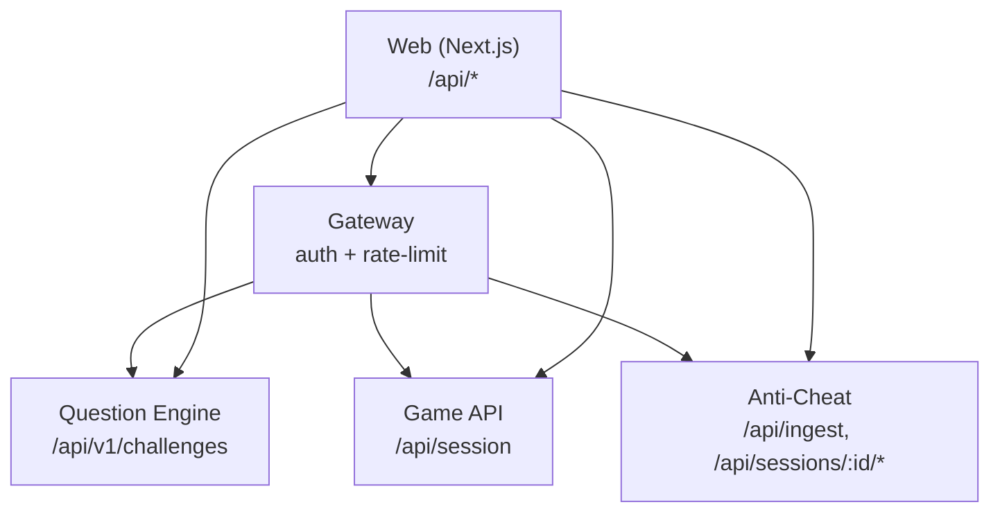
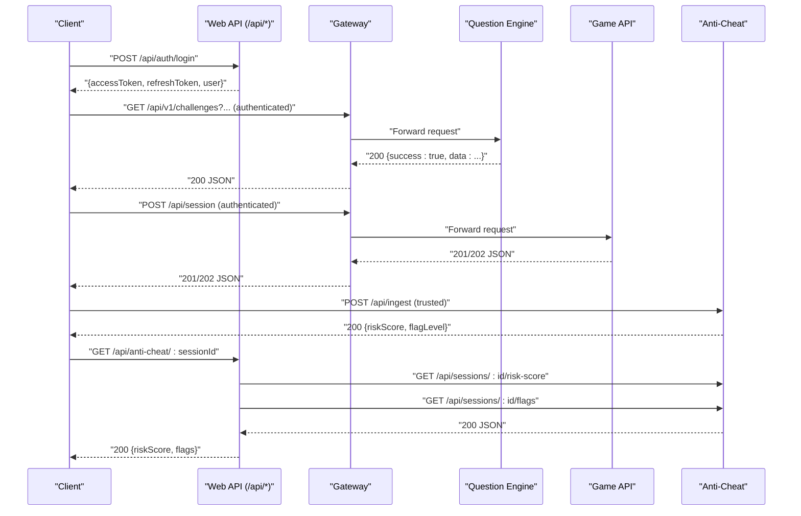
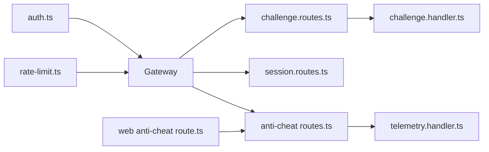

# REST API Endpoints

<cite>
**Referenced Files in This Document**
- [apps/game-api/src/routes/session.routes.ts](file://apps/game-api/src/routes/session.routes.ts)
- [apps/question-engine/src/routes/challenge.routes.ts](file://apps/question-engine/src/routes/challenge.routes.ts)
- [apps/question-engine/src/routes/health.routes.ts](file://apps/question-engine/src/routes/health.routes.ts)
- [apps/question-engine/src/handlers/challenge.handler.ts](file://apps/question-engine/src/handlers/challenge.handler.ts)
- [apps/anti-cheat/src/api/routes.ts](file://apps/anti-cheat/src/api/routes.ts)
- [apps/anti-cheat/src/handlers/telemetry.handler.ts](file://apps/anti-cheat/src/handlers/telemetry.handler.ts)
- [apps/web/app/api/anti-cheat/[sessionId]/route.ts](file://apps/web/app/api/anti-cheat/[sessionId]/route.ts)
- [apps/web/app/api/auth/login/route.ts](file://apps/web/app/api/auth/login/route.ts)
- [apps/web/app/api/auth/[...nextauth]/route.ts](file://apps/web/app/api/auth/[...nextauth]/route.ts)
- [apps/web/app/api/profile/route.ts](file://apps/web/app/api/profile/route.ts)
- [apps/web/app/api/match-history/route.ts](file://apps/web/app/api/match-history/route.ts)
- [apps/web/app/api/activity-heatmap/route.ts](file://apps/web/app/api/activity-heatmap/route.ts)
- [apps/web/app/api/story/chat/route.ts](file://apps/web/app/api/story/chat/route.ts)
- [apps/gateway/src/middleware/auth.ts](file://apps/gateway/src/middleware/auth.ts)
- [apps/gateway/src/middleware/rate-limit.ts](file://apps/gateway/src/middleware/rate-limit.ts)
</cite>

## Table of Contents
1. [Introduction](#introduction)
2. [Project Structure](#project-structure)
3. [Core Components](#core-components)
4. [Architecture Overview](#architecture-overview)
5. [Detailed Component Analysis](#detailed-component-analysis)
6. [Dependency Analysis](#dependency-analysis)
7. [Performance Considerations](#performance-considerations)
8. [Troubleshooting Guide](#troubleshooting-guide)
9. [Conclusion](#conclusion)
10. [Appendices](#appendices)

## Introduction
This document provides comprehensive REST API documentation for Logic Forge microservices. It covers HTTP methods, URL patterns, request/response schemas, authentication, rate limiting, and security considerations. It also includes practical examples, client integration patterns, and testing/debugging guidance.

## Project Structure
Logic Forge is a multi-service system composed of:
- Gateway: Centralized routing, authentication, and rate limiting.
- Question Engine: Challenge catalog, validation, and seeding.
- Game API: Session lifecycle and matchmaking orchestration.
- Anti-Cheat: Telemetry ingestion, risk scoring, and flags.
- Web: Frontend API surface for authentication, user profile, match history, activity heatmap, and story chat.

**Diagram sources**
- [apps/gateway/src/middleware/auth.ts](file://apps/gateway/src/middleware/auth.ts#L18-L64)
- [apps/gateway/src/middleware/rate-limit.ts](file://apps/gateway/src/middleware/rate-limit.ts#L15-L79)
- [apps/question-engine/src/routes/challenge.routes.ts](file://apps/question-engine/src/routes/challenge.routes.ts#L1-L28)
- [apps/game-api/src/routes/session.routes.ts](file://apps/game-api/src/routes/session.routes.ts#L1-L38)
- [apps/anti-cheat/src/api/routes.ts](file://apps/anti-cheat/src/api/routes.ts#L1-L85)
- [apps/web/app/api/anti-cheat/[sessionId]/route.ts](file://apps/web/app/api/anti-cheat/[sessionId]/route.ts#L1-L38)

**Section sources**
- [apps/gateway/src/middleware/auth.ts](file://apps/gateway/src/middleware/auth.ts#L18-L64)
- [apps/gateway/src/middleware/rate-limit.ts](file://apps/gateway/src/middleware/rate-limit.ts#L15-L79)
- [apps/question-engine/src/routes/challenge.routes.ts](file://apps/question-engine/src/routes/challenge.routes.ts#L1-L28)
- [apps/game-api/src/routes/session.routes.ts](file://apps/game-api/src/routes/session.routes.ts#L1-L38)
- [apps/anti-cheat/src/api/routes.ts](file://apps/anti-cheat/src/api/routes.ts#L1-L85)
- [apps/web/app/api/anti-cheat/[sessionId]/route.ts](file://apps/web/app/api/anti-cheat/[sessionId]/route.ts#L1-L38)

## Core Components
- Gateway Authentication Middleware: Validates JWT via Authorization header or NextAuth session cookies; injects user identity into downstream headers.
- Gateway Rate Limit Middleware: Sliding-window limiter backed by Redis; supports general and code-runner limits; fails open on Redis errors.
- Question Engine: CRUD and validation endpoints for challenges; health check endpoint.
- Game API: Session creation endpoint with matchmaking orchestration.
- Anti-Cheat: Telemetry ingestion and session risk/flags retrieval; Web adapter aggregates risk and flags.
- Web API Surface: Login, NextAuth delegation, profile, match history, activity heatmap, and story chat.

**Section sources**
- [apps/gateway/src/middleware/auth.ts](file://apps/gateway/src/middleware/auth.ts#L18-L64)
- [apps/gateway/src/middleware/rate-limit.ts](file://apps/gateway/src/middleware/rate-limit.ts#L15-L79)
- [apps/question-engine/src/routes/challenge.routes.ts](file://apps/question-engine/src/routes/challenge.routes.ts#L1-L28)
- [apps/question-engine/src/routes/health.routes.ts](file://apps/question-engine/src/routes/health.routes.ts#L1-L11)
- [apps/game-api/src/routes/session.routes.ts](file://apps/game-api/src/routes/session.routes.ts#L1-L38)
- [apps/anti-cheat/src/api/routes.ts](file://apps/anti-cheat/src/api/routes.ts#L1-L85)
- [apps/web/app/api/anti-cheat/[sessionId]/route.ts](file://apps/web/app/api/anti-cheat/[sessionId]/route.ts#L1-L38)
- [apps/web/app/api/auth/login/route.ts](file://apps/web/app/api/auth/login/route.ts#L1-L79)
- [apps/web/app/api/auth/[...nextauth]/route.ts](file://apps/web/app/api/auth/[...nextauth]/route.ts#L1-L5)
- [apps/web/app/api/profile/route.ts](file://apps/web/app/api/profile/route.ts#L1-L49)
- [apps/web/app/api/match-history/route.ts](file://apps/web/app/api/match-history/route.ts#L1-L41)
- [apps/web/app/api/activity-heatmap/route.ts](file://apps/web/app/api/activity-heatmap/route.ts#L1-L43)
- [apps/web/app/api/story/chat/route.ts](file://apps/web/app/api/story/chat/route.ts#L1-L179)

## Architecture Overview
High-level API flow:
- Clients call Web API endpoints (Next.js app).
- Gateway enforces auth and rate limits.
- Requests are proxied to backend services (Question Engine, Game API, Anti-Cheat).
- Anti-Cheat exposes both ingestion and session analytics endpoints; Web aggregates analytics for clients.

**Diagram sources**
- [apps/web/app/api/auth/login/route.ts](file://apps/web/app/api/auth/login/route.ts#L7-L79)
- [apps/gateway/src/middleware/auth.ts](file://apps/gateway/src/middleware/auth.ts#L18-L64)
- [apps/question-engine/src/routes/challenge.routes.ts](file://apps/question-engine/src/routes/challenge.routes.ts#L12-L25)
- [apps/game-api/src/routes/session.routes.ts](file://apps/game-api/src/routes/session.routes.ts#L19-L35)
- [apps/anti-cheat/src/api/routes.ts](file://apps/anti-cheat/src/api/routes.ts#L44-L82)
- [apps/web/app/api/anti-cheat/[sessionId]/route.ts](file://apps/web/app/api/anti-cheat/[sessionId]/route.ts#L6-L37)

## Detailed Component Analysis

### Authentication and Authorization
- Next.js Login Endpoint
  - Method: POST
  - URL: /api/auth/login
  - Purpose: Authenticate user and issue short-lived access token and long-lived refresh token.
  - Authentication: None required for login.
  - Request body: { email, password }
  - Responses:
    - 200: { accessToken, refreshToken, user: { id, name, email, role } }
    - 400: Missing credentials
    - 401: Invalid credentials
    - 500: Internal server error
  - Security:
    - Password comparison uses bcrypt.
    - Tokens signed with secrets from environment variables.
    - Access token TTL is short-lived; refresh token TTL is long-lived.
  - Example usage:
    - Client sends POST /api/auth/login with email and password.
    - On success, client stores tokens and uses access token for subsequent authenticated calls.

- NextAuth Delegation
  - Method: GET/POST
  - URL: /api/auth/[...nextauth]
  - Purpose: Delegates all NextAuth v5 auth flows to the framework.
  - Authentication: Depends on NextAuth configuration.
  - Responses: Standard NextAuth responses.

- Gateway Authentication Middleware
  - Methods: All routes except public paths
  - URL pattern: All proxied routes
  - Authentication:
    - Prefers Authorization: Bearer <JWT>.
    - Falls back to NextAuth session cookies.
  - Identity injection:
    - Adds x-user-id and x-user-email headers for downstream services.
  - Public routes:
    - /health and /api/auth/* are exempt from JWT validation.

- Profile Endpoint
  - Method: GET/PATCH
  - URL: /api/profile
  - Authentication: Required (NextAuth session).
  - GET:
    - Response: { displayName, bio }
    - 401: Unauthorized
    - 404: User not found
  - PATCH:
    - Request body: { displayName, bio }
    - 400: Invalid payload
    - 401: Unauthorized
    - 200: { success: true }

- Rate Limiting
  - Middleware: Sliding-window using Redis.
  - Limits:
    - General: 120 requests per 60 seconds per user/IP.
    - Code Runner: 10 requests per 60 seconds per user/IP.
  - Headers:
    - X-RateLimit-Limit and X-RateLimit-Remaining returned on each response.
  - Behavior:
    - On Redis failure, middleware fails open (next() is called).
    - 429 Too Many Requests with retryAfter hint when exceeded.

**Section sources**
- [apps/web/app/api/auth/login/route.ts](file://apps/web/app/api/auth/login/route.ts#L7-L79)
- [apps/web/app/api/auth/[...nextauth]/route.ts](file://apps/web/app/api/auth/[...nextauth]/route.ts#L1-L5)
- [apps/gateway/src/middleware/auth.ts](file://apps/gateway/src/middleware/auth.ts#L18-L64)
- [apps/web/app/api/profile/route.ts](file://apps/web/app/api/profile/route.ts#L5-L48)
- [apps/gateway/src/middleware/rate-limit.ts](file://apps/gateway/src/middleware/rate-limit.ts#L15-L79)

### Session Management API (Game Services)
- Create Session
  - Method: POST
  - URL: /api/session
  - Authentication: Required (via Gateway).
  - Request body schema:
    - mode: "ARCADE"
    - playerFormat: "SINGLE" | "DUAL"
    - sessionType: "TIMER" | "LIVE"
    - category: "MISSING_LINK" | "BOTTLENECK" | "TRACING" | null
    - userId: string (required)
    - socketId: string (optional)
  - Validation:
    - sessionType "TIMER" requires category to be set.
  - Responses:
    - 201: Matched (new session created)
    - 202: Awaiting match (queued)
    - 400: Validation error or service error
  - Notes:
    - Matchmaking orchestration delegated to service; response includes status and data.

**Section sources**
- [apps/game-api/src/routes/session.routes.ts](file://apps/game-api/src/routes/session.routes.ts#L7-L35)

### Challenge Management API (Question Engine)
- List Challenges
  - Method: GET
  - URL: /api/v1/challenges
  - Authentication: Required (via Gateway).
  - Query parameters:
    - category: enum ["MISSING_LINK","BOTTLENECK","TRACING"]
    - difficulty: enum ["EASY","MEDIUM","HARD"]
    - tags: string[]
    - limit: number
    - offset: number
  - Response: { success: true, data: Challenge[] }

- Get Random Challenge
  - Method: GET
  - URL: /api/v1/challenges/random
  - Authentication: Required.
  - Query parameters:
    - excludeIds: string | string[] (optional)
  - Response:
    - 200: { success: true, data: Challenge }
    - 404: No matching challenge

- Get Challenge by ID
  - Method: GET
  - URL: /api/v1/challenges/:id
  - Authentication: Required.
  - Response:
    - 200: { success: true, data: Challenge }
    - 404: Not found

- Validate Answer
  - Method: POST
  - URL: /api/v1/challenges/validate
  - Authentication: Required.
  - Request body: { challengeId: string, code: string }
  - Response: { success: true, data: ValidationResult }

- Seed Challenges
  - Method: POST
  - URL: /api/v1/challenges/seed
  - Authentication: Required.
  - Purpose: Load initial challenge dataset (admin-only in practice).

- Health Check
  - Method: GET
  - URL: /api/v1/challenges/health
  - Authentication: Not required.
  - Response: { status: "ok", service: "question-engine" }

**Section sources**
- [apps/question-engine/src/routes/challenge.routes.ts](file://apps/question-engine/src/routes/challenge.routes.ts#L12-L25)
- [apps/question-engine/src/handlers/challenge.handler.ts](file://apps/question-engine/src/handlers/challenge.handler.ts#L16-L70)
- [apps/question-engine/src/routes/health.routes.ts](file://apps/question-engine/src/routes/health.routes.ts#L5-L7)

### Anti-Cheat Telemetry API
- Ingest Telemetry Event
  - Method: POST
  - URL: /api/ingest
  - Authentication: Required (trusted ingestion path).
  - Request body:
    - sessionId: string
    - candidateId: string
    - eventType: string (must be one of accepted types)
    - timestamp?: string
    - payload?: object
  - Accepted event types: PASTE_DETECTED, FOCUS_LOST, FOCUS_RESTORED, KEYSTROKE_BURST, MOUSE_INACTIVE, SOLUTION_SUBMITTED, FAST_SOLUTION
  - Response: { riskScore: number, flagLevel: string|null }
  - Errors:
    - 400: Invalid body or invalid eventType
    - 500: Ingest failed

- Get Session Risk Score
  - Method: GET
  - URL: /api/sessions/:id/risk-score
  - Authentication: Required.
  - Path param: id = sessionId
  - Response: { sessionId, candidateId, riskScore, updatedAt }
  - Errors:
    - 404: Session risk state not found
    - 500: Failed to fetch risk score

- Get Session Flags
  - Method: GET
  - URL: /api/sessions/:id/flags
  - Authentication: Required.
  - Path param: id = sessionId
  - Response: Array of flag entries ordered by timestamp desc

- Web Adapter: Anti-Cheat Analytics
  - Method: GET
  - URL: /api/anti-cheat/:sessionId
  - Authentication: Required.
  - Path param: sessionId
  - Behavior: Calls both risk-score and flags endpoints concurrently, merges results.
  - Response: { riskScore: number, candidateId: string|null, updatedAt: string|null, flags: any[] }
  - Errors:
    - Returns safe defaults on upstream failures.

**Section sources**
- [apps/anti-cheat/src/api/routes.ts](file://apps/anti-cheat/src/api/routes.ts#L44-L82)
- [apps/anti-cheat/src/handlers/telemetry.handler.ts](file://apps/anti-cheat/src/handlers/telemetry.handler.ts#L16-L51)
- [apps/web/app/api/anti-cheat/[sessionId]/route.ts](file://apps/web/app/api/anti-cheat/[sessionId]/route.ts#L6-L37)

### Additional Web APIs
- Match History
  - Method: GET
  - URL: /api/match-history
  - Authentication: Required.
  - Response: { records: MatchRecord[], globalScore: number }
  - Errors: 401 Unauthorized, 500 on failure.

- Activity Heatmap
  - Method: GET
  - URL: /api/activity-heatmap
  - Authentication: Required.
  - Response: { data: { date: string, count: number }[] }
  - Errors: 401 Unauthorized, 500 on failure.

- Story Chat (SSE)
  - Method: POST
  - URL: /api/story/chat
  - Authentication: Required.
  - Request body: { messages: { role, content }[], zone: string, playerState: object }
  - Response: Server-Sent Events stream with { text } chunks ending with [DONE].
  - Errors: 500 if API key missing; 429 with retry guidance when rate-limited by provider.

**Section sources**
- [apps/web/app/api/match-history/route.ts](file://apps/web/app/api/match-history/route.ts#L6-L40)
- [apps/web/app/api/activity-heatmap/route.ts](file://apps/web/app/api/activity-heatmap/route.ts#L10-L42)
- [apps/web/app/api/story/chat/route.ts](file://apps/web/app/api/story/chat/route.ts#L87-L178)

## Dependency Analysis
- Authentication and Rate Limiting:
  - Gateway applies auth middleware globally and rate-limit middleware selectively.
  - Auth middleware sets x-user-* headers for downstream services.
- Anti-Cheat:
  - Telemetry ingestion is trusted; analytics endpoints are exposed to Web.
  - Web aggregates risk and flags for client consumption.
- Question Engine:
  - Handlers enforce query/body validation and return structured success/error payloads.
- Game API:
  - Session creation validates request shape and delegates matchmaking.

**Diagram sources**
- [apps/gateway/src/middleware/auth.ts](file://apps/gateway/src/middleware/auth.ts#L18-L64)
- [apps/gateway/src/middleware/rate-limit.ts](file://apps/gateway/src/middleware/rate-limit.ts#L15-L79)
- [apps/question-engine/src/routes/challenge.routes.ts](file://apps/question-engine/src/routes/challenge.routes.ts#L1-L28)
- [apps/question-engine/src/handlers/challenge.handler.ts](file://apps/question-engine/src/handlers/challenge.handler.ts#L1-L71)
- [apps/game-api/src/routes/session.routes.ts](file://apps/game-api/src/routes/session.routes.ts#L1-L38)
- [apps/anti-cheat/src/api/routes.ts](file://apps/anti-cheat/src/api/routes.ts#L1-L85)
- [apps/anti-cheat/src/handlers/telemetry.handler.ts](file://apps/anti-cheat/src/handlers/telemetry.handler.ts#L1-L82)
- [apps/web/app/api/anti-cheat/[sessionId]/route.ts](file://apps/web/app/api/anti-cheat/[sessionId]/route.ts#L1-L38)

**Section sources**
- [apps/gateway/src/middleware/auth.ts](file://apps/gateway/src/middleware/auth.ts#L18-L64)
- [apps/gateway/src/middleware/rate-limit.ts](file://apps/gateway/src/middleware/rate-limit.ts#L15-L79)
- [apps/question-engine/src/routes/challenge.routes.ts](file://apps/question-engine/src/routes/challenge.routes.ts#L1-L28)
- [apps/question-engine/src/handlers/challenge.handler.ts](file://apps/question-engine/src/handlers/challenge.handler.ts#L1-L71)
- [apps/game-api/src/routes/session.routes.ts](file://apps/game-api/src/routes/session.routes.ts#L1-L38)
- [apps/anti-cheat/src/api/routes.ts](file://apps/anti-cheat/src/api/routes.ts#L1-L85)
- [apps/anti-cheat/src/handlers/telemetry.handler.ts](file://apps/anti-cheat/src/handlers/telemetry.handler.ts#L1-L82)
- [apps/web/app/api/anti-cheat/[sessionId]/route.ts](file://apps/web/app/api/anti-cheat/[sessionId]/route.ts#L1-L38)

## Performance Considerations
- Rate Limiting:
  - Use sliding-window Redis keys to prevent abuse while maintaining fairness.
  - General and specialized limits reduce contention for compute-heavy endpoints.
- Anti-Cheat:
  - Telemetry ingestion is designed to be lightweight; risk scoring is computed asynchronously.
  - Web adapter performs concurrent fetches to minimize latency.
- Question Engine:
  - Validation and random selection endpoints should leverage query filters to avoid heavy scans.
- Story Chat:
  - Uses retry with exponential backoff for provider rate limits; configure appropriate timeouts.

[No sources needed since this section provides general guidance]

## Troubleshooting Guide
- Authentication Failures:
  - Verify Authorization header or NextAuth session cookie presence.
  - Confirm JWT secret and NextAuth configuration.
- Rate Limit Exceeded:
  - Inspect X-RateLimit-Remaining and retryAfter hints.
  - Reduce request frequency or contact support.
- Anti-Cheat:
  - Ensure eventType is one of accepted values.
  - Confirm session exists before querying risk/flags.
- Question Engine:
  - Validate query parameters and challenge IDs.
  - Check service health endpoint for readiness.
- Web APIs:
  - Profile and match history require a valid NextAuth session.
  - Story chat requires a configured provider API key.

**Section sources**
- [apps/gateway/src/middleware/auth.ts](file://apps/gateway/src/middleware/auth.ts#L32-L63)
- [apps/gateway/src/middleware/rate-limit.ts](file://apps/gateway/src/middleware/rate-limit.ts#L48-L63)
- [apps/anti-cheat/src/api/routes.ts](file://apps/anti-cheat/src/api/routes.ts#L44-L82)
- [apps/question-engine/src/routes/health.routes.ts](file://apps/question-engine/src/routes/health.routes.ts#L5-L7)
- [apps/web/app/api/profile/route.ts](file://apps/web/app/api/profile/route.ts#L7-L18)
- [apps/web/app/api/match-history/route.ts](file://apps/web/app/api/match-history/route.ts#L8-L11)
- [apps/web/app/api/story/chat/route.ts](file://apps/web/app/api/story/chat/route.ts#L89-L95)

## Conclusion
This documentation outlines the REST API surface across Logic Forge’s microservices, detailing endpoints, schemas, authentication, rate limiting, and operational guidance. Clients should integrate with the Gateway for centralized auth and rate limiting, consume Question Engine for challenges, Game API for sessions, and Anti-Cheat for telemetry analytics.

[No sources needed since this section summarizes without analyzing specific files]

## Appendices

### API Testing Approaches and Debugging Techniques
- Use a REST client to test endpoints:
  - Authentication: Start with POST /api/auth/login to obtain tokens.
  - Protected endpoints: Attach Authorization: Bearer <accessToken> header.
- Validate rate limits:
  - Observe X-RateLimit-Remaining and handle 429 responses gracefully.
- Anti-Cheat:
  - Ingest events via /api/ingest and verify risk updates via /api/sessions/:id/risk-score.
- Web adapters:
  - Test /api/anti-cheat/:sessionId for combined analytics.
- Story Chat:
  - Send POST /api/story/chat with structured messages and player state; inspect SSE stream.

[No sources needed since this section provides general guidance]