# Web App REST Endpoints

<cite>
**Referenced Files in This Document**
- [apps/web/app/api/auth/[...nextauth]/route.ts](file://apps/web/app/api/auth/[...nextauth]/route.ts)
- [apps/web/app/api/auth/login/route.ts](file://apps/web/app/api/auth/login/route.ts)
- [apps/web/app/api/profile/route.ts](file://apps/web/app/api/profile/route.ts)
- [apps/web/app/api/activity-heatmap/route.ts](file://apps/web/app/api/activity-heatmap/route.ts)
- [apps/web/app/api/match-history/route.ts](file://apps/web/app/api/match-history/route.ts)
- [apps/web/app/api/anti-cheat/[sessionId]/route.ts](file://apps/web/app/api/anti-cheat/[sessionId]/route.ts)
- [apps/web/app/api/story/chat/route.ts](file://apps/web/app/api/story/chat/route.ts)
- [apps/web/auth.ts](file://apps/web/auth.ts)
- [apps/web/auth.config.ts](file://apps/web/auth.config.ts)
- [apps/web/middleware.ts](file://apps/web/middleware.ts)
- [packages/db/src/mongoose-auth.ts](file://packages/db/src/mongoose-auth.ts)
- [packages/db/src/index.ts](file://packages/db/src/index.ts)
- [packages/db/prisma/schema.prisma](file://packages/db/prisma/schema.prisma)
- [packages/db/prisma/migrations/20260308000000_add_match_records_and_anti_cheat/migration.sql](file://packages/db/prisma/migrations/20260308000000_add_match_records_and_anti_cheat/migration.sql)
- [apps/game-api/src/services/match-record.service.ts](file://apps/game-api/src/services/match-record.service.ts)
- [apps/web/app/dashboard/MatchHistoryTable.tsx](file://apps/web/app/dashboard/MatchHistoryTable.tsx)
</cite>

## Table of Contents
1. [Introduction](#introduction)
2. [Project Structure](#project-structure)
3. [Core Components](#core-components)
4. [Architecture Overview](#architecture-overview)
5. [Detailed Component Analysis](#detailed-component-analysis)
6. [Dependency Analysis](#dependency-analysis)
7. [Performance Considerations](#performance-considerations)
8. [Troubleshooting Guide](#troubleshooting-guide)
9. [Conclusion](#conclusion)
10. [Appendices](#appendices)

## Introduction
This document provides comprehensive REST API documentation for the Web App endpoints. It covers:
- Authentication endpoints integrating NextAuth for Google and GitHub OAuth, login/logout operations, and session management
- User profile management endpoints for account information, preferences, and settings
- Activity heatmap endpoints for user engagement tracking
- Match history endpoints for performance analytics
- Dashboard data endpoints
- Request/response schemas for user data operations, authentication tokens, and analytics queries
- Examples of JWT token handling, session persistence, user data validation, and real-time dashboard updates
- Security considerations for user data protection, rate limiting for API access, and integration patterns with the frontend Next.js application

## Project Structure
The Web App exposes REST endpoints under apps/web/app/api. Authentication is handled via NextAuth with a Mongoose adapter and JWT strategy. Analytics and match data are served via Prisma-backed endpoints. Anti-cheat data is proxied from a dedicated service.

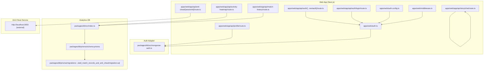

**Diagram sources**
- [apps/web/app/api/auth/[...nextauth]/route.ts](file://apps/web/app/api/auth/[...nextauth]/route.ts#L1-L5)
- [apps/web/app/api/auth/login/route.ts](file://apps/web/app/api/auth/login/route.ts#L1-L79)
- [apps/web/app/api/profile/route.ts](file://apps/web/app/api/profile/route.ts#L1-L49)
- [apps/web/app/api/activity-heatmap/route.ts](file://apps/web/app/api/activity-heatmap/route.ts#L1-L43)
- [apps/web/app/api/match-history/route.ts](file://apps/web/app/api/match-history/route.ts#L1-L41)
- [apps/web/app/api/anti-cheat/[sessionId]/route.ts](file://apps/web/app/api/anti-cheat/[sessionId]/route.ts#L1-L38)
- [apps/web/app/api/story/chat/route.ts](file://apps/web/app/api/story/chat/route.ts#L1-L179)
- [apps/web/auth.ts](file://apps/web/auth.ts#L59-L171)
- [apps/web/auth.config.ts](file://apps/web/auth.config.ts#L11-L57)
- [apps/web/middleware.ts](file://apps/web/middleware.ts#L8-L39)
- [packages/db/src/mongoose-auth.ts](file://packages/db/src/mongoose-auth.ts#L158-L212)
- [packages/db/src/index.ts](file://packages/db/src/index.ts#L1-L17)
- [packages/db/prisma/schema.prisma](file://packages/db/prisma/schema.prisma#L263-L284)
- [packages/db/prisma/migrations/20260308000000_add_match_records_and_anti_cheat/migration.sql](file://packages/db/prisma/migrations/20260308000000_add_match_records_and_anti_cheat/migration.sql#L1-L39)

**Section sources**
- [apps/web/app/api/auth/[...nextauth]/route.ts](file://apps/web/app/api/auth/[...nextauth]/route.ts#L1-L5)
- [apps/web/app/api/auth/login/route.ts](file://apps/web/app/api/auth/login/route.ts#L1-L79)
- [apps/web/app/api/profile/route.ts](file://apps/web/app/api/profile/route.ts#L1-L49)
- [apps/web/app/api/activity-heatmap/route.ts](file://apps/web/app/api/activity-heatmap/route.ts#L1-L43)
- [apps/web/app/api/match-history/route.ts](file://apps/web/app/api/match-history/route.ts#L1-L41)
- [apps/web/app/api/anti-cheat/[sessionId]/route.ts](file://apps/web/app/api/anti-cheat/[sessionId]/route.ts#L1-L38)
- [apps/web/app/api/story/chat/route.ts](file://apps/web/app/api/story/chat/route.ts#L1-L179)
- [apps/web/auth.ts](file://apps/web/auth.ts#L59-L171)
- [apps/web/auth.config.ts](file://apps/web/auth.config.ts#L11-L57)
- [apps/web/middleware.ts](file://apps/web/middleware.ts#L8-L39)
- [packages/db/src/mongoose-auth.ts](file://packages/db/src/mongoose-auth.ts#L158-L212)
- [packages/db/src/index.ts](file://packages/db/src/index.ts#L1-L17)
- [packages/db/prisma/schema.prisma](file://packages/db/prisma/schema.prisma#L263-L284)
- [packages/db/prisma/migrations/20260308000000_add_match_records_and_anti_cheat/migration.sql](file://packages/db/prisma/migrations/20260308000000_add_match_records_and_anti_cheat/migration.sql#L1-L39)

## Core Components
- NextAuth v5 integration with Google and GitHub providers, JWT session strategy, and a Mongoose adapter for user profiles
- REST endpoints for authentication, profile management, activity heatmap, match history, anti-cheat metrics, and story chat
- Prisma-backed analytics models for match records and user scores
- Middleware enforcing session presence for protected routes

**Section sources**
- [apps/web/auth.ts](file://apps/web/auth.ts#L59-L171)
- [apps/web/app/api/auth/[...nextauth]/route.ts](file://apps/web/app/api/auth/[...nextauth]/route.ts#L1-L5)
- [apps/web/app/api/auth/login/route.ts](file://apps/web/app/api/auth/login/route.ts#L1-L79)
- [apps/web/app/api/profile/route.ts](file://apps/web/app/api/profile/route.ts#L1-L49)
- [apps/web/app/api/activity-heatmap/route.ts](file://apps/web/app/api/activity-heatmap/route.ts#L1-L43)
- [apps/web/app/api/match-history/route.ts](file://apps/web/app/api/match-history/route.ts#L1-L41)
- [apps/web/app/api/anti-cheat/[sessionId]/route.ts](file://apps/web/app/api/anti-cheat/[sessionId]/route.ts#L1-L38)
- [apps/web/app/api/story/chat/route.ts](file://apps/web/app/api/story/chat/route.ts#L1-L179)
- [packages/db/prisma/schema.prisma](file://packages/db/prisma/schema.prisma#L263-L284)
- [apps/web/middleware.ts](file://apps/web/middleware.ts#L8-L39)

## Architecture Overview
The Web App uses Next.js App Router endpoints. Authentication is delegated to NextAuth, which manages sessions via cookies and JWT. Profile data is stored in MongoDB using a Mongoose adapter. Analytics data is stored in PostgreSQL via Prisma. Anti-cheat metrics are fetched from an external service.

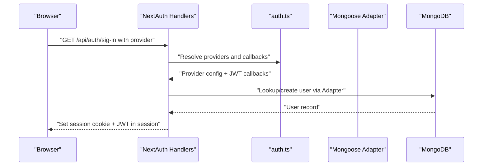

**Diagram sources**
- [apps/web/app/api/auth/[...nextauth]/route.ts](file://apps/web/app/api/auth/[...nextauth]/route.ts#L1-L5)
- [apps/web/auth.ts](file://apps/web/auth.ts#L59-L171)
- [packages/db/src/mongoose-auth.ts](file://packages/db/src/mongoose-auth.ts#L158-L212)

## Detailed Component Analysis

### Authentication Endpoints
- NextAuth OAuth catch-all route
  - Delegates all /api/auth/* requests to NextAuth handlers
  - Supports Google and GitHub OAuth
  - Uses JWT session strategy and custom cookie configuration
- Email/password login endpoint
  - Validates credentials against MongoDB user collection
  - Returns short-lived access token and long-lived refresh token
  - Uses bcrypt for password comparison

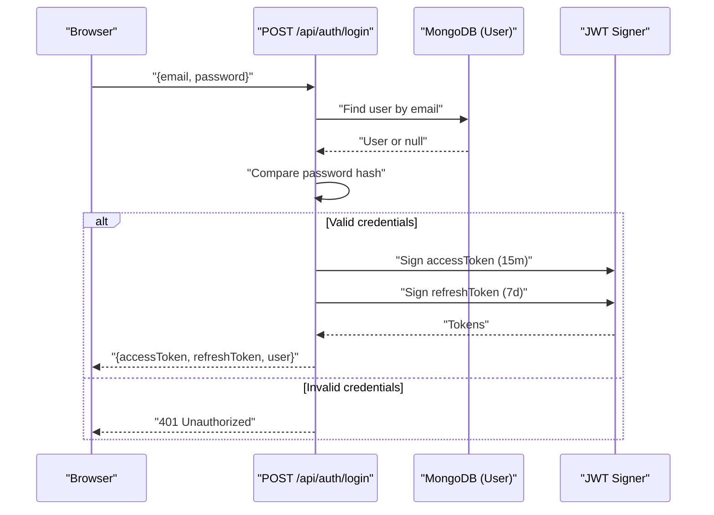

**Diagram sources**
- [apps/web/app/api/auth/login/route.ts](file://apps/web/app/api/auth/login/route.ts#L7-L79)
- [apps/web/auth.ts](file://apps/web/auth.ts#L59-L171)
- [packages/db/src/mongoose-auth.ts](file://packages/db/src/mongoose-auth.ts#L180-L191)

**Section sources**
- [apps/web/app/api/auth/[...nextauth]/route.ts](file://apps/web/app/api/auth/[...nextauth]/route.ts#L1-L5)
- [apps/web/auth.ts](file://apps/web/auth.ts#L59-L171)
- [apps/web/auth.config.ts](file://apps/web/auth.config.ts#L11-L57)
- [apps/web/app/api/auth/login/route.ts](file://apps/web/app/api/auth/login/route.ts#L1-L79)
- [packages/db/src/mongoose-auth.ts](file://packages/db/src/mongoose-auth.ts#L180-L191)

### Session Management and Middleware
- Middleware checks for session cookies on protected paths and redirects unauthenticated users to login
- NextAuth uses JWT strategy; middleware performs a lightweight presence check
- NextAuth callbacks embed user profile fields into the JWT and expose a signed access token for backend-to-backend calls

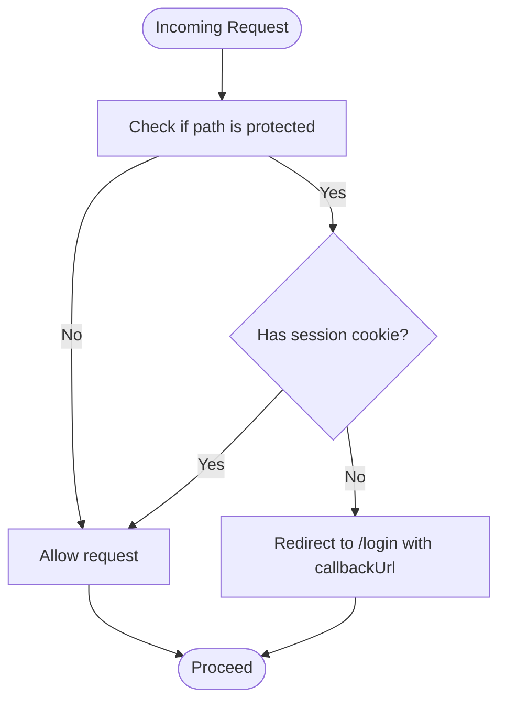

**Diagram sources**
- [apps/web/middleware.ts](file://apps/web/middleware.ts#L8-L39)
- [apps/web/auth.config.ts](file://apps/web/auth.config.ts#L34-L55)

**Section sources**
- [apps/web/middleware.ts](file://apps/web/middleware.ts#L8-L39)
- [apps/web/auth.config.ts](file://apps/web/auth.config.ts#L34-L55)
- [apps/web/auth.ts](file://apps/web/auth.ts#L133-L153)

### User Profile Management
- GET /api/profile
  - Returns displayName and bio for the authenticated user
  - Uses Mongoose adapter to fetch user by session ID
- PATCH /api/profile
  - Updates displayName and bio for the authenticated user
  - Payload validated as strings; trims values before update

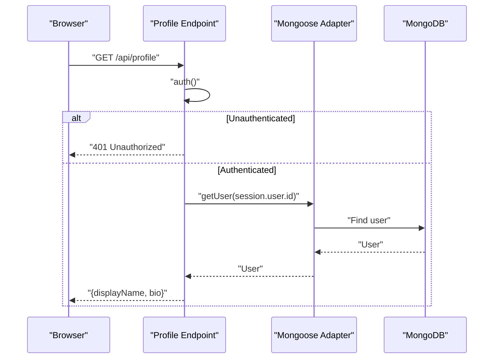

**Diagram sources**
- [apps/web/app/api/profile/route.ts](file://apps/web/app/api/profile/route.ts#L5-L24)
- [packages/db/src/mongoose-auth.ts](file://packages/db/src/mongoose-auth.ts#L180-L191)

**Section sources**
- [apps/web/app/api/profile/route.ts](file://apps/web/app/api/profile/route.ts#L1-L49)
- [packages/db/src/mongoose-auth.ts](file://packages/db/src/mongoose-auth.ts#L158-L212)

### Activity Heatmap Endpoints
- GET /api/activity-heatmap
  - Returns daily counts for the last 365 days derived from MatchRecord
  - Groups by date and counts match records per day
  - Requires authenticated session (email-based user identifier)

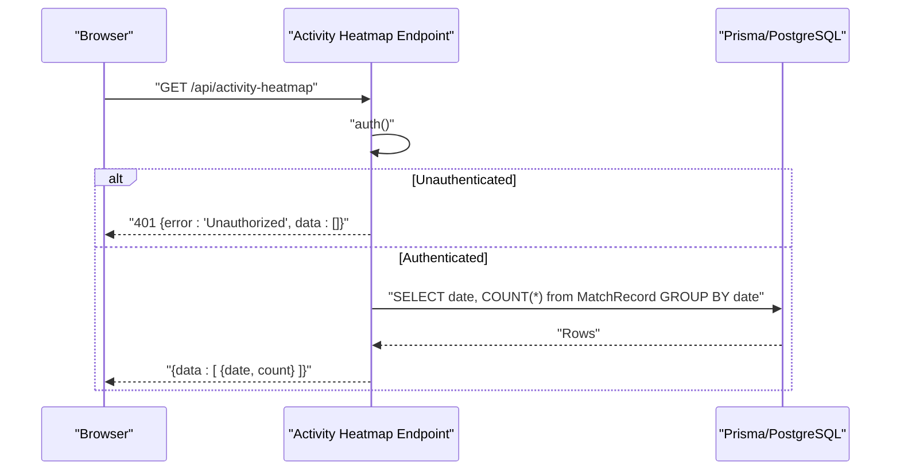

**Diagram sources**
- [apps/web/app/api/activity-heatmap/route.ts](file://apps/web/app/api/activity-heatmap/route.ts#L10-L42)
- [packages/db/prisma/schema.prisma](file://packages/db/prisma/schema.prisma#L263-L275)

**Section sources**
- [apps/web/app/api/activity-heatmap/route.ts](file://apps/web/app/api/activity-heatmap/route.ts#L1-L43)
- [packages/db/prisma/schema.prisma](file://packages/db/prisma/schema.prisma#L263-L275)

### Match History Endpoints
- GET /api/match-history
  - Returns recent match records and global score for the authenticated user
  - Uses Prisma queries to fetch up to 50 most recent matches and current global score
  - Game API stores email as userId; endpoint expects email-based identity

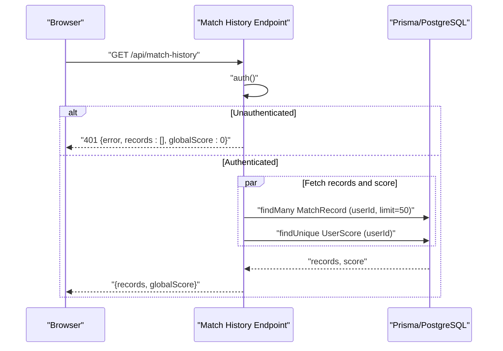

**Diagram sources**
- [apps/web/app/api/match-history/route.ts](file://apps/web/app/api/match-history/route.ts#L6-L40)
- [packages/db/prisma/schema.prisma](file://packages/db/prisma/schema.prisma#L263-L284)

**Section sources**
- [apps/web/app/api/match-history/route.ts](file://apps/web/app/api/match-history/route.ts#L1-L41)
- [packages/db/prisma/schema.prisma](file://packages/db/prisma/schema.prisma#L263-L284)
- [apps/game-api/src/services/match-record.service.ts](file://apps/game-api/src/services/match-record.service.ts#L18-L50)

### Anti-Cheat Metrics
- GET /api/anti-cheat/[sessionId]
  - Proxies risk score and flags from the anti-cheat service
  - Requires sessionId query parameter
  - Returns defaults if upstream service is unavailable

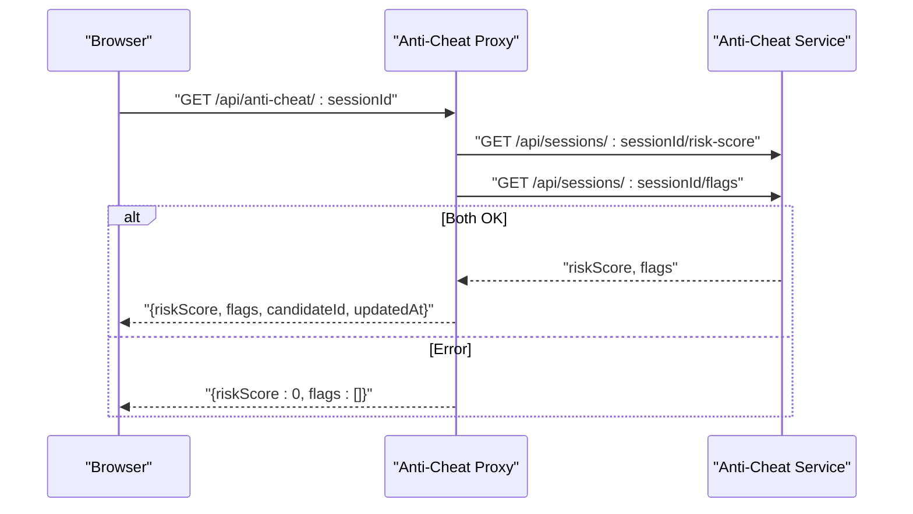

**Diagram sources**
- [apps/web/app/api/anti-cheat/[sessionId]/route.ts](file://apps/web/app/api/anti-cheat/[sessionId]/route.ts#L6-L37)

**Section sources**
- [apps/web/app/api/anti-cheat/[sessionId]/route.ts](file://apps/web/app/api/anti-cheat/[sessionId]/route.ts#L1-L38)

### Story Chat Endpoint
- POST /api/story/chat
  - Streams narrative responses powered by Google Generative AI
  - Enforces retry with exponential backoff for rate limits
  - Returns Server-Sent Events compatible stream

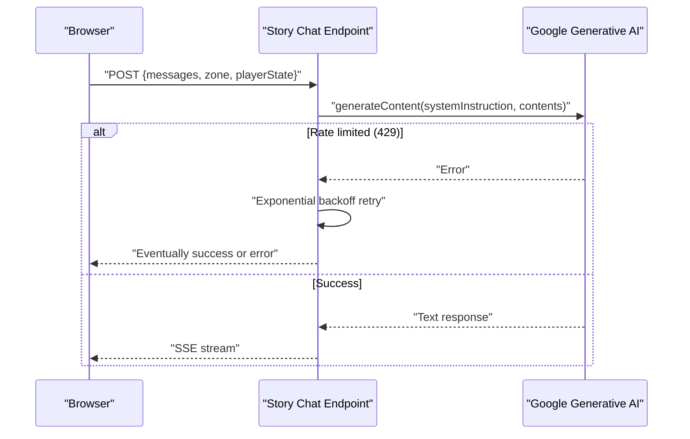

**Diagram sources**
- [apps/web/app/api/story/chat/route.ts](file://apps/web/app/api/story/chat/route.ts#L87-L179)

**Section sources**
- [apps/web/app/api/story/chat/route.ts](file://apps/web/app/api/story/chat/route.ts#L1-L179)

## Dependency Analysis
- NextAuth depends on:
  - Google and GitHub providers
  - Mongoose adapter for user persistence
  - JWT signing for session and access tokens
- Analytics endpoints depend on:
  - Prisma client for PostgreSQL
  - MatchRecord and UserScore models
- Anti-cheat endpoint depends on an external service
- Middleware depends on NextAuth configuration for cookie names and protected paths

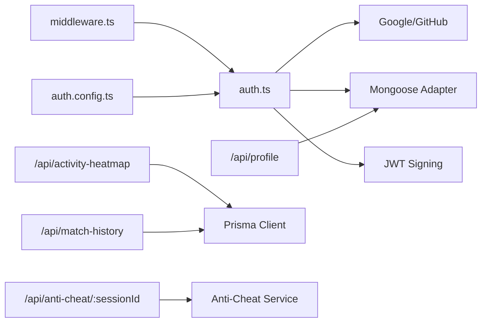

**Diagram sources**
- [apps/web/auth.ts](file://apps/web/auth.ts#L59-L171)
- [apps/web/app/api/profile/route.ts](file://apps/web/app/api/profile/route.ts#L1-L49)
- [apps/web/app/api/activity-heatmap/route.ts](file://apps/web/app/api/activity-heatmap/route.ts#L1-L43)
- [apps/web/app/api/match-history/route.ts](file://apps/web/app/api/match-history/route.ts#L1-L41)
- [apps/web/app/api/anti-cheat/[sessionId]/route.ts](file://apps/web/app/api/anti-cheat/[sessionId]/route.ts#L1-L38)
- [apps/web/middleware.ts](file://apps/web/middleware.ts#L8-L39)
- [apps/web/auth.config.ts](file://apps/web/auth.config.ts#L11-L57)

**Section sources**
- [apps/web/auth.ts](file://apps/web/auth.ts#L59-L171)
- [apps/web/app/api/profile/route.ts](file://apps/web/app/api/profile/route.ts#L1-L49)
- [apps/web/app/api/activity-heatmap/route.ts](file://apps/web/app/api/activity-heatmap/route.ts#L1-L43)
- [apps/web/app/api/match-history/route.ts](file://apps/web/app/api/match-history/route.ts#L1-L41)
- [apps/web/app/api/anti-cheat/[sessionId]/route.ts](file://apps/web/app/api/anti-cheat/[sessionId]/route.ts#L1-L38)
- [apps/web/middleware.ts](file://apps/web/middleware.ts#L8-L39)
- [apps/web/auth.config.ts](file://apps/web/auth.config.ts#L11-L57)

## Performance Considerations
- Use pagination or limits for endpoints returning large datasets (e.g., match history)
- Cache frequently accessed analytics data where appropriate
- Consider connection pooling and indexing for PostgreSQL queries
- Offload heavy AI generation to external services and implement backpressure/retry strategies
- Monitor and tune database indexes for MatchRecord and UserScore

[No sources needed since this section provides general guidance]

## Troubleshooting Guide
- Authentication failures
  - Verify AUTH_SECRET/NEXTAUTH_SECRET and provider credentials
  - Ensure MONGO_URL is set for the auth adapter
- Unauthorized responses
  - Confirm session cookie presence for protected routes
  - Check JWT strategy and cookie configuration
- Analytics errors
  - Validate Prisma client initialization and database connectivity
  - Confirm MatchRecord and UserScore migrations are applied
- Anti-cheat proxy errors
  - Verify ANTI_CHEAT_URL and upstream service availability
- Story chat rate limits
  - Implement exponential backoff and handle 429 responses gracefully

**Section sources**
- [apps/web/auth.ts](file://apps/web/auth.ts#L37-L44)
- [apps/web/middleware.ts](file://apps/web/middleware.ts#L8-L39)
- [packages/db/src/index.ts](file://packages/db/src/index.ts#L1-L17)
- [packages/db/prisma/migrations/20260308000000_add_match_records_and_anti_cheat/migration.sql](file://packages/db/prisma/migrations/20260308000000_add_match_records_and_anti_cheat/migration.sql#L1-L39)
- [apps/web/app/api/anti-cheat/[sessionId]/route.ts](file://apps/web/app/api/anti-cheat/[sessionId]/route.ts#L3-L4)
- [apps/web/app/api/story/chat/route.ts](file://apps/web/app/api/story/chat/route.ts#L69-L85)

## Conclusion
The Web App provides a cohesive set of REST endpoints integrated with NextAuth for authentication, MongoDB for user profiles, and PostgreSQL for analytics. The architecture supports OAuth, JWT-based session tokens, and robust analytics endpoints. Proper configuration of secrets, providers, and middleware ensures secure and reliable operation.

[No sources needed since this section summarizes without analyzing specific files]

## Appendices

### API Definitions and Schemas

- Authentication
  - POST /api/auth/login
    - Request: { email: string, password: string }
    - Response: { accessToken: string, refreshToken: string, user: { id: string, name: string, email: string, role: string } }
    - Status: 200 on success, 400/401/500 on error
  - GET /api/auth/[...nextauth]/*
    - Delegates to NextAuth handlers for OAuth flows

- Profile
  - GET /api/profile
    - Response: { displayName: string, bio: string }
    - Status: 200/401/404
  - PATCH /api/profile
    - Request: { displayName: string, bio: string }
    - Response: { success: boolean }
    - Status: 200/400/401

- Analytics
  - GET /api/activity-heatmap
    - Response: { data: [ { date: string, count: number } ] }
    - Status: 200/401/500
  - GET /api/match-history
    - Response: { records: MatchRecord[], globalScore: number }
    - Status: 200/401/500

- Anti-Cheat
  - GET /api/anti-cheat/[sessionId]
    - Response: { riskScore: number, flags: any[], candidateId: string|null, updatedAt: string|null }
    - Status: 200/400

- Story Chat
  - POST /api/story/chat
    - Request: { messages: { role: string, content: string }[], zone: string, playerState: object }
    - Response: Server-Sent Events stream
    - Status: 200/429/500

**Section sources**
- [apps/web/app/api/auth/login/route.ts](file://apps/web/app/api/auth/login/route.ts#L7-L79)
- [apps/web/app/api/auth/[...nextauth]/route.ts](file://apps/web/app/api/auth/[...nextauth]/route.ts#L1-L5)
- [apps/web/app/api/profile/route.ts](file://apps/web/app/api/profile/route.ts#L5-L48)
- [apps/web/app/api/activity-heatmap/route.ts](file://apps/web/app/api/activity-heatmap/route.ts#L10-L42)
- [apps/web/app/api/match-history/route.ts](file://apps/web/app/api/match-history/route.ts#L6-L40)
- [apps/web/app/api/anti-cheat/[sessionId]/route.ts](file://apps/web/app/api/anti-cheat/[sessionId]/route.ts#L6-L37)
- [apps/web/app/api/story/chat/route.ts](file://apps/web/app/api/story/chat/route.ts#L87-L179)

### Data Models

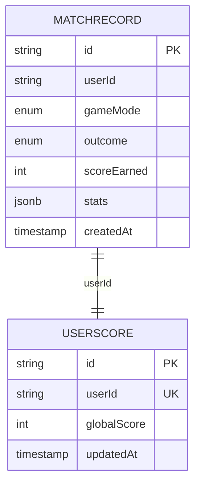

**Diagram sources**
- [packages/db/prisma/schema.prisma](file://packages/db/prisma/schema.prisma#L263-L284)

### Frontend Integration Patterns
- Use Authorization: Bearer header with the access token exposed in NextAuth session for backend-to-backend calls
- Persist session cookie for frontend navigation and protect routes via middleware
- Stream story chat responses using fetch with EventSource or SSE-compatible clients
- Paginate match history and cache activity heatmap data for dashboard rendering

**Section sources**
- [apps/web/auth.ts](file://apps/web/auth.ts#L139-L153)
- [apps/web/middleware.ts](file://apps/web/middleware.ts#L8-L39)
- [apps/web/app/api/story/chat/route.ts](file://apps/web/app/api/story/chat/route.ts#L151-L169)
- [apps/web/app/dashboard/MatchHistoryTable.tsx](file://apps/web/app/dashboard/MatchHistoryTable.tsx#L7-L14)