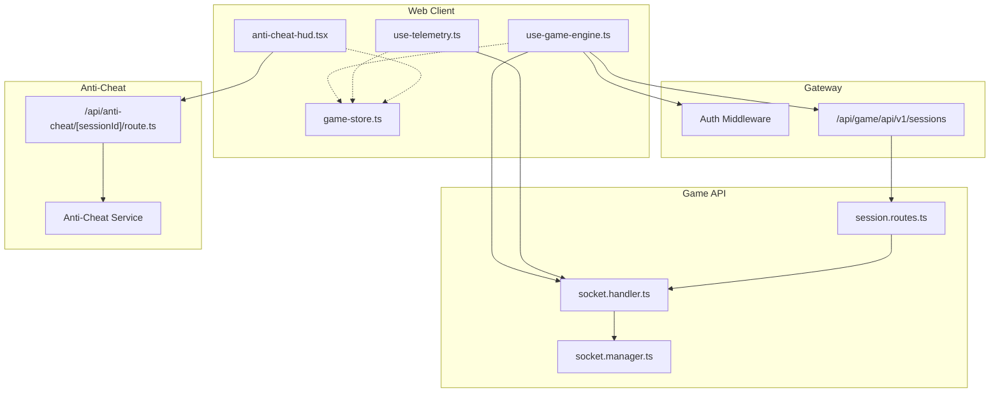
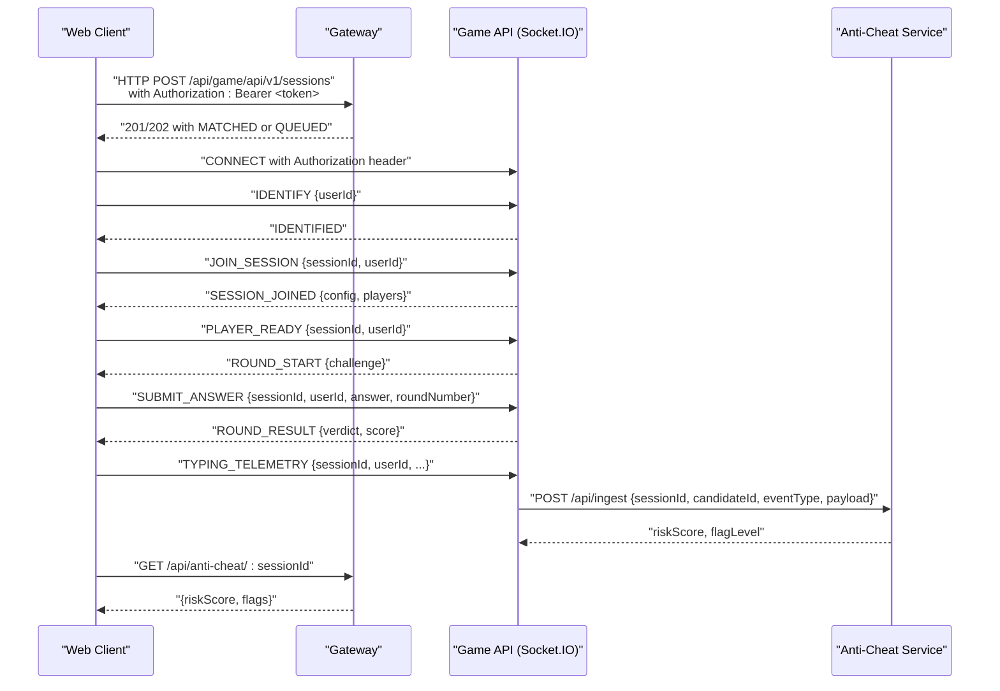
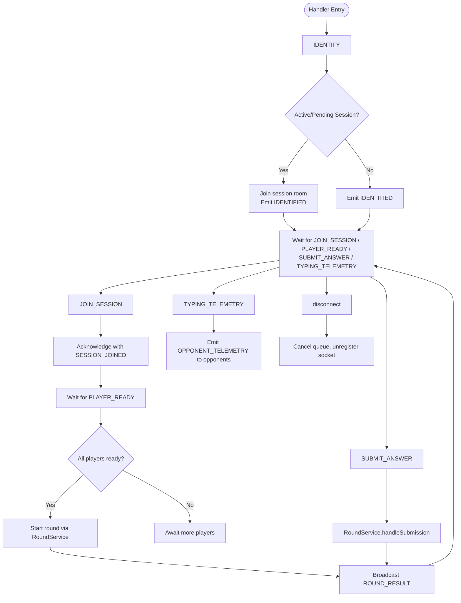
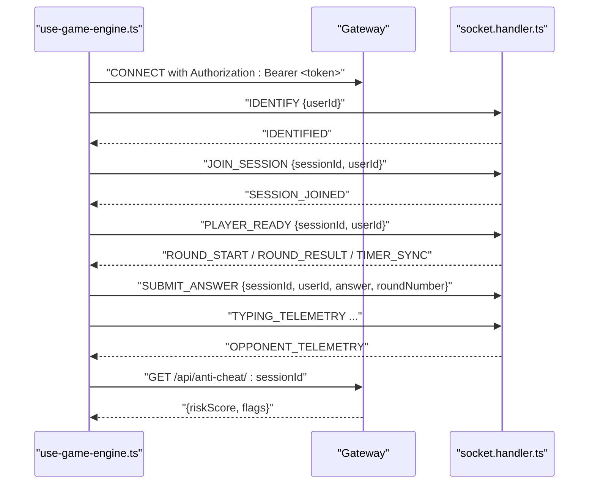
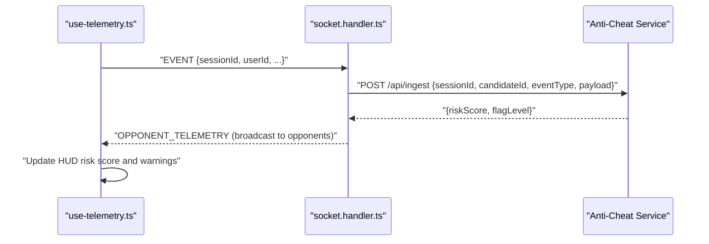
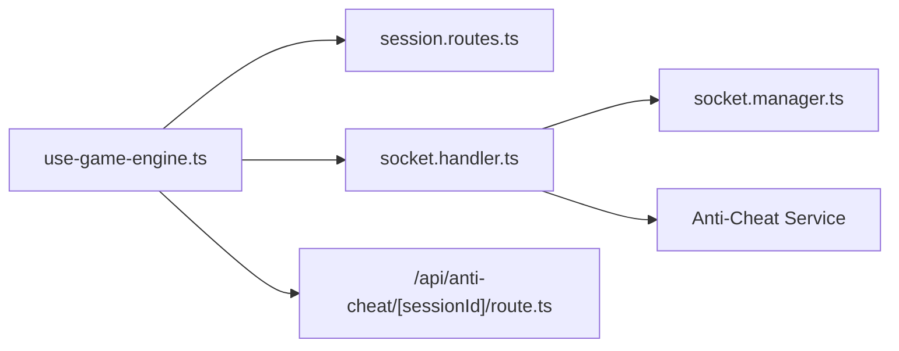

# WebSocket APIs

<cite>
**Referenced Files in This Document**
- [socket.handler.ts](file://apps/game-api/src/websocket/socket.handler.ts)
- [socket.manager.ts](file://apps/game-api/src/websocket/socket.manager.ts)
- [websocket.ts](file://packages/types/src/websocket.ts)
- [use-game-engine.ts](file://apps/web/hooks/use-game-engine.ts)
- [use-telemetry.ts](file://apps/web/hooks/use-telemetry.ts)
- [anti-cheat-hud.tsx](file://apps/web/components/game/anti-cheat-hud.tsx)
- [session.routes.ts](file://apps/game-api/src/routes/session.routes.ts)
- [route.ts](file://apps/web/app/api/anti-cheat/[sessionId]/route.ts)
- [game-store.ts](file://apps/web/store/game-store.ts)
- [anti-cheat-store.ts](file://apps/web/store/anti-cheat-store.ts)
- [arena.tsx](file://apps/web/components/game/arena.tsx)
- [page.tsx](file://apps/web/app/(game)/lobby/page.tsx)
</cite>

## Table of Contents
1. [Introduction](#introduction)
2. [Project Structure](#project-structure)
3. [Core Components](#core-components)
4. [Architecture Overview](#architecture-overview)
5. [Detailed Component Analysis](#detailed-component-analysis)
6. [Dependency Analysis](#dependency-analysis)
7. [Performance Considerations](#performance-considerations)
8. [Troubleshooting Guide](#troubleshooting-guide)
9. [Conclusion](#conclusion)
10. [Appendices](#appendices)

## Introduction
This document specifies the WebSocket APIs used by Logic Forge for real-time game sessions, anti-cheat telemetry, and multiplayer interactions. It covers connection handling, authentication, message formats, event types, room management, broadcasting, and recovery mechanisms. It also documents client-side integration patterns, state synchronization, and operational guidance for performance and debugging.

## Project Structure
Logic Forge’s WebSocket implementation spans:
- Frontend (Next.js app): client-side socket integration, telemetry emission, and UI state updates
- Backend (Express + Socket.IO): session orchestration, room management, and event routing
- Anti-cheat service: telemetry ingestion and risk scoring
- Gateway: authentication and routing for WebSocket and HTTP traffic

**Diagram sources**
- [use-game-engine.ts](file://apps/web/hooks/use-game-engine.ts#L18-L53)
- [use-telemetry.ts](file://apps/web/hooks/use-telemetry.ts#L35-L54)
- [anti-cheat-hud.tsx](file://apps/web/components/game/anti-cheat-hud.tsx#L37-L57)
- [session.routes.ts](file://apps/game-api/src/routes/session.routes.ts#L19-L35)
- [socket.handler.ts](file://apps/game-api/src/websocket/socket.handler.ts#L62-L309)
- [socket.manager.ts](file://apps/game-api/src/websocket/socket.manager.ts#L3-L55)
- [route.ts](file://apps/web/app/api/anti-cheat/[sessionId]/route.ts#L6-L37)

**Section sources**
- [use-game-engine.ts](file://apps/web/hooks/use-game-engine.ts#L18-L53)
- [socket.handler.ts](file://apps/game-api/src/websocket/socket.handler.ts#L62-L309)
- [session.routes.ts](file://apps/game-api/src/routes/session.routes.ts#L19-L35)

## Core Components
- Socket.IO server and handlers: manage connection lifecycle, room joins, broadcasts, and anti-cheat telemetry relays
- Socket manager: room membership helpers and targeted emits
- Client-side socket integration: connection, authentication, event handling, and state synchronization
- Anti-cheat telemetry: client telemetry emission and server relay to anti-cheat service
- Session matchmaking: HTTP endpoint to create/find sessions and deliver match results to clients

Key responsibilities:
- Connection lifecycle: connect, identify, join session, ready up, disconnect
- Room management: per-session rooms, broadcasting to room, targeted emits
- Real-time events: round start, timer sync, results, opponent telemetry, session end/abort
- Anti-cheat telemetry: relay to anti-cheat service and UI feedback

**Section sources**
- [socket.handler.ts](file://apps/game-api/src/websocket/socket.handler.ts#L62-L309)
- [socket.manager.ts](file://apps/game-api/src/websocket/socket.manager.ts#L3-L55)
- [use-game-engine.ts](file://apps/web/hooks/use-game-engine.ts#L80-L285)
- [use-telemetry.ts](file://apps/web/hooks/use-telemetry.ts#L19-L54)
- [session.routes.ts](file://apps/game-api/src/routes/session.routes.ts#L19-L35)

## Architecture Overview
The WebSocket stack integrates:
- Client connects to the gateway with an Authorization header containing a session access token
- Client identifies itself and optionally re-joins active or pending sessions
- Client joins a session room and waits for readiness or round start
- Server manages rooms, broadcasts round lifecycle events, and handles submissions
- Anti-cheat telemetry is emitted by the client and relayed to the anti-cheat service

**Diagram sources**
- [use-game-engine.ts](file://apps/web/hooks/use-game-engine.ts#L36-L103)
- [session.routes.ts](file://apps/game-api/src/routes/session.routes.ts#L19-L35)
- [socket.handler.ts](file://apps/game-api/src/websocket/socket.handler.ts#L68-L106)
- [socket.handler.ts](file://apps/game-api/src/websocket/socket.handler.ts#L111-L157)
- [socket.handler.ts](file://apps/game-api/src/websocket/socket.handler.ts#L162-L202)
- [socket.handler.ts](file://apps/game-api/src/websocket/socket.handler.ts#L273-L289)
- [socket.handler.ts](file://apps/game-api/src/websocket/socket.handler.ts#L206-L240)
- [route.ts](file://apps/web/app/api/anti-cheat/[sessionId]/route.ts#L6-L37)

## Detailed Component Analysis

### Socket.IO Server Handlers
Responsibilities:
- Connection lifecycle: IDENTIFY, JOIN_SESSION, PLAYER_READY, SUBMIT_ANSWER, TYPING_TELEMETRY, SURVIVAL_REQUEUE, disconnect
- Room management: ensure sockets join session rooms, broadcast to room, emit to specific sockets
- Anti-cheat telemetry relay: forward events to anti-cheat service with session and candidate identifiers

Key behaviors:
- Re-identify on reconnect to restore room membership and pending match delivery
- Acknowledged JOIN_SESSION to guarantee reliable client-server handshake
- Broadcast PLAYER_READY_ACK to inform readiness counts
- Relay telemetry events to anti-cheat service and log outcomes

**Diagram sources**
- [socket.handler.ts](file://apps/game-api/src/websocket/socket.handler.ts#L68-L309)

**Section sources**
- [socket.handler.ts](file://apps/game-api/src/websocket/socket.handler.ts#L68-L309)

### Socket Manager
Provides:
- User-to-socket mapping for targeted emits
- Room join/leave helpers
- Broadcast to session rooms
- Membership counting

Usage:
- Associate/disassociate users for targeted emits
- Join/leave session rooms during lifecycle events
- Emit to session or single socket

**Section sources**
- [socket.manager.ts](file://apps/game-api/src/websocket/socket.manager.ts#L3-L55)

### Client-Side Socket Integration
Responsibilities:
- Establish WebSocket connection with Authorization header
- Identify user on connect and re-identify on session changes
- Join sessions and handle acknowledgments
- Emit readiness, answers, and typing telemetry
- Handle server events and synchronize UI state
- Reconnect with updated tokens when available

Connection and authentication:
- Socket created with path “/api/game/socket.io”
- Auth token injected via Authorization header on polling requests
- Reconnection enabled with exponential backoff

Lifecycle events:
- CONNECT → IDENTIFY → JOIN_SESSION (ack) → PLAYER_READY → ROUND lifecycle → SUBMIT_ANSWER → SESSION_END/ABORTED
- Anti-cheat telemetry throttled and emitted periodically

**Diagram sources**
- [use-game-engine.ts](file://apps/web/hooks/use-game-engine.ts#L36-L103)
- [use-game-engine.ts](file://apps/web/hooks/use-game-engine.ts#L133-L285)
- [socket.handler.ts](file://apps/game-api/src/websocket/socket.handler.ts#L68-L309)
- [route.ts](file://apps/web/app/api/anti-cheat/[sessionId]/route.ts#L6-L37)

**Section sources**
- [use-game-engine.ts](file://apps/web/hooks/use-game-engine.ts#L36-L103)
- [use-game-engine.ts](file://apps/web/hooks/use-game-engine.ts#L133-L285)

### Anti-Cheat Telemetry
Client:
- Emits telemetry events with sessionId, userId, candidateId, timestamp, and payload
- Throttles emissions and tracks keystrokes, mouse activity, and focus changes
- Displays warnings and updates risk level via HUD

Server:
- Receives telemetry events and relays to anti-cheat service
- Logs ingest outcomes and errors

**Diagram sources**
- [use-telemetry.ts](file://apps/web/hooks/use-telemetry.ts#L35-L54)
- [socket.handler.ts](file://apps/game-api/src/websocket/socket.handler.ts#L19-L60)
- [anti-cheat-hud.tsx](file://apps/web/components/game/anti-cheat-hud.tsx#L37-L57)

**Section sources**
- [use-telemetry.ts](file://apps/web/hooks/use-telemetry.ts#L19-L54)
- [socket.handler.ts](file://apps/game-api/src/websocket/socket.handler.ts#L19-L60)
- [anti-cheat-hud.tsx](file://apps/web/components/game/anti-cheat-hud.tsx#L37-L57)

### Message Formats and Event Types
Client-to-server messages:
- JOIN_SESSION: { type: "JOIN_SESSION", sessionId: string, token: string }
- READY: { type: "READY", sessionId: string }
- SUBMIT_ANSWER: { type: "SUBMIT_ANSWER", sessionId: string, roundNumber: number, code: string }
- LEAVE_SESSION: { type: "LEAVE_SESSION", sessionId: string }
- PING: { type: "PING", timestamp: number }
- IDENTIFY: { type: "IDENTIFY", userId: string }

Server-to-client messages:
- SESSION_JOINED: { type: "SESSION_JOINED", sessionId: string, currentRound: number, maxRounds: number, status: string }
- ROUND_START: { type: "ROUND_START", roundNumber: number, challenge: { id, title, description, codeTemplate, hints, timeLimitMs } }
- TIMER_SYNC: { type: "TIMER_SYNC", roundNumber: number, remainingMs: number, serverTimestamp: number }
- ROUND_RESULT: { type: "ROUND_RESULT", roundNumber: number, verdict, score, totalScore, executionTimeMs }
- OPPONENT_SUBMITTED: { type: "OPPONENT_SUBMITTED", roundNumber, opponentVerdict, opponentScore }
- SESSION_COMPLETE: { type: "SESSION_COMPLETE", totalScore, roundResults: [...] }
- MATCH_FOUND: { type: "MATCH_FOUND", opponentId, sessionId }
- ERROR: { type: "ERROR", code, message }
- PONG: { type: "PONG", timestamp, serverTimestamp }

Anti-cheat telemetry event types:
- PASTE_DETECTED, FOCUS_LOST, FOCUS_RESTORED, KEYSTROKE_BURST, MOUSE_INACTIVE, SOLUTION_SUBMITTED, FAST_SOLUTION

**Section sources**
- [websocket.ts](file://packages/types/src/websocket.ts#L4-L155)

### Session Management and Matchmaking
- HTTP endpoint accepts a payload with mode, playerFormat, sessionType, category, userId, and optional socketId
- Validates TIMER mode requires a category
- Returns 201 for MATCHED (with sessionId) or 202 for QUEUED
- Client receives MATCHED via socket and proceeds to join session

**Section sources**
- [session.routes.ts](file://apps/game-api/src/routes/session.routes.ts#L7-L17)
- [session.routes.ts](file://apps/game-api/src/routes/session.routes.ts#L19-L35)
- [use-game-engine.ts](file://apps/web/hooks/use-game-engine.ts#L335-L392)

### Real-Time Interaction Patterns
- Lobby: single-player auto-ready after countdown; dual-player ready-up button
- During rounds: periodic typing telemetry broadcast to opponents; timer sync; results and overlays
- Session completion: session end or abort events; survival continuation or end

**Section sources**
- [page.tsx](file://apps/web/app/(game)/lobby/page.tsx#L15-L35)
- [arena.tsx](file://apps/web/components/game/arena.tsx#L80-L95)
- [game-store.ts](file://apps/web/store/game-store.ts#L143-L189)

## Dependency Analysis
- Client depends on:
  - Gateway for session creation and anti-cheat polling
  - Socket.IO server for real-time events
- Server depends on:
  - Session/Round services for state transitions
  - Anti-cheat service for telemetry scoring
- Anti-cheat service depends on:
  - Audit logging and risk scoring services

**Diagram sources**
- [use-game-engine.ts](file://apps/web/hooks/use-game-engine.ts#L36-L103)
- [session.routes.ts](file://apps/game-api/src/routes/session.routes.ts#L19-L35)
- [socket.handler.ts](file://apps/game-api/src/websocket/socket.handler.ts#L62-L309)
- [socket.manager.ts](file://apps/game-api/src/websocket/socket.manager.ts#L3-L55)
- [route.ts](file://apps/web/app/api/anti-cheat/[sessionId]/route.ts#L6-L37)

**Section sources**
- [use-game-engine.ts](file://apps/web/hooks/use-game-engine.ts#L36-L103)
- [socket.handler.ts](file://apps/game-api/src/websocket/socket.handler.ts#L62-L309)
- [route.ts](file://apps/web/app/api/anti-cheat/[sessionId]/route.ts#L6-L37)

## Performance Considerations
- Connection pooling and reuse:
  - Client maintains a singleton socket instance and updates auth tokens without dropping room membership
- Reconnection strategy:
  - Automatic reconnection with capped attempts and delays to avoid overload
- Emission throttling:
  - Typing telemetry throttled to reduce bandwidth and CPU usage
- Room efficiency:
  - Broadcasting to session rooms minimizes per-user emits
- Anti-cheat ingestion:
  - Batch telemetry via relay to anti-cheat service; failures logged and retried by client polling

[No sources needed since this section provides general guidance]

## Troubleshooting Guide
Common issues and remedies:
- Authentication failures:
  - Ensure Authorization header is present on socket polling requests
  - Update socket token when session accessToken becomes available
- Reconnection and room membership:
  - On reconnect, server re-joins active or pending session rooms and re-emits pending MATCHED
- Anti-cheat telemetry:
  - Verify anti-cheat service availability; check ingest logs for rejection or network errors
- Client-side telemetry:
  - Confirm sessionId and userId are set; throttle emissions to avoid flooding

**Section sources**
- [use-game-engine.ts](file://apps/web/hooks/use-game-engine.ts#L61-L77)
- [socket.handler.ts](file://apps/game-api/src/websocket/socket.handler.ts#L78-L101)
- [socket.handler.ts](file://apps/game-api/src/websocket/socket.handler.ts#L44-L59)

## Conclusion
Logic Forge’s WebSocket APIs provide a robust foundation for real-time multiplayer gaming, session orchestration, and anti-cheat telemetry. The design emphasizes reliable room management, acknowledgment-based joins, and resilient client reconnection. Anti-cheat telemetry is integrated seamlessly, enabling live risk monitoring and opponent telemetry. Following the client integration patterns and operational guidance ensures smooth performance and maintainable debugging.

[No sources needed since this section summarizes without analyzing specific files]

## Appendices

### Appendix A: Client Implementation Checklist
- Initialize socket with Authorization header and correct path
- Emit IDENTIFY on connect and on user/session changes
- Use acknowledged JOIN_SESSION to ensure SESSION_JOINED
- Emit PLAYER_READY when lobby conditions are met
- Throttle and emit TYPING_TELEMETRY during rounds
- Handle server events and update UI state consistently
- Poll anti-cheat risk score and display warnings

**Section sources**
- [use-game-engine.ts](file://apps/web/hooks/use-game-engine.ts#L36-L103)
- [use-telemetry.ts](file://apps/web/hooks/use-telemetry.ts#L35-L54)
- [anti-cheat-hud.tsx](file://apps/web/components/game/anti-cheat-hud.tsx#L37-L57)