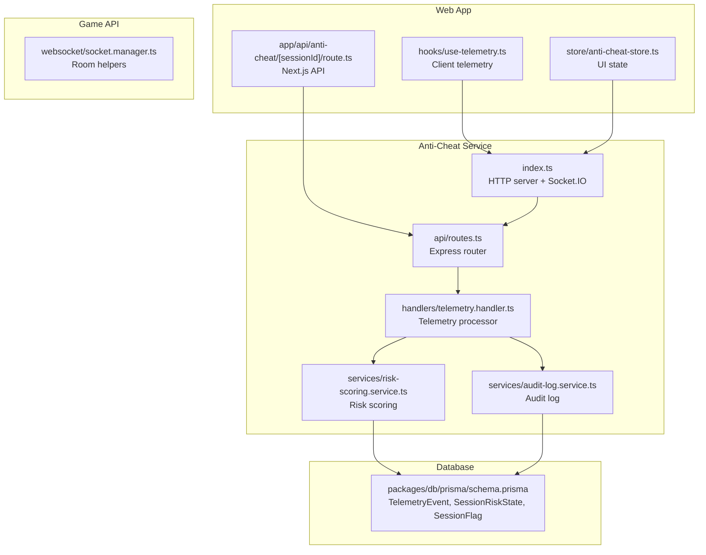
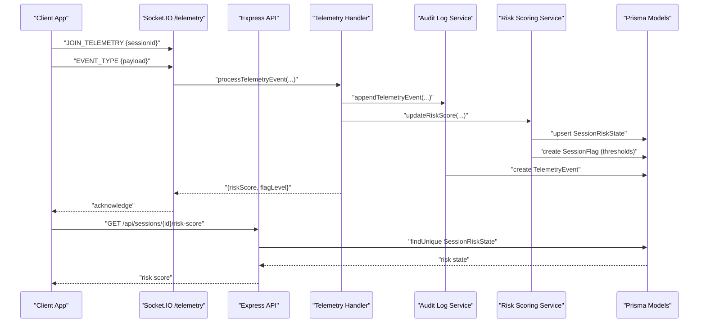
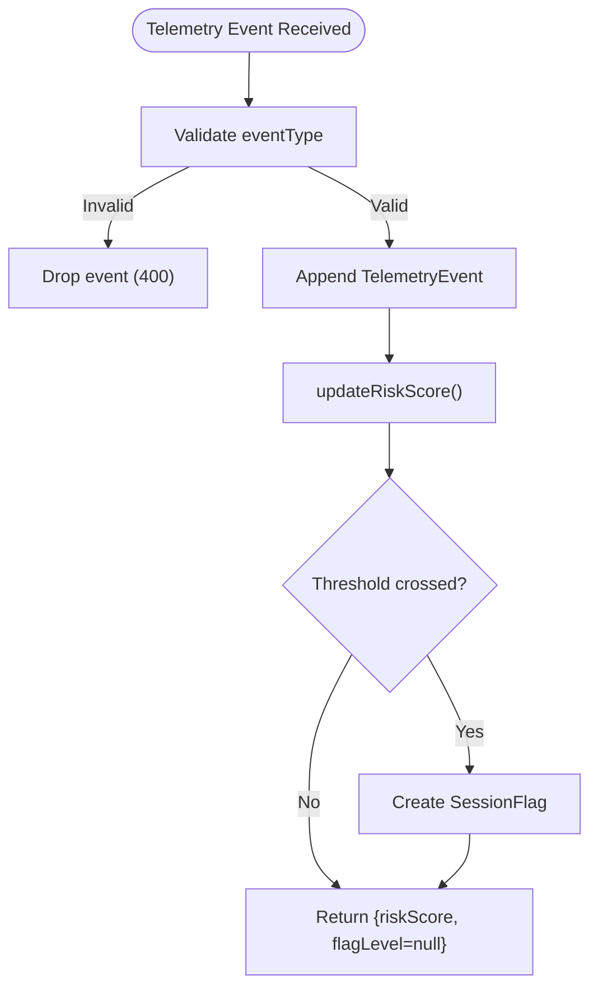
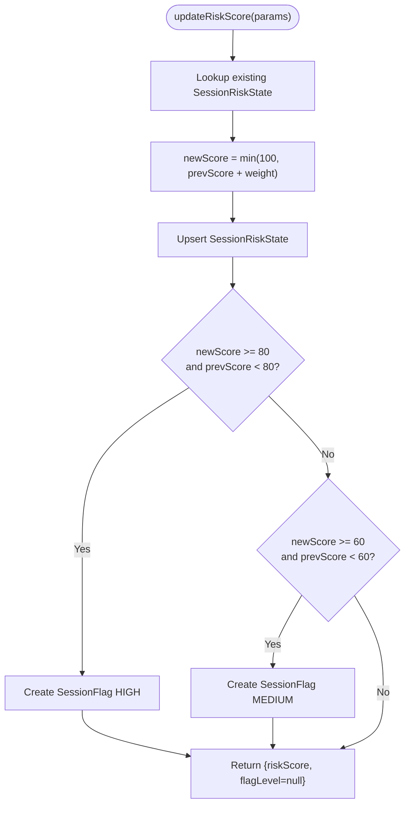
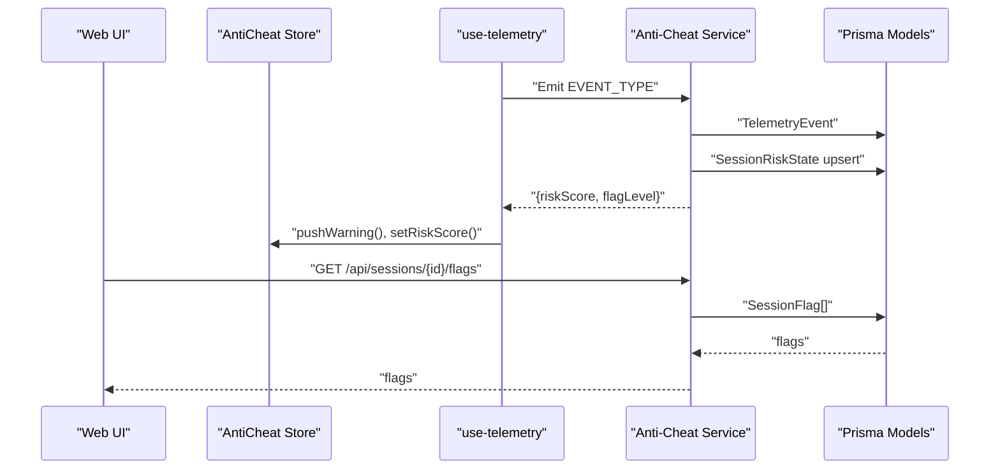
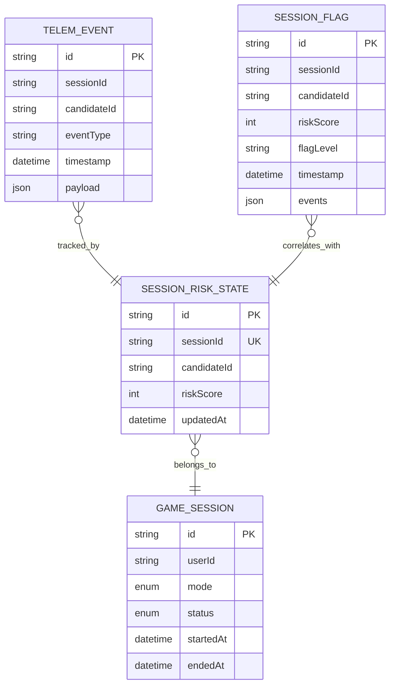
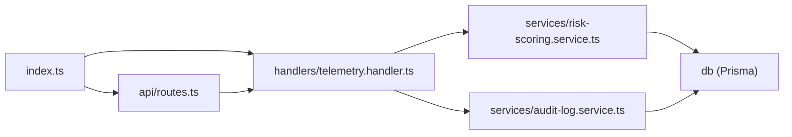

# Anti-Cheat Service

<cite>
**Referenced Files in This Document**
- [index.ts](file://apps/anti-cheat/src/index.ts)
- [routes.ts](file://apps/anti-cheat/src/api/routes.ts)
- [telemetry.handler.ts](file://apps/anti-cheat/src/handlers/telemetry.handler.ts)
- [risk-scoring.service.ts](file://apps/anti-cheat/src/services/risk-scoring.service.ts)
- [audit-log.service.ts](file://apps/anti-cheat/src/services/audit-log.service.ts)
- [schema.prisma](file://packages/db/prisma/schema.prisma)
- [package.json](file://apps/anti-cheat/package.json)
- [.env.example](file://apps/anti-cheat/.env.example)
- [socket.manager.ts](file://apps/game-api/src/websocket/socket.manager.ts)
- [anti-cheat-store.ts](file://apps/web/store/anti-cheat-store.ts)
- [use-telemetry.ts](file://apps/web/hooks/use-telemetry.ts)
- [route.ts](file://apps/web/app/api/anti-cheat/[sessionId]/route.ts)
</cite>

## Table of Contents
1. [Introduction](#introduction)
2. [Project Structure](#project-structure)
3. [Core Components](#core-components)
4. [Architecture Overview](#architecture-overview)
5. [Detailed Component Analysis](#detailed-component-analysis)
6. [Dependency Analysis](#dependency-analysis)
7. [Performance Considerations](#performance-considerations)
8. [Troubleshooting Guide](#troubleshooting-guide)
9. [Privacy and Compliance](#privacy-and-compliance)
10. [Conclusion](#conclusion)
11. [Appendices](#appendices)

## Introduction
This document describes the Anti-Cheat service responsible for real-time behavioral monitoring, risk scoring, and audit logging during coding challenges. It covers:
- Telemetry collection via WebSocket and HTTP ingestion
- Behavioral pattern detection (keystroke dynamics, mouse activity, focus changes)
- Risk scoring algorithms and threshold-based flagging
- Audit logging for compliance and investigations
- Real-time monitoring, alerting, and automated workflows
- Data models, integration points, and operational guidance

## Project Structure
The Anti-Cheat service is implemented as a Node.js application using Express and Socket.IO. It exposes:
- An HTTP API for telemetry ingestion and risk queries
- A WebSocket namespace for real-time telemetry streaming
- Services for risk scoring and audit logging
- Database models for storing telemetry events, session risk state, and flags

**Diagram sources**
- [index.ts](file://apps/anti-cheat/src/index.ts#L1-L35)
- [routes.ts](file://apps/anti-cheat/src/api/routes.ts#L1-L85)
- [telemetry.handler.ts](file://apps/anti-cheat/src/handlers/telemetry.handler.ts#L1-L82)
- [risk-scoring.service.ts](file://apps/anti-cheat/src/services/risk-scoring.service.ts#L1-L76)
- [audit-log.service.ts](file://apps/anti-cheat/src/services/audit-log.service.ts#L1-L19)
- [schema.prisma](file://packages/db/prisma/schema.prisma#L207-L260)
- [use-telemetry.ts](file://apps/web/hooks/use-telemetry.ts#L1-L157)
- [anti-cheat-store.ts](file://apps/web/store/anti-cheat-store.ts#L1-L108)
- [route.ts](file://apps/web/app/api/anti-cheat/[sessionId]/route.ts#L1-L38)
- [socket.manager.ts](file://apps/game-api/src/websocket/socket.manager.ts#L1-L56)

**Section sources**
- [index.ts](file://apps/anti-cheat/src/index.ts#L1-L35)
- [routes.ts](file://apps/anti-cheat/src/api/routes.ts#L1-L85)
- [schema.prisma](file://packages/db/prisma/schema.prisma#L207-L260)

## Core Components
- HTTP API:
  - GET /api/sessions/:id/risk-score: returns current risk score and timestamps
  - GET /api/sessions/:id/flags: returns historical flags for a session
  - POST /api/ingest: accepts telemetry events from clients or integrations
- WebSocket:
  - Namespace /telemetry
  - Clients join via JOIN_TELEMETRY and emit supported event types
- Handlers:
  - Telemetry handler validates event types, enriches payloads, and triggers audit and scoring
- Services:
  - Risk scoring service maintains per-session risk scores and emits flags when thresholds are crossed
  - Audit log service persists telemetry events append-only for compliance

**Section sources**
- [routes.ts](file://apps/anti-cheat/src/api/routes.ts#L13-L82)
- [telemetry.handler.ts](file://apps/anti-cheat/src/handlers/telemetry.handler.ts#L30-L51)
- [risk-scoring.service.ts](file://apps/anti-cheat/src/services/risk-scoring.service.ts#L18-L75)
- [audit-log.service.ts](file://apps/anti-cheat/src/services/audit-log.service.ts#L4-L18)
- [index.ts](file://apps/anti-cheat/src/index.ts#L24-L29)

## Architecture Overview
The system integrates client-side telemetry capture with real-time ingestion and scoring.

**Diagram sources**
- [index.ts](file://apps/anti-cheat/src/index.ts#L24-L29)
- [telemetry.handler.ts](file://apps/anti-cheat/src/handlers/telemetry.handler.ts#L30-L51)
- [risk-scoring.service.ts](file://apps/anti-cheat/src/services/risk-scoring.service.ts#L18-L75)
- [audit-log.service.ts](file://apps/anti-cheat/src/services/audit-log.service.ts#L4-L18)
- [routes.ts](file://apps/anti-cheat/src/api/routes.ts#L13-L30)

## Detailed Component Analysis

### Telemetry Collection and Processing
- Supported event types:
  - FOCUS_LOST, FOCUS_RESTORED
  - PASTE_DETECTED (includes copy)
  - KEYSTROKE_BURST
  - MOUSE_INACTIVE
  - SOLUTION_SUBMITTED, FAST_SOLUTION
- Client-side telemetry:
  - Tracks visibility changes, paste/copy, keystrokes, mouse movement
  - Emits events via Socket.IO with sessionId, candidateId, timestamp, and optional payload
- Handler responsibilities:
  - Validates event type
  - Enriches with timestamp if missing
  - Persists audit event
  - Updates risk score and creates flags when thresholds are crossed

**Diagram sources**
- [telemetry.handler.ts](file://apps/anti-cheat/src/handlers/telemetry.handler.ts#L30-L51)
- [risk-scoring.service.ts](file://apps/anti-cheat/src/services/risk-scoring.service.ts#L18-L75)
- [audit-log.service.ts](file://apps/anti-cheat/src/services/audit-log.service.ts#L4-L18)

**Section sources**
- [telemetry.handler.ts](file://apps/anti-cheat/src/handlers/telemetry.handler.ts#L4-L28)
- [use-telemetry.ts](file://apps/web/hooks/use-telemetry.ts#L56-L155)

### Risk Scoring and Flagging
- Weights:
  - Focus loss: high weight
  - Paste detected: high weight
  - Keystroke burst: moderate weight
  - Mouse inactivity: moderate weight
  - Fast solution: high weight
  - Focus restored: no weight increase
  - Solution submitted: neutral
- Thresholds:
  - Medium: 60
  - High: 80
- Behavior:
  - Scores are capped at 100
  - Upserts current session risk state
  - Creates a flag record when crossing thresholds

**Diagram sources**
- [risk-scoring.service.ts](file://apps/anti-cheat/src/services/risk-scoring.service.ts#L3-L14)
- [risk-scoring.service.ts](file://apps/anti-cheat/src/services/risk-scoring.service.ts#L18-L75)

**Section sources**
- [risk-scoring.service.ts](file://apps/anti-cheat/src/services/risk-scoring.service.ts#L3-L14)
- [risk-scoring.service.ts](file://apps/anti-cheat/src/services/risk-scoring.service.ts#L18-L75)

### Audit Logging
- Append-only persistence of telemetry events with sessionId, candidateId, eventType, timestamp, and payload
- Supports compliance and forensic analysis
- No updates or deletions are performed on audit logs

**Section sources**
- [audit-log.service.ts](file://apps/anti-cheat/src/services/audit-log.service.ts#L3-L18)
- [schema.prisma](file://packages/db/prisma/schema.prisma#L224-L235)

### Real-Time Monitoring and Alerting
- Web App:
  - Client telemetry hook emits events and displays warnings
  - Zustand store tracks warnings, counts, risk score, and level
- Game API:
  - Socket manager supports room-based broadcasting and user targeting
- Anti-Cheat:
  - WebSocket namespace /telemetry handles joins and event forwarding
  - HTTP API serves risk score and flags for UI consumption

**Diagram sources**
- [use-telemetry.ts](file://apps/web/hooks/use-telemetry.ts#L35-L54)
- [anti-cheat-store.ts](file://apps/web/store/anti-cheat-store.ts#L51-L107)
- [routes.ts](file://apps/anti-cheat/src/api/routes.ts#L32-L42)
- [schema.prisma](file://packages/db/prisma/schema.prisma#L238-L249)

**Section sources**
- [use-telemetry.ts](file://apps/web/hooks/use-telemetry.ts#L12-L17)
- [anti-cheat-store.ts](file://apps/web/store/anti-cheat-store.ts#L20-L47)
- [socket.manager.ts](file://apps/game-api/src/websocket/socket.manager.ts#L31-L43)
- [index.ts](file://apps/anti-cheat/src/index.ts#L24-L29)

### Data Models

**Diagram sources**
- [schema.prisma](file://packages/db/prisma/schema.prisma#L209-L260)

**Section sources**
- [schema.prisma](file://packages/db/prisma/schema.prisma#L209-L260)

## Dependency Analysis
- Internal dependencies:
  - index.ts depends on Express, Socket.IO, config, logger, and telemetry handler registration
  - routes.ts depends on db and telemetry handler
  - telemetry.handler.ts depends on audit-log and risk-scoring services
  - risk-scoring.service.ts and audit-log.service.ts depend on db
- External dependencies:
  - Express, Socket.IO, Zod, ioredis, Prisma client
- Environment:
  - PORT, NODE_ENV, REDIS_URL

**Diagram sources**
- [index.ts](file://apps/anti-cheat/src/index.ts#L1-L35)
- [routes.ts](file://apps/anti-cheat/src/api/routes.ts#L1-L11)
- [telemetry.handler.ts](file://apps/anti-cheat/src/handlers/telemetry.handler.ts#L1-L2)
- [risk-scoring.service.ts](file://apps/anti-cheat/src/services/risk-scoring.service.ts#L1)
- [audit-log.service.ts](file://apps/anti-cheat/src/services/audit-log.service.ts#L1)

**Section sources**
- [package.json](file://apps/anti-cheat/package.json#L12-L21)
- [.env.example](file://apps/anti-cheat/.env.example#L1-L3)

## Performance Considerations
- Event throughput:
  - Use batching for high-frequency events (e.g., keystrokes) and apply sliding windows to reduce load
- Database writes:
  - Upserts are efficient; ensure indexes on sessionId, candidateId, and timestamps
- Network:
  - Keep WebSocket connections alive and reconnect on failure
- Memory:
  - Limit warning history and event counters in the UI store
- Rate limiting:
  - Apply rate limits at the API boundary to prevent abuse

## Troubleshooting Guide
- Symptoms:
  - Events not appearing in risk score
  - Missing flags despite high score
  - Audit logs not persisted
- Checks:
  - Verify event type validation and supported event list
  - Confirm sessionId and candidateId presence
  - Inspect thresholds and weights
  - Review database connectivity and Prisma client configuration
- Mitigations:
  - Normalize timestamps and payloads
  - Monitor ingest endpoint logs
  - Validate WebSocket join and event emission on the client

**Section sources**
- [telemetry.handler.ts](file://apps/anti-cheat/src/handlers/telemetry.handler.ts#L58-L81)
- [routes.ts](file://apps/anti-cheat/src/api/routes.ts#L44-L82)
- [risk-scoring.service.ts](file://apps/anti-cheat/src/services/risk-scoring.service.ts#L18-L75)
- [audit-log.service.ts](file://apps/anti-cheat/src/services/audit-log.service.ts#L4-L18)

## Privacy and Compliance
- Data minimization:
  - Collect only necessary telemetry (focus, paste, keystrokes, mouse activity)
- Retention:
  - Append-only audit logs should be retained per policy; implement lifecycle rules at the database layer
- Transparency:
  - Display warnings to users upon detection of suspicious behavior
- De-identification:
  - Avoid storing personally identifiable information beyond what is required for session correlation
- False positives:
  - Tune weights and thresholds based on observed behavior
  - Provide appeal mechanisms and manual review workflows

## Conclusion
The Anti-Cheat service provides a modular, real-time system for behavioral monitoring and risk assessment. It combines client-side telemetry capture, robust scoring logic, and append-only audit logging to support fair play enforcement and compliance. The architecture supports scalable ingestion via WebSocket and HTTP, with clear separation of concerns and extensible scoring rules.

## Appendices

### API Definitions
- GET /api/sessions/:id/risk-score
  - Path parameters: id (string)
  - Response: { sessionId, candidateId, riskScore, updatedAt }
- GET /api/sessions/:id/flags
  - Path parameters: id (string)
  - Response: array of flags with fields: id, sessionId, candidateId, riskScore, flagLevel, timestamp, events
- POST /api/ingest
  - Body: { sessionId, candidateId, eventType, timestamp?, payload? }
  - Response: { riskScore, flagLevel }

**Section sources**
- [routes.ts](file://apps/anti-cheat/src/api/routes.ts#L13-L82)

### Telemetry Event Types
- FOCUS_LOST, FOCUS_RESTORED
- PASTE_DETECTED
- KEYSTROKE_BURST
- MOUSE_INACTIVE
- SOLUTION_SUBMITTED, FAST_SOLUTION

**Section sources**
- [telemetry.handler.ts](file://apps/anti-cheat/src/handlers/telemetry.handler.ts#L4-L12)

### Risk Scoring Weights and Thresholds
- Weights:
  - Focus lost: high
  - Paste detected: high
  - Keystroke burst: moderate
  - Mouse inactive: moderate
  - Fast solution: high
  - Focus restored: no change
  - Solution submitted: neutral
- Thresholds:
  - Medium: 60
  - High: 80

**Section sources**
- [risk-scoring.service.ts](file://apps/anti-cheat/src/services/risk-scoring.service.ts#L3-L14)
- [risk-scoring.service.ts](file://apps/anti-cheat/src/services/risk-scoring.service.ts#L56-L60)

### Audit Log Entry Fields
- sessionId, candidateId, eventType, timestamp, payload

**Section sources**
- [audit-log.service.ts](file://apps/anti-cheat/src/services/audit-log.service.ts#L4-L18)
- [schema.prisma](file://packages/db/prisma/schema.prisma#L224-L235)

### Client Integration Notes
- Join WebSocket namespace and emit events with sessionId and candidateId
- Use the Next.js API route to fetch risk score and flags for display

**Section sources**
- [index.ts](file://apps/anti-cheat/src/index.ts#L24-L29)
- [route.ts](file://apps/web/app/api/anti-cheat/[sessionId]/route.ts#L16-L33)
- [use-telemetry.ts](file://apps/web/hooks/use-telemetry.ts#L35-L54)