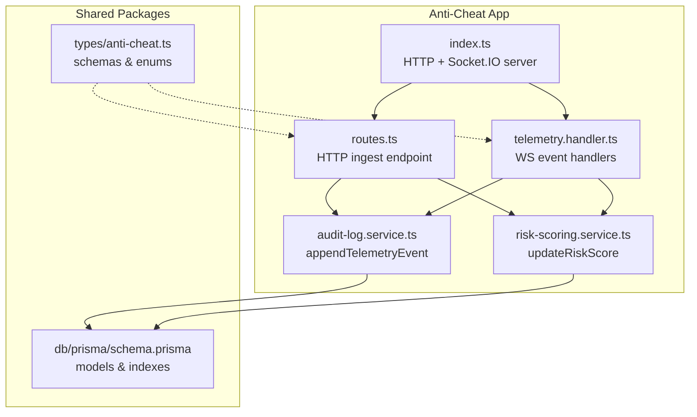
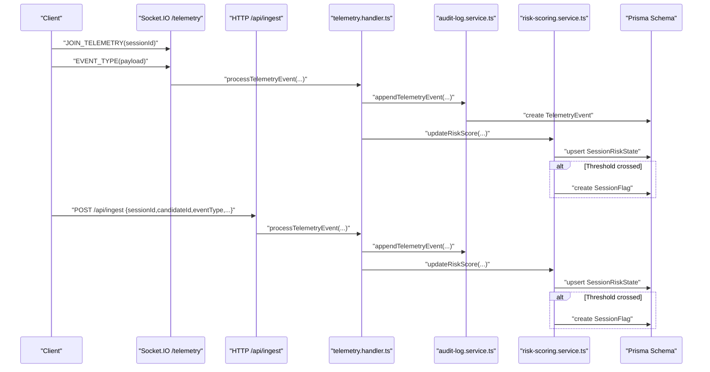
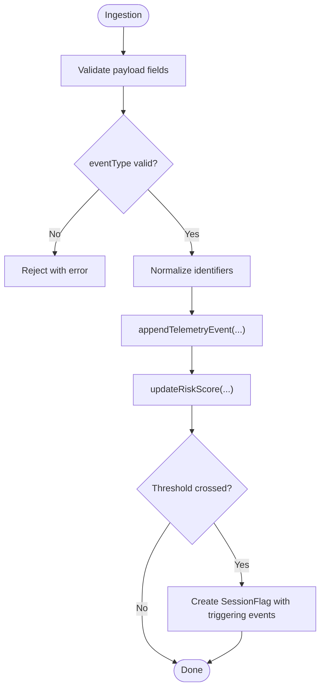
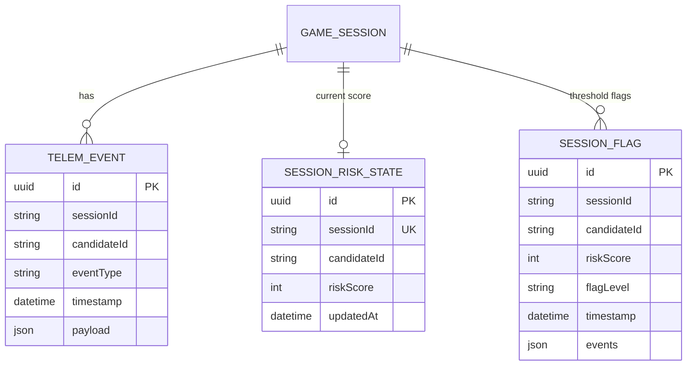
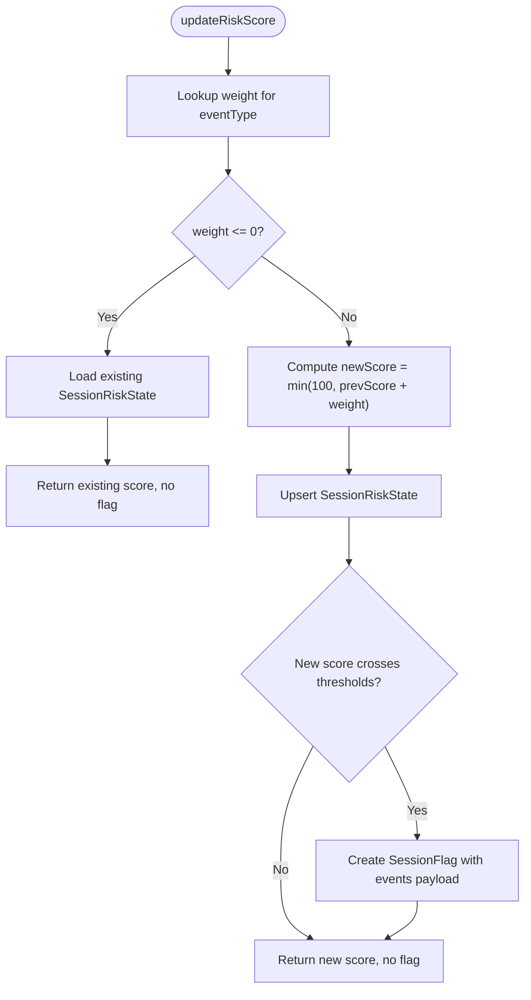
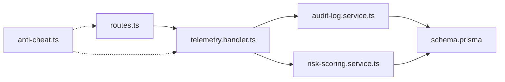

# Audit Logging & Compliance

<cite>
**Referenced Files in This Document**
- [audit-log.service.ts](file://apps/anti-cheat/src/services/audit-log.service.ts)
- [risk-scoring.service.ts](file://apps/anti-cheat/src/services/risk-scoring.service.ts)
- [telemetry.handler.ts](file://apps/anti-cheat/src/handlers/telemetry.handler.ts)
- [routes.ts](file://apps/anti-cheat/src/api/routes.ts)
- [index.ts](file://apps/anti-cheat/src/index.ts)
- [anti-cheat.ts](file://packages/types/src/anti-cheat.ts)
- [schema.prisma](file://packages/db/prisma/schema.prisma)
- [AntiCheatSection.tsx](file://apps/web/components/AntiCheatSection.tsx)
</cite>

## Table of Contents
1. [Introduction](#introduction)
2. [Project Structure](#project-structure)
3. [Core Components](#core-components)
4. [Architecture Overview](#architecture-overview)
5. [Detailed Component Analysis](#detailed-component-analysis)
6. [Dependency Analysis](#dependency-analysis)
7. [Performance Considerations](#performance-considerations)
8. [Troubleshooting Guide](#troubleshooting-guide)
9. [Conclusion](#conclusion)
10. [Appendices](#appendices)

## Introduction
This document describes the audit logging and compliance monitoring system for the anti-cheat subsystem. It covers event capture, append-only audit logs, risk scoring and flagging, indexing and retention considerations, and how the system supports compliance reporting and investigations. It also outlines data protection measures, access controls, and integrity verification approaches, along with GDPR-aligned considerations such as data minimization and erasure readiness.

## Project Structure
The audit and compliance-relevant logic resides primarily in the anti-cheat application, with shared types and database schema in shared packages. The telemetry ingestion surface is exposed via both HTTP and WebSocket channels, and the database schema defines append-only audit tables and related risk/flagging entities.

**Diagram sources**
- [index.ts](file://apps/anti-cheat/src/index.ts#L1-L35)
- [routes.ts](file://apps/anti-cheat/src/api/routes.ts#L44-L84)
- [telemetry.handler.ts](file://apps/anti-cheat/src/handlers/telemetry.handler.ts#L1-L82)
- [audit-log.service.ts](file://apps/anti-cheat/src/services/audit-log.service.ts#L1-L19)
- [risk-scoring.service.ts](file://apps/anti-cheat/src/services/risk-scoring.service.ts#L1-L76)
- [anti-cheat.ts](file://packages/types/src/anti-cheat.ts#L1-L86)
- [schema.prisma](file://packages/db/prisma/schema.prisma#L223-L260)

**Section sources**
- [index.ts](file://apps/anti-cheat/src/index.ts#L1-L35)
- [routes.ts](file://apps/anti-cheat/src/api/routes.ts#L44-L84)
- [telemetry.handler.ts](file://apps/anti-cheat/src/handlers/telemetry.handler.ts#L1-L82)
- [audit-log.service.ts](file://apps/anti-cheat/src/services/audit-log.service.ts#L1-L19)
- [risk-scoring.service.ts](file://apps/anti-cheat/src/services/risk-scoring.service.ts#L1-L76)
- [anti-cheat.ts](file://packages/types/src/anti-cheat.ts#L1-L86)
- [schema.prisma](file://packages/db/prisma/schema.prisma#L223-L260)

## Core Components
- Audit log service: Append-only creation of telemetry events with candidate/session identifiers and optional payload.
- Risk scoring service: Incremental scoring per session with thresholds that produce flags and persistence of triggering events.
- Telemetry handler: Validates event types, normalizes identifiers, and writes audit events and risk updates.
- HTTP ingest endpoint: JSON-based ingestion with validation and structured logging.
- WebSocket ingest: Real-time ingestion via Socket.IO with automatic timestamp fallback.
- Shared types: Event schemas and enumerations for telemetry batches and risk responses.
- Database schema: Append-only TelemetryEvent table, SessionRiskState, and SessionFlag for compliance and investigations.

**Section sources**
- [audit-log.service.ts](file://apps/anti-cheat/src/services/audit-log.service.ts#L1-L19)
- [risk-scoring.service.ts](file://apps/anti-cheat/src/services/risk-scoring.service.ts#L1-L76)
- [telemetry.handler.ts](file://apps/anti-cheat/src/handlers/telemetry.handler.ts#L1-L82)
- [routes.ts](file://apps/anti-cheat/src/api/routes.ts#L44-L84)
- [anti-cheat.ts](file://packages/types/src/anti-cheat.ts#L1-L86)
- [schema.prisma](file://packages/db/prisma/schema.prisma#L223-L260)

## Architecture Overview
The system captures behavioral telemetry from clients and stores immutable audit records. Risk scoring is computed incrementally and flags are raised when thresholds are crossed. All audit data is append-only and indexed for efficient queries.

**Diagram sources**
- [index.ts](file://apps/anti-cheat/src/index.ts#L24-L29)
- [telemetry.handler.ts](file://apps/anti-cheat/src/handlers/telemetry.handler.ts#L30-L51)
- [audit-log.service.ts](file://apps/anti-cheat/src/services/audit-log.service.ts#L4-L18)
- [risk-scoring.service.ts](file://apps/anti-cheat/src/services/risk-scoring.service.ts#L18-L75)
- [routes.ts](file://apps/anti-cheat/src/api/routes.ts#L44-L84)
- [schema.prisma](file://packages/db/prisma/schema.prisma#L223-L260)

## Detailed Component Analysis

### Audit Log Entry Capture
- Append-only policy: Events are created and never updated or deleted.
- Required identifiers: sessionId, candidateId (alias for userId), eventType.
- Optional payload: Arbitrary JSON for event-specific details.
- Timestamping: Database default timestamp is used; WebSocket handler can supply a timestamp string.

**Diagram sources**
- [telemetry.handler.ts](file://apps/anti-cheat/src/handlers/telemetry.handler.ts#L30-L51)
- [audit-log.service.ts](file://apps/anti-cheat/src/services/audit-log.service.ts#L4-L18)
- [risk-scoring.service.ts](file://apps/anti-cheat/src/services/risk-scoring.service.ts#L18-L75)
- [routes.ts](file://apps/anti-cheat/src/api/routes.ts#L44-L84)

**Section sources**
- [audit-log.service.ts](file://apps/anti-cheat/src/services/audit-log.service.ts#L1-L19)
- [telemetry.handler.ts](file://apps/anti-cheat/src/handlers/telemetry.handler.ts#L1-L82)
- [routes.ts](file://apps/anti-cheat/src/api/routes.ts#L44-L84)

### Audit Log Entry Formats and Metadata
- TelemetryEvent model fields include identifiers, event type, timestamp, and optional payload.
- Indexes support querying by sessionId, candidateId, and timestamp.
- RiskScore model includes counts, aggregate score, flag state, and a rawEvents JSON field for timestamped telemetry snapshots.
- SessionFlag model captures threshold crossings with associated event details.

**Diagram sources**
- [schema.prisma](file://packages/db/prisma/schema.prisma#L223-L260)

**Section sources**
- [schema.prisma](file://packages/db/prisma/schema.prisma#L223-L260)

### Risk Scoring and Flagging
- Incremental scoring per event type with fixed weights.
- Thresholds: MEDIUM at 60, HIGH at 80.
- On threshold crossing, a SessionFlag is created capturing the score, level, and triggering events.

**Diagram sources**
- [risk-scoring.service.ts](file://apps/anti-cheat/src/services/risk-scoring.service.ts#L18-L75)

**Section sources**
- [risk-scoring.service.ts](file://apps/anti-cheat/src/services/risk-scoring.service.ts#L1-L76)

### Compliance Reporting Mechanisms
- Append-only audit logs enable immutable historical analysis.
- Indexed fields support targeted queries for sessions, candidates, and time windows.
- RiskScore.rawEvents can store a compact snapshot of timestamped telemetry for downstream reporting.
- SessionFlag entries serve as discrete compliance triggers with timestamps and event details.

**Section sources**
- [schema.prisma](file://packages/db/prisma/schema.prisma#L209-L221)
- [risk-scoring.service.ts](file://apps/anti-cheat/src/services/risk-scoring.service.ts#L62-L72)

### Integration with External Systems and Investigation Workflows
- HTTP ingest endpoint exposes a simple JSON contract for automated ingestion.
- WebSocket channel enables real-time streaming with automatic identifier resolution.
- Structured logs around ingest requests provide observability for external SIEM or log aggregators.

**Section sources**
- [routes.ts](file://apps/anti-cheat/src/api/routes.ts#L44-L84)
- [index.ts](file://apps/anti-cheat/src/index.ts#L24-L29)
- [telemetry.handler.ts](file://apps/anti-cheat/src/handlers/telemetry.handler.ts#L54-L81)

### Examples of Audit Log Entries and Compliance Triggers
- Example telemetry event: includes sessionId, candidateId, eventType, timestamp, and optional payload.
- Example risk flag: includes sessionId, candidateId, riskScore, flagLevel, timestamp, and serialized events payload.

Note: This section describes the shape and purpose of entries; refer to the source files for precise field definitions.

**Section sources**
- [audit-log.service.ts](file://apps/anti-cheat/src/services/audit-log.service.ts#L4-L18)
- [risk-scoring.service.ts](file://apps/anti-cheat/src/services/risk-scoring.service.ts#L62-L72)
- [schema.prisma](file://packages/db/prisma/schema.prisma#L223-L249)

### Automated Reporting Templates
- Risk summary response schema includes counts, aggregate score, and computed timestamp.
- These fields can be used to populate standardized compliance reports and dashboards.

**Section sources**
- [anti-cheat.ts](file://packages/types/src/anti-cheat.ts#L35-L44)

### Data Protection Measures, Access Controls, and Integrity Verification
- Append-only audit table prevents tampering and supports integrity verification by hashing or cryptographic signatures at ingestion boundaries (implementation note).
- Indexes on sessionId, candidateId, and timestamp enable efficient access control scoping and targeted retrieval.
- Minimal data retention can be achieved by archiving older TelemetryEvent rows to cold storage and purging only after legal holds expire.

**Section sources**
- [audit-log.service.ts](file://apps/anti-cheat/src/services/audit-log.service.ts#L3-L3)
- [schema.prisma](file://packages/db/prisma/schema.prisma#L223-L235)

### GDPR Compliance Considerations
- Data minimization: Store only sessionId, candidateId, eventType, timestamp, and necessary payload for risk evaluation.
- Right to erasure: Implement deletion of TelemetryEvent rows and SessionRiskState/SessionFlag records upon request, ensuring candidateId masking or anonymization where applicable.
- Lawfulness and transparency: Expose privacy notices and data subject rights in the UI and documentation.

**Section sources**
- [AntiCheatSection.tsx](file://apps/web/components/AntiCheatSection.tsx#L103-L106)

## Dependency Analysis
The anti-cheat service composes a small set of focused modules with clear responsibilities and minimal coupling.

**Diagram sources**
- [routes.ts](file://apps/anti-cheat/src/api/routes.ts#L44-L84)
- [telemetry.handler.ts](file://apps/anti-cheat/src/handlers/telemetry.handler.ts#L1-L82)
- [audit-log.service.ts](file://apps/anti-cheat/src/services/audit-log.service.ts#L1-L19)
- [risk-scoring.service.ts](file://apps/anti-cheat/src/services/risk-scoring.service.ts#L1-L76)
- [anti-cheat.ts](file://packages/types/src/anti-cheat.ts#L1-L86)
- [schema.prisma](file://packages/db/prisma/schema.prisma#L223-L260)

**Section sources**
- [routes.ts](file://apps/anti-cheat/src/api/routes.ts#L44-L84)
- [telemetry.handler.ts](file://apps/anti-cheat/src/handlers/telemetry.handler.ts#L1-L82)
- [audit-log.service.ts](file://apps/anti-cheat/src/services/audit-log.service.ts#L1-L19)
- [risk-scoring.service.ts](file://apps/anti-cheat/src/services/risk-scoring.service.ts#L1-L76)
- [anti-cheat.ts](file://packages/types/src/anti-cheat.ts#L1-L86)
- [schema.prisma](file://packages/db/prisma/schema.prisma#L223-L260)

## Performance Considerations
- Append-only writes avoid write amplification and reduce contention.
- Indexes on sessionId, candidateId, and timestamp enable efficient filtering and pagination.
- Batch ingestion via HTTP can reduce overhead for high-frequency telemetry.
- Consider partitioning or sharding TelemetryEvent by date for very large workloads.

[No sources needed since this section provides general guidance]

## Troubleshooting Guide
- Validation failures: HTTP ingest rejects malformed bodies or invalid event types; check sessionId, candidateId, and eventType presence.
- Threshold flagging: If flags are not appearing, verify weights and thresholds and confirm that newScore crosses thresholds compared to previous score.
- WebSocket ingestion: Ensure the client joins the correct room and emits supported event types.

**Section sources**
- [routes.ts](file://apps/anti-cheat/src/api/routes.ts#L44-L84)
- [telemetry.handler.ts](file://apps/anti-cheat/src/handlers/telemetry.handler.ts#L16-L20)
- [risk-scoring.service.ts](file://apps/anti-cheat/src/services/risk-scoring.service.ts#L55-L60)

## Conclusion
The audit logging and compliance framework is built around append-only telemetry, incremental risk scoring, and explicit flagging. Its design supports immutable records, targeted investigations, and standardized reporting. Combined with appropriate retention, access control, and GDPR-aligned practices, it provides a robust foundation for compliance monitoring.

[No sources needed since this section summarizes without analyzing specific files]

## Appendices

### Appendix A: Audit Log Entry Fields Reference
- TelemetryEvent: sessionId, candidateId, eventType, timestamp, payload
- SessionRiskState: sessionId (unique), candidateId, riskScore, updatedAt
- SessionFlag: sessionId, candidateId, riskScore, flagLevel, timestamp, events
- RiskScore: sessionId (unique), windowFocusLoss, keystrokeFlagsCount, timeAnomalyCount, aggregateScore, flagged, rawEvents, computedAt

**Section sources**
- [schema.prisma](file://packages/db/prisma/schema.prisma#L209-L249)

### Appendix B: Timestamp Precision Requirements
- TelemetryEvent timestamp is stored with database DateTime precision.
- For higher precision needs, consider storing a separate millisecond-precision field alongside the default timestamp.

**Section sources**
- [schema.prisma](file://packages/db/prisma/schema.prisma#L229-L229)

### Appendix C: Log Rotation and Archival Procedures
- Rotate: Archive TelemetryEvent rows older than a retention period to cold storage.
- Purge: Remove archived rows only after legal hold expiration; maintain immutability of original audit records.

[No sources needed since this section provides general guidance]

### Appendix D: Forensic Analysis Capabilities
- Use sessionId and timestamp filters to reconstruct a candidate’s session timeline.
- Export RiskScore.rawEvents for detailed behavioral analysis.
- Correlate SessionFlag entries with TelemetryEvent streams to identify causal sequences.

**Section sources**
- [schema.prisma](file://packages/db/prisma/schema.prisma#L217-L217)
- [risk-scoring.service.ts](file://apps/anti-cheat/src/services/risk-scoring.service.ts#L62-L72)