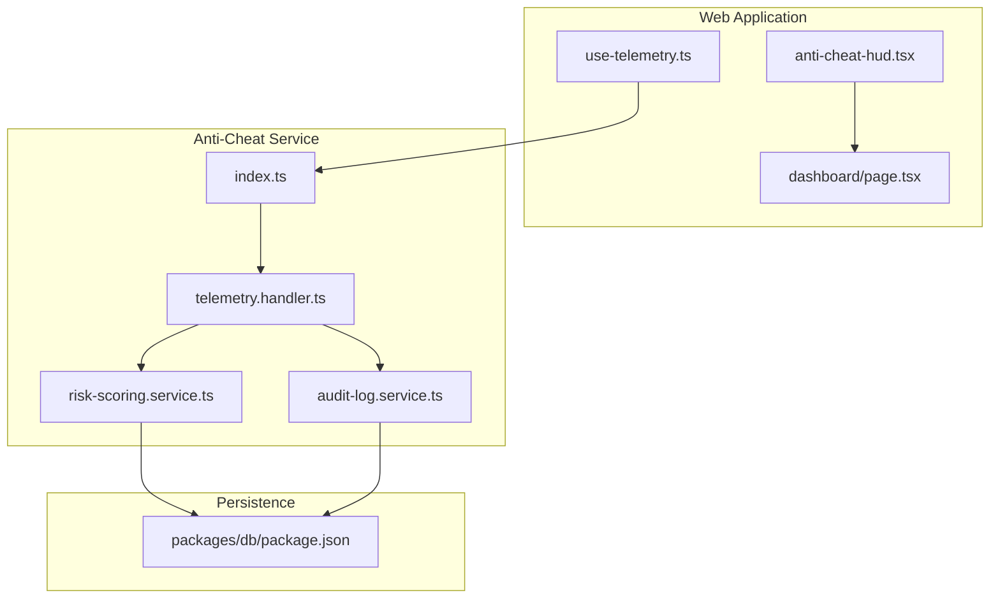
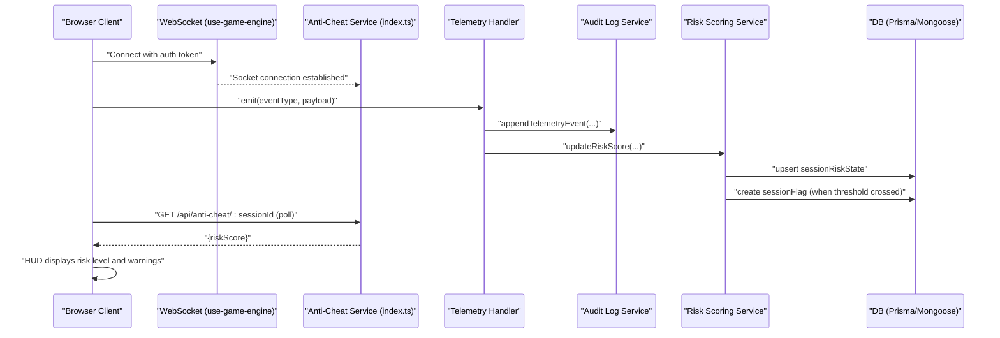
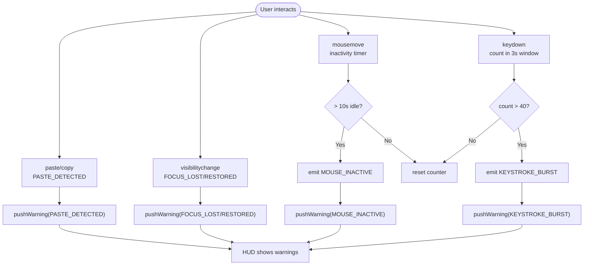
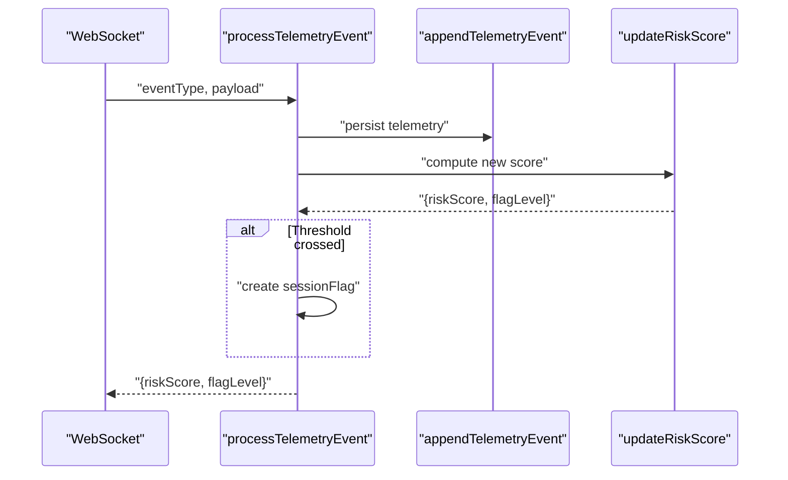
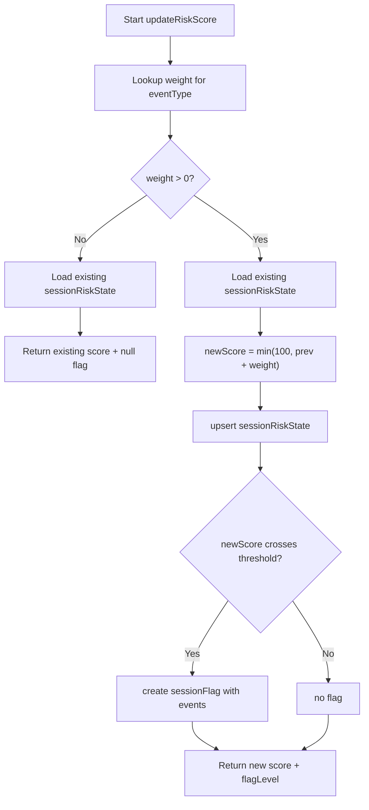
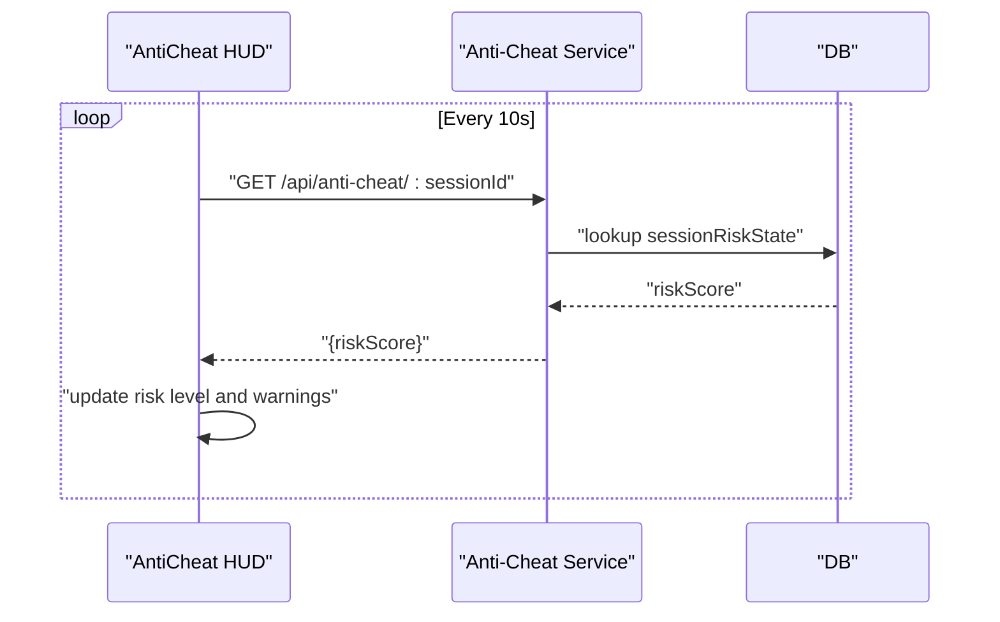
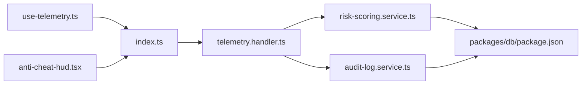

# Real-time Monitoring & Alerting

<cite>
**Referenced Files in This Document**
- [apps/anti-cheat/src/index.ts](file://apps/anti-cheat/src/index.ts)
- [apps/anti-cheat/src/handlers/telemetry.handler.ts](file://apps/anti-cheat/src/handlers/telemetry.handler.ts)
- [apps/anti-cheat/src/services/risk-scoring.service.ts](file://apps/anti-cheat/src/services/risk-scoring.service.ts)
- [apps/anti-cheat/src/services/audit-log.service.ts](file://apps/anti-cheat/src/services/audit-log.service.ts)
- [apps/web/hooks/use-telemetry.ts](file://apps/web/hooks/use-telemetry.ts)
- [apps/web/hooks/use-game-engine.ts](file://apps/web/hooks/use-game-engine.ts)
- [apps/web/components/game/anti-cheat-hud.tsx](file://apps/web/components/game/anti-cheat-hud.tsx)
- [apps/web/app/dashboard/page.tsx](file://apps/web/app/dashboard/page.tsx)
- [packages/db/package.json](file://packages/db/package.json)
</cite>

## Table of Contents
1. [Introduction](#introduction)
2. [Project Structure](#project-structure)
3. [Core Components](#core-components)
4. [Architecture Overview](#architecture-overview)
5. [Detailed Component Analysis](#detailed-component-analysis)
6. [Dependency Analysis](#dependency-analysis)
7. [Performance Considerations](#performance-considerations)
8. [Troubleshooting Guide](#troubleshooting-guide)
9. [Conclusion](#conclusion)
10. [Appendices](#appendices)

## Introduction
This document describes the real-time monitoring and alerting systems for the anti-cheat platform. It covers live risk assessment monitoring, automated alert generation, incident response workflows, and the monitoring dashboard. It explains the telemetry pipeline, real-time data visualization, alert escalation, integrations with external systems, notification channels, and automated remediation. It also documents system health monitoring, performance metrics collection, capacity planning indicators, and the integration with the broader anti-cheat ecosystem and distributed monitoring architecture. Finally, it addresses alert fatigue prevention, intelligent filtering, and noise reduction strategies.

## Project Structure
The monitoring and alerting system spans three primary areas:
- Frontend telemetry capture and visualization in the web application
- Real-time event ingestion and risk scoring in the anti-cheat service
- Audit logging and persistent state for risk flags and telemetry events

**Diagram sources**
- [apps/web/hooks/use-telemetry.ts](file://apps/web/hooks/use-telemetry.ts#L1-L157)
- [apps/web/components/game/anti-cheat-hud.tsx](file://apps/web/components/game/anti-cheat-hud.tsx#L1-L129)
- [apps/web/app/dashboard/page.tsx](file://apps/web/app/dashboard/page.tsx#L1-L367)
- [apps/anti-cheat/src/index.ts](file://apps/anti-cheat/src/index.ts#L1-L35)
- [apps/anti-cheat/src/handlers/telemetry.handler.ts](file://apps/anti-cheat/src/handlers/telemetry.handler.ts#L1-L82)
- [apps/anti-cheat/src/services/risk-scoring.service.ts](file://apps/anti-cheat/src/services/risk-scoring.service.ts#L1-L76)
- [apps/anti-cheat/src/services/audit-log.service.ts](file://apps/anti-cheat/src/services/audit-log.service.ts#L1-L19)
- [packages/db/package.json](file://packages/db/package.json#L1-L32)

**Section sources**
- [apps/anti-cheat/src/index.ts](file://apps/anti-cheat/src/index.ts#L1-L35)
- [apps/anti-cheat/src/handlers/telemetry.handler.ts](file://apps/anti-cheat/src/handlers/telemetry.handler.ts#L1-L82)
- [apps/anti-cheat/src/services/risk-scoring.service.ts](file://apps/anti-cheat/src/services/risk-scoring.service.ts#L1-L76)
- [apps/anti-cheat/src/services/audit-log.service.ts](file://apps/anti-cheat/src/services/audit-log.service.ts#L1-L19)
- [apps/web/hooks/use-telemetry.ts](file://apps/web/hooks/use-telemetry.ts#L1-L157)
- [apps/web/components/game/anti-cheat-hud.tsx](file://apps/web/components/game/anti-cheat-hud.tsx#L1-L129)
- [apps/web/app/dashboard/page.tsx](file://apps/web/app/dashboard/page.tsx#L1-L367)
- [packages/db/package.json](file://packages/db/package.json#L1-L32)

## Core Components
- Telemetry capture and emission (web): Detects focus loss, paste/copy, keystroke bursts, and mouse inactivity, emits events via WebSocket, and surfaces warnings to the player.
- Telemetry ingestion and processing (anti-cheat): Validates event types, persists telemetry, updates risk scores, and creates flags when thresholds are crossed.
- Risk scoring engine: Applies weights per event type, caps cumulative score, and raises flag levels (MEDIUM/HIGH) with persistence.
- Audit logging: Append-only persistence of telemetry events for forensic analysis.
- Real-time dashboard and HUD: Polls risk score, displays risk level and warning notifications, and auto-dismisses stale warnings.

**Section sources**
- [apps/web/hooks/use-telemetry.ts](file://apps/web/hooks/use-telemetry.ts#L1-L157)
- [apps/anti-cheat/src/handlers/telemetry.handler.ts](file://apps/anti-cheat/src/handlers/telemetry.handler.ts#L1-L82)
- [apps/anti-cheat/src/services/risk-scoring.service.ts](file://apps/anti-cheat/src/services/risk-scoring.service.ts#L1-L76)
- [apps/anti-cheat/src/services/audit-log.service.ts](file://apps/anti-cheat/src/services/audit-log.service.ts#L1-L19)
- [apps/web/components/game/anti-cheat-hud.tsx](file://apps/web/components/game/anti-cheat-hud.tsx#L1-L129)

## Architecture Overview
The system uses a WebSocket-based telemetry pipeline with a dedicated anti-cheat service and a real-time web dashboard.

**Diagram sources**
- [apps/web/hooks/use-game-engine.ts](file://apps/web/hooks/use-game-engine.ts#L28-L166)
- [apps/anti-cheat/src/index.ts](file://apps/anti-cheat/src/index.ts#L1-L35)
- [apps/anti-cheat/src/handlers/telemetry.handler.ts](file://apps/anti-cheat/src/handlers/telemetry.handler.ts#L1-L82)
- [apps/anti-cheat/src/services/audit-log.service.ts](file://apps/anti-cheat/src/services/audit-log.service.ts#L1-L19)
- [apps/anti-cheat/src/services/risk-scoring.service.ts](file://apps/anti-cheat/src/services/risk-scoring.service.ts#L1-L76)
- [packages/db/package.json](file://packages/db/package.json#L1-L32)

## Detailed Component Analysis

### Telemetry Capture and Emission (Web)
- Captures focus changes, paste/copy events, keystroke bursts, and mouse inactivity.
- Emits events over WebSocket with sessionId, candidateId, eventType, timestamp, and optional payload.
- Pushes warnings to the in-memory anti-cheat store for HUD display and auto-dismissal.

**Diagram sources**
- [apps/web/hooks/use-telemetry.ts](file://apps/web/hooks/use-telemetry.ts#L1-L157)
- [apps/web/components/game/anti-cheat-hud.tsx](file://apps/web/components/game/anti-cheat-hud.tsx#L1-L129)

**Section sources**
- [apps/web/hooks/use-telemetry.ts](file://apps/web/hooks/use-telemetry.ts#L1-L157)
- [apps/web/components/game/anti-cheat-hud.tsx](file://apps/web/components/game/anti-cheat-hud.tsx#L1-L129)

### Telemetry Ingestion and Processing (Anti-Cheat Service)
- Validates event types against a strict whitelist.
- Persists telemetry events append-only.
- Updates risk score per event and raises flag levels when thresholds are crossed.
- Creates session flags with associated events and payloads.

**Diagram sources**
- [apps/anti-cheat/src/handlers/telemetry.handler.ts](file://apps/anti-cheat/src/handlers/telemetry.handler.ts#L1-L82)
- [apps/anti-cheat/src/services/audit-log.service.ts](file://apps/anti-cheat/src/services/audit-log.service.ts#L1-L19)
- [apps/anti-cheat/src/services/risk-scoring.service.ts](file://apps/anti-cheat/src/services/risk-scoring.service.ts#L1-L76)

**Section sources**
- [apps/anti-cheat/src/handlers/telemetry.handler.ts](file://apps/anti-cheat/src/handlers/telemetry.handler.ts#L1-L82)
- [apps/anti-cheat/src/services/audit-log.service.ts](file://apps/anti-cheat/src/services/audit-log.service.ts#L1-L19)
- [apps/anti-cheat/src/services/risk-scoring.service.ts](file://apps/anti-cheat/src/services/risk-scoring.service.ts#L1-L76)

### Risk Scoring Engine
- Weights per event type determine incremental risk contribution.
- Score is capped at 100 and persisted per session.
- Flag levels are raised when thresholds are crossed; a session flag record is created with event metadata.

**Diagram sources**
- [apps/anti-cheat/src/services/risk-scoring.service.ts](file://apps/anti-cheat/src/services/risk-scoring.service.ts#L1-L76)

**Section sources**
- [apps/anti-cheat/src/services/risk-scoring.service.ts](file://apps/anti-cheat/src/services/risk-scoring.service.ts#L1-L76)

### Audit Logging
- Append-only persistence of telemetry events with sessionId, candidateId, eventType, and payload.
- Ensures immutable history for forensics and replay.

**Section sources**
- [apps/anti-cheat/src/services/audit-log.service.ts](file://apps/anti-cheat/src/services/audit-log.service.ts#L1-L19)

### Real-time Dashboard and HUD
- The HUD polls the anti-cheat service for the latest risk score and displays risk level badges and warning toasts.
- Warnings auto-dismiss after a short delay to prevent alert fatigue.
- The dashboard aggregates match history and global statistics for broader context.

**Diagram sources**
- [apps/web/components/game/anti-cheat-hud.tsx](file://apps/web/components/game/anti-cheat-hud.tsx#L1-L129)
- [apps/anti-cheat/src/index.ts](file://apps/anti-cheat/src/index.ts#L1-L35)
- [apps/anti-cheat/src/services/risk-scoring.service.ts](file://apps/anti-cheat/src/services/risk-scoring.service.ts#L1-L76)

**Section sources**
- [apps/web/components/game/anti-cheat-hud.tsx](file://apps/web/components/game/anti-cheat-hud.tsx#L1-L129)
- [apps/web/app/dashboard/page.tsx](file://apps/web/app/dashboard/page.tsx#L1-L367)

## Dependency Analysis
- Web telemetry depends on the WebSocket connection abstraction and the anti-cheat service’s telemetry namespace.
- The anti-cheat service depends on the audit log and risk scoring services, which persist state to the database.
- The dashboard depends on the anti-cheat service for risk score retrieval.

**Diagram sources**
- [apps/web/hooks/use-telemetry.ts](file://apps/web/hooks/use-telemetry.ts#L1-L157)
- [apps/web/components/game/anti-cheat-hud.tsx](file://apps/web/components/game/anti-cheat-hud.tsx#L1-L129)
- [apps/anti-cheat/src/index.ts](file://apps/anti-cheat/src/index.ts#L1-L35)
- [apps/anti-cheat/src/handlers/telemetry.handler.ts](file://apps/anti-cheat/src/handlers/telemetry.handler.ts#L1-L82)
- [apps/anti-cheat/src/services/audit-log.service.ts](file://apps/anti-cheat/src/services/audit-log.service.ts#L1-L19)
- [apps/anti-cheat/src/services/risk-scoring.service.ts](file://apps/anti-cheat/src/services/risk-scoring.service.ts#L1-L76)
- [packages/db/package.json](file://packages/db/package.json#L1-L32)

**Section sources**
- [apps/web/hooks/use-telemetry.ts](file://apps/web/hooks/use-telemetry.ts#L1-L157)
- [apps/web/components/game/anti-cheat-hud.tsx](file://apps/web/components/game/anti-cheat-hud.tsx#L1-L129)
- [apps/anti-cheat/src/index.ts](file://apps/anti-cheat/src/index.ts#L1-L35)
- [apps/anti-cheat/src/handlers/telemetry.handler.ts](file://apps/anti-cheat/src/handlers/telemetry.handler.ts#L1-L82)
- [apps/anti-cheat/src/services/audit-log.service.ts](file://apps/anti-cheat/src/services/audit-log.service.ts#L1-L19)
- [apps/anti-cheat/src/services/risk-scoring.service.ts](file://apps/anti-cheat/src/services/risk-scoring.service.ts#L1-L76)
- [packages/db/package.json](file://packages/db/package.json#L1-L32)

## Performance Considerations
- WebSocket transport is configured to use WebSocket with polling fallback and reconnection attempts to maintain low-latency telemetry.
- Risk score polling interval is tuned to balance responsiveness and load.
- Keystroke burst detection uses a sliding window to avoid excessive false positives under normal typing.
- Audit logs are append-only to minimize write contention and support scalable retention policies.

[No sources needed since this section provides general guidance]

## Troubleshooting Guide
- WebSocket connectivity: Verify the socket initialization and token propagation. Reconnection delays and attempts are configured to stabilize transient failures.
- Telemetry emission: Confirm that the session and user identifiers are present before emitting events. Events are ignored when the socket is not connected.
- Risk score polling: If the HUD does not update, check the anti-cheat service health endpoint and the session-specific API endpoint.
- Alert fatigue: The HUD auto-dismisses warnings after a fixed interval. Adjust the dismissal timing if needed to reduce noise.

**Section sources**
- [apps/web/hooks/use-game-engine.ts](file://apps/web/hooks/use-game-engine.ts#L28-L166)
- [apps/web/hooks/use-telemetry.ts](file://apps/web/hooks/use-telemetry.ts#L1-L157)
- [apps/web/components/game/anti-cheat-hud.tsx](file://apps/web/components/game/anti-cheat-hud.tsx#L1-L129)
- [apps/anti-cheat/src/index.ts](file://apps/anti-cheat/src/index.ts#L1-L35)

## Conclusion
The system provides a robust, real-time anti-cheat monitoring and alerting pipeline. It captures behavioral telemetry in the browser, streams validated events to the anti-cheat service, computes risk scores, and persists audit trails. The HUD and dashboard deliver immediate feedback and context to players and operators. The architecture supports scalability, resilience, and operational visibility, with built-in mechanisms to prevent alert fatigue and reduce noise.

[No sources needed since this section summarizes without analyzing specific files]

## Appendices

### Alert Configurations and Threshold Triggers
- Event weights and thresholds:
  - Thresholds: MEDIUM at 60, HIGH at 80.
  - Event weights: e.g., PASTE_DETECTED, KEYSTROKE_BURST, MOUSE_INACTIVE, FAST_SOLUTION contribute incrementally; FOCUS_LOST contributes more than FOCUS_RESTORED; SOLUTION_SUBMITTED resets context without adding risk.
- Session flag creation: Occurs when a new threshold boundary is crossed, capturing the event types and payloads for downstream review.

**Section sources**
- [apps/anti-cheat/src/services/risk-scoring.service.ts](file://apps/anti-cheat/src/services/risk-scoring.service.ts#L1-L76)

### Notification Channels and Escalation
- Browser-side warnings: Toast notifications for detected anomalies with auto-dismissal.
- Operator alerts: Session flags are persisted and can be surfaced via dashboards or external alerting systems.
- Escalation: When a HIGH flag is raised, operator workflows can trigger remediation actions (e.g., session review, temporary restrictions).

**Section sources**
- [apps/web/components/game/anti-cheat-hud.tsx](file://apps/web/components/game/anti-cheat-hud.tsx#L1-L129)
- [apps/anti-cheat/src/services/risk-scoring.service.ts](file://apps/anti-cheat/src/services/risk-scoring.service.ts#L1-L76)

### Automated Remediation Scripts
- Example scenarios:
  - High-risk session: Trigger a temporary timeout or redirect to a review queue.
  - Repeated MEDIUM flags: Apply stricter behavioral sampling or restrict certain actions.
- Implementation: Integrate remediation hooks in the anti-cheat service or a dedicated orchestration layer that reacts to session flags.

[No sources needed since this section provides general guidance]

### System Health Monitoring and Metrics
- Health endpoint: Anti-cheat service exposes a health check for readiness and liveness.
- Metrics: Track event rates, risk score distributions, flag counts, and WebSocket connection metrics.
- Capacity planning: Monitor session concurrency, event throughput, and database upsert rates to size resources accordingly.

**Section sources**
- [apps/anti-cheat/src/index.ts](file://apps/anti-cheat/src/index.ts#L1-L35)

### Distributed Monitoring and Cross-Service Coordination
- Gateway and WebSocket: The game engine manages WebSocket connections and authentication tokens, ensuring secure and reliable telemetry transport.
- Anti-cheat service: Dedicated service for telemetry processing and risk scoring.
- Persistence: Database client libraries enable scalable storage and querying of telemetry and flags.

**Section sources**
- [apps/web/hooks/use-game-engine.ts](file://apps/web/hooks/use-game-engine.ts#L28-L166)
- [packages/db/package.json](file://packages/db/package.json#L1-L32)

### Alert Fatigue Prevention and Noise Reduction
- Intelligent filtering: Use event weights and thresholds to reduce false positives.
- Auto-dismissal: Warning toasts automatically disappear after a short delay.
- Sliding windows: Keystroke burst detection uses a 3-second window with a high threshold to avoid minor spikes.
- Operator triage: Persist flags for targeted review rather than noisy real-time alerts.

**Section sources**
- [apps/web/hooks/use-telemetry.ts](file://apps/web/hooks/use-telemetry.ts#L1-L157)
- [apps/web/components/game/anti-cheat-hud.tsx](file://apps/web/components/game/anti-cheat-hud.tsx#L1-L129)
- [apps/anti-cheat/src/services/risk-scoring.service.ts](file://apps/anti-cheat/src/services/risk-scoring.service.ts#L1-L76)