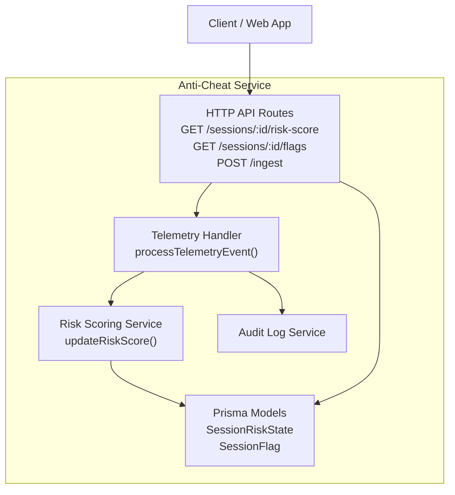
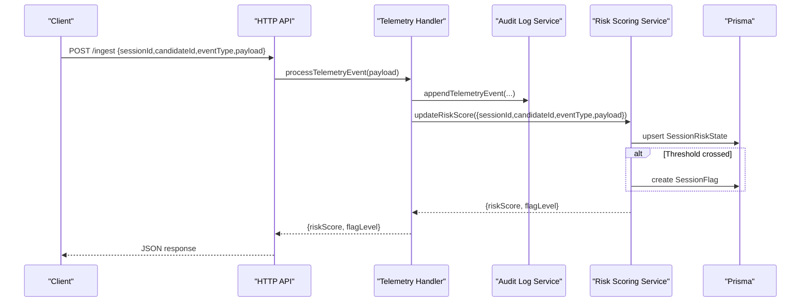
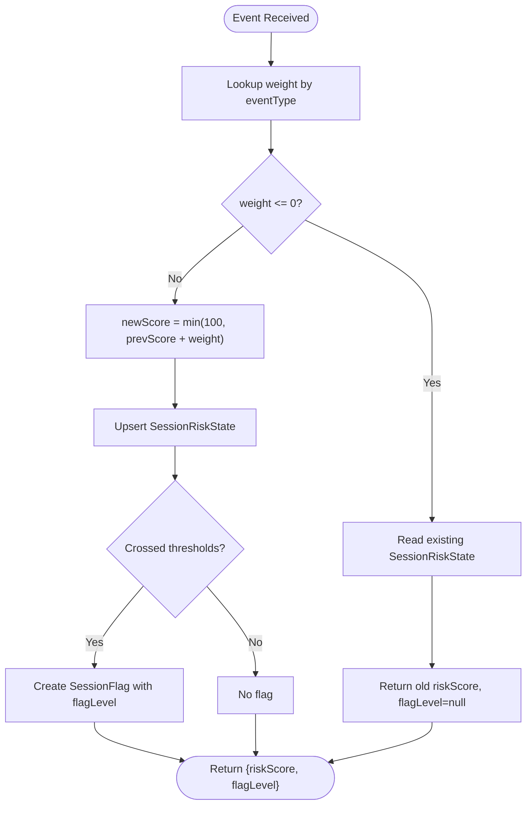
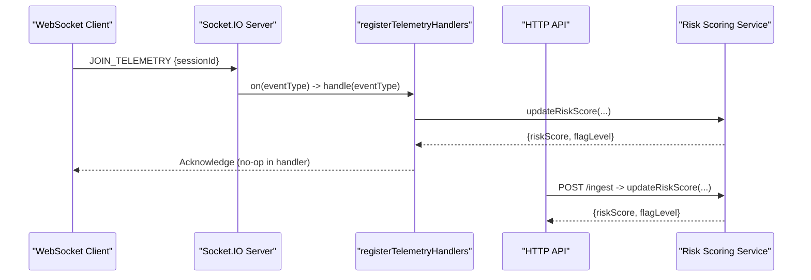
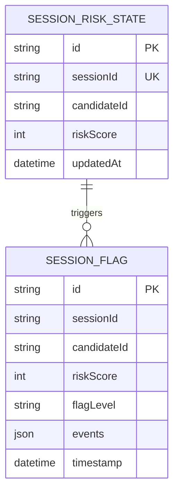
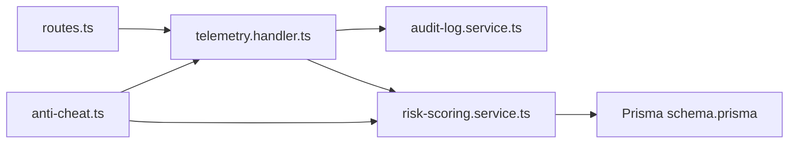

# Risk Scoring Algorithms

<cite>
**Referenced Files in This Document**
- [risk-scoring.service.ts](file://apps/anti-cheat/src/services/risk-scoring.service.ts)
- [telemetry.handler.ts](file://apps/anti-cheat/src/handlers/telemetry.handler.ts)
- [routes.ts](file://apps/anti-cheat/src/api/routes.ts)
- [index.ts](file://apps/anti-cheat/src/index.ts)
- [anti-cheat.ts](file://packages/types/src/anti-cheat.ts)
- [schema.prisma](file://packages/db/prisma/schema.prisma)
- [audit-log.service.ts](file://apps/anti-cheat/src/services/audit-log.service.ts)
</cite>

## Table of Contents
1. [Introduction](#introduction)
2. [Project Structure](#project-structure)
3. [Core Components](#core-components)
4. [Architecture Overview](#architecture-overview)
5. [Detailed Component Analysis](#detailed-component-analysis)
6. [Dependency Analysis](#dependency-analysis)
7. [Performance Considerations](#performance-considerations)
8. [Troubleshooting Guide](#troubleshooting-guide)
9. [Conclusion](#conclusion)

## Introduction
This document explains the risk scoring algorithms and cheating probability calculation system implemented in the anti-cheat service. It focuses on the scoring methodology, thresholds, and decision boundaries currently present in the codebase, and clarifies how behavioral telemetry is collected, validated, and scored. Where applicable, it also outlines conceptual extensions for advanced scoring (e.g., weighted aggregation, anomaly detection, and adaptive mechanisms) that are planned or partially defined in shared types.

## Project Structure
The anti-cheat service exposes:
- An HTTP API for ingestion and retrieval of risk scores
- WebSocket channels for real-time telemetry
- Handlers that validate and process telemetry events
- A risk scoring service that updates per-session risk scores
- Shared types defining telemetry schemas and scoring signals
- A Prisma schema modeling session risk state and flags

**Diagram sources**
- [routes.ts](file://apps/anti-cheat/src/api/routes.ts#L13-L42)
- [telemetry.handler.ts](file://apps/anti-cheat/src/handlers/telemetry.handler.ts#L30-L51)
- [risk-scoring.service.ts](file://apps/anti-cheat/src/services/risk-scoring.service.ts#L18-L75)
- [audit-log.service.ts](file://apps/anti-cheat/src/services/audit-log.service.ts)
- [schema.prisma](file://packages/db/prisma/schema.prisma#L252-L260)

**Section sources**
- [routes.ts](file://apps/anti-cheat/src/api/routes.ts#L1-L85)
- [telemetry.handler.ts](file://apps/anti-cheat/src/handlers/telemetry.handler.ts#L1-L82)
- [risk-scoring.service.ts](file://apps/anti-cheat/src/services/risk-scoring.service.ts#L1-L76)
- [index.ts](file://apps/anti-cheat/src/index.ts#L1-L35)
- [anti-cheat.ts](file://packages/types/src/anti-cheat.ts#L1-L86)
- [schema.prisma](file://packages/db/prisma/schema.prisma#L252-L260)

## Core Components
- Risk scoring weights and thresholds:
  - Fixed weights per event type are defined in the risk scoring service.
  - Thresholds trigger flag levels when crossing them.
- Telemetry ingestion:
  - HTTP endpoint validates payload and event type, then delegates to the handler.
  - WebSocket channel supports real-time ingestion via typed event names.
- Persistence:
  - Session risk state is upserted per session.
  - Flags are recorded when thresholds are crossed.

Key implementation references:
- Weights and thresholds: [WEIGHTS and thresholds](file://apps/anti-cheat/src/services/risk-scoring.service.ts#L3-L14)
- Risk score update logic: [updateRiskScore](file://apps/anti-cheat/src/services/risk-scoring.service.ts#L18-L75)
- Telemetry ingestion endpoint: [POST /ingest](file://apps/anti-cheat/src/api/routes.ts#L44-L82)
- Telemetry handler: [processTelemetryEvent](file://apps/anti-cheat/src/handlers/telemetry.handler.ts#L30-L51)
- Session risk state model: [SessionRiskState](file://packages/db/prisma/schema.prisma#L252-L260)

**Section sources**
- [risk-scoring.service.ts](file://apps/anti-cheat/src/services/risk-scoring.service.ts#L1-L76)
- [routes.ts](file://apps/anti-cheat/src/api/routes.ts#L44-L82)
- [telemetry.handler.ts](file://apps/anti-cheat/src/handlers/telemetry.handler.ts#L30-L51)
- [schema.prisma](file://packages/db/prisma/schema.prisma#L252-L260)

## Architecture Overview
The system collects behavioral telemetry, validates it, logs it, and updates a per-session risk score. When the score crosses configured thresholds, a flag is created.

**Diagram sources**
- [routes.ts](file://apps/anti-cheat/src/api/routes.ts#L44-L82)
- [telemetry.handler.ts](file://apps/anti-cheat/src/handlers/telemetry.handler.ts#L30-L51)
- [risk-scoring.service.ts](file://apps/anti-cheat/src/services/risk-scoring.service.ts#L18-L75)
- [audit-log.service.ts](file://apps/anti-cheat/src/services/audit-log.service.ts)
- [schema.prisma](file://packages/db/prisma/schema.prisma#L252-L260)

## Detailed Component Analysis

### Risk Scoring Service
- Scoring methodology:
  - Adds a fixed weight per event type to the current risk score.
  - Caps the score at 100.
  - Emits a flag when crossing thresholds (medium/high) and records the triggering events.
- Thresholds:
  - Medium threshold: 60
  - High threshold: 80
- Weights:
  - Focus lost: 10
  - Paste detected: 25
  - Keystroke burst: 5
  - Mouse inactive: 5
  - Fast solution: 30
  - Other events contribute zero weight.

**Diagram sources**
- [risk-scoring.service.ts](file://apps/anti-cheat/src/services/risk-scoring.service.ts#L18-L75)
- [schema.prisma](file://packages/db/prisma/schema.prisma#L252-L260)

**Section sources**
- [risk-scoring.service.ts](file://apps/anti-cheat/src/services/risk-scoring.service.ts#L1-L76)

### Telemetry Handler and Ingestion
- Validates event type against allowed set.
- Writes audit log entry for the event.
- Delegates scoring update and returns the resulting risk score and flag level.
- WebSocket registration supports real-time ingestion via typed event names.

**Diagram sources**
- [index.ts](file://apps/anti-cheat/src/index.ts#L24-L29)
- [telemetry.handler.ts](file://apps/anti-cheat/src/handlers/telemetry.handler.ts#L54-L81)
- [routes.ts](file://apps/anti-cheat/src/api/routes.ts#L44-L82)
- [risk-scoring.service.ts](file://apps/anti-cheat/src/services/risk-scoring.service.ts#L18-L75)

**Section sources**
- [telemetry.handler.ts](file://apps/anti-cheat/src/handlers/telemetry.handler.ts#L1-L82)
- [index.ts](file://apps/anti-cheat/src/index.ts#L1-L35)
- [routes.ts](file://apps/anti-cheat/src/api/routes.ts#L1-L85)

### Telemetry Schemas and Behavioral Signals (Shared Types)
- Telemetry event types include focus loss/gain, paste detection, keystroke cadence, round timing, clipboard access, and devtools open.
- A telemetry batch schema defines structured ingestion with a session identifier and bounded event counts.
- A risk score response schema includes aggregated counts and a computed aggregate score with a flagged indicator.
- Default behavior signals define weights and thresholds for internal scoring models (e.g., keystroke cadence, round timing).

These definitions support future implementations of:
- Weighted aggregation scoring across multiple behavioral signals
- Confidence intervals derived from historical baselines
- Adaptive thresholds based on difficulty or candidate history

**Section sources**
- [anti-cheat.ts](file://packages/types/src/anti-cheat.ts#L5-L24)
- [anti-cheat.ts](file://packages/types/src/anti-cheat.ts#L26-L44)
- [anti-cheat.ts](file://packages/types/src/anti-cheat.ts#L47-L85)

### Database Models
- SessionRiskState persists the current risk score per session and candidate.
- SessionFlag records threshold crossings with associated events.

**Diagram sources**
- [schema.prisma](file://packages/db/prisma/schema.prisma#L252-L260)

**Section sources**
- [schema.prisma](file://packages/db/prisma/schema.prisma#L252-L260)

## Dependency Analysis
- The HTTP API depends on the telemetry handler and risk scoring service.
- The telemetry handler depends on the audit log service and risk scoring service.
- The risk scoring service depends on the database layer for persistence.
- Shared types define the contract for telemetry and scoring signals.

**Diagram sources**
- [routes.ts](file://apps/anti-cheat/src/api/routes.ts#L1-L85)
- [telemetry.handler.ts](file://apps/anti-cheat/src/handlers/telemetry.handler.ts#L1-L82)
- [risk-scoring.service.ts](file://apps/anti-cheat/src/services/risk-scoring.service.ts#L1-L76)
- [audit-log.service.ts](file://apps/anti-cheat/src/services/audit-log.service.ts)
- [anti-cheat.ts](file://packages/types/src/anti-cheat.ts#L1-L86)
- [schema.prisma](file://packages/db/prisma/schema.prisma#L252-L260)

**Section sources**
- [routes.ts](file://apps/anti-cheat/src/api/routes.ts#L1-L85)
- [telemetry.handler.ts](file://apps/anti-cheat/src/handlers/telemetry.handler.ts#L1-L82)
- [risk-scoring.service.ts](file://apps/anti-cheat/src/services/risk-scoring.service.ts#L1-L76)
- [anti-cheat.ts](file://packages/types/src/anti-cheat.ts#L1-L86)
- [schema.prisma](file://packages/db/prisma/schema.prisma#L252-L260)

## Performance Considerations
- Event processing is synchronous per request; batching telemetry could reduce load.
- Upserts are used to avoid race conditions on concurrent updates.
- Threshold checks are constant-time and lightweight.
- Consider indexing on candidateId and timestamps for flag queries.

[No sources needed since this section provides general guidance]

## Troubleshooting Guide
- Invalid ingestion payload:
  - The API validates presence of required fields and event type membership.
  - Nonexistent session risk state returns a 404 for retrieval endpoints.
- Threshold crossings:
  - Flags are only created when crossing thresholds; verify thresholds and weights.
- Audit logging:
  - Ensure audit entries are written before scoring to maintain traceability.

**Section sources**
- [routes.ts](file://apps/anti-cheat/src/api/routes.ts#L44-L82)
- [telemetry.handler.ts](file://apps/anti-cheat/src/handlers/telemetry.handler.ts#L30-L51)
- [risk-scoring.service.ts](file://apps/anti-cheat/src/services/risk-scoring.service.ts#L18-L75)

## Conclusion
The current implementation provides a straightforward additive scoring model with fixed weights and threshold-based flagging. It includes robust ingestion via HTTP and WebSocket, audit logging, and persistent state management. The shared types define a foundation for richer behavioral scoring, including weighted aggregation, anomaly detection, and adaptive thresholds. Future work should implement those advanced scoring components while maintaining the existing audit and flagging infrastructure.