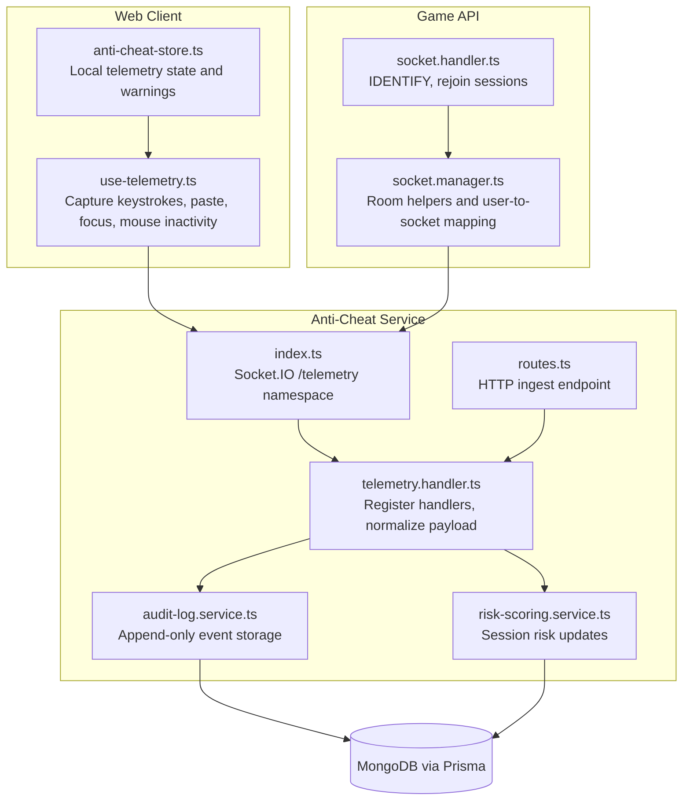
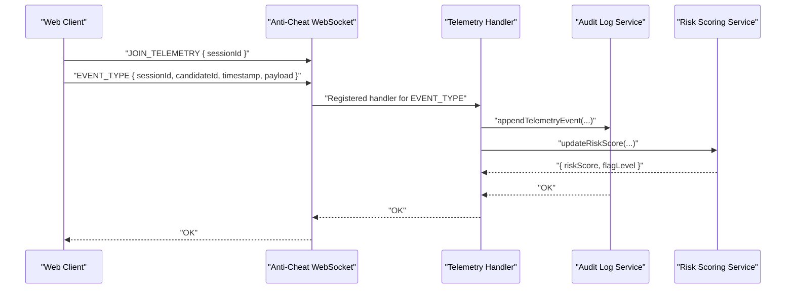
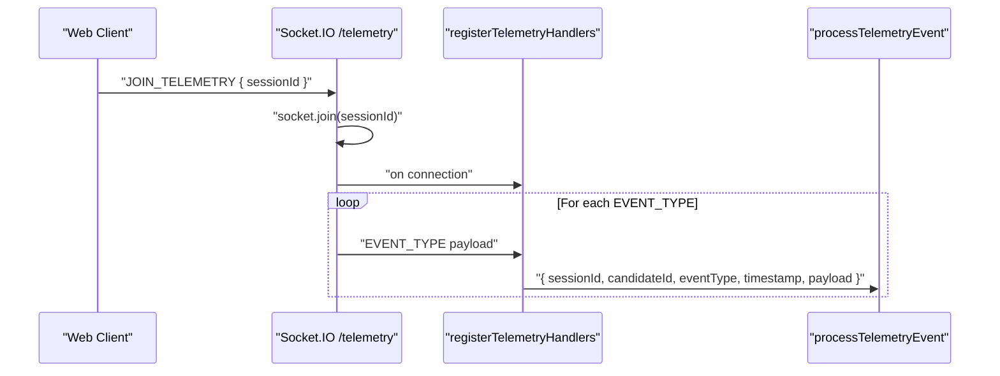
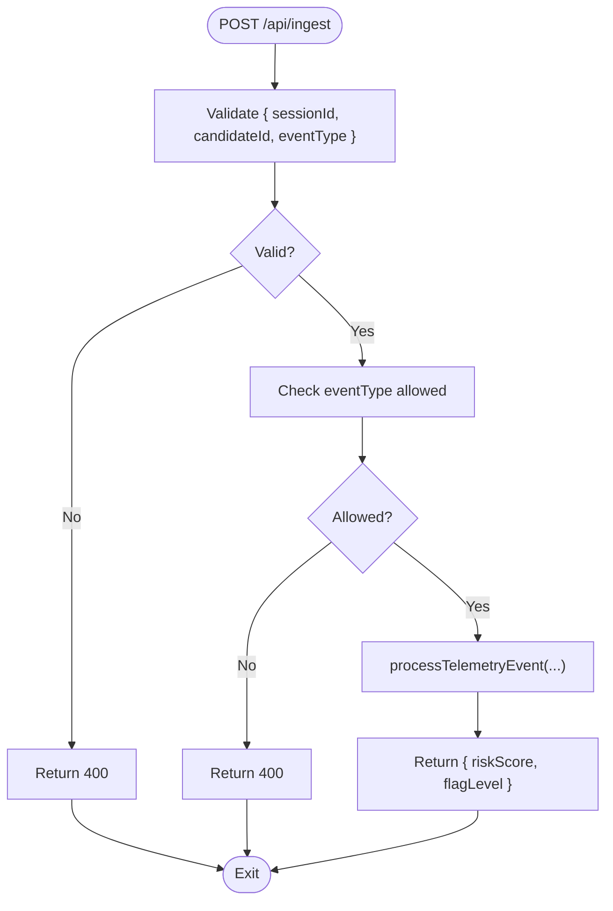
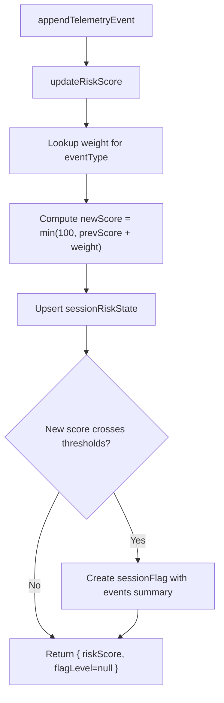
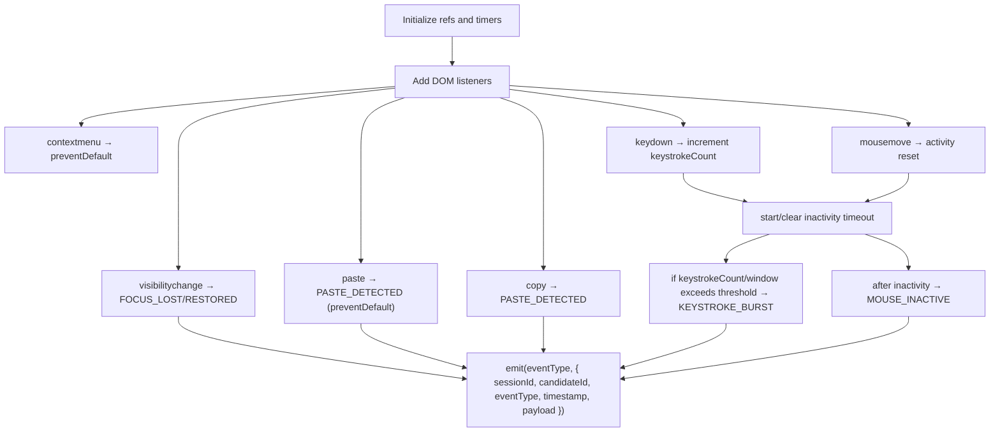
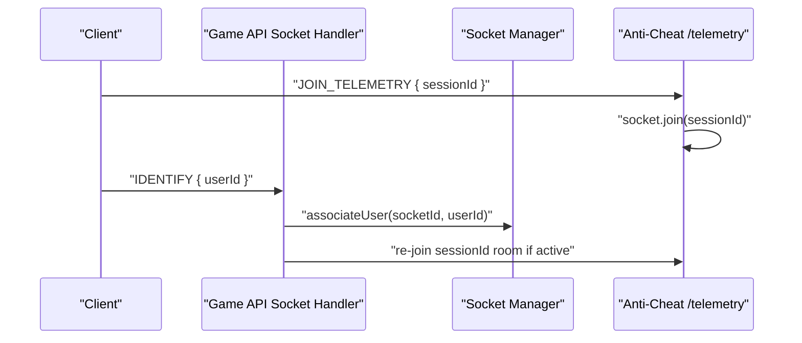
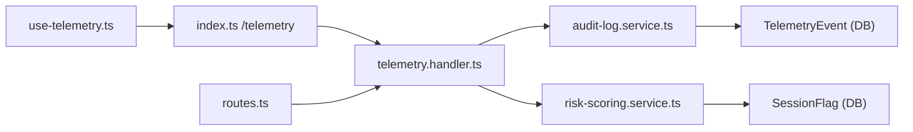

# Telemetry Collection & Processing

<cite>
**Referenced Files in This Document**
- [index.ts](file://apps/anti-cheat/src/index.ts)
- [telemetry.handler.ts](file://apps/anti-cheat/src/handlers/telemetry.handler.ts)
- [routes.ts](file://apps/anti-cheat/src/api/routes.ts)
- [audit-log.service.ts](file://apps/anti-cheat/src/services/audit-log.service.ts)
- [risk-scoring.service.ts](file://apps/anti-cheat/src/services/risk-scoring.service.ts)
- [use-telemetry.ts](file://apps/web/hooks/use-telemetry.ts)
- [anti-cheat-store.ts](file://apps/web/store/anti-cheat-store.ts)
- [socket.manager.ts](file://apps/game-api/src/websocket/socket.manager.ts)
- [socket.handler.ts](file://apps/game-api/src/websocket/socket.handler.ts)
- [anti-cheat.ts](file://packages/types/src/anti-cheat.ts)
- [20260308000000_add_match_records_and_anti_cheat/migration.sql](file://packages/db/prisma/migrations/20260308000000_add_match_records_and_anti_cheat/migration.sql)
</cite>

## Table of Contents
1. [Introduction](#introduction)
2. [Project Structure](#project-structure)
3. [Core Components](#core-components)
4. [Architecture Overview](#architecture-overview)
5. [Detailed Component Analysis](#detailed-component-analysis)
6. [Dependency Analysis](#dependency-analysis)
7. [Performance Considerations](#performance-considerations)
8. [Troubleshooting Guide](#troubleshooting-guide)
9. [Privacy, Anonymization, and Compliance](#privacy-anonymization-and-compliance)
10. [Conclusion](#conclusion)

## Introduction
This document describes the telemetry collection and processing subsystem used for behavioral monitoring during assessments. It covers the WebSocket-based ingestion pipeline, event types, session-based grouping, real-time streaming, data validation, and backend processing. It also documents the frontend telemetry hook, Socket.IO room integration, risk scoring, and operational safeguards.

## Project Structure
The telemetry system spans three primary areas:
- Frontend telemetry capture and emission via a React hook
- Backend ingestion via WebSocket and HTTP endpoints
- Risk scoring and audit logging services

**Diagram sources**
- [index.ts](file://apps/anti-cheat/src/index.ts#L24-L29)
- [telemetry.handler.ts](file://apps/anti-cheat/src/handlers/telemetry.handler.ts#L54-L81)
- [routes.ts](file://apps/anti-cheat/src/api/routes.ts#L44-L82)
- [audit-log.service.ts](file://apps/anti-cheat/src/services/audit-log.service.ts#L4-L18)
- [risk-scoring.service.ts](file://apps/anti-cheat/src/services/risk-scoring.service.ts#L18-L75)
- [use-telemetry.ts](file://apps/web/hooks/use-telemetry.ts#L35-L54)
- [anti-cheat-store.ts](file://apps/web/store/anti-cheat-store.ts#L20-L33)
- [socket.manager.ts](file://apps/game-api/src/websocket/socket.manager.ts#L31-L43)
- [socket.handler.ts](file://apps/game-api/src/websocket/socket.handler.ts#L62-L87)

**Section sources**
- [index.ts](file://apps/anti-cheat/src/index.ts#L1-L35)
- [telemetry.handler.ts](file://apps/anti-cheat/src/handlers/telemetry.handler.ts#L1-L82)
- [routes.ts](file://apps/anti-cheat/src/api/routes.ts#L1-L85)
- [audit-log.service.ts](file://apps/anti-cheat/src/services/audit-log.service.ts#L1-L19)
- [risk-scoring.service.ts](file://apps/anti-cheat/src/services/risk-scoring.service.ts#L1-L76)
- [use-telemetry.ts](file://apps/web/hooks/use-telemetry.ts#L1-L157)
- [anti-cheat-store.ts](file://apps/web/store/anti-cheat-store.ts#L1-L108)
- [socket.manager.ts](file://apps/game-api/src/websocket/socket.manager.ts#L1-L55)
- [socket.handler.ts](file://apps/game-api/src/websocket/socket.handler.ts#L62-L87)

## Core Components
- WebSocket namespace and room joining
  - The anti-cheat service exposes a dedicated Socket.IO namespace for telemetry and registers handlers upon connection. Clients join a room identified by the session ID.
- Telemetry event types and payload normalization
  - The handler validates event types and normalizes identifiers (session, candidate/user) and timestamps.
- Audit logging and risk scoring
  - Events are appended to an append-only log; risk scores are updated per session with thresholds triggering flags.
- HTTP ingest endpoint
  - An Express route validates payloads and forwards to the same processing pipeline.
- Frontend telemetry hook
  - Captures paste, focus, keystroke bursts, and mouse inactivity, emitting normalized events over WebSocket.
- Session room integration
  - Game API manages user-to-socket mapping and session rooms; anti-cheat leverages session rooms for broadcasting or targeted updates.

**Section sources**
- [index.ts](file://apps/anti-cheat/src/index.ts#L24-L29)
- [telemetry.handler.ts](file://apps/anti-cheat/src/handlers/telemetry.handler.ts#L4-L28)
- [telemetry.handler.ts](file://apps/anti-cheat/src/handlers/telemetry.handler.ts#L54-L81)
- [audit-log.service.ts](file://apps/anti-cheat/src/services/audit-log.service.ts#L4-L18)
- [risk-scoring.service.ts](file://apps/anti-cheat/src/services/risk-scoring.service.ts#L18-L75)
- [routes.ts](file://apps/anti-cheat/src/api/routes.ts#L44-L82)
- [use-telemetry.ts](file://apps/web/hooks/use-telemetry.ts#L35-L54)
- [socket.manager.ts](file://apps/game-api/src/websocket/socket.manager.ts#L31-L43)
- [socket.handler.ts](file://apps/game-api/src/websocket/socket.handler.ts#L62-L87)

## Architecture Overview
The telemetry pipeline supports two ingestion paths:
- Real-time WebSocket: clients emit events directly to the anti-cheat service’s /telemetry namespace.
- HTTP ingest: external systems can POST structured payloads to the ingest endpoint.

**Diagram sources**
- [index.ts](file://apps/anti-cheat/src/index.ts#L24-L29)
- [telemetry.handler.ts](file://apps/anti-cheat/src/handlers/telemetry.handler.ts#L54-L81)
- [audit-log.service.ts](file://apps/anti-cheat/src/services/audit-log.service.ts#L4-L18)
- [risk-scoring.service.ts](file://apps/anti-cheat/src/services/risk-scoring.service.ts#L18-L75)

## Detailed Component Analysis

### WebSocket Telemetry Ingestion
- Namespace and room joining
  - The anti-cheat service creates a Socket.IO server and listens for connections on the /telemetry namespace. Upon connection, clients send JOIN_TELEMETRY with a session ID, which the server uses to join the room.
- Handler registration
  - The handler registers listeners for a fixed set of telemetry event types. Each listener normalizes sessionId and candidateId from either the payload or socket metadata, ensures a timestamp, and invokes the processing pipeline.
- Session-based grouping
  - All events are associated with a session ID, enabling per-session risk computation and flagging.

**Diagram sources**
- [index.ts](file://apps/anti-cheat/src/index.ts#L24-L29)
- [telemetry.handler.ts](file://apps/anti-cheat/src/handlers/telemetry.handler.ts#L54-L81)

**Section sources**
- [index.ts](file://apps/anti-cheat/src/index.ts#L24-L29)
- [telemetry.handler.ts](file://apps/anti-cheat/src/handlers/telemetry.handler.ts#L54-L81)

### HTTP Ingest Endpoint
- Validation and routing
  - The ingest endpoint validates presence of required fields and checks the event type against allowed values. On success, it triggers the same processing pipeline and returns the updated risk score and flag level.
- Error handling
  - Returns appropriate HTTP status codes for malformed requests and internal errors.

**Diagram sources**
- [routes.ts](file://apps/anti-cheat/src/api/routes.ts#L44-L82)

**Section sources**
- [routes.ts](file://apps/anti-cheat/src/api/routes.ts#L44-L82)

### Telemetry Event Processing Pipeline
- Audit logging
  - Append-only creation of telemetry events with optional payload.
- Risk scoring
  - Per-event weights increment the session risk score with upsert semantics. Thresholds trigger session flags with event summaries.

**Diagram sources**
- [audit-log.service.ts](file://apps/anti-cheat/src/services/audit-log.service.ts#L4-L18)
- [risk-scoring.service.ts](file://apps/anti-cheat/src/services/risk-scoring.service.ts#L18-L75)

**Section sources**
- [audit-log.service.ts](file://apps/anti-cheat/src/services/audit-log.service.ts#L1-L19)
- [risk-scoring.service.ts](file://apps/anti-cheat/src/services/risk-scoring.service.ts#L1-L76)

### Frontend Telemetry Hook
- Event capture
  - Listens for visibility change, paste, copy, context menu, keyboard input, and mouse movement.
- Burst detection and inactivity timers
  - Tracks keystrokes over a sliding window and emits a burst event when exceeding a threshold. Schedules and clears inactivity timeouts based on recent activity.
- Emission
  - Emits normalized events with sessionId, candidateId, eventType, timestamp, and optional payload. Prevents emission if the socket is not connected.

**Diagram sources**
- [use-telemetry.ts](file://apps/web/hooks/use-telemetry.ts#L56-L155)

**Section sources**
- [use-telemetry.ts](file://apps/web/hooks/use-telemetry.ts#L1-L157)

### Session Rooms and Room Management
- Room joining
  - Clients join a room identified by sessionId after sending JOIN_TELEMETRY.
- Room helpers
  - The game API provides helpers to join/leave rooms and emit to sessions, enabling broader broadcast scenarios if needed.
- Rejoining after reconnect
  - On reconnection, the game API handler re-associates the socket with the active session and rejoins the room.

**Diagram sources**
- [index.ts](file://apps/anti-cheat/src/index.ts#L24-L29)
- [socket.handler.ts](file://apps/game-api/src/websocket/socket.handler.ts#L62-L87)
- [socket.manager.ts](file://apps/game-api/src/websocket/socket.manager.ts#L31-L43)

**Section sources**
- [index.ts](file://apps/anti-cheat/src/index.ts#L24-L29)
- [socket.handler.ts](file://apps/game-api/src/websocket/socket.handler.ts#L62-L87)
- [socket.manager.ts](file://apps/game-api/src/websocket/socket.manager.ts#L1-L55)

## Dependency Analysis
- Component coupling
  - The telemetry handler depends on audit-log and risk-scoring services. The HTTP ingest endpoint delegates to the same handler.
- Frontend-to-backend contracts
  - The frontend emits event types aligned with the backend’s allowed set. Timestamps are normalized to ISO strings on the client.
- Database schema
  - TelemetryEvent and SessionFlag tables support append-only logging and flagging with indexed fields for efficient querying.

**Diagram sources**
- [use-telemetry.ts](file://apps/web/hooks/use-telemetry.ts#L35-L54)
- [index.ts](file://apps/anti-cheat/src/index.ts#L24-L29)
- [telemetry.handler.ts](file://apps/anti-cheat/src/handlers/telemetry.handler.ts#L54-L81)
- [audit-log.service.ts](file://apps/anti-cheat/src/services/audit-log.service.ts#L4-L18)
- [risk-scoring.service.ts](file://apps/anti-cheat/src/services/risk-scoring.service.ts#L18-L75)
- [routes.ts](file://apps/anti-cheat/src/api/routes.ts#L44-L82)
- [20260308000000_add_match_records_and_anti_cheat/migration.sql](file://packages/db/prisma/migrations/20260308000000_add_match_records_and_anti_cheat/migration.sql#L46-L72)

**Section sources**
- [telemetry.handler.ts](file://apps/anti-cheat/src/handlers/telemetry.handler.ts#L1-L82)
- [routes.ts](file://apps/anti-cheat/src/api/routes.ts#L1-L85)
- [audit-log.service.ts](file://apps/anti-cheat/src/services/audit-log.service.ts#L1-L19)
- [risk-scoring.service.ts](file://apps/anti-cheat/src/services/risk-scoring.service.ts#L1-L76)
- [use-telemetry.ts](file://apps/web/hooks/use-telemetry.ts#L1-L157)
- [20260308000000_add_match_records_and_anti_cheat/migration.sql](file://packages/db/prisma/migrations/20260308000000_add_match_records_and_anti_cheat/migration.sql#L46-L72)

## Performance Considerations
- Event volume and batching
  - The frontend aggregates events locally and emits only significant signals (bursts, inactivity). Consider introducing batch submission for high-frequency events to reduce overhead.
- Database writes
  - Append-only writes minimize contention; ensure indexes on sessionId, candidateId, and timestamp are maintained for efficient queries.
- Risk scoring updates
  - Upserts are per event; consider batching updates for frequent events to reduce write amplification.
- WebSocket scalability
  - Use room-based distribution and consider load balancing with sticky sessions or a shared state store if scaling horizontally.

[No sources needed since this section provides general guidance]

## Troubleshooting Guide
- Client-side
  - If the socket is not connected, emissions are skipped with a warning. Verify the connection state and ensure JOIN_TELEMETRY is sent with a valid sessionId.
- Server-side
  - The handler ignores malformed events and logs errors internally. Check logs for invalid payloads or missing identifiers.
- HTTP ingest
  - Ensure the request body includes sessionId, candidateId, eventType, and that eventType is one of the allowed values. Confirm the service health endpoint is reachable.

**Section sources**
- [use-telemetry.ts](file://apps/web/hooks/use-telemetry.ts#L35-L54)
- [telemetry.handler.ts](file://apps/anti-cheat/src/handlers/telemetry.handler.ts#L58-L76)
- [routes.ts](file://apps/anti-cheat/src/api/routes.ts#L44-L82)

## Privacy, Anonymization, and Compliance
- Data minimization
  - Only collect event types necessary for anti-cheat purposes. Avoid capturing sensitive content beyond what is required for detection.
- Timestamps and identifiers
  - Normalize timestamps to UTC ISO strings. Avoid embedding personally identifiable information in payloads; rely on session and candidate identifiers.
- Append-only logging
  - The audit log service performs append-only writes, reducing accidental modifications. Retention policies should be defined at the database layer.
- Consent and transparency
  - Provide clear notice and consent mechanisms for telemetry collection. Allow users to opt out where feasible and provide access to their telemetry data.
- Data retention and deletion
  - Define retention windows for TelemetryEvent and SessionFlag records. Implement deletion procedures aligned with legal obligations.
- Security
  - Enforce CORS and authentication for WebSocket and HTTP endpoints. Limit exposure of administrative endpoints and restrict access to telemetry APIs.

[No sources needed since this section provides general guidance]

## Conclusion
The telemetry subsystem integrates a robust WebSocket-based ingestion pipeline with HTTP fallback, strict event validation, and session-scoped risk scoring. The frontend captures meaningful behavioral signals while minimizing overhead, and the backend maintains append-only audit trails and actionable flags. Together, these components enable real-time behavioral monitoring with clear operational controls and extensibility for future enhancements.