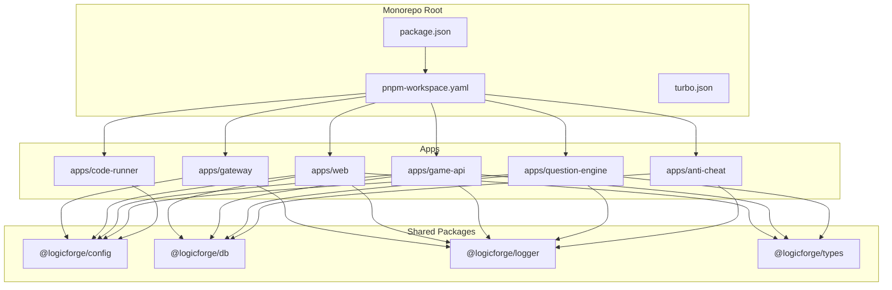
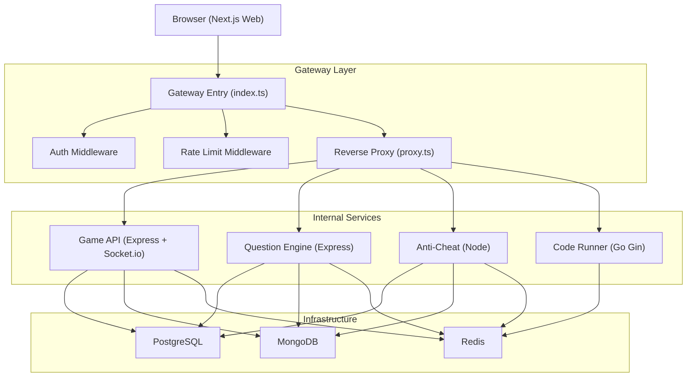
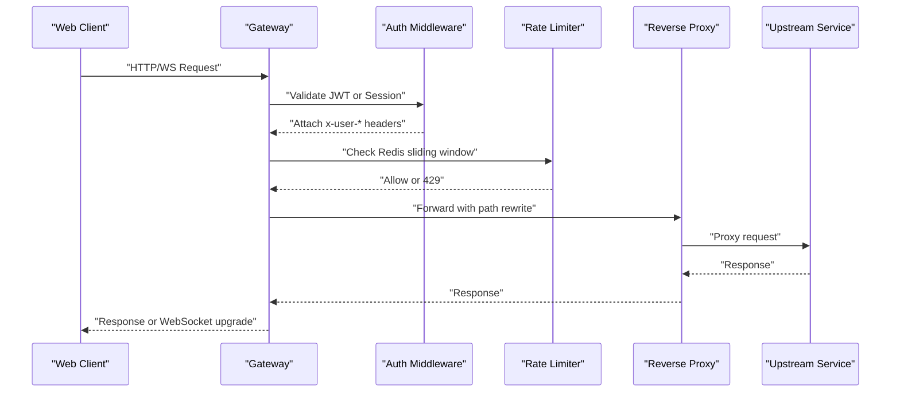
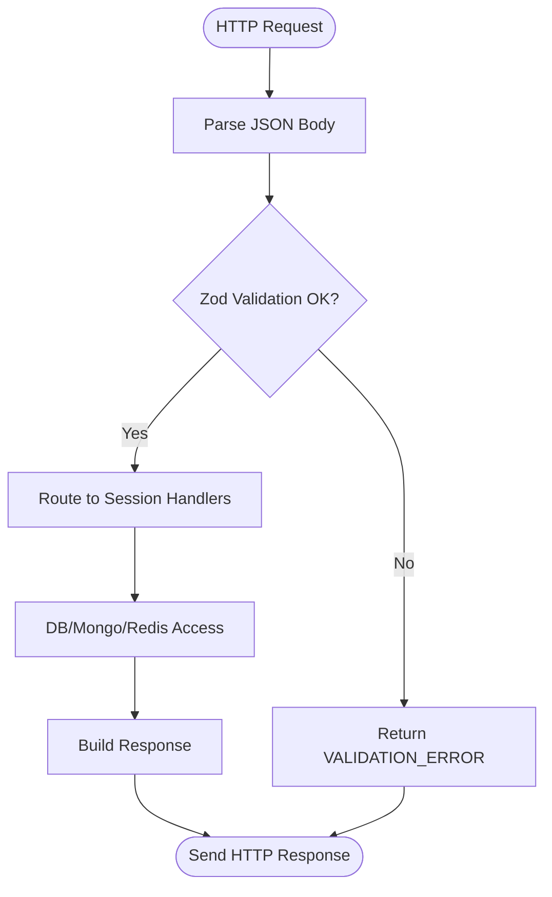
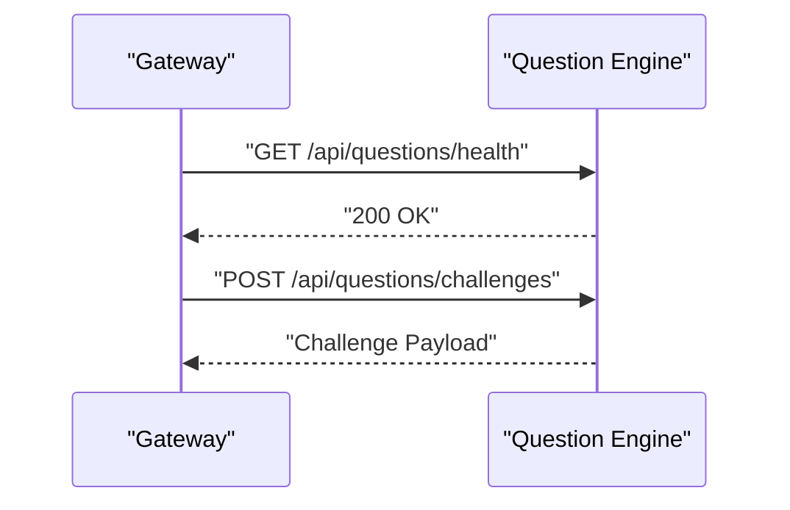
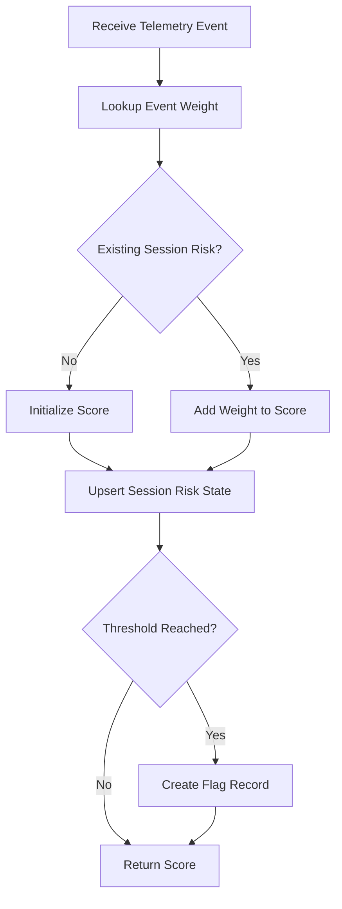
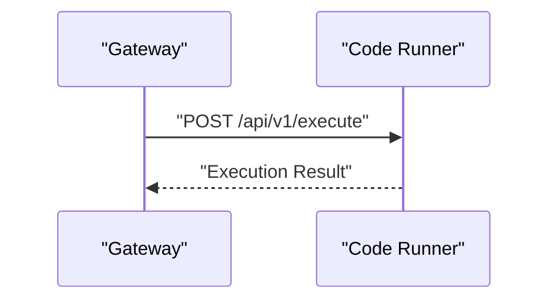
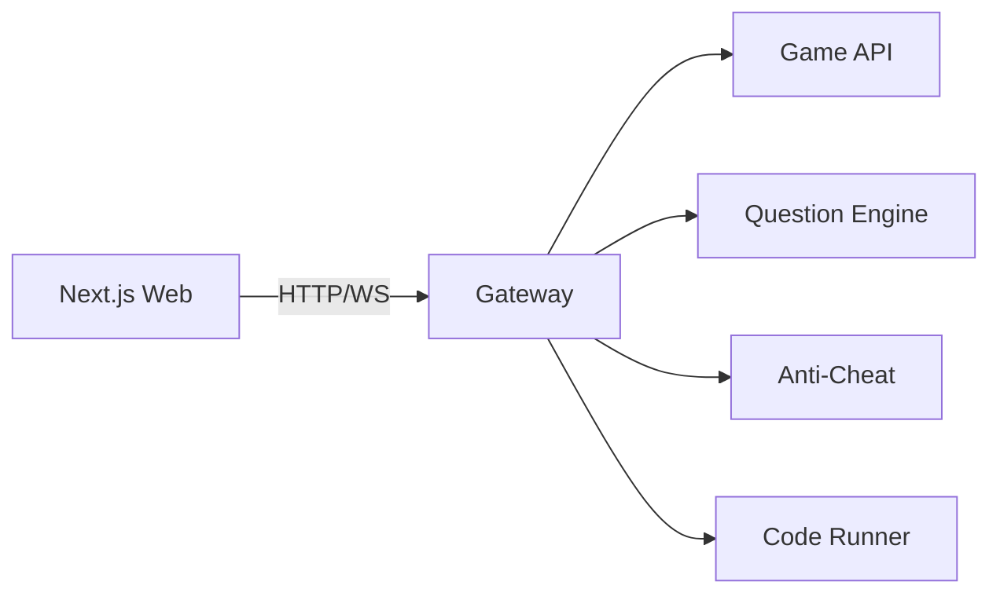
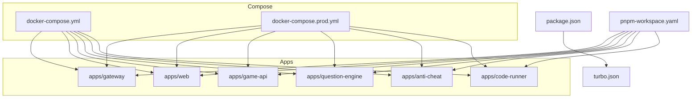

# Architecture & Design

<cite>
**Referenced Files in This Document**
- [package.json](file://package.json)
- [pnpm-workspace.yaml](file://pnpm-workspace.yaml)
- [turbo.json](file://turbo.json)
- [docker-compose.yml](file://docker-compose.yml)
- [docker-compose.prod.yml](file://docker-compose.prod.yml)
- [apps/gateway/src/index.ts](file://apps/gateway/src/index.ts)
- [apps/gateway/src/proxy.ts](file://apps/gateway/src/proxy.ts)
- [apps/gateway/src/middleware/auth.ts](file://apps/gateway/src/middleware/auth.ts)
- [apps/gateway/src/middleware/rate-limit.ts](file://apps/gateway/src/middleware/rate-limit.ts)
- [apps/gateway/src/redis.ts](file://apps/gateway/src/redis.ts)
- [apps/game-api/src/app.ts](file://apps/game-api/src/app.ts)
- [apps/question-engine/src/routes/index.ts](file://apps/question-engine/src/routes/index.ts)
- [apps/anti-cheat/src/services/risk-scoring.service.ts](file://apps/anti-cheat/src/services/risk-scoring.service.ts)
- [apps/code-runner/cmd/server/main.go](file://apps/code-runner/cmd/server/main.go)
- [apps/web/next.config.mjs](file://apps/web/next.config.mjs)
- [apps/web/package.json](file://apps/web/package.json)
- [apps/game-api/package.json](file://apps/game-api/package.json)
</cite>

## Table of Contents
1. [Introduction](#introduction)
2. [Project Structure](#project-structure)
3. [Core Components](#core-components)
4. [Architecture Overview](#architecture-overview)
5. [Detailed Component Analysis](#detailed-component-analysis)
6. [Dependency Analysis](#dependency-analysis)
7. [Performance Considerations](#performance-considerations)
8. [Troubleshooting Guide](#troubleshooting-guide)
9. [Conclusion](#conclusion)
10. [Appendices](#appendices)

## Introduction
This document describes the architecture and design of Logic Forge’s microservices platform. It explains high-level design patterns, service boundaries, inter-service communication, and data flow architecture. It documents the monorepo structure using Turborepo and pnpm workspaces, the API gateway pattern, service discovery and load balancing strategies, containerization via Docker and Docker Compose, infrastructure requirements, scalability considerations, deployment topology, technology stack choices, and cross-cutting concerns such as security, monitoring, and disaster recovery.

## Project Structure
Logic Forge follows a monorepo approach with:
- A shared package manager (pnpm) and workspace configuration
- A task orchestrator (Turborepo) coordinating builds, dev, lint, and test tasks
- Multiple applications (services) under apps/, each with its own Dockerfile and runtime
- Shared packages under packages/ (e.g., config, db, logger, types)

**Diagram sources**
- [package.json](file://package.json#L1-L22)
- [pnpm-workspace.yaml](file://pnpm-workspace.yaml#L1-L3)
- [turbo.json](file://turbo.json#L1-L45)

**Section sources**
- [package.json](file://package.json#L1-L22)
- [pnpm-workspace.yaml](file://pnpm-workspace.yaml#L1-L3)
- [turbo.json](file://turbo.json#L1-L45)

## Core Components
- API Gateway: Central entry point for client traffic, enforcing auth, rate limiting, and proxying to backend services. Supports HTTP and WebSocket upgrades.
- Game API: HTTP + WebSocket service handling game session orchestration and real-time updates.
- Question Engine: Challenge and quiz engine with health and challenge endpoints.
- Anti-Cheat: Risk scoring and telemetry aggregation for session integrity.
- Code Runner: Secure execution endpoint for candidate code submissions.
- Web Frontend: Next.js application acting as the primary client, communicating via the gateway.

**Section sources**
- [apps/gateway/src/index.ts](file://apps/gateway/src/index.ts#L1-L117)
- [apps/gateway/src/proxy.ts](file://apps/gateway/src/proxy.ts#L1-L78)
- [apps/gateway/src/middleware/auth.ts](file://apps/gateway/src/middleware/auth.ts#L1-L65)
- [apps/gateway/src/middleware/rate-limit.ts](file://apps/gateway/src/middleware/rate-limit.ts#L1-L80)
- [apps/game-api/src/app.ts](file://apps/game-api/src/app.ts#L1-L63)
- [apps/question-engine/src/routes/index.ts](file://apps/question-engine/src/routes/index.ts#L1-L11)
- [apps/anti-cheat/src/services/risk-scoring.service.ts](file://apps/anti-cheat/src/services/risk-scoring.service.ts#L1-L76)
- [apps/code-runner/cmd/server/main.go](file://apps/code-runner/cmd/server/main.go#L1-L39)
- [apps/web/next.config.mjs](file://apps/web/next.config.mjs#L1-L32)

## Architecture Overview
The system uses an API gateway pattern to consolidate entry points, enforce security and rate limits, and route requests to appropriate services. Services communicate internally via named Docker services and environment variables. The frontend communicates with the gateway, which proxies to backend services.

**Diagram sources**
- [apps/gateway/src/index.ts](file://apps/gateway/src/index.ts#L1-L117)
- [apps/gateway/src/proxy.ts](file://apps/gateway/src/proxy.ts#L1-L78)
- [apps/gateway/src/middleware/auth.ts](file://apps/gateway/src/middleware/auth.ts#L1-L65)
- [apps/gateway/src/middleware/rate-limit.ts](file://apps/gateway/src/middleware/rate-limit.ts#L1-L80)
- [apps/game-api/src/app.ts](file://apps/game-api/src/app.ts#L1-L63)
- [docker-compose.yml](file://docker-compose.yml#L1-L238)

## Detailed Component Analysis

### API Gateway
The gateway is the single entry point for clients. It:
- Enforces security headers, CORS, and cookie parsing
- Authenticates requests using JWT or session cookies
- Applies rate limiting using Redis sliding-window
- Proxies HTTP and WebSocket traffic to backend services
- Provides a health endpoint and graceful shutdown handling

**Diagram sources**
- [apps/gateway/src/index.ts](file://apps/gateway/src/index.ts#L1-L117)
- [apps/gateway/src/middleware/auth.ts](file://apps/gateway/src/middleware/auth.ts#L1-L65)
- [apps/gateway/src/middleware/rate-limit.ts](file://apps/gateway/src/middleware/rate-limit.ts#L1-L80)
- [apps/gateway/src/proxy.ts](file://apps/gateway/src/proxy.ts#L1-L78)

**Section sources**
- [apps/gateway/src/index.ts](file://apps/gateway/src/index.ts#L1-L117)
- [apps/gateway/src/middleware/auth.ts](file://apps/gateway/src/middleware/auth.ts#L1-L65)
- [apps/gateway/src/middleware/rate-limit.ts](file://apps/gateway/src/middleware/rate-limit.ts#L1-L80)
- [apps/gateway/src/proxy.ts](file://apps/gateway/src/proxy.ts#L1-L78)

### Game API
The Game API provides:
- HTTP endpoints for sessions and health checks
- CORS configured to the frontend origin
- JSON request parsing and robust error handling
- Integration with shared config, logger, and types

**Diagram sources**
- [apps/game-api/src/app.ts](file://apps/game-api/src/app.ts#L1-L63)

**Section sources**
- [apps/game-api/src/app.ts](file://apps/game-api/src/app.ts#L1-L63)

### Question Engine
The Question Engine exposes:
- Health and challenges routes
- Uses shared packages for config, database, logging, and types

**Diagram sources**
- [apps/question-engine/src/routes/index.ts](file://apps/question-engine/src/routes/index.ts#L1-L11)

**Section sources**
- [apps/question-engine/src/routes/index.ts](file://apps/question-engine/src/routes/index.ts#L1-L11)

### Anti-Cheat Service
The Anti-Cheat service computes risk scores based on telemetry events and persists state to the database. It defines weights and thresholds for event types and upserts risk state and flags.

**Diagram sources**
- [apps/anti-cheat/src/services/risk-scoring.service.ts](file://apps/anti-cheat/src/services/risk-scoring.service.ts#L1-L76)

**Section sources**
- [apps/anti-cheat/src/services/risk-scoring.service.ts](file://apps/anti-cheat/src/services/risk-scoring.service.ts#L1-L76)

### Code Runner Service
The Code Runner service exposes a secure execution endpoint implemented in Go. It runs in release mode and listens on a configurable port.

**Diagram sources**
- [apps/code-runner/cmd/server/main.go](file://apps/code-runner/cmd/server/main.go#L1-L39)

**Section sources**
- [apps/code-runner/cmd/server/main.go](file://apps/code-runner/cmd/server/main.go#L1-L39)

### Web Frontend
The Next.js application is built as a standalone output and transpiles shared packages. It communicates with the gateway and supports external image hosts.

**Diagram sources**
- [apps/web/next.config.mjs](file://apps/web/next.config.mjs#L1-L32)
- [apps/web/package.json](file://apps/web/package.json#L1-L116)

**Section sources**
- [apps/web/next.config.mjs](file://apps/web/next.config.mjs#L1-L32)
- [apps/web/package.json](file://apps/web/package.json#L1-L116)

## Dependency Analysis
- Monorepo tooling: Turborepo orchestrates tasks across apps and packages; pnpm manages workspaces.
- Runtime dependencies: Services depend on shared packages for configuration, database, logging, and types.
- Containerization: Docker Compose defines services, networks, volumes, and environment variables for local development and production.

**Diagram sources**
- [turbo.json](file://turbo.json#L1-L45)
- [package.json](file://package.json#L1-L22)
- [pnpm-workspace.yaml](file://pnpm-workspace.yaml#L1-L3)
- [docker-compose.yml](file://docker-compose.yml#L1-L238)
- [docker-compose.prod.yml](file://docker-compose.prod.yml#L1-L143)

**Section sources**
- [turbo.json](file://turbo.json#L1-L45)
- [package.json](file://package.json#L1-L22)
- [pnpm-workspace.yaml](file://pnpm-workspace.yaml#L1-L3)
- [docker-compose.yml](file://docker-compose.yml#L1-L238)
- [docker-compose.prod.yml](file://docker-compose.prod.yml#L1-L143)

## Performance Considerations
- Build and Dev Orchestration: Turborepo caches outputs and parallelizes tasks across apps, reducing rebuild times and improving developer velocity.
- Container Startup Order: Compose enforces health checks and depends_on conditions to ensure dependent services start after their prerequisites.
- Gateway Rate Limits: Redis-backed sliding-window rate limiting protects backend services from abuse while failing open on Redis errors.
- WebSocket Handling: The gateway supports WebSocket upgrades for real-time features, minimizing latency for interactive gameplay.
- Image Optimization: The web app restricts remote images to trusted hosts to reduce bandwidth and improve performance.

[No sources needed since this section provides general guidance]

## Troubleshooting Guide
- Gateway Health: Verify the gateway health endpoint responds with a 200 status.
- Proxy Errors: The gateway logs proxy errors and returns a standardized Bad Gateway response when upstream services fail.
- Rate Limit Failures: If rate-limited, inspect X-RateLimit headers and Redis connectivity; the limiter fails open when Redis is unavailable.
- Service Dependencies: Confirm dependent services are healthy before starting dependent services in Compose.
- Environment Variables: Ensure DATABASE_URL, MONGO_URL, REDIS_URL, and secrets are correctly set for each service.

**Section sources**
- [apps/gateway/src/index.ts](file://apps/gateway/src/index.ts#L44-L81)
- [apps/gateway/src/proxy.ts](file://apps/gateway/src/proxy.ts#L29-L38)
- [apps/gateway/src/middleware/rate-limit.ts](file://apps/gateway/src/middleware/rate-limit.ts#L25-L33)

## Conclusion
Logic Forge employs a clear API gateway pattern, well-defined service boundaries, and a cohesive monorepo managed by Turborepo and pnpm. The gateway centralizes security, rate limiting, and routing, while services remain cohesive around domain capabilities. Docker Compose streamlines local development and provides a blueprint for production deployments. Shared packages promote consistency and reduce duplication. Cross-cutting concerns like security, rate limiting, and observability are integrated at the gateway and service layers.

[No sources needed since this section summarizes without analyzing specific files]

## Appendices

### Technology Stack Choices and Trade-offs
- Gateway: Express + http-proxy-middleware for simplicity and proven compatibility; Redis for rate limiting; Helmet/CORS for security.
- Game API: Express + Socket.io for real-time sessions; Zod for validation; shared logger/config/types.
- Question Engine: Express with modular routes; shared packages for consistency.
- Anti-Cheat: Node service with database upserts; configurable weights and thresholds.
- Code Runner: Go Gin for performance and safety in execution; release mode for production.
- Web: Next.js with standalone output; transpilation of shared packages; externalized heavy dependencies for server builds.

**Section sources**
- [apps/gateway/src/index.ts](file://apps/gateway/src/index.ts#L1-L117)
- [apps/game-api/src/app.ts](file://apps/game-api/src/app.ts#L1-L63)
- [apps/question-engine/src/routes/index.ts](file://apps/question-engine/src/routes/index.ts#L1-L11)
- [apps/anti-cheat/src/services/risk-scoring.service.ts](file://apps/anti-cheat/src/services/risk-scoring.service.ts#L1-L76)
- [apps/code-runner/cmd/server/main.go](file://apps/code-runner/cmd/server/main.go#L1-L39)
- [apps/web/next.config.mjs](file://apps/web/next.config.mjs#L1-L32)

### Infrastructure Requirements
- Databases: PostgreSQL for relational data, MongoDB for auth-related collections.
- Cache: Redis for rate limiting and session caching.
- Networking: Separate public and internal Docker networks; health checks for all services.
- Secrets: Environment variables for database URLs, auth secrets, and inter-service tokens.

**Section sources**
- [docker-compose.yml](file://docker-compose.yml#L1-L238)
- [docker-compose.prod.yml](file://docker-compose.prod.yml#L1-L143)

### Deployment Topology
- Local Development: docker-compose.yml defines services, networks, volumes, and environment variables for local iteration.
- Production: docker-compose.prod.yml sets production flags, restart policies, and health checks; services depend on each other and external databases.

**Section sources**
- [docker-compose.yml](file://docker-compose.yml#L1-L238)
- [docker-compose.prod.yml](file://docker-compose.prod.yml#L1-L143)

### Security, Monitoring, and Disaster Recovery
- Security:
  - JWT-based authentication with bearer tokens and session cookies.
  - Helmet and CORS hardening at gateway and services.
  - Inter-service secret for internal endpoints.
- Monitoring:
  - Health endpoints on all services.
  - Centralized logging via shared logger package.
  - Redis metrics for rate limiting visibility.
- Disaster Recovery:
  - Persistent volumes for databases and Redis.
  - Health checks and restart policies in Compose.
  - Standalone output for the web app to simplify deployment.

**Section sources**
- [apps/gateway/src/middleware/auth.ts](file://apps/gateway/src/middleware/auth.ts#L1-L65)
- [apps/gateway/src/middleware/rate-limit.ts](file://apps/gateway/src/middleware/rate-limit.ts#L1-L80)
- [apps/gateway/src/index.ts](file://apps/gateway/src/index.ts#L1-L117)
- [docker-compose.yml](file://docker-compose.yml#L1-L238)
- [docker-compose.prod.yml](file://docker-compose.prod.yml#L1-L143)