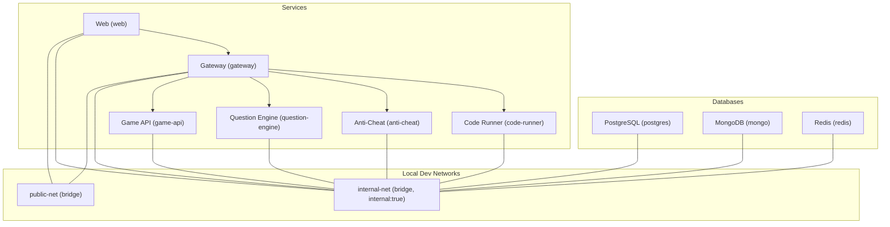
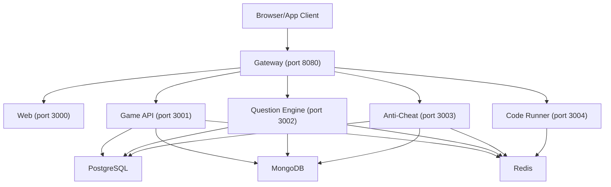
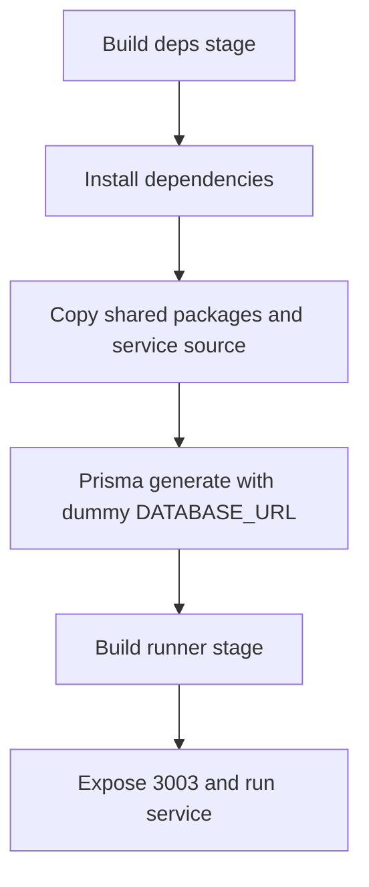
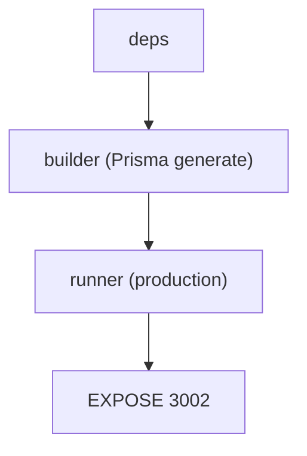
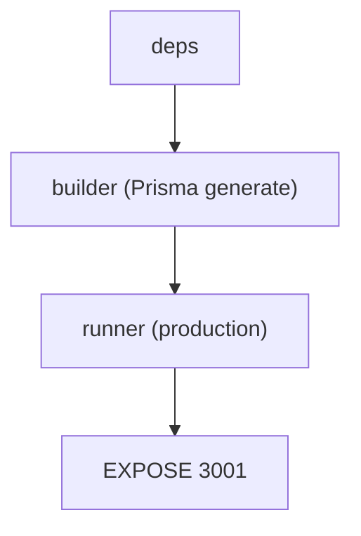
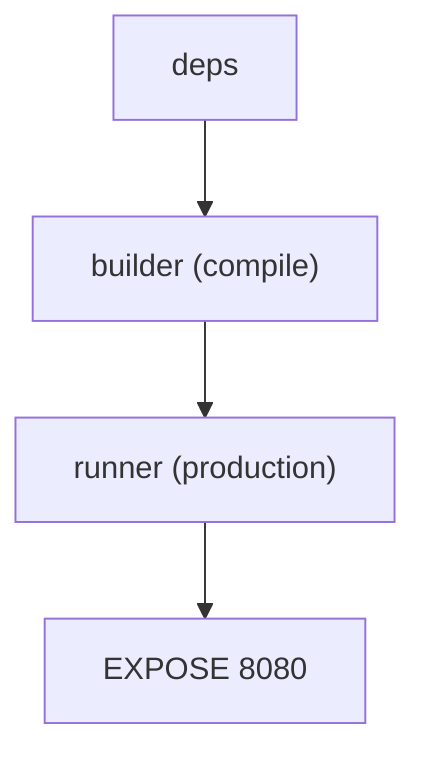
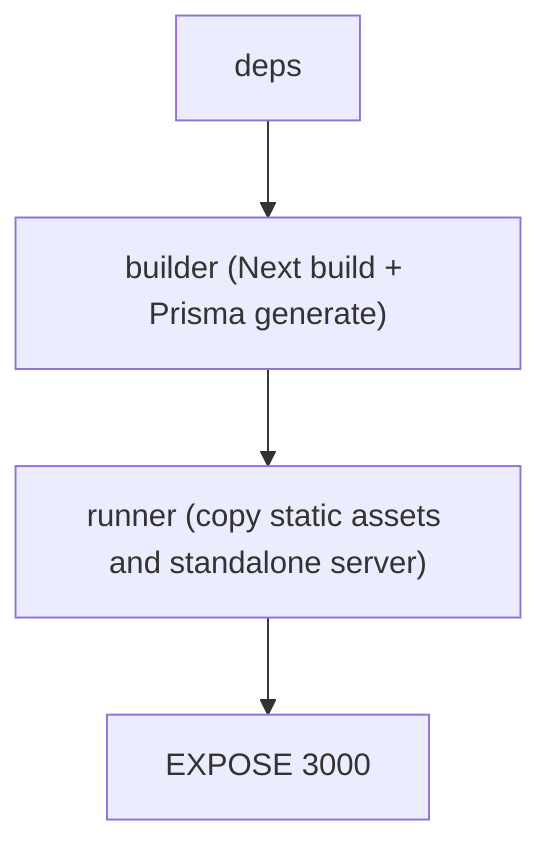
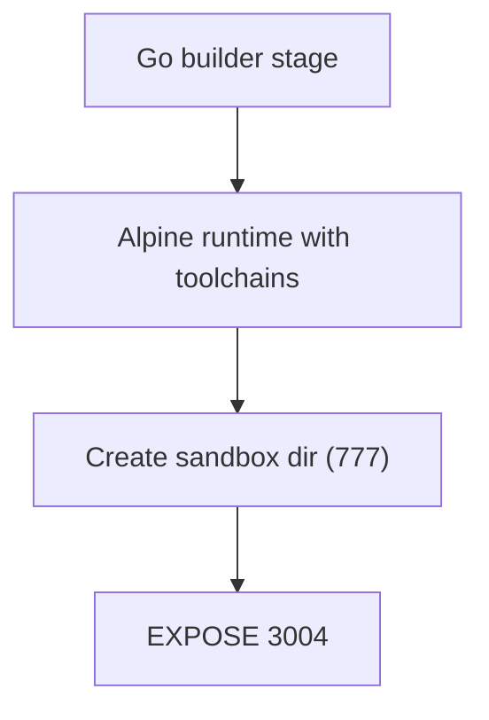
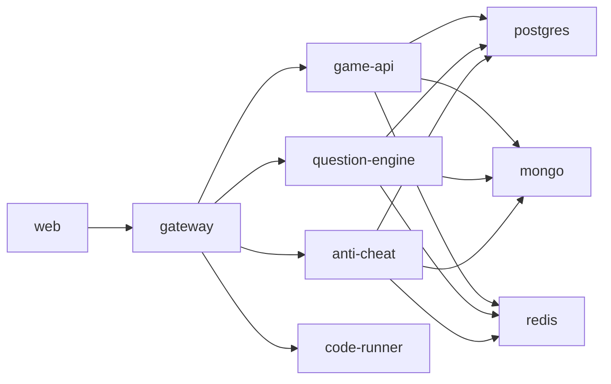

# Containerization & Deployment

<cite>
**Referenced Files in This Document**
- [docker-compose.yml](file://docker-compose.yml)
- [docker-compose.prod.yml](file://docker-compose.prod.yml)
- [.dockerignore](file://.dockerignore)
- [apps/anti-cheat/Dockerfile](file://apps/anti-cheat/Dockerfile)
- [apps/code-runner/Dockerfile](file://apps/code-runner/Dockerfile)
- [apps/game-api/Dockerfile](file://apps/game-api/Dockerfile)
- [apps/gateway/Dockerfile](file://apps/gateway/Dockerfile)
- [apps/question-engine/Dockerfile](file://apps/question-engine/Dockerfile)
- [apps/web/Dockerfile](file://apps/web/Dockerfile)
- [.github/workflows/ci.yml](file://.github/workflows/ci.yml)
- [.github/workflows/deploy.yml](file://.github/workflows/deploy.yml)
- [.env.example](file://.env.example)
- [apps/anti-cheat/.env.example](file://apps/anti-cheat/.env.example)
- [apps/game-api/.env.example](file://apps/game-api/.env.example)
- [apps/web/.env.example](file://apps/web/.env.example)
</cite>

## Table of Contents
1. [Introduction](#introduction)
2. [Project Structure](#project-structure)
3. [Core Components](#core-components)
4. [Architecture Overview](#architecture-overview)
5. [Detailed Component Analysis](#detailed-component-analysis)
6. [Dependency Analysis](#dependency-analysis)
7. [Performance Considerations](#performance-considerations)
8. [Troubleshooting Guide](#troubleshooting-guide)
9. [Conclusion](#conclusion)
10. [Appendices](#appendices)

## Introduction
This document explains Logic Forge’s containerization and deployment strategy. It covers multi-stage Docker builds for each service, Docker Compose configurations for local development and production, networking and volume management, environment-specific settings, and operational practices for building, running, scaling, and securing the system. It also provides troubleshooting guidance for common containerization issues.

## Project Structure
Logic Forge is a monorepo with multiple services packaged as Docker images and orchestrated via Docker Compose. The repository defines:
- A development stack with dedicated networks for internal and public exposure
- Persistent volumes for databases and cache
- Multi-stage builds per service to minimize attack surface and image size
- A production Compose variant optimized for runtime stability and restart policies

**Diagram sources**
- [docker-compose.yml](file://docker-compose.yml#L1-L238)

**Section sources**
- [docker-compose.yml](file://docker-compose.yml#L1-L238)

## Core Components
This section documents each service’s containerization approach, including build stages, runtime configuration, exposed ports, and inter-service dependencies.

- Anti-Cheat Service
  - Multi-stage build: deps → builder → runner
  - Uses a dummy database URL during Prisma generation at build time
  - Exposes port 3003
  - Depends on PostgreSQL, Redis, and MongoDB (via health conditions)
  - Health check endpoint exists

- Question Engine
  - Multi-stage build mirroring Anti-Cheat
  - Prisma generation with dummy DATABASE_URL
  - Exposes port 3002
  - Depends on MongoDB and Redis (healthy)
  - Health check configured

- Game API
  - Multi-stage build with Prisma generation
  - Exposes port 3001
  - Depends on PostgreSQL, Redis, and Question Engine (healthy)
  - Health check configured

- API Gateway
  - Multi-stage build with compiled output
  - Exposes port 8080
  - Depends on Game API, Question Engine, Anti-Cheat, Code Runner, and Redis (healthy)
  - Bridges public and internal networks

- Web Frontend (Next.js)
  - Multi-stage build with standalone output and Prisma binaries copied
  - Exposes port 3000
  - Depends on Gateway and databases
  - Health check configured

- Code Runner (Go sandbox)
  - Multi-stage build: Go builder → Alpine runtime with language toolchains
  - Installs Python, JDK, G++, Bash
  - Exposes port 3004
  - Sandboxed execution environment

**Section sources**
- [apps/anti-cheat/Dockerfile](file://apps/anti-cheat/Dockerfile#L1-L53)
- [apps/question-engine/Dockerfile](file://apps/question-engine/Dockerfile#L1-L56)
- [apps/game-api/Dockerfile](file://apps/game-api/Dockerfile#L1-L56)
- [apps/gateway/Dockerfile](file://apps/gateway/Dockerfile#L1-L55)
- [apps/web/Dockerfile](file://apps/web/Dockerfile#L1-L59)
- [apps/code-runner/Dockerfile](file://apps/code-runner/Dockerfile#L1-L31)

## Architecture Overview
The system uses two Docker networks:
- public-net: Bridge network for external exposure (ports mapped)
- internal-net: Bridge network marked internal for service-to-service traffic

Volumes persist database and cache data across container restarts. Services communicate using DNS names within the Compose project, enabling secure, isolated inter-service calls.

**Diagram sources**
- [docker-compose.yml](file://docker-compose.yml#L1-L238)

## Detailed Component Analysis

### Anti-Cheat Service
- Build stages:
  - deps: copies workspace manifests and installs dependencies
  - builder: copies shared packages and service source, generates Prisma schema with a dummy DATABASE_URL
  - runner: sets production environment and starts the service
- Ports: 3003
- Health checks: service-specific endpoint
- Dependencies: PostgreSQL, MongoDB, Redis (healthy)

**Diagram sources**
- [apps/anti-cheat/Dockerfile](file://apps/anti-cheat/Dockerfile#L1-L53)

**Section sources**
- [apps/anti-cheat/Dockerfile](file://apps/anti-cheat/Dockerfile#L1-L53)
- [docker-compose.yml](file://docker-compose.yml#L91-L118)

### Question Engine
- Build stages mirror Anti-Cheat
- Exposes port 3002
- Health checks enabled

**Diagram sources**
- [apps/question-engine/Dockerfile](file://apps/question-engine/Dockerfile#L1-L56)

**Section sources**
- [apps/question-engine/Dockerfile](file://apps/question-engine/Dockerfile#L1-L56)
- [docker-compose.yml](file://docker-compose.yml#L63-L89)

### Game API
- Multi-stage build with Prisma generation
- Exposes port 3001
- Depends on Question Engine and other services

**Diagram sources**
- [apps/game-api/Dockerfile](file://apps/game-api/Dockerfile#L1-L56)

**Section sources**
- [apps/game-api/Dockerfile](file://apps/game-api/Dockerfile#L1-L56)
- [docker-compose.yml](file://docker-compose.yml#L119-L156)

### API Gateway
- Multi-stage build with compiled output
- Exposes port 8080
- Bridges public and internal networks

**Diagram sources**
- [apps/gateway/Dockerfile](file://apps/gateway/Dockerfile#L1-L55)

**Section sources**
- [apps/gateway/Dockerfile](file://apps/gateway/Dockerfile#L1-L55)
- [docker-compose.yml](file://docker-compose.yml#L157-L189)

### Web Frontend (Next.js)
- Multi-stage build with standalone server and Prisma binaries
- Exposes port 3000
- Depends on Gateway and databases

**Diagram sources**
- [apps/web/Dockerfile](file://apps/web/Dockerfile#L1-L59)

**Section sources**
- [apps/web/Dockerfile](file://apps/web/Dockerfile#L1-L59)
- [docker-compose.yml](file://docker-compose.yml#L190-L226)

### Code Runner (Go Sandbox)
- Multi-stage build: Go builder → Alpine runtime
- Installs Python, JDK, G++, Bash
- Exposes port 3004
- Creates a sandbox directory with restricted permissions

**Diagram sources**
- [apps/code-runner/Dockerfile](file://apps/code-runner/Dockerfile#L1-L31)

**Section sources**
- [apps/code-runner/Dockerfile](file://apps/code-runner/Dockerfile#L1-L31)
- [docker-compose.yml](file://docker-compose.yml#L51-L62)

## Dependency Analysis
Inter-service dependencies are defined in Compose with health and startup conditions:
- Web depends on Gateway and databases
- Gateway depends on Game API, Question Engine, Anti-Cheat, Code Runner, and Redis
- Game API depends on PostgreSQL, Redis, and Question Engine
- Question Engine and Anti-Cheat depend on MongoDB and Redis
- Code Runner is a peer service for sandbox execution

**Diagram sources**
- [docker-compose.yml](file://docker-compose.yml#L1-L238)

**Section sources**
- [docker-compose.yml](file://docker-compose.yml#L1-L238)

## Performance Considerations
- Multi-stage builds reduce final image size and attack surface.
- Alpine Linux is used across services to keep images small.
- Prisma binaries are copied into the Next.js runtime to avoid runtime compilation overhead.
- Health checks and restart policies improve resilience in production.
- Use separate networks to limit unnecessary exposure and reduce latency.

[No sources needed since this section provides general guidance]

## Troubleshooting Guide
Common issues and resolutions:

- Service fails to start due to missing environment variables
  - Ensure environment variables are present in the Compose file or .env file.
  - Verify service-specific .env.example files and populate required values.

- Health checks fail
  - Confirm health check endpoints are reachable inside the container.
  - Adjust intervals and start periods if services take longer to boot.

- Database connectivity errors
  - Verify DATABASE_URL, MONGO_URL, and REDIS_URL match the Compose network DNS names.
  - Confirm dependent services are healthy before starting dependent services.

- Port conflicts on host
  - Change published ports in Compose to avoid conflicts with existing processes.

- Prisma generation failures during build
  - Ensure a dummy DATABASE_URL is set during build to satisfy Prisma generation.

- Production deployment issues
  - Use docker-compose.prod.yml and ensure environment variables are loaded via an environment file.
  - Confirm restart policies and health checks are active.

**Section sources**
- [docker-compose.yml](file://docker-compose.yml#L1-L238)
- [docker-compose.prod.yml](file://docker-compose.prod.yml#L1-L143)
- [.env.example](file://.env.example#L1-L62)
- [apps/anti-cheat/.env.example](file://apps/anti-cheat/.env.example#L1-L3)
- [apps/game-api/.env.example](file://apps/game-api/.env.example#L1-L4)
- [apps/web/.env.example](file://apps/web/.env.example#L1-L17)

## Conclusion
Logic Forge’s containerization strategy leverages multi-stage Docker builds, isolated networks, persistent volumes, and health checks to deliver a robust, scalable, and secure deployment model. The development and production Compose configurations support local iteration and reliable production deployments, while the CI/CD workflow automates secure deployments to target infrastructure.

[No sources needed since this section summarizes without analyzing specific files]

## Appendices

### Building, Running, and Scaling Containers
- Local development
  - Use the default Compose file to build and start all services.
  - Access the web app at http://localhost:3000 and the gateway at http://localhost:8080.

- Production deployment
  - Use the production Compose file and supply environment variables via an environment file.
  - The CI/CD workflow demonstrates automated deployment to a remote host.

- Scaling
  - Scale services horizontally by specifying replica counts in Compose.
  - Ensure stateful services (PostgreSQL, MongoDB, Redis) are managed externally or use appropriate persistence and clustering.

**Section sources**
- [docker-compose.yml](file://docker-compose.yml#L1-L238)
- [docker-compose.prod.yml](file://docker-compose.prod.yml#L1-L143)
- [.github/workflows/deploy.yml](file://.github/workflows/deploy.yml#L31-L66)

### Security Best Practices
- Use multi-stage builds to minimize attack surface.
- Run non-root where feasible and drop unnecessary capabilities.
- Restrict network exposure by keeping internal services on internal-net.
- Rotate secrets regularly and avoid committing sensitive data to repositories.
- Use health checks and restart policies to maintain service availability.
- Limit host filesystem access and mount only necessary volumes.

**Section sources**
- [apps/code-runner/Dockerfile](file://apps/code-runner/Dockerfile#L25-L26)
- [apps/web/Dockerfile](file://apps/web/Dockerfile#L54-L55)
- [docker-compose.yml](file://docker-compose.yml#L233-L238)

### Monitoring Approaches
- Enable health checks for all services.
- Use container logs and metrics collection for runtime observability.
- Monitor gateway and web endpoints for uptime and response times.
- Track database and cache health via their respective health checks.

**Section sources**
- [docker-compose.yml](file://docker-compose.yml#L14-L18)
- [docker-compose.yml](file://docker-compose.yml#L31-L35)
- [docker-compose.yml](file://docker-compose.yml#L45-L49)
- [docker-compose.yml](file://docker-compose.yml#L84-L89)
- [docker-compose.yml](file://docker-compose.yml#L112-L117)
- [docker-compose.yml](file://docker-compose.yml#L150-L155)

### Environment-Specific Settings
- Development
  - Uses development NODE_ENV and localhost URLs for services.
  - Ports are mapped for local access.

- Production
  - Uses production NODE_ENV and environment variables loaded from an environment file.
  - Health checks and restart policies are enabled.

**Section sources**
- [docker-compose.yml](file://docker-compose.yml#L57-L76)
- [docker-compose.yml](file://docker-compose.yml#L125-L136)
- [docker-compose.yml](file://docker-compose.yml#L199-L217)
- [docker-compose.prod.yml](file://docker-compose.prod.yml#L7-L24)
- [docker-compose.prod.yml](file://docker-compose.prod.yml#L62-L73)
- [docker-compose.prod.yml](file://docker-compose.prod.yml#L122-L138)

### CI/CD Automation
- CI job validates typechecks and linting for key services.
- CD job deploys to a remote EC2 instance via SSH, pulls latest code, rebuilds and starts services, performs health checks, and prunes unused images.

**Section sources**
- [.github/workflows/ci.yml](file://.github/workflows/ci.yml#L1-L33)
- [.github/workflows/deploy.yml](file://.github/workflows/deploy.yml#L1-L66)