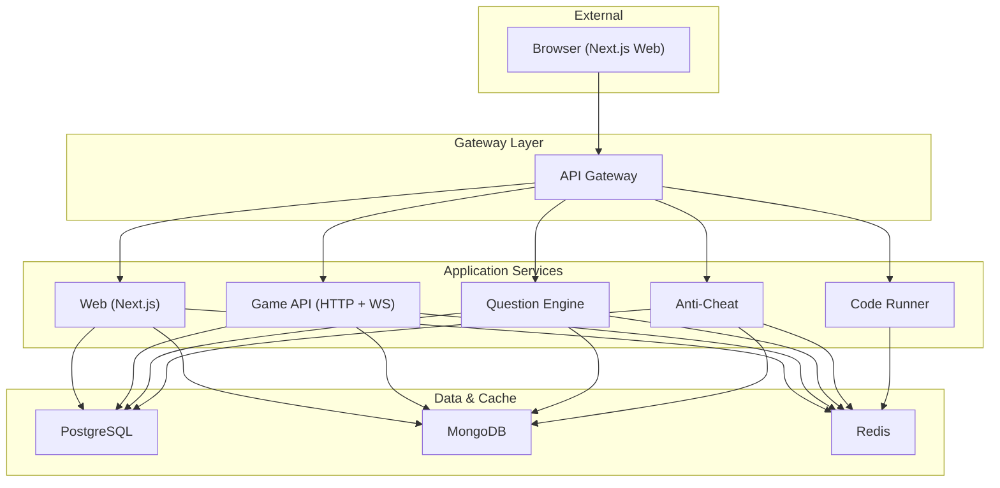
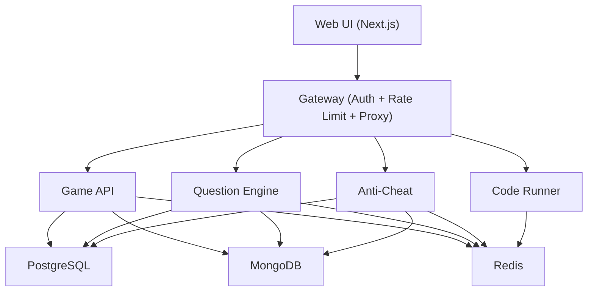
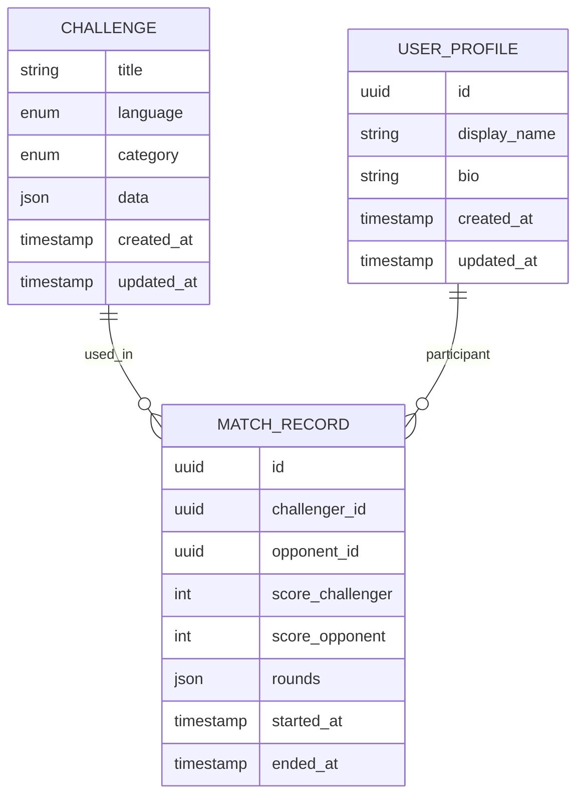
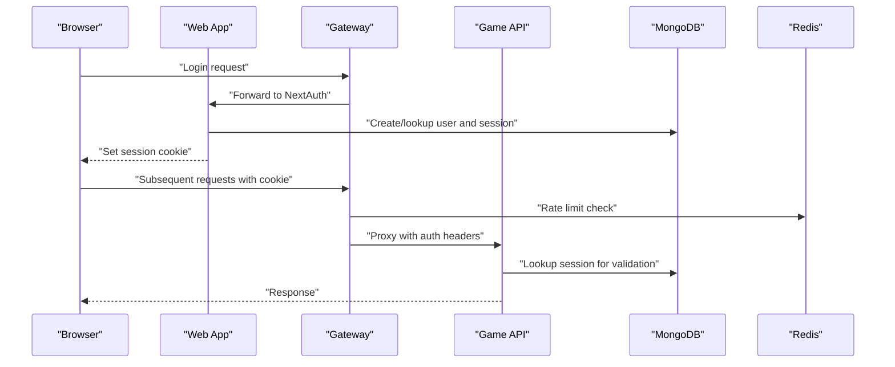
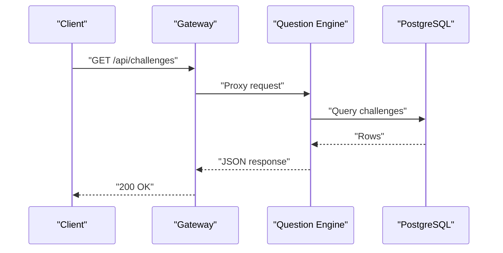
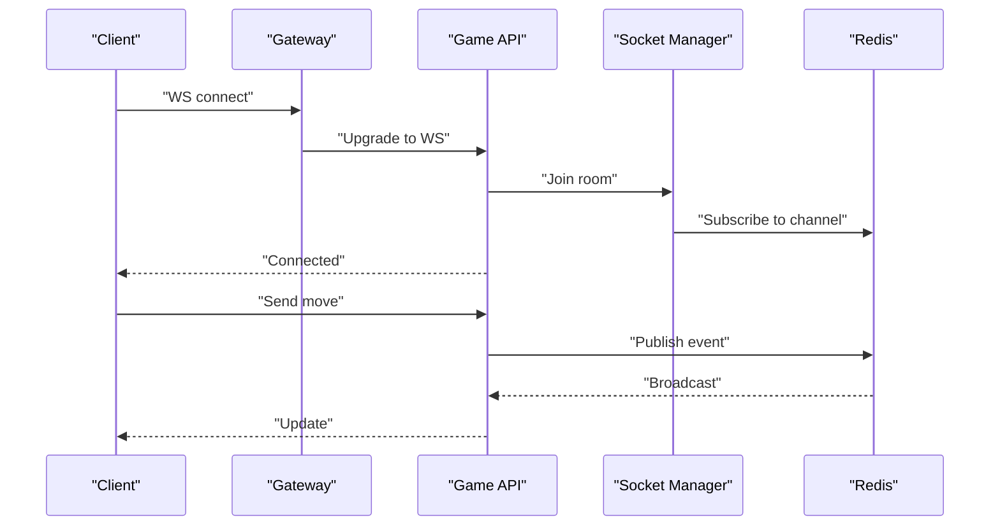
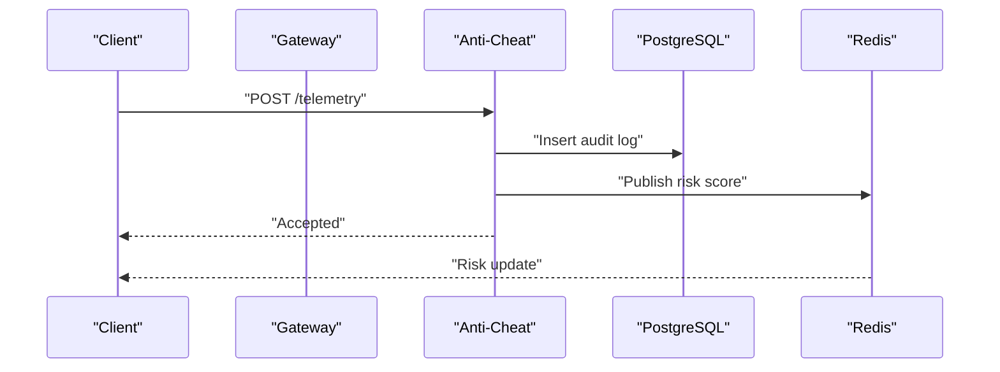
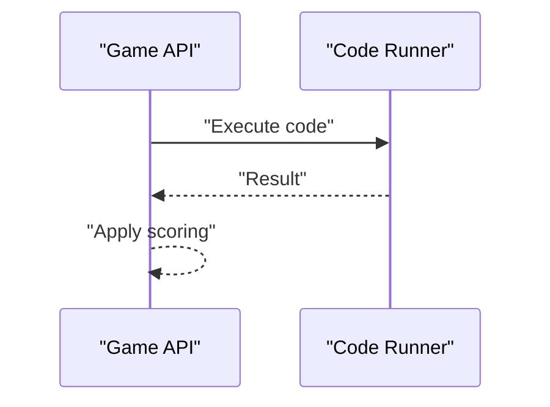
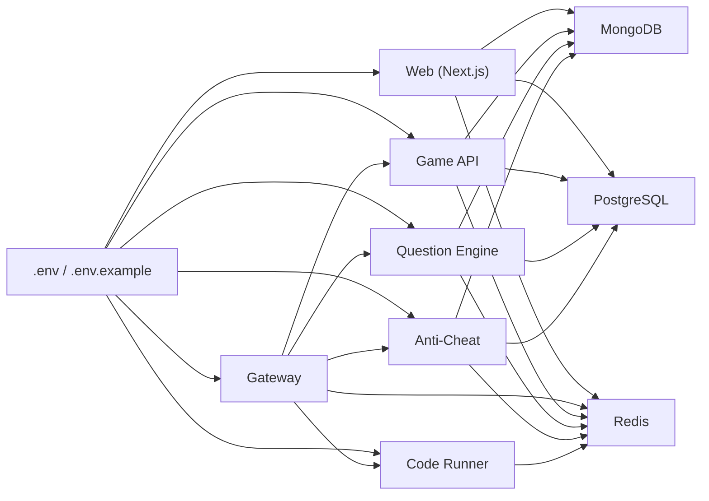

# Infrastructure & Data Flow

<cite>
**Referenced Files in This Document**
- [docker-compose.yml](file://docker-compose.yml)
- [docker-compose.prod.yml](file://docker-compose.prod.yml)
- [.env](file://.env)
- [.env.example](file://.env.example)
- [packages/db/src/index.ts](file://packages/db/src/index.ts)
- [packages/db/src/mongoose-auth.ts](file://packages/db/src/mongoose-auth.ts)
- [packages/db/prisma.config.ts](file://packages/db/prisma.config.ts)
- [packages/db/prisma/seed.ts](file://packages/db/prisma/seed.ts)
- [apps/web/auth.ts](file://apps/web/auth.ts)
- [apps/web/auth.config.ts](file://apps/web/auth.config.ts)
- [apps/gateway/src/middleware/auth.ts](file://apps/gateway/src/middleware/auth.ts)
- [apps/gateway/src/middleware/rate-limit.ts](file://apps/gateway/src/middleware/rate-limit.ts)
- [apps/gateway/src/redis.ts](file://apps/gateway/src/redis.ts)
- [apps/game-api/src/websocket/socket.manager.ts](file://apps/game-api/src/websocket/socket.manager.ts)
- [apps/game-api/src/websocket/socket.handler.ts](file://apps/game-api/src/websocket/socket.handler.ts)
- [apps/game-api/src/services/session.service.ts](file://apps/game-api/src/services/session.service.ts)
- [apps/anti-cheat/src/handlers/telemetry.handler.ts](file://apps/anti-cheat/src/handlers/telemetry.handler.ts)
- [apps/anti-cheat/src/services/audit-log.service.ts](file://apps/anti-cheat/src/services/audit-log.service.ts)
- [apps/anti-cheat/src/services/risk-scoring.service.ts](file://apps/anti-cheat/src/services/risk-scoring.service.ts)
- [apps/question-engine/src/routes/challenge.routes.ts](file://apps/question-engine/src/routes/challenge.routes.ts)
- [apps/question-engine/src/services/challenge.service.ts](file://apps/question-engine/src/services/challenge.service.ts)
- [apps/code-runner/cmd/server/main.go](file://apps/code-runner/cmd/server/main.go)
- [apps/code-runner/api/execute.go](file://apps/code-runner/api/execute.go)
</cite>

## Table of Contents
1. [Introduction](#introduction)
2. [Project Structure](#project-structure)
3. [Core Components](#core-components)
4. [Architecture Overview](#architecture-overview)
5. [Detailed Component Analysis](#detailed-component-analysis)
6. [Dependency Analysis](#dependency-analysis)
7. [Performance Considerations](#performance-considerations)
8. [Troubleshooting Guide](#troubleshooting-guide)
9. [Conclusion](#conclusion)
10. [Appendices](#appendices)

## Introduction
This document describes Logic Forge’s infrastructure design and data flow architecture. It covers the technology stack integrating PostgreSQL via Prisma, MongoDB via Mongoose for authentication, and Redis for caching and real-time features. It explains how user interactions propagate through the system, from the Next.js web frontend to backend services and databases, and outlines schema design, caching strategies, scalability, performance optimization, consistency patterns, and operational guidance.

## Project Structure
Logic Forge is a monorepo with multiple microservices orchestrated by Docker Compose. The runtime topology includes:
- PostgreSQL for core relational data (challenges, match records, etc.)
- MongoDB for authentication and session storage
- Redis for caching, rate limiting, and real-time pub/sub
- Services:
  - API Gateway (proxy + auth + rate limit)
  - Web (Next.js frontend)
  - Game API (HTTP + WebSocket)
  - Question Engine (challenges and seeds)
  - Anti-Cheat (telemetry and audit)
  - Code Runner (sandboxed execution)

**Diagram sources**
- [docker-compose.yml](file://docker-compose.yml#L1-L238)
- [docker-compose.prod.yml](file://docker-compose.prod.yml#L1-L143)

**Section sources**
- [docker-compose.yml](file://docker-compose.yml#L1-L238)
- [docker-compose.prod.yml](file://docker-compose.prod.yml#L1-L143)
- [.env](file://.env#L1-L66)
- [.env.example](file://.env.example#L1-L62)

## Core Components
- PostgreSQL (core relational data):
  - Managed by Prisma client in shared package
  - Used by Game API, Question Engine, Anti-Cheat
- MongoDB (authentication and sessions):
  - Mongoose adapter backed by NextAuth
  - Stores users, accounts, and sessions
- Redis (caching, rate limiting, real-time):
  - Used by Gateway middleware and services for session-like tokens and pub/sub
  - Supports WebSocket room management and telemetry distribution

Key integration points:
- Shared database URLs and secrets via environment variables
- Inter-service communication via internal Docker hostnames and a shared secret
- Gateway as the single public entrypoint

**Section sources**
- [packages/db/src/index.ts](file://packages/db/src/index.ts#L1-L17)
- [packages/db/src/mongoose-auth.ts](file://packages/db/src/mongoose-auth.ts#L1-L286)
- [packages/db/prisma.config.ts](file://packages/db/prisma.config.ts#L1-L18)
- [apps/web/auth.ts](file://apps/web/auth.ts#L1-L171)
- [apps/gateway/src/redis.ts](file://apps/gateway/src/redis.ts)

## Architecture Overview
The system follows a layered architecture:
- Presentation: Next.js web app
- Edge: API Gateway (auth, rate limit, proxy)
- Application: Game API (HTTP + WebSocket), Question Engine, Anti-Cheat, Code Runner
- Persistence: PostgreSQL, MongoDB, Redis

**Diagram sources**
- [docker-compose.yml](file://docker-compose.yml#L157-L225)
- [apps/gateway/src/middleware/auth.ts](file://apps/gateway/src/middleware/auth.ts)
- [apps/gateway/src/middleware/rate-limit.ts](file://apps/gateway/src/middleware/rate-limit.ts)
- [apps/gateway/src/redis.ts](file://apps/gateway/src/redis.ts)

## Detailed Component Analysis

### Database Schema Design and Relationships
PostgreSQL schema is managed by Prisma. The seed process loads challenge data and upserts into the relational store. The schema defines composite unique constraints for challenges keyed by title, language, and category.

Notes:
- Composite unique constraint ensures deduplication per challenge definition.
- Match records capture round-level telemetry and outcomes.
- User profiles augment relational users with display and biographical fields.

**Diagram sources**
- [packages/db/prisma/seed.ts](file://packages/db/prisma/seed.ts#L17-L44)
- [packages/db/prisma.config.ts](file://packages/db/prisma.config.ts#L9-L17)

**Section sources**
- [packages/db/prisma/seed.ts](file://packages/db/prisma/seed.ts#L1-L52)
- [packages/db/prisma.config.ts](file://packages/db/prisma.config.ts#L1-L18)
- [packages/db/src/index.ts](file://packages/db/src/index.ts#L1-L17)

### Authentication and Session Management (MongoDB + Redis)
Authentication uses NextAuth with a custom Mongoose adapter. Sessions are stored in MongoDB, while Redis is used for rate limiting and caching. The adapter maps NextAuth models to Mongoose collections and enforces unique indexing on provider account IDs.

**Diagram sources**
- [apps/web/auth.ts](file://apps/web/auth.ts#L59-L171)
- [packages/db/src/mongoose-auth.ts](file://packages/db/src/mongoose-auth.ts#L158-L285)
- [apps/gateway/src/middleware/auth.ts](file://apps/gateway/src/middleware/auth.ts)
- [apps/gateway/src/middleware/rate-limit.ts](file://apps/gateway/src/middleware/rate-limit.ts)
- [apps/gateway/src/redis.ts](file://apps/gateway/src/redis.ts)

**Section sources**
- [apps/web/auth.ts](file://apps/web/auth.ts#L1-L171)
- [apps/web/auth.config.ts](file://apps/web/auth.config.ts#L1-L57)
- [packages/db/src/mongoose-auth.ts](file://packages/db/src/mongoose-auth.ts#L1-L286)
- [apps/gateway/src/middleware/auth.ts](file://apps/gateway/src/middleware/auth.ts)
- [apps/gateway/src/middleware/rate-limit.ts](file://apps/gateway/src/middleware/rate-limit.ts)
- [apps/gateway/src/redis.ts](file://apps/gateway/src/redis.ts)

### Data Flow: Challenges and Question Engine
Challenge data is seeded into PostgreSQL and served by the Question Engine. Requests flow through the Gateway to internal services.

**Diagram sources**
- [apps/question-engine/src/routes/challenge.routes.ts](file://apps/question-engine/src/routes/challenge.routes.ts)
- [apps/question-engine/src/services/challenge.service.ts](file://apps/question-engine/src/services/challenge.service.ts)
- [docker-compose.yml](file://docker-compose.yml#L63-L90)

**Section sources**
- [apps/question-engine/src/routes/challenge.routes.ts](file://apps/question-engine/src/routes/challenge.routes.ts)
- [apps/question-engine/src/services/challenge.service.ts](file://apps/question-engine/src/services/challenge.service.ts)

### Data Flow: Game Sessions and Real-Time
Game API manages HTTP endpoints and WebSocket connections. Sessions are validated via MongoDB-backed NextAuth, and real-time updates leverage Redis for pub/sub and room management.

**Diagram sources**
- [apps/game-api/src/websocket/socket.manager.ts](file://apps/game-api/src/websocket/socket.manager.ts)
- [apps/game-api/src/websocket/socket.handler.ts](file://apps/game-api/src/websocket/socket.handler.ts)
- [apps/gateway/src/redis.ts](file://apps/gateway/src/redis.ts)

**Section sources**
- [apps/game-api/src/websocket/socket.manager.ts](file://apps/game-api/src/websocket/socket.manager.ts)
- [apps/game-api/src/websocket/socket.handler.ts](file://apps/game-api/src/websocket/socket.handler.ts)
- [apps/gateway/src/redis.ts](file://apps/gateway/src/redis.ts)

### Data Flow: Anti-Cheat Telemetry
Anti-Cheat service ingests telemetry events and maintains audit logs and risk scores. Events are persisted and can be streamed to clients via WebSocket.

**Diagram sources**
- [apps/anti-cheat/src/handlers/telemetry.handler.ts](file://apps/anti-cheat/src/handlers/telemetry.handler.ts)
- [apps/anti-cheat/src/services/audit-log.service.ts](file://apps/anti-cheat/src/services/audit-log.service.ts)
- [apps/anti-cheat/src/services/risk-scoring.service.ts](file://apps/anti-cheat/src/services/risk-scoring.service.ts)

**Section sources**
- [apps/anti-cheat/src/handlers/telemetry.handler.ts](file://apps/anti-cheat/src/handlers/telemetry.handler.ts)
- [apps/anti-cheat/src/services/audit-log.service.ts](file://apps/anti-cheat/src/services/audit-log.service.ts)
- [apps/anti-cheat/src/services/risk-scoring.service.ts](file://apps/anti-cheat/src/services/risk-scoring.service.ts)

### Data Flow: Code Execution Sandbox
The Code Runner service exposes an execution endpoint. The Game API coordinates with the Code Runner for sandboxed evaluation during gameplay.

**Diagram sources**
- [apps/code-runner/cmd/server/main.go](file://apps/code-runner/cmd/server/main.go)
- [apps/code-runner/api/execute.go](file://apps/code-runner/api/execute.go)
- [docker-compose.yml](file://docker-compose.yml#L51-L62)

**Section sources**
- [apps/code-runner/cmd/server/main.go](file://apps/code-runner/cmd/server/main.go)
- [apps/code-runner/api/execute.go](file://apps/code-runner/api/execute.go)

## Dependency Analysis
Runtime dependencies and coupling:
- All services depend on shared environment variables for database and Redis connectivity.
- Gateway depends on Redis for rate limiting and acts as the single external entrypoint.
- Web relies on NextAuth with MongoDB-backed sessions and forwards JWTs for internal service calls.
- Game API integrates with Redis for real-time features and validates sessions via MongoDB.

**Diagram sources**
- [.env](file://.env#L1-L66)
- [.env.example](file://.env.example#L1-L62)
- [docker-compose.yml](file://docker-compose.yml#L1-L238)
- [docker-compose.prod.yml](file://docker-compose.prod.yml#L1-L143)

**Section sources**
- [.env](file://.env#L1-L66)
- [.env.example](file://.env.example#L1-L62)
- [docker-compose.yml](file://docker-compose.yml#L1-L238)
- [docker-compose.prod.yml](file://docker-compose.prod.yml#L1-L143)

## Performance Considerations
- Database:
  - Use Prisma client pooling and connection reuse; avoid N+1 queries in services.
  - Indexes on composite keys (e.g., challenge uniqueness) reduce lookup costs.
- MongoDB:
  - Keep sessions lean; avoid embedding large documents in session collections.
  - Use unique indexes on provider/providerAccountId to accelerate linking.
- Redis:
  - Prefer short TTLs for ephemeral tokens; use pub/sub channels for targeted updates.
  - Separate hot keys (e.g., user sessions) from cold keys (e.g., leaderboards).
- Network:
  - Minimize inter-service calls; batch telemetry and reduce round trips.
  - Use WebSocket multiplexing for real-time streams.
- Caching:
  - Cache frequently accessed challenges and user profiles with appropriate invalidation.
  - Use Redis for rate limiting windows and sliding counters.

[No sources needed since this section provides general guidance]

## Troubleshooting Guide
Common issues and diagnostics:
- Database connectivity:
  - Verify DATABASE_URL and Prisma datasource URL resolution.
  - Confirm service health checks and container readiness.
- Authentication:
  - Ensure MONGO_URL is present and MongoDB is healthy.
  - Check NextAuth secret configuration and cookie domain/path alignment.
- Redis:
  - Validate REDIS_URL and credentials; confirm ping works from services.
  - Inspect rate limiter keys and TTLs.
- Gateway:
  - Confirm inter-service URLs and shared secret.
  - Review auth middleware and rate limit middleware logs.

**Section sources**
- [packages/db/prisma.config.ts](file://packages/db/prisma.config.ts#L4-L17)
- [apps/web/auth.ts](file://apps/web/auth.ts#L37-L44)
- [apps/gateway/src/middleware/auth.ts](file://apps/gateway/src/middleware/auth.ts)
- [apps/gateway/src/middleware/rate-limit.ts](file://apps/gateway/src/middleware/rate-limit.ts)
- [docker-compose.yml](file://docker-compose.yml#L14-L18)
- [docker-compose.yml](file://docker-compose.yml#L31-L35)
- [docker-compose.yml](file://docker-compose.yml#L45-L49)

## Conclusion
Logic Forge’s infrastructure leverages PostgreSQL for relational persistence, MongoDB for authentication and sessions, and Redis for caching and real-time features. The API Gateway centralizes auth and rate limiting, while services communicate via internal Docker hostnames and a shared secret. The architecture supports scalability through horizontal service scaling, efficient caching, and optimized data flows. Consistency is achieved through ACID transactions for core data and eventual consistency for telemetry and real-time updates.

[No sources needed since this section summarizes without analyzing specific files]

## Appendices

### Environment Variables Reference
- Database URLs:
  - DATABASE_URL: PostgreSQL connection string
  - MONGO_URL: MongoDB connection string
  - REDIS_URL: Redis connection string
- NextAuth:
  - NEXTAUTH_URL, NEXTAUTH_SECRET, AUTH_SECRET
- OAuth Providers:
  - GOOGLE_CLIENT_ID, GOOGLE_CLIENT_SECRET
  - GITHUB_ID, GITHUB_SECRET
- Gateway:
  - GATEWAY_URL, NEXT_PUBLIC_GAME_API_URL, NEXT_PUBLIC_GAME_WS_URL
- Internal Service URLs:
  - GAME_API_URL, QUESTION_ENGINE_URL, ANTI_CHEAT_URL, CODE_RUNNER_URL
- Inter-service:
  - INTER_SERVICE_SECRET

**Section sources**
- [.env](file://.env#L1-L66)
- [.env.example](file://.env.example#L1-L62)