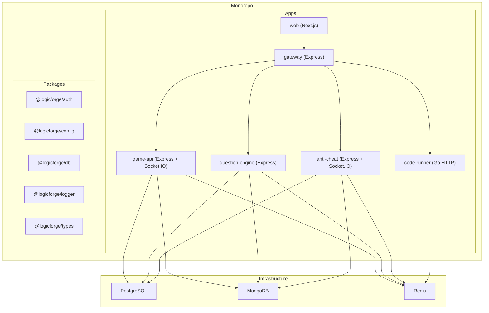
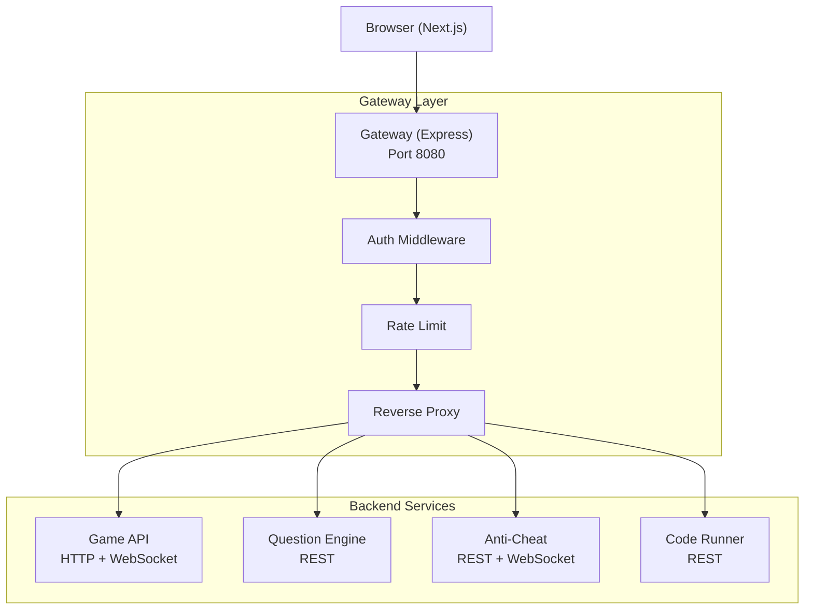
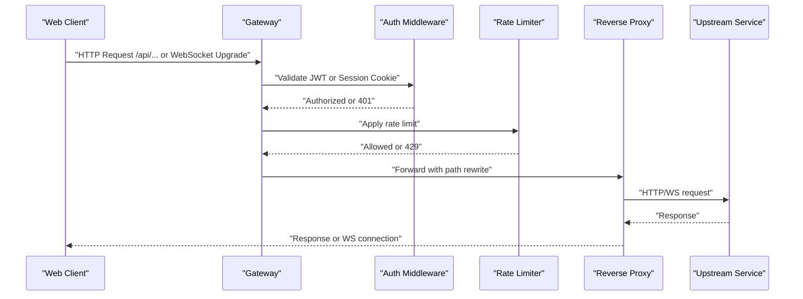
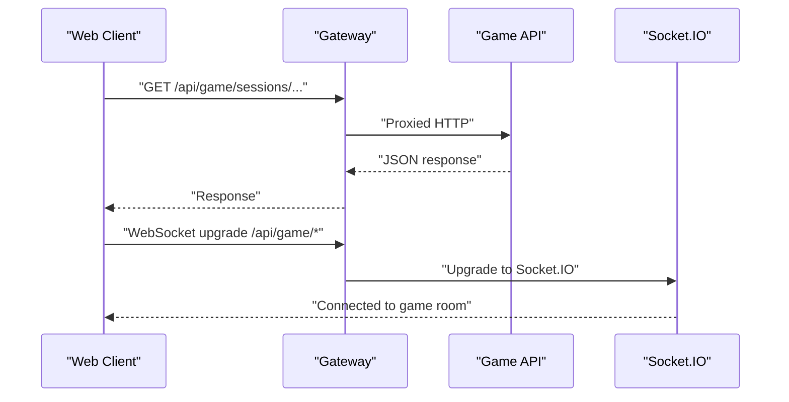
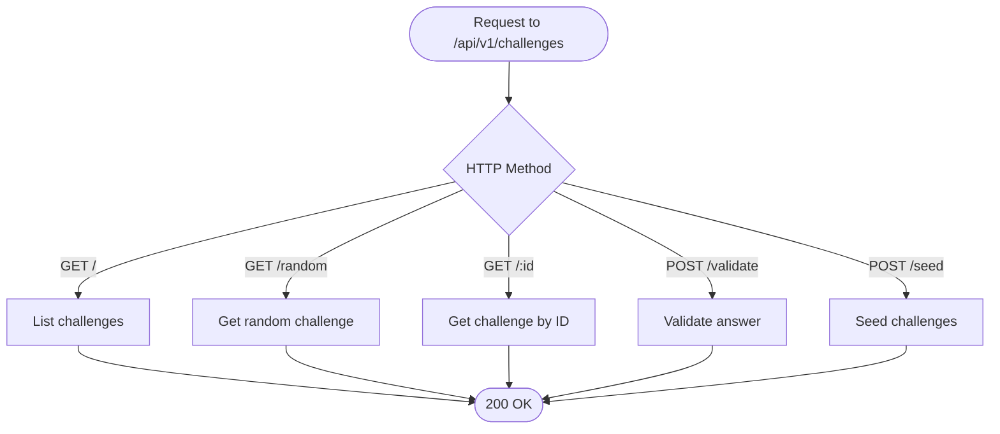
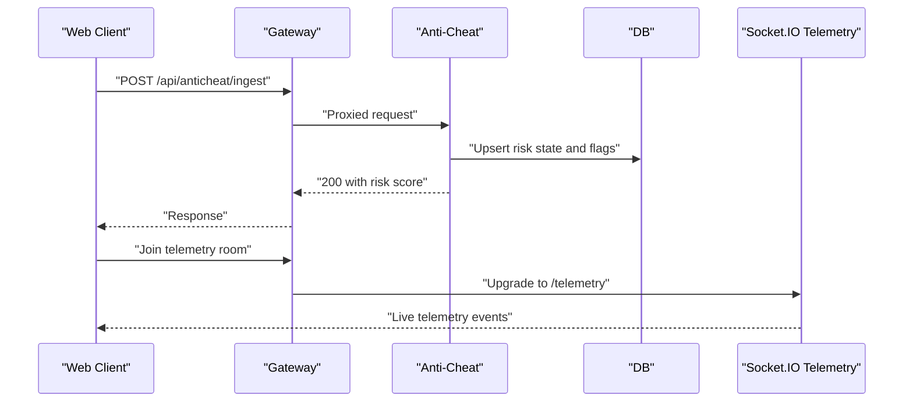
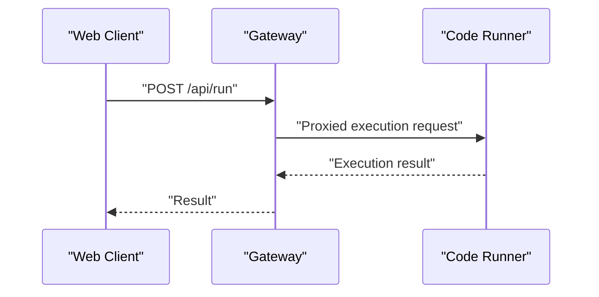
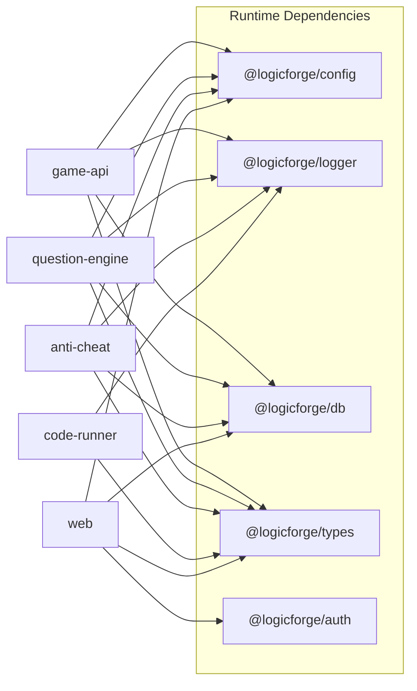

# Microservices Architecture

<cite>
**Referenced Files in This Document**
- [package.json](file://package.json)
- [pnpm-workspace.yaml](file://pnpm-workspace.yaml)
- [turbo.json](file://turbo.json)
- [docker-compose.yml](file://docker-compose.yml)
- [apps/gateway/src/index.ts](file://apps/gateway/src/index.ts)
- [apps/gateway/src/proxy.ts](file://apps/gateway/src/proxy.ts)
- [apps/gateway/src/middleware/auth.ts](file://apps/gateway/src/middleware/auth.ts)
- [apps/game-api/src/app.ts](file://apps/game-api/src/app.ts)
- [apps/game-api/src/index.ts](file://apps/game-api/src/index.ts)
- [apps/anti-cheat/src/index.ts](file://apps/anti-cheat/src/index.ts)
- [apps/anti-cheat/src/api/routes.ts](file://apps/anti-cheat/src/api/routes.ts)
- [apps/anti-cheat/src/services/risk-scoring.service.ts](file://apps/anti-cheat/src/services/risk-scoring.service.ts)
- [apps/question-engine/src/index.ts](file://apps/question-engine/src/index.ts)
- [apps/question-engine/src/routes/challenge.routes.ts](file://apps/question-engine/src/routes/challenge.routes.ts)
- [apps/web/package.json](file://apps/web/package.json)
</cite>

## Table of Contents
1. [Introduction](#introduction)
2. [Project Structure](#project-structure)
3. [Core Components](#core-components)
4. [Architecture Overview](#architecture-overview)
5. [Detailed Component Analysis](#detailed-component-analysis)
6. [Dependency Analysis](#dependency-analysis)
7. [Performance Considerations](#performance-considerations)
8. [Troubleshooting Guide](#troubleshooting-guide)
9. [Conclusion](#conclusion)

## Introduction
This document explains Logic Forge’s microservices architecture, focusing on service boundaries between web, game-api, question-engine, anti-cheat, and code-runner. It documents the monorepo structure using Turborepo and pnpm workspaces, service communication via HTTP REST APIs and WebSocket connections, service discovery through Docker Compose networking, and the API gateway pattern for routing and authentication. Practical examples illustrate inter-service communication, error handling strategies, and considerations for scaling and load balancing.

## Project Structure
Logic Forge uses a monorepo organized with pnpm workspaces and Turborepo:
- Workspaces define package locations for applications and shared packages.
- Turborepo orchestrates builds, tests, and development across services.
- Docker Compose defines services, networks, and environment variables for local orchestration.

**Diagram sources**
- [pnpm-workspace.yaml](file://pnpm-workspace.yaml#L1-L3)
- [turbo.json](file://turbo.json#L1-L45)
- [docker-compose.yml](file://docker-compose.yml#L1-L238)

**Section sources**
- [pnpm-workspace.yaml](file://pnpm-workspace.yaml#L1-L3)
- [turbo.json](file://turbo.json#L1-L45)
- [package.json](file://package.json#L1-L22)
- [docker-compose.yml](file://docker-compose.yml#L1-L238)

## Core Components
- Web (Next.js): Frontend client that consumes the API gateway and connects to WebSocket endpoints for real-time gameplay.
- API Gateway (Express): Centralized entry point applying authentication, request logging, rate limiting, and proxying to backend services.
- Game API (Express + Socket.IO): HTTP REST endpoints for sessions and WebSocket channels for live gameplay.
- Question Engine (Express): REST endpoints for challenges and seeds.
- Anti-Cheat (Express + Socket.IO): REST endpoints for risk scoring and telemetry ingestion; WebSocket channel for live telemetry.
- Code Runner (Go HTTP): REST endpoint for executing code submissions.
- Shared Packages: Authentication, configuration, database access, logging, and types used across services.

**Section sources**
- [apps/web/package.json](file://apps/web/package.json#L1-L116)
- [apps/gateway/src/index.ts](file://apps/gateway/src/index.ts#L1-L117)
- [apps/game-api/src/app.ts](file://apps/game-api/src/app.ts#L1-L63)
- [apps/game-api/src/index.ts](file://apps/game-api/src/index.ts#L1-L45)
- [apps/question-engine/src/index.ts](file://apps/question-engine/src/index.ts#L1-L46)
- [apps/anti-cheat/src/index.ts](file://apps/anti-cheat/src/index.ts#L1-L35)
- [apps/anti-cheat/src/api/routes.ts](file://apps/anti-cheat/src/api/routes.ts#L1-L85)
- [apps/anti-cheat/src/services/risk-scoring.service.ts](file://apps/anti-cheat/src/services/risk-scoring.service.ts#L1-L76)

## Architecture Overview
The system follows an API gateway pattern:
- Clients (web) connect to the gateway on port 8080.
- The gateway authenticates requests, applies rate limits, and proxies to backend services.
- Real-time features use WebSocket upgrades routed to the game API service.
- Backend services communicate internally via Docker network hostnames and ports.

**Diagram sources**
- [apps/gateway/src/index.ts](file://apps/gateway/src/index.ts#L48-L96)
- [apps/gateway/src/proxy.ts](file://apps/gateway/src/proxy.ts#L1-L78)
- [apps/gateway/src/middleware/auth.ts](file://apps/gateway/src/middleware/auth.ts#L1-L65)
- [docker-compose.yml](file://docker-compose.yml#L157-L188)

## Detailed Component Analysis

### API Gateway Pattern
The gateway centralizes:
- Authentication: Validates JWT from Authorization header or NextAuth session cookie.
- Request logging: Logs incoming requests for observability.
- Rate limiting: General and stricter limits for code execution.
- Proxying: Strips prefixes and forwards to upstream services.
- WebSocket upgrade: Forwards WebSocket upgrade for game channels.

**Diagram sources**
- [apps/gateway/src/index.ts](file://apps/gateway/src/index.ts#L48-L96)
- [apps/gateway/src/middleware/auth.ts](file://apps/gateway/src/middleware/auth.ts#L18-L64)
- [apps/gateway/src/proxy.ts](file://apps/gateway/src/proxy.ts#L17-L42)

**Section sources**
- [apps/gateway/src/index.ts](file://apps/gateway/src/index.ts#L1-L117)
- [apps/gateway/src/proxy.ts](file://apps/gateway/src/proxy.ts#L1-L78)
- [apps/gateway/src/middleware/auth.ts](file://apps/gateway/src/middleware/auth.ts#L1-L65)

### Game API Service
- HTTP REST: Exposes session-related endpoints and a health check.
- WebSocket: Socket.IO server for real-time gameplay, configured with CORS and supported transports.
- Error handling: Centralized middleware for validation and generic errors.

**Diagram sources**
- [apps/game-api/src/app.ts](file://apps/game-api/src/app.ts#L25-L31)
- [apps/game-api/src/index.ts](file://apps/game-api/src/index.ts#L15-L27)
- [apps/gateway/src/index.ts](file://apps/gateway/src/index.ts#L83-L96)

**Section sources**
- [apps/game-api/src/app.ts](file://apps/game-api/src/app.ts#L1-L63)
- [apps/game-api/src/index.ts](file://apps/game-api/src/index.ts#L1-L45)

### Question Engine Service
- REST endpoints: Challenges CRUD, random selection, validation, and seeding.
- Error handling: Dedicated middleware for consistent error responses.

**Diagram sources**
- [apps/question-engine/src/routes/challenge.routes.ts](file://apps/question-engine/src/routes/challenge.routes.ts#L10-L27)

**Section sources**
- [apps/question-engine/src/index.ts](file://apps/question-engine/src/index.ts#L1-L46)
- [apps/question-engine/src/routes/challenge.routes.ts](file://apps/question-engine/src/routes/challenge.routes.ts#L1-L28)

### Anti-Cheat Service
- REST endpoints: Risk score retrieval, flags listing, and telemetry ingestion.
- WebSocket: Dedicated namespace for telemetry streaming per session.
- Risk scoring: Weighted scoring and flagging logic persisted to database.

**Diagram sources**
- [apps/anti-cheat/src/api/routes.ts](file://apps/anti-cheat/src/api/routes.ts#L44-L82)
- [apps/anti-cheat/src/services/risk-scoring.service.ts](file://apps/anti-cheat/src/services/risk-scoring.service.ts#L18-L75)
- [apps/anti-cheat/src/index.ts](file://apps/anti-cheat/src/index.ts#L24-L29)

**Section sources**
- [apps/anti-cheat/src/index.ts](file://apps/anti-cheat/src/index.ts#L1-L35)
- [apps/anti-cheat/src/api/routes.ts](file://apps/anti-cheat/src/api/routes.ts#L1-L85)
- [apps/anti-cheat/src/services/risk-scoring.service.ts](file://apps/anti-cheat/src/services/risk-scoring.service.ts#L1-L76)

### Code Runner Service
- REST endpoint: Executes code submissions.
- Rate-limited via gateway to protect resources.

**Diagram sources**
- [apps/gateway/src/proxy.ts](file://apps/gateway/src/proxy.ts#L73-L77)
- [docker-compose.yml](file://docker-compose.yml#L51-L62)

**Section sources**
- [apps/gateway/src/proxy.ts](file://apps/gateway/src/proxy.ts#L1-L78)
- [docker-compose.yml](file://docker-compose.yml#L51-L62)

## Dependency Analysis
- Monorepo tooling: Turborepo orchestrates tasks across apps and packages; pnpm manages workspace dependencies.
- Runtime dependencies: Services depend on shared packages for configuration, logging, database access, and types.
- Inter-service communication: All internal communication occurs over Docker network hostnames and ports defined in compose.
- Frontend integration: The web app consumes gateway endpoints and WebSocket URLs exposed by the gateway.

**Diagram sources**
- [apps/game-api/src/app.ts](file://apps/game-api/src/app.ts#L4-L10)
- [apps/question-engine/src/index.ts](file://apps/question-engine/src/index.ts#L5-L11)
- [apps/anti-cheat/src/index.ts](file://apps/anti-cheat/src/index.ts#L3-L10)
- [apps/web/package.json](file://apps/web/package.json#L15-L19)

**Section sources**
- [turbo.json](file://turbo.json#L1-L45)
- [pnpm-workspace.yaml](file://pnpm-workspace.yaml#L1-L3)
- [apps/web/package.json](file://apps/web/package.json#L1-L116)

## Performance Considerations
- Gateway rate limiting: Apply general and stricter limits to protect resource-intensive services like code execution.
- Caching: Use Redis for caching frequent reads (e.g., challenges, session metadata) to reduce upstream load.
- Asynchronous processing: Offload heavy computations (e.g., telemetry scoring) to background jobs to keep request paths fast.
- Circuit breakers: Introduce timeouts and failure thresholds around upstream calls to prevent cascading failures.
- Horizontal scaling: Run multiple replicas behind a load balancer; ensure sticky sessions only where required (e.g., WebSocket rooms).
- Resource isolation: Configure CPU/memory limits and autoscaling policies in production orchestration.

[No sources needed since this section provides general guidance]

## Troubleshooting Guide
- Authentication failures: Verify JWT secret alignment across services and cookie names for session tokens.
- Proxy errors: Inspect gateway logs for upstream connectivity issues; confirm service health checks pass.
- WebSocket issues: Ensure upgrade routes are correctly forwarded and that CORS allows the frontend origin.
- Database connectivity: Confirm environment variables for database URLs and credentials are consistent across services.
- Health checks: Use service-specific health endpoints to diagnose startup and readiness problems.

**Section sources**
- [apps/gateway/src/middleware/auth.ts](file://apps/gateway/src/middleware/auth.ts#L16-L64)
- [apps/gateway/src/proxy.ts](file://apps/gateway/src/proxy.ts#L29-L38)
- [apps/gateway/src/index.ts](file://apps/gateway/src/index.ts#L83-L96)
- [docker-compose.yml](file://docker-compose.yml#L84-L117)

## Conclusion
Logic Forge employs a clear microservices architecture with a centralized API gateway, distinct bounded contexts for gameplay, questions, anti-cheat, and code execution, and robust inter-service communication via HTTP and WebSocket. The monorepo managed by Turborepo and pnpm enables efficient development and deployment. The gateway enforces authentication, rate limits, and routing, while services focus on domain logic and persistence. Scaling is achieved through replication and load balancing, with caching and circuit breakers supporting resilience.