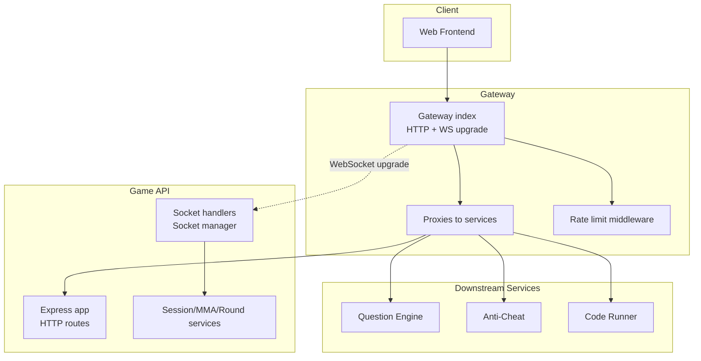
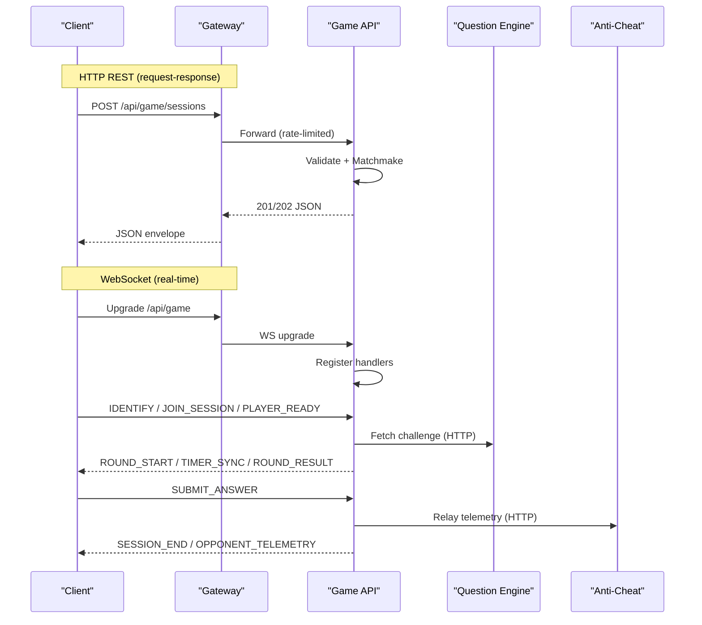
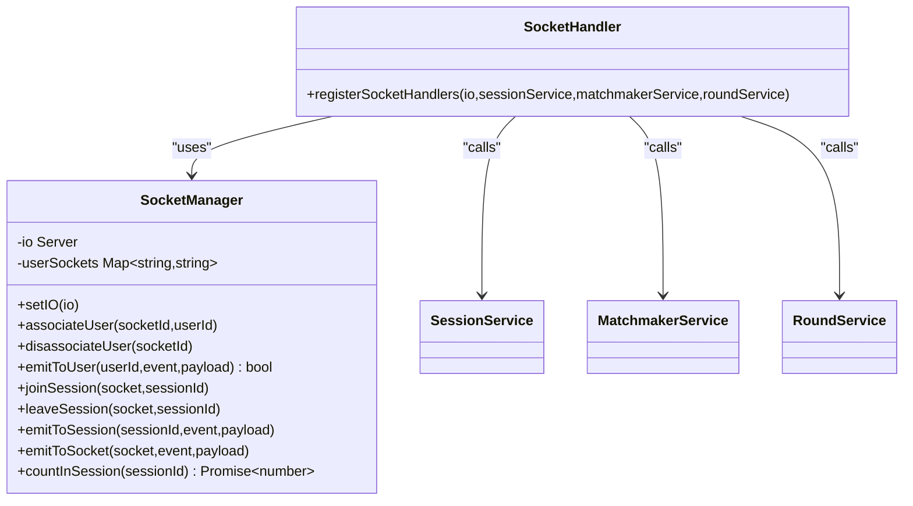
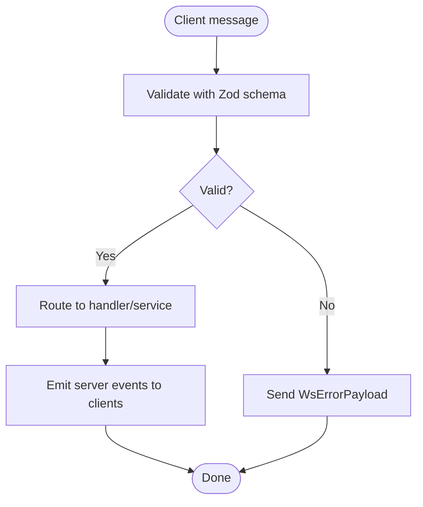
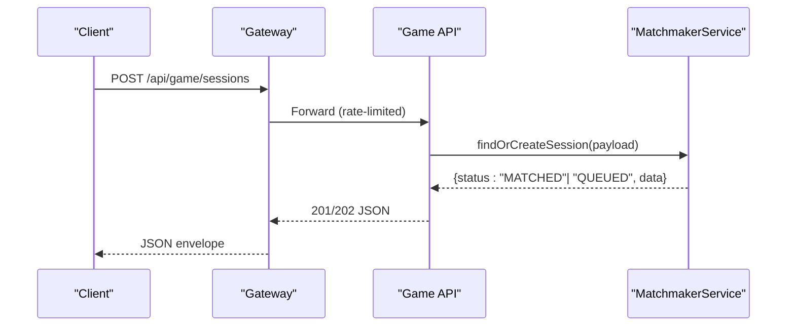
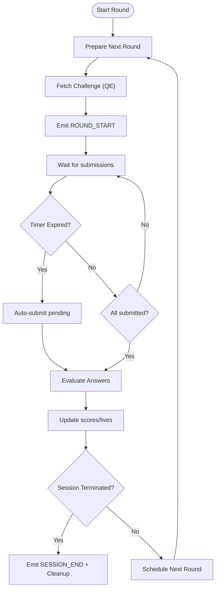
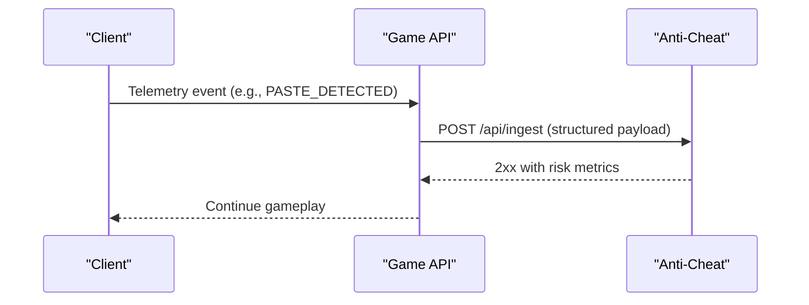
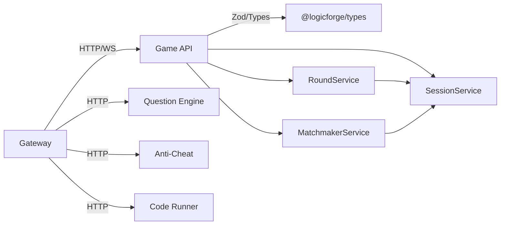

# Service Communication Patterns

<cite>
**Referenced Files in This Document**
- [apps/gateway/src/index.ts](file://apps/gateway/src/index.ts)
- [apps/gateway/src/proxy.ts](file://apps/gateway/src/proxy.ts)
- [apps/gateway/src/middleware/rate-limit.ts](file://apps/gateway/src/middleware/rate-limit.ts)
- [apps/gateway/src/redis.ts](file://apps/gateway/src/redis.ts)
- [apps/game-api/src/app.ts](file://apps/game-api/src/app.ts)
- [apps/game-api/src/routes/session.routes.ts](file://apps/game-api/src/routes/session.routes.ts)
- [apps/game-api/src/websocket/socket.handler.ts](file://apps/game-api/src/websocket/socket.handler.ts)
- [apps/game-api/src/websocket/socket.manager.ts](file://apps/game-api/src/websocket/socket.manager.ts)
- [apps/game-api/src/services/session.service.ts](file://apps/game-api/src/services/session.service.ts)
- [apps/game-api/src/services/matchmaker.service.ts](file://apps/game-api/src/services/matchmaker.service.ts)
- [apps/game-api/src/services/round.service.ts](file://apps/game-api/src/services/round.service.ts)
- [packages/types/src/websocket.ts](file://packages/types/src/websocket.ts)
- [packages/types/src/anti-cheat.ts](file://packages/types/src/anti-cheat.ts)
- [packages/types/src/api-responses.ts](file://packages/types/src/api-responses.ts)
- [apps/anti-cheat/src/services/audit-log.service.ts](file://apps/anti-cheat/src/services/audit-log.service.ts)
</cite>

## Table of Contents
1. [Introduction](#introduction)
2. [Project Structure](#project-structure)
3. [Core Components](#core-components)
4. [Architecture Overview](#architecture-overview)
5. [Detailed Component Analysis](#detailed-component-analysis)
6. [Dependency Analysis](#dependency-analysis)
7. [Performance Considerations](#performance-considerations)
8. [Troubleshooting Guide](#troubleshooting-guide)
9. [Conclusion](#conclusion)

## Introduction
This document explains Logic Forge’s hybrid communication model: a WebSocket-based real-time layer for interactive gameplay and a robust HTTP API for request-response operations. The gateway acts as a reverse proxy and rate limiter, upgrading HTTP connections to WebSocket for the game API. Real-time features include user identification, room-based messaging, round lifecycle orchestration, and anti-cheat telemetry relays. HTTP APIs power matchmaking and session creation, while services coordinate state and persistence.

## Project Structure
The system is organized into microservices behind a gateway:
- Gateway: reverse proxy, WebSocket upgrade, rate limiting, and centralized logging.
- Game API: HTTP REST endpoints and WebSocket handlers for sessions, rounds, and telemetry.
- Question Engine, Anti-Cheat, and Code Runner: downstream services integrated via the gateway.
- Shared types: standardized WebSocket messages, HTTP response envelopes, and anti-cheat telemetry.

**Diagram sources**
- [apps/gateway/src/index.ts](file://apps/gateway/src/index.ts#L83-L96)
- [apps/gateway/src/proxy.ts](file://apps/gateway/src/proxy.ts#L17-L42)
- [apps/gateway/src/middleware/rate-limit.ts](file://apps/gateway/src/middleware/rate-limit.ts#L15-L65)
- [apps/game-api/src/app.ts](file://apps/game-api/src/app.ts#L25-L31)
- [apps/game-api/src/websocket/socket.handler.ts](file://apps/game-api/src/websocket/socket.handler.ts#L62-L309)

**Section sources**
- [apps/gateway/src/index.ts](file://apps/gateway/src/index.ts#L24-L100)
- [apps/gateway/src/proxy.ts](file://apps/gateway/src/proxy.ts#L17-L42)
- [apps/game-api/src/app.ts](file://apps/game-api/src/app.ts#L12-L31)

## Core Components
- Gateway: central entrypoint handling auth, logging, rate limiting, and WebSocket upgrades.
- Game API: HTTP routes for session creation and WebSocket handlers for real-time gameplay.
- Socket Manager: room management, targeted emits, and user-to-socket mapping.
- Services: session state, matchmaking, and round lifecycle orchestration.
- Shared Types: standardized WebSocket and HTTP message schemas.

**Section sources**
- [apps/gateway/src/index.ts](file://apps/gateway/src/index.ts#L48-L96)
- [apps/game-api/src/websocket/socket.manager.ts](file://apps/game-api/src/websocket/socket.manager.ts#L3-L55)
- [apps/game-api/src/services/session.service.ts](file://apps/game-api/src/services/session.service.ts#L18-L166)
- [packages/types/src/websocket.ts](file://packages/types/src/websocket.ts#L4-L155)

## Architecture Overview
Hybrid communication model:
- HTTP REST APIs: matchmaking and session creation via Express routes.
- WebSocket: real-time gameplay, room-based broadcasts, and telemetry relays.
- Gateway: proxies requests, upgrades WebSocket, enforces rate limits, and logs.

**Diagram sources**
- [apps/game-api/src/routes/session.routes.ts](file://apps/game-api/src/routes/session.routes.ts#L19-L35)
- [apps/gateway/src/index.ts](file://apps/gateway/src/index.ts#L87-L96)
- [apps/game-api/src/websocket/socket.handler.ts](file://apps/game-api/src/websocket/socket.handler.ts#L62-L309)
- [apps/game-api/src/services/round.service.ts](file://apps/game-api/src/services/round.service.ts#L206-L285)
- [apps/anti-cheat/src/services/audit-log.service.ts](file://apps/anti-cheat/src/services/audit-log.service.ts#L1-L18)

## Detailed Component Analysis

### WebSocket Implementation and Real-Time Features
The WebSocket layer manages:
- Connection lifecycle and user identification.
- Room-based messaging for sessions and queues.
- Event broadcasting and targeted emits.
- Anti-cheat telemetry relay to downstream service.

**Diagram sources**
- [apps/game-api/src/websocket/socket.manager.ts](file://apps/game-api/src/websocket/socket.manager.ts#L3-L55)
- [apps/game-api/src/websocket/socket.handler.ts](file://apps/game-api/src/websocket/socket.handler.ts#L62-L309)

Key behaviors:
- User identification and rejoin after reconnect.
- Room-based messaging for active sessions and pending matches.
- Broadcasts for round lifecycle and opponent telemetry.
- Anti-cheat telemetry relay with fallbacks and logging.

**Section sources**
- [apps/game-api/src/websocket/socket.handler.ts](file://apps/game-api/src/websocket/socket.handler.ts#L68-L106)
- [apps/game-api/src/websocket/socket.handler.ts](file://apps/game-api/src/websocket/socket.handler.ts#L108-L157)
- [apps/game-api/src/websocket/socket.handler.ts](file://apps/game-api/src/websocket/socket.handler.ts#L159-L202)
- [apps/game-api/src/websocket/socket.handler.ts](file://apps/game-api/src/websocket/socket.handler.ts#L204-L240)
- [apps/game-api/src/websocket/socket.handler.ts](file://apps/game-api/src/websocket/socket.handler.ts#L291-L297)
- [apps/game-api/src/websocket/socket.handler.ts](file://apps/game-api/src/websocket/socket.handler.ts#L299-L308)
- [apps/game-api/src/websocket/socket.manager.ts](file://apps/game-api/src/websocket/socket.manager.ts#L11-L54)

### Message Formats and Event Types
Standardized WebSocket messages and HTTP response envelopes are defined in shared types:
- Client-to-server and server-to-client event unions.
- Payload schemas for session join, round start, timer sync, round result, and errors.
- HTTP response envelope with success/error variants and standardized codes.

**Diagram sources**
- [packages/types/src/websocket.ts](file://packages/types/src/websocket.ts#L4-L155)
- [packages/types/src/api-responses.ts](file://packages/types/src/api-responses.ts#L1-L36)

**Section sources**
- [packages/types/src/websocket.ts](file://packages/types/src/websocket.ts#L4-L155)
- [packages/types/src/api-responses.ts](file://packages/types/src/api-responses.ts#L1-L36)

### HTTP API Patterns for Request-Response
The Game API exposes a single HTTP endpoint for session creation:
- Request validation using Zod schemas.
- Matchmaking orchestration returning immediate match or queued state.
- Standardized JSON error responses.

**Diagram sources**
- [apps/game-api/src/routes/session.routes.ts](file://apps/game-api/src/routes/session.routes.ts#L19-L35)
- [apps/game-api/src/services/matchmaker.service.ts](file://apps/game-api/src/services/matchmaker.service.ts#L47-L57)
- [apps/gateway/src/middleware/rate-limit.ts](file://apps/gateway/src/middleware/rate-limit.ts#L67-L80)

**Section sources**
- [apps/game-api/src/routes/session.routes.ts](file://apps/game-api/src/routes/session.routes.ts#L7-L35)
- [apps/game-api/src/app.ts](file://apps/game-api/src/app.ts#L33-L62)

### Round Lifecycle Orchestration
RoundService coordinates challenges, timers, submissions, and outcomes:
- Fetch challenges from Question Engine with fallbacks.
- Evaluate answers and manage lives/scores.
- Emit round lifecycle events and handle timeouts/live advances.
- Persist match outcomes and clean up state.

**Diagram sources**
- [apps/game-api/src/services/round.service.ts](file://apps/game-api/src/services/round.service.ts#L451-L589)
- [apps/game-api/src/services/round.service.ts](file://apps/game-api/src/services/round.service.ts#L722-L800)

**Section sources**
- [apps/game-api/src/services/round.service.ts](file://apps/game-api/src/services/round.service.ts#L206-L285)
- [apps/game-api/src/services/round.service.ts](file://apps/game-api/src/services/round.service.ts#L722-L800)

### Anti-Cheat Telemetry Relay
Telemetry events are relayed from WebSocket to the anti-cheat service:
- Handler aggregates sessionId/candidateId from payload or socket metadata.
- Relays structured telemetry to downstream ingest endpoint.
- Logs successes/failures and handles network errors.

**Diagram sources**
- [apps/game-api/src/websocket/socket.handler.ts](file://apps/game-api/src/websocket/socket.handler.ts#L19-L60)
- [apps/anti-cheat/src/services/audit-log.service.ts](file://apps/anti-cheat/src/services/audit-log.service.ts#L1-L18)

**Section sources**
- [apps/game-api/src/websocket/socket.handler.ts](file://apps/game-api/src/websocket/socket.handler.ts#L291-L297)
- [packages/types/src/anti-cheat.ts](file://packages/types/src/anti-cheat.ts#L1-L24)

## Dependency Analysis
Gateway depends on Redis for rate limiting and proxies to multiple services. Game API depends on shared types and services for state and orchestration.

**Diagram sources**
- [apps/gateway/src/proxy.ts](file://apps/gateway/src/proxy.ts#L46-L77)
- [apps/game-api/src/services/session.service.ts](file://apps/game-api/src/services/session.service.ts#L1-L166)
- [apps/game-api/src/services/matchmaker.service.ts](file://apps/game-api/src/services/matchmaker.service.ts#L41-L45)
- [apps/game-api/src/services/round.service.ts](file://apps/game-api/src/services/round.service.ts#L1-L12)
- [packages/types/src/index.ts](file://packages/types/src/index.ts#L1-L11)

**Section sources**
- [apps/gateway/src/proxy.ts](file://apps/gateway/src/proxy.ts#L17-L42)
- [apps/gateway/src/redis.ts](file://apps/gateway/src/redis.ts#L1-L54)
- [apps/game-api/src/services/session.service.ts](file://apps/game-api/src/services/session.service.ts#L1-L166)

## Performance Considerations
- WebSocket upgrade and proxying: ensure minimal overhead by enabling WebSocket passthrough in the gateway proxy.
- Rate limiting: sliding-window with Redis; fail-open when Redis is unavailable to maintain availability.
- Round timers: server-sent TIMER_SYNC events reduce client drift; auto-submit on expiry prevents deadlocks.
- Redis-backed state: efficient set operations for joined/ready tracking; TTL-based cleanup.
- Anti-cheat relay: structured payloads and non-blocking fetch to avoid stalling gameplay.

[No sources needed since this section provides general guidance]

## Troubleshooting Guide
Common issues and diagnostics:
- WebSocket upgrade failures: verify gateway upgrade handler matches the path prefix.
- Rate limit exceeded: inspect X-RateLimit-* headers and retry-after logic; monitor Redis connectivity.
- Session not found or expired: client should re-queue after receiving SESSION_ERROR.
- Anti-cheat relay errors: check service availability and ingest endpoint logs.
- Round start failures: server emits SESSION_ERROR; client should retry joining.

**Section sources**
- [apps/gateway/src/index.ts](file://apps/gateway/src/index.ts#L87-L96)
- [apps/gateway/src/middleware/rate-limit.ts](file://apps/gateway/src/middleware/rate-limit.ts#L48-L63)
- [apps/game-api/src/websocket/socket.handler.ts](file://apps/game-api/src/websocket/socket.handler.ts#L197-L201)
- [apps/game-api/src/websocket/socket.handler.ts](file://apps/game-api/src/websocket/socket.handler.ts#L57-L59)
- [apps/game-api/src/websocket/socket.handler.ts](file://apps/game-api/src/websocket/socket.handler.ts#L200-L201)

## Conclusion
Logic Forge’s hybrid communication model leverages a gateway for secure, rate-limited access and WebSocket upgrades, enabling low-latency, room-based real-time gameplay. HTTP APIs provide predictable request-response flows for matchmaking and session management. Robust error handling, telemetry relays, and service orchestration ensure reliable operation under real-time load.