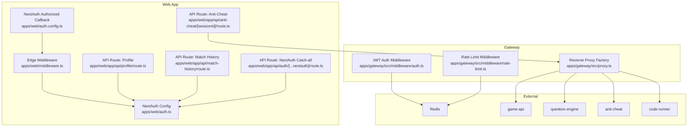
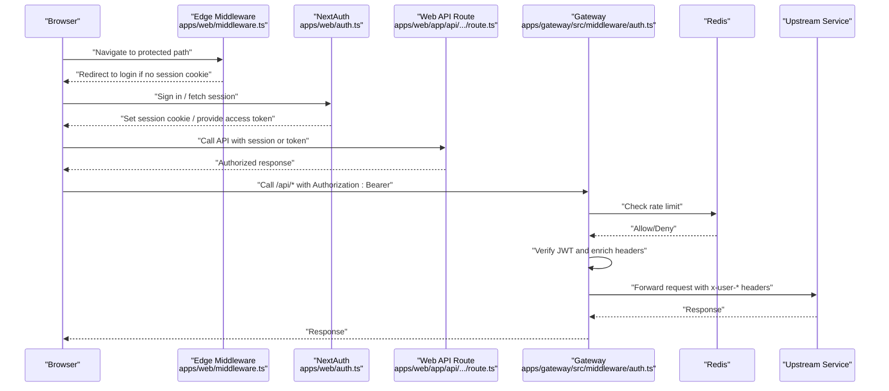
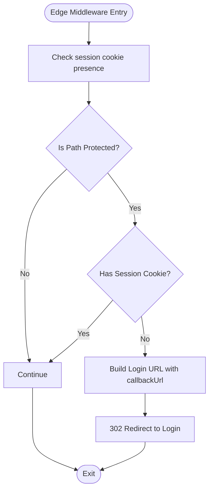
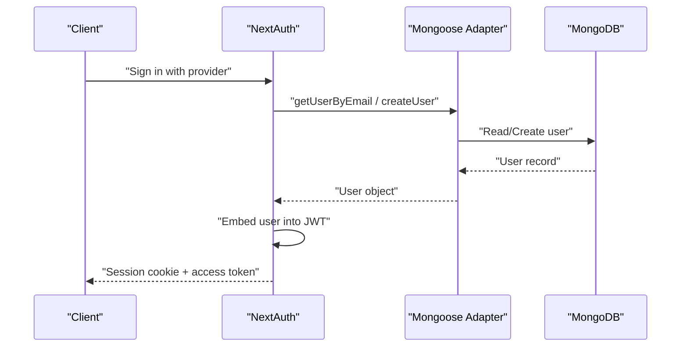
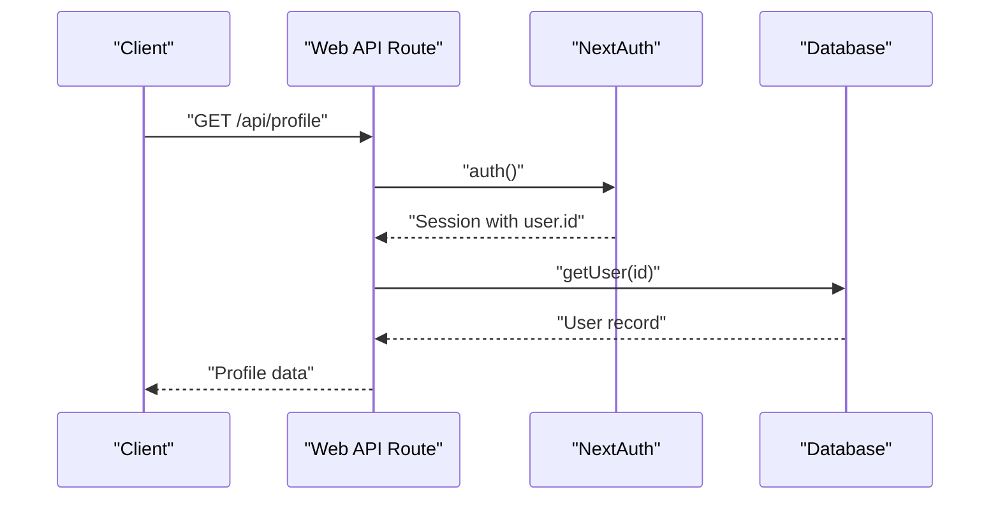
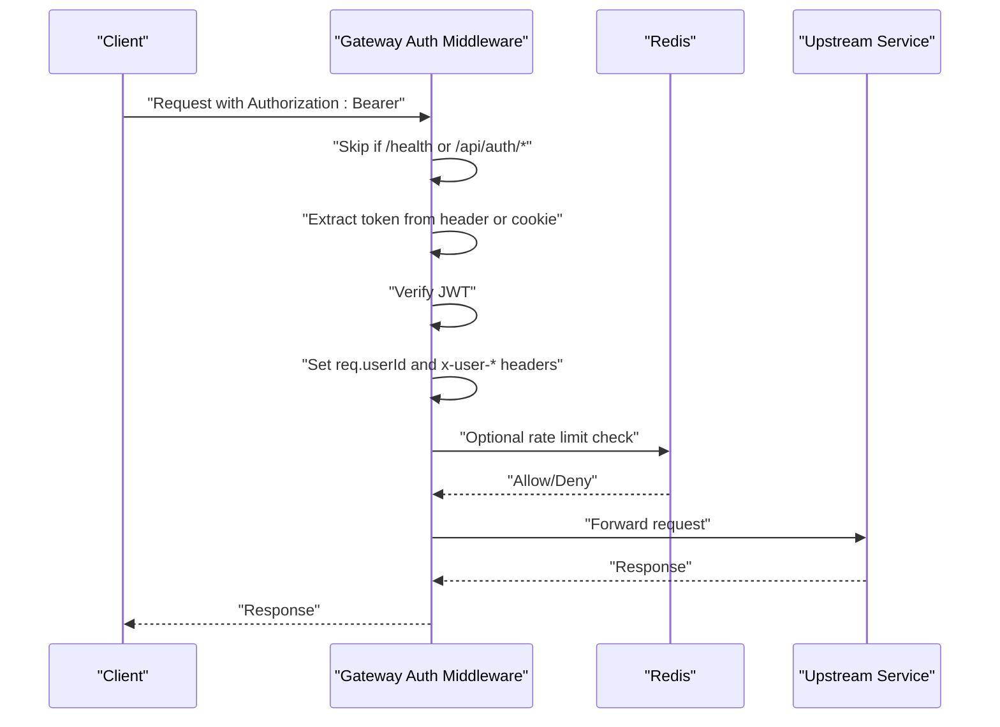
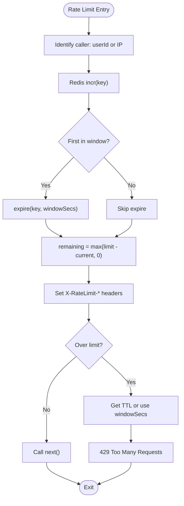
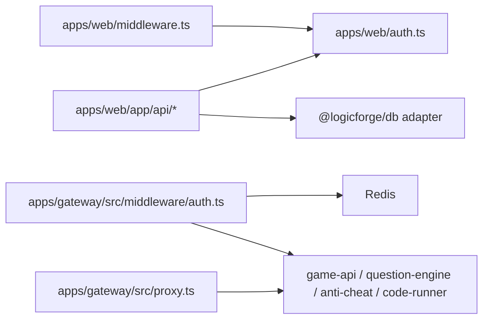

# Access Control & Permissions

<cite>
**Referenced Files in This Document**
- [middleware.ts](file://apps/web/middleware.ts)
- [auth.ts](file://apps/web/auth.ts)
- [auth.config.ts](file://apps/web/auth.config.ts)
- [auth.ts](file://apps/gateway/src/middleware/auth.ts)
- [rate-limit.ts](file://apps/gateway/src/middleware/rate-limit.ts)
- [proxy.ts](file://apps/gateway/src/proxy.ts)
- [route.ts](file://apps/web/app/api/auth/[...nextauth]/route.ts)
- [route.ts](file://apps/web/app/api/profile/route.ts)
- [route.ts](file://apps/web/app/api/match-history/route.ts)
- [route.ts](file://apps/web/app/api/anti-cheat/[sessionId]/route.ts)
- [route.ts](file://apps/web/app/api/auth/login/route.ts)
- [MONGO_AUTH_FIX.md](file://docs/MONGO_AUTH_FIX.md)
- [mongoose-auth.ts](file://packages/db/src/mongoose-auth.ts)
</cite>

## Table of Contents
1. [Introduction](#introduction)
2. [Project Structure](#project-structure)
3. [Core Components](#core-components)
4. [Architecture Overview](#architecture-overview)
5. [Detailed Component Analysis](#detailed-component-analysis)
6. [Dependency Analysis](#dependency-analysis)
7. [Performance Considerations](#performance-considerations)
8. [Troubleshooting Guide](#troubleshooting-guide)
9. [Conclusion](#conclusion)

## Introduction
This document explains the access control and permission management system in Logic Forge. It covers:
- Middleware-based route protection in the Next.js application
- Authentication via NextAuth and JWT session strategy
- Gateway middleware for API endpoint protection and identity propagation
- Rate limiting and abuse prevention using Redis
- Permission model for protected routes and API endpoints
- Security considerations, including cookie handling, bearer tokens, and fail-open behavior
- Integration between frontend authentication state and backend authorization enforcement

## Project Structure
The access control system spans three primary areas:
- Web application middleware and NextAuth configuration
- Gateway middleware for JWT verification and rate limiting
- API routes that enforce authorization and delegate to upstream services

**Diagram sources**
- [middleware.ts](file://apps/web/middleware.ts#L1-L39)
- [auth.ts](file://apps/web/auth.ts#L59-L171)
- [auth.config.ts](file://apps/web/auth.config.ts#L33-L56)
- [route.ts](file://apps/web/app/api/profile/route.ts#L1-L49)
- [route.ts](file://apps/web/app/api/match-history/route.ts#L1-L41)
- [route.ts](file://apps/web/app/api/anti-cheat/[sessionId]/route.ts#L1-L38)
- [route.ts](file://apps/web/app/api/auth/[...nextauth]/route.ts#L1-L5)
- [auth.ts](file://apps/gateway/src/middleware/auth.ts#L18-L64)
- [rate-limit.ts](file://apps/gateway/src/middleware/rate-limit.ts#L15-L80)
- [proxy.ts](file://apps/gateway/src/proxy.ts#L17-L78)

**Section sources**
- [middleware.ts](file://apps/web/middleware.ts#L1-L39)
- [auth.ts](file://apps/web/auth.ts#L59-L171)
- [auth.config.ts](file://apps/web/auth.config.ts#L33-L56)
- [auth.ts](file://apps/gateway/src/middleware/auth.ts#L18-L64)
- [rate-limit.ts](file://apps/gateway/src/middleware/rate-limit.ts#L15-L80)
- [proxy.ts](file://apps/gateway/src/proxy.ts#L17-L78)

## Core Components
- Edge middleware enforces basic route protection by checking for the presence of a session cookie for protected paths. Real verification occurs in Node.js environments.
- NextAuth handles authentication, JWT strategy, and cookie configuration. It exposes a signed access token for backend-to-backend and client-to-gateway communication.
- Gateway JWT auth middleware validates bearer tokens or falls back to session cookies, enriches the request with user identity, and forwards identity headers to upstream services.
- Rate limiting middleware implements sliding-window counters in Redis with fail-open behavior when Redis is unavailable.
- API routes in the web app enforce authorization via NextAuth’s auth helper and interact with the database or upstream services.

**Section sources**
- [middleware.ts](file://apps/web/middleware.ts#L8-L34)
- [auth.ts](file://apps/web/auth.ts#L59-L171)
- [auth.config.ts](file://apps/web/auth.config.ts#L33-L56)
- [auth.ts](file://apps/gateway/src/middleware/auth.ts#L18-L64)
- [rate-limit.ts](file://apps/gateway/src/middleware/rate-limit.ts#L15-L80)
- [route.ts](file://apps/web/app/api/profile/route.ts#L5-L24)
- [route.ts](file://apps/web/app/api/match-history/route.ts#L6-L32)

## Architecture Overview
The system separates concerns across layers:
- Edge middleware performs lightweight checks and redirects unauthenticated users to the login page.
- NextAuth manages session creation, cookie issuance, and JWT signing for clients.
- Gateway middleware validates identities, propagates user context, and applies rate limits.
- Upstream services receive forwarded identity headers and enforce their own authorization rules.

**Diagram sources**
- [middleware.ts](file://apps/web/middleware.ts#L8-L34)
- [auth.ts](file://apps/web/auth.ts#L133-L153)
- [route.ts](file://apps/web/app/api/profile/route.ts#L5-L24)
- [auth.ts](file://apps/gateway/src/middleware/auth.ts#L18-L64)
- [rate-limit.ts](file://apps/gateway/src/middleware/rate-limit.ts#L15-L80)
- [proxy.ts](file://apps/gateway/src/proxy.ts#L17-L42)

## Detailed Component Analysis

### Edge Middleware Protection
- Purpose: Redirect unauthenticated users attempting to access protected paths to the login page while preserving the intended destination.
- Protected paths: Dashboard, Arcade, Lobby, Story, Settings, Arena.
- Behavior: Checks for presence of session cookies; if absent and path is protected, redirects to login with callbackUrl.

**Diagram sources**
- [middleware.ts](file://apps/web/middleware.ts#L8-L34)

**Section sources**
- [middleware.ts](file://apps/web/middleware.ts#L8-L34)

### NextAuth Authentication and Session Strategy
- Strategy: JWT-based session strategy to enable Edge runtime compatibility and client-side access token generation.
- Cookie configuration: Host-only, path "/", SameSite lax; secure cookies in production; aligned with Edge middleware expectations.
- Token embedding: User identity embedded into the JWT at sign-in; client receives a signed access token for backend APIs.
- Redirect handling: Canonical redirect to the public origin to ensure cookies land on the correct host.
- Providers: Google and GitHub with dangerous email linking allowed for development convenience.

**Diagram sources**
- [auth.ts](file://apps/web/auth.ts#L59-L171)
- [mongoose-auth.ts](file://packages/db/src/mongoose-auth.ts#L1-L44)

**Section sources**
- [auth.ts](file://apps/web/auth.ts#L59-L171)
- [auth.config.ts](file://apps/web/auth.config.ts#L11-L56)
- [MONGO_AUTH_FIX.md](file://docs/MONGO_AUTH_FIX.md#L1-L44)
- [mongoose-auth.ts](file://packages/db/src/mongoose-auth.ts#L1-L44)

### Web API Route Authorization
- Profile endpoint: Uses NextAuth’s auth helper to require a valid session; retrieves user via the adapter and returns display metadata.
- Match history endpoint: Requires a session with email; queries match records and global score using database helpers.
- Anti-Cheat endpoint: Proxies to the anti-cheat service; does not enforce user identity at the gateway level for this route.

**Diagram sources**
- [route.ts](file://apps/web/app/api/profile/route.ts#L5-L24)
- [route.ts](file://apps/web/app/api/match-history/route.ts#L6-L32)

**Section sources**
- [route.ts](file://apps/web/app/api/profile/route.ts#L5-L24)
- [route.ts](file://apps/web/app/api/match-history/route.ts#L6-L32)
- [route.ts](file://apps/web/app/api/anti-cheat/[sessionId]/route.ts#L6-L37)

### Gateway JWT Authentication and Identity Propagation
- Public routes: Health checks and NextAuth callbacks are bypassed.
- Token sources: Authorization header Bearer token or session cookie (dev/prod variants).
- Verification: Validates JWT using the shared secret; on success, attaches user identity to request and forwards identity headers to upstream services.

**Diagram sources**
- [auth.ts](file://apps/gateway/src/middleware/auth.ts#L18-L64)
- [rate-limit.ts](file://apps/gateway/src/middleware/rate-limit.ts#L15-L80)
- [proxy.ts](file://apps/gateway/src/proxy.ts#L17-L42)

**Section sources**
- [auth.ts](file://apps/gateway/src/middleware/auth.ts#L18-L64)

### Rate Limiting and Abuse Prevention
- Implementation: Sliding-window rate limiter using Redis incr + expire TTL semantics.
- Keys: Per-user or per-IP identifiers; fail-open when Redis is unavailable.
- Limits:
  - General: 120 requests per 60 seconds
  - Code runner: 10 requests per 60 seconds
- Headers: X-RateLimit-Limit and X-RateLimit-Remaining returned on every request.

**Diagram sources**
- [rate-limit.ts](file://apps/gateway/src/middleware/rate-limit.ts#L15-L80)

**Section sources**
- [rate-limit.ts](file://apps/gateway/src/middleware/rate-limit.ts#L15-L80)

### Reverse Proxy Integration
- The gateway creates named proxies for upstream services and strips the gateway prefix before forwarding.
- WebSocket support enabled for services that require it.
- Error handling emits structured logs and responds with Bad Gateway when upstream fails.

**Section sources**
- [proxy.ts](file://apps/gateway/src/proxy.ts#L17-L78)

## Dependency Analysis
- Frontend to Backend:
  - Edge middleware depends on NextAuth cookie naming and session cookie presence.
  - Web API routes depend on NextAuth auth helper and the database adapter.
  - Gateway middleware depends on Redis availability and JWT secret alignment with NextAuth.
- Upstream Services:
  - Identity propagation: x-user-id and x-user-email forwarded to upstream services.
  - Proxy targets configured via environment variables.

**Diagram sources**
- [middleware.ts](file://apps/web/middleware.ts#L1-L39)
- [auth.ts](file://apps/web/auth.ts#L59-L171)
- [route.ts](file://apps/web/app/api/profile/route.ts#L1-L49)
- [auth.ts](file://apps/gateway/src/middleware/auth.ts#L18-L64)
- [rate-limit.ts](file://apps/gateway/src/middleware/rate-limit.ts#L15-L80)
- [proxy.ts](file://apps/gateway/src/proxy.ts#L46-L77)

**Section sources**
- [middleware.ts](file://apps/web/middleware.ts#L1-L39)
- [auth.ts](file://apps/web/auth.ts#L59-L171)
- [route.ts](file://apps/web/app/api/profile/route.ts#L1-L49)
- [auth.ts](file://apps/gateway/src/middleware/auth.ts#L18-L64)
- [rate-limit.ts](file://apps/gateway/src/middleware/rate-limit.ts#L15-L80)
- [proxy.ts](file://apps/gateway/src/proxy.ts#L46-L77)

## Performance Considerations
- Redis latency: Rate limiting relies on Redis operations; ensure low-latency network access to Redis.
- Fail-open safety: When Redis is down, rate limiting is bypassed to avoid blocking legitimate traffic.
- JWT verification cost: Minimal overhead; ensure the JWT secret is consistent across services.
- Proxy overhead: WebSocket support adds event handling; monitor upstream error logs for proxy failures.

[No sources needed since this section provides general guidance]

## Troubleshooting Guide
- Missing MONGO_URL:
  - Symptom: OAuth callback fails with configuration errors.
  - Resolution: Set MONGO_URL in the web app environment and ensure MongoDB is reachable with correct authSource.
- Missing AUTH_SECRET/NEXTAUTH_SECRET:
  - Symptom: JWT verification failures or inability to sign access tokens.
  - Resolution: Provide a strong secret in the environment.
- Edge middleware cannot decrypt JWT:
  - Symptom: Edge runtime cannot verify session cookies.
  - Resolution: Use JWT session strategy and rely on Node.js verification for robustness.
- Rate limit 429 responses:
  - Cause: Exceeded per-user or per-IP limits.
  - Action: Reduce client-side request frequency or increase limits cautiously.
- Proxy Bad Gateway:
  - Cause: Upstream service unreachable or crashed.
  - Action: Check upstream service logs and network connectivity.

**Section sources**
- [MONGO_AUTH_FIX.md](file://docs/MONGO_AUTH_FIX.md#L1-L44)
- [auth.ts](file://apps/web/auth.ts#L37-L44)
- [auth.ts](file://apps/gateway/src/middleware/auth.ts#L60-L63)
- [rate-limit.ts](file://apps/gateway/src/middleware/rate-limit.ts#L59-L63)
- [proxy.ts](file://apps/gateway/src/proxy.ts#L29-L37)

## Conclusion
Logic Forge implements a layered access control system:
- Edge middleware provides a lightweight gate for protected paths.
- NextAuth manages robust authentication with JWT strategy and client-side access tokens.
- Gateway middleware validates identities, forwards user context, and applies rate limits with fail-open safety.
- API routes enforce authorization and integrate with upstream services.

This design balances usability, security, and resilience while enabling clear separation of concerns across the frontend, gateway, and backend services.