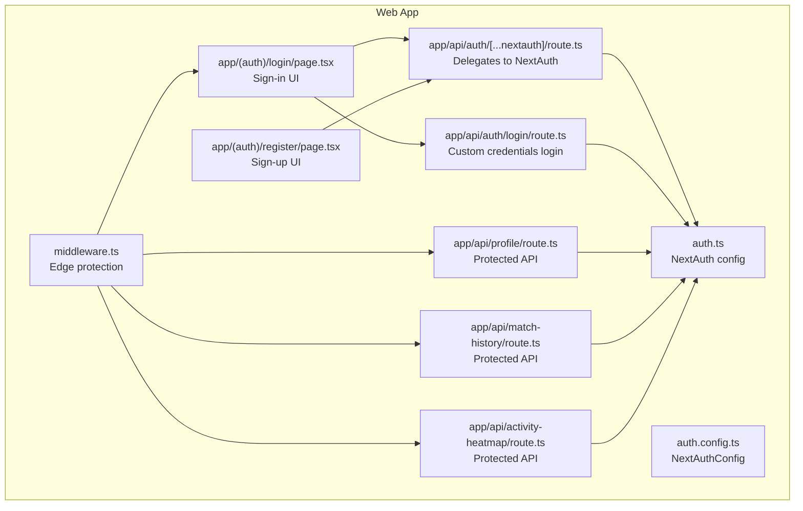
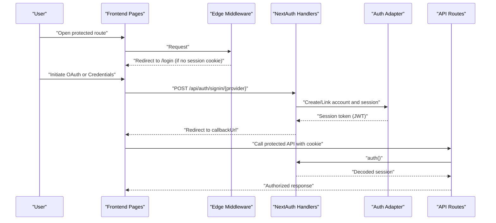
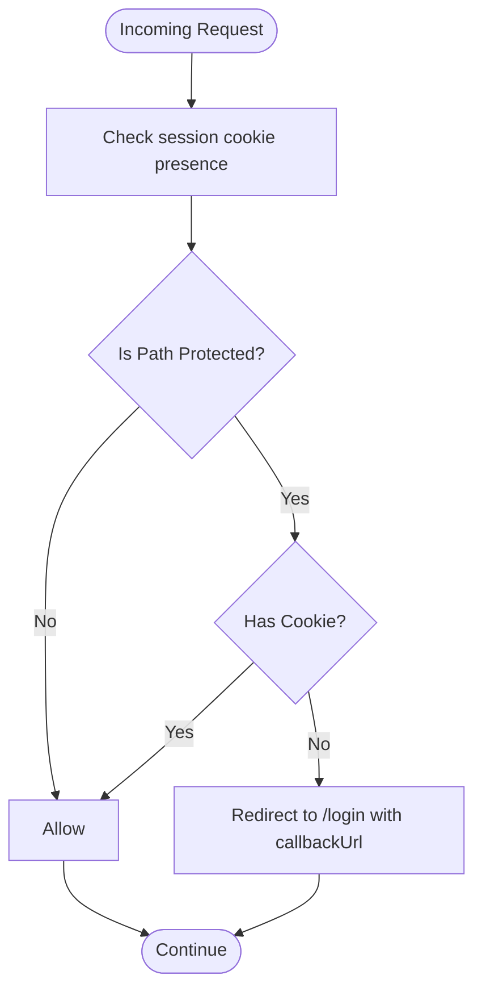
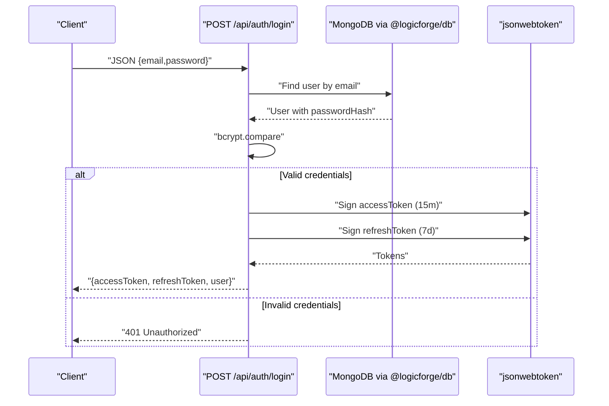
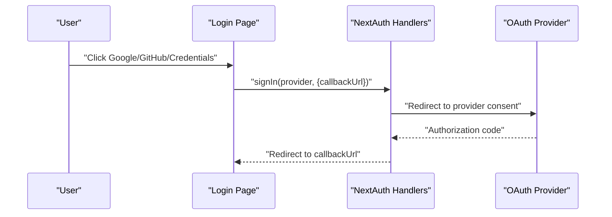
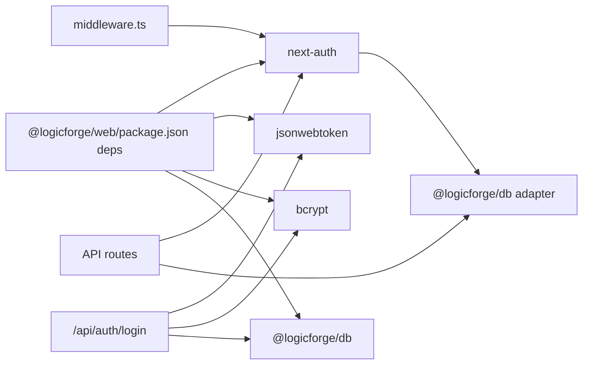

# Authentication & Authorization

<cite>
**Referenced Files in This Document**
- [auth.ts](file://apps/web/auth.ts)
- [auth.config.ts](file://apps/web/auth.config.ts)
- [middleware.ts](file://apps/web/middleware.ts)
- [[...nextauth]/route.ts](file://apps/web/app/api/auth/[...nextauth]/route.ts)
- [login/route.ts](file://apps/web/app/api/auth/login/route.ts)
- [profile/route.ts](file://apps/web/app/api/profile/route.ts)
- [match-history/route.ts](file://apps/web/app/api/match-history/route.ts)
- [activity-heatmap/route.ts](file://apps/web/app/api/activity-heatmap/route.ts)
- [login/page.tsx](file://apps/web/app/(auth)/login/page.tsx)
- [register/page.tsx](file://apps/web/app/(auth)/register/page.tsx)
- [package.json](file://apps/web/package.json)
</cite>

## Table of Contents
1. [Introduction](#introduction)
2. [Project Structure](#project-structure)
3. [Core Components](#core-components)
4. [Architecture Overview](#architecture-overview)
5. [Detailed Component Analysis](#detailed-component-analysis)
6. [Dependency Analysis](#dependency-analysis)
7. [Performance Considerations](#performance-considerations)
8. [Troubleshooting Guide](#troubleshooting-guide)
9. [Conclusion](#conclusion)

## Introduction
This document explains the authentication and authorization system built with NextAuth in the web application. It covers provider setup for Google and GitHub OAuth, session management using JWT, user session persistence, middleware protection, and backend API authentication. It also documents the authentication flow from initiation to session establishment, logout procedures, session refresh mechanisms, protected routes, bearer token usage for API endpoints, and security considerations.

## Project Structure
The authentication system spans a small set of cohesive files:
- NextAuth configuration and providers
- Edge middleware for route protection
- API routes delegating to NextAuth and implementing custom login
- Frontend pages initiating OAuth and credentials login
- Backend API routes protected by NextAuth’s auth helper

**Diagram sources**
- [auth.ts](file://apps/web/auth.ts#L59-L171)
- [auth.config.ts](file://apps/web/auth.config.ts#L11-L56)
- [middleware.ts](file://apps/web/middleware.ts#L8-L34)
- [[...nextauth]/route.ts](file://apps/web/app/api/auth/[...nextauth]/route.ts#L1-L4)
- [login/route.ts](file://apps/web/app/api/auth/login/route.ts#L7-L78)
- [login/page.tsx](file://apps/web/app/(auth)/login/page.tsx#L54-L99)
- [register/page.tsx](file://apps/web/app/(auth)/register/page.tsx#L32-L63)
- [profile/route.ts](file://apps/web/app/api/profile/route.ts#L5-L48)
- [match-history/route.ts](file://apps/web/app/api/match-history/route.ts#L6-L40)
- [activity-heatmap/route.ts](file://apps/web/app/api/activity-heatmap/route.ts#L10-L42)

**Section sources**
- [auth.ts](file://apps/web/auth.ts#L59-L171)
- [auth.config.ts](file://apps/web/auth.config.ts#L11-L56)
- [middleware.ts](file://apps/web/middleware.ts#L8-L34)
- [[...nextauth]/route.ts](file://apps/web/app/api/auth/[...nextauth]/route.ts#L1-L4)
- [login/route.ts](file://apps/web/app/api/auth/login/route.ts#L7-L78)
- [login/page.tsx](file://apps/web/app/(auth)/login/page.tsx#L54-L99)
- [register/page.tsx](file://apps/web/app/(auth)/register/page.tsx#L32-L63)
- [profile/route.ts](file://apps/web/app/api/profile/route.ts#L5-L48)
- [match-history/route.ts](file://apps/web/app/api/match-history/route.ts#L6-L40)
- [activity-heatmap/route.ts](file://apps/web/app/api/activity-heatmap/route.ts#L10-L42)

## Core Components
- NextAuth configuration with providers and callbacks
- Edge middleware for route protection
- API route delegating to NextAuth for OAuth
- Custom credentials login endpoint
- Protected API endpoints using NextAuth’s auth helper
- Frontend pages initiating OAuth and credentials login

Key implementation highlights:
- Session strategy: JWT
- Cookie naming and security aligned across auth.ts and auth.config.ts
- Redirect handling and canonical origin derivation
- JWT embedding of user data and custom access token generation
- Edge middleware checks for session cookie presence
- Backend routes enforce authentication via NextAuth’s auth helper

**Section sources**
- [auth.ts](file://apps/web/auth.ts#L59-L171)
- [auth.config.ts](file://apps/web/auth.config.ts#L11-L56)
- [middleware.ts](file://apps/web/middleware.ts#L8-L34)
- [[...nextauth]/route.ts](file://apps/web/app/api/auth/[...nextauth]/route.ts#L1-L4)
- [login/route.ts](file://apps/web/app/api/auth/login/route.ts#L7-L78)
- [profile/route.ts](file://apps/web/app/api/profile/route.ts#L5-L48)

## Architecture Overview
The system uses NextAuth v5 with:
- Providers: Google and GitHub
- Session strategy: JWT
- Cookie policy: host-only, with secure prefix in production
- Edge middleware performs lightweight presence checks; full verification occurs in Node.js routes and the gateway

**Diagram sources**
- [auth.ts](file://apps/web/auth.ts#L59-L171)
- [auth.config.ts](file://apps/web/auth.config.ts#L11-L56)
- [middleware.ts](file://apps/web/middleware.ts#L8-L34)
- [[...nextauth]/route.ts](file://apps/web/app/api/auth/[...nextauth]/route.ts#L1-L4)
- [login/page.tsx](file://apps/web/app/(auth)/login/page.tsx#L54-L99)
- [profile/route.ts](file://apps/web/app/api/profile/route.ts#L5-L48)

## Detailed Component Analysis

### NextAuth Configuration and Providers
- Providers: Google and GitHub configured with client IDs/secrets and allowDangerousEmailAccountLinking enabled
- Session strategy: JWT
- Cookies: Host-only, path "/", sameSite lax; secure prefix applied in production
- Redirect callback ensures canonical origin and accepts recognized origins
- Callbacks:
  - jwt: attach user identifiers and display fields to token
  - session: populate session.user with token data and issue a custom signed JWT for clients to use as Authorization: Bearer

Security and compatibility:
- Cookie names synchronized with auth.config.ts for Edge middleware
- Logger configured for crash/warn/debug visibility

**Section sources**
- [auth.ts](file://apps/web/auth.ts#L59-L171)
- [auth.config.ts](file://apps/web/auth.config.ts#L11-L56)

### Edge Middleware for Route Protection
- Checks for presence of session cookies (including secure variants)
- Protects a fixed set of paths
- Redirects unauthenticated users to /login with callbackUrl
- Matcher excludes static assets and API routes

**Diagram sources**
- [middleware.ts](file://apps/web/middleware.ts#L8-L34)

**Section sources**
- [middleware.ts](file://apps/web/middleware.ts#L8-L34)

### NextAuth API Route Delegation
- Catch-all route under /api/auth/* forwards all requests to NextAuth handlers
- Ensures OAuth flows and callbacks are handled centrally

**Section sources**
- [[...nextauth]/route.ts](file://apps/web/app/api/auth/[...nextauth]/route.ts#L1-L4)

### Custom Credentials Login Endpoint
- Validates email/password against stored bcrypt hashes
- Returns short-lived access token and long-lived refresh token
- Returns user info for client-side hydration

**Diagram sources**
- [login/route.ts](file://apps/web/app/api/auth/login/route.ts#L7-L78)

**Section sources**
- [login/route.ts](file://apps/web/app/api/auth/login/route.ts#L7-L78)

### Protected API Endpoints
- Profile: GET/PATCH require authentication via NextAuth’s auth helper
- Match History: GET requires authenticated user email
- Activity Heatmap: GET requires authenticated user email

All endpoints:
- Call NextAuth’s auth helper to obtain session
- Enforce 401 Unauthorized when session is missing
- Use adapter or database client for data operations

**Section sources**
- [profile/route.ts](file://apps/web/app/api/profile/route.ts#L5-L48)
- [match-history/route.ts](file://apps/web/app/api/match-history/route.ts#L6-L40)
- [activity-heatmap/route.ts](file://apps/web/app/api/activity-heatmap/route.ts#L10-L42)

### Frontend Authentication Pages
- Login page: Initiates OAuth with Google/GitHub and credentials provider
- Register page: Initiates OAuth with Google/GitHub; credentials registration is reserved for future

**Diagram sources**
- [login/page.tsx](file://apps/web/app/(auth)/login/page.tsx#L54-L99)
- [[...nextauth]/route.ts](file://apps/web/app/api/auth/[...nextauth]/route.ts#L1-L4)

**Section sources**
- [login/page.tsx](file://apps/web/app/(auth)/login/page.tsx#L54-L99)
- [register/page.tsx](file://apps/web/app/(auth)/register/page.tsx#L32-L63)

### Logout Procedures
- Logout is performed client-side via NextAuth’s signOut
- On logout, the session cookie is cleared by NextAuth
- Subsequent requests to protected routes trigger redirection to /login

Note: The repository does not expose a dedicated logout API route; client-side signOut is sufficient given JWT strategy and cookie-based sessions.

**Section sources**
- [auth.ts](file://apps/web/auth.ts#L59-L171)

### Session Refresh Mechanisms
- NextAuth JWT strategy: session persists until expiration
- Custom credentials login endpoint returns separate short-lived access token and long-lived refresh token
- Clients can exchange refresh token for a new access token per their refresh flow

**Section sources**
- [auth.ts](file://apps/web/auth.ts#L133-L153)
- [login/route.ts](file://apps/web/app/api/auth/login/route.ts#L42-L57)

### Role-Based Access Control and Permission Management
- The system currently uses NextAuth for session management and does not define roles or permissions in the provided files
- If roles are introduced, they can be embedded in the JWT during the session callback and enforced in middleware or API routes

[No sources needed since this section provides conceptual guidance]

### Custom Claims Handling
- The session callback attaches user identifiers and display fields to the JWT
- A custom signed access token is generated and attached to the session response for client use as Authorization: Bearer

**Section sources**
- [auth.ts](file://apps/web/auth.ts#L123-L153)

## Dependency Analysis
- NextAuth v5 is used for OAuth and session management
- Edge middleware depends on cookie presence to gate protected paths
- API routes depend on NextAuth’s auth helper for verification
- Custom credentials login uses bcrypt and jsonwebtoken alongside database access

**Diagram sources**
- [package.json](file://apps/web/package.json#L62-L64)
- [middleware.ts](file://apps/web/middleware.ts#L8-L34)
- [login/route.ts](file://apps/web/app/api/auth/login/route.ts#L2-L5)
- [profile/route.ts](file://apps/web/app/api/profile/route.ts#L2-L3)

**Section sources**
- [package.json](file://apps/web/package.json#L62-L64)
- [middleware.ts](file://apps/web/middleware.ts#L8-L34)
- [login/route.ts](file://apps/web/app/api/auth/login/route.ts#L2-L5)
- [profile/route.ts](file://apps/web/app/api/profile/route.ts#L2-L3)

## Performance Considerations
- JWT strategy reduces database lookups for session verification
- Edge middleware performs minimal checks; heavy verification is deferred to Node.js routes
- Custom credentials login signs short-lived tokens to reduce long-term exposure

[No sources needed since this section provides general guidance]

## Troubleshooting Guide
Common issues and remedies:
- Missing secrets or database URL:
  - Ensure AUTH_SECRET or NEXTAUTH_SECRET and MONGO_URL are set in the appropriate .env files
- OAuth configuration errors:
  - Verify provider client IDs and secrets
  - Review logs for configuration warnings and adapter errors
- Protected route access:
  - Confirm session cookie presence and correct cookie prefix in production
  - Ensure callbackUrl resolves to the same origin to avoid baseUrl issues

**Section sources**
- [auth.ts](file://apps/web/auth.ts#L37-L44)
- [auth.ts](file://apps/web/auth.ts#L156-L166)
- [middleware.ts](file://apps/web/middleware.ts#L8-L34)

## Conclusion
The authentication system leverages NextAuth v5 with Google and GitHub OAuth, JWT-based sessions, and a pragmatic split between Edge middleware and Node.js verification. Protected routes and APIs rely on NextAuth’s auth helper, while a custom credentials login endpoint provides short-lived and refresh tokens for programmatic access. The design balances security, performance, and developer ergonomics, with clear separation of concerns across frontend, middleware, and backend layers.