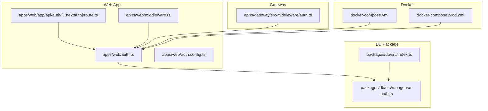
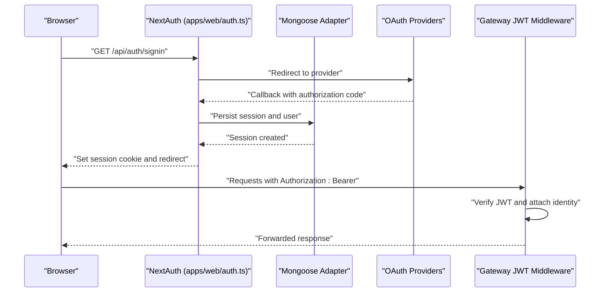
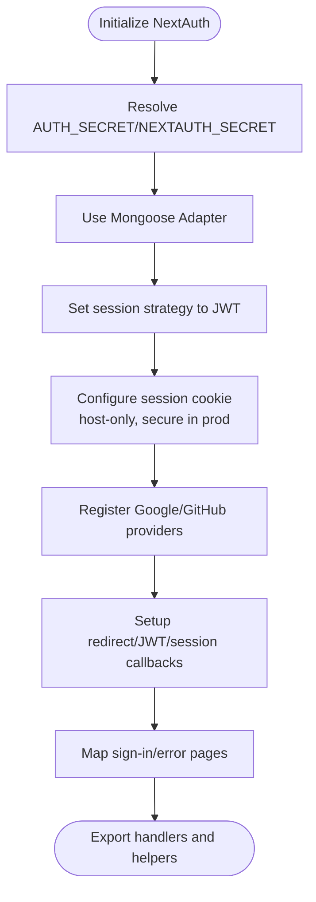
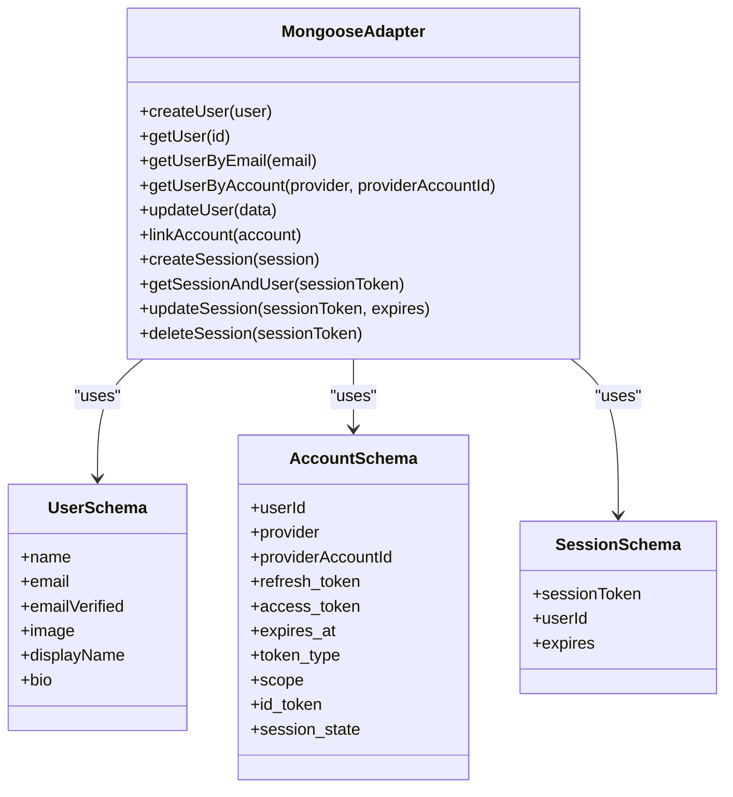
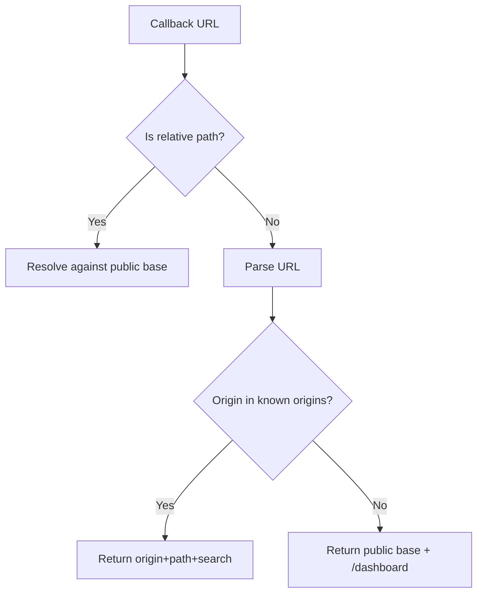
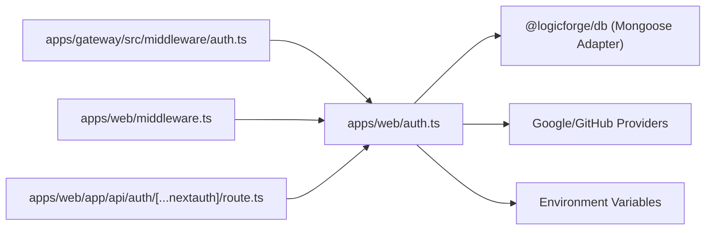

# NextAuth Configuration & Setup

<cite>
**Referenced Files in This Document**
- [auth.ts](file://apps/web/auth.ts)
- [auth.config.ts](file://apps/web/auth.config.ts)
- [middleware.ts](file://apps/web/middleware.ts)
- [route.ts](file://apps/web/app/api/auth/[...nextauth]/route.ts)
- [.env.example](file://apps/web/.env.example)
- [.env](file://apps/web/.env)
- [index.ts](file://packages/db/src/index.ts)
- [mongoose-auth.ts](file://packages/db/src/mongoose-auth.ts)
- [docker-compose.yml](file://docker-compose.yml)
- [docker-compose.prod.yml](file://docker-compose.prod.yml)
- [auth.ts](file://apps/gateway/src/middleware/auth.ts)
</cite>

## Table of Contents
1. [Introduction](#introduction)
2. [Project Structure](#project-structure)
3. [Core Components](#core-components)
4. [Architecture Overview](#architecture-overview)
5. [Detailed Component Analysis](#detailed-component-analysis)
6. [Dependency Analysis](#dependency-analysis)
7. [Performance Considerations](#performance-considerations)
8. [Troubleshooting Guide](#troubleshooting-guide)
9. [Conclusion](#conclusion)
10. [Appendices](#appendices)

## Introduction
This document explains how NextAuth is configured and initialized in the Logic Forge application. It covers environment variable setup, adapter configuration using Mongoose, JWT strategy, cookie security for development and production, OAuth provider configuration for Google and GitHub, redirect callback handling, origin validation, and production deployment considerations. It also includes troubleshooting guidance for common configuration issues.

## Project Structure
The NextAuth integration spans several files:
- NextAuth initialization and configuration
- OAuth provider configuration
- Cookie and session strategy configuration
- Middleware for protected routes
- Catch-all API route handler delegating to NextAuth
- Environment configuration examples and secrets
- Mongoose adapter for persistent sessions and user data
- Docker Compose configurations for local and production deployments

**Diagram sources**
- [auth.ts](file://apps/web/auth.ts#L59-L171)
- [auth.config.ts](file://apps/web/auth.config.ts#L11-L56)
- [middleware.ts](file://apps/web/middleware.ts#L8-L34)
- [route.ts](file://apps/web/app/api/auth/[...nextauth]/route.ts#L1-L5)
- [index.ts](file://packages/db/src/index.ts#L15-L16)
- [mongoose-auth.ts](file://packages/db/src/mongoose-auth.ts#L158-L285)
- [auth.ts](file://apps/gateway/src/middleware/auth.ts#L16-L64)
- [docker-compose.yml](file://docker-compose.yml#L200-L226)
- [docker-compose.prod.yml](file://docker-compose.prod.yml#L111-L143)

**Section sources**
- [auth.ts](file://apps/web/auth.ts#L59-L171)
- [auth.config.ts](file://apps/web/auth.config.ts#L11-L56)
- [middleware.ts](file://apps/web/middleware.ts#L8-L34)
- [route.ts](file://apps/web/app/api/auth/[...nextauth]/route.ts#L1-L5)
- [index.ts](file://packages/db/src/index.ts#L15-L16)
- [mongoose-auth.ts](file://packages/db/src/mongoose-auth.ts#L158-L285)
- [auth.ts](file://apps/gateway/src/middleware/auth.ts#L16-L64)
- [docker-compose.yml](file://docker-compose.yml#L200-L226)
- [docker-compose.prod.yml](file://docker-compose.prod.yml#L111-L143)

## Core Components
- NextAuth initialization and configuration
  - Secret handling, adapter selection, session strategy, cookie configuration, providers, callbacks, logging, and page overrides
- Mongoose adapter for persistent sessions and user/account data
- OAuth providers (Google and GitHub) with client credentials
- Redirect callback handling with origin validation
- Edge middleware for protected routes
- API route handler delegating all NextAuth requests
- Environment configuration for local and production
- Gateway middleware validating JWT tokens and forwarding identity

**Section sources**
- [auth.ts](file://apps/web/auth.ts#L59-L171)
- [mongoose-auth.ts](file://packages/db/src/mongoose-auth.ts#L158-L285)
- [auth.config.ts](file://apps/web/auth.config.ts#L11-L56)
- [middleware.ts](file://apps/web/middleware.ts#L8-L34)
- [route.ts](file://apps/web/app/api/auth/[...nextauth]/route.ts#L1-L5)
- [.env.example](file://apps/web/.env.example#L1-L17)
- [.env](file://apps/web/.env#L1-L2)
- [auth.ts](file://apps/gateway/src/middleware/auth.ts#L16-L64)

## Architecture Overview
The authentication flow integrates NextAuth with Mongoose for persistence, Edge middleware for route protection, and a gateway middleware for downstream services. OAuth callbacks are handled by NextAuth, with redirect validation ensuring the user lands on the correct origin.

**Diagram sources**
- [auth.ts](file://apps/web/auth.ts#L59-L171)
- [mongoose-auth.ts](file://packages/db/src/mongoose-auth.ts#L158-L285)
- [auth.ts](file://apps/gateway/src/middleware/auth.ts#L16-L64)

## Detailed Component Analysis

### NextAuth Initialization and Configuration
- Secret handling
  - Uses either AUTH_SECRET or NEXTAUTH_SECRET
- Adapter setup
  - Uses Mongoose adapter via @logicforge/db
- Session strategy
  - JWT strategy for middleware compatibility
- Cookie configuration
  - Dynamic cookie prefix (__Secure-) for production over HTTPS
  - Host-only cookies (no domain) for reliable cross-origin OAuth
- Providers
  - Google and GitHub configured with client IDs and secrets
- Callbacks
  - Redirect callback validates origins and ensures canonical base
  - JWT callback enriches token with user data
  - Session callback exposes a signed access token for downstream services
- Logging and pages
  - Debug logging enabled in development
  - Sign-in and error pages mapped to the app’s login route

**Diagram sources**
- [auth.ts](file://apps/web/auth.ts#L59-L171)

**Section sources**
- [auth.ts](file://apps/web/auth.ts#L59-L171)

### Mongoose Adapter for Authentication Persistence
- Connection management
  - Lazy connection with global caching and error handling
- Models
  - User, Account, and Session models with proper typing
- Adapter methods
  - CRUD operations for users, accounts, and sessions
  - Conversion helpers to NextAuth-compatible types
- Schema fields
  - Supports extended user fields (e.g., displayName, bio) alongside NextAuth fields

**Diagram sources**
- [mongoose-auth.ts](file://packages/db/src/mongoose-auth.ts#L158-L285)
- [mongoose-auth.ts](file://packages/db/src/mongoose-auth.ts#L39-L156)

**Section sources**
- [index.ts](file://packages/db/src/index.ts#L15-L16)
- [mongoose-auth.ts](file://packages/db/src/mongoose-auth.ts#L158-L285)

### OAuth Providers: Google and GitHub
- Client credentials
  - GOOGLE_CLIENT_ID and GOOGLE_CLIENT_SECRET for Google
  - GITHUB_ID and GITHUB_SECRET for GitHub
- Dangerous linking allowance
  - allowDangerousEmailAccountLinking enabled for simplified user merging
- Environment configuration
  - Example keys provided in .env.example
  - Values injected via Docker Compose for local and production

**Section sources**
- [auth.ts](file://apps/web/auth.ts#L80-L91)
- [.env.example](file://apps/web/.env.example#L13-L17)
- [docker-compose.yml](file://docker-compose.yml#L208-L211)
- [docker-compose.prod.yml](file://docker-compose.prod.yml#L130-L133)

### Redirect Callback Handling and Origin Validation
- Canonical base derivation
  - Uses NEXTAUTH_URL or AUTH_URL fallback
- Relative URL handling
  - Resolves relative paths against the public base
- Origin validation
  - Accepts URLs whose origin matches the public or internal base
- Default redirect
  - Falls back to a safe dashboard path if validation fails

**Diagram sources**
- [auth.ts](file://apps/web/auth.ts#L98-L122)

**Section sources**
- [auth.ts](file://apps/web/auth.ts#L98-L122)

### Cookie Configuration and Security
- Cookie prefix
  - __Secure- prefix applied in production over HTTPS
- Cookie attributes
  - httpOnly, lax SameSite, path "/", secure flag based on environment
- Host-only cookies
  - No domain set to ensure cookie stays with the host during OAuth redirects
- Edge runtime note
  - Edge middleware checks for session cookie presence; real verification occurs in Node.js

**Section sources**
- [auth.ts](file://apps/web/auth.ts#L52-L78)
- [auth.config.ts](file://apps/web/auth.config.ts#L6-L27)
- [middleware.ts](file://apps/web/middleware.ts#L8-L34)

### JWT Strategy Implementation and Access Token Exposure
- JWT enrichment
  - Adds user ID, display name, and bio to the token on login
- Access token exposure
  - Generates a signed access token from the JWT payload for downstream services
- Gateway validation
  - Gateway middleware verifies the JWT and forwards identity headers

**Section sources**
- [auth.ts](file://apps/web/auth.ts#L123-L153)
- [auth.ts](file://apps/gateway/src/middleware/auth.ts#L16-L64)

### Environment Variable Configuration
- Local development
  - NEXTAUTH_URL, AUTH_SECRET, MONGO_URL, provider credentials
- Production
  - NEXT_PUBLIC_APP_URL, NEXTAUTH_URL, AUTH_SECRET, NEXTAUTH_SECRET, provider credentials
- Docker Compose
  - Local compose injects NEXTAUTH_URL, NEXTAUTH_SECRET, provider credentials
  - Production compose injects NEXT_PUBLIC_APP_URL, NEXTAUTH_URL, AUTH_SECRET, provider credentials

**Section sources**
- [.env.example](file://apps/web/.env.example#L1-L17)
- [.env](file://apps/web/.env#L1-L2)
- [docker-compose.yml](file://docker-compose.yml#L200-L226)
- [docker-compose.prod.yml](file://docker-compose.prod.yml#L111-L143)

### API Route Handler Delegation
- Catch-all route
  - Delegates all /api/auth/* requests to NextAuth handlers

**Section sources**
- [route.ts](file://apps/web/app/api/auth/[...nextauth]/route.ts#L1-L5)

### Edge Middleware Protection
- Protected paths
  - Dashboard, arcade, lobby, story, settings, arena
- Cookie presence check
  - Checks for session cookie variants across development and production
- Redirect to login
  - Preserves callbackUrl for seamless redirection after login

**Section sources**
- [middleware.ts](file://apps/web/middleware.ts#L8-L34)

## Dependency Analysis
- NextAuth depends on:
  - Mongoose adapter for persistence
  - OAuth providers for external authentication
  - Environment variables for secrets and URLs
- Gateway middleware depends on:
  - NextAuth secret for JWT verification
  - Downstream services for authenticated requests

**Diagram sources**
- [auth.ts](file://apps/web/auth.ts#L59-L171)
- [index.ts](file://packages/db/src/index.ts#L15-L16)
- [auth.ts](file://apps/gateway/src/middleware/auth.ts#L16-L64)
- [middleware.ts](file://apps/web/middleware.ts#L8-L34)
- [route.ts](file://apps/web/app/api/auth/[...nextauth]/route.ts#L1-L5)

**Section sources**
- [auth.ts](file://apps/web/auth.ts#L59-L171)
- [index.ts](file://packages/db/src/index.ts#L15-L16)
- [auth.ts](file://apps/gateway/src/middleware/auth.ts#L16-L64)
- [middleware.ts](file://apps/web/middleware.ts#L8-L34)
- [route.ts](file://apps/web/app/api/auth/[...nextauth]/route.ts#L1-L5)

## Performance Considerations
- JWT strategy reduces database queries for middleware
- Mongoose adapter lazy-connects and caches connections
- Keep OAuth provider credentials in environment variables to avoid repeated initialization overhead
- Minimize cookie domain and path scope to reduce cookie overhead

## Troubleshooting Guide
- Missing MONGO_URL
  - Warning appears in development if MONGO_URL is not set
  - Ensure MONGO_URL is configured in environment variables
- Missing AUTH_SECRET or NEXTAUTH_SECRET
  - Warning appears in development if neither is set
  - Provide a strong secret in environment variables
- OAuth callback origin mismatch
  - Verify NEXTAUTH_URL or AUTH_URL points to the correct public origin
  - Ensure redirect callback URLs are whitelisted by origin validation
- Cookie not persisting across subdomains
  - Host-only cookies are intentional; do not set a domain
  - For production behind HTTPS, ensure NEXTAUTH_URL starts with https://
- Gateway unauthorized errors
  - Confirm Authorization: Bearer header is present or session cookie is set
  - Verify NEXTAUTH_SECRET matches between web and gateway
- Docker environment injection
  - Confirm environment variables are passed correctly in docker-compose files

**Section sources**
- [auth.ts](file://apps/web/auth.ts#L37-L44)
- [auth.ts](file://apps/web/auth.ts#L52-L57)
- [auth.ts](file://apps/web/auth.ts#L98-L122)
- [auth.ts](file://apps/gateway/src/middleware/auth.ts#L16-L64)
- [docker-compose.yml](file://docker-compose.yml#L200-L226)
- [docker-compose.prod.yml](file://docker-compose.prod.yml#L111-L143)

## Conclusion
Logic Forge’s NextAuth setup leverages a JWT strategy with a Mongoose adapter for persistent sessions, secure cookie handling tailored for production, and robust redirect/callback validation. OAuth providers are configured via environment variables, and the gateway middleware validates JWTs for downstream services. Proper environment configuration and Docker deployment settings are essential for reliable authentication in both development and production.

## Appendices

### Environment Configuration Examples
- Local development
  - NEXTAUTH_URL, AUTH_SECRET, MONGO_URL, provider credentials
- Production
  - NEXT_PUBLIC_APP_URL, NEXTAUTH_URL, AUTH_SECRET, NEXTAUTH_SECRET, provider credentials

**Section sources**
- [.env.example](file://apps/web/.env.example#L1-L17)
- [.env](file://apps/web/.env#L1-L2)
- [docker-compose.prod.yml](file://docker-compose.prod.yml#L111-L143)

### Production Deployment Considerations
- HTTPS requirement for secure cookies
- NEXTAUTH_URL pointing to the public HTTPS origin
- Consistent NEXTAUTH_SECRET across services
- OAuth provider credentials managed securely

**Section sources**
- [auth.ts](file://apps/web/auth.ts#L52-L57)
- [docker-compose.prod.yml](file://docker-compose.prod.yml#L111-L143)