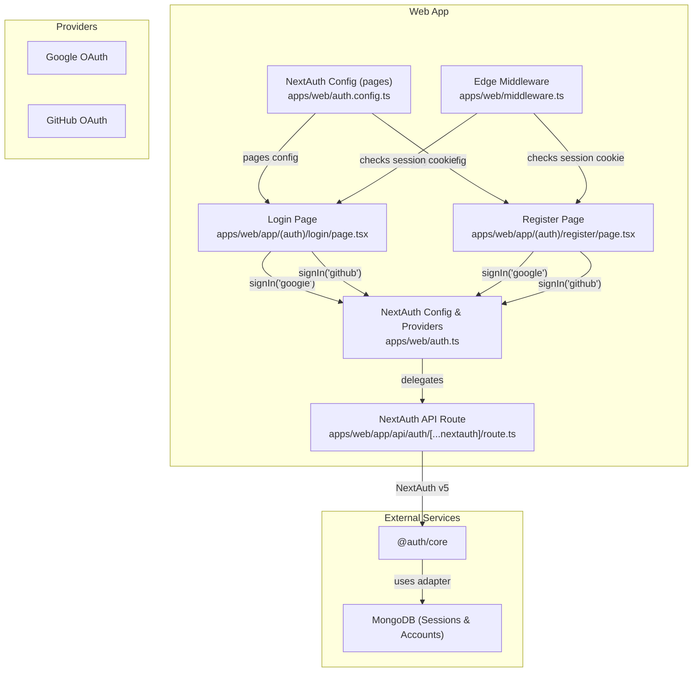
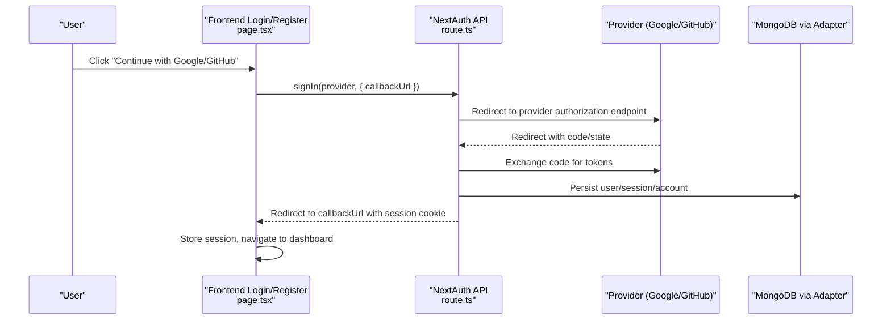
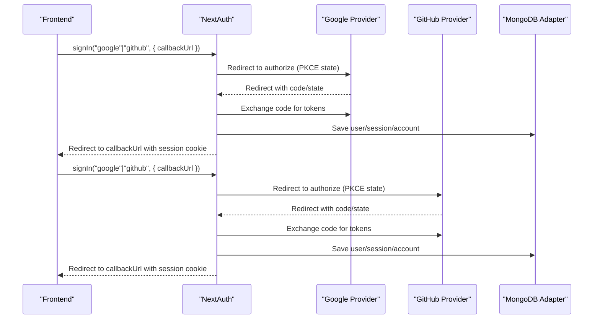
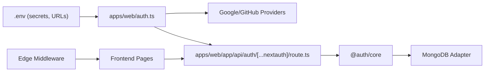

# OAuth Provider Integration

<cite>
**Referenced Files in This Document**
- [auth.ts](file://apps/web/auth.ts)
- [auth.config.ts](file://apps/web/auth.config.ts)
- [route.ts](file://apps/web/app/api/auth/[...nextauth]/route.ts)
- [.env.example](file://apps/web/.env.example)
- [.env](file://apps/web/.env)
- [page.tsx (login)](file://apps/web/app/(auth)/login/page.tsx)
- [page.tsx (register)](file://apps/web/app/(auth)/register/page.tsx)
- [middleware.ts](file://apps/web/middleware.ts)
- [MONGO_AUTH_FIX.md](file://docs/MONGO_AUTH_FIX.md)
- [mongoose-auth.ts](file://packages/db/src/mongoose-auth.ts)
</cite>

## Table of Contents
1. [Introduction](#introduction)
2. [Project Structure](#project-structure)
3. [Core Components](#core-components)
4. [Architecture Overview](#architecture-overview)
5. [Detailed Component Analysis](#detailed-component-analysis)
6. [Dependency Analysis](#dependency-analysis)
7. [Performance Considerations](#performance-considerations)
8. [Troubleshooting Guide](#troubleshooting-guide)
9. [Conclusion](#conclusion)

## Introduction
This document explains how Logic Forge integrates OAuth providers Google and GitHub using the NextAuth.js framework in the web application. It covers provider setup, environment configuration, the end-to-end authentication flow, session handling, and security considerations including the allowDangerousEmailAccountLinking flag. It also documents callback URL handling, state verification, PKCE support, and troubleshooting steps for common OAuth integration issues.

## Project Structure
The OAuth integration spans several parts of the web application:
- Authentication configuration and provider setup
- Frontend login/register pages invoking provider sign-in
- NextAuth API route handler
- Edge middleware enforcing session presence on protected routes
- Environment variables for secrets and URLs
- Database adapter for persistent sessions and accounts

**Diagram sources**
- [auth.ts](file://apps/web/auth.ts#L59-L91)
- [auth.config.ts](file://apps/web/auth.config.ts#L11-L32)
- [route.ts](file://apps/web/app/api/auth/[...nextauth]/route.ts#L1-L5)
- [page.tsx (login)](file://apps/web/app/(auth)/login/page.tsx#L77-L99)
- [page.tsx (register)](file://apps/web/app/(auth)/register/page.tsx#L53-L63)
- [middleware.ts](file://apps/web/middleware.ts#L8-L34)

**Section sources**
- [auth.ts](file://apps/web/auth.ts#L59-L91)
- [auth.config.ts](file://apps/web/auth.config.ts#L11-L32)
- [route.ts](file://apps/web/app/api/auth/[...nextauth]/route.ts#L1-L5)
- [page.tsx (login)](file://apps/web/app/(auth)/login/page.tsx#L77-L99)
- [page.tsx (register)](file://apps/web/app/(auth)/register/page.tsx#L53-L63)
- [middleware.ts](file://apps/web/middleware.ts#L8-L34)

## Core Components
- NextAuth configuration and providers:
  - Google and GitHub providers are configured with client IDs and secrets from environment variables.
  - allowDangerousEmailAccountLinking is enabled for both providers.
  - Session strategy uses JWT; a signed access token is exposed for bearer auth.
  - Cookie naming and security flags are set based on environment.
- NextAuth API route:
  - Delegates all /api/auth/* requests to NextAuth handlers.
- Frontend login/register pages:
  - Trigger provider sign-in with a callback URL.
- Edge middleware:
  - Checks for the presence of a session cookie on protected paths and redirects unauthenticated users to the login page.
- Environment variables:
  - Secrets, provider credentials, and MongoDB connection string are loaded from .env files.
- Database adapter:
  - Mongoose adapter persists sessions and accounts.

**Section sources**
- [auth.ts](file://apps/web/auth.ts#L59-L91)
- [auth.ts](file://apps/web/auth.ts#L138-L153)
- [auth.ts](file://apps/web/auth.ts#L68-L78)
- [route.ts](file://apps/web/app/api/auth/[...nextauth]/route.ts#L1-L5)
- [page.tsx (login)](file://apps/web/app/(auth)/login/page.tsx#L77-L99)
- [page.tsx (register)](file://apps/web/app/(auth)/register/page.tsx#L53-L63)
- [middleware.ts](file://apps/web/middleware.ts#L8-L34)
- [.env.example](file://apps/web/.env.example#L1-L17)
- [.env](file://apps/web/.env#L1-L2)
- [mongoose-auth.ts](file://packages/db/src/mongoose-auth.ts#L129-L156)

## Architecture Overview
The OAuth flow leverages NextAuth.js v5 with a Mongoose adapter. Providers issue authorization challenges and return users to the application via NextAuth’s API route. NextAuth validates the callback, exchanges tokens, persists sessions/accounts, and sets a session cookie. The frontend receives a JWT-based session and can forward a bearer token to downstream services.

**Diagram sources**
- [page.tsx (login)](file://apps/web/app/(auth)/login/page.tsx#L77-L99)
- [page.tsx (register)](file://apps/web/app/(auth)/register/page.tsx#L53-L63)
- [route.ts](file://apps/web/app/api/auth/[...nextauth]/route.ts#L1-L5)
- [auth.ts](file://apps/web/auth.ts#L59-L91)
- [mongoose-auth.ts](file://packages/db/src/mongoose-auth.ts#L129-L156)

## Detailed Component Analysis

### Provider Setup and Configuration
- Providers:
  - Google: configured with GOOGLE_CLIENT_ID and GOOGLE_CLIENT_SECRET.
  - GitHub: configured with GITHUB_ID and GITHUB_SECRET.
  - allowDangerousEmailAccountLinking is enabled for both providers.
- Environment:
  - AUTH_SECRET is required for signing JWTs.
  - NEXTAUTH_URL must be set to the public origin for proper redirect handling.
  - MONGO_URL must be set for the Mongoose adapter to persist sessions and accounts.
- Cookie policy:
  - Session cookie name is prefixed conditionally based on production and HTTPS.
  - Cookies are httpOnly, lax SameSite, path "/", and secure in production with HTTPS.

Security note on allowDangerousEmailAccountLinking:
- Enabling this flag allows linking multiple accounts to the same email address across providers. While convenient for users, it increases risk if email providers are compromised. Ensure robust monitoring and consider disabling for stricter environments.

**Section sources**
- [auth.ts](file://apps/web/auth.ts#L80-L91)
- [auth.ts](file://apps/web/auth.ts#L84-L89)
- [auth.ts](file://apps/web/auth.ts#L68-L78)
- [.env.example](file://apps/web/.env.example#L4-L17)
- [.env](file://apps/web/.env#L1-L2)

### Authentication Flow: From Initiation to Session Establishment
- Frontend initiation:
  - Users click “Continue with Google” or “Continue with GitHub” on the login or register pages.
  - signIn(provider, { callbackUrl }) is invoked with a callback URL derived from the current origin to avoid wrong baseUrl in proxy/Docker deployments.
- NextAuth routing:
  - All /api/auth/* requests are delegated to NextAuth handlers.
- Provider authorization:
  - NextAuth redirects the user to the provider’s authorization endpoint.
- Callback handling and state verification:
  - NextAuth verifies the returned state and code verifier (PKCE) automatically.
- Token exchange and persistence:
  - NextAuth exchanges the authorization code for tokens, persists user, session, and account records, and sets the session cookie.
- Redirect and session propagation:
  - NextAuth redirects to the callback URL with the session cookie attached.
  - The frontend stores the session and proceeds to the protected area.

**Diagram sources**
- [page.tsx (login)](file://apps/web/app/(auth)/login/page.tsx#L77-L99)
- [page.tsx (register)](file://apps/web/app/(auth)/register/page.tsx#L53-L63)
- [route.ts](file://apps/web/app/api/auth/[...nextauth]/route.ts#L1-L5)
- [auth.ts](file://apps/web/auth.ts#L59-L91)
- [mongoose-auth.ts](file://packages/db/src/mongoose-auth.ts#L129-L156)

**Section sources**
- [page.tsx (login)](file://apps/web/app/(auth)/login/page.tsx#L77-L99)
- [page.tsx (register)](file://apps/web/app/(auth)/register/page.tsx#L53-L63)
- [route.ts](file://apps/web/app/api/auth/[...nextauth]/route.ts#L1-L5)
- [auth.ts](file://apps/web/auth.ts#L59-L91)

### Account Linking Mechanism and allowDangerousEmailAccountLinking
- Behavior:
  - allowDangerousEmailAccountLinking is enabled for both Google and GitHub providers.
  - This permits multiple accounts to share the same email address across providers.
- Security implications:
  - Reduced friction for users but increases risk if email credentials are compromised.
  - Monitor for suspicious activity and consider stricter policies in sensitive environments.
- Recommended approach:
  - Evaluate whether to disable this flag for stricter account isolation.
  - Combine with additional checks (e.g., secondary verification) if appropriate.

**Section sources**
- [auth.ts](file://apps/web/auth.ts#L84-L89)

### Callback URL Handling and State Verification
- Callback URL handling:
  - The redirect callback ensures the final redirect target resolves against the configured public base (NEXTAUTH_URL or AUTH_URL).
  - Relative URLs are resolved against the public base; absolute URLs from known origins are accepted and normalized to the public origin.
- State verification and PKCE:
  - NextAuth v5 handles state verification and PKCE internally during the OAuth dance.
  - The frontend does not need to manage state or PKCE; it only needs to call signIn with the desired provider and callback URL.

**Section sources**
- [auth.ts](file://apps/web/auth.ts#L98-L122)

### Session Strategy and Access Token Exposure
- Session strategy:
  - JWT strategy is used; the Edge middleware reads the session cookie for protection checks.
- Access token exposure:
  - A signed access token is included in the session response for bearer authentication to downstream services.
  - The token payload excludes NextAuth’s built-in claims to avoid conflicts when re-signing.

**Section sources**
- [auth.ts](file://apps/web/auth.ts#L66-L66)
- [auth.ts](file://apps/web/auth.ts#L138-L153)

### Protected Routes and Edge Middleware
- Middleware behavior:
  - On protected paths, the middleware checks for the presence of a session cookie.
  - If absent, the user is redirected to the login page with the intended destination as a callback URL parameter.
- Cookie detection:
  - The middleware recognizes both standard and secure-prefixed session cookie names.

**Section sources**
- [middleware.ts](file://apps/web/middleware.ts#L8-L34)

### Environment Variables and Secrets Management
- Required variables:
  - AUTH_SECRET or NEXTAUTH_SECRET for signing JWTs.
  - NEXTAUTH_URL for canonical origin handling.
  - MONGO_URL for the Mongoose adapter.
  - Provider credentials: GOOGLE_CLIENT_ID/GOOGLE_CLIENT_SECRET and GITHUB_ID/GITHUB_SECRET.
- Location:
  - The web app loads .env from its root and falls back to repository root locations.

**Section sources**
- [.env.example](file://apps/web/.env.example#L4-L17)
- [.env](file://apps/web/.env#L1-L2)
- [auth.ts](file://apps/web/auth.ts#L31-L35)

## Dependency Analysis
- NextAuth providers depend on environment variables for client credentials.
- NextAuth relies on the Mongoose adapter to persist sessions and accounts.
- The frontend depends on NextAuth’s API route for OAuth handling.
- Edge middleware depends on the session cookie presence for access control.

**Diagram sources**
- [auth.ts](file://apps/web/auth.ts#L59-L91)
- [route.ts](file://apps/web/app/api/auth/[...nextauth]/route.ts#L1-L5)
- [middleware.ts](file://apps/web/middleware.ts#L8-L34)
- [mongoose-auth.ts](file://packages/db/src/mongoose-auth.ts#L129-L156)

**Section sources**
- [auth.ts](file://apps/web/auth.ts#L59-L91)
- [route.ts](file://apps/web/app/api/auth/[...nextauth]/route.ts#L1-L5)
- [middleware.ts](file://apps/web/middleware.ts#L8-L34)
- [mongoose-auth.ts](file://packages/db/src/mongoose-auth.ts#L129-L156)

## Performance Considerations
- Use JWT strategy for session handling to minimize database queries on read-heavy workloads.
- Ensure NEXTAUTH_URL is set correctly to avoid extra redirects and normalize callback URLs.
- Keep MONGO_URL reachable and tuned for optimal latency; consider connection pooling and indexing for sessions/accounts collections.
- Avoid unnecessary redirects by passing accurate callback URLs from the frontend.

## Troubleshooting Guide
Common issues and resolutions:
- Missing or invalid MONGO_URL:
  - Symptom: OAuth callback fails with configuration errors.
  - Resolution: Set MONGO_URL in apps/web/.env, ensure MongoDB is running, and confirm connectivity.
- Missing AUTH_SECRET or NEXTAUTH_SECRET:
  - Symptom: JWT signing failures or warnings during development.
  - Resolution: Provide a strong secret in apps/web/.env or repository root .env.
- Incorrect NEXTAUTH_URL:
  - Symptom: Redirect loops or wrong baseUrl in proxy/Docker environments.
  - Resolution: Set NEXTAUTH_URL to the public origin; NextAuth normalizes callback URLs accordingly.
- Provider credentials not loaded:
  - Symptom: Provider sign-in does nothing or errors.
  - Resolution: Verify GOOGLE_CLIENT_ID/GOOGLE_CLIENT_SECRET and GITHUB_ID/GITHUB_SECRET are present in apps/web/.env.
- Edge middleware blocking protected routes:
  - Symptom: Redirect to login on protected pages.
  - Resolution: Complete OAuth sign-in to establish a session cookie recognized by the middleware.

Environment and configuration checklist:
- Confirm MONGO_URL is set in apps/web/.env.
- Confirm AUTH_SECRET or NEXTAUTH_SECRET is set.
- Confirm NEXTAUTH_URL is set to the public origin.
- Confirm provider credentials are set.
- Restart the development server after changing .env.

**Section sources**
- [MONGO_AUTH_FIX.md](file://docs/MONGO_AUTH_FIX.md#L1-L71)
- [auth.ts](file://apps/web/auth.ts#L37-L44)
- [auth.ts](file://apps/web/auth.ts#L98-L122)
- [.env.example](file://apps/web/.env.example#L4-L17)
- [.env](file://apps/web/.env#L1-L2)
- [middleware.ts](file://apps/web/middleware.ts#L8-L34)

## Conclusion
Logic Forge’s OAuth integration with Google and GitHub is centered on NextAuth.js v5 with a JWT session strategy and a Mongoose adapter for persistence. Providers are configured with environment-driven client credentials and allowDangerousEmailAccountLinking enabled for convenience. The system handles callback URL normalization, state verification, and PKCE automatically. Robust environment configuration, correct NEXTAUTH_URL, and a working MongoDB connection are essential for reliable OAuth flows. For enhanced security, consider disabling allowDangerousEmailAccountLinking and adding additional verification mechanisms where appropriate.