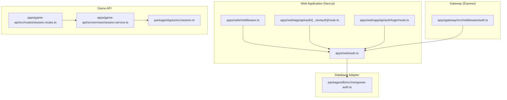
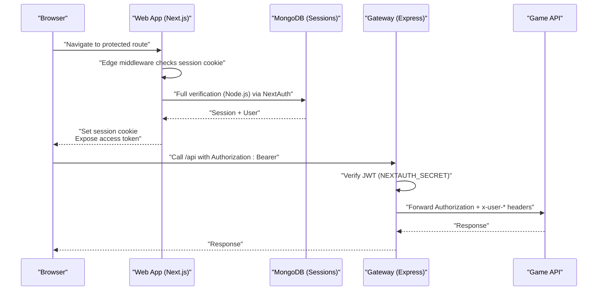
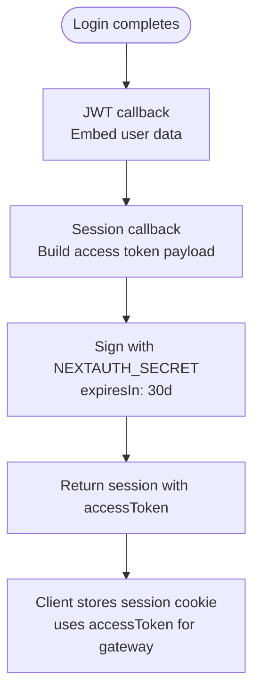
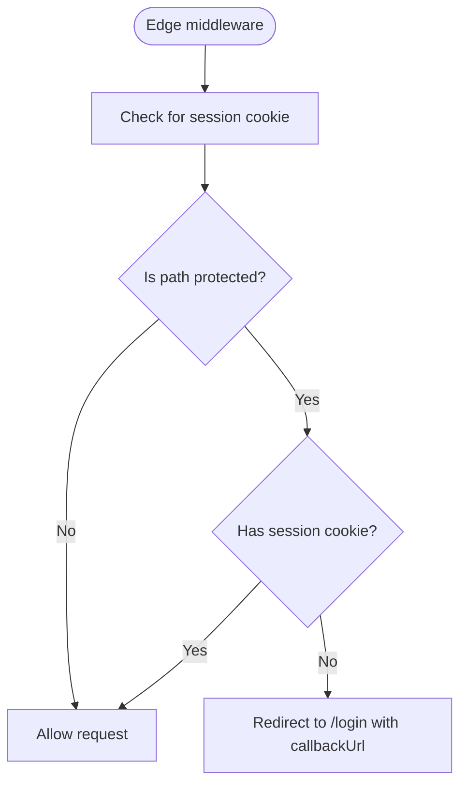
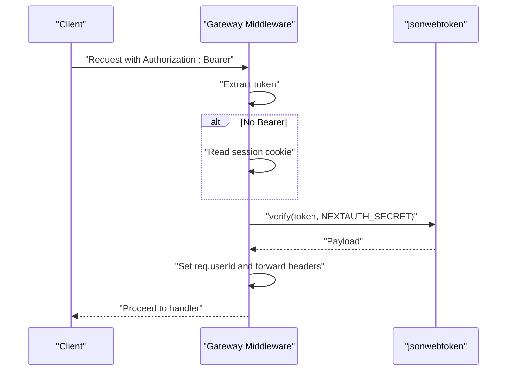
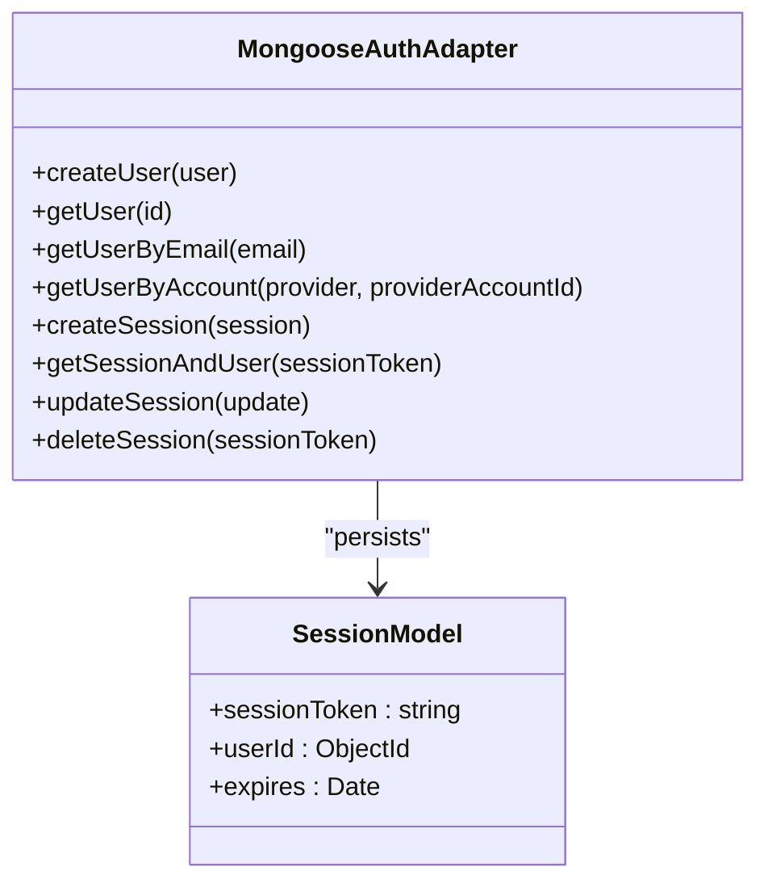
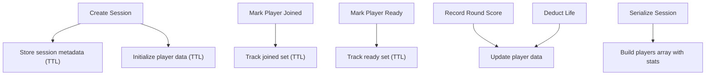
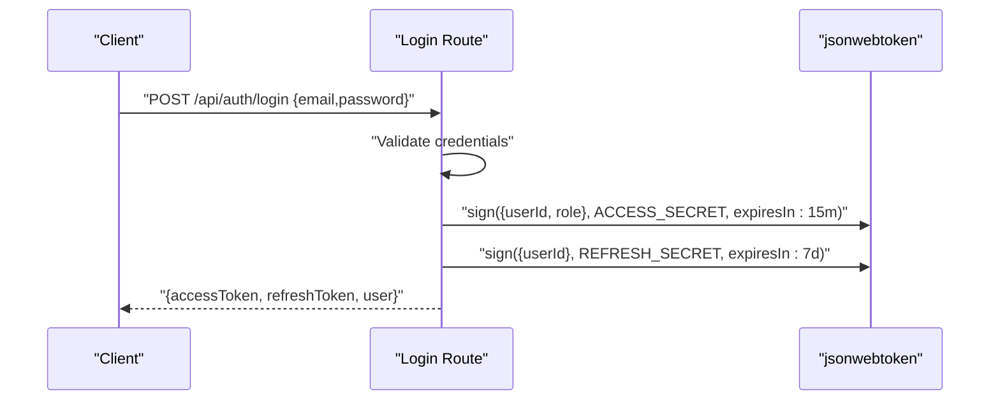
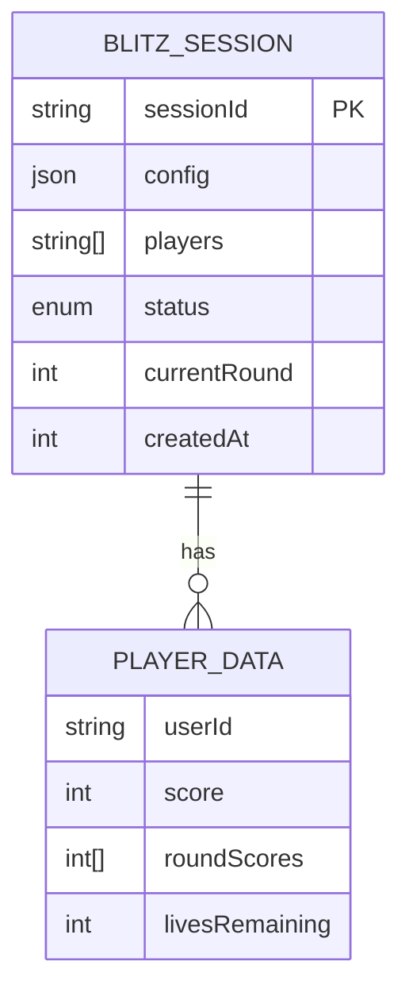
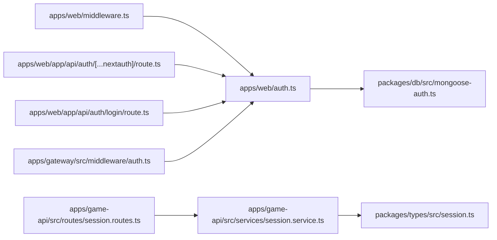

# Session Management & Persistence

<cite>
**Referenced Files in This Document**
- [apps/web/auth.ts](file://apps/web/auth.ts)
- [apps/web/auth.config.ts](file://apps/web/auth.config.ts)
- [apps/web/middleware.ts](file://apps/web/middleware.ts)
- [apps/web/app/api/auth/[...nextauth]/route.ts](file://apps/web/app/api/auth/[...nextauth]/route.ts)
- [apps/web/app/api/auth/login/route.ts](file://apps/web/app/api/auth/login/route.ts)
- [packages/db/src/mongoose-auth.ts](file://packages/db/src/mongoose-auth.ts)
- [apps/gateway/src/middleware/auth.ts](file://apps/gateway/src/middleware/auth.ts)
- [apps/game-api/src/services/session.service.ts](file://apps/game-api/src/services/session.service.ts)
- [apps/game-api/src/routes/session.routes.ts](file://apps/game-api/src/routes/session.routes.ts)
- [packages/types/src/session.ts](file://packages/types/src/session.ts)
- [.env.example](file://.env.example)
</cite>

## Table of Contents
1. [Introduction](#introduction)
2. [Project Structure](#project-structure)
3. [Core Components](#core-components)
4. [Architecture Overview](#architecture-overview)
5. [Detailed Component Analysis](#detailed-component-analysis)
6. [Dependency Analysis](#dependency-analysis)
7. [Performance Considerations](#performance-considerations)
8. [Troubleshooting Guide](#troubleshooting-guide)
9. [Conclusion](#conclusion)
10. [Appendices](#appendices)

## Introduction
This document explains session management and persistence in the Logic Forge authentication system. It covers the JWT strategy implementation, session token handling, and user data embedding in JWT payloads. It also documents session callback mechanisms, token refresh processes, session persistence across requests, middleware protection for routes and API endpoints (including Edge runtime compatibility), access token generation for API gateway authentication, JWT signing with custom claims, token expiration handling, and integration with the API gateway. Security considerations, token validation, and session cleanup procedures are addressed.

## Project Structure
The authentication system spans three primary areas:
- Web application (Next.js) with NextAuth.js for OAuth and session management
- Express gateway with JWT middleware for API protection
- Game API with Redis-backed session persistence for match-making and live sessions

**Diagram sources**
- [apps/web/auth.ts](file://apps/web/auth.ts#L59-L171)
- [apps/web/middleware.ts](file://apps/web/middleware.ts#L8-L34)
- [apps/web/app/api/auth/[...nextauth]/route.ts](file://apps/web/app/api/auth/[...nextauth]/route.ts#L1-L5)
- [apps/web/app/api/auth/login/route.ts](file://apps/web/app/api/auth/login/route.ts#L1-L79)
- [packages/db/src/mongoose-auth.ts](file://packages/db/src/mongoose-auth.ts#L158-L285)
- [apps/gateway/src/middleware/auth.ts](file://apps/gateway/src/middleware/auth.ts#L18-L64)
- [apps/game-api/src/services/session.service.ts](file://apps/game-api/src/services/session.service.ts#L18-L166)
- [apps/game-api/src/routes/session.routes.ts](file://apps/game-api/src/routes/session.routes.ts#L1-L38)
- [packages/types/src/session.ts](file://packages/types/src/session.ts#L40-L54)

**Section sources**
- [apps/web/auth.ts](file://apps/web/auth.ts#L59-L171)
- [apps/web/middleware.ts](file://apps/web/middleware.ts#L8-L34)
- [apps/web/app/api/auth/[...nextauth]/route.ts](file://apps/web/app/api/auth/[...nextauth]/route.ts#L1-L5)
- [apps/web/app/api/auth/login/route.ts](file://apps/web/app/api/auth/login/route.ts#L1-L79)
- [packages/db/src/mongoose-auth.ts](file://packages/db/src/mongoose-auth.ts#L158-L285)
- [apps/gateway/src/middleware/auth.ts](file://apps/gateway/src/middleware/auth.ts#L18-L64)
- [apps/game-api/src/services/session.service.ts](file://apps/game-api/src/services/session.service.ts#L18-L166)
- [apps/game-api/src/routes/session.routes.ts](file://apps/game-api/src/routes/session.routes.ts#L1-L38)
- [packages/types/src/session.ts](file://packages/types/src/session.ts#L40-L54)

## Core Components
- NextAuth.js configuration and JWT callbacks in the web app
- Edge-compatible middleware for route protection
- Express gateway middleware for JWT validation and forwarding
- Database adapter for NextAuth session persistence
- Game API session service backed by Redis
- Login route for short-lived access tokens and refresh tokens

Key responsibilities:
- JWT strategy with embedded user data
- Session cookie handling and Edge runtime compatibility
- Access token exposure for gateway calls
- Redis-backed session lifecycle for game play
- Secure cookie configuration and token signing

**Section sources**
- [apps/web/auth.ts](file://apps/web/auth.ts#L59-L171)
- [apps/web/middleware.ts](file://apps/web/middleware.ts#L8-L34)
- [apps/gateway/src/middleware/auth.ts](file://apps/gateway/src/middleware/auth.ts#L18-L64)
- [packages/db/src/mongoose-auth.ts](file://packages/db/src/mongoose-auth.ts#L158-L285)
- [apps/game-api/src/services/session.service.ts](file://apps/game-api/src/services/session.service.ts#L18-L166)
- [apps/web/app/api/auth/login/route.ts](file://apps/web/app/api/auth/login/route.ts#L42-L69)

## Architecture Overview
The system uses a hybrid approach:
- NextAuth.js manages OAuth and stores sessions in MongoDB via a Mongoose adapter
- JWT strategy embeds user data into the token payload
- Edge middleware performs lightweight checks; full verification occurs in Node.js and the gateway
- The gateway validates JWTs and forwards identity to downstream services
- Redis persists game session state for match-making and live rounds

**Diagram sources**
- [apps/web/middleware.ts](file://apps/web/middleware.ts#L8-L34)
- [apps/web/auth.ts](file://apps/web/auth.ts#L59-L171)
- [packages/db/src/mongoose-auth.ts](file://packages/db/src/mongoose-auth.ts#L254-L285)
- [apps/gateway/src/middleware/auth.ts](file://apps/gateway/src/middleware/auth.ts#L18-L64)
- [apps/game-api/src/routes/session.routes.ts](file://apps/game-api/src/routes/session.routes.ts#L19-L35)

## Detailed Component Analysis

### NextAuth.js JWT Strategy and Callbacks
- Strategy: JWT
- Cookies: Host-only, path "/", SameSite lax; secure in production
- Embedding user data: The JWT callback adds user identifiers and display attributes
- Session callback: Re-signs a custom access token with a 30-day TTL and exposes it to the client
- Redirect callback: Ensures redirects land on the canonical origin

**Diagram sources**
- [apps/web/auth.ts](file://apps/web/auth.ts#L124-L153)

**Section sources**
- [apps/web/auth.ts](file://apps/web/auth.ts#L59-L171)

### Edge Runtime Middleware Compatibility
- Edge middleware checks for session cookies and redirects unauthenticated users to the login page
- It avoids heavy cryptographic operations in Edge; full verification is deferred to Node.js and the gateway
- Cookie names are normalized for development and production environments

**Diagram sources**
- [apps/web/middleware.ts](file://apps/web/middleware.ts#L8-L34)

**Section sources**
- [apps/web/middleware.ts](file://apps/web/middleware.ts#L8-L34)
- [apps/web/auth.config.ts](file://apps/web/auth.config.ts#L34-L55)

### Express Gateway Authentication Middleware
- Validates Authorization: Bearer tokens using NEXTAUTH_SECRET
- Falls back to session cookie values if Bearer is absent
- Injects x-user-id and x-user-email headers for downstream services
- Skips validation for public endpoints (health and NextAuth callbacks)

**Diagram sources**
- [apps/gateway/src/middleware/auth.ts](file://apps/gateway/src/middleware/auth.ts#L18-L64)

**Section sources**
- [apps/gateway/src/middleware/auth.ts](file://apps/gateway/src/middleware/auth.ts#L18-L64)

### Database Adapter for Session Persistence
- Provides NextAuth adapter functions for users, accounts, and sessions
- Stores sessions in MongoDB with sessionToken uniqueness and expiry
- Retrieves session and user together for verification

**Diagram sources**
- [packages/db/src/mongoose-auth.ts](file://packages/db/src/mongoose-auth.ts#L158-L285)

**Section sources**
- [packages/db/src/mongoose-auth.ts](file://packages/db/src/mongoose-auth.ts#L158-L285)

### Game API Session Service (Redis-backed)
- Manages game sessions with TTL, player tracking, readiness, and pending matches
- Persists per-player scores and lives
- Serializes session data for downstream consumers

**Diagram sources**
- [apps/game-api/src/services/session.service.ts](file://apps/game-api/src/services/session.service.ts#L18-L166)

**Section sources**
- [apps/game-api/src/services/session.service.ts](file://apps/game-api/src/services/session.service.ts#L18-L166)
- [packages/types/src/session.ts](file://packages/types/src/session.ts#L40-L54)

### Login Route (Short-lived Access Tokens)
- Generates a short-lived access token (e.g., 15 minutes) and a refresh token (e.g., 7 days)
- Uses separate secrets for access and refresh tokens
- Returns user identity alongside tokens

**Diagram sources**
- [apps/web/app/api/auth/login/route.ts](file://apps/web/app/api/auth/login/route.ts#L42-L69)

**Section sources**
- [apps/web/app/api/auth/login/route.ts](file://apps/web/app/api/auth/login/route.ts#L1-L79)
- [.env.example](file://.env.example#L23-L25)

### Session Data Structures
- BlitzSession: Includes identifiers, configuration, players, status, round, and creation timestamp
- Player data: Tracks score, round scores, and lives remaining
- Waiting room entries: Queue metadata for match-making

**Diagram sources**
- [apps/game-api/src/services/session.service.ts](file://apps/game-api/src/services/session.service.ts#L9-L16)
- [packages/types/src/session.ts](file://packages/types/src/session.ts#L40-L47)

**Section sources**
- [apps/game-api/src/services/session.service.ts](file://apps/game-api/src/services/session.service.ts#L9-L16)
- [packages/types/src/session.ts](file://packages/types/src/session.ts#L40-L47)

## Dependency Analysis
- Web app depends on NextAuth.js and the Mongoose adapter for session persistence
- Gateway middleware depends on NEXTAUTH_SECRET for JWT verification
- Game API depends on Redis for session state and types for payload validation
- Login route depends on JWT libraries and environment secrets

**Diagram sources**
- [apps/web/auth.ts](file://apps/web/auth.ts#L59-L171)
- [packages/db/src/mongoose-auth.ts](file://packages/db/src/mongoose-auth.ts#L158-L285)
- [apps/web/middleware.ts](file://apps/web/middleware.ts#L8-L34)
- [apps/web/app/api/auth/[...nextauth]/route.ts](file://apps/web/app/api/auth/[...nextauth]/route.ts#L1-L5)
- [apps/web/app/api/auth/login/route.ts](file://apps/web/app/api/auth/login/route.ts#L1-L79)
- [apps/gateway/src/middleware/auth.ts](file://apps/gateway/src/middleware/auth.ts#L18-L64)
- [apps/game-api/src/routes/session.routes.ts](file://apps/game-api/src/routes/session.routes.ts#L1-L38)
- [apps/game-api/src/services/session.service.ts](file://apps/game-api/src/services/session.service.ts#L18-L166)
- [packages/types/src/session.ts](file://packages/types/src/session.ts#L40-L54)

**Section sources**
- [apps/web/auth.ts](file://apps/web/auth.ts#L59-L171)
- [apps/gateway/src/middleware/auth.ts](file://apps/gateway/src/middleware/auth.ts#L18-L64)
- [apps/game-api/src/services/session.service.ts](file://apps/game-api/src/services/session.service.ts#L18-L166)

## Performance Considerations
- JWT strategy reduces database lookups for protected routes; Edge middleware avoids heavy crypto
- Redis TTLs prevent memory leaks for game sessions; sets track joined/ready participants efficiently
- MongoDB session storage leverages indexes for sessionToken and provider account lookups
- Short-lived access tokens reduce exposure windows; refresh tokens enable seamless renewal

## Troubleshooting Guide
Common issues and resolutions:
- Missing NEXTAUTH_SECRET or MONGO_URL: The web app logs warnings during startup; ensure environment variables are present
- Edge middleware redirect loops: Verify cookie names and protected paths; ensure canonical NEXTAUTH_URL is configured
- Gateway unauthorized errors: Confirm Authorization header uses Bearer token; ensure NEXTAUTH_SECRET matches the web app
- Session not found in Redis: Check TTLs and keyspace; ensure session creation precedes updates
- Login failures: Validate credentials and secrets; confirm JWT library availability and correct secret usage

**Section sources**
- [apps/web/auth.ts](file://apps/web/auth.ts#L37-L44)
- [apps/web/middleware.ts](file://apps/web/middleware.ts#L8-L34)
- [apps/gateway/src/middleware/auth.ts](file://apps/gateway/src/middleware/auth.ts#L47-L63)
- [apps/game-api/src/services/session.service.ts](file://apps/game-api/src/services/session.service.ts#L33-L43)
- [apps/web/app/api/auth/login/route.ts](file://apps/web/app/api/auth/login/route.ts#L71-L78)

## Conclusion
Logic Forge’s authentication system combines NextAuth.js with a JWT strategy and Redis-backed game sessions. Edge middleware provides lightweight protection, while Node.js and the gateway handle robust verification. The web app embeds user data into JWTs and exposes a long-lived access token for gateway calls. The gateway validates tokens and forwards identity to downstream services. Redis persists game session state with TTLs and efficient set operations. Environment variables define secrets and URLs, ensuring secure and scalable operation.

## Appendices

### Environment Variables
- NEXTAUTH_SECRET: Used by NextAuth.js and the gateway for JWT verification
- NEXTAUTH_URL: Canonical URL for redirects and cookie scoping
- MONGO_URL: MongoDB connection string for session persistence
- JWT_SECRET and REFRESH_SECRET: Used by the login route for short-lived and refresh tokens

**Section sources**
- [.env.example](file://.env.example#L21-L25)
- [.env.example](file://.env.example#L9-L11)
- [.env.example](file://.env.example#L58-L62)
- [apps/web/app/api/auth/login/route.ts](file://apps/web/app/api/auth/login/route.ts#L42-L69)