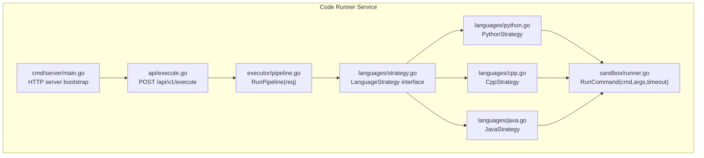
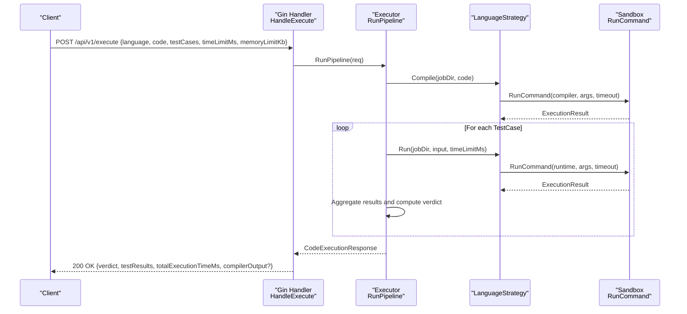
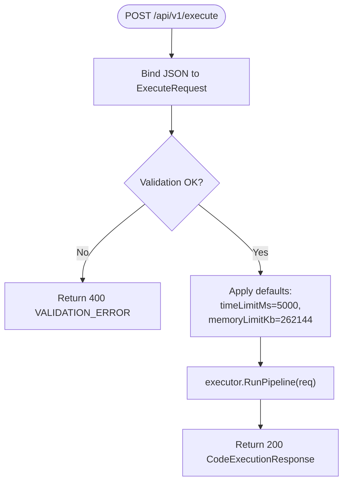
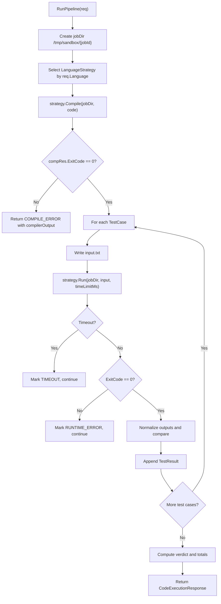
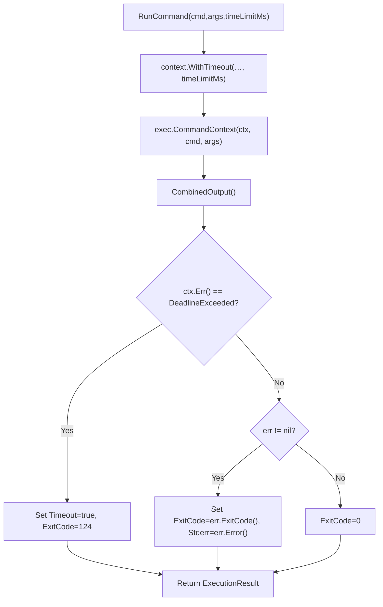
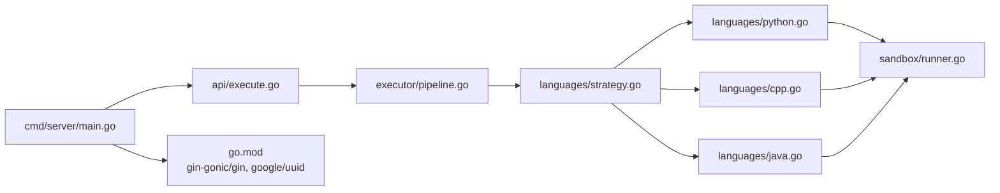

# Code Execution Service

<cite>
**Referenced Files in This Document**
- [main.go](file://apps/code-runner/cmd/server/main.go)
- [execute.go](file://apps/code-runner/api/execute.go)
- [pipeline.go](file://apps/code-runner/executor/pipeline.go)
- [strategy.go](file://apps/code-runner/languages/strategy.go)
- [python.go](file://apps/code-runner/languages/python.go)
- [cpp.go](file://apps/code-runner/languages/cpp.go)
- [java.go](file://apps/code-runner/languages/java.go)
- [runner.go](file://apps/code-runner/sandbox/runner.go)
- [Dockerfile](file://apps/code-runner/Dockerfile)
- [go.mod](file://apps/code-runner/go.mod)
- [rate-limit.ts](file://apps/gateway/src/middleware/rate-limit.ts)
- [index.ts](file://packages/config/src/index.ts)
</cite>

## Table of Contents
1. [Introduction](#introduction)
2. [Project Structure](#project-structure)
3. [Core Components](#core-components)
4. [Architecture Overview](#architecture-overview)
5. [Detailed Component Analysis](#detailed-component-analysis)
6. [Dependency Analysis](#dependency-analysis)
7. [Performance Considerations](#performance-considerations)
8. [Troubleshooting Guide](#troubleshooting-guide)
9. [Conclusion](#conclusion)
10. [Appendices](#appendices)

## Introduction
This document describes the Code Execution Service responsible for securely compiling and executing user-submitted code across Python, C++, and Java. It covers the Go-based HTTP server, API endpoints, execution pipeline, language-specific strategies, sandboxing, resource limits, timeouts, and integration patterns with the broader platform. It also outlines security considerations, performance optimization, and debugging techniques.

## Project Structure
The service is implemented as a Go module with a Gin-based HTTP server exposing a single endpoint to execute code. The execution pipeline is language-agnostic and delegates to language-specific strategies that compile and run code inside a sandboxed environment.

**Diagram sources**
- [main.go](file://apps/code-runner/cmd/server/main.go#L12-L38)
- [execute.go](file://apps/code-runner/api/execute.go#L13-L53)
- [pipeline.go](file://apps/code-runner/executor/pipeline.go#L45-L163)
- [strategy.go](file://apps/code-runner/languages/strategy.go#L10-L24)
- [python.go](file://apps/code-runner/languages/python.go#L7-L26)
- [cpp.go](file://apps/code-runner/languages/cpp.go#L9-L34)
- [java.go](file://apps/code-runner/languages/java.go#L9-L35)
- [runner.go](file://apps/code-runner/sandbox/runner.go#L19-L55)

**Section sources**
- [main.go](file://apps/code-runner/cmd/server/main.go#L12-L38)
- [go.mod](file://apps/code-runner/go.mod#L1-L8)

## Core Components
- HTTP Server and Routes
  - Health check endpoint: GET /api/v1/health
  - Execution endpoint: POST /api/v1/execute
- Request Handling
  - Validates JSON payload and applies defaults for time and memory limits
  - Delegates execution to the unified pipeline
- Execution Pipeline
  - Creates a temporary job workspace
  - Selects language strategy by uppercase language tag
  - Compiles code (when applicable)
  - Runs test cases with per-case execution and aggregates results
  - Computes overall verdict and total execution time
- Language Strategies
  - Python: writes main.py and runs via python3 with stdin from input.txt
  - C++: compiles main.cpp to a.out with flags and runs with stdin
  - Java: compiles Main.java and runs Main with stdin
- Sandbox Execution
  - Executes commands with a configurable timeout using context cancellation
  - Captures combined output and exit code
  - Marks timeout with a standard exit code

**Section sources**
- [execute.go](file://apps/code-runner/api/execute.go#L13-L53)
- [pipeline.go](file://apps/code-runner/executor/pipeline.go#L45-L163)
- [python.go](file://apps/code-runner/languages/python.go#L9-L26)
- [cpp.go](file://apps/code-runner/languages/cpp.go#L11-L34)
- [java.go](file://apps/code-runner/languages/java.go#L11-L35)
- [runner.go](file://apps/code-runner/sandbox/runner.go#L19-L55)

## Architecture Overview
The service exposes a single POST endpoint that accepts a structured request, validates it, and executes the code against a set of test cases. Results are returned as a unified response with verdict, per-test details, and timing metrics.

**Diagram sources**
- [execute.go](file://apps/code-runner/api/execute.go#L13-L53)
- [pipeline.go](file://apps/code-runner/executor/pipeline.go#L45-L163)
- [python.go](file://apps/code-runner/languages/python.go#L9-L26)
- [cpp.go](file://apps/code-runner/languages/cpp.go#L11-L34)
- [java.go](file://apps/code-runner/languages/java.go#L11-L35)
- [runner.go](file://apps/code-runner/sandbox/runner.go#L19-L55)

## Detailed Component Analysis

### HTTP Server and API Endpoints
- Health check: GET /api/v1/health returns service status
- Execute: POST /api/v1/execute
  - Request fields:
    - language: PYTHON, CPP, or JAVA
    - code: source code string
    - testCases: array of { input, expectedOutput }
    - timeLimitMs: optional millisecond limit per execution
    - memoryLimitKb: optional kilobyte memory limit (defaults applied if not provided)
  - Response fields:
    - verdict: one of CORRECT, INCORRECT, PARTIAL, TIMEOUT, RUNTIME_ERROR, COMPILE_ERROR
    - testResults: array of { passed, input, expectedOutput, actualOutput, executionTimeMs, memoryUsedKb }
    - totalExecutionTimeMs: sum of execution durations
    - compilerOutput: present when compilation fails

**Diagram sources**
- [execute.go](file://apps/code-runner/api/execute.go#L13-L53)

**Section sources**
- [execute.go](file://apps/code-runner/api/execute.go#L13-L53)
- [main.go](file://apps/code-runner/cmd/server/main.go#L18-L37)

### Execution Pipeline
- Workspace creation: unique job directory under /tmp/sandbox
- Strategy selection: PYTHON → PythonStrategy, CPP → CppStrategy, JAVA → JavaStrategy
- Compilation:
  - Python: write main.py (interpreted)
  - C++: g++ with -O2 -Wall -std=c++17 to produce a.out
  - Java: javac Main.java
- Test execution:
  - For each test case, write input.txt and run program with stdin
  - Aggregate per-case results and compute overall verdict
- Finalization:
  - Combine stdout/stderr into compilerOutput when compilation fails
  - Sum execution times across test cases

**Diagram sources**
- [pipeline.go](file://apps/code-runner/executor/pipeline.go#L45-L163)

**Section sources**
- [pipeline.go](file://apps/code-runner/executor/pipeline.go#L45-L163)

### Language-Specific Strategies

#### Python Strategy
- Compile: write code to main.py
- Run: python3 main.py < input.txt via shell

**Section sources**
- [python.go](file://apps/code-runner/languages/python.go#L9-L26)

#### C++ Strategy
- Compile: g++ -O2 -Wall -std=c++17 main.cpp -o a.out with 10s timeout
- Run: ./a.out < input.txt via shell

**Section sources**
- [cpp.go](file://apps/code-runner/languages/cpp.go#L11-L34)

#### Java Strategy
- Compile: javac Main.java with 10s timeout
- Run: java -cp jobDir Main < input.txt via shell

**Section sources**
- [java.go](file://apps/code-runner/languages/java.go#L11-L35)

### Sandbox Execution
- RunCommand executes a given command with a timeout derived from timeLimitMs
- Uses context cancellation to enforce timeout and returns a standard exit code for timeouts
- Captures combined output and exit code; sets Timeout flag when deadline exceeded

**Diagram sources**
- [runner.go](file://apps/code-runner/sandbox/runner.go#L19-L55)

**Section sources**
- [runner.go](file://apps/code-runner/sandbox/runner.go#L19-L55)

### Resource Limits and Memory Management
- Timeouts: enforced per execution via RunCommand with a configurable millisecond limit
- Memory limits: present in the request model but not enforced in the current implementation
- Compilation timeouts: fixed 10-second limit for C++ and Java compilation steps
- Output capture: combined stdout/stderr for simplicity; consider splitting in production for richer diagnostics

**Section sources**
- [pipeline.go](file://apps/code-runner/executor/pipeline.go#L28-L33)
- [runner.go](file://apps/code-runner/sandbox/runner.go#L21-L30)
- [cpp.go](file://apps/code-runner/languages/cpp.go#L20-L21)
- [java.go](file://apps/code-runner/languages/java.go#L21-L22)

### Sandbox Implementation and Security
- Containerization: the service runs inside an Alpine Linux container with Python, JDK, GCC, and Bash installed
- Filesystem isolation: jobs are written to /tmp/sandbox with broad permissions; cleanup occurs after execution
- Command execution: all invocations run via shell; input is piped from input.txt to the target program’s stdin
- Security considerations:
  - Restrict filesystem permissions and mount policies in production
  - Enforce memory limits using OS-level controls or container constraints
  - Sanitize and validate all inputs and filenames
  - Consider chroot or namespace-based isolation for stronger separation
  - Add network restrictions and resource quotas

**Section sources**
- [Dockerfile](file://apps/code-runner/Dockerfile#L11-L30)
- [strategy.go](file://apps/code-runner/languages/strategy.go#L15-L24)
- [runner.go](file://apps/code-runner/sandbox/runner.go#L24-L29)

### Integration Patterns
- Client integration:
  - Send POST to /api/v1/execute with language, code, testCases, and optional timeLimitMs/memoryLimitKb
  - Consume unified response to render verdict and per-test feedback
- Inter-service configuration:
  - The gateway exposes a dedicated rate limiter for the code runner
  - The frontend configuration defines the host and port for the code runner service

**Section sources**
- [execute.go](file://apps/code-runner/api/execute.go#L13-L53)
- [rate-limit.ts](file://apps/gateway/src/middleware/rate-limit.ts#L74-L79)
- [index.ts](file://packages/config/src/index.ts#L33-L37)

## Dependency Analysis
The service relies on Gin for HTTP routing and Google UUID for job identifiers. The execution pipeline depends on language strategies and the sandbox runner.

**Diagram sources**
- [main.go](file://apps/code-runner/cmd/server/main.go#L3-L9)
- [execute.go](file://apps/code-runner/api/execute.go#L3-L8)
- [pipeline.go](file://apps/code-runner/executor/pipeline.go#L3-L11)
- [strategy.go](file://apps/code-runner/languages/strategy.go#L3-L7)
- [python.go](file://apps/code-runner/languages/python.go#L3-L4)
- [cpp.go](file://apps/code-runner/languages/cpp.go#L3-L6)
- [java.go](file://apps/code-runner/languages/java.go#L3-L6)
- [runner.go](file://apps/code-runner/sandbox/runner.go#L3-L7)
- [go.mod](file://apps/code-runner/go.mod#L5-L8)

**Section sources**
- [go.mod](file://apps/code-runner/go.mod#L1-L8)

## Performance Considerations
- Compilation flags: C++ builds with -O2 and -Wall for optimized and safer binaries
- Per-test execution: keep timeLimitMs tight to prevent long-running executions
- Output handling: combine stdout/stderr for simplicity; consider separate streams for richer diagnostics
- Cleanup: automatic removal of job directories reduces disk pressure
- Container runtime: Alpine base keeps image small; ensure CPU and memory quotas are enforced at the orchestration layer

[No sources needed since this section provides general guidance]

## Troubleshooting Guide
Common issues and remedies:
- Validation errors: ensure language is one of PYTHON, CPP, JAVA and testCases contains expectedOutput for each item
- Compilation failures: inspect compilerOutput for syntax or build errors
- Runtime errors: review actualOutput for stack traces or incorrect output
- Timeouts: increase timeLimitMs or optimize code; confirm input sizes are reasonable
- Internal errors: check server logs for critical failures during pipeline execution

Operational checks:
- Verify service health endpoint responds with status ok
- Confirm environment variable PORT_CODE_RUNNER is set appropriately
- Review gateway rate limiting configuration if clients hit 429 Too Many Requests

**Section sources**
- [execute.go](file://apps/code-runner/api/execute.go#L15-L25)
- [pipeline.go](file://apps/code-runner/executor/pipeline.go#L75-L82)
- [runner.go](file://apps/code-runner/sandbox/runner.go#L37-L41)
- [rate-limit.ts](file://apps/gateway/src/middleware/rate-limit.ts#L48-L56)

## Conclusion
The Code Execution Service provides a robust, extensible foundation for secure code evaluation across Python, C++, and Java. Its modular design separates concerns between HTTP handling, execution orchestration, language strategies, and sandbox execution. While the current implementation focuses on timeouts and basic resource defaults, production deployments should incorporate stricter memory limits, container-level quotas, and hardened filesystem/network policies.

[No sources needed since this section summarizes without analyzing specific files]

## Appendices

### Supported Languages and Execution Parameters
- Languages: PYTHON, CPP, JAVA
- Execution parameters:
  - language: required
  - code: required
  - testCases: required array of { input, expectedOutput }
  - timeLimitMs: optional default 5000 ms
  - memoryLimitKb: optional default 262144 KB

**Section sources**
- [pipeline.go](file://apps/code-runner/executor/pipeline.go#L32-L43)
- [execute.go](file://apps/code-runner/api/execute.go#L28-L33)

### Example Request Payload
- language: "PYTHON"
- code: "<source code>"
- testCases:
  - { input: "<stdin>", expectedOutput: "<expected>" }
  - { input: "<stdin>", expectedOutput: "<expected>" }
- timeLimitMs: 5000
- memoryLimitKb: 262144

**Section sources**
- [execute.go](file://apps/code-runner/api/execute.go#L13-L53)

### Example Response Fields
- verdict: "CORRECT" | "INCORRECT" | "PARTIAL" | "TIMEOUT" | "RUNTIME_ERROR" | "COMPILE_ERROR"
- testResults:
  - { passed, input, expectedOutput, actualOutput, executionTimeMs, memoryUsedKb }
- totalExecutionTimeMs: number
- compilerOutput: string? (present on compilation failure)

**Section sources**
- [pipeline.go](file://apps/code-runner/executor/pipeline.go#L14-L29)