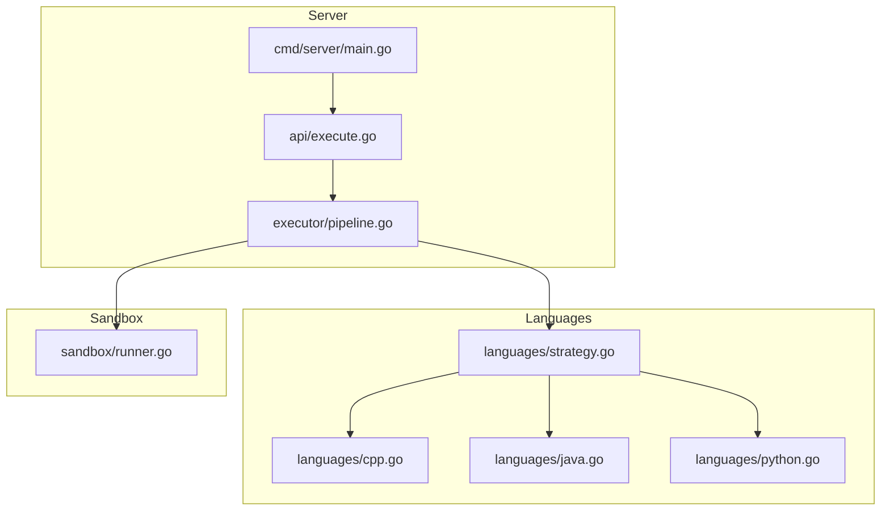
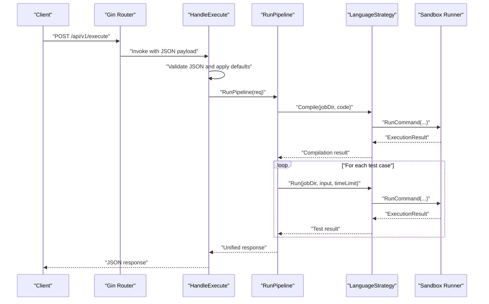
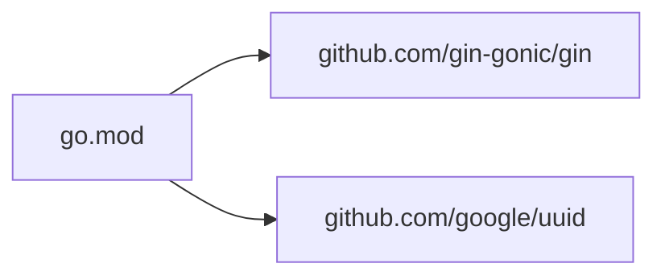

# Go Server Architecture

<cite>
**Referenced Files in This Document**
- [main.go](file://apps/code-runner/cmd/server/main.go)
- [execute.go](file://apps/code-runner/api/execute.go)
- [pipeline.go](file://apps/code-runner/executor/pipeline.go)
- [strategy.go](file://apps/code-runner/languages/strategy.go)
- [cpp.go](file://apps/code-runner/languages/cpp.go)
- [java.go](file://apps/code-runner/languages/java.go)
- [python.go](file://apps/code-runner/languages/python.go)
- [runner.go](file://apps/code-runner/sandbox/runner.go)
- [go.mod](file://apps/code-runner/go.mod)
- [Dockerfile](file://apps/code-runner/Dockerfile)
</cite>

## Table of Contents
1. [Introduction](#introduction)
2. [Project Structure](#project-structure)
3. [Core Components](#core-components)
4. [Architecture Overview](#architecture-overview)
5. [Detailed Component Analysis](#detailed-component-analysis)
6. [Dependency Analysis](#dependency-analysis)
7. [Performance Considerations](#performance-considerations)
8. [Troubleshooting Guide](#troubleshooting-guide)
9. [Conclusion](#conclusion)
10. [Appendices](#appendices)

## Introduction
This document describes the Go-based server architecture for the Code Execution Service. It focuses on the Gin-Gonic web framework implementation, HTTP routing configuration, middleware behavior, environment-driven port binding, health checks, REST API design patterns, server startup procedures, logging configuration, error handling strategies, and performance considerations. The service exposes a single primary endpoint for executing code submissions against test cases and provides a lightweight health check for inter-service monitoring.

## Project Structure
The Code Execution Service is organized into a small set of focused packages:
- cmd/server: Application entry point and HTTP server bootstrap
- api: HTTP handler for the execution endpoint
- executor: Unified pipeline orchestrating compile/run phases per language
- languages: Language-specific strategies implementing compile/run
- sandbox: Low-level command execution with timeouts and resource boundaries
- go.mod: Module definition and dependencies

**Diagram sources**
- [main.go](file://apps/code-runner/cmd/server/main.go#L12-L38)
- [execute.go](file://apps/code-runner/api/execute.go#L13-L53)
- [pipeline.go](file://apps/code-runner/executor/pipeline.go#L45-L163)
- [strategy.go](file://apps/code-runner/languages/strategy.go#L10-L18)
- [cpp.go](file://apps/code-runner/languages/cpp.go#L9-L34)
- [java.go](file://apps/code-runner/languages/java.go#L9-L35)
- [python.go](file://apps/code-runner/languages/python.go#L7-L26)
- [runner.go](file://apps/code-runner/sandbox/runner.go#L20-L55)

**Section sources**
- [main.go](file://apps/code-runner/cmd/server/main.go#L12-L38)
- [go.mod](file://apps/code-runner/go.mod#L1-L8)

## Core Components
- Gin router initialization and release-mode logging
- Health check endpoint for inter-service monitoring
- Execute endpoint bound to a handler that validates requests, applies defaults, logs execution intent, and delegates to the executor pipeline
- Executor pipeline that creates a secure job workspace, selects a language strategy, compiles code, runs test cases, aggregates results, and returns a unified response
- Language strategies for Python, C++, and Java that implement compile/run contracts and write temporary files for execution
- Sandbox runner that executes commands with strict time limits and captures outputs and exit codes
- Environment-driven port binding with a sensible default

Key behaviors:
- Request validation and structured error responses
- Default resource limits applied when unspecified
- Unified response model for execution outcomes
- Temporary workspace cleanup after execution
- Timeouts surfaced as structured errors

**Section sources**
- [main.go](file://apps/code-runner/cmd/server/main.go#L12-L38)
- [execute.go](file://apps/code-runner/api/execute.go#L13-L53)
- [pipeline.go](file://apps/code-runner/executor/pipeline.go#L45-L163)
- [strategy.go](file://apps/code-runner/languages/strategy.go#L10-L18)
- [runner.go](file://apps/code-runner/sandbox/runner.go#L20-L55)

## Architecture Overview
The server follows a layered design:
- HTTP layer: Gin router registers routes and delegates to handlers
- API layer: Handlers validate payloads, apply defaults, and orchestrate execution
- Executor layer: Pipeline manages sandbox creation, strategy selection, compilation, and test execution
- Language layer: Strategies encapsulate compile/run logic per language
- Sandbox layer: Executes commands with timeouts and captures outputs

**Diagram sources**
- [main.go](file://apps/code-runner/cmd/server/main.go#L16-L27)
- [execute.go](file://apps/code-runner/api/execute.go#L13-L53)
- [pipeline.go](file://apps/code-runner/executor/pipeline.go#L45-L163)
- [strategy.go](file://apps/code-runner/languages/strategy.go#L10-L18)
- [runner.go](file://apps/code-runner/sandbox/runner.go#L20-L55)

## Detailed Component Analysis

### HTTP Server Bootstrap and Routing
- Gin is initialized in release mode for standard logging
- Health check endpoint responds with a simple JSON payload indicating service status
- Execute endpoint is registered to handle POST requests and delegates to the API handler
- Port binding reads from an environment variable with a fallback default

Operational notes:
- No custom middleware is configured; default Gin middleware stack is used
- Logging is handled via standard log package with formatted messages
- Graceful shutdown is not implemented in the current code

**Section sources**
- [main.go](file://apps/code-runner/cmd/server/main.go#L12-L38)

### API Handler: Execute Endpoint
Responsibilities:
- Bind incoming JSON to a typed request structure
- Validate payload and return structured error responses on failure
- Apply default time and memory limits when unspecified
- Log execution intent with language, number of test cases, and time limit
- Invoke the executor pipeline and return unified results or structured errors

Error handling:
- Validation failures return client error responses
- Critical pipeline failures return internal server error responses
- Timeout and runtime errors are captured and reflected in results

**Section sources**
- [execute.go](file://apps/code-runner/api/execute.go#L13-L53)

### Executor Pipeline
Core logic:
- Creates a unique job directory under a shared sandbox path and cleans up after completion
- Selects a language strategy based on the requested language identifier
- Compiles code using the selected strategy; returns early with compile errors if compilation fails
- Iterates over test cases, invoking the strategy’s run method with per-test time limits
- Aggregates results, computes overall verdict (CORRECT, PARTIAL, INCORRECT, TIMEOUT, RUNTIME_ERROR), and constructs a unified response
- Returns combined compiler output when present

Resource management:
- Temporary workspace is removed after execution
- Defaults for time and memory limits are applied at handler level

**Section sources**
- [pipeline.go](file://apps/code-runner/executor/pipeline.go#L45-L163)

### Language Strategies
Each strategy implements compile and run methods:
- PythonStrategy: Writes code to a Python file and executes via Python interpreter with input piped from a generated input file
- CppStrategy: Writes code to a C++ file, compiles with a fixed command and flags, and runs the compiled binary with input piped from the input file
- JavaStrategy: Writes code to a Java file named to match the public class, compiles with javac, and runs the class with input piped from the input file

Shared helpers:
- Utility functions write code and input files to the job directory

**Section sources**
- [strategy.go](file://apps/code-runner/languages/strategy.go#L10-L24)
- [python.go](file://apps/code-runner/languages/python.go#L7-L26)
- [cpp.go](file://apps/code-runner/languages/cpp.go#L9-L34)
- [java.go](file://apps/code-runner/languages/java.go#L9-L35)

### Sandbox Runner
Behavior:
- Executes commands with a configurable timeout using context cancellation
- Captures combined output and determines exit code
- Marks timeout conditions and standardizes exit codes
- Propagates non-timeout errors distinctly

Implications:
- Timeouts are surfaced as part of execution results
- Runtime errors are captured and included in test results

**Section sources**
- [runner.go](file://apps/code-runner/sandbox/runner.go#L20-L55)

### Health Check Endpoint
- Path: GET /api/v1/health
- Response: JSON object containing service status and service identity
- Purpose: Inter-service health probing

**Section sources**
- [main.go](file://apps/code-runner/cmd/server/main.go#L18-L24)

### REST API Design Patterns
- Versioned base path: /api/v1
- Single primary endpoint for execution: POST /api/v1/execute
- Structured error responses with nested error objects
- Unified response model for execution outcomes
- Explicit defaults for optional fields

**Section sources**
- [main.go](file://apps/code-runner/cmd/server/main.go#L26-L27)
- [execute.go](file://apps/code-runner/api/execute.go#L13-L53)
- [pipeline.go](file://apps/code-runner/executor/pipeline.go#L15-L43)

### Server Startup Procedures
- Gin mode set to release
- Router initialized with default middleware
- Routes registered for health and execute endpoints
- Port determined from environment variable with a default fallback
- Server started and logging indicates listening address

Graceful shutdown:
- Not implemented in the current code

**Section sources**
- [main.go](file://apps/code-runner/cmd/server/main.go#L12-L38)

### Logging Configuration
- Standard log package used for server lifecycle and execution logs
- Health check and execution intent logged at startup and during processing

**Section sources**
- [main.go](file://apps/code-runner/cmd/server/main.go#L34-L37)
- [execute.go](file://apps/code-runner/api/execute.go#L35-L35)

### Error Handling Strategies
- Request validation failures return client errors with structured details
- Pipeline failures return internal server errors with standardized codes
- Timeout and runtime errors are embedded in execution results
- Compilation failures short-circuit to a compile error verdict with captured output

**Section sources**
- [execute.go](file://apps/code-runner/api/execute.go#L15-L25)
- [pipeline.go](file://apps/code-runner/executor/pipeline.go#L75-L82)
- [runner.go](file://apps/code-runner/sandbox/runner.go#L37-L41)

### Examples

#### Example: API Endpoint Registration
- Route registration for health and execute endpoints occurs during server bootstrap.

**Section sources**
- [main.go](file://apps/code-runner/cmd/server/main.go#L18-L27)

#### Example: Request Processing Flow
- Client sends POST to execute endpoint
- Handler validates payload, applies defaults, logs intent
- Pipeline orchestrates compile/run per language strategy
- Results aggregated and returned to client

**Section sources**
- [execute.go](file://apps/code-runner/api/execute.go#L13-L53)
- [pipeline.go](file://apps/code-runner/executor/pipeline.go#L45-L163)

#### Example: Graceful Shutdown Mechanisms
- Not implemented in the current code

**Section sources**
- [main.go](file://apps/code-runner/cmd/server/main.go#L34-L37)

## Dependency Analysis
Module-level dependencies:
- Gin is used for HTTP routing and middleware
- UUID library supports unique job identifiers
- Internal packages form a clear layering: cmd/server -> api -> executor -> languages -> sandbox

**Diagram sources**
- [go.mod](file://apps/code-runner/go.mod#L5-L8)

**Section sources**
- [go.mod](file://apps/code-runner/go.mod#L1-L8)

## Performance Considerations
- Concurrency: The server does not configure a custom concurrency model; Gin’s default goroutine handling applies to incoming requests
- Timeouts: Execution timeouts are enforced per command via context cancellation; consider tuning time limits per workload
- Resource limits: Memory limits are not enforced at the OS level in the current implementation; only time limits apply
- Sandboxing: Uses a shared sandbox directory; ensure proper isolation and cleanup
- Scaling: The Dockerfile exposes a fixed port and installs language toolchains; horizontal scaling can be achieved by running multiple instances behind a load balancer

[No sources needed since this section provides general guidance]

## Troubleshooting Guide
Common issues and remedies:
- Health check failures: Verify the health endpoint path and ensure the server is listening on the expected port
- Execution failures: Confirm language support and toolchain availability; check that the sandbox directory exists and is writable
- Timeout errors: Increase time limits cautiously; review strategy-specific run commands and input piping
- Validation errors: Ensure the request payload matches the expected schema and required fields are present

**Section sources**
- [main.go](file://apps/code-runner/cmd/server/main.go#L18-L24)
- [execute.go](file://apps/code-runner/api/execute.go#L15-L25)
- [runner.go](file://apps/code-runner/sandbox/runner.go#L37-L41)

## Conclusion
The Code Execution Service provides a concise, layered architecture built around Gin for HTTP handling and a modular pipeline for code execution. It emphasizes simplicity, clear separation of concerns, and structured error handling. While the current implementation lacks advanced middleware and graceful shutdown, it offers a solid foundation for extending logging, adding rate limiting, implementing graceful shutdown, and introducing memory enforcement.

[No sources needed since this section summarizes without analyzing specific files]

## Appendices

### Environment Variables and Ports
- PORT_CODE_RUNNER: Server port; defaults to 3004 if unset

**Section sources**
- [main.go](file://apps/code-runner/cmd/server/main.go#L29-L32)

### Containerization Notes
- Multi-stage build produces a minimal runtime image
- Installs Python, Java, GCC, and Bash for language support
- Exposes the default port and sets the CMD to start the server

**Section sources**
- [Dockerfile](file://apps/code-runner/Dockerfile#L1-L31)