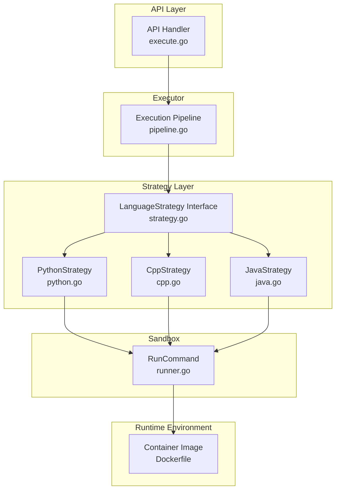
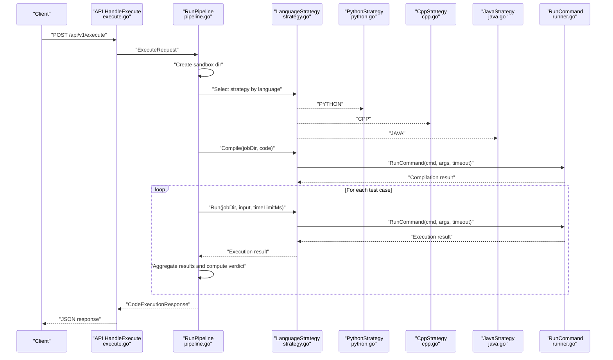
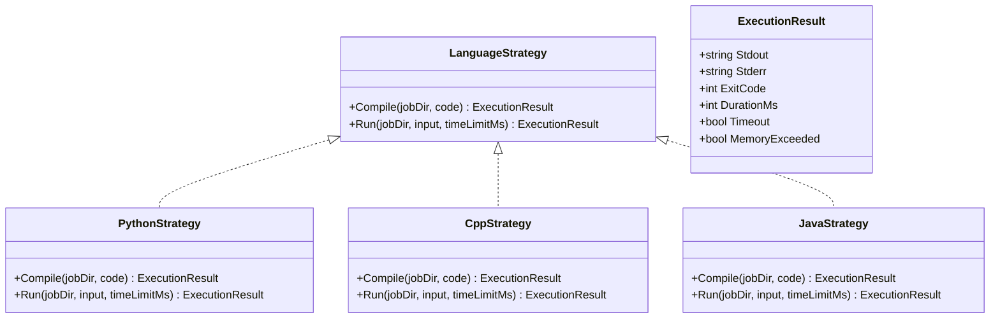
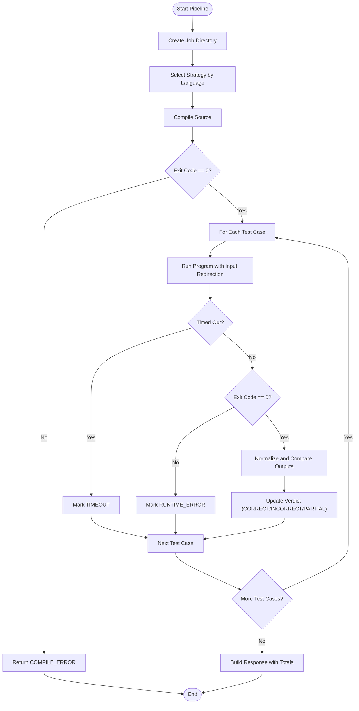
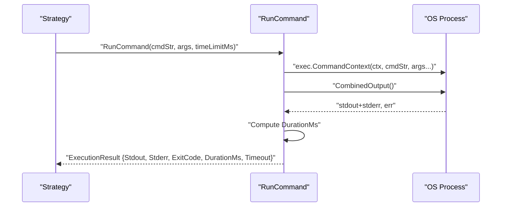
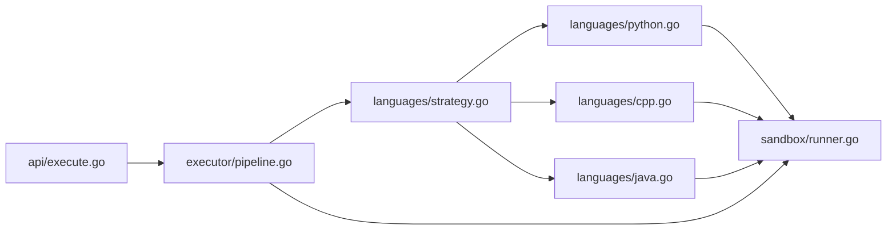

# Language Execution Strategies

<cite>
**Referenced Files in This Document**
- [strategy.go](file://apps/code-runner/languages/strategy.go)
- [python.go](file://apps/code-runner/languages/python.go)
- [cpp.go](file://apps/code-runner/languages/cpp.go)
- [java.go](file://apps/code-runner/languages/java.go)
- [pipeline.go](file://apps/code-runner/executor/pipeline.go)
- [runner.go](file://apps/code-runner/sandbox/runner.go)
- [execute.go](file://apps/code-runner/api/execute.go)
- [main.go](file://apps/code-runner/cmd/server/main.go)
- [Dockerfile](file://apps/code-runner/Dockerfile)
- [go.mod](file://apps/code-runner/go.mod)
</cite>

## Table of Contents
1. [Introduction](#introduction)
2. [Project Structure](#project-structure)
3. [Core Components](#core-components)
4. [Architecture Overview](#architecture-overview)
5. [Detailed Component Analysis](#detailed-component-analysis)
6. [Dependency Analysis](#dependency-analysis)
7. [Performance Considerations](#performance-considerations)
8. [Troubleshooting Guide](#troubleshooting-guide)
9. [Conclusion](#conclusion)
10. [Appendices](#appendices)

## Introduction
This document explains the language-specific execution strategies implemented in the Code Execution Service. It focuses on the strategy pattern used to support Python, C++, and Java, detailing compilation processes, runtime environments, execution contexts, interface contracts, configuration, and error handling. It also covers how to extend the system with new languages, security considerations, and performance characteristics.

## Project Structure
The Code Execution Service is implemented as a Go microservice with a clear separation of concerns:
- Strategy layer defines language-agnostic interfaces and language-specific implementations.
- Executor orchestrates compilation and execution across test cases.
- Sandbox encapsulates command execution with timeouts.
- API exposes a single endpoint to trigger executions.
- Dockerfile defines the runtime environment with installed compilers and runtimes.

**Diagram sources**
- [execute.go](file://apps/code-runner/api/execute.go#L13-L53)
- [pipeline.go](file://apps/code-runner/executor/pipeline.go#L45-L163)
- [strategy.go](file://apps/code-runner/languages/strategy.go#L10-L18)
- [python.go](file://apps/code-runner/languages/python.go#L7-L26)
- [cpp.go](file://apps/code-runner/languages/cpp.go#L9-L34)
- [java.go](file://apps/code-runner/languages/java.go#L9-L35)
- [runner.go](file://apps/code-runner/sandbox/runner.go#L19-L55)
- [Dockerfile](file://apps/code-runner/Dockerfile#L11-L20)

**Section sources**
- [main.go](file://apps/code-runner/cmd/server/main.go#L12-L38)
- [execute.go](file://apps/code-runner/api/execute.go#L13-L53)
- [pipeline.go](file://apps/code-runner/executor/pipeline.go#L45-L163)
- [strategy.go](file://apps/code-runner/languages/strategy.go#L10-L18)
- [runner.go](file://apps/code-runner/sandbox/runner.go#L19-L55)
- [Dockerfile](file://apps/code-runner/Dockerfile#L11-L20)

## Core Components
- LanguageStrategy interface: Defines the contract for compile and run operations.
- Language implementations:
  - PythonStrategy: Writes code to a .py file and executes via python3 with input redirection.
  - CppStrategy: Compiles with g++ using flags and produces an executable; runs with input redirection.
  - JavaStrategy: Compiles with javac expecting a Main.java file; runs with java -cp pointing to the working directory.
- Executor pipeline: Creates a secure sandbox workspace, selects the appropriate strategy, compiles, runs test cases, aggregates results, and computes verdicts.
- Sandbox runner: Executes commands with a configurable timeout and captures outputs and exit codes.
- API handler: Validates requests, applies defaults, and returns structured execution results.

Key responsibilities and interactions are shown in the architecture overview below.

**Section sources**
- [strategy.go](file://apps/code-runner/languages/strategy.go#L10-L18)
- [python.go](file://apps/code-runner/languages/python.go#L7-L26)
- [cpp.go](file://apps/code-runner/languages/cpp.go#L9-L34)
- [java.go](file://apps/code-runner/languages/java.go#L9-L35)
- [pipeline.go](file://apps/code-runner/executor/pipeline.go#L45-L163)
- [runner.go](file://apps/code-runner/sandbox/runner.go#L19-L55)
- [execute.go](file://apps/code-runner/api/execute.go#L13-L53)

## Architecture Overview
The execution flow follows a deterministic pipeline:
1. API receives a request and normalizes defaults.
2. Executor creates a temporary sandbox directory and selects a language strategy.
3. Strategy compiles code (when applicable) and returns a result.
4. For each test case, the strategy runs the compiled or interpreted program with input redirection.
5. Results are aggregated into a unified response with verdicts and timing metrics.

**Diagram sources**
- [execute.go](file://apps/code-runner/api/execute.go#L13-L53)
- [pipeline.go](file://apps/code-runner/executor/pipeline.go#L45-L163)
- [strategy.go](file://apps/code-runner/languages/strategy.go#L10-L18)
- [python.go](file://apps/code-runner/languages/python.go#L7-L26)
- [cpp.go](file://apps/code-runner/languages/cpp.go#L9-L34)
- [java.go](file://apps/code-runner/languages/java.go#L9-L35)
- [runner.go](file://apps/code-runner/sandbox/runner.go#L19-L55)

## Detailed Component Analysis

### Strategy Pattern and Interface Contract
- LanguageStrategy defines two methods:
  - Compile(jobDir, code): Returns an execution result and error.
  - Run(jobDir, input, timeLimitMs): Returns an execution result and error.
- Shared helpers:
  - WriteCodeFile(jobDir, filename, code): Writes source code to a file.
  - WriteInputFile(jobDir, input): Writes input to input.txt.

Implementation highlights:
- PythonStrategy: No compilation; writes main.py and runs via python3 with input redirected from input.txt.
- CppStrategy: Compiles with g++ using optimization and warning flags; produces a.out; runs with input redirection.
- JavaStrategy: Compiles with javac expecting Main.java; runs with java -cp set to the job directory.

**Diagram sources**
- [strategy.go](file://apps/code-runner/languages/strategy.go#L10-L18)
- [python.go](file://apps/code-runner/languages/python.go#L7-L26)
- [cpp.go](file://apps/code-runner/languages/cpp.go#L9-L34)
- [java.go](file://apps/code-runner/languages/java.go#L9-L35)
- [runner.go](file://apps/code-runner/sandbox/runner.go#L10-L17)

**Section sources**
- [strategy.go](file://apps/code-runner/languages/strategy.go#L10-L18)
- [python.go](file://apps/code-runner/languages/python.go#L7-L26)
- [cpp.go](file://apps/code-runner/languages/cpp.go#L9-L34)
- [java.go](file://apps/code-runner/languages/java.go#L9-L35)
- [runner.go](file://apps/code-runner/sandbox/runner.go#L10-L17)

### Python Strategy
- Compilation: Writes code to main.py; exit code indicates success.
- Runtime: Executes python3 with input redirected from input.txt.
- Supported versions: Python 3.x as installed in the container.
- Compiler flags/runtime options: None; relies on system python3.
- Security considerations: Input redirection via shell; ensure untrusted input sanitization at higher layers if accepting arbitrary user input beyond this service boundary.
- Resource requirements: Minimal; depends on interpreter availability.

**Section sources**
- [python.go](file://apps/code-runner/languages/python.go#L7-L26)
- [Dockerfile](file://apps/code-runner/Dockerfile#L15-L16)

### C++ Strategy
- Compilation: Uses g++ with optimization and warnings enabled, targeting C++17; produces a.out.
- Runtime: Executes a.out with input redirected from input.txt.
- Supported versions: C++17 standard; compiler flags include optimization and warnings.
- Compiler flags: Optimization level, warning flags, and standard selection are embedded in the strategy.
- Runtime options: None beyond the standard executable invocation.
- Security considerations: Executable produced by trusted compiler; input redirection via shell; restrict external filesystem access and enforce timeouts.
- Resource requirements: Compilation consumes CPU and memory; execution is lightweight.

**Section sources**
- [cpp.go](file://apps/code-runner/languages/cpp.go#L9-L34)
- [Dockerfile](file://apps/code-runner/Dockerfile#L19)

### Java Strategy
- Compilation: Uses javac on Main.java; expects a public class named Main.
- Runtime: Executes java -cp pointing to the job directory with Main as the entry class; input redirected from input.txt.
- Supported versions: Java 21 JRE/JDK as installed in the container.
- Compiler flags/runtime options: None; relies on standard javac and java invocations.
- Security considerations: Classpath isolation; input redirection via shell; ensure no unsafe JVM flags are introduced.
- Resource requirements: JDK installation increases footprint; runtime is typical for JVM startup.

**Section sources**
- [java.go](file://apps/code-runner/languages/java.go#L9-L35)
- [Dockerfile](file://apps/code-runner/Dockerfile#L17-L18)

### Execution Pipeline
- Workspace creation: Generates a unique job ID and creates a temporary directory under /tmp/sandbox.
- Strategy selection: Case-insensitive language selection among PYTHON, CPP, and JAVA.
- Compilation: Invokes strategy.Compile; if non-zero exit code, returns COMPILE_ERROR with combined compiler output.
- Test execution: Iterates over test cases, invoking strategy.Run for each; aggregates results and computes verdicts:
  - TIMEOUT: If the execution exceeds the time limit.
  - RUNTIME_ERROR: If the process exits with non-zero code.
  - INCORRECT/PARTIAL/CORRECT: Based on output equality and counts.
- Final response: Includes overall verdict, per-test results, total execution time, and optional compiler output.

**Diagram sources**
- [pipeline.go](file://apps/code-runner/executor/pipeline.go#L45-L163)

**Section sources**
- [pipeline.go](file://apps/code-runner/executor/pipeline.go#L45-L163)

### Sandbox Execution
- RunCommand executes a given command with a timeout context.
- Captures combined output and duration; marks timeout with a standard exit code.
- Propagates non-timeout errors and exit codes appropriately.

**Diagram sources**
- [runner.go](file://apps/code-runner/sandbox/runner.go#L19-L55)

**Section sources**
- [runner.go](file://apps/code-runner/sandbox/runner.go#L19-L55)

### API Integration
- Endpoint: POST /api/v1/execute accepts ExecuteRequest with language, code, test cases, and optional time/memory limits.
- Defaults: Applies sensible defaults if time or memory limits are not provided.
- Response: Returns a unified CodeExecutionResponse with verdict, per-test results, total time, and optional compiler output.

**Section sources**
- [execute.go](file://apps/code-runner/api/execute.go#L13-L53)
- [pipeline.go](file://apps/code-runner/executor/pipeline.go#L14-L44)

## Dependency Analysis
- Internal dependencies:
  - API depends on executor.
  - Executor depends on languages and sandbox.
  - Languages depend on sandbox.
- External dependencies:
  - Go runtime and libraries for HTTP routing and UUID generation.
  - Container image installs Python 3, OpenJDK 21, G++, and Bash.

**Diagram sources**
- [execute.go](file://apps/code-runner/api/execute.go#L8-L8)
- [pipeline.go](file://apps/code-runner/executor/pipeline.go#L10-L11)
- [strategy.go](file://apps/code-runner/languages/strategy.go#L7-L7)
- [python.go](file://apps/code-runner/languages/python.go#L4-L4)
- [cpp.go](file://apps/code-runner/languages/cpp.go#L6-L6)
- [java.go](file://apps/code-runner/languages/java.go#L6-L6)
- [runner.go](file://apps/code-runner/sandbox/runner.go#L4-L7)

**Section sources**
- [go.mod](file://apps/code-runner/go.mod#L5-L8)
- [Dockerfile](file://apps/code-runner/Dockerfile#L11-L20)

## Performance Considerations
- Timeouts:
  - Compilation timeout is fixed for C++ and Java strategies.
  - Execution timeout is controlled per-run via RunCommand and configurable per-request.
- Output handling:
  - Combined output simplifies parsing but may mix stdout/stderr; consider splitting in future iterations.
- Resource limits:
  - Memory limit is present in the request model but is not enforced in the current sandbox runner; consider integrating resource controls (e.g., ulimit, cgroups) for stricter guarantees.
- I/O:
  - Frequent file writes/read operations for code and input; ensure filesystem performance is adequate in deployment environments.

[No sources needed since this section provides general guidance]

## Troubleshooting Guide
Common issues and resolutions:
- Unsupported language:
  - Symptom: Immediate COMPILE_ERROR returned.
  - Cause: Language not in the supported set.
  - Resolution: Use PYTHON, CPP, or JAVA.
- Compilation failures:
  - Symptom: COMPILE_ERROR with compiler output.
  - Cause: Syntax errors or missing dependencies.
  - Resolution: Inspect compiler output and fix code.
- Runtime errors:
  - Symptom: RUNTIME_ERROR with combined output.
  - Cause: Exceptions, segmentation faults, or incorrect I/O redirection.
  - Resolution: Validate input format and program logic.
- Timeouts:
  - Symptom: TIMEOUT verdict for a test case.
  - Cause: Execution exceeded time limit.
  - Resolution: Optimize algorithm or increase time limit cautiously.
- Filesystem permissions:
  - Symptom: Failures creating/removing sandbox directories.
  - Cause: Incorrect permissions on /tmp/sandbox.
  - Resolution: Ensure directory exists and is writable.

**Section sources**
- [pipeline.go](file://apps/code-runner/executor/pipeline.go#L58-L67)
- [pipeline.go](file://apps/code-runner/executor/pipeline.go#L75-L82)
- [pipeline.go](file://apps/code-runner/executor/pipeline.go#L105-L115)
- [runner.go](file://apps/code-runner/sandbox/runner.go#L37-L41)

## Conclusion
The Code Execution Service cleanly separates language-specific execution logic behind a shared interface, enabling straightforward extension to new languages. The executor pipeline provides a robust orchestration layer with clear error handling and result aggregation. The containerized runtime ensures consistent availability of compilers and interpreters. Future enhancements could include stricter memory enforcement, richer output separation, and expanded language support through the established strategy pattern.

[No sources needed since this section summarizes without analyzing specific files]

## Appendices

### Adding a New Language Strategy
Steps to integrate a new language:
1. Define a new struct implementing LanguageStrategy in a dedicated file under languages/.
2. Implement Compile and Run methods:
   - Compile should write source files and return an execution result.
   - Run should execute the program with input redirection and apply the requested time limit.
3. Register the new strategy in the executor pipeline’s language selection switch.
4. Add the language runtime/compiler to the container image if not already present.
5. Update tests and validation logic as needed.

Example references:
- Strategy interface definition: [strategy.go](file://apps/code-runner/languages/strategy.go#L10-L13)
- Existing implementations: [python.go](file://apps/code-runner/languages/python.go#L7-L26), [cpp.go](file://apps/code-runner/languages/cpp.go#L9-L34), [java.go](file://apps/code-runner/languages/java.go#L9-L35)
- Pipeline registration: [pipeline.go](file://apps/code-runner/executor/pipeline.go#L57-L67)
- Container runtime additions: [Dockerfile](file://apps/code-runner/Dockerfile#L15-L20)

**Section sources**
- [strategy.go](file://apps/code-runner/languages/strategy.go#L10-L18)
- [python.go](file://apps/code-runner/languages/python.go#L7-L26)
- [cpp.go](file://apps/code-runner/languages/cpp.go#L9-L34)
- [java.go](file://apps/code-runner/languages/java.go#L9-L35)
- [pipeline.go](file://apps/code-runner/executor/pipeline.go#L57-L67)
- [Dockerfile](file://apps/code-runner/Dockerfile#L15-L20)

### Supported Language Versions and Toolchain
- Python: Installed as python3 in the container.
- C++: Compiled with g++ targeting C++17.
- Java: Compiled and executed with OpenJDK 21.

**Section sources**
- [Dockerfile](file://apps/code-runner/Dockerfile#L15-L18)

### Execution Parameters and Options
- Time limit per execution: Configurable via request; defaults applied by the API handler.
- Memory limit: Present in the request model; not enforced in the current sandbox runner.
- Compiler flags (C++): Optimization and warning flags are embedded in the strategy.
- Runtime options: Input redirection via shell; classpath for Java; no extra JVM flags in current implementation.

**Section sources**
- [execute.go](file://apps/code-runner/api/execute.go#L27-L33)
- [cpp.go](file://apps/code-runner/languages/cpp.go#L17-L18)
- [java.go](file://apps/code-runner/languages/java.go#L32-L32)
- [runner.go](file://apps/code-runner/sandbox/runner.go#L20-L30)

### Security Considerations
- Input redirection: Shell-based input redirection is used; sanitize inputs at the platform boundary if accepting untrusted user input beyond this service.
- Sandboxed workspace: Temporary directory is created and cleaned up after execution; ensure proper permissions and isolation.
- Container runtime: Installed tools are standard; avoid introducing additional privileged operations or unsafe flags.

**Section sources**
- [python.go](file://apps/code-runner/languages/python.go#L22-L25)
- [cpp.go](file://apps/code-runner/languages/cpp.go#L30-L33)
- [java.go](file://apps/code-runner/languages/java.go#L31-L34)
- [pipeline.go](file://apps/code-runner/executor/pipeline.go#L47-L53)