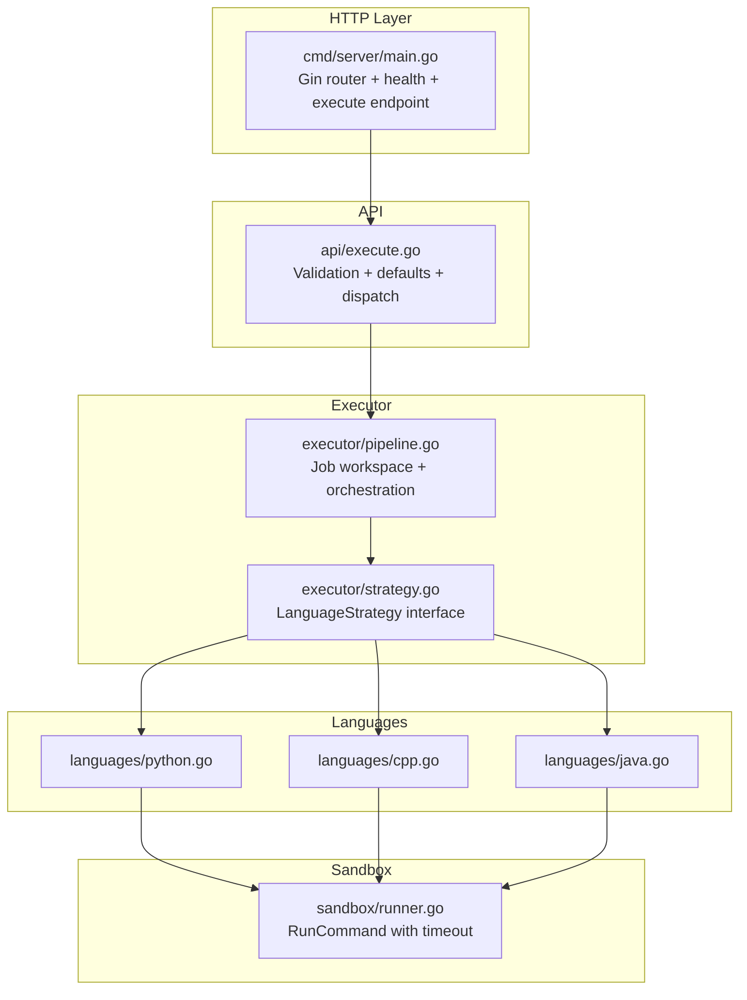
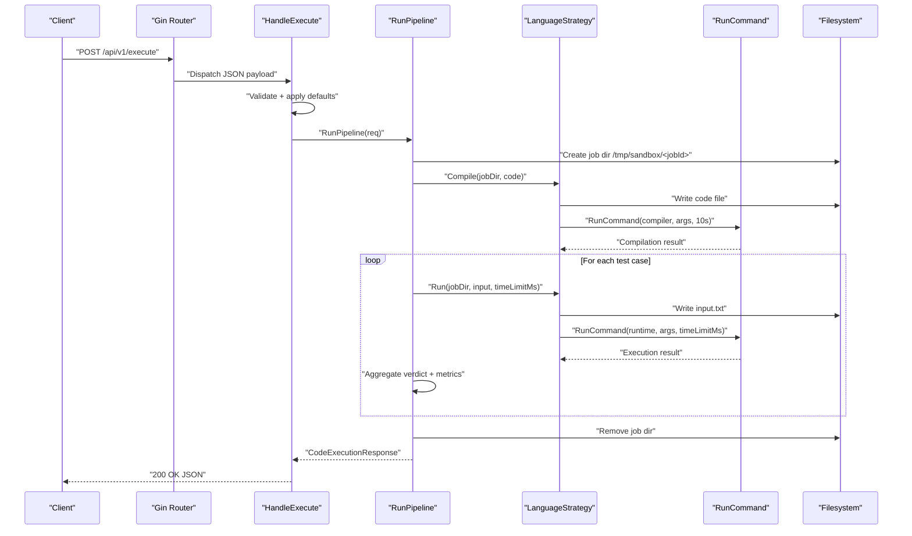
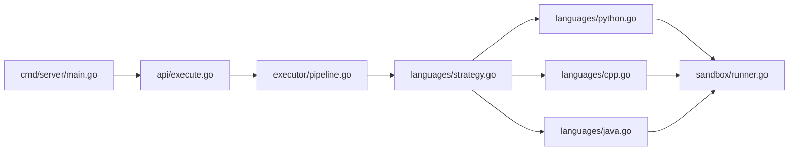

# Resource Management & Limits

<cite>
**Referenced Files in This Document**
- [main.go](file://apps/code-runner/cmd/server/main.go)
- [execute.go](file://apps/code-runner/api/execute.go)
- [pipeline.go](file://apps/code-runner/executor/pipeline.go)
- [strategy.go](file://apps/code-runner/languages/strategy.go)
- [python.go](file://apps/code-runner/languages/python.go)
- [cpp.go](file://apps/code-runner/languages/cpp.go)
- [java.go](file://apps/code-runner/languages/java.go)
- [runner.go](file://apps/code-runner/sandbox/runner.go)
- [Dockerfile](file://apps/code-runner/Dockerfile)
- [.env](file://.env)
- [.env.example](file://.env.example)
- [go.mod](file://apps/code-runner/go.mod)
</cite>

## Table of Contents
1. [Introduction](#introduction)
2. [Project Structure](#project-structure)
3. [Core Components](#core-components)
4. [Architecture Overview](#architecture-overview)
5. [Detailed Component Analysis](#detailed-component-analysis)
6. [Dependency Analysis](#dependency-analysis)
7. [Performance Considerations](#performance-considerations)
8. [Troubleshooting Guide](#troubleshooting-guide)
9. [Conclusion](#conclusion)
10. [Appendices](#appendices)

## Introduction
This document explains how the Code Execution Service enforces resource management and execution limits. It covers CPU time limits, memory constraints, disk space allocation, and process count restrictions. It also documents monitoring mechanisms, enforcement strategies, quota management, timeouts, graceful termination, and cleanup processes. Guidance is included for configuring limits, dynamic resource allocation, and performance optimization, along with the relationship to security, cost, and scalability.

## Project Structure
The Code Execution Service is implemented as a Go microservice with a clear separation of concerns:
- HTTP entrypoint and routing
- Request validation and defaults
- Execution pipeline orchestrating compile/run steps per language
- Language-specific strategies for compile and run
- Sandbox execution with timeout enforcement
- Container packaging with installed toolchains

**Diagram sources**
- [main.go](file://apps/code-runner/cmd/server/main.go#L12-L38)
- [execute.go](file://apps/code-runner/api/execute.go#L13-L53)
- [pipeline.go](file://apps/code-runner/executor/pipeline.go#L45-L163)
- [strategy.go](file://apps/code-runner/languages/strategy.go#L10-L24)
- [python.go](file://apps/code-runner/languages/python.go#L9-L26)
- [cpp.go](file://apps/code-runner/languages/cpp.go#L11-L34)
- [java.go](file://apps/code-runner/languages/java.go#L11-L35)
- [runner.go](file://apps/code-runner/sandbox/runner.go#L19-L55)

**Section sources**
- [main.go](file://apps/code-runner/cmd/server/main.go#L12-L38)
- [execute.go](file://apps/code-runner/api/execute.go#L13-L53)
- [pipeline.go](file://apps/code-runner/executor/pipeline.go#L45-L163)
- [strategy.go](file://apps/code-runner/languages/strategy.go#L10-L24)
- [python.go](file://apps/code-runner/languages/python.go#L9-L26)
- [cpp.go](file://apps/code-runner/languages/cpp.go#L11-L34)
- [java.go](file://apps/code-runner/languages/java.go#L11-L35)
- [runner.go](file://apps/code-runner/sandbox/runner.go#L19-L55)

## Core Components
- HTTP server and router: Exposes health and execute endpoints, sets runtime mode, and binds to a configurable port.
- API handler: Validates request payload, applies defaults for time and memory limits, logs execution intent, and invokes the execution pipeline.
- Executor pipeline: Creates a secure job workspace, selects language strategy, compiles code (when applicable), runs test cases, aggregates results, and cleans up the workspace.
- Language strategies: Provide compile and run behaviors per language, writing code/input files and invoking sandbox execution with configured time limits.
- Sandbox runner: Executes commands with a timeout boundary using context cancellation and records duration, exit code, and timeout flag.

Key resource-related behaviors:
- Time limit enforcement occurs at the sandbox level via context deadlines.
- Memory limit is present in the request model but is not enforced in the current implementation.
- Disk space is managed by creating a per-job directory under a shared sandbox path and cleaning it up after execution.
- Process count is implicitly bounded by single-process command execution and container isolation.

**Section sources**
- [main.go](file://apps/code-runner/cmd/server/main.go#L12-L38)
- [execute.go](file://apps/code-runner/api/execute.go#L13-L53)
- [pipeline.go](file://apps/code-runner/executor/pipeline.go#L45-L163)
- [strategy.go](file://apps/code-runner/languages/strategy.go#L10-L24)
- [python.go](file://apps/code-runner/languages/python.go#L9-L26)
- [cpp.go](file://apps/code-runner/languages/cpp.go#L11-L34)
- [java.go](file://apps/code-runner/languages/java.go#L11-L35)
- [runner.go](file://apps/code-runner/sandbox/runner.go#L19-L55)

## Architecture Overview
The service follows a request-response flow with layered responsibilities:
- Gin router receives requests and delegates to the API handler.
- The API handler validates and normalizes inputs, then calls the executor pipeline.
- The pipeline creates a temporary workspace, selects a language strategy, compiles (where applicable), and executes test cases.
- Each language strategy writes files and invokes sandbox execution with a time limit.
- Sandbox execution enforces a timeout and returns results to the pipeline, which aggregates verdicts and metrics.

**Diagram sources**
- [main.go](file://apps/code-runner/cmd/server/main.go#L12-L38)
- [execute.go](file://apps/code-runner/api/execute.go#L13-L53)
- [pipeline.go](file://apps/code-runner/executor/pipeline.go#L45-L163)
- [strategy.go](file://apps/code-runner/languages/strategy.go#L15-L24)
- [python.go](file://apps/code-runner/languages/python.go#L9-L26)
- [cpp.go](file://apps/code-runner/languages/cpp.go#L11-L34)
- [java.go](file://apps/code-runner/languages/java.go#L11-L35)
- [runner.go](file://apps/code-runner/sandbox/runner.go#L19-L55)

## Detailed Component Analysis

### HTTP Entry and Defaults
- Health endpoint returns service status.
- Execute endpoint accepts a structured request and applies defaults:
  - Time limit default is applied when not provided.
  - Memory limit default is applied when not provided.
- The handler logs execution intent and returns standardized error responses on validation or critical failures.

Operational implications:
- Timeouts are enforced per execution request.
- Memory limits are accepted but not enforced; future enhancements can integrate OS-level or container-level memory controls.

**Section sources**
- [main.go](file://apps/code-runner/cmd/server/main.go#L12-L38)
- [execute.go](file://apps/code-runner/api/execute.go#L13-L53)

### Execution Pipeline
Responsibilities:
- Creates a unique job directory under a shared sandbox path.
- Selects language strategy based on the requested language.
- Compiles code when applicable; captures compiler output and returns early on failure.
- Iterates test cases, invoking the selected strategy’s run method with the configured time limit.
- Aggregates results, computes overall verdict, and returns total execution time.
- Cleans up the job directory after completion.

Resource handling:
- Workspace creation and cleanup prevent persistent disk growth.
- Verdict logic accounts for timeouts and runtime errors.

**Section sources**
- [pipeline.go](file://apps/code-runner/executor/pipeline.go#L45-L163)

### Language Strategies
- PythonStrategy: Writes code file; runtime invocation streams input from a generated input file; execution uses sandbox with the provided time limit.
- CppStrategy: Writes code file; compiles with a fixed 10-second timeout; runtime invocation uses compiled binary with the provided time limit.
- JavaStrategy: Writes code file; compiles with a fixed 10-second timeout; runtime invocation uses Java runtime with the provided time limit.

Observations:
- Compilation steps enforce a fixed timeout for safety.
- Runtime steps rely on the per-request time limit.

**Section sources**
- [python.go](file://apps/code-runner/languages/python.go#L9-L26)
- [cpp.go](file://apps/code-runner/languages/cpp.go#L11-L34)
- [java.go](file://apps/code-runner/languages/java.go#L11-L35)

### Sandbox Execution
Mechanism:
- Uses context with a deadline derived from the provided time limit.
- Executes the command and captures combined output.
- Detects timeout via context deadline exceeded and sets a standard exit code.
- Maps non-zero exit codes to the result’s exit code when available.

Metrics:
- Records execution duration and exit code.
- Indicates whether a timeout occurred.

Limitations:
- No memory usage enforcement is performed in the current implementation.
- No process count enforcement is applied.

**Section sources**
- [runner.go](file://apps/code-runner/sandbox/runner.go#L19-L55)

### Resource Monitoring and Enforcement
Current state:
- CPU time limits: Enforced via context deadlines during command execution.
- Memory constraints: Accepted in the request model but not enforced.
- Disk space: Managed via per-job directories with automatic cleanup.
- Process count: Implicitly limited by single-process command execution.

Future enhancement directions:
- Introduce OS-level or container-level memory cgroups and ulimits.
- Add memory usage tracking and enforcement in the sandbox runner.
- Implement quotas and rate limiting at the API layer.
- Track and expose memory-used metrics alongside existing execution time metrics.

**Section sources**
- [runner.go](file://apps/code-runner/sandbox/runner.go#L19-L55)
- [pipeline.go](file://apps/code-runner/executor/pipeline.go#L15-L29)

### Timeout Configurations and Graceful Termination
- Per-request time limit is applied to each language runtime invocation.
- Compilation steps use fixed timeouts to prevent hanging builds.
- On timeout detection, the sandbox runner marks the result as timed out and returns a standard exit code.
- The pipeline continues processing remaining test cases after a timeout to preserve diagnostic information.

Graceful termination:
- Context cancellation ensures the spawned process is terminated upon deadline.
- Cleanup removes the job directory regardless of outcome.

**Section sources**
- [runner.go](file://apps/code-runner/sandbox/runner.go#L19-L55)
- [cpp.go](file://apps/code-runner/languages/cpp.go#L17-L21)
- [java.go](file://apps/code-runner/languages/java.go#L17-L22)
- [pipeline.go](file://apps/code-runner/executor/pipeline.go#L89-L103)

### Resource Cleanup Processes
- Job directory is created under a shared sandbox path.
- Automatic cleanup occurs after execution completes.
- File writes for code and input are scoped to the job directory.

Security and hygiene:
- Per-job isolation prevents cross-contamination.
- Cleanup reduces risk of disk accumulation.

**Section sources**
- [pipeline.go](file://apps/code-runner/executor/pipeline.go#L45-L53)
- [strategy.go](file://apps/code-runner/languages/strategy.go#L15-L24)

### Examples of Configurable Limits
- Time limit: Provided per request; defaults applied if unspecified.
- Memory limit: Provided per request; defaults applied if unspecified.
- Compilation: Fixed timeouts for C++ and Java compilation steps.

Dynamic allocation:
- Time limit can vary per request to balance correctness and latency.
- Memory limit can be tuned per workload; currently not enforced.

**Section sources**
- [execute.go](file://apps/code-runner/api/execute.go#L27-L34)
- [cpp.go](file://apps/code-runner/languages/cpp.go#L17-L21)
- [java.go](file://apps/code-runner/languages/java.go#L17-L22)

### Performance Optimization Techniques
- Prefer interpreted languages for rapid iteration; compiled languages benefit from optimization flags.
- Tune time limits to reduce tail latency while avoiding premature timeouts.
- Minimize I/O by keeping input sizes reasonable and avoiding repeated file writes.
- Use container-level caching for toolchain installations to reduce cold-start overhead.

[No sources needed since this section provides general guidance]

### Security Policies, Cost, and Scalability Implications
- Security: Container packaging installs minimal toolchains; per-job filesystem isolation reduces attack surface.
- Cost: CPU time is bounded by timeouts; memory is not currently constrained, potentially increasing cost under adversarial workloads.
- Scalability: Single-process execution simplifies scaling; containerization enables horizontal autoscaling.

[No sources needed since this section provides general guidance]

## Dependency Analysis
The service exhibits low coupling and high cohesion:
- HTTP layer depends on API handler.
- API handler depends on executor pipeline.
- Executor pipeline depends on language strategies and sandbox runner.
- Language strategies depend on filesystem helpers and sandbox runner.

**Diagram sources**
- [main.go](file://apps/code-runner/cmd/server/main.go#L12-L38)
- [execute.go](file://apps/code-runner/api/execute.go#L13-L53)
- [pipeline.go](file://apps/code-runner/executor/pipeline.go#L45-L163)
- [strategy.go](file://apps/code-runner/languages/strategy.go#L10-L24)
- [python.go](file://apps/code-runner/languages/python.go#L9-L26)
- [cpp.go](file://apps/code-runner/languages/cpp.go#L11-L34)
- [java.go](file://apps/code-runner/languages/java.go#L11-L35)
- [runner.go](file://apps/code-runner/sandbox/runner.go#L19-L55)

**Section sources**
- [go.mod](file://apps/code-runner/go.mod#L5-L8)
- [main.go](file://apps/code-runner/cmd/server/main.go#L12-L38)
- [execute.go](file://apps/code-runner/api/execute.go#L13-L53)
- [pipeline.go](file://apps/code-runner/executor/pipeline.go#L45-L163)
- [strategy.go](file://apps/code-runner/languages/strategy.go#L10-L24)
- [python.go](file://apps/code-runner/languages/python.go#L9-L26)
- [cpp.go](file://apps/code-runner/languages/cpp.go#L11-L34)
- [java.go](file://apps/code-runner/languages/java.go#L11-L35)
- [runner.go](file://apps/code-runner/sandbox/runner.go#L19-L55)

## Performance Considerations
- Timeouts: Use conservative defaults and allow clients to override per request.
- Memory: Plan for memory enforcement via container cgroups and ulimit; monitor memoryUsedKb when available.
- Disk: Keep input sizes small; rely on automatic cleanup to avoid disk pressure.
- Concurrency: Scale horizontally with containers; avoid long-lived processes in the service.

[No sources needed since this section provides general guidance]

## Troubleshooting Guide
Common issues and remedies:
- Validation errors: Ensure the request includes required fields and valid structure.
- Compilation failures: Verify code compiles with the installed toolchain; review compiler output.
- Timeouts: Increase time limit per request; inspect execution durations; optimize code.
- Internal errors: Check service logs for critical failures during execution or cleanup.

Operational references:
- Health endpoint for service readiness checks.
- Logging of execution intent and outcomes.
- Standardized error responses with codes and messages.

**Section sources**
- [execute.go](file://apps/code-runner/api/execute.go#L13-L53)
- [main.go](file://apps/code-runner/cmd/server/main.go#L18-L24)

## Conclusion
The Code Execution Service enforces CPU time limits via context-based timeouts and manages disk resources through per-job workspaces with automatic cleanup. Memory and process count constraints are not currently enforced but can be introduced via container-level controls and sandbox enhancements. The modular design supports straightforward extension for quotas, monitoring, and alerting to improve reliability, security, and cost efficiency.

[No sources needed since this section summarizes without analyzing specific files]

## Appendices

### Container Environment and Ports
- Installed toolchains: Python, Java, GCC, Bash.
- Sandbox directory: World-writable to allow per-job creation and cleanup.
- Service port: Configurable via environment variable with a default fallback.

**Section sources**
- [Dockerfile](file://apps/code-runner/Dockerfile#L14-L26)
- [.env](file://.env#L50-L65)
- [.env.example](file://.env.example#L45-L55)

### Request and Response Models
- Execute request includes language, code, test cases, optional time limit, and optional memory limit.
- Response includes overall verdict, per-test results with execution metrics, and total execution time.

**Section sources**
- [execute.go](file://apps/code-runner/api/execute.go#L13-L53)
- [pipeline.go](file://apps/code-runner/executor/pipeline.go#L14-L43)