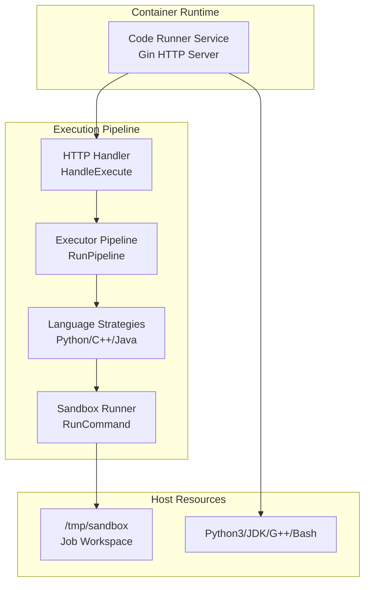
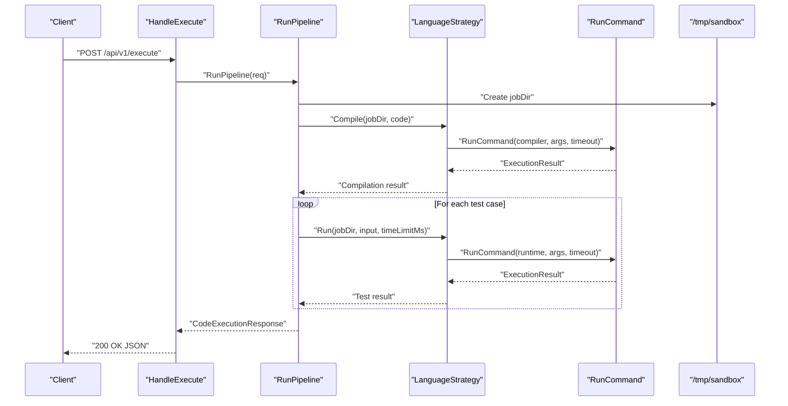
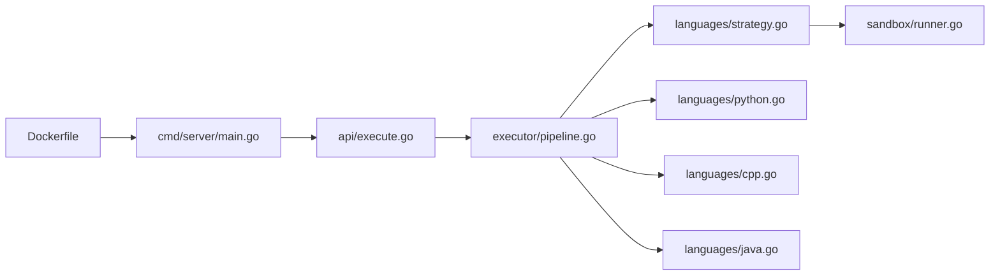

# Sandbox Security & Isolation

<cite>
**Referenced Files in This Document**
- [apps/code-runner/Dockerfile](file://apps/code-runner/Dockerfile)
- [apps/code-runner/cmd/server/main.go](file://apps/code-runner/cmd/server/main.go)
- [apps/code-runner/api/execute.go](file://apps/code-runner/api/execute.go)
- [apps/code-runner/executor/pipeline.go](file://apps/code-runner/executor/pipeline.go)
- [apps/code-runner/sandbox/runner.go](file://apps/code-runner/sandbox/runner.go)
- [apps/code-runner/languages/strategy.go](file://apps/code-runner/languages/strategy.go)
- [apps/code-runner/languages/python.go](file://apps/code-runner/languages/python.go)
- [apps/code-runner/languages/cpp.go](file://apps/code-runner/languages/cpp.go)
- [apps/code-runner/languages/java.go](file://apps/code-runner/languages/java.go)
</cite>

## Table of Contents
1. [Introduction](#introduction)
2. [Project Structure](#project-structure)
3. [Core Components](#core-components)
4. [Architecture Overview](#architecture-overview)
5. [Detailed Component Analysis](#detailed-component-analysis)
6. [Dependency Analysis](#dependency-analysis)
7. [Performance Considerations](#performance-considerations)
8. [Troubleshooting Guide](#troubleshooting-guide)
9. [Conclusion](#conclusion)
10. [Appendices](#appendices)

## Introduction
This document explains the sandbox security and isolation mechanisms in the Code Execution Service. It focuses on the Docker container-based isolation implementation, security policies, and resource constraints applied during code execution. It documents the end-to-end execution pipeline from code submission to container execution, including file system restrictions, network isolation, and process limitations. It also outlines security hardening measures, vulnerability mitigation strategies, compliance considerations, container configuration, security contexts, and monitoring capabilities. Finally, it provides examples of sandbox setup, execution isolation, and security audit trails, along with attack vector analysis, defense-in-depth strategies, and incident response procedures.

## Project Structure
The Code Execution Service is implemented as a Go microservice with a clear separation of concerns:
- API layer: HTTP endpoints for health checks and code execution requests.
- Executor layer: Orchestrates the end-to-end pipeline for compiling and running user code per language strategy.
- Language strategies: Encapsulate compile/run commands for Python, C++, and Java.
- Sandbox runner: Executes commands with timeouts and captures outputs and exit codes.
- Container packaging: Multi-stage Docker build with installed runtimes and compilers.

**Diagram sources**
- [apps/code-runner/cmd/server/main.go](file://apps/code-runner/cmd/server/main.go#L12-L38)
- [apps/code-runner/api/execute.go](file://apps/code-runner/api/execute.go#L13-L53)
- [apps/code-runner/executor/pipeline.go](file://apps/code-runner/executor/pipeline.go#L45-L163)
- [apps/code-runner/languages/strategy.go](file://apps/code-runner/languages/strategy.go#L10-L24)
- [apps/code-runner/sandbox/runner.go](file://apps/code-runner/sandbox/runner.go#L19-L55)
- [apps/code-runner/Dockerfile](file://apps/code-runner/Dockerfile#L11-L30)

**Section sources**
- [apps/code-runner/cmd/server/main.go](file://apps/code-runner/cmd/server/main.go#L12-L38)
- [apps/code-runner/Dockerfile](file://apps/code-runner/Dockerfile#L11-L30)

## Core Components
- HTTP API: Validates requests, applies defaults, and delegates execution to the pipeline.
- Executor pipeline: Creates isolated job workspaces, selects language strategy, compiles code, runs test cases, and aggregates results.
- Language strategies: Write code/input files and invoke commands with timeouts.
- Sandbox runner: Executes commands with context-based timeouts and captures outputs and exit codes.
- Container packaging: Multi-stage build with Alpine base, installed runtimes, and a shared sandbox directory.

Security-relevant highlights:
- Timeouts are enforced at the sandbox runner level.
- Job workspaces are isolated under a shared sandbox directory with broad permissions for MVP simplicity.
- Commands are executed via shell wrappers; input redirection is used for test inputs.
- Container runtime installs Python, JDK, G++, and Bash to support multiple languages.

**Section sources**
- [apps/code-runner/api/execute.go](file://apps/code-runner/api/execute.go#L13-L53)
- [apps/code-runner/executor/pipeline.go](file://apps/code-runner/executor/pipeline.go#L45-L163)
- [apps/code-runner/languages/strategy.go](file://apps/code-runner/languages/strategy.go#L10-L24)
- [apps/code-runner/sandbox/runner.go](file://apps/code-runner/sandbox/runner.go#L19-L55)
- [apps/code-runner/Dockerfile](file://apps/code-runner/Dockerfile#L11-L30)

## Architecture Overview
The service exposes a single endpoint to execute user-submitted code against test cases. The request is validated, defaults are applied, and the executor pipeline creates a per-job workspace, compiles code (when applicable), and executes it with input redirection. All executions are bounded by timeouts managed by the sandbox runner.

**Diagram sources**
- [apps/code-runner/api/execute.go](file://apps/code-runner/api/execute.go#L13-L53)
- [apps/code-runner/executor/pipeline.go](file://apps/code-runner/executor/pipeline.go#L45-L163)
- [apps/code-runner/languages/strategy.go](file://apps/code-runner/languages/strategy.go#L10-L24)
- [apps/code-runner/languages/python.go](file://apps/code-runner/languages/python.go#L9-L26)
- [apps/code-runner/languages/cpp.go](file://apps/code-runner/languages/cpp.go#L11-L34)
- [apps/code-runner/languages/java.go](file://apps/code-runner/languages/java.go#L11-L35)
- [apps/code-runner/sandbox/runner.go](file://apps/code-runner/sandbox/runner.go#L19-L55)

## Detailed Component Analysis

### HTTP API Layer
Responsibilities:
- Validate JSON payload and return structured errors on validation failure.
- Apply sensible defaults for time and memory limits if unspecified.
- Delegate execution to the pipeline and return aggregated results.

Security considerations:
- Request validation prevents malformed payloads from reaching the executor.
- Defaults ensure bounded execution even when clients omit limits.

Operational notes:
- Health endpoint exposed for readiness/liveness checks.
- Port configurable via environment variable.

**Section sources**
- [apps/code-runner/api/execute.go](file://apps/code-runner/api/execute.go#L13-L53)
- [apps/code-runner/cmd/server/main.go](file://apps/code-runner/cmd/server/main.go#L19-L37)

### Executor Pipeline
Responsibilities:
- Create a per-job directory under the shared sandbox.
- Select language-specific strategy based on input.
- Compile code (where applicable) and handle compilation failures.
- Execute each test case with input redirection and collect results.
- Aggregate verdicts (CORRECT, INCORRECT, PARTIAL, TIMEOUT, COMPILE_ERROR, RUNTIME_ERROR).

Security considerations:
- Per-job workspace isolation reduces cross-job interference.
- Automatic cleanup of job directories after execution.
- No external network access is configured in the container; runtime commands are executed locally.

Operational notes:
- Compilation and runtime timeouts are enforced by the sandbox runner.
- Results include execution time and combined output for diagnostics.

**Section sources**
- [apps/code-runner/executor/pipeline.go](file://apps/code-runner/executor/pipeline.go#L45-L163)

### Language Strategies
Responsibilities:
- Python: Writes code to a .py file; runtime invocation uses shell with input redirection.
- C++: Compiles with g++ into an executable; runtime invocation executes the binary with input redirection.
- Java: Compiles with javac into a class file; runtime invocation executes the Main class with input redirection.

Security considerations:
- Commands are constructed using shell wrappers; input is redirected from a controlled input file.
- Compilation and runtime commands are invoked with timeouts.

Operational notes:
- File naming conventions align with language expectations (e.g., Main.java for Java).
- Input files are written with controlled paths to prevent path traversal.

**Section sources**
- [apps/code-runner/languages/python.go](file://apps/code-runner/languages/python.go#L9-L26)
- [apps/code-runner/languages/cpp.go](file://apps/code-runner/languages/cpp.go#L11-L34)
- [apps/code-runner/languages/java.go](file://apps/code-runner/languages/java.go#L11-L35)
- [apps/code-runner/languages/strategy.go](file://apps/code-runner/languages/strategy.go#L10-L24)

### Sandbox Runner
Responsibilities:
- Execute commands with a context-based timeout.
- Capture combined output and compute execution duration.
- Map timeout conditions to standardized exit codes.

Security considerations:
- Timeout enforcement prevents runaway processes.
- Exit code interpretation distinguishes timeouts from runtime errors.

Operational notes:
- Uses context cancellation to terminate long-running processes.
- Returns structured results for upstream consumers.

**Section sources**
- [apps/code-runner/sandbox/runner.go](file://apps/code-runner/sandbox/runner.go#L19-L55)

### Container Packaging and Base Image
Responsibilities:
- Multi-stage build: compile-time dependencies and production runtime.
- Install Python, JDK, G++, and Bash in the runtime image.
- Create a shared sandbox directory with broad permissions for MVP simplicity.

Security considerations:
- Alpine base reduces attack surface compared to full distributions.
- Installed runtimes enable language support without per-language images.
- Shared sandbox directory permissions are set to 0777 for MVP convenience; see recommendations below.

Operational notes:
- Exposes the service port via the container.
- Build artifacts are minimized in the final stage.

**Section sources**
- [apps/code-runner/Dockerfile](file://apps/code-runner/Dockerfile#L1-L31)

## Dependency Analysis
The system exhibits layered dependencies:
- API depends on the executor.
- Executor depends on language strategies.
- Strategies depend on the sandbox runner.
- Sandbox runner depends on OS command execution and context timeouts.

**Diagram sources**
- [apps/code-runner/api/execute.go](file://apps/code-runner/api/execute.go#L13-L53)
- [apps/code-runner/executor/pipeline.go](file://apps/code-runner/executor/pipeline.go#L45-L163)
- [apps/code-runner/languages/strategy.go](file://apps/code-runner/languages/strategy.go#L10-L24)
- [apps/code-runner/languages/python.go](file://apps/code-runner/languages/python.go#L9-L26)
- [apps/code-runner/languages/cpp.go](file://apps/code-runner/languages/cpp.go#L11-L34)
- [apps/code-runner/languages/java.go](file://apps/code-runner/languages/java.go#L11-L35)
- [apps/code-runner/sandbox/runner.go](file://apps/code-runner/sandbox/runner.go#L19-L55)
- [apps/code-runner/cmd/server/main.go](file://apps/code-runner/cmd/server/main.go#L12-L38)
- [apps/code-runner/Dockerfile](file://apps/code-runner/Dockerfile#L11-L30)

**Section sources**
- [apps/code-runner/api/execute.go](file://apps/code-runner/api/execute.go#L13-L53)
- [apps/code-runner/executor/pipeline.go](file://apps/code-runner/executor/pipeline.go#L45-L163)
- [apps/code-runner/languages/strategy.go](file://apps/code-runner/languages/strategy.go#L10-L24)
- [apps/code-runner/sandbox/runner.go](file://apps/code-runner/sandbox/runner.go#L19-L55)
- [apps/code-runner/cmd/server/main.go](file://apps/code-runner/cmd/server/main.go#L12-L38)
- [apps/code-runner/Dockerfile](file://apps/code-runner/Dockerfile#L11-L30)

## Performance Considerations
- Timeouts: Enforced at the sandbox runner level to bound CPU and wall-clock time.
- I/O: Input redirection avoids external pipes and reduces overhead.
- Resource limits: Memory constraints are not enforced in the current implementation; see recommendations below.
- Concurrency: The executor processes one job at a time; consider queueing and worker pools for throughput.

[No sources needed since this section provides general guidance]

## Troubleshooting Guide
Common issues and mitigations:
- Validation errors: Inspect request payload shape and required fields.
- Compilation failures: Review compiler output captured in the response.
- Runtime errors: Inspect combined output for stderr/stdout.
- Timeouts: Increase client-provided time limit or investigate slow code.
- Sandbox cleanup: Ensure automatic cleanup occurs after execution; verify filesystem permissions.

Monitoring and logging:
- HTTP handler logs execution requests and errors.
- Executor logs job completion and overall verdict.
- Health endpoint supports operational checks.

**Section sources**
- [apps/code-runner/api/execute.go](file://apps/code-runner/api/execute.go#L13-L53)
- [apps/code-runner/executor/pipeline.go](file://apps/code-runner/executor/pipeline.go#L148-L148)
- [apps/code-runner/cmd/server/main.go](file://apps/code-runner/cmd/server/main.go#L19-L24)

## Conclusion
The Code Execution Service implements a pragmatic sandbox using a shared workspace and context-based timeouts. The containerization approach leverages a minimal Alpine base with installed runtimes to support multiple languages. While the current design prioritizes simplicity and rapid iteration, several enhancements can strengthen security and reliability, including stricter filesystem permissions, memory quotas, network isolation, and comprehensive audit logging.

[No sources needed since this section summarizes without analyzing specific files]

## Appendices

### Security Hardening and Compliance Recommendations
- Filesystem permissions: Restrict sandbox directory permissions to the least privilege necessary; avoid overly permissive modes.
- Network isolation: Disable outbound connections and restrict inbound access to the service port only.
- Resource controls: Enforce memory limits via cgroups or container runtime constraints; consider ulimit settings.
- Input sanitization: Validate and sanitize all inputs to prevent injection; avoid arbitrary command construction.
- Least privileges: Run the container with a non-root user and drop unnecessary capabilities.
- Audit logging: Log all execution events with timestamps, job IDs, verdicts, and resource usage.
- Secrets management: Do not embed secrets in the container image; use environment variables or secret stores.
- Vulnerability scanning: Regularly scan the base image and dependencies for known vulnerabilities.

[No sources needed since this section provides general guidance]

### Attack Vectors and Defense-in-Depth
- Command injection: Prefer explicit argument lists over shell string concatenation; validate filenames and paths.
- Path traversal: Enforce strict path joins and reject unexpected segments.
- Resource exhaustion: Combine CPU and memory limits; monitor host resources.
- Privilege escalation: Run unprivileged; avoid mounting host filesystems writable.
- Information disclosure: Sanitize error messages; avoid exposing internal paths or stack traces.

[No sources needed since this section provides general guidance]

### Incident Response Procedures
- Immediate actions: Scale down the service, disable new executions, and isolate the affected host.
- Forensic analysis: Collect container logs, host audit logs, and execution artifacts.
- Remediation: Patch base image, update dependencies, and apply security fixes.
- Recovery: Gradually reintroduce traffic and monitor metrics and logs.

[No sources needed since this section provides general guidance]

### Example: Sandbox Setup and Execution Isolation
- Container build: Use the provided Dockerfile to produce a minimal runtime image with required runtimes.
- Workspace creation: The executor creates a per-job directory under the shared sandbox for isolation.
- Execution isolation: Each run is executed with a timeout; input is redirected from a controlled file.
- Cleanup: The executor removes the job directory after execution completes.

**Section sources**
- [apps/code-runner/Dockerfile](file://apps/code-runner/Dockerfile#L11-L30)
- [apps/code-runner/executor/pipeline.go](file://apps/code-runner/executor/pipeline.go#L45-L53)
- [apps/code-runner/languages/python.go](file://apps/code-runner/languages/python.go#L15-L26)
- [apps/code-runner/languages/cpp.go](file://apps/code-runner/languages/cpp.go#L24-L34)
- [apps/code-runner/languages/java.go](file://apps/code-runner/languages/java.go#L25-L35)
- [apps/code-runner/sandbox/runner.go](file://apps/code-runner/sandbox/runner.go#L19-L55)

### Security Audit Trail
- Logging fields: Include job ID, language, time limit, total execution time, verdict, and combined output.
- Structured logs: Emit JSON-formatted entries for ingestion by log aggregation systems.
- Retention: Define retention policies for audit logs and execution artifacts.

**Section sources**
- [apps/code-runner/executor/pipeline.go](file://apps/code-runner/executor/pipeline.go#L148-L148)
- [apps/code-runner/api/execute.go](file://apps/code-runner/api/execute.go#L35-L35)