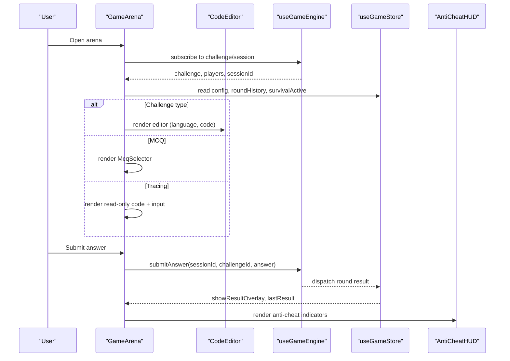
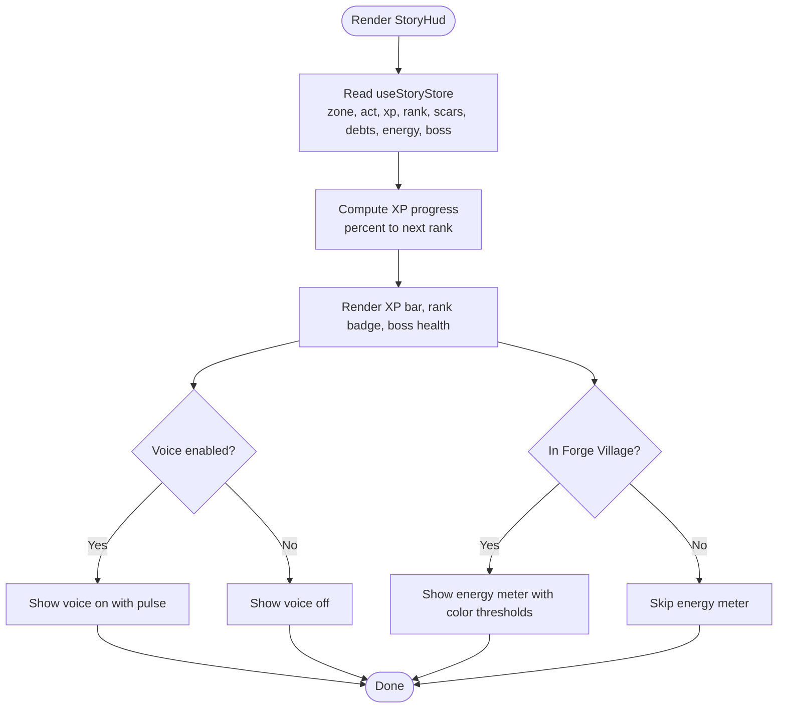
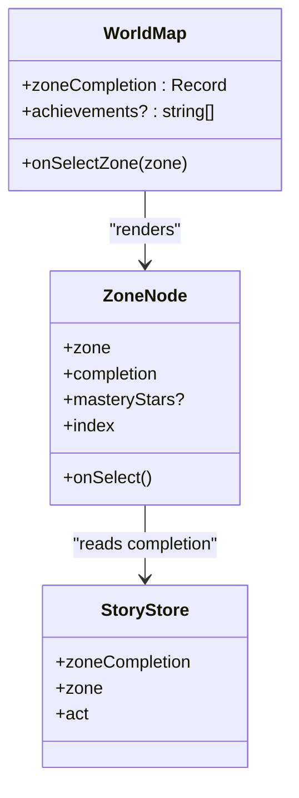
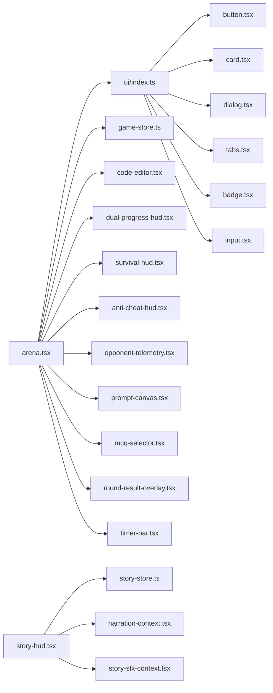

# Component Library & UI

<cite>
**Referenced Files in This Document**
- [apps/web/components/ui/index.ts](file://apps/web/components/ui/index.ts)
- [apps/web/components/ui/button.tsx](file://apps/web/components/ui/button.tsx)
- [apps/web/components/ui/card.tsx](file://apps/web/components/ui/card.tsx)
- [apps/web/components/ui/dialog.tsx](file://apps/web/components/ui/dialog.tsx)
- [apps/web/components/ui/tabs.tsx](file://apps/web/components/ui/tabs.tsx)
- [apps/web/components/ui/badge.tsx](file://apps/web/components/ui/badge.tsx)
- [apps/web/components/ui/input.tsx](file://apps/web/components/ui/input.tsx)
- [apps/web/lib/utils.ts](file://apps/web/lib/utils.ts)
- [apps/web/components/game/arena.tsx](file://apps/web/components/game/arena.tsx)
- [apps/web/components/game/code-editor.tsx](file://apps/web/components/game/code-editor.tsx)
- [apps/web/components/game/dual-progress-hud.tsx](file://apps/web/components/game/dual-progress-hud.tsx)
- [apps/web/components/game/survival-hud.tsx](file://apps/web/components/game/survival-hud.tsx)
- [apps/web/components/game/anti-cheat-hud.tsx](file://apps/web/components/game/anti-cheat-hud.tsx)
- [apps/web/components/game/opponent-telemetry.tsx](file://apps/web/components/game/opponent-telemetry.tsx)
- [apps/web/components/game/prompt-canvas.tsx](file://apps/web/components/game/prompt-canvas.tsx)
- [apps/web/components/game/mcq-selector.tsx](file://apps/web/components/game/mcq-selector.tsx)
- [apps/web/components/game/results-screen.tsx](file://apps/web/components/game/results-screen.tsx)
- [apps/web/components/game/round-result-overlay.tsx](file://apps/web/components/game/round-result-overlay.tsx)
- [apps/web/components/game/survival-transition.tsx](file://apps/web/components/game/survival-transition.tsx)
- [apps/web/components/game/timer-bar.tsx](file://apps/web/components/game/timer-bar.tsx)
- [apps/web/store/game-store.ts](file://apps/web/store/game-store.ts)
- [apps/web/store/story-store.ts](file://apps/web/store/story-store.ts)
- [apps/web/components/story/story-hud.tsx](file://apps/web/components/story/story-hud.tsx)
- [apps/web/components/story/narrative-panel.tsx](file://apps/web/components/story/narrative-panel.tsx)
- [apps/web/components/story/world-map.tsx](file://apps/web/components/story/world-map.tsx)
- [apps/web/components/story/choice-cards.tsx](file://apps/web/components/story/choice-cards.tsx)
- [apps/web/components/story/journey-path.tsx](file://apps/web/components/story/journey-path.tsx)
- [apps/web/components/story/narrator-box.tsx](file://apps/web/components/story/narrator-box.tsx)
- [apps/web/components/story/scene-atmosphere.tsx](file://apps/web/components/story/scene-atmosphere.tsx)
- [apps/web/components/story/story-status-panel.tsx](file://apps/web/components/story/story-status-panel.tsx)
- [apps/web/components/story/story-narrator.tsx](file://apps/web/components/story/story-narrator.tsx)
- [apps/web/components/story/story-sfx-context.tsx](file://apps/web/components/story/story-sfx-context.tsx)
- [apps/web/components/story/cinematic-zone-enter.tsx](file://apps/web/components/story/cinematic-zone-enter.tsx)
- [apps/web/components/story/boss-gate-transition.tsx](file://apps/web/components/story/boss-gate-transition.tsx)
- [apps/web/components/story/rank-up-overlay.tsx](file://apps/web/components/story/rank-up-overlay.tsx)
- [apps/web/components/story/zone-complete-screen.tsx](file://apps/web/components/story/zone-complete-screen.tsx)
- [apps/web/components/story/zone-selector.tsx](file://apps/web/components/story/zone-selector.tsx)
- [apps/web/components/story/achievements-panel.tsx](file://apps/web/components/story/achievements-panel.tsx)
- [apps/web/components/story/pixel-portrait.tsx](file://apps/web/components/story/pixel-portrait.tsx)
- [apps/web/components/story/npc-dialogue.tsx](file://apps/web/components/story/npc-dialogue.tsx)
- [apps/web/contexts/audio-manager-context.tsx](file://apps/web/contexts/audio-manager-context.tsx)
- [apps/web/contexts/narration-context.tsx](file://apps/web/contexts/narration-context.tsx)
- [apps/web/hooks/use-game-engine.ts](file://apps/web/hooks/use-game-engine.ts)
- [apps/web/hooks/use-mobile.tsx](file://apps/web/hooks/use-mobile.tsx)
- [apps/web/hooks/use-toast.ts](file://apps/web/hooks/use-toast.ts)
- [apps/web/hooks/use-telemetry.ts](file://apps/web/hooks/use-telemetry.ts)
- [apps/web/hooks/use-audio-manager.ts](file://apps/web/hooks/use-audio-manager.ts)
- [apps/web/hooks/use-click-sound.ts](file://apps/web/hooks/use-click-sound.ts)
- [apps/web/hooks/use-micro-interactions.ts](file://apps/web/hooks/use-micro-interactions.ts)
- [apps/web/styles/story-theme.css](file://apps/web/styles/story-theme.css)
</cite>

## Table of Contents
1. [Introduction](#introduction)
2. [Project Structure](#project-structure)
3. [Core Components](#core-components)
4. [Architecture Overview](#architecture-overview)
5. [Detailed Component Analysis](#detailed-component-analysis)
6. [Dependency Analysis](#dependency-analysis)
7. [Performance Considerations](#performance-considerations)
8. [Troubleshooting Guide](#troubleshooting-guide)
9. [Conclusion](#conclusion)
10. [Appendices](#appendices)

## Introduction
This document describes the shared UI component library and the integrated design system used across the application. It covers reusable UI primitives, theming and styling patterns, and specialized components for gameplay and storytelling. It also documents game-specific arena management, code editor integration, and real-time HUD displays, alongside story mode components for narrative progression, character interactions, and cinematic sequences. Guidance is included for responsive design, accessibility, cross-browser compatibility, usage examples, composition patterns, testing, performance optimization, and design system maintenance.

## Project Structure
The UI system is organized around:
- A shared component library under apps/web/components/ui exporting a cohesive set of primitives and compound components.
- Game-focused arena and HUD components under apps/web/components/game.
- Story mode components under apps/web/components/story.
- Centralized stores for game and story state under apps/web/store.
- Utility helpers and contexts supporting styling, audio, narration, and hooks.

```mermaid
graph TB
subgraph "UI Library"
UI_Button["Button<br/>variants + sizes"]
UI_Card["Card<br/>header/content/footer"]
UI_Dialog["Dialog<br/>overlay/content"]
UI_Tabs["Tabs<br/>list/trigger/content"]
UI_Badge["Badge<br/>variants"]
UI_Input["Input"]
end
subgraph "Game Arena"
Arena["GameArena"]
CodeEditor["CodeEditor"]
DualHUD["DualProgressHud"]
SurvHUD["SurvivalHUD"]
AntiCheatHUD["AntiCheatHUD"]
OppTelemetry["OpponentTelemetry"]
PromptCanvas["PromptCanvas"]
McqSelector["McqSelector"]
ResultsOverlay["RoundResultOverlay"]
TimerBar["TimerBar"]
end
subgraph "Story Mode"
StoryHUD["StoryHud"]
NarrativePanel["NarrativePanel"]
WorldMap["WorldMap"]
ChoiceCards["ChoiceCards"]
JourneyPath["JourneyPath"]
NarratorBox["NarratorBox"]
SceneAtmosphere["SceneAtmosphere"]
StoryStatusPanel["StoryStatusPanel"]
StoryNarrator["StoryNarrator"]
StorySFX["StorySFXContext"]
CinematicEnter["CinematicZoneEnter"]
BossGate["BossGateTransition"]
RankUp["RankUpOverlay"]
ZoneComplete["ZoneCompleteScreen"]
ZoneSelector["ZoneSelector"]
AchievementsPanel["AchievementsPanel"]
PixelPortrait["PixelPortrait"]
NPCDialogue["NPCDialogue"]
end
subgraph "State & Context"
GameStore["useGameStore"]
StoryStore["useStoryStore"]
AudioManager["AudioManagerContext"]
Narration["NarrationContext"]
end
UI_Button --> Arena
UI_Card --> Arena
UI_Dialog --> Arena
UI_Tabs --> Arena
UI_Badge --> Arena
UI_Input --> Arena
Arena --> CodeEditor
Arena --> DualHUD
Arena --> SurvHUD
Arena --> AntiCheatHUD
Arena --> OppTelemetry
Arena --> PromptCanvas
Arena --> McqSelector
Arena --> ResultsOverlay
Arena --> TimerBar
StoryHUD --> StoryStore
NarrativePanel --> StoryStore
WorldMap --> StoryStore
ChoiceCards --> StoryStore
JourneyPath --> StoryStore
NarratorBox --> StoryStore
SceneAtmosphere --> StoryStore
StoryStatusPanel --> StoryStore
StoryNarrator --> StoryStore
StorySFX --> StoryStore
CinematicEnter --> StoryStore
BossGate --> StoryStore
RankUp --> StoryStore
ZoneComplete --> StoryStore
ZoneSelector --> StoryStore
AchievementsPanel --> StoryStore
PixelPortrait --> StoryStore
NPCDialogue --> StoryStore
GameStore --> Arena
StoryStore --> StoryHUD
StoryStore --> NarrativePanel
StoryStore --> WorldMap
StoryStore --> ChoiceCards
StoryStore --> JourneyPath
StoryStore --> NarratorBox
StoryStore --> SceneAtmosphere
StoryStore --> StoryStatusPanel
StoryStore --> StoryNarrator
StoryStore --> StorySFX
StoryStore --> CinematicEnter
StoryStore --> BossGate
StoryStore --> RankUp
StoryStore --> ZoneComplete
StoryStore --> ZoneSelector
StoryStore --> AchievementsPanel
StoryStore --> PixelPortrait
StoryStore --> NPCDialogue
AudioManager --> StorySFX
Narration --> StoryHUD
```

**Diagram sources**
- [apps/web/components/ui/index.ts](file://apps/web/components/ui/index.ts#L1-L90)
- [apps/web/components/game/arena.tsx](file://apps/web/components/game/arena.tsx#L1-L395)
- [apps/web/components/game/code-editor.tsx](file://apps/web/components/game/code-editor.tsx#L1-L67)
- [apps/web/components/game/dual-progress-hud.tsx](file://apps/web/components/game/dual-progress-hud.tsx#L1-L175)
- [apps/web/components/game/survival-hud.tsx](file://apps/web/components/game/survival-hud.tsx#L1-L49)
- [apps/web/components/game/anti-cheat-hud.tsx](file://apps/web/components/game/anti-cheat-hud.tsx)
- [apps/web/components/game/opponent-telemetry.tsx](file://apps/web/components/game/opponent-telemetry.tsx)
- [apps/web/components/game/prompt-canvas.tsx](file://apps/web/components/game/prompt-canvas.tsx)
- [apps/web/components/game/mcq-selector.tsx](file://apps/web/components/game/mcq-selector.tsx)
- [apps/web/components/game/round-result-overlay.tsx](file://apps/web/components/game/round-result-overlay.tsx)
- [apps/web/components/game/timer-bar.tsx](file://apps/web/components/game/timer-bar.tsx)
- [apps/web/store/game-store.ts](file://apps/web/store/game-store.ts#L1-L394)
- [apps/web/store/story-store.ts](file://apps/web/store/story-store.ts#L1-L308)
- [apps/web/components/story/story-hud.tsx](file://apps/web/components/story/story-hud.tsx#L1-L178)
- [apps/web/components/story/narrative-panel.tsx](file://apps/web/components/story/narrative-panel.tsx#L1-L91)
- [apps/web/components/story/world-map.tsx](file://apps/web/components/story/world-map.tsx#L1-L225)
- [apps/web/contexts/audio-manager-context.tsx](file://apps/web/contexts/audio-manager-context.tsx)
- [apps/web/contexts/narration-context.tsx](file://apps/web/contexts/narration-context.tsx)

**Section sources**
- [apps/web/components/ui/index.ts](file://apps/web/components/ui/index.ts#L1-L90)
- [apps/web/components/ui/button.tsx](file://apps/web/components/ui/button.tsx#L1-L53)
- [apps/web/components/ui/card.tsx](file://apps/web/components/ui/card.tsx#L1-L76)
- [apps/web/components/ui/dialog.tsx](file://apps/web/components/ui/dialog.tsx#L1-L120)
- [apps/web/components/ui/tabs.tsx](file://apps/web/components/ui/tabs.tsx#L1-L55)
- [apps/web/components/ui/badge.tsx](file://apps/web/components/ui/badge.tsx#L1-L36)
- [apps/web/components/ui/input.tsx](file://apps/web/components/ui/input.tsx#L1-L22)
- [apps/web/lib/utils.ts](file://apps/web/lib/utils.ts#L1-L7)

## Core Components
This section documents the shared UI primitives and their props, variants, and customization options.

- Button
  - Variants: default, destructive, outline, secondary, ghost, link
  - Sizes: default, sm, lg, icon
  - Props: className, variant, size, asChild, plus standard button attributes
  - Usage: Base interactive element with consistent spacing and focus states.

- Card
  - Components: Card, CardHeader, CardFooter, CardTitle, CardDescription, CardContent
  - Props: Standard HTML div/heading attributes
  - Usage: Container for grouped content with consistent borders and shadows.

- Dialog
  - Components: Dialog, DialogPortal, DialogOverlay, DialogTrigger, DialogClose, DialogContent, DialogHeader, DialogFooter, DialogTitle, DialogDescription
  - Props: showClose flag for content
  - Usage: Modal overlays with animated entrance/exit and optional close button.

- Tabs
  - Components: Tabs, TabsList, TabsTrigger, TabsContent
  - Props: Standard attributes for each part
  - Usage: Tabbed content containers with active state styling.

- Badge
  - Variants: default, secondary, destructive, outline
  - Props: className, variant
  - Usage: Lightweight labels for categories and statuses.

- Input
  - Props: className, type, plus standard input attributes
  - Usage: Text inputs with consistent focus and placeholder styling.

- Utilities
  - cn: Composes Tailwind classes with clsx and tailwind-merge for safe merging.

**Section sources**
- [apps/web/components/ui/button.tsx](file://apps/web/components/ui/button.tsx#L1-L53)
- [apps/web/components/ui/card.tsx](file://apps/web/components/ui/card.tsx#L1-L76)
- [apps/web/components/ui/dialog.tsx](file://apps/web/components/ui/dialog.tsx#L1-L120)
- [apps/web/components/ui/tabs.tsx](file://apps/web/components/ui/tabs.tsx#L1-L55)
- [apps/web/components/ui/badge.tsx](file://apps/web/components/ui/badge.tsx#L1-L36)
- [apps/web/components/ui/input.tsx](file://apps/web/components/ui/input.tsx#L1-L22)
- [apps/web/lib/utils.ts](file://apps/web/lib/utils.ts#L1-L7)

## Architecture Overview
The UI architecture follows a layered pattern:
- Primitive components (Button, Card, Input) provide atomic building blocks.
- Compound components (Dialog, Tabs) encapsulate behavior and structure.
- Game and story screens compose primitives and compound components with domain-specific logic.
- Stores (Zustand with Immer) manage state for arena and story modes.
- Contexts supply runtime services like narration and audio.

```mermaid
graph TB
UI["UI Library<br/>apps/web/components/ui"] --> GameArena["GameArena<br/>apps/web/components/game/arena.tsx"]
UI --> StoryHUD["StoryHud<br/>apps/web/components/story/story-hud.tsx"]
GameArena --> GameStore["useGameStore<br/>apps/web/store/game-store.ts"]
StoryHUD --> StoryStore["useStoryStore<br/>apps/web/store/story-store.ts"]
GameArena --> CodeEditor["CodeEditor"]
GameArena --> DualHUD["DualProgressHud"]
GameArena --> SurvHUD["SurvivalHUD"]
GameArena --> AntiCheatHUD["AntiCheatHUD"]
GameArena --> OppTelemetry["OpponentTelemetry"]
GameArena --> PromptCanvas["PromptCanvas"]
GameArena --> McqSelector["McqSelector"]
GameArena --> ResultsOverlay["RoundResultOverlay"]
GameArena --> TimerBar["TimerBar"]
StoryHUD --> Narration["NarrationContext"]
StoryHUD --> StorySFX["StorySFXContext"]
StoryHUD --> StoryStore
StoryHUD --> NarrativePanel["NarrativePanel"]
StoryHUD --> WorldMap["WorldMap"]
StoryHUD --> ChoiceCards["ChoiceCards"]
StoryHUD --> JourneyPath["JourneyPath"]
StoryHUD --> NarratorBox["NarratorBox"]
StoryHUD --> SceneAtmosphere["SceneAtmosphere"]
StoryHUD --> StoryStatusPanel["StoryStatusPanel"]
StoryHUD --> StoryNarrator["StoryNarrator"]
StoryHUD --> BossGate["BossGateTransition"]
StoryHUD --> RankUp["RankUpOverlay"]
StoryHUD --> ZoneComplete["ZoneCompleteScreen"]
StoryHUD --> ZoneSelector["ZoneSelector"]
StoryHUD --> AchievementsPanel["AchievementsPanel"]
StoryHUD --> PixelPortrait["PixelPortrait"]
StoryHUD --> NPCDialogue["NPCDialogue"]
```

**Diagram sources**
- [apps/web/components/ui/index.ts](file://apps/web/components/ui/index.ts#L1-L90)
- [apps/web/components/game/arena.tsx](file://apps/web/components/game/arena.tsx#L1-L395)
- [apps/web/store/game-store.ts](file://apps/web/store/game-store.ts#L1-L394)
- [apps/web/store/story-store.ts](file://apps/web/store/story-store.ts#L1-L308)
- [apps/web/components/story/story-hud.tsx](file://apps/web/components/story/story-hud.tsx#L1-L178)
- [apps/web/contexts/narration-context.tsx](file://apps/web/contexts/narration-context.tsx)
- [apps/web/contexts/audio-manager-context.tsx](file://apps/web/contexts/audio-manager-context.tsx)

## Detailed Component Analysis

### Game Arena and HUD System
The arena orchestrates the competitive coding experience with resizable panels, real-time telemetry, and multiple challenge types.

**Diagram sources**
- [apps/web/components/game/arena.tsx](file://apps/web/components/game/arena.tsx#L48-L144)
- [apps/web/components/game/code-editor.tsx](file://apps/web/components/game/code-editor.tsx#L13-L66)
- [apps/web/store/game-store.ts](file://apps/web/store/game-store.ts#L221-L393)
- [apps/web/hooks/use-game-engine.ts](file://apps/web/hooks/use-game-engine.ts)

Key behaviors:
- Dynamic rendering based on challenge category (fill-in-the-blank, MCQ, state tracing).
- Real-time WPM telemetry for dual sessions.
- Dual progress HUD and survival HUD display relevant stats.
- Anti-Cheat HUD integrates with arena SFX context.
- Round result overlay and timer bar provide feedback.

Props and composition highlights:
- GameArena props: none (consumes hooks/stores).
- CodeEditor props: language, code, onChange, readOnly.
- DualProgressHud props: none (reads store).
- SurvivalHUD props: none (reads store).
- AntiCheatHUD props: sessionId.

**Section sources**
- [apps/web/components/game/arena.tsx](file://apps/web/components/game/arena.tsx#L1-L395)
- [apps/web/components/game/code-editor.tsx](file://apps/web/components/game/code-editor.tsx#L1-L67)
- [apps/web/components/game/dual-progress-hud.tsx](file://apps/web/components/game/dual-progress-hud.tsx#L1-L175)
- [apps/web/components/game/survival-hud.tsx](file://apps/web/components/game/survival-hud.tsx#L1-L49)
- [apps/web/components/game/anti-cheat-hud.tsx](file://apps/web/components/game/anti-cheat-hud.tsx)
- [apps/web/components/game/opponent-telemetry.tsx](file://apps/web/components/game/opponent-telemetry.tsx)
- [apps/web/components/game/prompt-canvas.tsx](file://apps/web/components/game/prompt-canvas.tsx)
- [apps/web/components/game/mcq-selector.tsx](file://apps/web/components/game/mcq-selector.tsx)
- [apps/web/components/game/round-result-overlay.tsx](file://apps/web/components/game/round-result-overlay.tsx)
- [apps/web/components/game/timer-bar.tsx](file://apps/web/components/game/timer-bar.tsx)
- [apps/web/store/game-store.ts](file://apps/web/store/game-store.ts#L1-L394)

### Story Mode HUD and Narrative System
The story HUD aggregates player stats, XP, rank, boss health, and narration controls. The narrative panel handles streaming text and auto-scrolling.

**Diagram sources**
- [apps/web/components/story/story-hud.tsx](file://apps/web/components/story/story-hud.tsx#L30-L177)
- [apps/web/store/story-store.ts](file://apps/web/store/story-store.ts#L175-L307)

Narrative panel:
- Auto-scrolls to bottom when new content arrives.
- Supports streaming content with animated cursor and loader fallback.
- Provides helper renderNarrativeText to style story-specific tokens.

**Section sources**
- [apps/web/components/story/story-hud.tsx](file://apps/web/components/story/story-hud.tsx#L1-L178)
- [apps/web/components/story/narrative-panel.tsx](file://apps/web/components/story/narrative-panel.tsx#L1-L91)
- [apps/web/store/story-store.ts](file://apps/web/store/story-store.ts#L1-L308)

### World Map and Navigation
The world map presents three zones with completion status, difficulty, and hover tooltips. It integrates with story state for completion tracking and selection callbacks.

**Diagram sources**
- [apps/web/components/story/world-map.tsx](file://apps/web/components/story/world-map.tsx#L179-L224)
- [apps/web/store/story-store.ts](file://apps/web/store/story-store.ts#L139-L143)

**Section sources**
- [apps/web/components/story/world-map.tsx](file://apps/web/components/story/world-map.tsx#L1-L225)
- [apps/web/store/story-store.ts](file://apps/web/store/story-store.ts#L1-L308)

### Theming and Styling Patterns
- Design tokens: CSS variables for backgrounds, borders, accents, and retro shadows are applied via inline styles and Tailwind classes.
- Editor theming: Monaco editor uses a custom dark theme merged into the VS Dark base.
- Responsive utilities: Tailwind utilities ensure adaptability across breakpoints; mobile hooks assist in responsive behavior.
- Accessibility: Focus-visible outlines, aria-aware dialogs, and semantic markup are used across components.

Customization options:
- Button variants and sizes via class variance authority.
- Card parts enable flexible header/body/footer layouts.
- Dialog supports optional close button and portal rendering.
- Badge variants for contextual emphasis.

**Section sources**
- [apps/web/components/ui/button.tsx](file://apps/web/components/ui/button.tsx#L6-L30)
- [apps/web/components/ui/dialog.tsx](file://apps/web/components/ui/dialog.tsx#L28-L53)
- [apps/web/components/ui/card.tsx](file://apps/web/components/ui/card.tsx#L4-L75)
- [apps/web/components/game/code-editor.tsx](file://apps/web/components/game/code-editor.tsx#L27-L39)
- [apps/web/hooks/use-mobile.tsx](file://apps/web/hooks/use-mobile.tsx)

### Cross-Browser Compatibility and Accessibility
- Cross-browser: Tailwind-based CSS and modern JavaScript features are used; ensure polyfills if targeting legacy browsers.
- Accessibility: Components use focus rings, aria roles where applicable, and semantic HTML. Dialogs include portals and overlay animations for screen reader compatibility.

[No sources needed since this section provides general guidance]

## Dependency Analysis
The UI library exports a consolidated index for easy consumption. Game and story components depend on:
- UI primitives for structure and interaction.
- Zustand stores for state management.
- Contexts for narration and audio.
- Hooks for engine integration and telemetry.

**Diagram sources**
- [apps/web/components/ui/index.ts](file://apps/web/components/ui/index.ts#L1-L90)
- [apps/web/components/game/arena.tsx](file://apps/web/components/game/arena.tsx#L1-L395)
- [apps/web/store/game-store.ts](file://apps/web/store/game-store.ts#L1-L394)
- [apps/web/store/story-store.ts](file://apps/web/store/story-store.ts#L1-L308)
- [apps/web/components/story/story-hud.tsx](file://apps/web/components/story/story-hud.tsx#L1-L178)
- [apps/web/contexts/narration-context.tsx](file://apps/web/contexts/narration-context.tsx)
- [apps/web/contexts/audio-manager-context.tsx](file://apps/web/contexts/audio-manager-context.tsx)

**Section sources**
- [apps/web/components/ui/index.ts](file://apps/web/components/ui/index.ts#L1-L90)
- [apps/web/store/game-store.ts](file://apps/web/store/game-store.ts#L1-L394)
- [apps/web/store/story-store.ts](file://apps/web/store/story-store.ts#L1-L308)

## Performance Considerations
- Lazy rendering: Arena conditionally renders panels and overlays based on challenge type and session state.
- Memoization: Use refs and effects to avoid unnecessary re-renders (e.g., Monaco sync guard).
- Animations: Prefer motion components for lightweight transitions; throttle frequent updates (e.g., telemetry intervals).
- Bundling: Keep UI library exports minimal; consumers import only used components.
- Editor performance: Disable minimap and enable smooth scrolling; format on paste reduces manual keystrokes.

[No sources needed since this section provides general guidance]

## Troubleshooting Guide
Common issues and resolutions:
- Monaco editor not updating: Ensure the editor ref is captured and setValue is called when code prop changes.
- Dialog close button missing: Verify showClose prop is true or remove to hide.
- Dual HUD not appearing: Confirm session config is DUAL; otherwise component returns null.
- Story HUD voice toggle not working: Check narration context wiring and voiceEnabled state.
- Timer HUD not visible: Confirm TimerBar is rendered within arena layout.

**Section sources**
- [apps/web/components/game/code-editor.tsx](file://apps/web/components/game/code-editor.tsx#L17-L22)
- [apps/web/components/ui/dialog.tsx](file://apps/web/components/ui/dialog.tsx#L33-L53)
- [apps/web/components/game/dual-progress-hud.tsx](file://apps/web/components/game/dual-progress-hud.tsx#L59-L60)
- [apps/web/components/story/story-hud.tsx](file://apps/web/components/story/story-hud.tsx#L114-L130)

## Conclusion
The UI component library provides a robust foundation of primitives and compound components, seamlessly integrated with game and story systems. The design system emphasizes consistency, responsiveness, and accessibility, while specialized components deliver immersive gameplay and narrative experiences. The modular architecture enables maintainability, testability, and scalable enhancements.

[No sources needed since this section summarizes without analyzing specific files]

## Appendices

### Usage Examples and Composition Patterns
- Importing UI components:
  - Use the centralized index to import Button, Card, Dialog, Tabs, Badge, and Input.
- Composing the arena:
  - Wrap CodeEditor with Card and Tabs for challenge types.
  - Add DualProgressHud and SurvivalHUD conditionally based on store state.
- Story narrative:
  - Render NarrativePanel with streaming content and auto-scroll behavior.
  - Style narrative text using renderNarrativeText for story-specific tokens.

**Section sources**
- [apps/web/components/ui/index.ts](file://apps/web/components/ui/index.ts#L1-L90)
- [apps/web/components/game/arena.tsx](file://apps/web/components/game/arena.tsx#L244-L390)
- [apps/web/components/story/narrative-panel.tsx](file://apps/web/components/story/narrative-panel.tsx#L17-L57)

### Testing Guidelines
- Unit tests: Mock hooks and stores; assert DOM structure and class names for variants.
- Integration tests: Simulate user interactions (submit answer, open dialog, toggle voice).
- Accessibility tests: Verify keyboard navigation, focus order, and ARIA attributes.

[No sources needed since this section provides general guidance]

### Maintenance and Evolution
- Keep the UI index aligned with component exports.
- Update class variance authorities when adding new variants.
- Version editor themes and ensure compatibility with Monaco updates.
- Review story theme CSS for consistent typography and color usage.

**Section sources**
- [apps/web/components/ui/index.ts](file://apps/web/components/ui/index.ts#L1-L90)
- [apps/web/components/game/code-editor.tsx](file://apps/web/components/game/code-editor.tsx#L27-L39)
- [apps/web/styles/story-theme.css](file://apps/web/styles/story-theme.css)