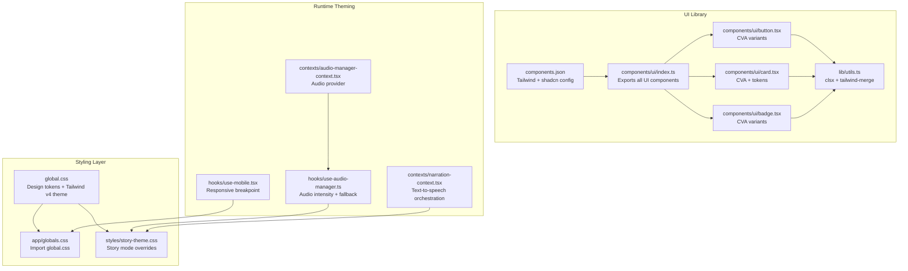
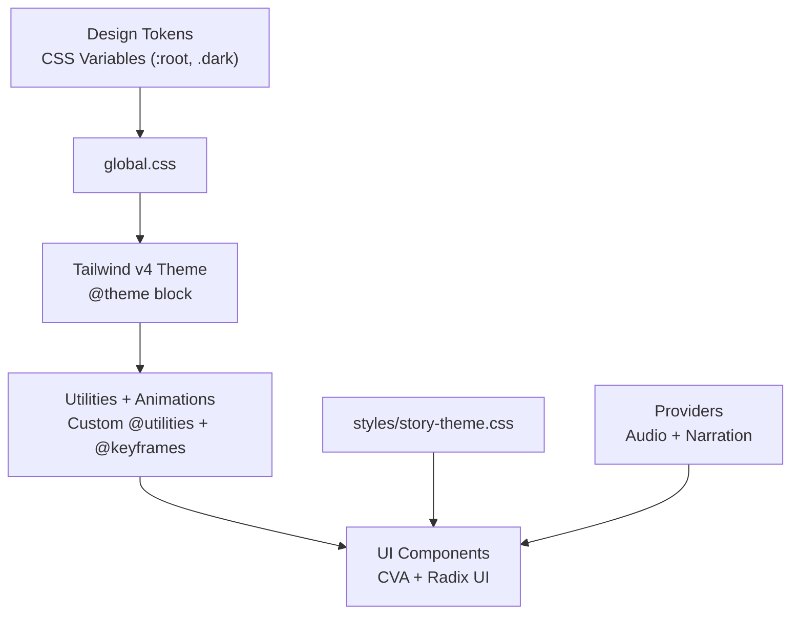
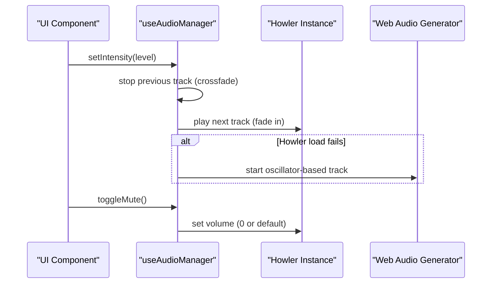
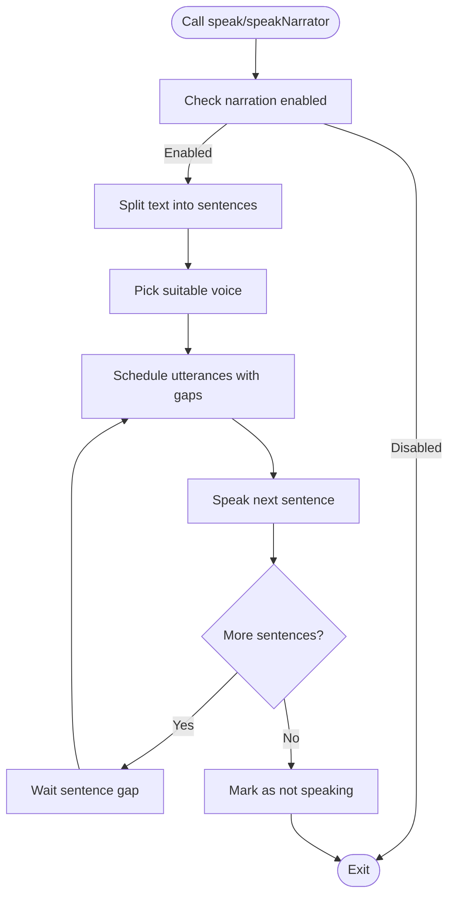
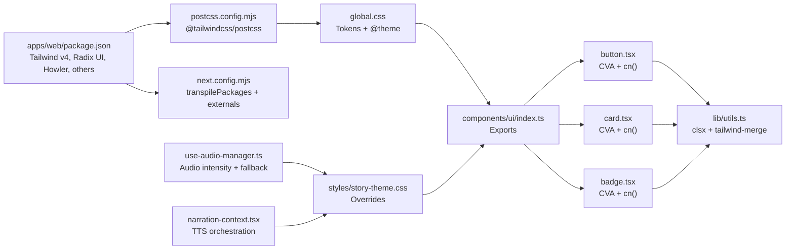

# Design System & Styling

<cite>
**Referenced Files in This Document**
- [package.json](file://apps/web/package.json)
- [next.config.mjs](file://apps/web/next.config.mjs)
- [postcss.config.mjs](file://apps/web/postcss.config.mjs)
- [global.css](file://apps/web/global.css)
- [app/globals.css](file://apps/web/app/globals.css)
- [styles/story-theme.css](file://apps/web/styles/story-theme.css)
- [components.json](file://apps/web/components.json)
- [lib/utils.ts](file://apps/web/lib/utils.ts)
- [components/ui/index.ts](file://apps/web/components/ui/index.ts)
- [components/ui/button.tsx](file://apps/web/components/ui/button.tsx)
- [components/ui/card.tsx](file://apps/web/components/ui/card.tsx)
- [components/ui/badge.tsx](file://apps/web/components/ui/badge.tsx)
- [contexts/audio-manager-context.tsx](file://apps/web/contexts/audio-manager-context.tsx)
- [hooks/use-audio-manager.ts](file://apps/web/hooks/use-audio-manager.ts)
- [contexts/narration-context.tsx](file://apps/web/contexts/narration-context.tsx)
- [hooks/use-mobile.tsx](file://apps/web/hooks/use-mobile.tsx)
</cite>

## Table of Contents
1. [Introduction](#introduction)
2. [Project Structure](#project-structure)
3. [Core Components](#core-components)
4. [Architecture Overview](#architecture-overview)
5. [Detailed Component Analysis](#detailed-component-analysis)
6. [Dependency Analysis](#dependency-analysis)
7. [Performance Considerations](#performance-considerations)
8. [Troubleshooting Guide](#troubleshooting-guide)
9. [Conclusion](#conclusion)
10. [Appendices](#appendices)

## Introduction
This document explains the design system architecture, theming implementation, and styling patterns used in the application. It covers Tailwind CSS v4 configuration, design tokens, color schemes, typography hierarchy, spacing systems, component styling via CSS-in-JS (class-variance-authority), and theme customization. It also documents story-specific theming for narrative elements, audio manager integration for sound effects, responsive design breakpoints, and guidelines for maintaining design consistency, adding new components, and implementing dark/light mode switching. Finally, it addresses performance optimization, browser compatibility, and accessibility considerations.

## Project Structure
The styling system centers around:
- Tailwind CSS v4 configured via PostCSS and a central theme definition
- A design token system defined in CSS variables at the root and dark scope
- Story mode theming overrides for narrative UIs
- A UI component library built with Radix UI primitives and class-variance-authority
- Utility helpers for composing Tailwind classes
- Contexts for audio and narration orchestration

**Diagram sources**
- [global.css](file://apps/web/global.css#L1-L190)
- [app/globals.css](file://apps/web/app/globals.css#L1-L2)
- [styles/story-theme.css](file://apps/web/styles/story-theme.css#L1-L85)
- [components.json](file://apps/web/components.json#L1-L24)
- [components/ui/index.ts](file://apps/web/components/ui/index.ts#L1-L90)
- [components/ui/button.tsx](file://apps/web/components/ui/button.tsx#L1-L53)
- [components/ui/card.tsx](file://apps/web/components/ui/card.tsx#L1-L76)
- [components/ui/badge.tsx](file://apps/web/components/ui/badge.tsx#L1-L36)
- [lib/utils.ts](file://apps/web/lib/utils.ts#L1-L7)
- [contexts/audio-manager-context.tsx](file://apps/web/contexts/audio-manager-context.tsx#L1-L29)
- [hooks/use-audio-manager.ts](file://apps/web/hooks/use-audio-manager.ts#L1-L318)
- [contexts/narration-context.tsx](file://apps/web/contexts/narration-context.tsx#L1-L210)
- [hooks/use-mobile.tsx](file://apps/web/hooks/use-mobile.tsx#L1-L22)

**Section sources**
- [package.json](file://apps/web/package.json#L78-L83)
- [postcss.config.mjs](file://apps/web/postcss.config.mjs#L1-L5)
- [next.config.mjs](file://apps/web/next.config.mjs#L1-L32)
- [global.css](file://apps/web/global.css#L1-L190)
- [app/globals.css](file://apps/web/app/globals.css#L1-L2)
- [styles/story-theme.css](file://apps/web/styles/story-theme.css#L1-L85)
- [components.json](file://apps/web/components.json#L1-L24)
- [lib/utils.ts](file://apps/web/lib/utils.ts#L1-L7)
- [components/ui/index.ts](file://apps/web/components/ui/index.ts#L1-L90)

## Core Components
- Design tokens and theme: Defined as CSS variables in the root and dark scope, then transformed into Tailwind v4 tokens. These drive color, typography, radius, shadows, and animation tokens.
- UI component library: Built with Radix UI primitives and styled via class-variance-authority (CVA) variants. Components compose Tailwind utilities and design tokens.
- Story mode theming: Story-specific overrides apply a dark amber/gold palette and adjust fonts and animations for narrative UIs.
- Audio manager: Provides dynamic intensity-based background tracks and a fallback Web Audio API generator. Integrates with story mode visuals.
- Narration engine: Text-to-speech orchestration with sentence chunking, voice selection, and persistence of user preferences.
- Responsive utilities: Breakpoint hook for mobile-first layouts.

**Section sources**
- [global.css](file://apps/web/global.css#L10-L115)
- [styles/story-theme.css](file://apps/web/styles/story-theme.css#L6-L85)
- [components/ui/button.tsx](file://apps/web/components/ui/button.tsx#L6-L30)
- [components/ui/card.tsx](file://apps/web/components/ui/card.tsx#L4-L16)
- [components/ui/badge.tsx](file://apps/web/components/ui/badge.tsx#L5-L23)
- [contexts/audio-manager-context.tsx](file://apps/web/contexts/audio-manager-context.tsx#L8-L16)
- [hooks/use-audio-manager.ts](file://apps/web/hooks/use-audio-manager.ts#L251-L297)
- [contexts/narration-context.tsx](file://apps/web/contexts/narration-context.tsx#L72-L194)
- [hooks/use-mobile.tsx](file://apps/web/hooks/use-mobile.tsx#L5-L21)

## Architecture Overview
The design system architecture combines:
- Centralized design tokens in CSS variables
- Tailwind v4 theme generation from tokens
- Component styling via CVA with token-driven utilities
- Story mode CSS overrides layered on top of base theme
- Runtime audio and narration contexts that align with visual themes

**Diagram sources**
- [global.css](file://apps/web/global.css#L10-L115)
- [styles/story-theme.css](file://apps/web/styles/story-theme.css#L6-L85)
- [components/ui/button.tsx](file://apps/web/components/ui/button.tsx#L6-L30)
- [components/ui/card.tsx](file://apps/web/components/ui/card.tsx#L4-L16)
- [components/ui/badge.tsx](file://apps/web/components/ui/badge.tsx#L5-L23)
- [contexts/audio-manager-context.tsx](file://apps/web/contexts/audio-manager-context.tsx#L8-L16)
- [hooks/use-audio-manager.ts](file://apps/web/hooks/use-audio-manager.ts#L251-L297)
- [contexts/narration-context.tsx](file://apps/web/contexts/narration-context.tsx#L72-L194)

## Detailed Component Analysis

### Tailwind CSS v4 Configuration and Design Tokens
- Design tokens are defined as CSS variables in the root and dark scope, including background, foreground, primary/accent colors, borders, inputs, ring, and custom brand hues (navy, cream, gold, red, green).
- Tailwind v4 generates color tokens, typography tokens, radii, shadows, and animation tokens from these variables.
- Custom utilities and keyframes are defined for container sizing, thick borders, and motion effects.
- Fonts are declared for sans, mono, and display families.

Implementation highlights:
- Root and dark variable sets define light/dark palettes.
- Tailwind v4 @theme maps variables to generated tokens.
- Custom @utility and @keyframes provide reusable utilities and animations.

**Section sources**
- [global.css](file://apps/web/global.css#L10-L115)
- [global.css](file://apps/web/global.css#L118-L154)
- [global.css](file://apps/web/global.css#L159-L190)

### Story Mode Theming for Narrative Elements
- Story mode applies a dark amber/gold palette with overrides for background, foreground, cards, primary/accent, muted, borders, and destructive colors.
- Typography is customized for titles and body text, with adjusted sizes, line heights, and letter spacing.
- Animations for dialogue cursors and continue prompts are included.
- Legacy token aliases are mapped to maintain compatibility with existing components.

Integration points:
- Story mode classes wrap narrative UIs to inherit the amber/gold theme.
- Audio manager’s intensity transitions complement story visuals.

**Section sources**
- [styles/story-theme.css](file://apps/web/styles/story-theme.css#L6-L48)
- [styles/story-theme.css](file://apps/web/styles/story-theme.css#L50-L85)

### Component Styling Approach and CSS-in-JS Patterns
- Components use class-variance-authority (CVA) to define variant and size scales, ensuring consistent styling across similar components.
- Utilities are merged using a composition helper that combines clsx and tailwind-merge to avoid conflicting classes.
- Components compose Tailwind utilities with design tokens (e.g., colors, shadows, radii) for consistent look-and-feel.

Examples:
- Button variants and sizes are defined via CVA and applied through a composed className.
- Cards use border, background, and foreground tokens with consistent paddings and spacing.
- Badges apply variant-based styling with border and shadow tokens.

**Section sources**
- [components/ui/button.tsx](file://apps/web/components/ui/button.tsx#L6-L30)
- [components/ui/card.tsx](file://apps/web/components/ui/card.tsx#L4-L16)
- [components/ui/badge.tsx](file://apps/web/components/ui/badge.tsx#L5-L23)
- [lib/utils.ts](file://apps/web/lib/utils.ts#L4-L6)

### Theme Customization Options
- Design tokens can be overridden per environment or feature by adjusting CSS variables in :root and .dark scopes.
- Story mode introduces a separate class (.story-mode) to scope overrides without affecting the base theme.
- Tailwind utilities and animations can be extended via custom @utilities and @keyframes blocks.

Practical steps:
- Modify variables in global.css to change base palettes.
- Add or adjust @utilities in global.css for new layout or effect classes.
- Apply .story-mode to narrative containers to activate story overrides.

**Section sources**
- [global.css](file://apps/web/global.css#L10-L115)
- [styles/story-theme.css](file://apps/web/styles/story-theme.css#L6-L48)

### Audio Manager Integration for Sound Effects
- The audio manager provides intensity-based track switching and a fallback Web Audio API generator.
- Tracks are crossfaded for smooth transitions, with a fallback oscillator-based generator when audio fails.
- The manager exposes setters for intensity and mute toggling, enabling integration with story mode visuals.

**Diagram sources**
- [hooks/use-audio-manager.ts](file://apps/web/hooks/use-audio-manager.ts#L251-L297)
- [hooks/use-audio-manager.ts](file://apps/web/hooks/use-audio-manager.ts#L220-L237)
- [hooks/use-audio-manager.ts](file://apps/web/hooks/use-audio-manager.ts#L239-L249)
- [hooks/use-audio-manager.ts](file://apps/web/hooks/use-audio-manager.ts#L299-L314)

**Section sources**
- [contexts/audio-manager-context.tsx](file://apps/web/contexts/audio-manager-context.tsx#L8-L16)
- [hooks/use-audio-manager.ts](file://apps/web/hooks/use-audio-manager.ts#L251-L297)

### Narration Engine for Voice-Over
- The narration provider manages speech synthesis, selecting fantasy-aligned voices and chunking text into sentences with gaps.
- Preferences are persisted to local storage, and the provider supports stopping and interrupting speech.
- Two speaking modes are exposed: regular character dialogue and narrator voice.

**Diagram sources**
- [contexts/narration-context.tsx](file://apps/web/contexts/narration-context.tsx#L112-L164)
- [contexts/narration-context.tsx](file://apps/web/contexts/narration-context.tsx#L166-L178)

**Section sources**
- [contexts/narration-context.tsx](file://apps/web/contexts/narration-context.tsx#L72-L194)

### Responsive Design Breakpoints
- A mobile breakpoint is defined and consumed via a hook that listens to media queries.
- This enables mobile-first component behavior and responsive layout adjustments.

**Section sources**
- [hooks/use-mobile.tsx](file://apps/web/hooks/use-mobile.tsx#L5-L21)

### Typography Hierarchy and Spacing Systems
- Typography tokens derive from CSS variables for sans, mono, and display fonts.
- Spacing and radii are standardized via CSS variables and Tailwind v4 radius tokens.
- Motion tokens include keyframe-driven animations for interactive feedback.

**Section sources**
- [global.css](file://apps/web/global.css#L73-L115)

## Dependency Analysis
The styling stack depends on Tailwind CSS v4, PostCSS, and a small set of runtime libraries for audio and narration. The UI components depend on Radix UI primitives and CVA for variant composition.

**Diagram sources**
- [package.json](file://apps/web/package.json#L78-L83)
- [postcss.config.mjs](file://apps/web/postcss.config.mjs#L1-L5)
- [next.config.mjs](file://apps/web/next.config.mjs#L5-L12)
- [global.css](file://apps/web/global.css#L1-L190)
- [styles/story-theme.css](file://apps/web/styles/story-theme.css#L1-L85)
- [components/ui/index.ts](file://apps/web/components/ui/index.ts#L1-L90)
- [components/ui/button.tsx](file://apps/web/components/ui/button.tsx#L1-L53)
- [components/ui/card.tsx](file://apps/web/components/ui/card.tsx#L1-L76)
- [components/ui/badge.tsx](file://apps/web/components/ui/badge.tsx#L1-L36)
- [lib/utils.ts](file://apps/web/lib/utils.ts#L1-L7)
- [hooks/use-audio-manager.ts](file://apps/web/hooks/use-audio-manager.ts#L1-L318)
- [contexts/narration-context.tsx](file://apps/web/contexts/narration-context.tsx#L1-L210)

**Section sources**
- [package.json](file://apps/web/package.json#L78-L83)
- [postcss.config.mjs](file://apps/web/postcss.config.mjs#L1-L5)
- [next.config.mjs](file://apps/web/next.config.mjs#L5-L12)
- [components.json](file://apps/web/components.json#L6-L12)

## Performance Considerations
- Minimize redundant CSS by leveraging Tailwind utilities and design tokens; avoid ad-hoc inline styles.
- Prefer CVA variants to reduce conditional class logic and improve cache locality.
- Use the composition helper to merge classes efficiently and prevent cascade bloat.
- Defer heavy audio initialization until needed; the audio manager already handles graceful fallbacks and cleanup.
- Keep story mode overrides scoped to targeted containers to limit repaints.
- Use responsive utilities and breakpoints judiciously to avoid excessive media query evaluations.

[No sources needed since this section provides general guidance]

## Troubleshooting Guide
- Theme not applying in story mode:
  - Ensure the story mode class is applied to the container wrapping narrative UIs.
  - Verify that story overrides are imported after base global.css.
- Intermittent audio playback:
  - The audio manager falls back to Web Audio API when Howler fails; confirm fallback is invoked and AudioContext is resumed on user gesture.
- Narration not speaking:
  - Check that narration is enabled and voices are available; sentence chunking requires non-empty text.
- Mobile responsiveness:
  - Confirm the breakpoint hook is used consistently and media queries are not overridden unexpectedly.

**Section sources**
- [styles/story-theme.css](file://apps/web/styles/story-theme.css#L6-L48)
- [hooks/use-audio-manager.ts](file://apps/web/hooks/use-audio-manager.ts#L220-L237)
- [hooks/use-audio-manager.ts](file://apps/web/hooks/use-audio-manager.ts#L239-L249)
- [contexts/narration-context.tsx](file://apps/web/contexts/narration-context.tsx#L112-L164)
- [hooks/use-mobile.tsx](file://apps/web/hooks/use-mobile.tsx#L5-L21)

## Conclusion
The design system leverages Tailwind CSS v4 with a centralized token strategy, a robust UI component library using CVA, and targeted story mode theming. Runtime contexts for audio and narration integrate seamlessly with the visual design. By adhering to the established patterns—tokens, CVA variants, scoped overrides, and responsive hooks—teams can maintain consistency while extending the system with new components and features.

[No sources needed since this section summarizes without analyzing specific files]

## Appendices

### Guidelines for Maintaining Design Consistency
- Define all new colors, typography, and spacing in design tokens before using them in components.
- Use CVA for component variants to keep styling predictable and DRY.
- Scope story-specific overrides with a dedicated class to avoid leaking styles.
- Compose classes with the provided helper to prevent conflicts.

**Section sources**
- [global.css](file://apps/web/global.css#L10-L115)
- [components/ui/button.tsx](file://apps/web/components/ui/button.tsx#L6-L30)
- [lib/utils.ts](file://apps/web/lib/utils.ts#L4-L6)
- [styles/story-theme.css](file://apps/web/styles/story-theme.css#L6-L48)

### Adding New Components to the Design System
- Export the component from the UI index and ensure it composes Tailwind utilities and design tokens.
- Use CVA for variants and sizes; document defaults and allowed values.
- Keep component props minimal and leverage design tokens for colors and spacing.

**Section sources**
- [components/ui/index.ts](file://apps/web/components/ui/index.ts#L1-L90)
- [components/ui/button.tsx](file://apps/web/components/ui/button.tsx#L6-L30)
- [components/ui/card.tsx](file://apps/web/components/ui/card.tsx#L4-L16)
- [components/ui/badge.tsx](file://apps/web/components/ui/badge.tsx#L5-L23)

### Implementing Dark/Light Mode Switching
- Toggle the dark class on the root element to switch between token sets.
- Ensure all components consume tokens rather than hardcoding values.
- Verify that story mode overrides remain consistent under both themes.

**Section sources**
- [global.css](file://apps/web/global.css#L45-L68)
- [global.css](file://apps/web/global.css#L10-L44)

### Accessibility Compliance
- Prefer semantic HTML and ensure sufficient color contrast against themed backgrounds.
- Provide keyboard navigation support via Radix UI primitives.
- Announce dynamic content changes for narration and audio cues.
- Test responsive behavior across devices and screen sizes.

[No sources needed since this section provides general guidance]