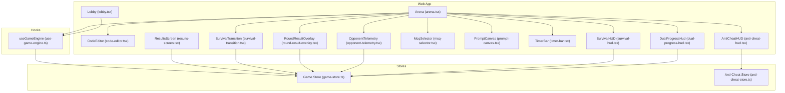
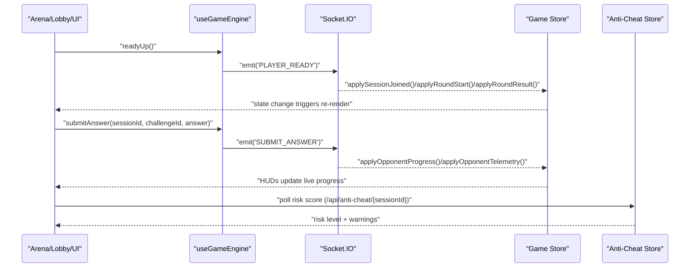
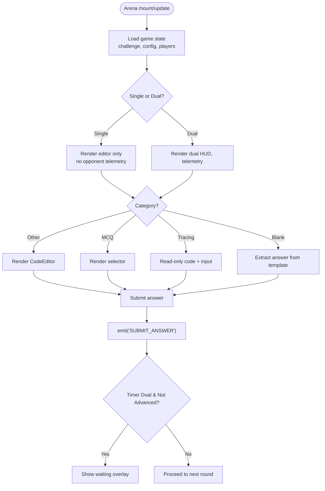
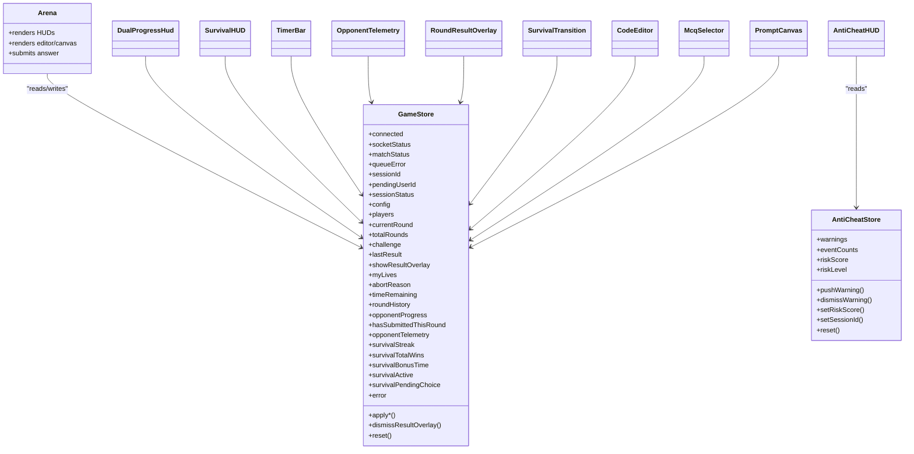

# Game-Specific Components

<cite>
**Referenced Files in This Document**
- [arena.tsx](file://apps/web/components/game/arena.tsx)
- [code-editor.tsx](file://apps/web/components/game/code-editor.tsx)
- [lobby.tsx](file://apps/web/components/game/lobby.tsx)
- [anti-cheat-hud.tsx](file://apps/web/components/game/anti-cheat-hud.tsx)
- [dual-progress-hud.tsx](file://apps/web/components/game/dual-progress-hud.tsx)
- [timer-bar.tsx](file://apps/web/components/game/timer-bar.tsx)
- [opponent-telemetry.tsx](file://apps/web/components/game/opponent-telemetry.tsx)
- [mcq-selector.tsx](file://apps/web/components/game/mcq-selector.tsx)
- [prompt-canvas.tsx](file://apps/web/components/game/prompt-canvas.tsx)
- [round-result-overlay.tsx](file://apps/web/components/game/round-result-overlay.tsx)
- [survival-hud.tsx](file://apps/web/components/game/survival-hud.tsx)
- [survival-transition.tsx](file://apps/web/components/game/survival-transition.tsx)
- [results-screen.tsx](file://apps/web/components/game/results-screen.tsx)
- [game-store.ts](file://apps/web/store/game-store.ts)
- [anti-cheat-store.ts](file://apps/web/store/anti-cheat-store.ts)
- [use-game-engine.ts](file://apps/web/hooks/use-game-engine.ts)
</cite>

## Table of Contents
1. [Introduction](#introduction)
2. [Project Structure](#project-structure)
3. [Core Components](#core-components)
4. [Architecture Overview](#architecture-overview)
5. [Detailed Component Analysis](#detailed-component-analysis)
6. [Dependency Analysis](#dependency-analysis)
7. [Performance Considerations](#performance-considerations)
8. [Troubleshooting Guide](#troubleshooting-guide)
9. [Conclusion](#conclusion)
10. [Appendices](#appendices)

## Introduction
This document provides comprehensive documentation for game-specific UI components used in competitive programming sessions. It focuses on:
- Arena: real-time battle visualization and interactive coding environment
- CodeEditor: challenge solving interface powered by Monaco
- Lobby: player waiting and preparation area
- HUD components: anti-cheat monitoring, progress tracking, and survival indicators

It explains state management via Zustand stores, real-time data binding through WebSocket integration, component interactions during gameplay, event handling, and user feedback mechanisms. It also covers composition patterns across game modes, responsive design considerations, performance optimizations for real-time updates, accessibility, and cross-platform compatibility.

## Project Structure
The game UI components are organized under the web application’s game module. Key areas:
- Components: arena, lobby, HUDs, editor, canvases, overlays, selectors
- Stores: game-store (global game state), anti-cheat-store (anti-cheat telemetry)
- Hooks: use-game-engine (WebSocket orchestration and actions)
- Pages: arena page integrates the Arena component

**Diagram sources**
- [arena.tsx](file://apps/web/components/game/arena.tsx#L48-L394)
- [code-editor.tsx](file://apps/web/components/game/code-editor.tsx#L13-L66)
- [lobby.tsx](file://apps/web/components/game/lobby.tsx#L9-L160)
- [anti-cheat-hud.tsx](file://apps/web/components/game/anti-cheat-hud.tsx#L29-L128)
- [dual-progress-hud.tsx](file://apps/web/components/game/dual-progress-hud.tsx#L48-L174)
- [timer-bar.tsx](file://apps/web/components/game/timer-bar.tsx#L6-L41)
- [opponent-telemetry.tsx](file://apps/web/components/game/opponent-telemetry.tsx#L18-L98)
- [mcq-selector.tsx](file://apps/web/components/game/mcq-selector.tsx#L16-L132)
- [prompt-canvas.tsx](file://apps/web/components/game/prompt-canvas.tsx#L12-L128)
- [round-result-overlay.tsx](file://apps/web/components/game/round-result-overlay.tsx#L21-L160)
- [survival-hud.tsx](file://apps/web/components/game/survival-hud.tsx#L11-L48)
- [survival-transition.tsx](file://apps/web/components/game/survival-transition.tsx#L11-L69)
- [results-screen.tsx](file://apps/web/components/game/results-screen.tsx#L19-L237)
- [game-store.ts](file://apps/web/store/game-store.ts#L77-L393)
- [anti-cheat-store.ts](file://apps/web/store/anti-cheat-store.ts#L20-L107)
- [use-game-engine.ts](file://apps/web/hooks/use-game-engine.ts#L80-L465)

**Section sources**
- [arena.tsx](file://apps/web/components/game/arena.tsx#L48-L394)
- [lobby.tsx](file://apps/web/components/game/lobby.tsx#L9-L160)
- [game-store.ts](file://apps/web/store/game-store.ts#L77-L393)
- [anti-cheat-store.ts](file://apps/web/store/anti-cheat-store.ts#L20-L107)
- [use-game-engine.ts](file://apps/web/hooks/use-game-engine.ts#L80-L465)

## Core Components
- Arena: Central stage for real-time battles. Integrates editor, canvas, timers, HUDs, overlays, and telemetry. Handles challenge categories, submission logic, and dual vs single mode differences.
- CodeEditor: Monaco-powered editor with theme customization, controlled synchronization, and read-only modes.
- Lobby: Matchmaking and readiness flow for single and dual modes, with animated feedback and retry controls.
- HUDs: Anti-Cheat HUD (risk badges and warning toasts), Dual Progress HUD (live vs timer mode), Survival HUD (streak and bonus time), Timer Bar (visual countdown).
- Telemetry and Overlays: Opponent Telemetry (progress and typing indicators), Round Result Overlay (verdict and timing), Survival Transition (between rounds).

**Section sources**
- [arena.tsx](file://apps/web/components/game/arena.tsx#L48-L394)
- [code-editor.tsx](file://apps/web/components/game/code-editor.tsx#L13-L66)
- [lobby.tsx](file://apps/web/components/game/lobby.tsx#L9-L160)
- [anti-cheat-hud.tsx](file://apps/web/components/game/anti-cheat-hud.tsx#L29-L128)
- [dual-progress-hud.tsx](file://apps/web/components/game/dual-progress-hud.tsx#L48-L174)
- [timer-bar.tsx](file://apps/web/components/game/timer-bar.tsx#L6-L41)
- [opponent-telemetry.tsx](file://apps/web/components/game/opponent-telemetry.tsx#L18-L98)
- [round-result-overlay.tsx](file://apps/web/components/game/round-result-overlay.tsx#L21-L160)
- [survival-hud.tsx](file://apps/web/components/game/survival-hud.tsx#L11-L48)
- [survival-transition.tsx](file://apps/web/components/game/survival-transition.tsx#L11-L69)

## Architecture Overview
The system uses a unidirectional data flow:
- WebSocket events (via Socket.IO) update the game store.
- Components subscribe to the store and re-render.
- The engine hook encapsulates connection lifecycle, authentication, and action dispatchers (ready, submit, telemetry).
- Anti-Cheat HUD polls risk metrics and manages warning toasts.

**Diagram sources**
- [use-game-engine.ts](file://apps/web/hooks/use-game-engine.ts#L445-L455)
- [use-game-engine.ts](file://apps/web/hooks/use-game-engine.ts#L298-L308)
- [use-game-engine.ts](file://apps/web/hooks/use-game-engine.ts#L230-L236)
- [game-store.ts](file://apps/web/store/game-store.ts#L236-L335)
- [anti-cheat-hud.tsx](file://apps/web/components/game/anti-cheat-hud.tsx#L37-L57)
- [anti-cheat-store.ts](file://apps/web/store/anti-cheat-store.ts#L79-L83)

## Detailed Component Analysis

### Arena Component
Purpose:
- Hosts the real-time battle UI with resizable panels, challenge canvas, editor, and HUDs.
- Supports multiple challenge categories and modes (single/dual, timer/live).
- Manages submission logic, typing telemetry, and dual-mode waiting overlays.

Key behaviors:
- Dynamic rendering based on challenge category and session config.
- Typing telemetry throttled emission for single/dual code challenges.
- Dual-mode “waiting for opponent” overlay during timer mode.
- Submission handler aggregates answers for different categories.

**Diagram sources**
- [arena.tsx](file://apps/web/components/game/arena.tsx#L48-L144)
- [arena.tsx](file://apps/web/components/game/arena.tsx#L111-L125)
- [use-game-engine.ts](file://apps/web/hooks/use-game-engine.ts#L298-L308)

**Section sources**
- [arena.tsx](file://apps/web/components/game/arena.tsx#L48-L394)
- [code-editor.tsx](file://apps/web/components/game/code-editor.tsx#L13-L66)
- [mcq-selector.tsx](file://apps/web/components/game/mcq-selector.tsx#L16-L132)
- [prompt-canvas.tsx](file://apps/web/components/game/prompt-canvas.tsx#L12-L128)
- [opponent-telemetry.tsx](file://apps/web/components/game/opponent-telemetry.tsx#L18-L98)
- [dual-progress-hud.tsx](file://apps/web/components/game/dual-progress-hud.tsx#L48-L174)
- [survival-hud.tsx](file://apps/web/components/game/survival-hud.tsx#L11-L48)
- [timer-bar.tsx](file://apps/web/components/game/timer-bar.tsx#L6-L41)
- [round-result-overlay.tsx](file://apps/web/components/game/round-result-overlay.tsx#L21-L160)
- [use-game-engine.ts](file://apps/web/hooks/use-game-engine.ts#L310-L333)

### CodeEditor Component
Purpose:
- Provides a Monaco-based editor tailored for competitive programming.
- Synchronizes code templates across rounds and supports read-only mode.

Implementation highlights:
- Controlled value synchronization to prevent drift when templates change.
- Custom dark theme with editor background overrides.
- Options tuned for readability and performance (minimap disabled, smooth caret, format on paste).

**Section sources**
- [code-editor.tsx](file://apps/web/components/game/code-editor.tsx#L13-L66)

### Lobby Component
Purpose:
- Handles matchmaking and readiness for single and dual modes.
- Presents error handling with retry and animated feedback.

Key behaviors:
- Single mode auto-readiness after a short countdown.
- Dual mode shows queued/searching state and a ready button.
- Error state displays retry controls.

**Section sources**
- [lobby.tsx](file://apps/web/components/game/lobby.tsx#L9-L160)

### HUD Components

#### AntiCheatHUD
Purpose:
- Visualizes anti-cheat risk level and recent events.
- Polls risk score periodically and auto-dismisses warnings.

Highlights:
- Risk levels mapped to icons and colors.
- Event counters and total flags display.
- Toast notifications with manual dismissal and auto-dismiss timer.

**Section sources**
- [anti-cheat-hud.tsx](file://apps/web/components/game/anti-cheat-hud.tsx#L29-L128)
- [anti-cheat-store.ts](file://apps/web/store/anti-cheat-store.ts#L20-L107)

#### DualProgressHud
Purpose:
- Shows live progress and status for dual sessions.
- Timer mode: “you submitted / opponent solving…” messaging.
- Live mode: side-by-side round numbers and lives.

**Section sources**
- [dual-progress-hud.tsx](file://apps/web/components/game/dual-progress-hud.tsx#L48-L174)

#### SurvivalHUD
Purpose:
- Displays current streak and bonus time in survival mode.
- Animated entrance for emphasis.

**Section sources**
- [survival-hud.tsx](file://apps/web/components/game/survival-hud.tsx#L11-L48)

#### TimerBar
Purpose:
- Visual countdown with color transitions (green → yellow → red).
- Displays formatted time remaining.

**Section sources**
- [timer-bar.tsx](file://apps/web/components/game/timer-bar.tsx#L6-L41)

### Telemetry and Overlays

#### OpponentTelemetry
Purpose:
- Live progress bars for self and opponent.
- Typing indicator when opponent WPM exceeds threshold.
- Optional callback for SFX on significant progress jumps.

**Section sources**
- [opponent-telemetry.tsx](file://apps/web/components/game/opponent-telemetry.tsx#L18-L98)
- [game-store.ts](file://apps/web/store/game-store.ts#L68-L75)

#### RoundResultOverlay
Purpose:
- Displays verdict, score delta, and lives in live mode.
- Timer-dual mode waits for opponent completion; others auto-dismiss after countdown.

**Section sources**
- [round-result-overlay.tsx](file://apps/web/components/game/round-result-overlay.tsx#L21-L160)

#### SurvivalTransition
Purpose:
- Between-round overlay in survival mode showing streak and +30s bonus.

**Section sources**
- [survival-transition.tsx](file://apps/web/components/game/survival-transition.tsx#L11-L69)

### Results Screen
Purpose:
- Post-session summary with outcomes, stats, and survival continuation choices.

**Section sources**
- [results-screen.tsx](file://apps/web/components/game/results-screen.tsx#L19-L237)

## Dependency Analysis
Component and store relationships:

**Diagram sources**
- [game-store.ts](file://apps/web/store/game-store.ts#L77-L393)
- [anti-cheat-store.ts](file://apps/web/store/anti-cheat-store.ts#L20-L107)
- [arena.tsx](file://apps/web/components/game/arena.tsx#L48-L394)
- [anti-cheat-hud.tsx](file://apps/web/components/game/anti-cheat-hud.tsx#L29-L128)
- [dual-progress-hud.tsx](file://apps/web/components/game/dual-progress-hud.tsx#L48-L174)
- [survival-hud.tsx](file://apps/web/components/game/survival-hud.tsx#L11-L48)
- [timer-bar.tsx](file://apps/web/components/game/timer-bar.tsx#L6-L41)
- [opponent-telemetry.tsx](file://apps/web/components/game/opponent-telemetry.tsx#L18-L98)
- [round-result-overlay.tsx](file://apps/web/components/game/round-result-overlay.tsx#L21-L160)
- [survival-transition.tsx](file://apps/web/components/game/survival-transition.tsx#L11-L69)
- [code-editor.tsx](file://apps/web/components/game/code-editor.tsx#L13-L66)
- [mcq-selector.tsx](file://apps/web/components/game/mcq-selector.tsx#L16-L132)
- [prompt-canvas.tsx](file://apps/web/components/game/prompt-canvas.tsx#L12-L128)

**Section sources**
- [game-store.ts](file://apps/web/store/game-store.ts#L77-L393)
- [anti-cheat-store.ts](file://apps/web/store/anti-cheat-store.ts#L20-L107)
- [arena.tsx](file://apps/web/components/game/arena.tsx#L48-L394)

## Performance Considerations
- Real-time throttling:
  - Typing telemetry is throttled to reduce WebSocket traffic.
  - Timer updates use minimal re-renders via targeted state fields.
- Efficient rendering:
  - Monaco editor configured to minimize layout thrash (disabled minimap, smooth scrolling).
  - Canvas-based prompt rendering scales with device pixel ratio and observes resize.
- Store granularity:
  - Separate anti-cheat store prevents unnecessary Arena re-renders.
  - HUDs subscribe only to their relevant slices of state.
- WebSocket lifecycle:
  - Singleton socket with token updates and reconnection strategy.
  - Acknowledged emits for session joins to avoid race conditions.

[No sources needed since this section provides general guidance]

## Troubleshooting Guide
Common issues and remedies:
- Session join failures:
  - Check engine’s queue error state and SESSION_ERROR handling.
  - Verify authentication token propagation to the socket.
- Missing opponent telemetry:
  - Confirm OPPONENT_PROGRESS and OPPONENT_TELEMETRY events are flowing and applied to the store.
- Anti-cheat HUD not updating:
  - Ensure periodic polling succeeds and risk score is set in the store.
- Round result overlay not dismissing:
  - In timer-dual mode, overlay remains until next ROUND_START; verify session end sequencing.
- Lobby stuck in error:
  - Use the retry button to reset the store and reattempt matchmaking.

**Section sources**
- [use-game-engine.ts](file://apps/web/hooks/use-game-engine.ts#L180-L183)
- [use-game-engine.ts](file://apps/web/hooks/use-game-engine.ts#L360-L392)
- [anti-cheat-hud.tsx](file://apps/web/components/game/anti-cheat-hud.tsx#L37-L57)
- [round-result-overlay.tsx](file://apps/web/components/game/round-result-overlay.tsx#L40-L63)
- [lobby.tsx](file://apps/web/components/game/lobby.tsx#L33-L61)

## Conclusion
The game UI components form a cohesive, real-time system centered around a robust store and WebSocket-driven engine. Arena orchestrates diverse challenge types and modes, while dedicated HUDs provide transparency and safety. The architecture emphasizes separation of concerns, efficient state updates, and responsive UX, enabling competitive programming sessions with strong anti-cheat visibility and smooth interactivity.

[No sources needed since this section summarizes without analyzing specific files]

## Appendices

### Component Composition Across Game Modes
- Single mode:
  - Arena renders editor only; no opponent telemetry; auto-ready countdown.
- Dual mode:
  - Timer mode: waiting overlay while opponent solves; dual HUD shows submission status.
  - Live mode: side-by-side lives and round numbers; optional lives display.
- Challenge categories:
  - MCQ: renders selector with keyboard shortcuts.
  - Tracing: read-only code + answer input.
  - Blank: extracts answer from template.
  - Other: standard editor.

**Section sources**
- [arena.tsx](file://apps/web/components/game/arena.tsx#L74-L78)
- [arena.tsx](file://apps/web/components/game/arena.tsx#L111-L125)
- [dual-progress-hud.tsx](file://apps/web/components/game/dual-progress-hud.tsx#L70-L137)
- [mcq-selector.tsx](file://apps/web/components/game/mcq-selector.tsx#L16-L132)
- [prompt-canvas.tsx](file://apps/web/components/game/prompt-canvas.tsx#L12-L128)

### Accessibility and Cross-Platform Compatibility
- Keyboard navigation:
  - MCQ selector supports A/B/C/D shortcuts.
  - Arena submit via Enter key for tracing.
- Visual contrast and readability:
  - Dark theme with sufficient contrast for code and HUDs.
  - Monospace fonts and readable sizes for terminals-like experience.
- Responsive layout:
  - Resizable panels adapt to viewport; canvas and overlays adjust to container size.
- Cross-browser:
  - Monaco editor and Canvas APIs are broadly supported; ensure polyfills if targeting legacy environments.

**Section sources**
- [mcq-selector.tsx](file://apps/web/components/game/mcq-selector.tsx#L19-L30)
- [prompt-canvas.tsx](file://apps/web/components/game/prompt-canvas.tsx#L67-L72)
- [code-editor.tsx](file://apps/web/components/game/code-editor.tsx#L49-L62)