# Shared UI Components

<cite>
**Referenced Files in This Document**
- [index.ts](file://apps/web/components/ui/index.ts)
- [button.tsx](file://apps/web/components/ui/button.tsx)
- [input.tsx](file://apps/web/components/ui/input.tsx)
- [card.tsx](file://apps/web/components/ui/card.tsx)
- [dialog.tsx](file://apps/web/components/ui/dialog.tsx)
- [tabs.tsx](file://apps/web/components/ui/tabs.tsx)
- [select.tsx](file://apps/web/components/ui/select.tsx)
- [checkbox.tsx](file://apps/web/components/ui/checkbox.tsx)
- [switch.tsx](file://apps/web/components/ui/switch.tsx)
- [slider.tsx](file://apps/web/components/ui/slider.tsx)
- [badge.tsx](file://apps/web/components/ui/badge.tsx)
- [textarea.tsx](file://apps/web/components/ui/textarea.tsx)
- [label.tsx](file://apps/web/components/ui/label.tsx)
- [avatar.tsx](file://apps/web/components/ui/avatar.tsx)
- [progress.tsx](file://apps/web/components/ui/progress.tsx)
</cite>

## Table of Contents
1. [Introduction](#introduction)
2. [Project Structure](#project-structure)
3. [Core Components](#core-components)
4. [Architecture Overview](#architecture-overview)
5. [Detailed Component Analysis](#detailed-component-analysis)
6. [Dependency Analysis](#dependency-analysis)
7. [Performance Considerations](#performance-considerations)
8. [Accessibility and Keyboard Navigation](#accessibility-and-keyboard-navigation)
9. [Usage Examples and Patterns](#usage-examples-and-patterns)
10. [Extending Components and Consistency Guidelines](#extending-components-and-consistency-guidelines)
11. [Troubleshooting Guide](#troubleshooting-guide)
12. [Conclusion](#conclusion)

## Introduction
This document describes the shared UI component library used across the application. It focuses on reusable primitives and composite components such as Button, Input, Card, Dialog, Tabs, Select, Checkbox, Switch, Slider, and related form and layout primitives. The guide explains component architecture, export structure, styling and customization patterns, accessibility, keyboard navigation, composition patterns, and performance considerations. It also provides guidance for extending components while maintaining design system consistency.

## Project Structure
The UI components are organized under a single directory and exported via a central index file. Each component is self-contained, leveraging Radix UI primitives for accessibility and composability, Tailwind-based styling via a shared utility, and optional variant systems for consistent customization.

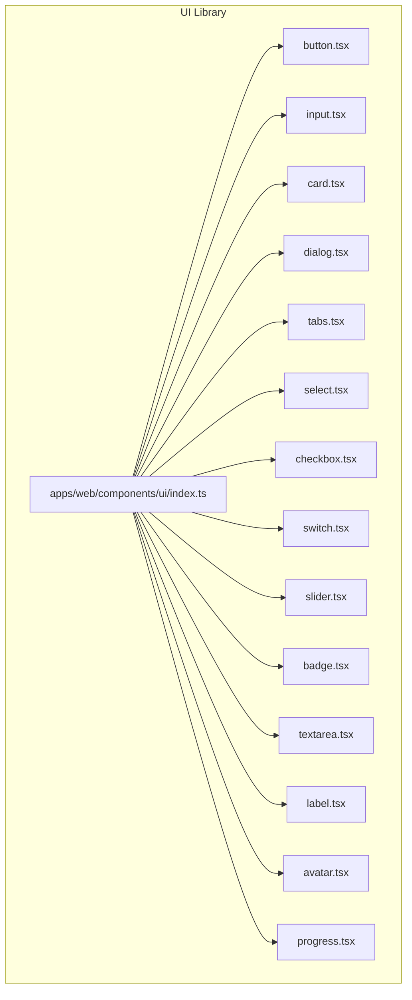

**Diagram sources**
- [index.ts](file://apps/web/components/ui/index.ts#L1-L90)

**Section sources**
- [index.ts](file://apps/web/components/ui/index.ts#L1-L90)

## Core Components
This section summarizes the primary components covered by the documentation objective and their roles in the design system.

- Button: Variants and sizes with consistent focus/ring behavior and icon support.
- Input: Text input with focus states and responsive typography.
- Card: Composite container with header, footer, title, description, and content slots.
- Dialog: Modal overlay with portal rendering, close trigger, and animation states.
- Tabs: Accessible tab list, triggers, and content areas.
- Select: Composite select with scroll buttons, viewport, and item selection.
- Checkbox: Accessible two-state toggle with indicator.
- Switch: Accessible toggle switch with thumb animation.
- Slider: Accessible range slider with track and draggable thumb.
- Additional primitives: Badge, Textarea, Label, Avatar, Progress.

**Section sources**
- [button.tsx](file://apps/web/components/ui/button.tsx#L1-L53)
- [input.tsx](file://apps/web/components/ui/input.tsx#L1-L22)
- [card.tsx](file://apps/web/components/ui/card.tsx#L1-L76)
- [dialog.tsx](file://apps/web/components/ui/dialog.tsx#L1-L120)
- [tabs.tsx](file://apps/web/components/ui/tabs.tsx#L1-L55)
- [select.tsx](file://apps/web/components/ui/select.tsx#L1-L157)
- [checkbox.tsx](file://apps/web/components/ui/checkbox.tsx#L1-L30)
- [switch.tsx](file://apps/web/components/ui/switch.tsx#L1-L29)
- [slider.tsx](file://apps/web/components/ui/slider.tsx#L1-L28)
- [badge.tsx](file://apps/web/components/ui/badge.tsx#L1-L36)
- [textarea.tsx](file://apps/web/components/ui/textarea.tsx#L1-L22)
- [label.tsx](file://apps/web/components/ui/label.tsx#L1-L26)
- [avatar.tsx](file://apps/web/components/ui/avatar.tsx#L1-L50)
- [progress.tsx](file://apps/web/components/ui/progress.tsx#L1-L28)

## Architecture Overview
The UI library follows a consistent pattern:
- Each component composes Radix UI primitives for accessibility and state management.
- Styling is applied via a shared utility that merges Tailwind classes with component-specific defaults.
- Variants are defined using a variant engine to ensure consistent design tokens and scales.
- Composite components expose multiple subcomponents (e.g., DialogContent, DialogHeader) for flexible composition.

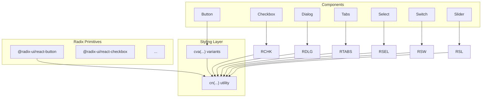

**Diagram sources**
- [button.tsx](file://apps/web/components/ui/button.tsx#L6-L30)
- [checkbox.tsx](file://apps/web/components/ui/checkbox.tsx#L8-L26)
- [dialog.tsx](file://apps/web/components/ui/dialog.tsx#L13-L54)
- [tabs.tsx](file://apps/web/components/ui/tabs.tsx#L9-L52)
- [select.tsx](file://apps/web/components/ui/select.tsx#L12-L97)
- [switch.tsx](file://apps/web/components/ui/switch.tsx#L7-L25)
- [slider.tsx](file://apps/web/components/ui/slider.tsx#L7-L24)

## Detailed Component Analysis

### Button
- Purpose: Primary action element with multiple variants and sizes.
- Props:
  - Inherits base button attributes.
  - variant: default, destructive, outline, secondary, ghost, link.
  - size: default, sm, lg, icon.
  - asChild: renders as a slot to preserve semantics.
- Defaults: variant default, size default.
- Styling: Uses a variant system and a slot renderer to wrap native button or custom elements.
- Accessibility: Inherits focus-visible ring and disabled states from base styles.

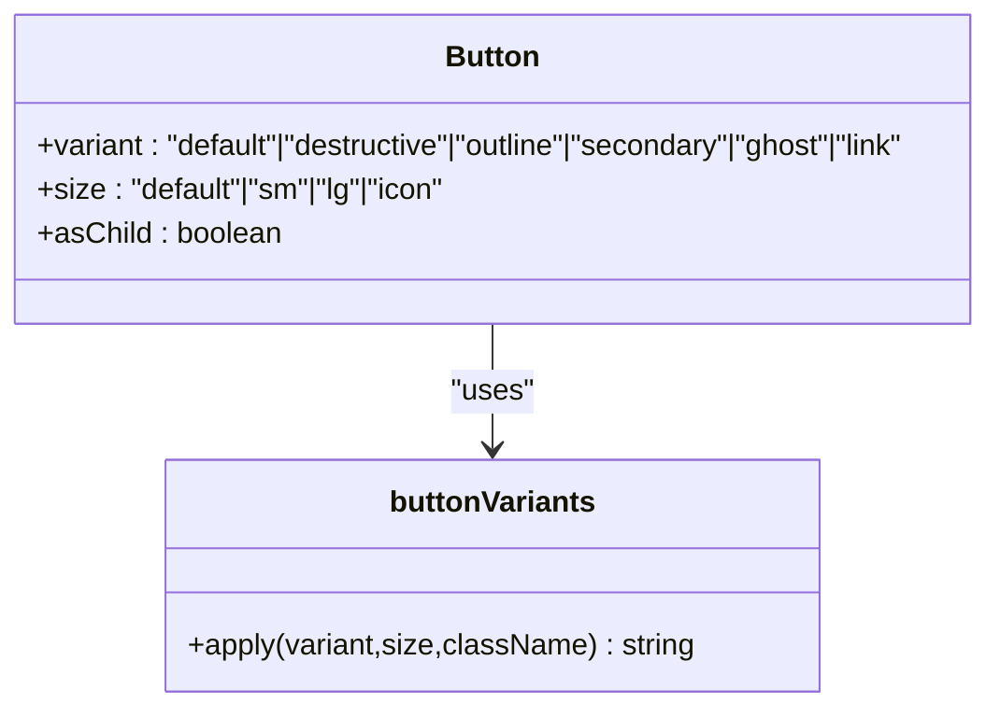

**Diagram sources**
- [button.tsx](file://apps/web/components/ui/button.tsx#L6-L30)
- [button.tsx](file://apps/web/components/ui/button.tsx#L32-L50)

**Section sources**
- [button.tsx](file://apps/web/components/ui/button.tsx#L1-L53)

### Input
- Purpose: Text input field with consistent focus states and responsive typography.
- Props: Inherits standard input attributes; supports type and className.
- Defaults: None; relies on base Tailwind classes for appearance.
- Styling: Merges className with base input styles; includes focus-visible ring and disabled states.

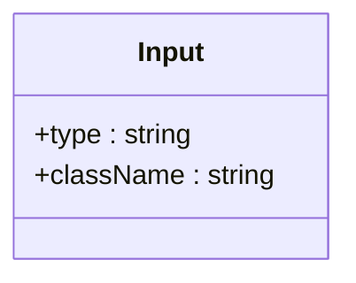

**Diagram sources**
- [input.tsx](file://apps/web/components/ui/input.tsx#L4-L18)

**Section sources**
- [input.tsx](file://apps/web/components/ui/input.tsx#L1-L22)

### Card
- Purpose: Container for grouping related content with standardized spacing and typography.
- Subcomponents: Card, CardHeader, CardFooter, CardTitle, CardDescription, CardContent.
- Props: Accept standard HTML attributes; subcomponents tailor layout and padding.
- Defaults: Base card background, border, and shadow; subcomponents define spacing and typography.

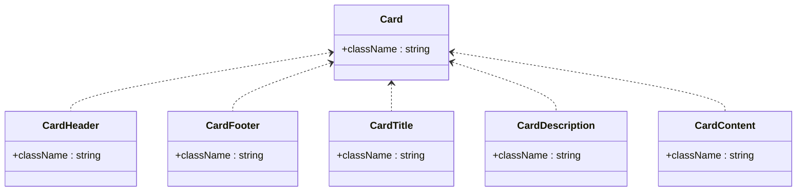

**Diagram sources**
- [card.tsx](file://apps/web/components/ui/card.tsx#L4-L17)
- [card.tsx](file://apps/web/components/ui/card.tsx#L19-L29)
- [card.tsx](file://apps/web/components/ui/card.tsx#L31-L53)
- [card.tsx](file://apps/web/components/ui/card.tsx#L55-L73)

**Section sources**
- [card.tsx](file://apps/web/components/ui/card.tsx#L1-L76)

### Dialog
- Purpose: Modal overlay with animated entrance/exit and optional close button.
- Subcomponents: Dialog, DialogPortal, DialogOverlay, DialogTrigger, DialogClose, DialogContent, DialogHeader, DialogFooter, DialogTitle, DialogDescription.
- Props:
  - DialogContent accepts showClose flag to toggle the close button.
  - Overlay and Content animate based on open/closed state.
- Defaults: Overlay backdrop; Content centered with rounded corners and shadow.
- Accessibility: Uses Radix Dialog primitives; includes sr-only text for close button.

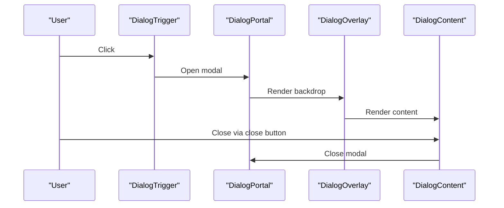

**Diagram sources**
- [dialog.tsx](file://apps/web/components/ui/dialog.tsx#L8-L54)

**Section sources**
- [dialog.tsx](file://apps/web/components/ui/dialog.tsx#L1-L120)

### Tabs
- Purpose: Tabbed interface with accessible keyboard navigation and active state indication.
- Subcomponents: Tabs, TabsList, TabsTrigger, TabsContent.
- Props: Inherits Radix Tabs attributes; triggers reflect active state via data attributes.
- Defaults: Background and text color for inactive tabs; active state styling applied conditionally.

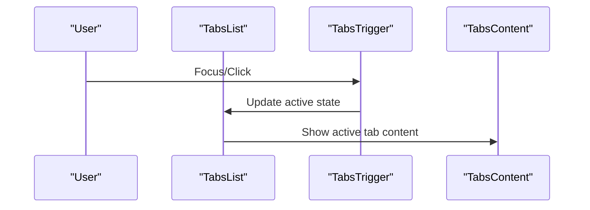

**Diagram sources**
- [tabs.tsx](file://apps/web/components/ui/tabs.tsx#L9-L52)

**Section sources**
- [tabs.tsx](file://apps/web/components/ui/tabs.tsx#L1-L55)

### Select
- Purpose: Accessible dropdown/select with scrollable viewport and item indicators.
- Subcomponents: Select, SelectGroup, SelectValue, SelectTrigger, SelectContent, SelectLabel, SelectItem, SelectSeparator, SelectScrollUpButton, SelectScrollDownButton.
- Props:
  - SelectTrigger includes icon and placeholder handling.
  - SelectContent supports positioning modes (popper vs inline).
- Defaults: Trigger height/width synced via Radix variables; popper positioning adjustments.

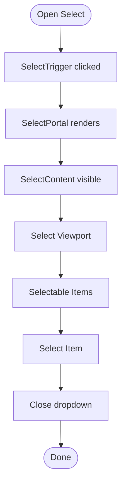

**Diagram sources**
- [select.tsx](file://apps/web/components/ui/select.tsx#L12-L97)

**Section sources**
- [select.tsx](file://apps/web/components/ui/select.tsx#L1-L157)

### Checkbox
- Purpose: Two-state toggle with accessible indicator.
- Props: Inherits Radix Checkbox attributes; indicator displays checkmark when checked.
- Defaults: Size and border based on theme tokens; checked state applies background and text color.

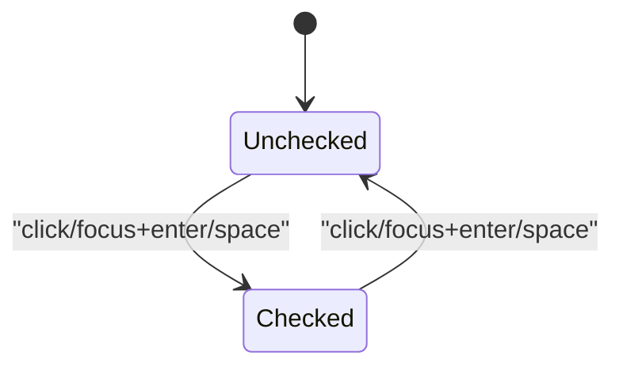

**Diagram sources**
- [checkbox.tsx](file://apps/web/components/ui/checkbox.tsx#L8-L26)

**Section sources**
- [checkbox.tsx](file://apps/web/components/ui/checkbox.tsx#L1-L30)

### Switch
- Purpose: Toggle switch with animated thumb movement.
- Props: Inherits Radix Switch attributes; thumb translates based on checked state.
- Defaults: Thumb size and transition; checked/unchecked backgrounds mapped to theme tokens.

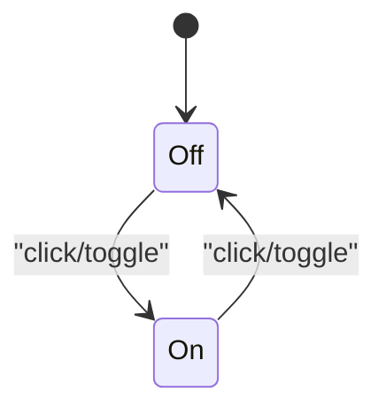

**Diagram sources**
- [switch.tsx](file://apps/web/components/ui/switch.tsx#L7-L25)

**Section sources**
- [switch.tsx](file://apps/web/components/ui/switch.tsx#L1-L29)

### Slider
- Purpose: Range slider with draggable thumb and visual progress.
- Props: Inherits Radix Slider attributes; track and range represent progress visually.
- Defaults: Track height and thumb size; focus-visible ring for accessibility.

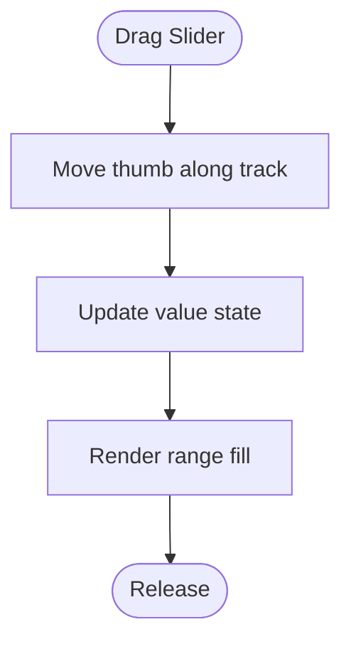

**Diagram sources**
- [slider.tsx](file://apps/web/components/ui/slider.tsx#L7-L24)

**Section sources**
- [slider.tsx](file://apps/web/components/ui/slider.tsx#L1-L28)

### Additional Primitives
- Badge: Lightweight status/label with variant system.
- Textarea: Multi-line text input with focus states.
- Label: Associated label for form controls with disabled state handling.
- Avatar: Image container with fallback visuals.
- Progress: Determinate progress bar with dynamic width.

**Section sources**
- [badge.tsx](file://apps/web/components/ui/badge.tsx#L1-L36)
- [textarea.tsx](file://apps/web/components/ui/textarea.tsx#L1-L22)
- [label.tsx](file://apps/web/components/ui/label.tsx#L1-L26)
- [avatar.tsx](file://apps/web/components/ui/avatar.tsx#L1-L50)
- [progress.tsx](file://apps/web/components/ui/progress.tsx#L1-L28)

## Dependency Analysis
The UI components depend on:
- Radix UI primitives for accessible state management and keyboard interactions.
- A shared utility for merging Tailwind classes.
- A variant engine for consistent design tokens and scales.

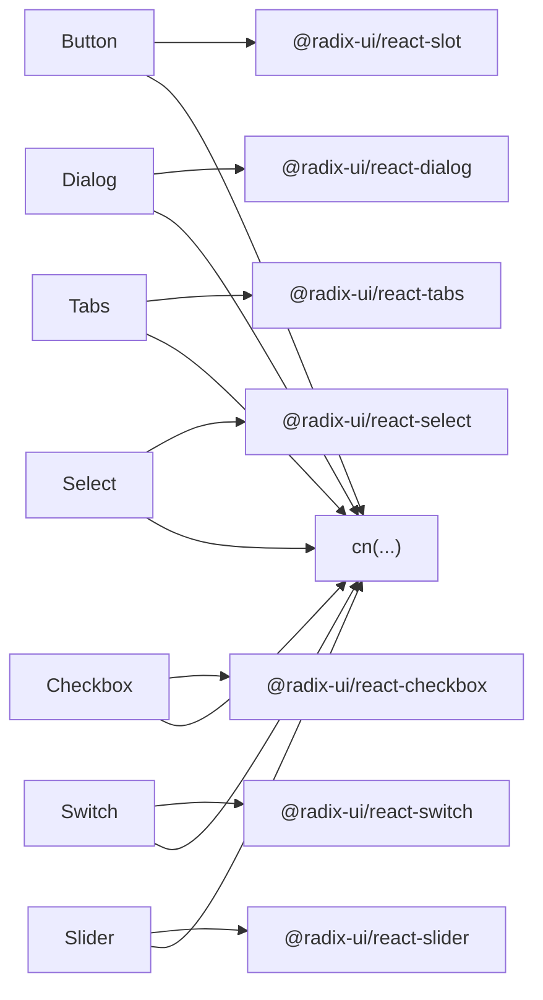

**Diagram sources**
- [button.tsx](file://apps/web/components/ui/button.tsx#L2-L4)
- [dialog.tsx](file://apps/web/components/ui/dialog.tsx#L4-L6)
- [tabs.tsx](file://apps/web/components/ui/tabs.tsx#L4-L5)
- [select.tsx](file://apps/web/components/ui/select.tsx#L4-L6)
- [checkbox.tsx](file://apps/web/components/ui/checkbox.tsx#L4-L6)
- [switch.tsx](file://apps/web/components/ui/switch.tsx#L4-L5)
- [slider.tsx](file://apps/web/components/ui/slider.tsx#L4-L5)

**Section sources**
- [index.ts](file://apps/web/components/ui/index.ts#L1-L90)

## Performance Considerations
- Prefer variant-based styling to minimize runtime style computations.
- Use asChild patterns where appropriate to avoid unnecessary DOM wrappers.
- Keep animations subtle and scoped to avoid layout thrashing.
- Defer heavy computations inside event handlers; leverage controlled components for frequent updates.
- Reuse shared utilities (e.g., class merging) to reduce duplication and improve maintainability.

## Accessibility and Keyboard Navigation
- Focus management: Components apply focus-visible rings and ensure focus trapping within modals where applicable.
- Keyboard interactions: Tabs and Select support arrow keys, Enter, Space, Home, End, and Escape for navigation and selection.
- Screen readers: Dialogs include aria-labelledby/aria-describedby; Select and Tabs use ARIA roles and states; close buttons include sr-only labels.
- Semantic markup: Buttons and labels preserve native semantics; asChild enables semantic wrapping when needed.

**Section sources**
- [dialog.tsx](file://apps/web/components/ui/dialog.tsx#L44-L50)
- [tabs.tsx](file://apps/web/components/ui/tabs.tsx#L24-L36)
- [select.tsx](file://apps/web/components/ui/select.tsx#L111-L131)

## Usage Examples and Patterns
Below are representative usage patterns for each component. Replace the code snippets with your own implementations and ensure consistent styling and behavior across the application.

- Button
  - Variants: default, destructive, outline, secondary, ghost, link.
  - Sizes: default, sm, lg, icon.
  - States: disabled, loading (via wrapper), focus-visible.
  - Example snippet path: [button.tsx](file://apps/web/components/ui/button.tsx#L32-L50)

- Input
  - States: focused, disabled, invalid (via className).
  - Example snippet path: [input.tsx](file://apps/web/components/ui/input.tsx#L4-L18)

- Card
  - Composition: Card with CardHeader, CardTitle, CardDescription, CardContent, CardFooter.
  - Example snippet path: [card.tsx](file://apps/web/components/ui/card.tsx#L4-L17)

- Dialog
  - Composition: Dialog with DialogTrigger, DialogPortal, DialogOverlay, DialogContent, DialogHeader, DialogTitle, DialogDescription, DialogFooter, DialogClose.
  - Example snippet path: [dialog.tsx](file://apps/web/components/ui/dialog.tsx#L8-L54)

- Tabs
  - Composition: Tabs with TabsList, TabsTrigger, TabsContent.
  - Example snippet path: [tabs.tsx](file://apps/web/components/ui/tabs.tsx#L9-L52)

- Select
  - Composition: Select with SelectTrigger, SelectContent, SelectViewport, SelectItem.
  - Example snippet path: [select.tsx](file://apps/web/components/ui/select.tsx#L12-L97)

- Checkbox
  - States: checked, unchecked, indeterminate (via Radix).
  - Example snippet path: [checkbox.tsx](file://apps/web/components/ui/checkbox.tsx#L8-L26)

- Switch
  - States: checked, unchecked.
  - Example snippet path: [switch.tsx](file://apps/web/components/ui/switch.tsx#L7-L25)

- Slider
  - States: dragging, focus-visible.
  - Example snippet path: [slider.tsx](file://apps/web/components/ui/slider.tsx#L7-L24)

- Badge
  - Variants: default, secondary, destructive, outline.
  - Example snippet path: [badge.tsx](file://apps/web/components/ui/badge.tsx#L25-L33)

- Textarea
  - States: focused, disabled.
  - Example snippet path: [textarea.tsx](file://apps/web/components/ui/textarea.tsx#L4-L18)

- Label
  - Variants: base styling via variant system.
  - Example snippet path: [label.tsx](file://apps/web/components/ui/label.tsx#L12-L22)

- Avatar
  - Composition: Avatar, AvatarImage, AvatarFallback.
  - Example snippet path: [avatar.tsx](file://apps/web/components/ui/avatar.tsx#L7-L47)

- Progress
  - States: determinate value.
  - Example snippet path: [progress.tsx](file://apps/web/components/ui/progress.tsx#L7-L24)

## Extending Components and Consistency Guidelines
- Extend variants thoughtfully: Add new variants via the variant engine and update defaults consistently.
- Preserve semantics: Use asChild for wrappers to maintain native element behavior.
- Centralize design tokens: Define spacing, colors, and typography in shared design tokens to keep variants uniform.
- Composition over inheritance: Favor composing subcomponents (e.g., DialogContent) rather than adding numerous props to a single component.
- Accessibility first: Ensure keyboard navigation and ARIA attributes remain intact when extending.
- Performance: Avoid heavy computations in render; memoize derived values and reuse shared utilities.

## Troubleshooting Guide
- Dialog does not close on outside click or escape key:
  - Verify the portal and overlay are rendered and that the trigger is correctly wired.
  - Confirm focus management and ensure no external focus traps interfere.
  - Reference: [dialog.tsx](file://apps/web/components/ui/dialog.tsx#L13-L54)

- Select items not selectable or keyboard navigation broken:
  - Ensure SelectItem is placed within SelectViewport and SelectContent.
  - Verify SelectValue is present to display the selected value.
  - Reference: [select.tsx](file://apps/web/components/ui/select.tsx#L67-L97)

- Checkbox or Switch not reflecting checked state:
  - Confirm controlled state is passed and onChange is handled.
  - Verify data-state attributes are applied by Radix.
  - Reference: [checkbox.tsx](file://apps/web/components/ui/checkbox.tsx#L8-L26), [switch.tsx](file://apps/web/components/ui/switch.tsx#L7-L25)

- Slider value not updating:
  - Ensure value and onValueChange are provided and within min/max bounds.
  - Reference: [slider.tsx](file://apps/web/components/ui/slider.tsx#L7-L24)

- Button styles not applying:
  - Verify className merging and variant combinations.
  - Reference: [button.tsx](file://apps/web/components/ui/button.tsx#L6-L30)

**Section sources**
- [dialog.tsx](file://apps/web/components/ui/dialog.tsx#L1-L120)
- [select.tsx](file://apps/web/components/ui/select.tsx#L1-L157)
- [checkbox.tsx](file://apps/web/components/ui/checkbox.tsx#L1-L30)
- [switch.tsx](file://apps/web/components/ui/switch.tsx#L1-L29)
- [slider.tsx](file://apps/web/components/ui/slider.tsx#L1-L28)
- [button.tsx](file://apps/web/components/ui/button.tsx#L1-L53)

## Conclusion
The shared UI component library emphasizes accessibility, composability, and consistency. By leveraging Radix UI primitives, a variant-driven styling system, and a centralized export structure, components can be extended and reused across the application with predictable behavior and appearance. Follow the provided patterns for composition, customization, and accessibility to maintain quality and performance.