# Story Mode Components

<cite>
**Referenced Files in This Document**
- [apps/web/app/(game)/story/page.tsx](file://apps/web/app/(game)/story/page.tsx)
- [apps/web/store/story-store.ts](file://apps/web/store/story-store.ts)
- [apps/web/lib/story-data.ts](file://apps/web/lib/story-data.ts)
- [apps/web/lib/character-config.ts](file://apps/web/lib/character-config.ts)
- [apps/web/components/story/story-hud.tsx](file://apps/web/components/story/story-hud.tsx)
- [apps/web/components/story/narrative-panel.tsx](file://apps/web/components/story/narrative-panel.tsx)
- [apps/web/components/story/world-map.tsx](file://apps/web/components/story/world-map.tsx)
- [apps/web/components/story/choice-cards.tsx](file://apps/web/components/story/choice-cards.tsx)
- [apps/web/components/story/cinematic-zone-enter.tsx](file://apps/web/components/story/cinematic-zone-enter.tsx)
- [apps/web/components/story/boss-gate-transition.tsx](file://apps/web/components/story/boss-gate-transition.tsx)
- [apps/web/components/story/narrator-box.tsx](file://apps/web/components/story/narrator-box.tsx)
- [apps/web/components/story/npc-dialogue.tsx](file://apps/web/components/story/npc-dialogue.tsx)
- [apps/web/components/story/pixel-portrait.tsx](file://apps/web/components/story/pixel-portrait.tsx)
- [apps/web/components/story/consequence-overlay.tsx](file://apps/web/components/story/consequence-overlay.tsx)
- [apps/web/components/story/rank-up-overlay.tsx](file://apps/web/components/story/rank-up-overlay.tsx)
- [apps/web/components/story/story-sfx-context.tsx](file://apps/web/components/story/story-sfx-context.tsx)
- [apps/web/contexts/narration-context.tsx](file://apps/web/contexts/narration-context.tsx)
</cite>

## Table of Contents
1. [Introduction](#introduction)
2. [Project Structure](#project-structure)
3. [Core Components](#core-components)
4. [Architecture Overview](#architecture-overview)
5. [Detailed Component Analysis](#detailed-component-analysis)
6. [Dependency Analysis](#dependency-analysis)
7. [Performance Considerations](#performance-considerations)
8. [Troubleshooting Guide](#troubleshooting-guide)
9. [Conclusion](#conclusion)

## Introduction
This document explains the story mode UI components that drive narrative progression and character interaction. It covers:
- Campaign tracking and HUD
- Narrative panels for dialogue and narration
- Location navigation via the world map
- Decision-making with timed choice cards
- Cinematic transitions and boss gate sequences
- State management for story progression, branching paths, and character development
- Integration with story data models, animation systems, and audio-visual effects
- Responsive design and accessibility
- Performance considerations for rich media assets

## Project Structure
The story mode is implemented as a React client application integrated with a centralized Zustand store, typed story data, and shared contexts for narration and sound effects. The main story page orchestrates transitions, overlays, and panels.

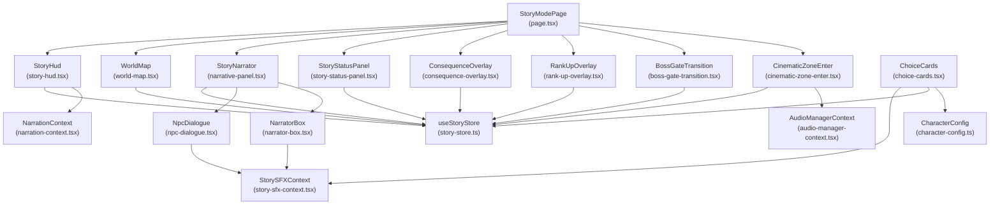

**Diagram sources**
- [apps/web/app/(game)/story/page.tsx](file://apps/web/app/(game)/story/page.tsx#L46-L186)
- [apps/web/components/story/story-hud.tsx](file://apps/web/components/story/story-hud.tsx#L30-L177)
- [apps/web/components/story/world-map.tsx](file://apps/web/components/story/world-map.tsx#L179-L224)
- [apps/web/components/story/narrative-panel.tsx](file://apps/web/components/story/narrative-panel.tsx#L17-L90)
- [apps/web/components/story/choice-cards.tsx](file://apps/web/components/story/choice-cards.tsx#L33-L332)
- [apps/web/components/story/cinematic-zone-enter.tsx](file://apps/web/components/story/cinematic-zone-enter.tsx#L54-L253)
- [apps/web/components/story/boss-gate-transition.tsx](file://apps/web/components/story/boss-gate-transition.tsx#L24-L183)
- [apps/web/components/story/consequence-overlay.tsx](file://apps/web/components/story/consequence-overlay.tsx#L17-L122)
- [apps/web/components/story/rank-up-overlay.tsx](file://apps/web/components/story/rank-up-overlay.tsx#L16-L58)
- [apps/web/components/story/npc-dialogue.tsx](file://apps/web/components/story/npc-dialogue.tsx#L34-L263)
- [apps/web/components/story/narrator-box.tsx](file://apps/web/components/story/narrator-box.tsx#L19-L183)
- [apps/web/components/story/story-sfx-context.tsx](file://apps/web/components/story/story-sfx-context.tsx#L95-L117)
- [apps/web/contexts/narration-context.tsx](file://apps/web/contexts/narration-context.tsx#L72-L194)
- [apps/web/store/story-store.ts](file://apps/web/store/story-store.ts#L175-L307)
- [apps/web/lib/character-config.ts](file://apps/web/lib/character-config.ts#L17-L39)

**Section sources**
- [apps/web/app/(game)/story/page.tsx](file://apps/web/app/(game)/story/page.tsx#L46-L186)

## Core Components
- StoryHud: Displays campaign context (zone, act), XP progress, rank, optional boss health, voice toggle, energy meter (zone 2), scars, and debts.
- NarrativePanel: Renders narrative blocks with streaming support and animated caret; includes helper to render styled text.
- WorldMap: Presents three story zones as interactive nodes with completion status, difficulty, tooltips, and progress.
- ChoiceCards: Timed decision UI with typewriter prompt reveal, dynamic timer visuals, optional tier hints, and obscured choices under certain conditions.
- CinematicZoneEnter: Full-screen cinematic intro per zone with lore text, skip affordance, and ambient audio intensity adjustment.
- BossGateTransition: Boss encounter intro with optional debuff activation and readiness cue.
- NarratorBox and NpcDialogue: Full-width narrator lines and character dialogue with typewriter effect, TTS integration, and SFX.
- ConsequenceOverlay and RankUpOverlay: Non-blocking overlays for XP/scars/debts and rank-ups with auto-dismiss and SFX.
- StorySFXContext and NarrationContext: Centralized audio effects and text-to-speech orchestration.
- StoryStore: Centralized state for session, stats, gamification, chat, choices, audio intensity, and actions.

**Section sources**
- [apps/web/components/story/story-hud.tsx](file://apps/web/components/story/story-hud.tsx#L30-L177)
- [apps/web/components/story/narrative-panel.tsx](file://apps/web/components/story/narrative-panel.tsx#L17-L90)
- [apps/web/components/story/world-map.tsx](file://apps/web/components/story/world-map.tsx#L179-L224)
- [apps/web/components/story/choice-cards.tsx](file://apps/web/components/story/choice-cards.tsx#L33-L332)
- [apps/web/components/story/cinematic-zone-enter.tsx](file://apps/web/components/story/cinematic-zone-enter.tsx#L54-L253)
- [apps/web/components/story/boss-gate-transition.tsx](file://apps/web/components/story/boss-gate-transition.tsx#L24-L183)
- [apps/web/components/story/narrator-box.tsx](file://apps/web/components/story/narrator-box.tsx#L19-L183)
- [apps/web/components/story/npc-dialogue.tsx](file://apps/web/components/story/npc-dialogue.tsx#L34-L263)
- [apps/web/components/story/consequence-overlay.tsx](file://apps/web/components/story/consequence-overlay.tsx#L17-L122)
- [apps/web/components/story/rank-up-overlay.tsx](file://apps/web/components/story/rank-up-overlay.tsx#L16-L58)
- [apps/web/components/story/story-sfx-context.tsx](file://apps/web/components/story/story-sfx-context.tsx#L95-L117)
- [apps/web/contexts/narration-context.tsx](file://apps/web/contexts/narration-context.tsx#L72-L194)
- [apps/web/store/story-store.ts](file://apps/web/store/story-store.ts#L175-L307)

## Architecture Overview
The story mode follows a unidirectional data flow:
- StoryStore holds all state and exposes actions to mutate it.
- Typed story data models define acts, scenes, choices, and moods.
- UI components subscribe to the store and render based on state.
- Narration and SFX contexts provide immersive audio feedback.
- Transitions and overlays are orchestrated from the main page.

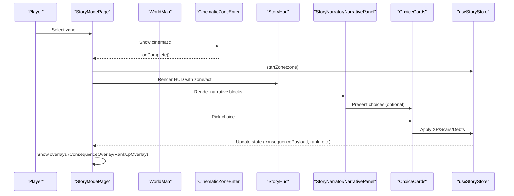

**Diagram sources**
- [apps/web/app/(game)/story/page.tsx](file://apps/web/app/(game)/story/page.tsx#L68-L81)
- [apps/web/components/story/cinematic-zone-enter.tsx](file://apps/web/components/story/cinematic-zone-enter.tsx#L54-L95)
- [apps/web/components/story/world-map.tsx](file://apps/web/components/story/world-map.tsx#L209-L220)
- [apps/web/components/story/choice-cards.tsx](file://apps/web/components/story/choice-cards.tsx#L272-L275)
- [apps/web/store/story-store.ts](file://apps/web/store/story-store.ts#L179-L200)

## Detailed Component Analysis

### StoryHud
- Purpose: Campaign HUD showing zone, act, XP progress, rank, optional boss health, voice toggle, energy meter (zone 2), scars, and debts.
- State dependencies: zone, act, xp, rank, scars, debts, energyMeter, actStreakWithoutScar, bossPhase, bossHealth.
- Animations: Framer Motion progress bars for XP and boss health; pulse indicators for streak and energy low.
- Accessibility: Clear labels, keyboard focus, and ARIA-friendly structure; voice toggle with live state.

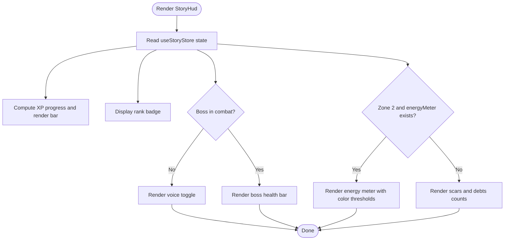

**Diagram sources**
- [apps/web/components/story/story-hud.tsx](file://apps/web/components/story/story-hud.tsx#L30-L177)
- [apps/web/store/story-store.ts](file://apps/web/store/story-store.ts#L42-L81)

**Section sources**
- [apps/web/components/story/story-hud.tsx](file://apps/web/components/story/story-hud.tsx#L30-L177)
- [apps/web/store/story-store.ts](file://apps/web/store/story-store.ts#L42-L81)

### NarrativePanel
- Purpose: Container for narrative blocks with auto-scrolling, streaming content, and animated caret.
- Features: Typewriter-like streaming, optional loader when streaming without content, and helper renderer for styled text.
- Accessibility: Scroll-to-bottom on updates; readable typography and contrast.

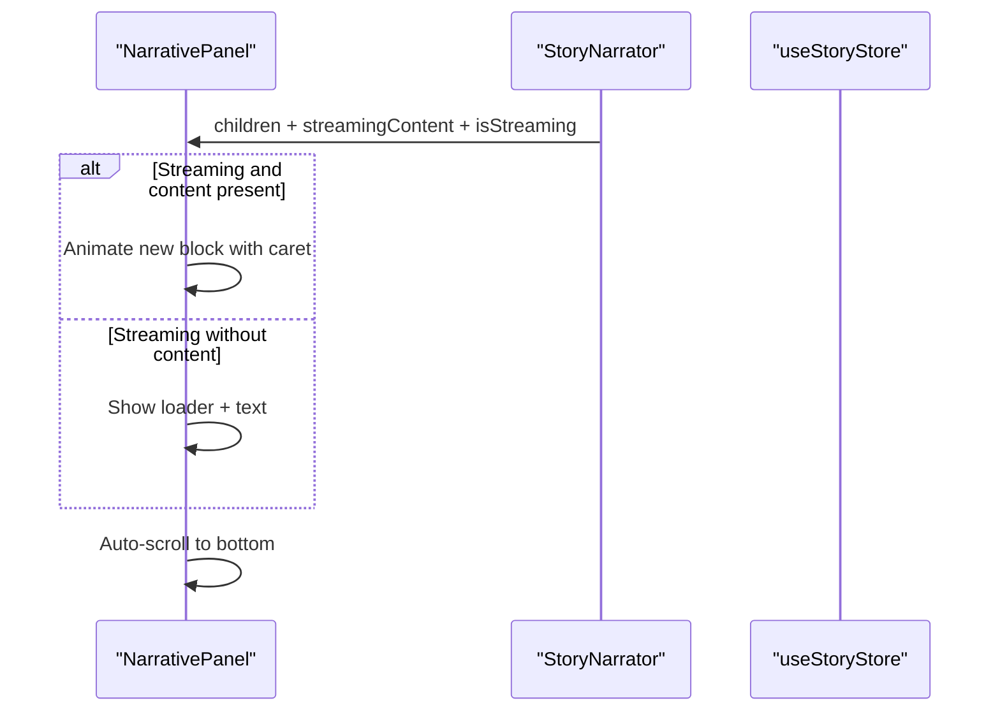

**Diagram sources**
- [apps/web/components/story/narrative-panel.tsx](file://apps/web/components/story/narrative-panel.tsx#L17-L57)

**Section sources**
- [apps/web/components/story/narrative-panel.tsx](file://apps/web/components/story/narrative-panel.tsx#L17-L90)

### WorldMap
- Purpose: Interactive map of story zones with completion status, difficulty, tooltips, and progress.
- Behavior: Hover tooltips, selection callbacks, completion progress bar, and animated entrance.
- Integration: Uses zone metadata and completion records from the store.

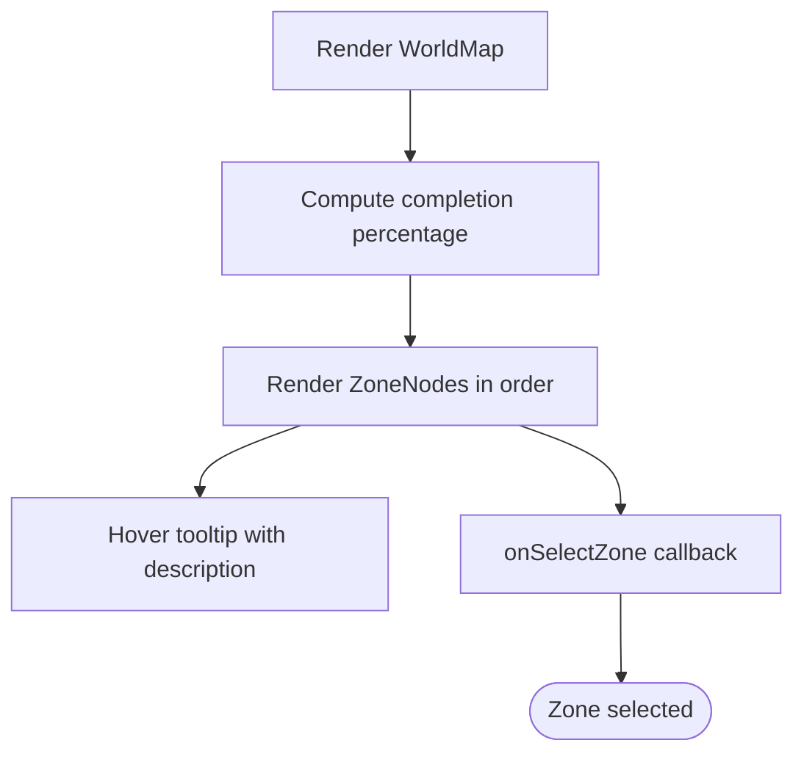

**Diagram sources**
- [apps/web/components/story/world-map.tsx](file://apps/web/components/story/world-map.tsx#L179-L224)

**Section sources**
- [apps/web/components/story/world-map.tsx](file://apps/web/components/story/world-map.tsx#L179-L224)

### ChoiceCards
- Purpose: Timed decision UI with typewriter prompt, timer bar, and choice buttons.
- Mechanics: Dynamic timer affected by scars; optional tier hints; obscured choices for higher tiers under certain conditions; SFX on selection and timer ticks.
- Integration: Reads character config per zone for styling and portrait.

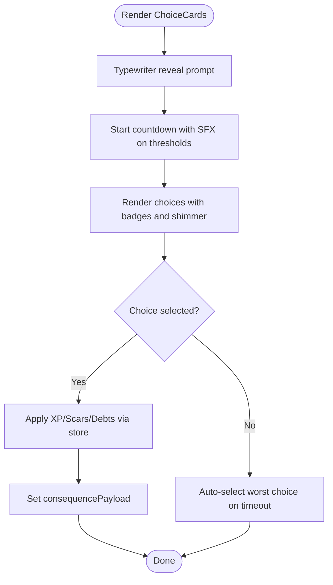

**Diagram sources**
- [apps/web/components/story/choice-cards.tsx](file://apps/web/components/story/choice-cards.tsx#L33-L115)
- [apps/web/lib/character-config.ts](file://apps/web/lib/character-config.ts#L17-L39)

**Section sources**
- [apps/web/components/story/choice-cards.tsx](file://apps/web/components/story/choice-cards.tsx#L33-L332)
- [apps/web/lib/character-config.ts](file://apps/web/lib/character-config.ts#L17-L39)

### CinematicZoneEnter
- Purpose: Full-screen cinematic intro per zone with lore paragraphs, skip affordance, and ambient audio intensity.
- Behavior: Controlled timeline with staggered lore reveals and automatic completion callback.

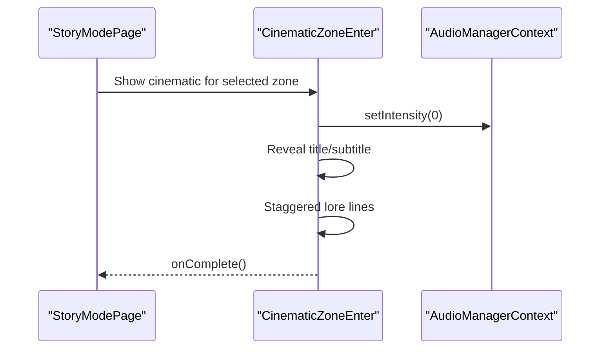

**Diagram sources**
- [apps/web/components/story/cinematic-zone-enter.tsx](file://apps/web/components/story/cinematic-zone-enter.tsx#L54-L95)
- [apps/web/app/(game)/story/page.tsx](file://apps/web/app/(game)/story/page.tsx#L72-L77)

**Section sources**
- [apps/web/components/story/cinematic-zone-enter.tsx](file://apps/web/components/story/cinematic-zone-enter.tsx#L54-L253)

### BossGateTransition
- Purpose: Boss encounter intro with optional debuff activation and readiness cue.
- Behavior: Phased presentation with SFX and auto-dismiss after readiness.

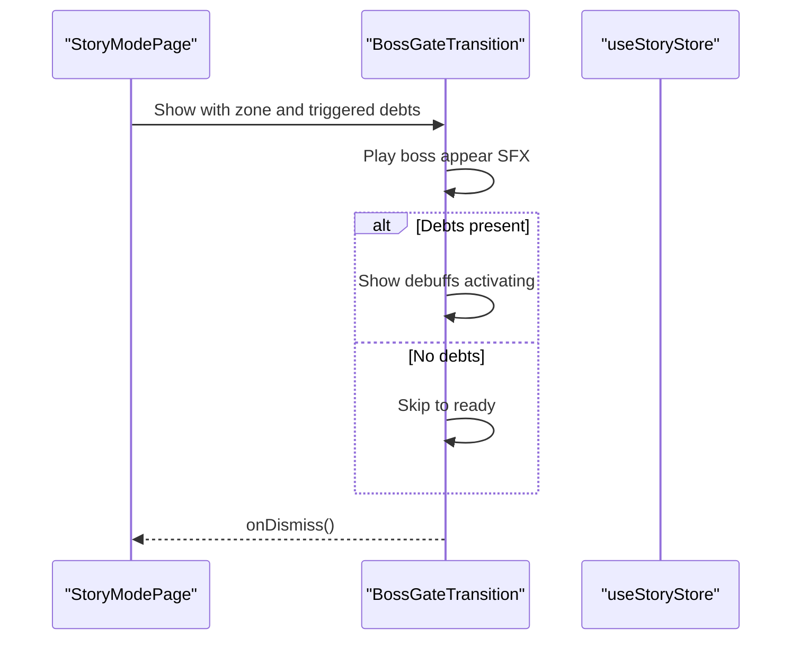

**Diagram sources**
- [apps/web/components/story/boss-gate-transition.tsx](file://apps/web/components/story/boss-gate-transition.tsx#L24-L63)

**Section sources**
- [apps/web/components/story/boss-gate-transition.tsx](file://apps/web/components/story/boss-gate-transition.tsx#L24-L183)

### NarratorBox and NpcDialogue
- Purpose: Full-width narrator lines and character dialogue with typewriter effect and TTS.
- Features: Click-to-skip, animated caret, corner accents, and SFX on text ticks.
- Integration: Uses NarrationContext for TTS and StorySFXContext for audio cues.

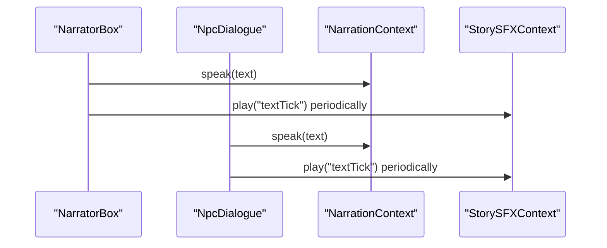

**Diagram sources**
- [apps/web/components/story/narrator-box.tsx](file://apps/web/components/story/narrator-box.tsx#L19-L61)
- [apps/web/components/story/npc-dialogue.tsx](file://apps/web/components/story/npc-dialogue.tsx#L34-L121)
- [apps/web/contexts/narration-context.tsx](file://apps/web/contexts/narration-context.tsx#L112-L178)
- [apps/web/components/story/story-sfx-context.tsx](file://apps/web/components/story/story-sfx-context.tsx#L95-L117)

**Section sources**
- [apps/web/components/story/narrator-box.tsx](file://apps/web/components/story/narrator-box.tsx#L19-L183)
- [apps/web/components/story/npc-dialogue.tsx](file://apps/web/components/story/npc-dialogue.tsx#L34-L263)
- [apps/web/contexts/narration-context.tsx](file://apps/web/contexts/narration-context.tsx#L72-L194)
- [apps/web/components/story/story-sfx-context.tsx](file://apps/web/components/story/story-sfx-context.tsx#L95-L117)

### ConsequenceOverlay and RankUpOverlay
- Purpose: Non-blocking overlays for XP/scars/debts and rank-ups with auto-dismiss and SFX.
- Behavior: Staggered animations per item; continue button dismissal.

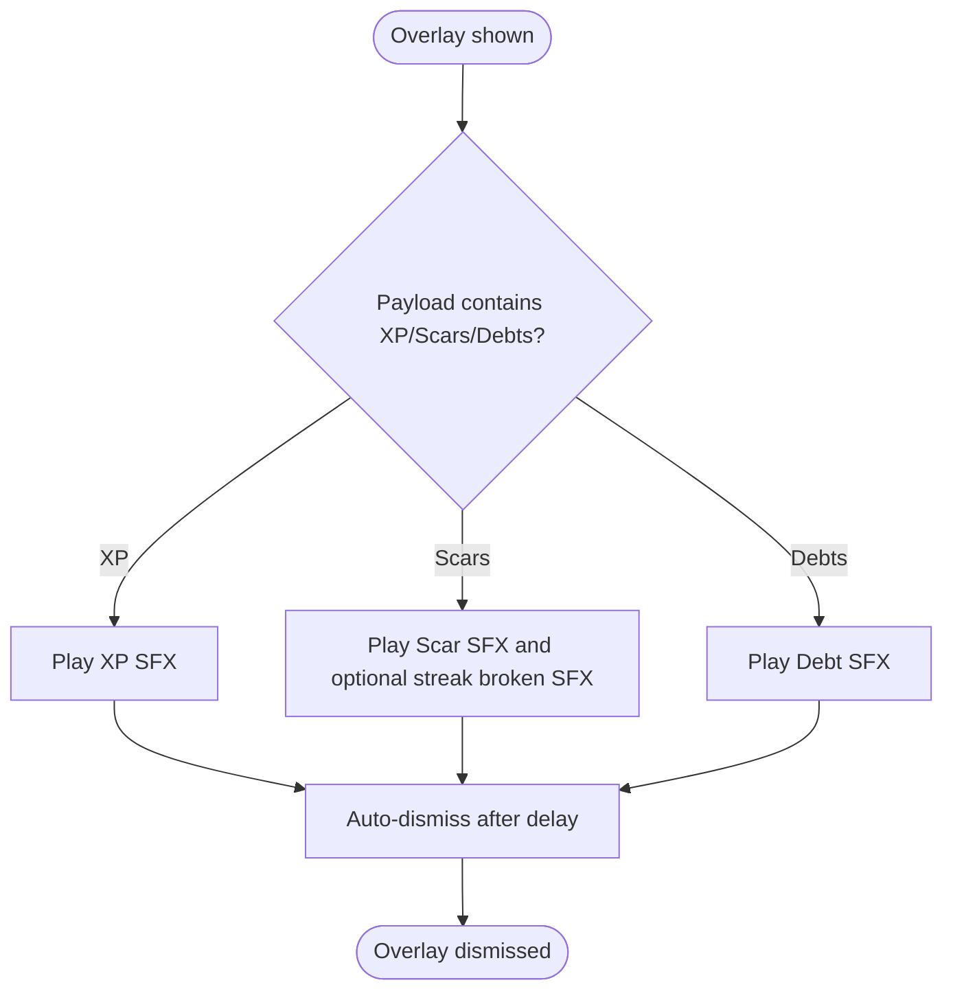

**Diagram sources**
- [apps/web/components/story/consequence-overlay.tsx](file://apps/web/components/story/consequence-overlay.tsx#L17-L33)
- [apps/web/components/story/rank-up-overlay.tsx](file://apps/web/components/story/rank-up-overlay.tsx#L16-L26)

**Section sources**
- [apps/web/components/story/consequence-overlay.tsx](file://apps/web/components/story/consequence-overlay.tsx#L17-L122)
- [apps/web/components/story/rank-up-overlay.tsx](file://apps/web/components/story/rank-up-overlay.tsx#L16-L58)

### PixelPortrait
- Purpose: 8×8 pixel-art representation for characters with CRT scanline overlay and active glow.
- Integration: Used by NpcDialogue and ChoiceCards to maintain visual consistency.

**Section sources**
- [apps/web/components/story/pixel-portrait.tsx](file://apps/web/components/story/pixel-portrait.tsx#L78-L151)

## Dependency Analysis
- StoryStore is the central dependency for all UI components rendering state and invoking actions.
- ChoiceCards depends on CharacterConfig for zone-specific styling and portrait.
- NarratorBox and NpcDialogue depend on NarrationContext for TTS and StorySFXContext for audio cues.
- CinematicZoneEnter integrates with AudioManagerContext to adjust ambient intensity.
- ConsequenceOverlay and RankUpOverlay integrate with StorySFXContext and StoryStore for state-driven SFX and timing.

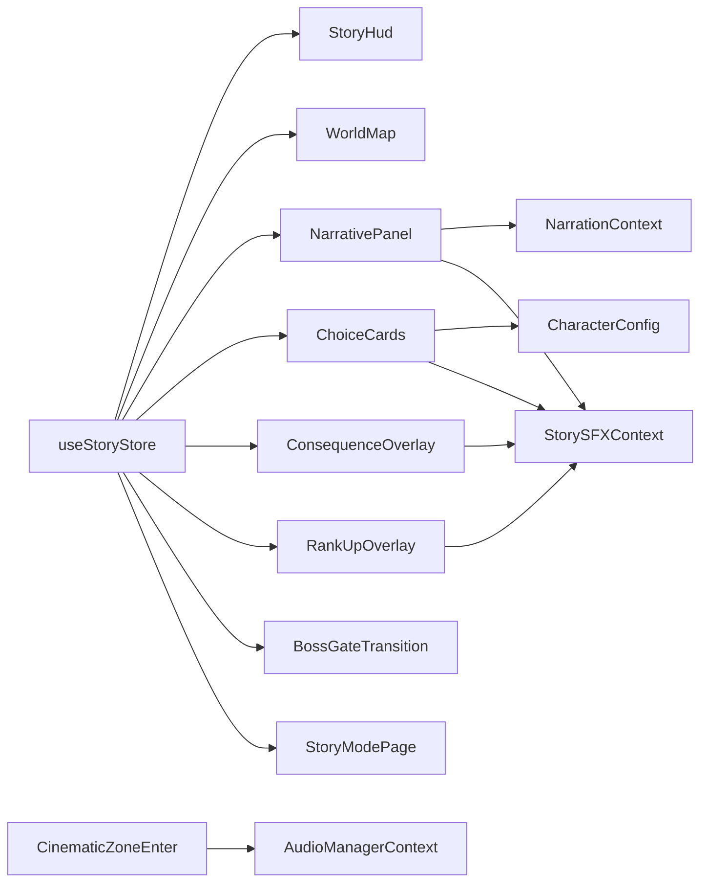

**Diagram sources**
- [apps/web/store/story-store.ts](file://apps/web/store/story-store.ts#L175-L307)
- [apps/web/components/story/choice-cards.tsx](file://apps/web/components/story/choice-cards.tsx#L59-L60)
- [apps/web/lib/character-config.ts](file://apps/web/lib/character-config.ts#L17-L39)
- [apps/web/components/story/narrator-box.tsx](file://apps/web/components/story/narrator-box.tsx#L24-L25)
- [apps/web/components/story/npc-dialogue.tsx](file://apps/web/components/story/npc-dialogue.tsx#L58-L59)
- [apps/web/components/story/consequence-overlay.tsx](file://apps/web/components/story/consequence-overlay.tsx#L18-L28)
- [apps/web/components/story/rank-up-overlay.tsx](file://apps/web/components/story/rank-up-overlay.tsx#L17-L21)
- [apps/web/components/story/cinematic-zone-enter.tsx](file://apps/web/components/story/cinematic-zone-enter.tsx#L56-L67)

**Section sources**
- [apps/web/store/story-store.ts](file://apps/web/store/story-store.ts#L175-L307)
- [apps/web/components/story/choice-cards.tsx](file://apps/web/components/story/choice-cards.tsx#L59-L60)
- [apps/web/lib/character-config.ts](file://apps/web/lib/character-config.ts#L17-L39)
- [apps/web/components/story/narrator-box.tsx](file://apps/web/components/story/narrator-box.tsx#L24-L25)
- [apps/web/components/story/npc-dialogue.tsx](file://apps/web/components/story/npc-dialogue.tsx#L58-L59)
- [apps/web/components/story/consequence-overlay.tsx](file://apps/web/components/story/consequence-overlay.tsx#L18-L28)
- [apps/web/components/story/rank-up-overlay.tsx](file://apps/web/components/story/rank-up-overlay.tsx#L17-L21)
- [apps/web/components/story/cinematic-zone-enter.tsx](file://apps/web/components/story/cinematic-zone-enter.tsx#L56-L67)

## Performance Considerations
- Animation and transitions: Prefer hardware-accelerated properties (opacity, transforms) and keep durations reasonable to avoid jank.
- Audio: Web Audio API is used for deterministic SFX; ensure context resumes on user gesture to avoid autoplay restrictions.
- Text rendering: Typewriter effects use periodic updates; throttle intervals and cancel timers on unmount.
- Media assets: Pixel portraits and icons are lightweight; lazy-load images if extended to larger sprites.
- Store updates: Use atomic updates and avoid unnecessary re-renders by selecting minimal slices of state.
- Streaming content: Debounce or batch updates to narrative panels to prevent excessive reflows.

[No sources needed since this section provides general guidance]

## Troubleshooting Guide
- Voice narration not playing:
  - Verify NarrationContext is enabled and stored preference; check browser speech synthesis availability.
- SFX not playing:
  - Ensure AudioContext is created and resumed on user interaction; confirm device supports Web Audio.
- Overlays not dismissing:
  - Confirm auto-dismiss timers are cleared on unmount and overlay dismissal callbacks are invoked.
- Choice timer anomalies:
  - Validate timer computation logic and ensure intervals are cleared on unmount and choice selection.
- Cinematic skip not working:
  - Ensure completion callback is invoked and pending zone state is cleared.

**Section sources**
- [apps/web/contexts/narration-context.tsx](file://apps/web/contexts/narration-context.tsx#L72-L194)
- [apps/web/components/story/story-sfx-context.tsx](file://apps/web/components/story/story-sfx-context.tsx#L95-L117)
- [apps/web/components/story/consequence-overlay.tsx](file://apps/web/components/story/consequence-overlay.tsx#L30-L33)
- [apps/web/components/story/choice-cards.tsx](file://apps/web/components/story/choice-cards.tsx#L93-L115)
- [apps/web/components/story/cinematic-zone-enter.tsx](file://apps/web/components/story/cinematic-zone-enter.tsx#L97-L101)

## Conclusion
The story mode UI components form a cohesive system for narrative progression and character interaction. They leverage a centralized store, typed data models, and immersive audio/visual feedback to deliver a polished, responsive, and accessible experience across devices. The modular design allows for easy extension of zones, choices, and narrative flows while maintaining consistent UX patterns.