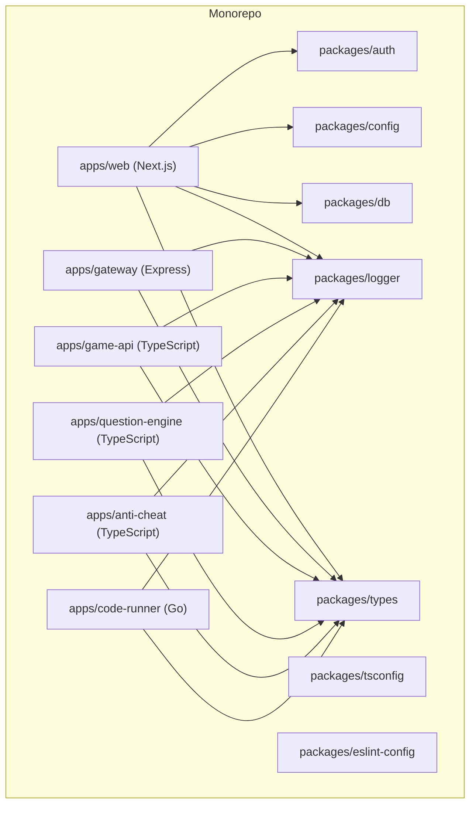
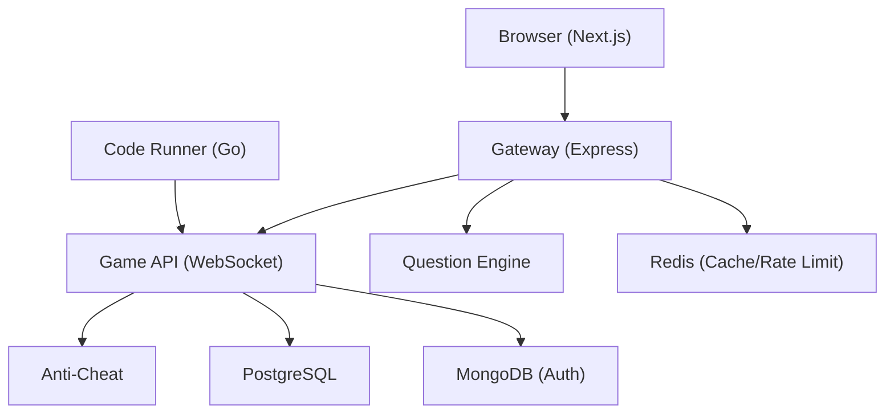
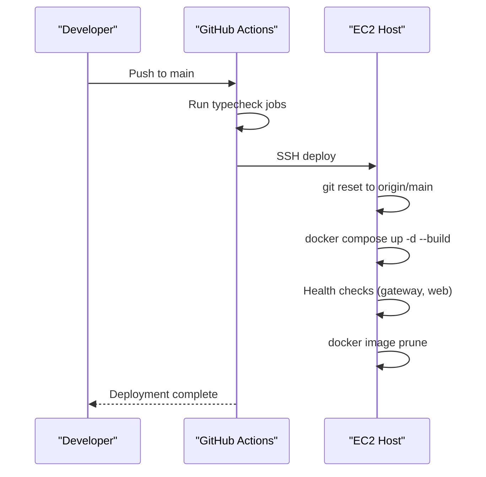
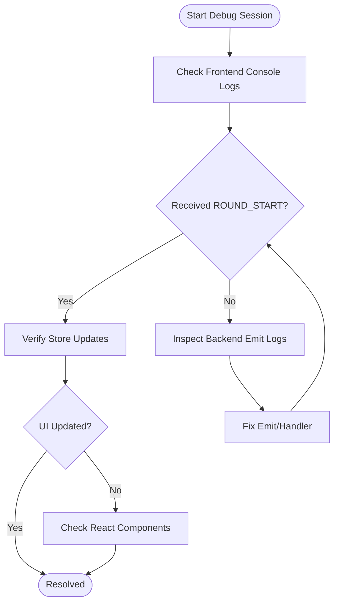

# Contributing Guidelines

<cite>
**Referenced Files in This Document**
- [README.md](file://README.md)
- [LICENSE](file://LICENSE)
- [package.json](file://package.json)
- [pnpm-workspace.yaml](file://pnpm-workspace.yaml)
- [.github/workflows/ci.yml](file://.github/workflows/ci.yml)
- [.github/workflows/deploy.yml](file://.github/workflows/deploy.yml)
- [turbo.json](file://turbo.json)
- [Makefile](file://Makefile)
- [apps/web/package.json](file://apps/web/package.json)
- [apps/gateway/package.json](file://apps/gateway/package.json)
- [apps/code-runner/go.mod](file://apps/code-runner/go.mod)
- [DEBUGGING_GUIDE.md](file://DEBUGGING_GUIDE.md)
</cite>

## Table of Contents
1. [Introduction](#introduction)
2. [Project Structure](#project-structure)
3. [Core Components](#core-components)
4. [Architecture Overview](#architecture-overview)
5. [Development Workflow](#development-workflow)
6. [Code Standards and Conventions](#code-standards-and-conventions)
7. [CI/CD Pipeline](#cicd-pipeline)
8. [Issue Reporting and Feature Requests](#issue-reporting-and-feature-requests)
9. [Development Environment Setup](#development-environment-setup)
10. [Local Testing and Verification](#local-testing-and-verification)
11. [Pull Request Process](#pull-request-process)
12. [Code Review Guidelines](#code-review-guidelines)
13. [Community Interaction](#community-interaction)
14. [Licensing and Intellectual Property](#licensing-and-intellectual-property)
15. [Troubleshooting Guide](#troubleshooting-guide)
16. [Conclusion](#conclusion)

## Introduction
This document provides comprehensive contributing guidelines for Logic Forge. It covers development workflow, branching and commit conventions, pull request processes, code standards for TypeScript/JavaScript and Go, CI/CD automation, issue and feature request procedures, environment setup, local testing, contribution verification, examples of good PRs, code review practices, community interaction, licensing, and IP considerations.

## Project Structure
Logic Forge is a monorepo managed by Turborepo and pnpm workspaces. The repository includes multiple applications and shared packages:
- Applications: web (Next.js), gateway (Express), game-api, question-engine, anti-cheat, code-runner (Go), and gateway.
- Shared packages: auth, config, db, logger, tsconfig, types, and eslint-config.

**Diagram sources**
- [pnpm-workspace.yaml](file://pnpm-workspace.yaml#L1-L3)
- [apps/web/package.json](file://apps/web/package.json#L1-L116)
- [apps/gateway/package.json](file://apps/gateway/package.json#L1-L33)
- [apps/code-runner/go.mod](file://apps/code-runner/go.mod#L1-L8)

**Section sources**
- [README.md](file://README.md#L5-L18)
- [pnpm-workspace.yaml](file://pnpm-workspace.yaml#L1-L3)

## Core Components
- Web (Next.js): Frontend dashboard and game client.
- Gateway: Centralized API entrypoint with proxying and rate limiting.
- Game API: Core game logic and WebSocket handling.
- Question Engine: Question retrieval and randomization.
- Anti-Cheat: Heuristic analysis and scoring.
- Code Runner: Language-specific execution and sandboxing.
- Shared Packages: Reusable configurations, types, logging, and linting.

**Section sources**
- [README.md](file://README.md#L8-L18)
- [apps/web/package.json](file://apps/web/package.json#L1-L116)
- [apps/gateway/package.json](file://apps/gateway/package.json#L1-L33)
- [apps/code-runner/go.mod](file://apps/code-runner/go.mod#L1-L8)

## Architecture Overview
The platform follows a microservice-like architecture within a single monorepo, orchestrated by Turborepo and pnpm. Services communicate via HTTP and WebSockets, with shared packages providing consistent configuration and types.

**Diagram sources**
- [README.md](file://README.md#L8-L18)
- [apps/gateway/package.json](file://apps/gateway/package.json#L1-L33)

## Development Workflow
- Branching model: Use feature branches off main for new work. Keep main pristine for production-ready changes.
- Commit conventions: Use imperative mood with concise messages. Reference related issues where applicable.
- Pull requests: Open PRs from feature branches targeting main. Include a summary, rationale, and testing notes.
- Reviews: Ensure at least one maintainer approves before merging. Resolve comments promptly and update the PR accordingly.
- Squash merges: Prefer squashed commits to keep history linear.

[No sources needed since this section provides general guidance]

## Code Standards and Conventions
- TypeScript/JavaScript:
  - Use shared tsconfig packages for consistent compiler options across apps.
  - Enforce linting via shared eslint-config package.
  - Follow Next.js and Node.js tsconfig presets where applicable.
  - Keep dependencies scoped to apps and packages; avoid duplicating shared logic.
- Go:
  - Use Go modules with explicit versions.
  - Follow idiomatic Go style and package structure.
  - Keep external dependencies pinned to versions.

**Section sources**
- [packages/tsconfig/nextjs.json](file://packages/tsconfig/nextjs.json#L1-L17)
- [packages/tsconfig/node.json](file://packages/tsconfig/node.json#L1-L11)
- [packages/eslint-config/package.json](file://packages/eslint-config/package.json#L1-L14)
- [apps/web/package.json](file://apps/web/package.json#L85-L115)
- [apps/gateway/package.json](file://apps/gateway/package.json#L23-L32)
- [apps/code-runner/go.mod](file://apps/code-runner/go.mod#L1-L8)

## CI/CD Pipeline
- CI:
  - Runs on pull requests to main.
  - Installs dependencies with pnpm.
  - Performs typechecking for gateway and game-api.
  - Executes linting across the monorepo.
  - Lint job continues even if it fails to surface all issues.
- Deployment:
  - Automated deployment on pushes to main.
  - Typecheck job runs prior to deployment.
  - Deploys via SSH to EC2 using docker-compose with production configuration.
  - Performs health checks against gateway and web ports.
  - Prunes images after deployment.

**Diagram sources**
- [.github/workflows/deploy.yml](file://.github/workflows/deploy.yml#L1-L66)

**Section sources**
- [.github/workflows/ci.yml](file://.github/workflows/ci.yml#L1-L33)
- [.github/workflows/deploy.yml](file://.github/workflows/deploy.yml#L1-L66)

## Issue Reporting and Feature Requests
- Before filing: Search existing issues to avoid duplicates.
- Bug reports: Include environment details, reproduction steps, expected vs actual behavior, and logs where applicable.
- Feature requests: Describe the problem solved, acceptance criteria, and proposed solution.
- Templates: Use the repository’s issue templates if present; otherwise, follow the structure outlined below.

[No sources needed since this section provides general guidance]

## Development Environment Setup
- Prerequisites:
  - Node.js >= 20
  - pnpm >= 8.15.0
  - Docker and Docker Compose
  - Go >= 1.22 (for Code Runner)
- Steps:
  - Install dependencies using the provided Makefile target.
  - Set up environment variables from the example files.
  - Bring up infrastructure with Docker Compose.
  - Start development servers using Turborepo scripts.

**Section sources**
- [README.md](file://README.md#L20-L26)
- [Makefile](file://Makefile#L14-L15)
- [Makefile](file://Makefile#L32-L40)

## Local Testing and Verification
- Scripts:
  - Use Makefile targets for install, dev, build, lint, test, and docker operations.
  - Turborepo tasks define caching, outputs, and inputs for efficient builds.
- Testing:
  - Run unit and integration tests via Turborepo test tasks.
  - Validate type safety with tsc across relevant apps.
- Verification checklist:
  - Ensure all services start without errors.
  - Confirm WebSocket connections and round progression in the game.
  - Validate API responses and database writes.

**Section sources**
- [Makefile](file://Makefile#L1-L55)
- [turbo.json](file://turbo.json#L1-L45)
- [apps/web/package.json](file://apps/web/package.json#L6-L10)
- [apps/gateway/package.json](file://apps/gateway/package.json#L6-L10)

## Pull Request Process
- Create a focused feature branch with a descriptive name.
- Update documentation and tests alongside code changes.
- Ensure CI passes locally before opening a PR.
- Include a clear PR description with motivation, changes, and testing performed.
- Respond to feedback promptly and update the PR accordingly.

[No sources needed since this section provides general guidance]

## Code Review Guidelines
- Scope: Review functionality, correctness, maintainability, and adherence to standards.
- Checklist:
  - Are typechecks passing?
  - Is linting clean?
  - Are tests included or updated?
  - Is the change minimal and focused?
  - Are environment variables and secrets handled securely?
- Communication: Be constructive, specific, and timely.

[No sources needed since this section provides general guidance]

## Community Interaction
- Be respectful and inclusive in discussions.
- Use clear titles and descriptions for issues and PRs.
- Provide reproducible examples and logs when reporting bugs.
- Offer help to others and acknowledge contributions.

[No sources needed since this section provides general guidance]

## Licensing and Intellectual Property
- License: MIT License applies to the project.
- Contributors retain copyright; by submitting code, you agree to license your contributions under the project’s license.
- No separate Contributor License Agreement is required beyond the standard MIT terms.

**Section sources**
- [LICENSE](file://LICENSE#L1-L22)

## Troubleshooting Guide
- Use the debugging guide to isolate issues across frontend, backend, and store layers.
- Verify WebSocket events and round progression logs.
- Check backend emit points and frontend handlers for mismatches.
- Validate challenge exclusions and uniqueness across rounds.

**Diagram sources**
- [DEBUGGING_GUIDE.md](file://DEBUGGING_GUIDE.md#L132-L190)

**Section sources**
- [DEBUGGING_GUIDE.md](file://DEBUGGING_GUIDE.md#L1-L294)

## Conclusion
By following these guidelines, contributors can collaborate effectively, maintain code quality, and accelerate delivery. Adhering to standards, leveraging CI/CD, and engaging constructively ensures a healthy and productive development ecosystem.