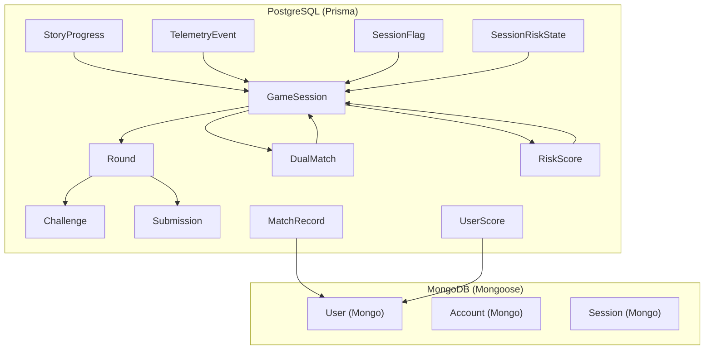
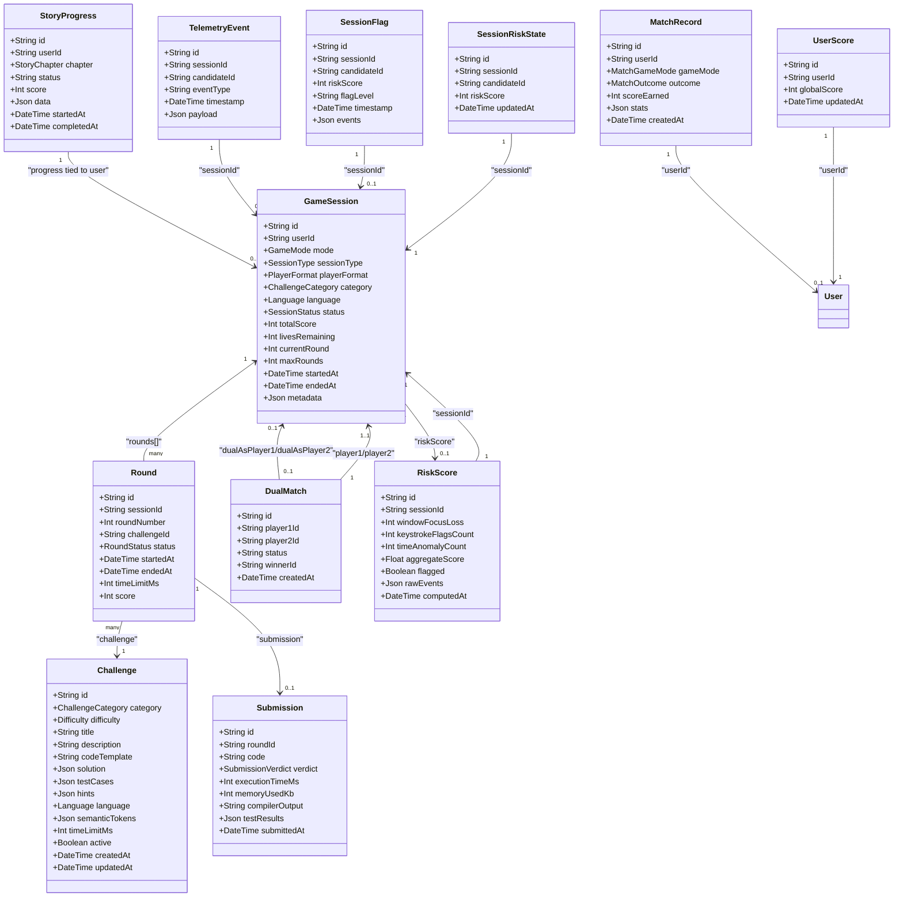
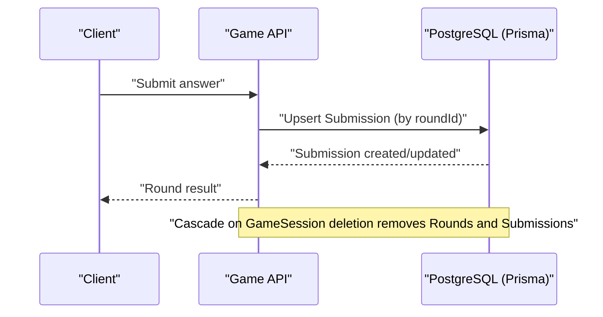
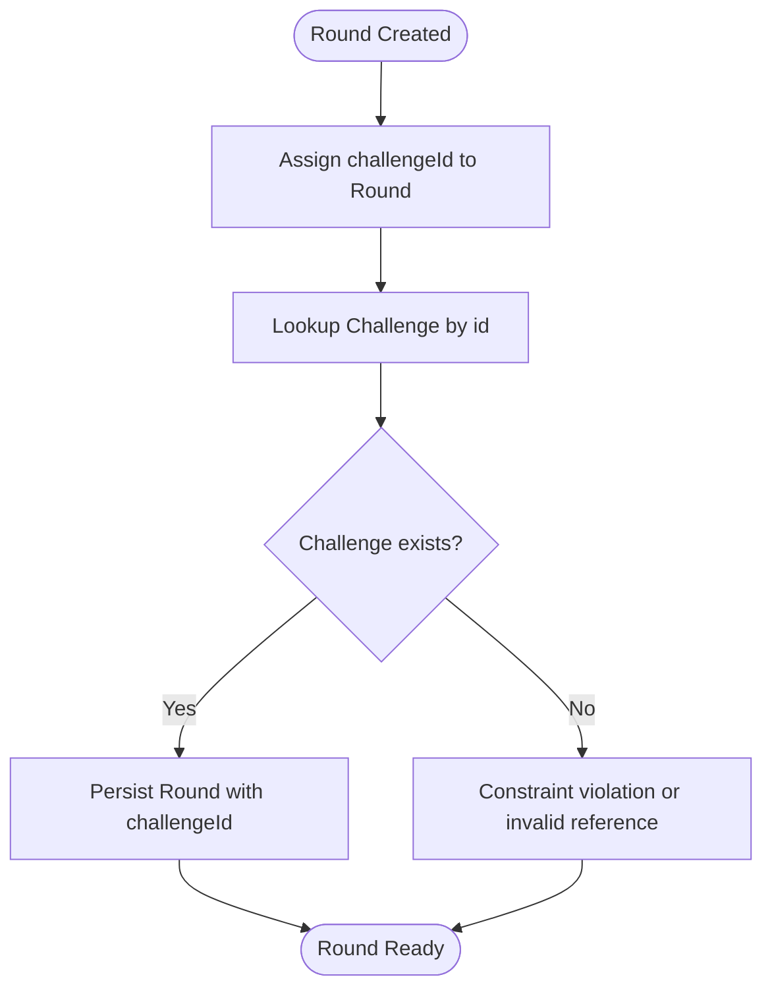
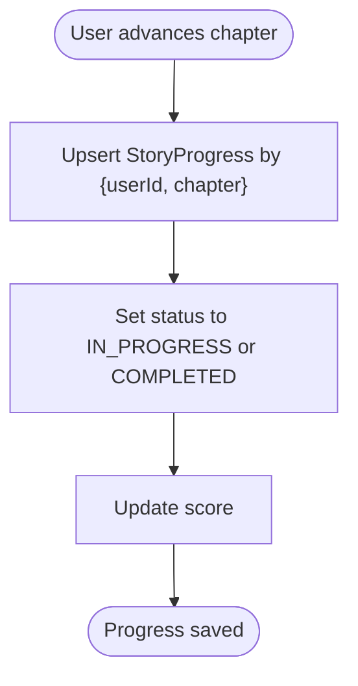
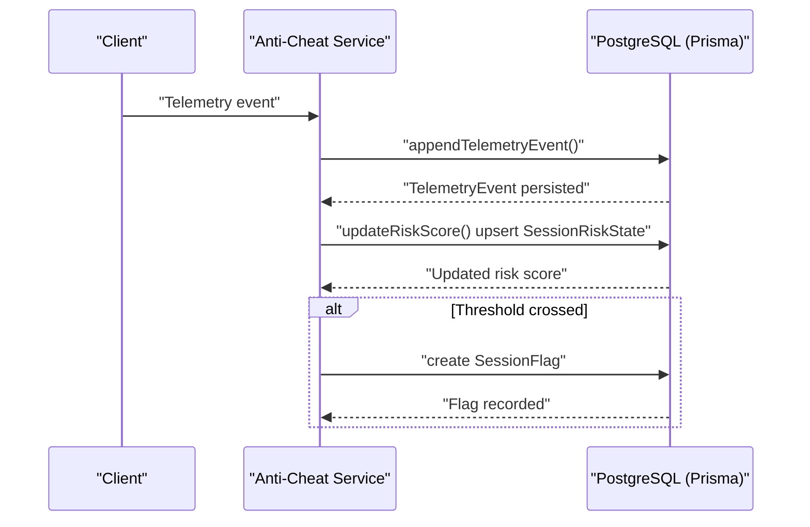
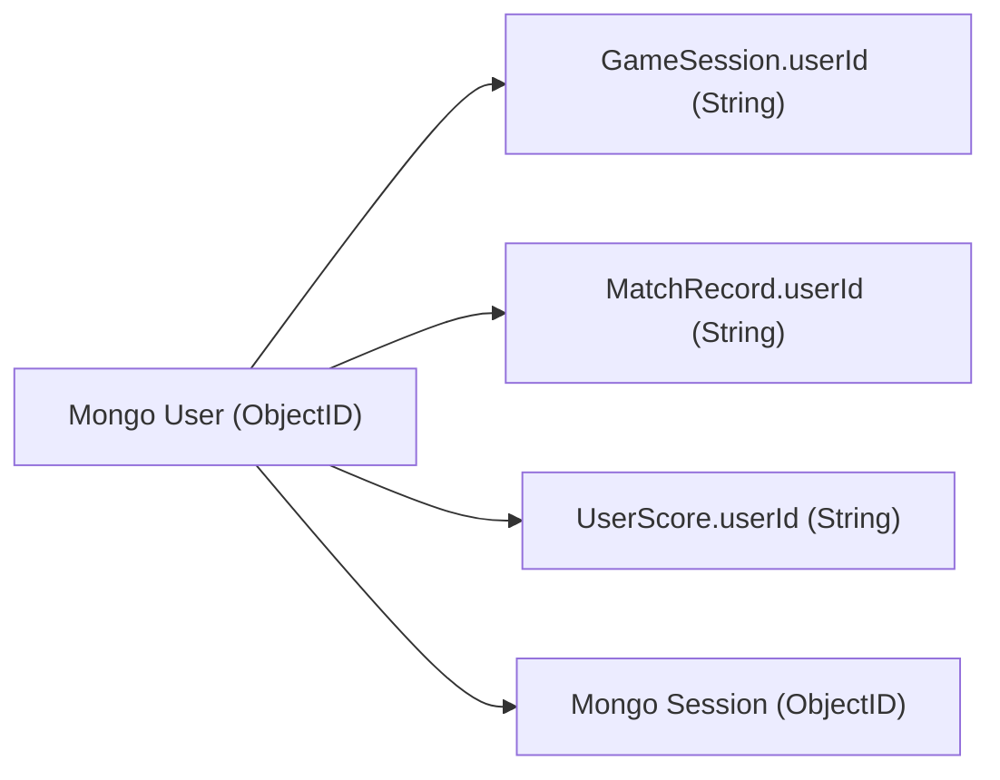
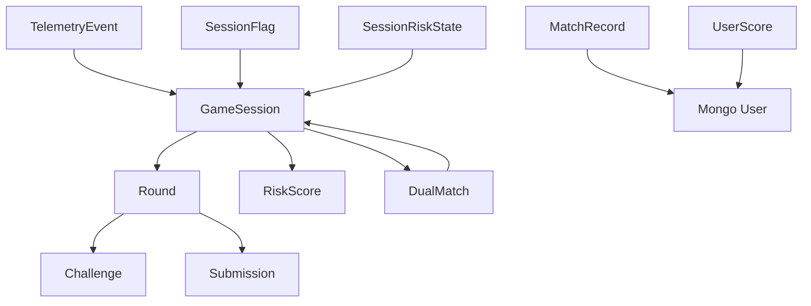

# Data Relationships & Constraints

<cite>
**Referenced Files in This Document**
- [schema.prisma](file://packages/db/prisma/schema.prisma)
- [index.ts](file://packages/db/src/index.ts)
- [seed.ts](file://packages/db/prisma/seed.ts)
- [risk-scoring.service.ts](file://apps/anti-cheat/src/services/risk-scoring.service.ts)
- [audit-log.service.ts](file://apps/anti-cheat/src/services/audit-log.service.ts)
- [round.service.ts](file://apps/game-api/src/services/round.service.ts)
- [DEBUGGING_GUIDE.md](file://DEBUGGING_GUIDE.md)
</cite>

## Table of Contents
1. [Introduction](#introduction)
2. [Project Structure](#project-structure)
3. [Core Components](#core-components)
4. [Architecture Overview](#architecture-overview)
5. [Detailed Component Analysis](#detailed-component-analysis)
6. [Dependency Analysis](#dependency-analysis)
7. [Performance Considerations](#performance-considerations)
8. [Troubleshooting Guide](#troubleshooting-guide)
9. [Conclusion](#conclusion)

## Introduction
This document explains the data relationships and constraints in Logic Forge’s database architecture. It focuses on the core models GameSession, Round, Challenge, and Submission, detailing foreign keys, unique constraints, bidirectional relations, cascade behaviors, and indexes. It also covers the dual match system with player1/player2 relationships, story progress tracking, and the anti-cheat telemetry and risk scoring pipeline. Finally, it describes how referential integrity is maintained across the hybrid stack of PostgreSQL (via Prisma) and MongoDB (for authentication).

## Project Structure
Logic Forge uses a multi-model architecture:
- PostgreSQL-backed relational models via Prisma define the game session lifecycle, rounds, challenges, submissions, story progress, dual matches, and anti-cheat telemetry.
- MongoDB stores authentication and session data for the web application through a Mongoose-based adapter.



**Diagram sources**
- [schema.prisma](file://packages/db/prisma/schema.prisma#L92-L285)
- [index.ts](file://packages/db/src/index.ts#L1-L17)

**Section sources**
- [schema.prisma](file://packages/db/prisma/schema.prisma#L1-L285)
- [index.ts](file://packages/db/src/index.ts#L1-L17)

## Core Components
This section documents the primary models and their constraints, focusing on foreign keys, unique constraints, indexes, and cascade behaviors.

- GameSession
  - Composite unique constraint: [userId, mode] implied by relations and usage patterns.
  - Bidirectional relations:
    - One-to-many to Round via rounds.
    - Optional one-to-one to RiskScore via riskScore.
    - Two optional one-to-one to DualMatch via dualAsPlayer1 and dualAsPlayer2.
  - Indexes: [userId], [status], [mode].
  - Notes: userId references MongoDB User._id (string) as per schema comments.

- Round
  - Unique constraint: [sessionId, roundNumber] ensures single round per session per round number.
  - Foreign keys:
    - sessionId → GameSession.id (onDelete: Cascade).
    - challengeId → Challenge.id.
  - Optional relation to Submission via submission.
  - Indexes: [challengeId].

- Challenge
  - Unique constraint: [title, language, category] prevents duplicates across variants.
  - Indexes: [category, difficulty], [language], [active].

- Submission
  - Unique constraint: [roundId] enforces one submission per round.
  - Foreign key: roundId → Round.id (onDelete: Cascade).

- StoryProgress
  - Unique constraint: [userId, chapter] ensures one progress record per chapter per user.
  - Indexes: [userId].

- DualMatch
  - Unique constraints: [player1Id], [player2Id] ensure uniqueness of players in a dual match.
  - Bidirectional relations:
    - player1 → GameSession (onDelete: Cascade).
    - player2 → GameSession (onDelete: SetNull).
  - Status field tracks lifecycle: WAITING, MATCHED, IN_PROGRESS, COMPLETED.

- RiskScore
  - Unique constraint: [sessionId] ensures one risk score per session.
  - Foreign key: sessionId → GameSession.id (onDelete: Cascade).

- TelemetryEvent
  - Append-only model; no updates/deletes.
  - Indexes: [sessionId], [candidateId], [timestamp].

- SessionFlag
  - Records flags raised when risk thresholds are crossed.
  - Indexes: [sessionId], [candidateId].

- SessionRiskState
  - Tracks current risk score per live session.
  - Unique constraint: [sessionId].

- MatchRecord
  - Stores match outcomes; userId references MongoDB User._id (string).
  - Indexes: [userId], [createdAt], [userId, createdAt].

- UserScore
  - Tracks global scores; userId references MongoDB User._id (string).
  - Unique constraint: [userId].
  - Index: [globalScore].

**Section sources**
- [schema.prisma](file://packages/db/prisma/schema.prisma#L92-L285)

## Architecture Overview
The database architecture combines:
- PostgreSQL for game lifecycle, scoring, story progression, anti-cheat telemetry, and match records.
- MongoDB for authentication and sessions via Mongoose adapter.



**Diagram sources**
- [schema.prisma](file://packages/db/prisma/schema.prisma#L92-L285)

## Detailed Component Analysis

### GameSession to Round and Submission
- Relationship: One GameSession contains many Rounds. Rounds belong to a single GameSession.
- Cascade behavior: Deleting a GameSession cascades to Rounds and Submissions.
- Unique constraint: Rounds are uniquely identified by [sessionId, roundNumber] within a session.
- Bidirectional relations: GameSession.rounds and Round.session.



**Diagram sources**
- [schema.prisma](file://packages/db/prisma/schema.prisma#L119-L175)
- [round.service.ts](file://apps/game-api/src/services/round.service.ts#L722-L753)

**Section sources**
- [schema.prisma](file://packages/db/prisma/schema.prisma#L119-L175)
- [round.service.ts](file://apps/game-api/src/services/round.service.ts#L722-L753)

### Challenge and Round Association
- Relationship: Rounds are associated with a Challenge via challengeId.
- Uniqueness: Rounds are uniquely numbered within a session.
- Indexing: challengeId indexed on Round for efficient joins.



**Diagram sources**
- [schema.prisma](file://packages/db/prisma/schema.prisma#L138-L161)
- [schema.prisma](file://packages/db/prisma/schema.prisma#L119-L136)

**Section sources**
- [schema.prisma](file://packages/db/prisma/schema.prisma#L138-L161)
- [schema.prisma](file://packages/db/prisma/schema.prisma#L119-L136)

### Dual Match System (player1 and player2)
- DualMatch links two GameSessions as player1 and player2.
- player1Id is unique; player2Id is optional and unique.
- Cascade and null behaviors:
  - player1 → GameSession (onDelete: Cascade).
  - player2 → GameSession (onDelete: SetNull).
- Status lifecycle: WAITING → MATCHED → IN_PROGRESS → COMPLETED.

```mermaid
classDiagram
class DualMatch {
+String id
+String player1Id
+String player2Id
+String status
+String winnerId
+DateTime createdAt
}
class GameSession {
+String id
+String userId
+GameMode mode
+PlayerFormat playerFormat
+SessionStatus status
}
DualMatch --> GameSession : "player1 (onDelete : Cascade)"
DualMatch --> GameSession : "player2 (onDelete : SetNull)"
```

**Diagram sources**
- [schema.prisma](file://packages/db/prisma/schema.prisma#L195-L205)

**Section sources**
- [schema.prisma](file://packages/db/prisma/schema.prisma#L195-L205)

### Story Progress Tracking
- StoryProgress tracks a user’s chapter progress with status and score.
- Unique constraint: [userId, chapter] ensures one record per chapter per user.
- Indexes: [userId] for fast lookup by user.



**Diagram sources**
- [schema.prisma](file://packages/db/prisma/schema.prisma#L179-L191)

**Section sources**
- [schema.prisma](file://packages/db/prisma/schema.prisma#L179-L191)

### Anti-Cheat Data Flow
Anti-cheat telemetry is append-only and tracked via:
- TelemetryEvent: append-only logs with indexes on sessionId, candidateId, and timestamp.
- SessionRiskState: current risk score per session, upserted as events arrive.
- SessionFlag: flags raised when thresholds are crossed (MEDIUM/HIGH), with indexes for quick filtering.



**Diagram sources**
- [audit-log.service.ts](file://apps/anti-cheat/src/services/audit-log.service.ts#L1-L19)
- [risk-scoring.service.ts](file://apps/anti-cheat/src/services/risk-scoring.service.ts#L1-L76)
- [schema.prisma](file://packages/db/prisma/schema.prisma#L224-L260)

**Section sources**
- [audit-log.service.ts](file://apps/anti-cheat/src/services/audit-log.service.ts#L1-L19)
- [risk-scoring.service.ts](file://apps/anti-cheat/src/services/risk-scoring.service.ts#L1-L76)
- [schema.prisma](file://packages/db/prisma/schema.prisma#L224-L260)

### Referential Integrity Across PostgreSQL and MongoDB
- GameSession.userId references MongoDB User._id (stored as string in schema comments).
- MatchRecord.userId and UserScore.userId reference MongoDB User._id (string).
- Authentication and sessions are managed in MongoDB via Mongoose adapter; Prisma models maintain logical references to these identifiers.



**Diagram sources**
- [schema.prisma](file://packages/db/prisma/schema.prisma#L92-L117)
- [schema.prisma](file://packages/db/prisma/schema.prisma#L263-L284)
- [index.ts](file://packages/db/src/index.ts#L1-L17)

**Section sources**
- [schema.prisma](file://packages/db/prisma/schema.prisma#L92-L117)
- [schema.prisma](file://packages/db/prisma/schema.prisma#L263-L284)
- [index.ts](file://packages/db/src/index.ts#L1-L17)

## Dependency Analysis
Key dependencies and constraints:
- GameSession → Round (one-to-many, cascade delete).
- Round → Challenge (many-to-one).
- Round → Submission (one-to-one via unique roundId).
- GameSession → RiskScore (one-to-one).
- GameSession ↔ DualMatch (bidirectional via player1/player2).
- TelemetryEvent → GameSession (append-only).
- SessionFlag → GameSession (threshold-triggered).
- SessionRiskState → GameSession (current risk per session).
- MatchRecord/UserScore → Mongo User (userId as string).



**Diagram sources**
- [schema.prisma](file://packages/db/prisma/schema.prisma#L92-L285)

**Section sources**
- [schema.prisma](file://packages/db/prisma/schema.prisma#L92-L285)

## Performance Considerations
- Indexes:
  - GameSession: [userId], [status], [mode] support filtering by user, state, and mode.
  - Round: [challengeId] supports joining with Challenge efficiently.
  - Challenge: [category, difficulty], [language], [active] optimize challenge discovery.
  - TelemetryEvent: [sessionId], [candidateId], [timestamp] enable time-series queries.
  - SessionFlag: [sessionId], [candidateId] support alerting and reporting.
  - MatchRecord: [userId], [createdAt], [userId, createdAt] support leaderboards and history.
  - UserScore: [globalScore] supports ranking queries.
- Unique constraints prevent redundant writes and ensure consistency with minimal overhead.
- Cascade deletes simplify cleanup but require careful handling during session termination to avoid unintended deletions.

[No sources needed since this section provides general guidance]

## Troubleshooting Guide
Common issues and diagnostics:
- Duplicate submissions: Rounds enforce a unique submission via [roundId]. If a submission fails to persist, check the Round’s unique constraint and submission creation logic.
- Round sequencing: [sessionId, roundNumber] must remain unique per session. If advancing rounds fails, verify the currentRound and roundNumber assignment logic.
- Anti-cheat thresholds: When flags are not raised, confirm SessionRiskState upserts and threshold comparisons in the risk scoring service.
- Telemetry append-only: If events appear missing, verify append-only insert logic and indexes for fast retrieval.
- Debugging logs: The game API service emits detailed logs around submission handling and round advancement to aid troubleshooting.

**Section sources**
- [schema.prisma](file://packages/db/prisma/schema.prisma#L134-L175)
- [risk-scoring.service.ts](file://apps/anti-cheat/src/services/risk-scoring.service.ts#L1-L76)
- [audit-log.service.ts](file://apps/anti-cheat/src/services/audit-log.service.ts#L1-L19)
- [round.service.ts](file://apps/game-api/src/services/round.service.ts#L722-L753)
- [DEBUGGING_GUIDE.md](file://DEBUGGING_GUIDE.md#L47-L92)

## Conclusion
Logic Forge’s database architecture enforces strong referential integrity across PostgreSQL and MongoDB. The relational models for GameSession, Round, Challenge, and Submission provide a robust foundation for the game lifecycle, while unique constraints and indexes optimize performance. The dual match system and story progress tracking are cleanly modeled with bidirectional relations and appropriate cascade behaviors. The anti-cheat telemetry pipeline maintains append-only logs and current risk states, enabling scalable monitoring and alerting. Together, these components ensure data consistency and reliability in a multi-model environment.