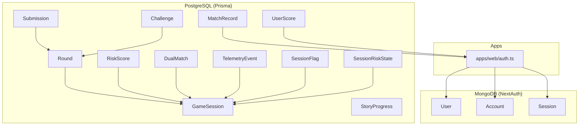
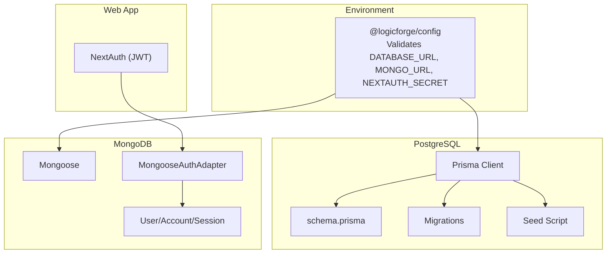
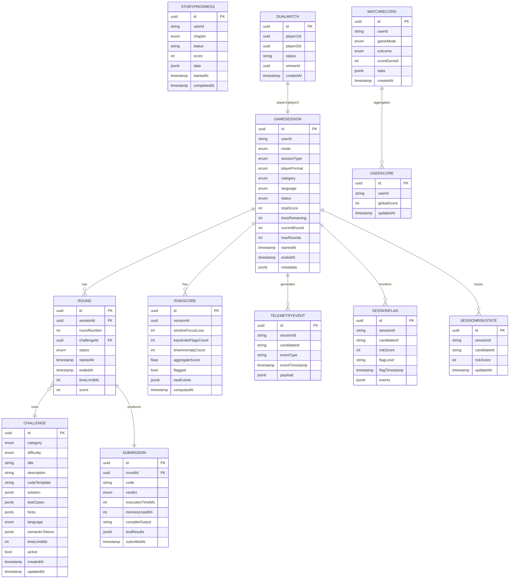
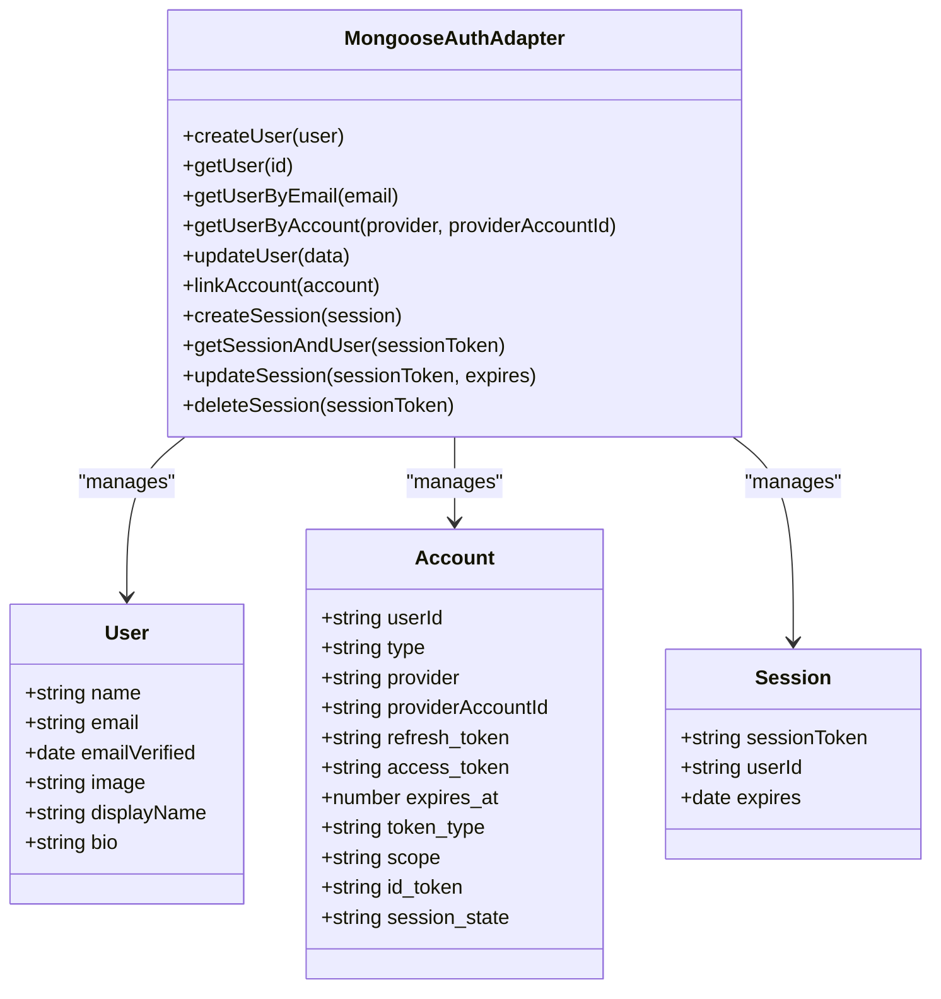
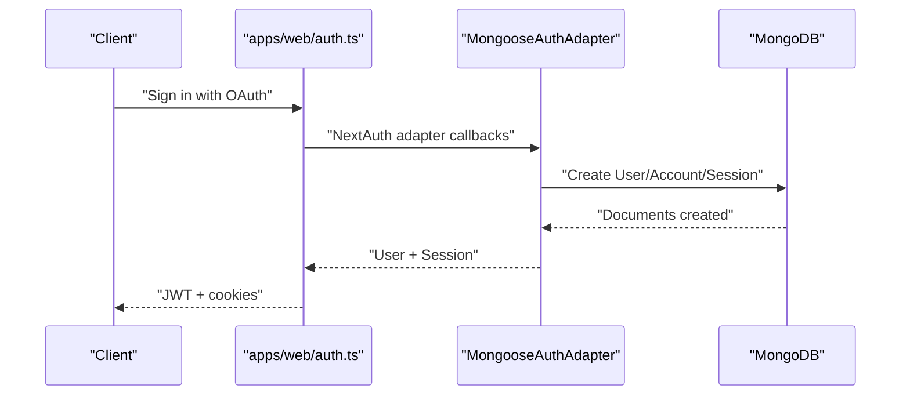
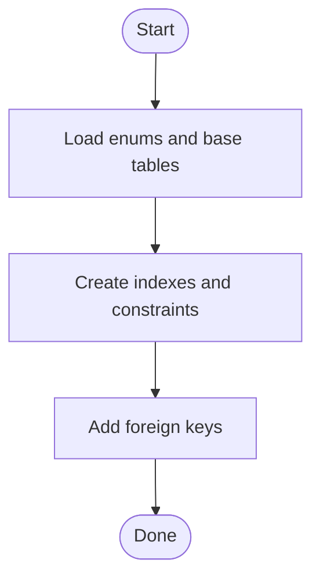
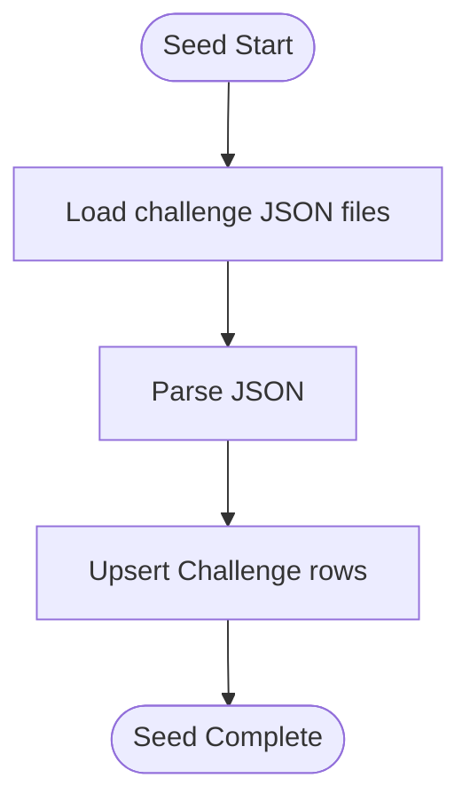
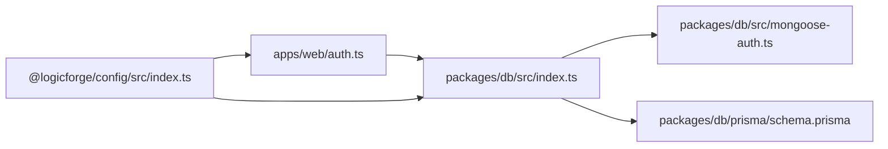

# Database Design & Models

<cite>
**Referenced Files in This Document**
- [packages/db/prisma/schema.prisma](file://packages/db/prisma/schema.prisma)
- [packages/db/src/index.ts](file://packages/db/src/index.ts)
- [packages/db/src/mongoose-auth.ts](file://packages/db/src/mongoose-auth.ts)
- [packages/db/prisma/seed.ts](file://packages/db/prisma/seed.ts)
- [packages/db/prisma/migrations/20260301181212_add_challenge_title_language_category_unique/migration.sql](file://packages/db/prisma/migrations/20260301181212_add_challenge_title_language_category_unique/migration.sql)
- [packages/db/prisma/migrations/20260308000000_add_match_records_and_anti_cheat/migration.sql](file://packages/db/prisma/migrations/20260308000000_add_match_records_and_anti_cheat/migration.sql)
- [packages/db/prisma/seeds/challenges/missing-link.json](file://packages/db/prisma/seeds/challenges/missing-link.json)
- [apps/web/auth.ts](file://apps/web/auth.ts)
- [apps/web/auth.config.ts](file://apps/web/auth.config.ts)
- [packages/config/src/index.ts](file://packages/config/src/index.ts)
- [docs/MONGO_AUTH_FIX.md](file://docs/MONGO_AUTH_FIX.md)
</cite>

## Table of Contents
1. [Introduction](#introduction)
2. [Project Structure](#project-structure)
3. [Core Components](#core-components)
4. [Architecture Overview](#architecture-overview)
5. [Detailed Component Analysis](#detailed-component-analysis)
6. [Dependency Analysis](#dependency-analysis)
7. [Performance Considerations](#performance-considerations)
8. [Troubleshooting Guide](#troubleshooting-guide)
9. [Conclusion](#conclusion)
10. [Appendices](#appendices)

## Introduction
This document describes Logic Forge’s database architecture and data models. The system uses:
- PostgreSQL via Prisma ORM for core game data (sessions, rounds, challenges, submissions, story progress, dual matches, anti-cheat telemetry, match records, and user scores).
- MongoDB via Mongoose and NextAuth adapters for authentication and user sessions.

It covers entity relationships, field definitions, data types, indexes, constraints, validation rules, referential integrity, migration and seeding strategies, data access patterns, caching strategies, performance optimization, and data lifecycle management.

## Project Structure
The database layer is organized into:
- Prisma schema defining PostgreSQL models, enums, relations, indexes, and constraints.
- Migration scripts capturing schema evolution.
- Seeding logic and challenge datasets.
- Mongoose-based NextAuth adapter for MongoDB-backed authentication.
- Shared configuration module validating environment variables for database and auth.

**Diagram sources**
- [packages/db/prisma/schema.prisma](file://packages/db/prisma/schema.prisma#L92-L285)
- [packages/db/src/mongoose-auth.ts](file://packages/db/src/mongoose-auth.ts#L39-L109)
- [apps/web/auth.ts](file://apps/web/auth.ts#L59-L63)

**Section sources**
- [packages/db/prisma/schema.prisma](file://packages/db/prisma/schema.prisma#L1-L285)
- [packages/db/src/mongoose-auth.ts](file://packages/db/src/mongoose-auth.ts#L1-L286)
- [apps/web/auth.ts](file://apps/web/auth.ts#L1-L171)

## Core Components
- PostgreSQL (Prisma):
  - GameSession, Round, Challenge, Submission, StoryProgress, DualMatch, RiskScore, TelemetryEvent, SessionFlag, SessionRiskState, MatchRecord, UserScore.
- MongoDB (Mongoose/NextAuth):
  - User, Account, Session, with a reusable adapter mapping NextAuth operations to Mongoose models.

Key design characteristics:
- UUID primary keys across most entities for distributed-safe identifiers.
- Strong enums for statuses and categories.
- Foreign keys with cascading deletes for child entities.
- Unique constraints for composite keys (e.g., Challenge title/language/category).
- Sparse and unique indexes for performance and uniqueness guarantees.
- JSON/JSONB for flexible data fields (e.g., solutions, test cases, telemetry).

**Section sources**
- [packages/db/prisma/schema.prisma](file://packages/db/prisma/schema.prisma#L92-L285)
- [packages/db/src/mongoose-auth.ts](file://packages/db/src/mongoose-auth.ts#L39-L109)

## Architecture Overview
The database architecture separates concerns:
- PostgreSQL stores structured game state and analytics.
- MongoDB stores authentication state and user profiles.
- Shared configuration validates environment variables for both databases.
- The web app integrates MongoDB-backed NextAuth and exposes Prisma client globally.

**Diagram sources**
- [packages/config/src/index.ts](file://packages/config/src/index.ts#L10-L43)
- [packages/db/src/index.ts](file://packages/db/src/index.ts#L1-L17)
- [packages/db/src/mongoose-auth.ts](file://packages/db/src/mongoose-auth.ts#L1-L35)
- [apps/web/auth.ts](file://apps/web/auth.ts#L59-L63)

## Detailed Component Analysis

### PostgreSQL Data Model

#### Entity Relationships and Constraints
- GameSession
  - Has many Rounds.
  - Optional RiskScore.
  - DualMatch relations as player1/player2.
  - Indexed: userId, status, mode.
- Round
  - Belongs to GameSession (Cascade delete).
  - Belongs to Challenge (Restrict delete).
  - Unique composite: (sessionId, roundNumber).
  - Indexed: challengeId.
- Challenge
  - Unique composite: (title, language, category).
  - Indexed: category/difficulty, language, active.
- Submission
  - One-to-one with Round via roundId (Cascade delete).
- StoryProgress
  - Unique composite: (userId, chapter).
  - Indexed: userId.
- DualMatch
  - player1Id unique; optional player2Id unique.
  - Cascades for player1; SetNull for player2.
- RiskScore
  - One-to-one with GameSession (Cascade delete).
- TelemetryEvent
  - Indexed: sessionId, candidateId, timestamp.
- SessionFlag
  - Indexed: sessionId, candidateId.
- SessionRiskState
  - Unique sessionId; indexed candidateId.
- MatchRecord
  - Indexed: userId, createdAt, (userId, createdAt).
- UserScore
  - Unique userId; indexed globalScore.

**Diagram sources**
- [packages/db/prisma/schema.prisma](file://packages/db/prisma/schema.prisma#L92-L285)

**Section sources**
- [packages/db/prisma/schema.prisma](file://packages/db/prisma/schema.prisma#L92-L285)

#### Data Types and Validation Rules
- Enumerations define strict domains for statuses, outcomes, categories, and languages.
- JSON/JSONB fields store flexible data (e.g., solutions, test cases, telemetry).
- Defaults enforce sensible initial states (e.g., GameSession.status defaults to LOBBY).
- Unique constraints prevent duplicates (e.g., Challenge title/language/category).
- Foreign keys maintain referential integrity with cascade and restrict behaviors.

**Section sources**
- [packages/db/prisma/schema.prisma](file://packages/db/prisma/schema.prisma#L13-L89)
- [packages/db/prisma/schema.prisma](file://packages/db/prisma/schema.prisma#L138-L161)
- [packages/db/prisma/schema.prisma](file://packages/db/prisma/schema.prisma#L195-L205)

#### Indexes and Constraints
- Composite unique indexes on (sessionId, roundNumber) and (userId, chapter).
- Sparse and unique indexes on provider/providerAccountId for accounts.
- Multi-column indexes on frequently queried attributes (e.g., GameSession status, Challenge category/difficulty).
- Unique constraints on Submission.roundId, RiskScore.sessionId, DualMatch.player1Id/player2Id, UserScore.userId.

**Section sources**
- [packages/db/prisma/schema.prisma](file://packages/db/prisma/schema.prisma#L114-L117)
- [packages/db/prisma/schema.prisma](file://packages/db/prisma/schema.prisma#L134-L136)
- [packages/db/prisma/schema.prisma](file://packages/db/prisma/schema.prisma#L157-L160)
- [packages/db/prisma/schema.prisma](file://packages/db/prisma/schema.prisma#L171-L172)
- [packages/db/prisma/schema.prisma](file://packages/db/prisma/schema.prisma#L187-L187)
- [packages/db/prisma/schema.prisma](file://packages/db/prisma/schema.prisma#L189-L189)
- [packages/db/prisma/schema.prisma](file://packages/db/prisma/schema.prisma#L204-L204)
- [packages/db/prisma/schema.prisma](file://packages/db/prisma/schema.prisma#L232-L235)
- [packages/db/prisma/schema.prisma](file://packages/db/prisma/schema.prisma#L247-L249)
- [packages/db/prisma/schema.prisma](file://packages/db/prisma/schema.prisma#L259-L259)

### MongoDB Authentication Models

#### NextAuth Adapter and Models
- User: Name, email (sparse), emailVerified, image, plus displayName and bio.
- Account: Provider-based linkage with unique provider/providerAccountId.
- Session: sessionToken unique, expires, and userId reference.
- Adapter supports CRUD operations for users, accounts, and sessions, converting between NextAuth types and Mongoose documents.

**Diagram sources**
- [packages/db/src/mongoose-auth.ts](file://packages/db/src/mongoose-auth.ts#L39-L109)
- [packages/db/src/mongoose-auth.ts](file://packages/db/src/mongoose-auth.ts#L158-L285)

**Section sources**
- [packages/db/src/mongoose-auth.ts](file://packages/db/src/mongoose-auth.ts#L39-L109)
- [packages/db/src/mongoose-auth.ts](file://packages/db/src/mongoose-auth.ts#L158-L285)

#### Relationship Mapping Between Core Entities
- Users (MongoDB) are referenced by:
  - GameSession.userId (string reference).
  - StoryProgress.userId.
  - MatchRecord.userId.
  - UserScore.userId.
- Sessions (MongoDB) are used by NextAuth for authentication and JWT issuance.
- Submissions reference Rounds; Rounds reference Challenges; RiskScore references Sessions; Telemetry/flags/state reference Sessions.

**Diagram sources**
- [apps/web/auth.ts](file://apps/web/auth.ts#L59-L63)
- [packages/db/src/mongoose-auth.ts](file://packages/db/src/mongoose-auth.ts#L158-L285)

**Section sources**
- [packages/db/prisma/schema.prisma](file://packages/db/prisma/schema.prisma#L94-L94)
- [packages/db/prisma/schema.prisma](file://packages/db/prisma/schema.prisma#L181-L181)
- [packages/db/prisma/schema.prisma](file://packages/db/prisma/schema.prisma#L265-L265)
- [packages/db/prisma/schema.prisma](file://packages/db/prisma/schema.prisma#L279-L279)

### Migration and Seeding Strategies

#### PostgreSQL Migrations
- Initial migration defines enums, tables, indexes, and foreign keys.
- Second migration adds MatchRecord, UserScore, TelemetryEvent, SessionFlag, and SessionRiskState with indexes.

**Diagram sources**
- [packages/db/prisma/migrations/20260301181212_add_challenge_title_language_category_unique/migration.sql](file://packages/db/prisma/migrations/20260301181212_add_challenge_title_language_category_unique/migration.sql#L1-L206)
- [packages/db/prisma/migrations/20260308000000_add_match_records_and_anti_cheat/migration.sql](file://packages/db/prisma/migrations/20260308000000_add_match_records_and_anti_cheat/migration.sql#L1-L90)

**Section sources**
- [packages/db/prisma/migrations/20260301181212_add_challenge_title_language_category_unique/migration.sql](file://packages/db/prisma/migrations/20260301181212_add_challenge_title_language_category_unique/migration.sql#L1-L206)
- [packages/db/prisma/migrations/20260308000000_add_match_records_and_anti_cheat/migration.sql](file://packages/db/prisma/migrations/20260308000000_add_match_records_and_anti_cheat/migration.sql#L1-L90)

#### Seeding
- Seed script loads challenge JSON files and upserts into Challenge with unique constraint on (title, language, category).
- Uses PrismaClient initialized with DATABASE_URL from environment.

**Diagram sources**
- [packages/db/prisma/seed.ts](file://packages/db/prisma/seed.ts#L17-L44)
- [packages/db/prisma/seeds/challenges/missing-link.json](file://packages/db/prisma/seeds/challenges/missing-link.json#L1-L85)

**Section sources**
- [packages/db/prisma/seed.ts](file://packages/db/prisma/seed.ts#L1-L52)
- [packages/db/prisma/seeds/challenges/missing-link.json](file://packages/db/prisma/seeds/challenges/missing-link.json#L1-L85)

### Data Access Patterns and Caching

#### Prisma Client Access
- Global singleton pattern ensures a single PrismaClient instance across development and production.
- Re-exports Prisma types for convenient use.

**Section sources**
- [packages/db/src/index.ts](file://packages/db/src/index.ts#L1-L17)

#### Redis Caching Strategy
- Redis client is configured centrally and exposed as a singleton for caching and pub/sub.
- Recommended caching patterns:
  - Cache leaderboard queries by globalScore index.
  - Cache recent match history for a user using userId index.
  - Cache active challenges filtered by category/difficulty/language.
  - Cache telemetry aggregates per session with TTL aligned to session lifecycle.

**Section sources**
- [packages/config/src/index.ts](file://packages/config/src/index.ts#L119-L142)

### Performance Considerations
- Indexes:
  - GameSession: userId, status, mode.
  - Round: challengeId; unique (sessionId, roundNumber).
  - Challenge: category/difficulty, language, active; unique (title, language, category).
  - Submission: unique roundId.
  - StoryProgress: unique (userId, chapter); index userId.
  - DualMatch: unique player1Id, unique player2Id.
  - Risk entities: indexes on sessionId/candidateId/timestamp.
  - MatchRecord: userId, createdAt, (userId, createdAt).
  - UserScore: unique userId; index globalScore.
- Defaults minimize nullable fields and reduce ambiguity.
- JSON/JSONB enables flexible schemas without sacrificing query performance when indexed appropriately.

**Section sources**
- [packages/db/prisma/schema.prisma](file://packages/db/prisma/schema.prisma#L114-L117)
- [packages/db/prisma/schema.prisma](file://packages/db/prisma/schema.prisma#L134-L136)
- [packages/db/prisma/schema.prisma](file://packages/db/prisma/schema.prisma#L157-L160)
- [packages/db/prisma/schema.prisma](file://packages/db/prisma/schema.prisma#L171-L172)
- [packages/db/prisma/schema.prisma](file://packages/db/prisma/schema.prisma#L187-L189)
- [packages/db/prisma/schema.prisma](file://packages/db/prisma/schema.prisma#L189-L189)
- [packages/db/prisma/schema.prisma](file://packages/db/prisma/schema.prisma#L232-L235)
- [packages/db/prisma/schema.prisma](file://packages/db/prisma/schema.prisma#L247-L249)
- [packages/db/prisma/schema.prisma](file://packages/db/prisma/schema.prisma#L259-L259)
- [packages/db/prisma/schema.prisma](file://packages/db/prisma/schema.prisma#L272-L275)
- [packages/db/prisma/schema.prisma](file://packages/db/prisma/schema.prisma#L283-L283)

## Dependency Analysis
- apps/web/auth.ts depends on getMongooseAuthAdapter exported from @logicforge/db.
- @logicforge/db exports Prisma client and re-exports Mongoose auth adapter.
- @logicforge/config centralizes environment validation and provides database/auth configuration.

**Diagram sources**
- [apps/web/auth.ts](file://apps/web/auth.ts#L59-L63)
- [packages/db/src/index.ts](file://packages/db/src/index.ts#L1-L17)
- [packages/db/src/mongoose-auth.ts](file://packages/db/src/mongoose-auth.ts#L158-L170)
- [packages/config/src/index.ts](file://packages/config/src/index.ts#L64-L114)

**Section sources**
- [apps/web/auth.ts](file://apps/web/auth.ts#L59-L63)
- [packages/db/src/index.ts](file://packages/db/src/index.ts#L1-L17)
- [packages/config/src/index.ts](file://packages/config/src/index.ts#L64-L114)

## Performance Considerations
- Use targeted queries with indexed fields (userId, status, mode, category/difficulty/language).
- Prefer batch operations for seeding/upserts.
- Cache hot paths (leaderboards, recent history) using Redis.
- Monitor Prisma query plans and adjust indexes as usage patterns evolve.

[No sources needed since this section provides general guidance]

## Troubleshooting Guide
Common issues and resolutions:
- MongoDB authentication failures:
  - Ensure MONGO_URL is set in apps/web/.env and connects successfully.
  - Verify credentials and authSource for authenticated deployments.
- Missing environment variables:
  - DATABASE_URL must be valid for Prisma.
  - NEXTAUTH_SECRET/NEXTAUTH_URL must be set for NextAuth.
- NextAuth configuration mismatches:
  - Cookies must be host-only and prefixed consistently in development and production.

**Section sources**
- [docs/MONGO_AUTH_FIX.md](file://docs/MONGO_AUTH_FIX.md#L1-L71)
- [packages/config/src/index.ts](file://packages/config/src/index.ts#L10-L43)
- [apps/web/auth.ts](file://apps/web/auth.ts#L37-L44)

## Conclusion
Logic Forge’s database architecture cleanly separates structured game state (PostgreSQL) from authentication state (MongoDB). The Prisma schema enforces strong typing, referential integrity, and efficient indexing. The Mongoose NextAuth adapter provides robust user/session management. Centralized configuration ensures environment correctness, while migrations and seeds support repeatable initialization. Recommended caching and monitoring practices will sustain performance as usage grows.

[No sources needed since this section summarizes without analyzing specific files]

## Appendices

### Appendix A: Environment Variables
- DATABASE_URL: PostgreSQL connection string for Prisma.
- MONGO_URL: MongoDB connection string for NextAuth.
- NEXTAUTH_SECRET or NEXTAUTH_URL: Required for NextAuth JWT and session handling.
- OAuth credentials (GitHub/GitHub): Optional for development, required for production.

**Section sources**
- [packages/config/src/index.ts](file://packages/config/src/index.ts#L10-L43)