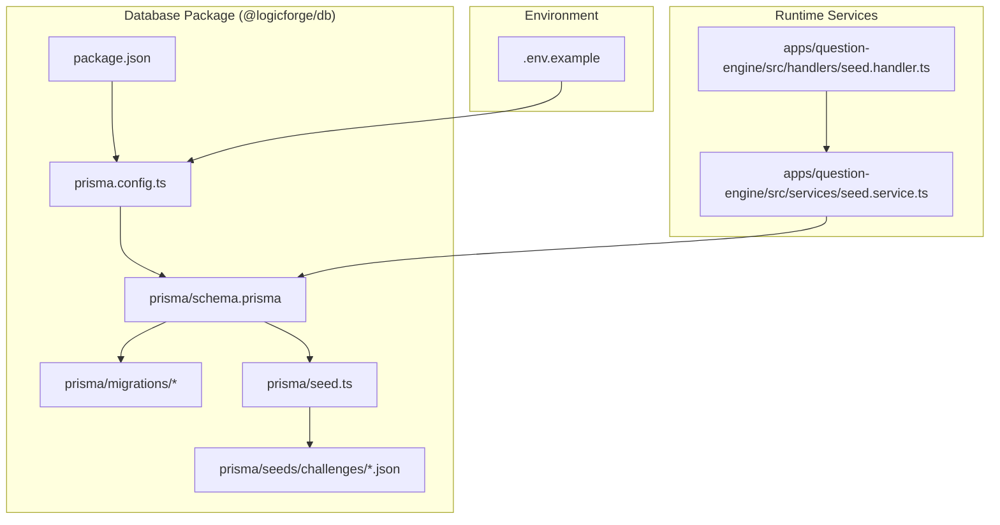
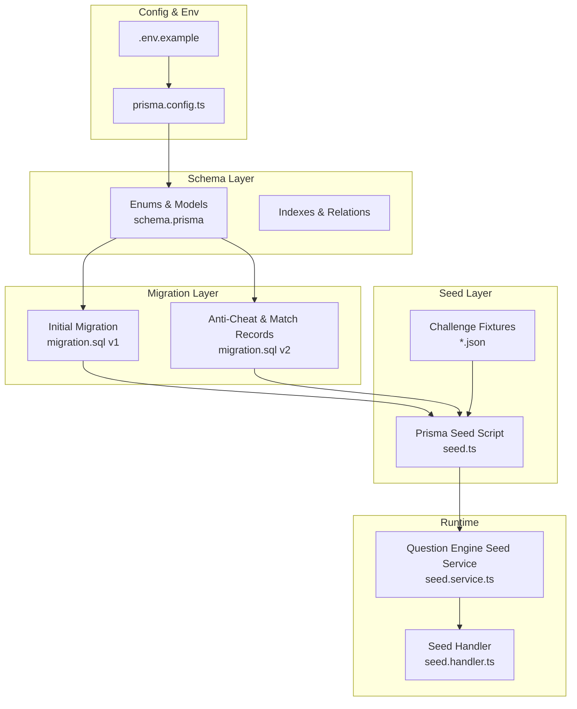
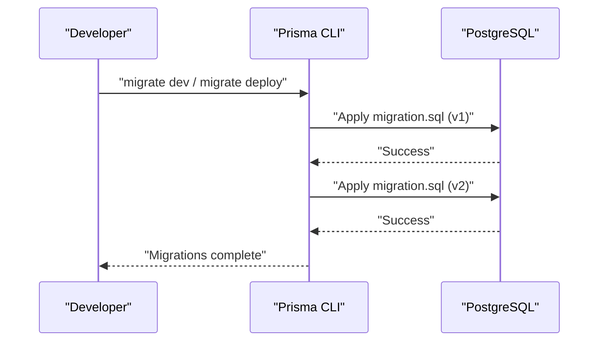
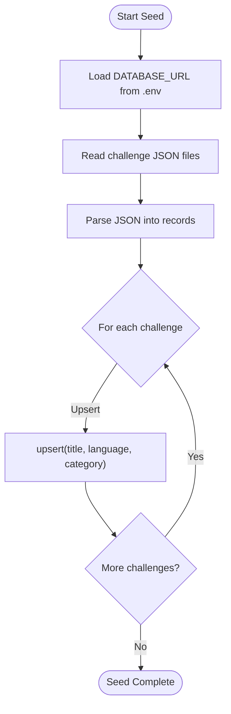
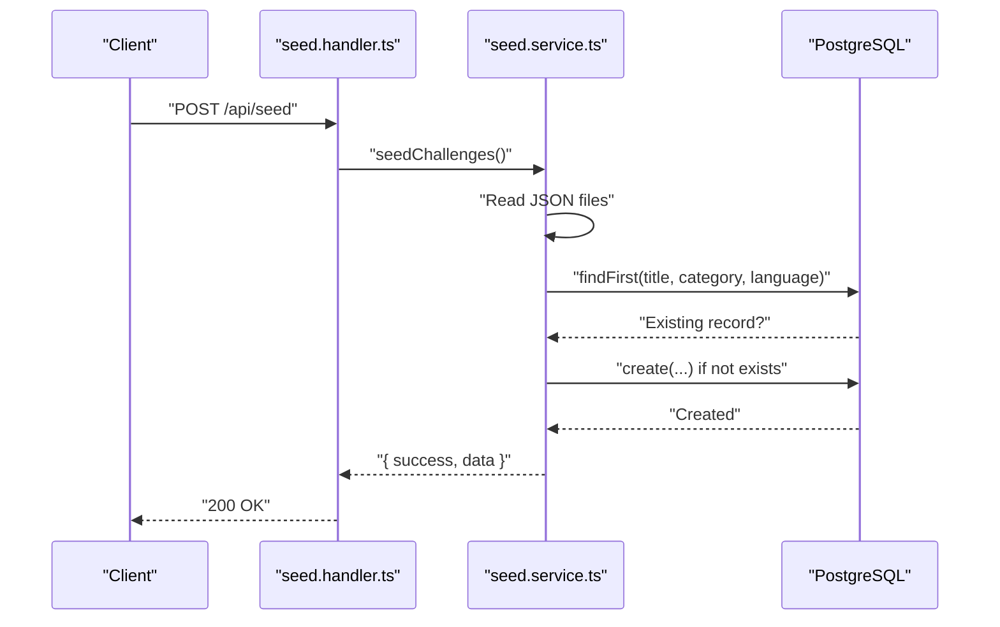
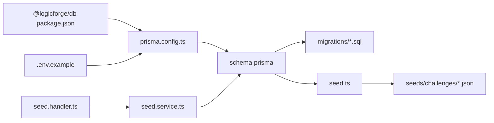

# Database Migrations & Seeding

<cite>
**Referenced Files in This Document**
- [schema.prisma](file://packages/db/prisma/schema.prisma)
- [seed.ts](file://packages/db/prisma/seed.ts)
- [20260301181212_add_challenge_title_language_category_unique/migration.sql](file://packages/db/prisma/migrations/20260301181212_add_challenge_title_language_category_unique/migration.sql)
- [20260308000000_add_match_records_and_anti_cheat/migration.sql](file://packages/db/prisma/migrations/20260308000000_add_match_records_and_anti_cheat/migration.sql)
- [prisma.config.ts](file://packages/db/prisma.config.ts)
- [package.json](file://packages/db/package.json)
- [seed.handler.ts](file://apps/question-engine/src/handlers/seed.handler.ts)
- [seed.service.ts](file://apps/question-engine/src/services/seed.service.ts)
- [.env.example](file://.env.example)
- [missing-link.json](file://packages/db/prisma/seeds/challenges/missing-link.json)
- [bottleneck-breaker.json](file://packages/db/prisma/seeds/challenges/bottleneck-breaker.json)
</cite>

## Table of Contents
1. [Introduction](#introduction)
2. [Project Structure](#project-structure)
3. [Core Components](#core-components)
4. [Architecture Overview](#architecture-overview)
5. [Detailed Component Analysis](#detailed-component-analysis)
6. [Dependency Analysis](#dependency-analysis)
7. [Performance Considerations](#performance-considerations)
8. [Troubleshooting Guide](#troubleshooting-guide)
9. [Conclusion](#conclusion)
10. [Appendices](#appendices)

## Introduction
This document explains the database migration and seeding strategies in Logic Forge. It covers the Prisma-based migration workflow, schema versioning, and database evolution processes. It also documents initial data seeding for challenges, user accounts, and system configuration, along with migration scripts for schema changes, data transformations, and backward compatibility considerations. Best practices for production deployments, rollback procedures, and data backup strategies are included, alongside guidance on the relationship between Prisma migrations and manual SQL scripts for complex operations.

## Project Structure
Logic Forge uses Prisma for PostgreSQL schema management and seeding. The database package encapsulates:
- Prisma schema definition
- Migration SQL files
- Seed script and seed data
- Prisma configuration and scripts

**Diagram sources**
- [schema.prisma](file://packages/db/prisma/schema.prisma#L1-L285)
- [seed.ts](file://packages/db/prisma/seed.ts#L1-L52)
- [20260301181212_add_challenge_title_language_category_unique/migration.sql](file://packages/db/prisma/migrations/20260301181212_add_challenge_title_language_category_unique/migration.sql#L1-L206)
- [20260308000000_add_match_records_and_anti_cheat/migration.sql](file://packages/db/prisma/migrations/20260308000000_add_match_records_and_anti_cheat/migration.sql#L1-L90)
- [prisma.config.ts](file://packages/db/prisma.config.ts#L1-L18)
- [package.json](file://packages/db/package.json#L1-L32)
- [seed.handler.ts](file://apps/question-engine/src/handlers/seed.handler.ts#L1-L12)
- [seed.service.ts](file://apps/question-engine/src/services/seed.service.ts#L1-L76)
- [.env.example](file://.env.example#L1-L62)

**Section sources**
- [schema.prisma](file://packages/db/prisma/schema.prisma#L1-L285)
- [prisma.config.ts](file://packages/db/prisma.config.ts#L1-L18)
- [package.json](file://packages/db/package.json#L1-L32)

## Core Components
- Prisma schema defines the PostgreSQL domain model, enums, relations, and indexes.
- Migration SQL files represent immutable schema changes applied in order.
- Seed script loads challenge data via Prisma Client and upserts records using a unique composite key.
- Runtime seeding service provides an alternative path to seed challenges at runtime.
- Prisma configuration resolves environment variables and sets the seed command.
- Environment variables supply database connection strings.

Key responsibilities:
- Schema evolution: managed by Prisma migrations and SQL scripts.
- Initial data: challenges seeded via Prisma seed script and JSON fixtures.
- Backward compatibility: enforced by unique constraints and defensive SQL (IF NOT EXISTS).
- Production readiness: scripts and configuration support CI/CD and local development.

**Section sources**
- [schema.prisma](file://packages/db/prisma/schema.prisma#L138-L161)
- [seed.ts](file://packages/db/prisma/seed.ts#L17-L44)
- [prisma.config.ts](file://packages/db/prisma.config.ts#L9-L17)
- [.env.example](file://.env.example#L5-L14)

## Architecture Overview
The database architecture combines Prisma-managed schema with manual SQL for advanced operations. The seed pipeline integrates JSON fixtures into the database using Prisma Client.

**Diagram sources**
- [schema.prisma](file://packages/db/prisma/schema.prisma#L1-L285)
- [20260301181212_add_challenge_title_language_category_unique/migration.sql](file://packages/db/prisma/migrations/20260301181212_add_challenge_title_language_category_unique/migration.sql#L1-L206)
- [20260308000000_add_match_records_and_anti_cheat/migration.sql](file://packages/db/prisma/migrations/20260308000000_add_match_records_and_anti_cheat/migration.sql#L1-L90)
- [seed.ts](file://packages/db/prisma/seed.ts#L1-L52)
- [seed.handler.ts](file://apps/question-engine/src/handlers/seed.handler.ts#L1-L12)
- [seed.service.ts](file://apps/question-engine/src/services/seed.service.ts#L1-L76)
- [prisma.config.ts](file://packages/db/prisma.config.ts#L1-L18)
- [.env.example](file://.env.example#L1-L62)

## Detailed Component Analysis

### Prisma Schema and Versioning
The schema defines:
- Enumerations for game modes, categories, statuses, and verdicts.
- Core models: GameSession, Round, Challenge, Submission, StoryProgress, DualMatch, RiskScore, TelemetryEvent, SessionFlag, SessionRiskState, MatchRecord, and UserScore.
- Unique constraints and indexes to enforce data integrity and optimize queries.
- Relations between models (e.g., Challenge ↔ Rounds, GameSession ↔ Rounds/Submission).

Versioning strategy:
- Migrations are stored under prisma/migrations with timestamped folders.
- Each migration file is a SQL script representing a reversible change.
- Unique constraints ensure idempotent seeding and schema evolution.

Best practices:
- Keep enums and models centralized in schema.prisma.
- Add indexes for frequent filters and joins.
- Use unique constraints to prevent duplicates during upserts.

**Section sources**
- [schema.prisma](file://packages/db/prisma/schema.prisma#L11-L89)
- [schema.prisma](file://packages/db/prisma/schema.prisma#L92-L161)
- [schema.prisma](file://packages/db/prisma/schema.prisma#L163-L285)

### Migration Workflow and Evolution
Two migrations illustrate the evolution path:
- Initial migration: creates core tables, enums, indexes, and foreign keys; establishes uniqueness on title/language/category for challenges.
- Anti-Cheat and Match Records migration: introduces MatchRecord, UserScore, TelemetryEvent, SessionFlag, and SessionRiskState with defensive creation (IF NOT EXISTS) and unique indexes.

Backward compatibility:
- Defensive SQL ensures re-running migrations does not fail.
- Unique indexes and constraints maintain referential integrity.

**Diagram sources**
- [20260301181212_add_challenge_title_language_category_unique/migration.sql](file://packages/db/prisma/migrations/20260301181212_add_challenge_title_language_category_unique/migration.sql#L1-L206)
- [20260308000000_add_match_records_and_anti_cheat/migration.sql](file://packages/db/prisma/migrations/20260308000000_add_match_records_and_anti_cheat/migration.sql#L1-L90)

**Section sources**
- [20260301181212_add_challenge_title_language_category_unique/migration.sql](file://packages/db/prisma/migrations/20260301181212_add_challenge_title_language_category_unique/migration.sql#L1-L206)
- [20260308000000_add_match_records_and_anti_cheat/migration.sql](file://packages/db/prisma/migrations/20260308000000_add_match_records_and_anti_cheat/migration.sql#L1-L90)

### Seed Pipeline: Challenges
The seed pipeline loads challenge data from JSON fixtures and upserts them into the database using Prisma Client. The seed script:
- Reads environment variables from root and web app locations.
- Iterates over challenge fixture files.
- Upserts each challenge using a composite unique key (title, language, category).
- Logs completion status.

**Diagram sources**
- [seed.ts](file://packages/db/prisma/seed.ts#L17-L44)
- [missing-link.json](file://packages/db/prisma/seeds/challenges/missing-link.json#L1-L85)
- [bottleneck-breaker.json](file://packages/db/prisma/seeds/challenges/bottleneck-breaker.json#L1-L153)

**Section sources**
- [seed.ts](file://packages/db/prisma/seed.ts#L1-L52)
- [prisma.config.ts](file://packages/db/prisma.config.ts#L4-L17)
- [package.json](file://packages/db/package.json#L8-L17)

### Runtime Seeding Service (Alternative Path)
The Question Engine exposes a runtime seeding endpoint that:
- Reads challenge JSON files from a data directory.
- Checks for existing records using a composite filter.
- Creates new records if none exist.
- Returns a summary of imported challenges.

**Diagram sources**
- [seed.handler.ts](file://apps/question-engine/src/handlers/seed.handler.ts#L1-L12)
- [seed.service.ts](file://apps/question-engine/src/services/seed.service.ts#L10-L75)

**Section sources**
- [seed.handler.ts](file://apps/question-engine/src/handlers/seed.handler.ts#L1-L12)
- [seed.service.ts](file://apps/question-engine/src/services/seed.service.ts#L1-L76)

### Manual SQL Scripts vs Prisma Migrations
Manual SQL scripts complement Prisma migrations for:
- Idempotent table creation (IF NOT EXISTS).
- Defensive enum creation (DO $$ BEGIN ... END $$).
- Index creation guarded against duplicates.

Guidelines:
- Prefer Prisma migrations for schema changes when possible.
- Use manual SQL for complex operations requiring conditional logic or advanced PostgreSQL features.
- Keep SQL scripts minimal and deterministic.

**Section sources**
- [20260308000000_add_match_records_and_anti_cheat/migration.sql](file://packages/db/prisma/migrations/20260308000000_add_match_records_and_anti_cheat/migration.sql#L1-L90)

## Dependency Analysis
The database package depends on Prisma Client and external environment variables. The seed service depends on the database client and logging infrastructure. Handlers depend on services.

**Diagram sources**
- [package.json](file://packages/db/package.json#L1-L32)
- [prisma.config.ts](file://packages/db/prisma.config.ts#L1-L18)
- [schema.prisma](file://packages/db/prisma/schema.prisma#L1-L285)
- [seed.ts](file://packages/db/prisma/seed.ts#L1-L52)
- [seed.handler.ts](file://apps/question-engine/src/handlers/seed.handler.ts#L1-L12)
- [seed.service.ts](file://apps/question-engine/src/services/seed.service.ts#L1-L76)
- [.env.example](file://.env.example#L1-L62)

**Section sources**
- [package.json](file://packages/db/package.json#L1-L32)
- [prisma.config.ts](file://packages/db/prisma.config.ts#L1-L18)
- [seed.handler.ts](file://apps/question-engine/src/handlers/seed.handler.ts#L1-L12)
- [seed.service.ts](file://apps/question-engine/src/services/seed.service.ts#L1-L76)

## Performance Considerations
- Indexes: The schema defines indexes on frequently queried fields (e.g., userId, status, mode, timestamps). Ensure indexes align with query patterns.
- Unique constraints: Composite unique keys (e.g., title/language/category) prevent duplicates and speed up upsert logic.
- JSON fields: Use JSONB for flexible data storage; consider normalization if queries become complex.
- Batch operations: Seed scripts iterate and upsert; batching may improve throughput for large datasets.
- Migration ordering: Keep migrations small and incremental to minimize downtime.

[No sources needed since this section provides general guidance]

## Troubleshooting Guide
Common issues and resolutions:
- DATABASE_URL not found:
  - Ensure environment variables are loaded by prisma.config.ts and that .env files are present.
  - Verify precedence: root .env and web app .env are both loaded.
- Seed failures:
  - Confirm seed script runs with proper environment resolution.
  - Check fixture file paths and JSON validity.
- Migration errors:
  - Review migration SQL for syntax and dependency order.
  - Use defensive constructs (IF NOT EXISTS) to avoid reapplication issues.
- Runtime seeding:
  - Confirm data directory path and file names match expectations.
  - Validate that composite filters (title, category, language) are correct.

**Section sources**
- [prisma.config.ts](file://packages/db/prisma.config.ts#L4-L17)
- [seed.ts](file://packages/db/prisma/seed.ts#L6-L10)
- [seed.handler.ts](file://apps/question-engine/src/handlers/seed.handler.ts#L1-L12)
- [seed.service.ts](file://apps/question-engine/src/services/seed.service.ts#L8, L23-L29)

## Conclusion
Logic Forge’s database strategy leverages Prisma for schema management and migrations, with manual SQL for advanced operations. The seed pipeline ensures reproducible initial data using JSON fixtures and upsert logic. By combining idempotent migrations, unique constraints, and defensive SQL, the system supports safe evolution and reliable deployments across environments.

[No sources needed since this section summarizes without analyzing specific files]

## Appendices

### Appendix A: Production Deployment Checklist
- Set DATABASE_URL in production environment.
- Run migrations in CI/CD before deploying application code.
- Seed only once after fresh schema deployment.
- Back up database before major migrations.
- Monitor seed and migration logs for errors.

[No sources needed since this section provides general guidance]

### Appendix B: Rollback and Backup Strategies
- Rollback:
  - Revert to previous migration state using Prisma CLI.
  - For manual SQL, maintain companion down scripts if applicable.
- Backup:
  - Use logical backups (e.g., pg_dump) for PostgreSQL.
  - Schedule regular backups and test restore procedures.

[No sources needed since this section provides general guidance]