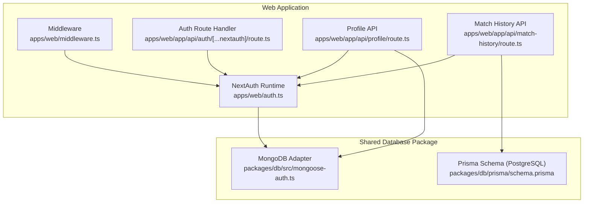
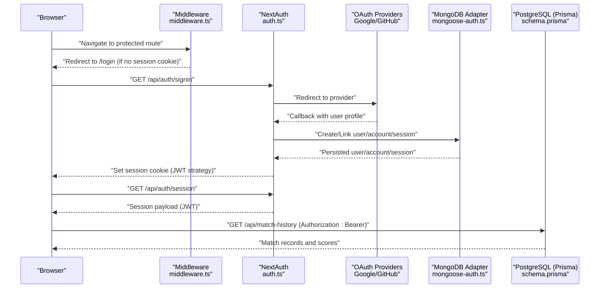
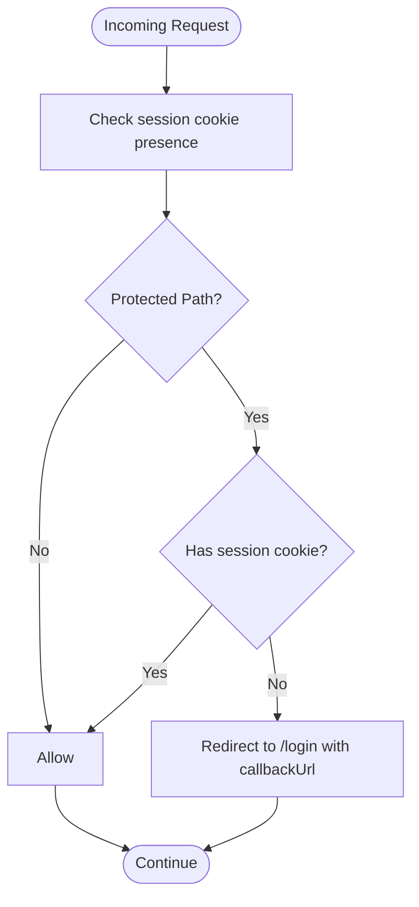
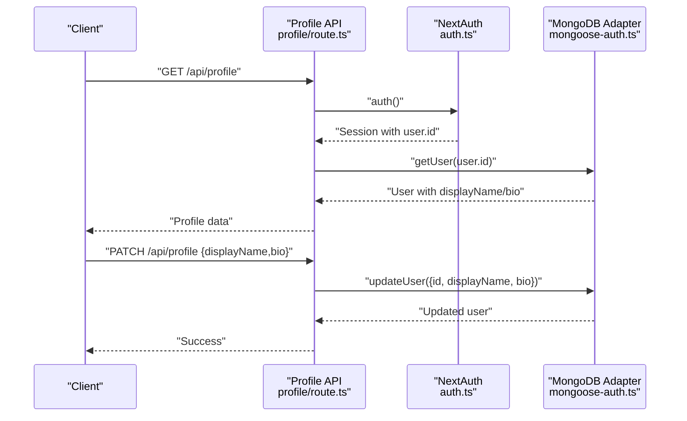
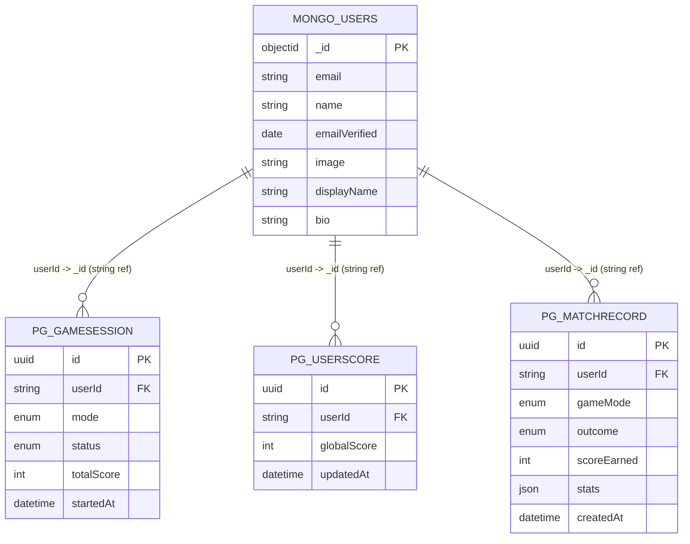
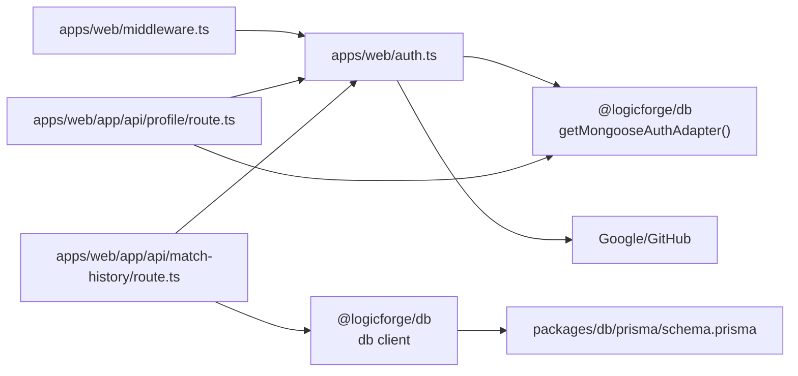

# MongoDB Authentication & User Models

<cite>
**Referenced Files in This Document**
- [apps/web/auth.ts](file://apps/web/auth.ts)
- [apps/web/auth.config.ts](file://apps/web/auth.config.ts)
- [apps/web/middleware.ts](file://apps/web/middleware.ts)
- [apps/web/app/api/auth/[...nextauth]/route.ts](file://apps/web/app/api/auth/[...nextauth]/route.ts)
- [apps/web/app/api/profile/route.ts](file://apps/web/app/api/profile/route.ts)
- [apps/web/app/api/match-history/route.ts](file://apps/web/app/api/match-history/route.ts)
- [packages/db/src/mongoose-auth.ts](file://packages/db/src/mongoose-auth.ts)
- [packages/db/prisma/schema.prisma](file://packages/db/prisma/schema.prisma)
</cite>

## Table of Contents
1. [Introduction](#introduction)
2. [Project Structure](#project-structure)
3. [Core Components](#core-components)
4. [Architecture Overview](#architecture-overview)
5. [Detailed Component Analysis](#detailed-component-analysis)
6. [Dependency Analysis](#dependency-analysis)
7. [Performance Considerations](#performance-considerations)
8. [Troubleshooting Guide](#troubleshooting-guide)
9. [Conclusion](#conclusion)

## Introduction
This document explains the MongoDB-backed authentication and user management system in Logic Forge. It covers the NextAuth integration, OAuth provider configurations for Google and GitHub, session management, and the relationship between MongoDB user documents and PostgreSQL game data via string references. It also documents the authentication flow, session persistence, user profile management, schema definitions for authentication collections, and security considerations.

## Project Structure
The authentication system spans three main areas:
- NextAuth configuration and runtime in the web application
- MongoDB adapter for NextAuth in the shared database package
- PostgreSQL Prisma schema for game state and user scores

**Diagram sources**
- [apps/web/auth.ts](file://apps/web/auth.ts#L59-L171)
- [apps/web/middleware.ts](file://apps/web/middleware.ts#L8-L34)
- [apps/web/app/api/auth/[...nextauth]/route.ts](file://apps/web/app/api/auth/[...nextauth]/route.ts#L1-L5)
- [apps/web/app/api/profile/route.ts](file://apps/web/app/api/profile/route.ts#L1-L49)
- [apps/web/app/api/match-history/route.ts](file://apps/web/app/api/match-history/route.ts#L1-L41)
- [packages/db/src/mongoose-auth.ts](file://packages/db/src/mongoose-auth.ts#L158-L286)
- [packages/db/prisma/schema.prisma](file://packages/db/prisma/schema.prisma#L92-L284)

**Section sources**
- [apps/web/auth.ts](file://apps/web/auth.ts#L59-L171)
- [apps/web/auth.config.ts](file://apps/web/auth.config.ts#L11-L56)
- [apps/web/middleware.ts](file://apps/web/middleware.ts#L8-L34)
- [apps/web/app/api/auth/[...nextauth]/route.ts](file://apps/web/app/api/auth/[...nextauth]/route.ts#L1-L5)
- [apps/web/app/api/profile/route.ts](file://apps/web/app/api/profile/route.ts#L1-L49)
- [apps/web/app/api/match-history/route.ts](file://apps/web/app/api/match-history/route.ts#L1-L41)
- [packages/db/src/mongoose-auth.ts](file://packages/db/src/mongoose-auth.ts#L158-L286)
- [packages/db/prisma/schema.prisma](file://packages/db/prisma/schema.prisma#L92-L284)

## Core Components
- NextAuth runtime configured with MongoDB adapter and OAuth providers
- Middleware enforcing session presence for protected routes
- Profile API for retrieving and updating MongoDB-backed user profiles
- Match history API querying PostgreSQL game records using email-based identifiers
- Prisma schema defining PostgreSQL game models and string foreign keys to MongoDB User._id

Key responsibilities:
- Authentication: NextAuth handles OAuth flows, JWT generation, and session persistence
- User Profiles: MongoDB stores user profile fields alongside NextAuth core fields
- Game State: PostgreSQL stores game sessions, rounds, challenges, and match records
- Cross-database References: String-based foreign keys connect MongoDB user IDs to PostgreSQL game data

**Section sources**
- [apps/web/auth.ts](file://apps/web/auth.ts#L59-L171)
- [apps/web/middleware.ts](file://apps/web/middleware.ts#L8-L34)
- [apps/web/app/api/profile/route.ts](file://apps/web/app/api/profile/route.ts#L1-L49)
- [apps/web/app/api/match-history/route.ts](file://apps/web/app/api/match-history/route.ts#L1-L41)
- [packages/db/src/mongoose-auth.ts](file://packages/db/src/mongoose-auth.ts#L158-L286)
- [packages/db/prisma/schema.prisma](file://packages/db/prisma/schema.prisma#L92-L284)

## Architecture Overview
The system integrates NextAuth with MongoDB for authentication and PostgreSQL for game state. OAuth providers (Google and GitHub) authenticate users and populate MongoDB user documents. JWTs are used for session strategy, and a derived access token enables bearer authentication to downstream services. Protected routes rely on middleware to enforce session presence, while APIs query MongoDB for user profiles and PostgreSQL for game data.

**Diagram sources**
- [apps/web/middleware.ts](file://apps/web/middleware.ts#L8-L34)
- [apps/web/auth.ts](file://apps/web/auth.ts#L59-L171)
- [packages/db/src/mongoose-auth.ts](file://packages/db/src/mongoose-auth.ts#L158-L286)
- [apps/web/app/api/match-history/route.ts](file://apps/web/app/api/match-history/route.ts#L6-L40)

## Detailed Component Analysis

### NextAuth Integration and OAuth Providers
- Strategy: JWT-based session with MongoDB adapter
- Providers: Google and GitHub configured with client credentials
- Cookie policy: Secure cookies in production; host-only to ensure cross-origin compatibility
- Callbacks: Embed MongoDB user fields into JWT; expose a signed access token for bearer auth
- Pages: Login and error pages mapped for redirects

Security and behavior highlights:
- allowDangerousEmailAccountLinking enabled for OAuth providers
- Redirect callback normalization ensures canonical origin handling
- Logger configured for crash/warn/debug visibility

**Section sources**
- [apps/web/auth.ts](file://apps/web/auth.ts#L59-L171)
- [apps/web/auth.config.ts](file://apps/web/auth.config.ts#L11-L56)

### MongoDB Authentication Collections and Schemas
The adapter defines NextAuth-compatible collections stored in MongoDB:
- users: Core NextAuth fields plus optional profile fields
- accounts: OAuth account linkage keyed by provider/providerAccountId
- sessions: Session tokens linked to users

Key schema characteristics:
- users: Sparse email index, timestamps, and profile fields (display name and bio)
- accounts: Unique compound index on provider/providerAccountId
- sessions: Unique sessionToken

User profile fields:
- displayName: Trimmed string
- bio: Trimmed string with maximum length constraint

**Section sources**
- [packages/db/src/mongoose-auth.ts](file://packages/db/src/mongoose-auth.ts#L39-L78)
- [packages/db/src/mongoose-auth.ts](file://packages/db/src/mongoose-auth.ts#L112-L156)

### Session Management and Persistence
- Session strategy: JWT
- Cookie name and options: Host-only, path "/", SameSite lax, secure in production
- Session creation and updates: Adapter persists session tokens and expiry
- Edge middleware: Checks for session cookie presence; actual verification occurs in Node.js

**Diagram sources**
- [apps/web/middleware.ts](file://apps/web/middleware.ts#L8-L34)

**Section sources**
- [apps/web/auth.ts](file://apps/web/auth.ts#L68-L78)
- [apps/web/middleware.ts](file://apps/web/middleware.ts#L8-L34)

### User Profile Management
- Retrieval: API endpoint fetches the current session and queries MongoDB via adapter
- Update: PATCH endpoint validates payload and updates displayName and bio in MongoDB
- Access control: Requires authenticated session

**Diagram sources**
- [apps/web/app/api/profile/route.ts](file://apps/web/app/api/profile/route.ts#L5-L48)
- [packages/db/src/mongoose-auth.ts](file://packages/db/src/mongoose-auth.ts#L180-L212)

**Section sources**
- [apps/web/app/api/profile/route.ts](file://apps/web/app/api/profile/route.ts#L1-L49)
- [packages/db/src/mongoose-auth.ts](file://packages/db/src/mongoose-auth.ts#L112-L156)

### Relationship Between MongoDB Users and PostgreSQL Game Data
- MongoDB user ID: ObjectId stored in NextAuth collections
- PostgreSQL game data: Uses string references to MongoDB user IDs
- Examples:
  - GameSession.userId: String FK to MongoDB User._id
  - UserScore.userId: String FK to MongoDB User._id
  - MatchRecord.userId: String FK to MongoDB User._id

Implications:
- String foreign keys enable Prisma relations without strict referential enforcement
- APIs must align identifiers; for example, match history uses email as userId for legacy reasons, but new models consistently use string user IDs

**Diagram sources**
- [packages/db/prisma/schema.prisma](file://packages/db/prisma/schema.prisma#L92-L117)
- [packages/db/prisma/schema.prisma](file://packages/db/prisma/schema.prisma#L263-L284)
- [packages/db/src/mongoose-auth.ts](file://packages/db/src/mongoose-auth.ts#L39-L51)

**Section sources**
- [packages/db/prisma/schema.prisma](file://packages/db/prisma/schema.prisma#L92-L117)
- [packages/db/prisma/schema.prisma](file://packages/db/prisma/schema.prisma#L263-L284)
- [apps/web/app/api/match-history/route.ts](file://apps/web/app/api/match-history/route.ts#L13-L14)

### Authentication Flow and Security Considerations
- OAuth flow: Google/GitHub providers handle user consent and profile exchange
- JWT embedding: MongoDB user fields are embedded into the JWT token during callbacks
- Access token exposure: A signed JWT is attached to the session for bearer authentication
- Cookie security: Secure cookies in production; host-only to avoid domain scoping issues
- Middleware protection: Edge middleware enforces presence of session cookie for protected paths

Security notes:
- allowDangerousEmailAccountLinking is enabled for OAuth; ensure provider scopes and validation are considered
- AUTH_SECRET/NEXTAUTH_SECRET must be set; missing secrets produce warnings in development
- Redirect callback URLs are normalized to the canonical origin to prevent open redirect risks

**Section sources**
- [apps/web/auth.ts](file://apps/web/auth.ts#L80-L91)
- [apps/web/auth.ts](file://apps/web/auth.ts#L124-L153)
- [apps/web/auth.ts](file://apps/web/auth.ts#L37-L44)
- [apps/web/auth.ts](file://apps/web/auth.ts#L98-L122)

## Dependency Analysis
- apps/web/auth.ts depends on:
  - NextAuth runtime
  - Google and GitHub providers
  - getMongooseAuthAdapter exported by @logicforge/db
- apps/web/middleware.ts depends on:
  - NextRequest/NextResponse for cookie inspection and redirects
- apps/web/app/api/profile/route.ts depends on:
  - NextAuth auth for session
  - getMongooseAuthAdapter for user retrieval/update
- apps/web/app/api/match-history/route.ts depends on:
  - NextAuth auth for session
  - db client from @logicforge/db for PostgreSQL queries
- packages/db/src/mongoose-auth.ts provides:
  - MongoDB connection and models
  - NextAuth Adapter implementation
- packages/db/prisma/schema.prisma defines:
  - PostgreSQL models and string foreign keys to MongoDB user IDs

**Diagram sources**
- [apps/web/auth.ts](file://apps/web/auth.ts#L46-L50)
- [apps/web/middleware.ts](file://apps/web/middleware.ts#L1-L39)
- [apps/web/app/api/profile/route.ts](file://apps/web/app/api/profile/route.ts#L1-L49)
- [apps/web/app/api/match-history/route.ts](file://apps/web/app/api/match-history/route.ts#L1-L41)
- [packages/db/src/mongoose-auth.ts](file://packages/db/src/mongoose-auth.ts#L158-L286)
- [packages/db/prisma/schema.prisma](file://packages/db/prisma/schema.prisma#L92-L284)

**Section sources**
- [apps/web/auth.ts](file://apps/web/auth.ts#L46-L50)
- [apps/web/middleware.ts](file://apps/web/middleware.ts#L1-L39)
- [apps/web/app/api/profile/route.ts](file://apps/web/app/api/profile/route.ts#L1-L49)
- [apps/web/app/api/match-history/route.ts](file://apps/web/app/api/match-history/route.ts#L1-L41)
- [packages/db/src/mongoose-auth.ts](file://packages/db/src/mongoose-auth.ts#L158-L286)
- [packages/db/prisma/schema.prisma](file://packages/db/prisma/schema.prisma#L92-L284)

## Performance Considerations
- JWT strategy reduces database lookups for session validation in middleware and API routes
- MongoDB adapter lazy-loads models after connection; ensure MONGO_URL is configured to avoid repeated connection attempts
- Prisma queries for match history use indexed userId and createdAt fields for efficient pagination
- Consider caching frequently accessed user profile data at the application layer if needed

## Troubleshooting Guide
Common issues and resolutions:
- Missing MONGO_URL or AUTH_SECRET/NEXTAUTH_SECRET:
  - Symptoms: Warning messages in development; adapter/connection errors
  - Resolution: Set environment variables in apps/web/.env or repository root .env
- OAuth callback failures:
  - Symptoms: Redirect loops or provider errors
  - Resolution: Verify provider client IDs/secrets and callback URL origins; ensure NEXTAUTH_URL is set correctly
- Session cookie not recognized:
  - Symptoms: Redirect to login on protected routes
  - Resolution: Confirm cookie domain/path/security settings match middleware expectations; ensure host-only cookies are used
- Profile update errors:
  - Symptoms: 400/404 responses from profile API
  - Resolution: Validate payload shape and ensure authenticated session exists
- Game data not appearing:
  - Symptoms: Empty match history
  - Resolution: Confirm userId alignment; legacy match history API uses email as userId, while newer models use string user IDs

**Section sources**
- [apps/web/auth.ts](file://apps/web/auth.ts#L37-L44)
- [apps/web/middleware.ts](file://apps/web/middleware.ts#L8-L34)
- [apps/web/app/api/profile/route.ts](file://apps/web/app/api/profile/route.ts#L34-L36)
- [apps/web/app/api/match-history/route.ts](file://apps/web/app/api/match-history/route.ts#L9-L11)

## Conclusion
Logic Forge’s authentication system leverages NextAuth with a MongoDB adapter for robust user management and OAuth integration. Session persistence uses JWT with secure cookie policies, and middleware enforces access control. PostgreSQL models maintain game state with string foreign keys referencing MongoDB user IDs. The design balances simplicity and scalability while preserving clear separation between identity and game data domains.