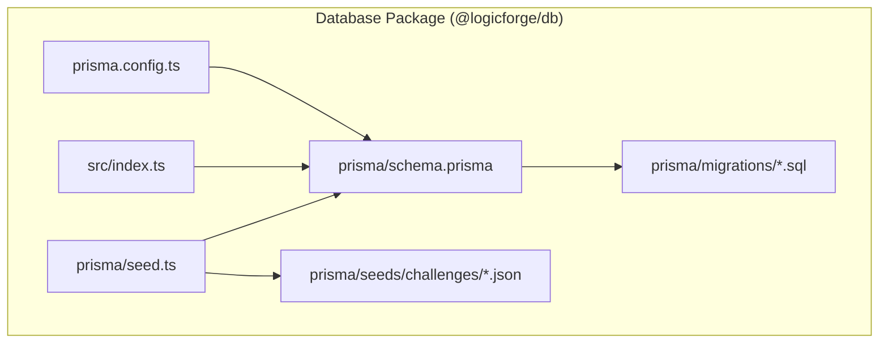
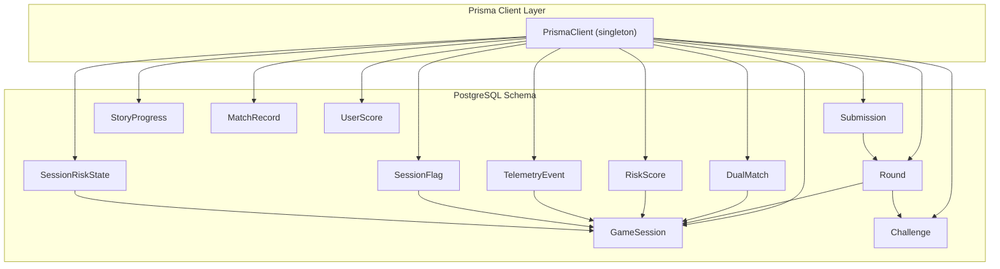
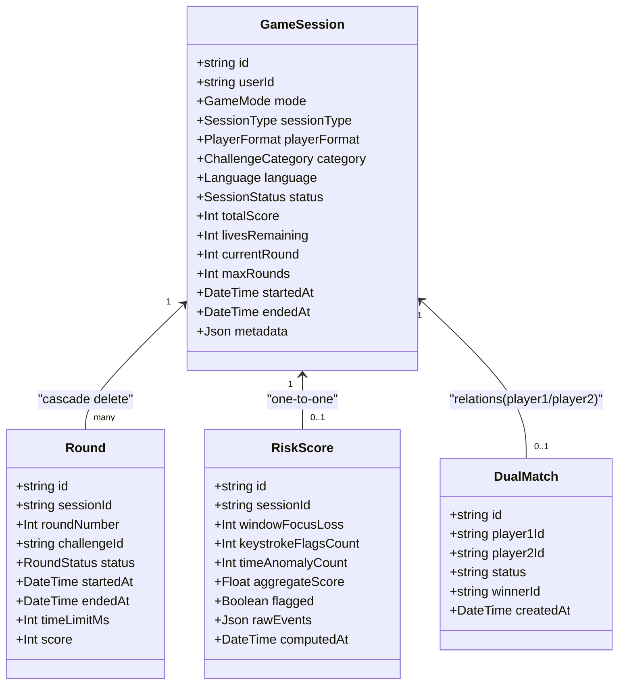
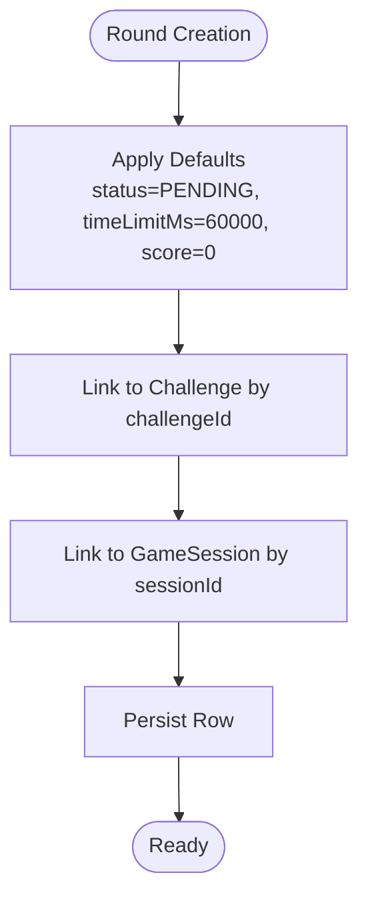
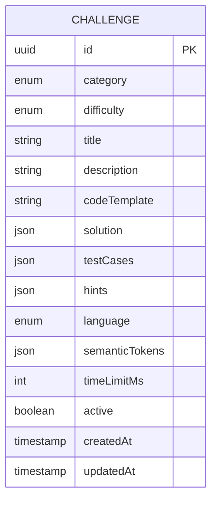
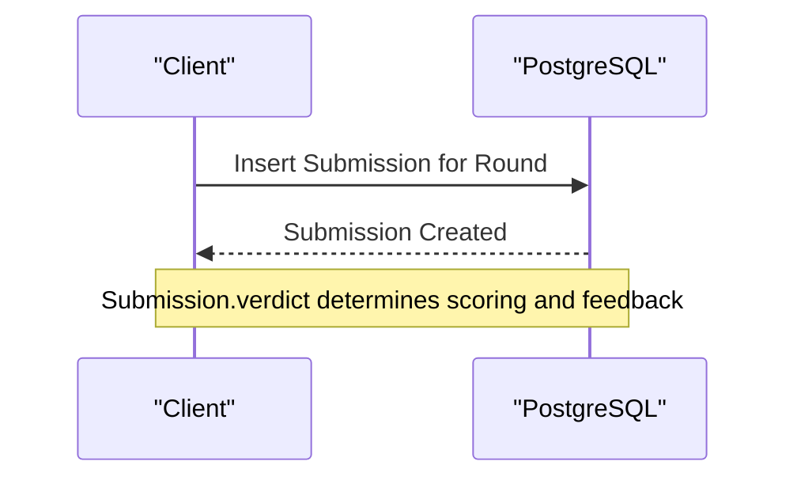
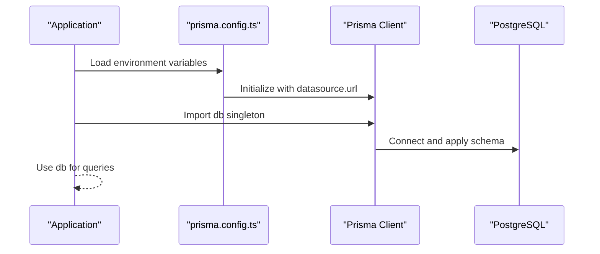
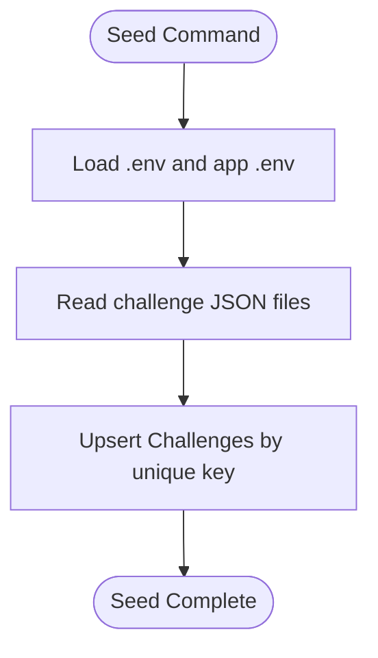
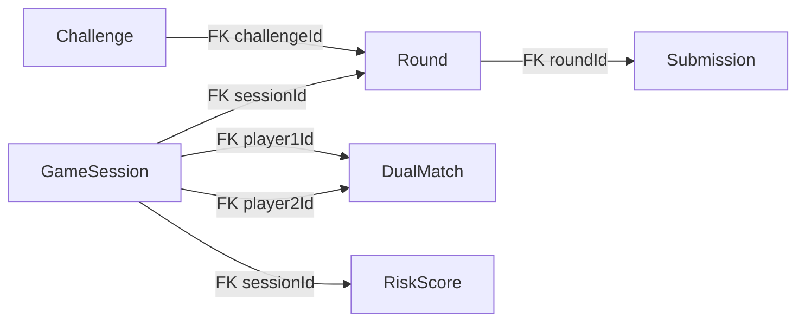

# PostgreSQL Schema & Prisma Models

<cite>
**Referenced Files in This Document**
- [schema.prisma](file://packages/db/prisma/schema.prisma)
- [index.ts](file://packages/db/src/index.ts)
- [prisma.config.ts](file://packages/db/prisma.config.ts)
- [seed.ts](file://packages/db/prisma/seed.ts)
- [missing-link.json](file://packages/db/prisma/seeds/challenges/missing-link.json)
- [bottleneck-breaker.json](file://packages/db/prisma/seeds/challenges/bottleneck-breaker.json)
- [state-tracing.json](file://packages/db/prisma/seeds/challenges/state-tracing.json)
- [syntax-error.json](file://packages/db/prisma/seeds/challenges/syntax-error.json)
- [migration.sql (v1)](file://packages/db/prisma/migrations/20260301181212_add_challenge_title_language_category_unique/migration.sql)
- [migration.sql (v2)](file://packages/db/prisma/migrations/20260308000000_add_match_records_and_anti_cheat/migration.sql)
- [migration_lock.toml](file://packages/db/prisma/migrations/migration_lock.toml)
</cite>

## Table of Contents
1. [Introduction](#introduction)
2. [Project Structure](#project-structure)
3. [Core Components](#core-components)
4. [Architecture Overview](#architecture-overview)
5. [Detailed Component Analysis](#detailed-component-analysis)
6. [Dependency Analysis](#dependency-analysis)
7. [Performance Considerations](#performance-considerations)
8. [Troubleshooting Guide](#troubleshooting-guide)
9. [Conclusion](#conclusion)
10. [Appendices](#appendices)

## Introduction
This document describes the PostgreSQL schema and Prisma ORM models used by Logic Forge’s database layer. It focuses on the core game models GameSession, Round, Challenge, and Submission, along with supporting models for story mode, dual matches, and anti-cheat telemetry. It also documents enum definitions, field types, defaults, constraints, indexes, and foreign keys. Finally, it explains Prisma client configuration, database connection setup, schema generation, and seeding processes, and provides practical query patterns using the Prisma client.

## Project Structure
The database layer is encapsulated in a dedicated package with the following key elements:
- Prisma schema defining models, enums, relations, indexes, and constraints
- Prisma client initialization module
- Prisma configuration for environment-driven datasource URL
- Seed scripts and seed data for challenges
- Migration SQL files representing the evolving schema

**Diagram sources**
- [schema.prisma](file://packages/db/prisma/schema.prisma#L1-L285)
- [prisma.config.ts](file://packages/db/prisma.config.ts#L1-L18)
- [index.ts](file://packages/db/src/index.ts#L1-L17)
- [seed.ts](file://packages/db/prisma/seed.ts#L1-L52)
- [migration.sql (v1)](file://packages/db/prisma/migrations/20260301181212_add_challenge_title_language_category_unique/migration.sql#L1-L206)
- [migration.sql (v2)](file://packages/db/prisma/migrations/20260308000000_add_match_records_and_anti_cheat/migration.sql#L1-L90)

**Section sources**
- [schema.prisma](file://packages/db/prisma/schema.prisma#L1-L285)
- [prisma.config.ts](file://packages/db/prisma.config.ts#L1-L18)
- [index.ts](file://packages/db/src/index.ts#L1-L17)
- [seed.ts](file://packages/db/prisma/seed.ts#L1-L52)
- [migration.sql (v1)](file://packages/db/prisma/migrations/20260301181212_add_challenge_title_language_category_unique/migration.sql#L1-L206)
- [migration.sql (v2)](file://packages/db/prisma/migrations/20260308000000_add_match_records_and_anti_cheat/migration.sql#L1-L90)

## Core Components
This section documents the core game models and enums, including field definitions, data types, defaults, and constraints.

### Enum Definitions
- SessionType: TIMER, LIVE
- PlayerFormat: SINGLE, DUAL
- SessionStatus: LOBBY, ACTIVE, PAUSED, COMPLETED, ABANDONED
- Difficulty: EASY, MEDIUM, HARD
- RoundStatus: PENDING, ACTIVE, COMPLETED, SKIPPED, TIMED_OUT
- SubmissionVerdict: CORRECT, INCORRECT, PARTIAL, TIMEOUT, RUNTIME_ERROR, COMPILE_ERROR
- ChallengeCategory: THE_MISSING_LINK, THE_BOTTLENECK_BREAKER, STATE_TRACING, SYNTAX_ERROR_DETECTION
- StoryChapter: THE_ARCHIVE, THE_SHIELD_GENERATOR, THE_AETHER_STREAM
- GameMode: ARCADE, STORY
- Language: JAVA, CPP, PYTHON
- MatchGameMode: ARCADE_SINGLE, ARCADE_DUAL, STORY
- MatchOutcome: WIN, LOSS, DRAW, COMPLETED

**Section sources**
- [schema.prisma](file://packages/db/prisma/schema.prisma#L13-L89)

### GameSession
- Purpose: Represents a single game session for a user, including mode, type, format, category, language, status, scoring, lives, round progression, and timestamps.
- Fields and Defaults:
  - id: String @id @default(uuid())
  - userId: String (foreign key reference pattern to user identity)
  - mode: GameMode
  - sessionType: SessionType?
  - playerFormat: PlayerFormat @default(SINGLE)
  - category: ChallengeCategory?
  - language: Language?
  - status: SessionStatus @default(LOBBY)
  - totalScore: Int @default(0)
  - livesRemaining: Int?
  - currentRound: Int @default(1)
  - maxRounds: Int @default(5)
  - startedAt: DateTime @default(now())
  - endedAt: DateTime?
  - metadata: Json?
- Relations:
  - rounds: Round[]
  - riskScore: RiskScore?
  - dualAsPlayer1: DualMatch @relation("player1")
  - dualAsPlayer2: DualMatch @relation("player2")
- Indexes:
  - @@index([userId])
  - @@index([status])
  - @@index([mode])

**Section sources**
- [schema.prisma](file://packages/db/prisma/schema.prisma#L92-L117)
- [migration.sql (v1)](file://packages/db/prisma/migrations/20260301181212_add_challenge_title_language_category_unique/migration.sql#L32-L50)

### Round
- Purpose: Encapsulates a single round within a session, linking to a specific challenge and capturing timing, scoring, and status.
- Fields and Defaults:
  - id: String @id @default(uuid())
  - sessionId: String
  - roundNumber: Int
  - challengeId: String
  - status: RoundStatus @default(PENDING)
  - startedAt: DateTime?
  - endedAt: DateTime?
  - timeLimitMs: Int @default(60000)
  - score: Int @default(0)
- Relations:
  - session: GameSession @relation(fields: [sessionId], references: [id], onDelete: Cascade)
  - challenge: Challenge @relation(fields: [challengeId], references: [id])
  - submission: Submission?
- Unique Constraints:
  - @@unique([sessionId, roundNumber])
- Indexes:
  - @@index([challengeId])

**Section sources**
- [schema.prisma](file://packages/db/prisma/schema.prisma#L119-L136)
- [migration.sql (v1)](file://packages/db/prisma/migrations/20260301181212_add_challenge_title_language_category_unique/migration.sql#L52-L65)

### Challenge
- Purpose: Stores question definitions, templates, solutions, test cases, hints, and metadata for randomized semantic tokenization.
- Fields and Defaults:
  - id: String @id @default(uuid())
  - category: ChallengeCategory
  - difficulty: Difficulty
  - title: String
  - description: String
  - codeTemplate: String
  - solution: Json
  - testCases: Json
  - hints: Json?
  - language: Language
  - semanticTokens: Json
  - timeLimitMs: Int @default(60000)
  - active: Boolean @default(true)
  - createdAt: DateTime @default(now())
  - updatedAt: DateTime @updatedAt
- Relations:
  - rounds: Round[]
- Indexes:
  - @@index([category, difficulty])
  - @@index([language])
  - @@index([active])
- Unique Constraints:
  - @@unique([title, language, category])

**Section sources**
- [schema.prisma](file://packages/db/prisma/schema.prisma#L138-L161)
- [migration.sql (v1)](file://packages/db/prisma/migrations/20260301181212_add_challenge_title_language_category_unique/migration.sql#L67-L86)

### Submission
- Purpose: Captures a single submission for a round, including code, verdict, runtime metrics, and test results.
- Fields and Defaults:
  - id: String @id @default(uuid())
  - roundId: String @unique
  - code: String
  - verdict: SubmissionVerdict
  - executionTimeMs: Int?
  - memoryUsedKb: Int?
  - compilerOutput: String?
  - testResults: Json?
  - submittedAt: DateTime @default(now())
- Relations:
  - round: Round @relation(fields: [roundId], references: [id], onDelete: Cascade)

**Section sources**
- [schema.prisma](file://packages/db/prisma/schema.prisma#L163-L175)
- [migration.sql (v1)](file://packages/db/prisma/migrations/20260301181212_add_challenge_title_language_category_unique/migration.sql#L88-L101)

### Supporting Models
- StoryProgress: Tracks user progress through story chapters with chapter-specific state and timestamps.
- DualMatch: Manages dual-mode matchmaking with player references and match lifecycle.
- RiskScore, TelemetryEvent, SessionFlag, SessionRiskState: Anti-cheat telemetry and risk tracking.
- MatchRecord, UserScore: Match history and global scoring.

**Section sources**
- [schema.prisma](file://packages/db/prisma/schema.prisma#L177-L284)
- [migration.sql (v1)](file://packages/db/prisma/migrations/20260301181212_add_challenge_title_language_category_unique/migration.sql#L103-L205)
- [migration.sql (v2)](file://packages/db/prisma/migrations/20260308000000_add_match_records_and_anti_cheat/migration.sql#L13-L89)

## Architecture Overview
The Prisma schema defines a normalized relational model with explicit foreign keys and indexes. The Prisma client is initialized globally to avoid multiple client instances and re-exported for use across the monorepo.

**Diagram sources**
- [index.ts](file://packages/db/src/index.ts#L1-L17)
- [schema.prisma](file://packages/db/prisma/schema.prisma#L92-L284)
- [migration.sql (v1)](file://packages/db/prisma/migrations/20260301181212_add_challenge_title_language_category_unique/migration.sql#L189-L205)
- [migration.sql (v2)](file://packages/db/prisma/migrations/20260308000000_add_match_records_and_anti_cheat/migration.sql#L13-L89)

## Detailed Component Analysis

### GameSession Model
- Responsibilities: Track per-user sessions, game mode, session type, player format, category/language filters, status, scores, lives, current/max rounds, and timestamps.
- Key Defaults: playerFormat SINGLE, status LOBBY, totalScore 0, currentRound 1, maxRounds 5, startedAt now().
- Indexes: userId, status, mode for efficient filtering and reporting.
- Relations: One-to-many with Round via cascade delete; optional RiskScore; dual match relations.

**Diagram sources**
- [schema.prisma](file://packages/db/prisma/schema.prisma#L92-L117)
- [schema.prisma](file://packages/db/prisma/schema.prisma#L119-L136)
- [schema.prisma](file://packages/db/prisma/schema.prisma#L209-L221)
- [schema.prisma](file://packages/db/prisma/schema.prisma#L195-L205)

**Section sources**
- [schema.prisma](file://packages/db/prisma/schema.prisma#L92-L117)
- [migration.sql (v1)](file://packages/db/prisma/migrations/20260301181212_add_challenge_title_language_category_unique/migration.sql#L32-L50)

### Round Model
- Responsibilities: Encapsulate per-round state, link to a challenge, and maintain submission linkage.
- Unique Constraint: (sessionId, roundNumber) ensures one round per session per round number.
- Indexes: challengeId for fast challenge filtering.
- Relations: Cascade delete to submissions; restrict delete to challenges.

**Diagram sources**
- [schema.prisma](file://packages/db/prisma/schema.prisma#L119-L136)
- [migration.sql (v1)](file://packages/db/prisma/migrations/20260301181212_add_challenge_title_language_category_unique/migration.sql#L52-L65)

**Section sources**
- [schema.prisma](file://packages/db/prisma/schema.prisma#L119-L136)

### Challenge Model
- Responsibilities: Store questions with randomized semantic tokens, test cases, and metadata.
- Unique Constraint: (title, language, category) prevents duplicates across variants.
- Indexes: composite (category, difficulty), language, active for filtering and discovery.

**Diagram sources**
- [schema.prisma](file://packages/db/prisma/schema.prisma#L138-L161)
- [migration.sql (v1)](file://packages/db/prisma/migrations/20260301181212_add_challenge_title_language_category_unique/migration.sql#L67-L86)

**Section sources**
- [schema.prisma](file://packages/db/prisma/schema.prisma#L138-L161)

### Submission Model
- Responsibilities: Capture a single submission attempt with verdict and execution metrics.
- Unique Constraint: roundId ensures one submission per round.
- Relation: Cascading delete ensures cleanup when a round is removed.

**Diagram sources**
- [schema.prisma](file://packages/db/prisma/schema.prisma#L163-L175)
- [migration.sql (v1)](file://packages/db/prisma/migrations/20260301181212_add_challenge_title_language_category_unique/migration.sql#L88-L101)

**Section sources**
- [schema.prisma](file://packages/db/prisma/schema.prisma#L163-L175)

### Prisma Client Configuration and Schema Generation
- Client Initialization:
  - Singleton pattern with globalThis caching to avoid multiple clients.
  - Re-exports Prisma types and auth adapters for downstream use.
- Datasource:
  - Provider: postgresql
  - URL resolved from environment variable DATABASE_URL
- Schema Generation:
  - Uses prisma generate with a custom config path
  - Supports seeding via tsx and seed script configured in package.json

**Diagram sources**
- [index.ts](file://packages/db/src/index.ts#L1-L17)
- [prisma.config.ts](file://packages/db/prisma.config.ts#L1-L18)
- [schema.prisma](file://packages/db/prisma/schema.prisma#L1-L9)

**Section sources**
- [index.ts](file://packages/db/src/index.ts#L1-L17)
- [prisma.config.ts](file://packages/db/prisma.config.ts#L1-L18)
- [schema.prisma](file://packages/db/prisma/schema.prisma#L1-L9)

### Seed Data and Process
- Seed Data: Challenge definitions loaded from JSON files under prisma/seeds/challenges.
- Seed Process: Upsert based on unique composite key (title, language, category) to avoid duplication.
- Execution: Run via tsx with DATABASE_URL available in environment.

**Diagram sources**
- [seed.ts](file://packages/db/prisma/seed.ts#L1-L52)
- [missing-link.json](file://packages/db/prisma/seeds/challenges/missing-link.json#L1-L85)
- [bottleneck-breaker.json](file://packages/db/prisma/seeds/challenges/bottleneck-breaker.json#L1-L153)
- [state-tracing.json](file://packages/db/prisma/seeds/challenges/state-tracing.json#L1-L60)
- [syntax-error.json](file://packages/db/prisma/seeds/challenges/syntax-error.json#L1-L62)

**Section sources**
- [seed.ts](file://packages/db/prisma/seed.ts#L1-L52)

## Dependency Analysis
- Internal Dependencies:
  - src/index.ts depends on @prisma/client and re-exports types
  - prisma.config.ts loads environment and points to schema and seed
- External Dependencies:
  - PostgreSQL provider
  - Prisma client and CLI
  - tsx for seed execution
- Foreign Keys:
  - Round.sessionId → GameSession.id (Cascade)
  - Round.challengeId → Challenge.id (Restrict)
  - Submission.roundId → Round.id (Cascade)
  - DualMatch.player1Id → GameSession.id (Cascade)
  - DualMatch.player2Id → GameSession.id (SetNull)
  - RiskScore.sessionId → GameSession.id (Cascade)

**Diagram sources**
- [schema.prisma](file://packages/db/prisma/schema.prisma#L130-L132)
- [schema.prisma](file://packages/db/prisma/schema.prisma#L174)
- [schema.prisma](file://packages/db/prisma/schema.prisma#L203-L204)
- [schema.prisma](file://packages/db/prisma/schema.prisma#L220)
- [migration.sql (v1)](file://packages/db/prisma/migrations/20260301181212_add_challenge_title_language_category_unique/migration.sql#L189-L205)

**Section sources**
- [schema.prisma](file://packages/db/prisma/schema.prisma#L130-L132)
- [schema.prisma](file://packages/db/prisma/schema.prisma#L174)
- [schema.prisma](file://packages/db/prisma/schema.prisma#L203-L204)
- [schema.prisma](file://packages/db/prisma/schema.prisma#L220)
- [migration.sql (v1)](file://packages/db/prisma/migrations/20260301181212_add_challenge_title_language_category_unique/migration.sql#L189-L205)

## Performance Considerations
- Indexes:
  - GameSession: userId, status, mode for filtering and reporting
  - Round: challengeId for challenge-based lookups; unique (sessionId, roundNumber) for round ordering
  - Challenge: (category, difficulty), language, active for discovery and filtering
  - Submission: unique roundId for one-per-round access
  - Anti-cheat and match records: composite and single-column indexes optimized for analytics and real-time queries
- Defaults:
  - Many numeric fields default to sensible baseline values to reduce nullable overhead
- Constraints:
  - Unique constraints prevent duplicate entries and support fast upsert semantics
- Recommendations:
  - Add targeted indexes for frequently filtered columns in production workloads
  - Monitor slow queries and consider partial indexes for hotspots
  - Use batch operations for seeding and bulk updates

[No sources needed since this section provides general guidance]

## Troubleshooting Guide
- Environment Variables:
  - Ensure DATABASE_URL is present in the environment used by prisma.config.ts
- Client Initialization:
  - Avoid importing Prisma client before environment is ready; the singleton pattern mitigates multiple clients
- Seeding:
  - Run seed with DATABASE_URL available; the seed script reads .env files from root and app directories
- Migrations:
  - Verify migration_lock.toml indicates the correct provider
  - Review migration.sql for expected indexes, constraints, and types

**Section sources**
- [prisma.config.ts](file://packages/db/prisma.config.ts#L1-L18)
- [index.ts](file://packages/db/src/index.ts#L1-L17)
- [seed.ts](file://packages/db/prisma/seed.ts#L1-L52)
- [migration_lock.toml](file://packages/db/prisma/migrations/migration_lock.toml#L1-L4)

## Conclusion
Logic Forge’s PostgreSQL schema, defined via Prisma, provides a robust foundation for game sessions, rounds, challenges, and submissions, complemented by story mode, dual matches, and anti-cheat telemetry. The schema emphasizes strong typing through enums, normalized relations with foreign keys, and strategic indexes for performance. The Prisma client is configured for reliable development and production usage, with environment-aware datasource URLs and a streamlined seed process.

[No sources needed since this section summarizes without analyzing specific files]

## Appendices

### Field Reference Summary
- GameSession
  - Fields: id, userId, mode, sessionType, playerFormat, category, language, status, totalScore, livesRemaining, currentRound, maxRounds, startedAt, endedAt, metadata
  - Defaults: playerFormat=SINGLE, status=LOBBY, totalScore=0, currentRound=1, maxRounds=5, startedAt=now()
  - Indexes: userId, status, mode
- Round
  - Fields: id, sessionId, roundNumber, challengeId, status, startedAt, endedAt, timeLimitMs, score
  - Defaults: status=PENDING, timeLimitMs=60000, score=0
  - Unique: (sessionId, roundNumber)
  - Indexes: challengeId
- Challenge
  - Fields: id, category, difficulty, title, description, codeTemplate, solution, testCases, hints, language, semanticTokens, timeLimitMs, active, createdAt, updatedAt
  - Defaults: timeLimitMs=60000, active=true
  - Unique: (title, language, category)
  - Indexes: (category, difficulty), language, active
- Submission
  - Fields: id, roundId, code, verdict, executionTimeMs, memoryUsedKb, compilerOutput, testResults, submittedAt
  - Defaults: submittedAt=now()
  - Unique: roundId

**Section sources**
- [schema.prisma](file://packages/db/prisma/schema.prisma#L92-L175)
- [migration.sql (v1)](file://packages/db/prisma/migrations/20260301181212_add_challenge_title_language_category_unique/migration.sql#L32-L101)

### Example Queries Using Prisma Client
Note: Replace placeholders with actual values and use appropriate enums.

- Create a new GameSession
  - Path: [index.ts](file://packages/db/src/index.ts#L1-L17)
  - Pattern: db.gameSession.create({ data: { userId, mode, ...defaultsAndOverrides } })
- Start a Round
  - Path: [index.ts](file://packages/db/src/index.ts#L1-L17)
  - Pattern: db.round.create({ data: { sessionId, challengeId, roundNumber, status: "PENDING" } })
- Submit Code and Determine Verdict
  - Path: [index.ts](file://packages/db/src/index.ts#L1-L17)
  - Pattern: db.submission.create({ data: { roundId, code, verdict, ...metrics } })
- Fetch Active Challenges by Category and Difficulty
  - Path: [index.ts](file://packages/db/src/index.ts#L1-L17)
  - Pattern: db.challenge.findMany({ where: { category, difficulty, active: true }, orderBy: { title: "asc" } })
- Get User Match History
  - Path: [index.ts](file://packages/db/src/index.ts#L1-L17)
  - Pattern: db.matchRecord.findMany({ where: { userId }, orderBy: { createdAt: "desc" } })

**Section sources**
- [index.ts](file://packages/db/src/index.ts#L1-L17)
- [schema.prisma](file://packages/db/prisma/schema.prisma#L92-L175)