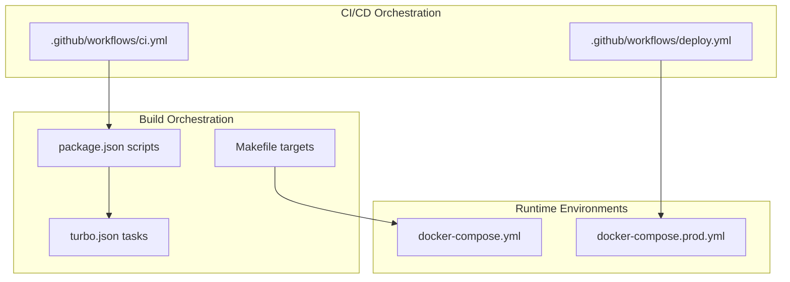
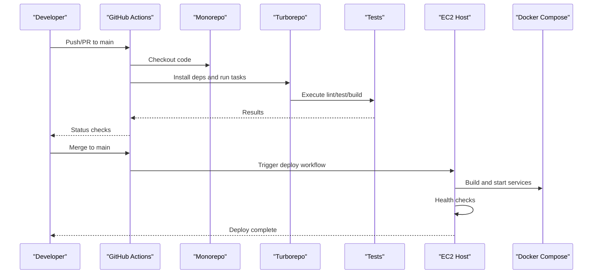
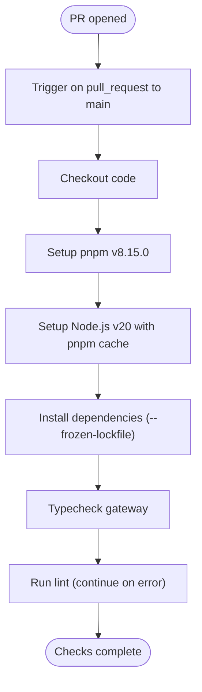
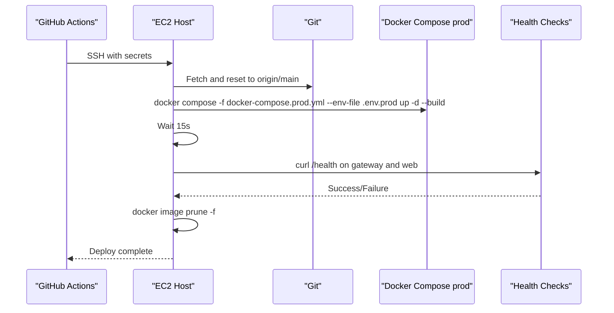
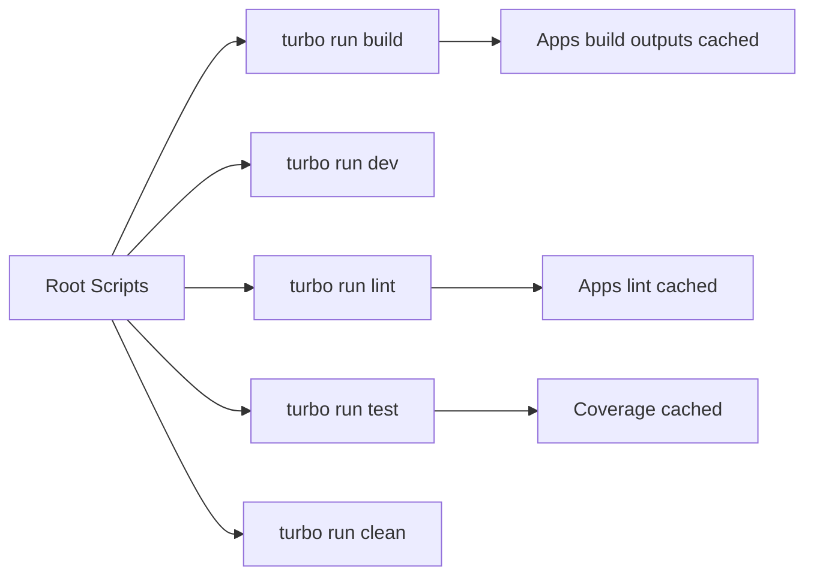
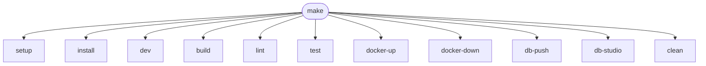
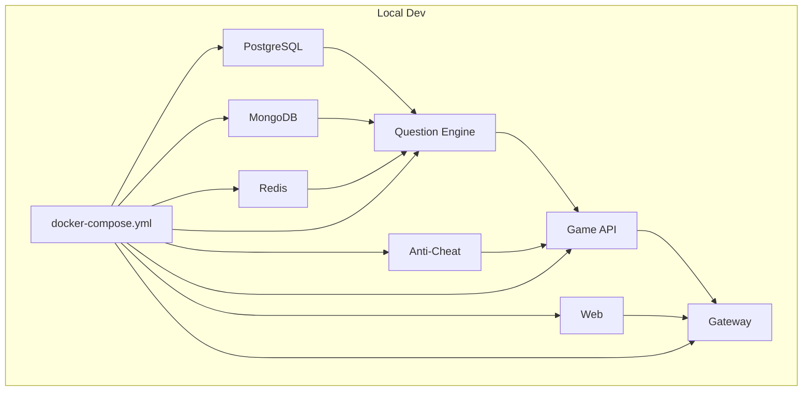
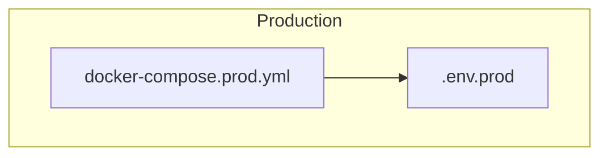
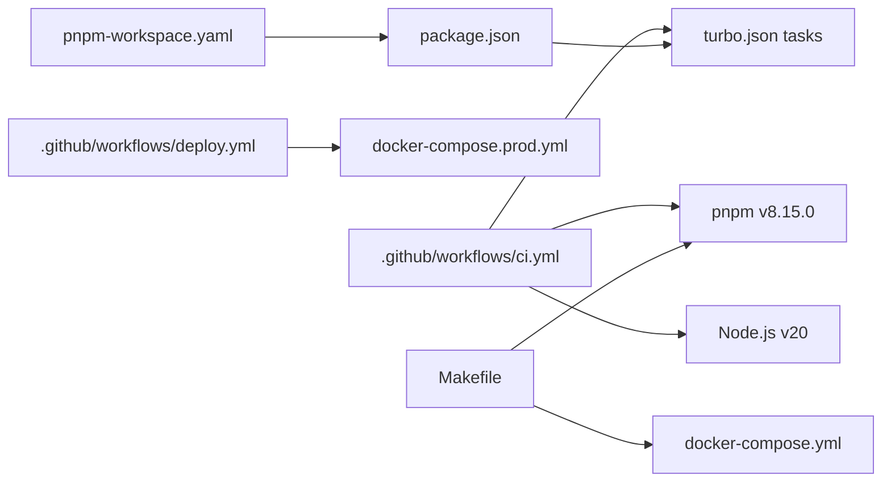

# CI/CD Pipeline & Automation

<cite>
**Referenced Files in This Document**
- [ci.yml](file://.github/workflows/ci.yml)
- [deploy.yml](file://.github/workflows/deploy.yml)
- [Makefile](file://Makefile)
- [turbo.json](file://turbo.json)
- [package.json](file://package.json)
- [docker-compose.yml](file://docker-compose.yml)
- [docker-compose.prod.yml](file://docker-compose.prod.yml)
- [.dockerignore](file://.dockerignore)
- [pnpm-workspace.yaml](file://pnpm-workspace.yaml)
</cite>

## Table of Contents
1. [Introduction](#introduction)
2. [Project Structure](#project-structure)
3. [Core Components](#core-components)
4. [Architecture Overview](#architecture-overview)
5. [Detailed Component Analysis](#detailed-component-analysis)
6. [Dependency Analysis](#dependency-analysis)
7. [Performance Considerations](#performance-considerations)
8. [Troubleshooting Guide](#troubleshooting-guide)
9. [Conclusion](#conclusion)
10. [Appendices](#appendices)

## Introduction
This document explains the CI/CD pipeline and automation processes in Logic Forge. It covers continuous integration workflows, automated deployment to staging and production, build automation with Makefile and Turborepo, and operational practices for release management, versioning, and rollback. It also documents security scanning, dependency updates, and deployment validation steps, and provides guidance for customizing the pipeline across environments.

## Project Structure
Logic Forge is a monorepo using pnpm workspaces. CI/CD is orchestrated via GitHub Actions workflows, build orchestration via Turborepo, and deployment via Docker Compose. The repository includes:
- GitHub Actions workflows for CI and deployment
- Turborepo configuration for incremental builds and caching
- Makefile targets for local developer workflows
- Docker Compose files for local and production deployments
- Workspace configuration for pnpm

**Diagram sources**
- [ci.yml](file://.github/workflows/ci.yml#L1-L33)
- [deploy.yml](file://.github/workflows/deploy.yml#L1-L66)
- [package.json](file://package.json#L4-L11)
- [turbo.json](file://turbo.json#L6-L44)
- [Makefile](file://Makefile#L1-L55)
- [docker-compose.yml](file://docker-compose.yml#L1-L238)
- [docker-compose.prod.yml](file://docker-compose.prod.yml#L1-L143)

**Section sources**
- [pnpm-workspace.yaml](file://pnpm-workspace.yaml#L1-L3)
- [package.json](file://package.json#L1-L22)

## Core Components
- Continuous Integration workflow validates code quality and type safety on pull requests targeting main.
- Deployment workflow automates production deployment to an EC2 host via SSH, performs health checks, and cleans images.
- Turborepo orchestrates incremental builds, linting, testing, and caching across the monorepo.
- Makefile provides developer-friendly targets for setup, development, building, testing, linting, Docker orchestration, database helpers, and cleanup.
- Docker Compose defines local development stacks and production deployment stacks.

**Section sources**
- [ci.yml](file://.github/workflows/ci.yml#L1-L33)
- [deploy.yml](file://.github/workflows/deploy.yml#L1-L66)
- [turbo.json](file://turbo.json#L6-L44)
- [package.json](file://package.json#L4-L11)
- [Makefile](file://Makefile#L1-L55)
- [docker-compose.yml](file://docker-compose.yml#L1-L238)
- [docker-compose.prod.yml](file://docker-compose.prod.yml#L1-L143)

## Architecture Overview
The CI/CD architecture integrates GitHub Actions, Turborepo, and Docker Compose to deliver a repeatable, scalable pipeline.

**Diagram sources**
- [ci.yml](file://.github/workflows/ci.yml#L3-L33)
- [deploy.yml](file://.github/workflows/deploy.yml#L3-L66)
- [package.json](file://package.json#L4-L11)
- [turbo.json](file://turbo.json#L6-L44)
- [docker-compose.prod.yml](file://docker-compose.prod.yml#L1-L143)

## Detailed Component Analysis

### Continuous Integration Workflow (.github/workflows/ci.yml)
- Triggers on pull requests to main.
- Steps:
  - Checkout repository
  - Setup pnpm and Node.js
  - Install dependencies with lockfile
  - Typecheck selected TypeScript projects
  - Run linter with permissive failure to allow PR review to proceed

**Diagram sources**
- [ci.yml](file://.github/workflows/ci.yml#L3-L33)

**Section sources**
- [ci.yml](file://.github/workflows/ci.yml#L1-L33)

### Deployment Workflow (.github/workflows/deploy.yml)
- Triggers on pushes to main.
- Concurrency group prevents overlapping production deploys.
- Jobs:
  - Typecheck: Ensures type safety before deployment.
  - Deploy: SSH to EC2, pulls latest code, builds with Docker Compose, waits, performs health checks, prunes images, lists running containers.

**Diagram sources**
- [deploy.yml](file://.github/workflows/deploy.yml#L3-L66)

**Section sources**
- [deploy.yml](file://.github/workflows/deploy.yml#L1-L66)

### Build Automation with Turborepo (turbo.json, package.json)
- Monorepo tasks:
  - build: depends on upstream packages, caches Next.js and dist artifacts
  - lint: depends on upstream packages
  - dev: persistent and non-cached
  - test: depends on build, caches coverage, tracks source and test inputs
  - clean: non-cached
- Root package.json delegates to Turborepo for build/dev/lint/test/clean.
- Global dependencies include environment-local files.

**Diagram sources**
- [package.json](file://package.json#L4-L11)
- [turbo.json](file://turbo.json#L6-L44)

**Section sources**
- [turbo.json](file://turbo.json#L1-L45)
- [package.json](file://package.json#L1-L22)

### Local Development and Build Targets (Makefile)
- Provides developer-centric targets:
  - setup: create .env from example
  - install, dev, build, lint, test
  - docker-up/down: manage local stack
  - db-push/studio: database helpers
  - clean: remove generated assets and node_modules

**Diagram sources**
- [Makefile](file://Makefile#L1-L55)

**Section sources**
- [Makefile](file://Makefile#L1-L55)

### Environment Configurations (docker-compose.yml, docker-compose.prod.yml)
- Local development stack includes PostgreSQL, MongoDB, Redis, services, and the web frontend.
- Production stack mirrors services with production-ready environment variables and restart policies.
- Both define healthchecks and inter-service dependencies.

**Diagram sources**
- [docker-compose.yml](file://docker-compose.yml#L1-L238)

**Diagram sources**
- [docker-compose.prod.yml](file://docker-compose.prod.yml#L1-L143)

**Section sources**
- [docker-compose.yml](file://docker-compose.yml#L1-L238)
- [docker-compose.prod.yml](file://docker-compose.prod.yml#L1-L143)

### Security Scanning, Dependency Updates, and Validation
- Security scanning:
  - Use a dedicated security scan action in CI to check for vulnerabilities in dependencies.
  - Integrate SAST (e.g., ESLint rules) and secret detection in pre-deploy checks.
- Dependency updates:
  - Pin pnpm version in CI and use frozen lockfile installs to prevent drift.
  - Add a scheduled Dependabot or Renovate job to propose updates; require manual approval for critical changes.
- Deployment validation:
  - Health checks for gateway and web endpoints.
  - Post-deploy smoke tests via curl or headless browser checks.
  - Image pruning after deployment to maintain disk space.

[No sources needed since this section provides general guidance]

### Release Management, Versioning, and Rollback
- Versioning:
  - Adopt semantic versioning for releases; tag commits on main for production.
- Release process:
  - CI runs typechecks and lint; successful PR merges trigger deployment.
  - Artifacts: container images built by Docker Compose; ensure immutable tags.
- Rollback:
  - SSH into EC2 and redeploy previous known-good image/tag.
  - Optionally use blue/green or rolling updates with load balancer switching.

[No sources needed since this section provides general guidance]

### Customization for Different Environments
- Staging vs Production:
  - Separate Docker Compose files and environment files (.env.staging vs .env.prod).
  - Gate deployments behind manual approvals for production.
- Multi-region or cloud providers:
  - Replace EC2 SSH step with provider-specific deployment (e.g., ECS, EKS, or Cloud Run).
  - Parameterize secrets and URLs via environment files and CI secrets.

[No sources needed since this section provides general guidance]

## Dependency Analysis
- CI depends on pnpm and Node.js versions defined in workflows.
- Turborepo depends on root scripts and workspace configuration.
- Deployment depends on production Docker Compose and environment files.
- Makefile targets depend on Docker Compose and pnpm scripts.

**Diagram sources**
- [ci.yml](file://.github/workflows/ci.yml#L13-L24)
- [deploy.yml](file://.github/workflows/deploy.yml#L35-L52)
- [turbo.json](file://turbo.json#L1-L45)
- [package.json](file://package.json#L1-L22)
- [pnpm-workspace.yaml](file://pnpm-workspace.yaml#L1-L3)
- [Makefile](file://Makefile#L1-L55)
- [docker-compose.yml](file://docker-compose.yml#L1-L238)
- [docker-compose.prod.yml](file://docker-compose.prod.yml#L1-L143)

**Section sources**
- [ci.yml](file://.github/workflows/ci.yml#L1-L33)
- [deploy.yml](file://.github/workflows/deploy.yml#L1-L66)
- [turbo.json](file://turbo.json#L1-L45)
- [package.json](file://package.json#L1-L22)
- [pnpm-workspace.yaml](file://pnpm-workspace.yaml#L1-L3)
- [Makefile](file://Makefile#L1-L55)
- [docker-compose.yml](file://docker-compose.yml#L1-L238)
- [docker-compose.prod.yml](file://docker-compose.prod.yml#L1-L143)

## Performance Considerations
- Use Turborepo caching to speed up incremental builds and reduce CI time.
- Keep Docker layers minimal and leverage .dockerignore to exclude unnecessary files.
- Parallelize independent jobs in CI where safe.
- Prefer production Docker Compose for validation to catch runtime issues early.

[No sources needed since this section provides general guidance]

## Troubleshooting Guide
- CI fails on typecheck:
  - Verify TypeScript projects compile locally; ensure pnpm version and Node version match CI.
- Lint failures:
  - Run local lint to reproduce and fix issues; remember lint is configured to continue on error in CI.
- Deployment SSH failures:
  - Confirm EC2 host, user, and SSH key secrets; ensure remote directory permissions.
- Health checks fail:
  - Inspect service logs on EC2; verify environment variables and inter-service URLs.
- Docker build issues:
  - Check .dockerignore exclusions and ensure required files are present.
- Rollback:
  - Redeploy previous known-good image/tag; confirm health checks pass.

**Section sources**
- [ci.yml](file://.github/workflows/ci.yml#L30-L33)
- [deploy.yml](file://.github/workflows/deploy.yml#L35-L66)
- [.dockerignore](file://.dockerignore#L1-L24)

## Conclusion
Logic Forge’s CI/CD pipeline combines GitHub Actions, Turborepo, and Docker Compose to deliver reliable, incremental builds and automated production deployments. By leveraging concurrency controls, health checks, and environment-specific configurations, teams can confidently iterate and ship features while maintaining stability across environments.

## Appendices

### Appendix A: Example Pipeline Configuration References
- CI workflow definition: [ci.yml](file://.github/workflows/ci.yml#L1-L33)
- Deployment workflow definition: [deploy.yml](file://.github/workflows/deploy.yml#L1-L66)
- Build orchestration: [package.json](file://package.json#L4-L11), [turbo.json](file://turbo.json#L6-L44)
- Developer targets: [Makefile](file://Makefile#L1-L55)
- Local stack: [docker-compose.yml](file://docker-compose.yml#L1-L238)
- Production stack: [docker-compose.prod.yml](file://docker-compose.prod.yml#L1-L143)