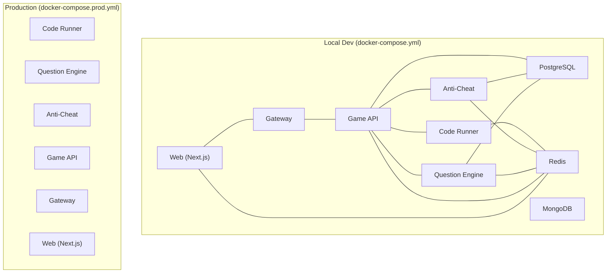
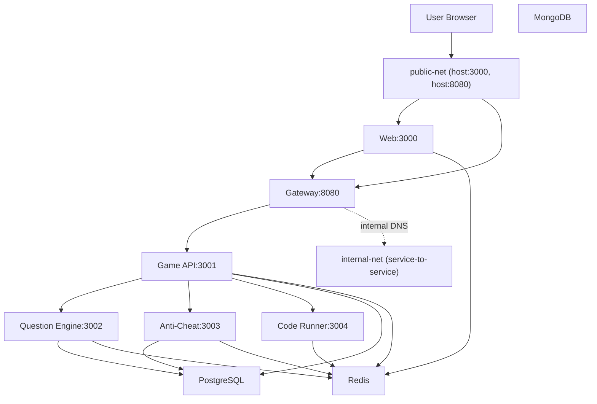
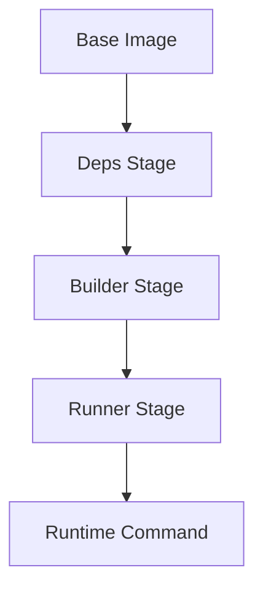
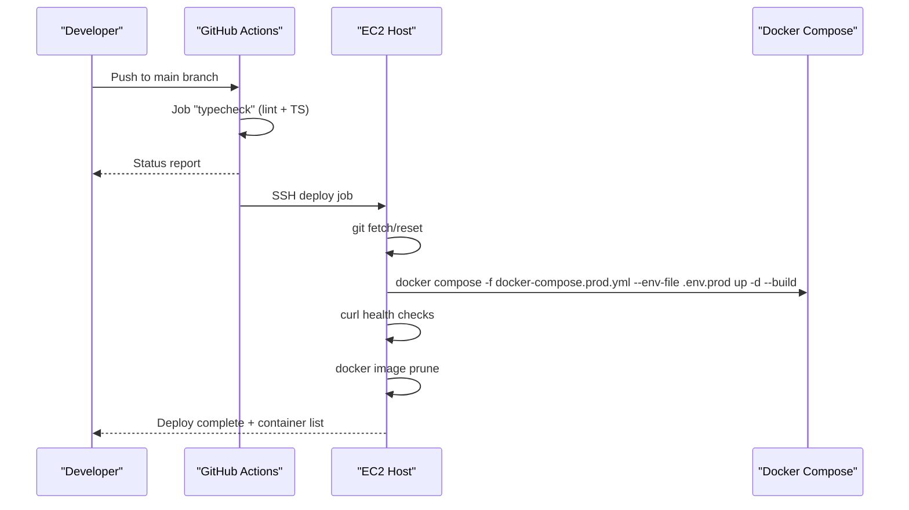
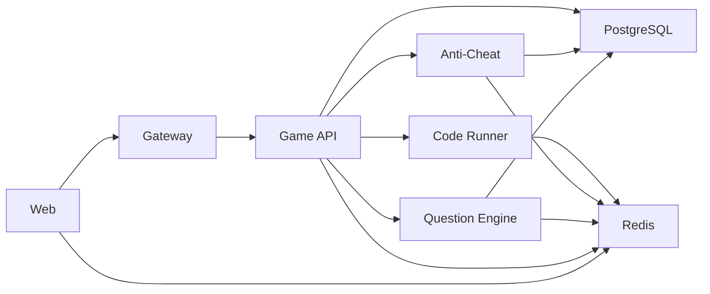

# Deployment & Operations

<cite>
**Referenced Files in This Document**
- [docker-compose.yml](file://docker-compose.yml)
- [docker-compose.prod.yml](file://docker-compose.prod.yml)
- [.env.example](file://.env.example)
- [.env](file://.env)
- [Makefile](file://Makefile)
- [.github/workflows/ci.yml](file://.github/workflows/ci.yml)
- [.github/workflows/deploy.yml](file://.github/workflows/deploy.yml)
- [apps/web/Dockerfile](file://apps/web/Dockerfile)
- [apps/game-api/Dockerfile](file://apps/game-api/Dockerfile)
- [apps/question-engine/Dockerfile](file://apps/question-engine/Dockerfile)
- [apps/anti-cheat/Dockerfile](file://apps/anti-cheat/Dockerfile)
- [apps/gateway/Dockerfile](file://apps/gateway/Dockerfile)
- [apps/code-runner/Dockerfile](file://apps/code-runner/Dockerfile)
- [package.json](file://package.json)
</cite>

## Table of Contents
1. [Introduction](#introduction)
2. [Project Structure](#project-structure)
3. [Core Components](#core-components)
4. [Architecture Overview](#architecture-overview)
5. [Detailed Component Analysis](#detailed-component-analysis)
6. [Dependency Analysis](#dependency-analysis)
7. [Performance Considerations](#performance-considerations)
8. [Troubleshooting Guide](#troubleshooting-guide)
9. [Conclusion](#conclusion)
10. [Appendices](#appendices)

## Introduction
This document provides comprehensive deployment and operations guidance for Logic Forge. It covers containerization strategy (multi-stage builds, image optimization, and service isolation), Docker Compose configurations for local development and production, CI/CD automation, monitoring and health checks, scaling, backups, and disaster recovery.

## Project Structure
Logic Forge is a monorepo orchestrated with Docker Compose. Services are defined under docker-compose.yml for local development and docker-compose.prod.yml for production. Each service has its own Dockerfile implementing multi-stage builds. Environment variables are managed via .env and .env.example, with production secrets injected via .env.prod during deployment.

**Diagram sources**
- [docker-compose.yml](file://docker-compose.yml#L1-L238)
- [docker-compose.prod.yml](file://docker-compose.prod.yml#L1-L143)

**Section sources**
- [docker-compose.yml](file://docker-compose.yml#L1-L238)
- [docker-compose.prod.yml](file://docker-compose.prod.yml#L1-L143)
- [.env.example](file://.env.example#L1-L62)
- [.env](file://.env#L1-L66)

## Core Components
- Databases
  - PostgreSQL: Core relational data and questions.
  - MongoDB: Authentication and sessions.
  - Redis: Caching and pub/sub.
- Services
  - Code Runner: Sandboxed code execution.
  - Question Engine: Challenge and seed management.
  - Anti-Cheat: Telemetry and audit.
  - Game API: HTTP and WebSocket orchestration.
  - Gateway: Single public entrypoint.
  - Web (Next.js): Frontend application.

Containerization strategy:
- Multi-stage builds per service to minimize runtime images and optimize size.
- Alpine Linux base for Node.js services; Go base for the code runner.
- Prisma client binaries copied for Alpine compatibility.
- tsx used to run TypeScript entrypoints without bundling.

Environment management:
- Local development uses .env and docker-compose.yml environment blocks.
- Production uses docker-compose.prod.yml with externalized secrets via --env-file.

**Section sources**
- [apps/web/Dockerfile](file://apps/web/Dockerfile#L1-L59)
- [apps/game-api/Dockerfile](file://apps/game-api/Dockerfile#L1-L56)
- [apps/question-engine/Dockerfile](file://apps/question-engine/Dockerfile#L1-L56)
- [apps/anti-cheat/Dockerfile](file://apps/anti-cheat/Dockerfile#L1-L53)
- [apps/gateway/Dockerfile](file://apps/gateway/Dockerfile#L1-L55)
- [apps/code-runner/Dockerfile](file://apps/code-runner/Dockerfile#L1-L31)
- [docker-compose.yml](file://docker-compose.yml#L1-L238)
- [docker-compose.prod.yml](file://docker-compose.prod.yml#L1-L143)
- [.env.example](file://.env.example#L1-L62)
- [.env](file://.env#L1-L66)

## Architecture Overview
The system uses a public network for external traffic and an internal network for service-to-service communication. The Gateway exposes port 8080 to the host and proxies to internal services. The Web container listens on 3000 and communicates with the Gateway.

**Diagram sources**
- [docker-compose.yml](file://docker-compose.yml#L157-L225)
- [docker-compose.prod.yml](file://docker-compose.prod.yml#L89-L143)

## Detailed Component Analysis

### Containerization Strategy and Multi-Stage Builds
- Next.js Web
  - Deps stage copies workspace manifests and installs dependencies.
  - Builder stage generates Prisma client and builds the app.
  - Runner stage copies standalone build artifacts and Prisma binaries, sets production runtime.
- Node.js Services (Game API, Question Engine, Anti-Cheat, Gateway)
  - Deps stage installs dependencies.
  - Builder stage generates Prisma client and compiles TS.
  - Runner stage copies built sources and runs via tsx.
- Code Runner (Go)
  - Builder stage compiles Go binary.
  - Runtime stage installs Alpine packages for supported languages and exposes port 3004.

**Diagram sources**
- [apps/web/Dockerfile](file://apps/web/Dockerfile#L1-L59)
- [apps/game-api/Dockerfile](file://apps/game-api/Dockerfile#L1-L56)
- [apps/question-engine/Dockerfile](file://apps/question-engine/Dockerfile#L1-L56)
- [apps/anti-cheat/Dockerfile](file://apps/anti-cheat/Dockerfile#L1-L53)
- [apps/gateway/Dockerfile](file://apps/gateway/Dockerfile#L1-L55)
- [apps/code-runner/Dockerfile](file://apps/code-runner/Dockerfile#L1-L31)

**Section sources**
- [apps/web/Dockerfile](file://apps/web/Dockerfile#L1-L59)
- [apps/game-api/Dockerfile](file://apps/game-api/Dockerfile#L1-L56)
- [apps/question-engine/Dockerfile](file://apps/question-engine/Dockerfile#L1-L56)
- [apps/anti-cheat/Dockerfile](file://apps/anti-cheat/Dockerfile#L1-L53)
- [apps/gateway/Dockerfile](file://apps/gateway/Dockerfile#L1-L55)
- [apps/code-runner/Dockerfile](file://apps/code-runner/Dockerfile#L1-L31)

### Docker Compose Configuration

#### Local Development (docker-compose.yml)
- Networks
  - public-net: bridge for host exposure (ports 3000, 8080).
  - internal-net: isolated bridge for service-to-service communication.
- Volumes
  - Persistent storage for PostgreSQL, MongoDB, and Redis.
- Health checks
  - PostgreSQL, MongoDB, Redis, and services include health checks for readiness.
- Dependencies
  - Services declare depends_on with conditions to ensure startup order.

Key environment variables and ports are defined per service. Inter-service URLs are configured using internal DNS names.

**Section sources**
- [docker-compose.yml](file://docker-compose.yml#L1-L238)

#### Production (docker-compose.prod.yml)
- Environment injection
  - DATABASE_URL, MONGO_URL, REDIS_URL, NEXTAUTH_SECRET, AUTH_SECRET, INTER_SERVICE_SECRET are injected via --env-file.
- Restart policy
  - unless-stopped for resilience.
- Health checks
  - Services define health checks for readiness probes.
- Ports
  - Web and Gateway expose host ports for public access.

**Section sources**
- [docker-compose.prod.yml](file://docker-compose.prod.yml#L1-L143)

### CI/CD Pipeline

**Diagram sources**
- [.github/workflows/ci.yml](file://.github/workflows/ci.yml#L1-L33)
- [.github/workflows/deploy.yml](file://.github/workflows/deploy.yml#L1-L66)

**Section sources**
- [.github/workflows/ci.yml](file://.github/workflows/ci.yml#L1-L33)
- [.github/workflows/deploy.yml](file://.github/workflows/deploy.yml#L1-L66)

### Monitoring and Health Checks
- Health checks are defined for:
  - PostgreSQL, MongoDB, Redis.
  - Question Engine, Anti-Cheat, Game API, Gateway, Web.
- Health check intervals and timeouts are tuned for fast failure detection.
- CI/CD performs manual HTTP checks against Gateway and Web after deployment.

**Section sources**
- [docker-compose.yml](file://docker-compose.yml#L14-L18)
- [docker-compose.yml](file://docker-compose.yml#L31-L35)
- [docker-compose.yml](file://docker-compose.yml#L45-L49)
- [docker-compose.yml](file://docker-compose.yml#L84-L89)
- [docker-compose.yml](file://docker-compose.yml#L112-L117)
- [docker-compose.yml](file://docker-compose.yml#L150-L155)
- [.github/workflows/deploy.yml](file://.github/workflows/deploy.yml#L57-L59)

### Service Discovery and Networking
- Internal DNS names are used for inter-service communication (e.g., game-api:3001).
- The Gateway acts as the single public entrypoint, routing to internal services.

**Section sources**
- [docker-compose.yml](file://docker-compose.yml#L125-L136)
- [docker-compose.prod.yml](file://docker-compose.prod.yml#L96-L105)

### Environment Variables and Secrets
- Local development
  - .env.example documents required variables and defaults.
  - .env holds current values and overrides for local runs.
- Production
  - docker-compose.prod.yml references variables from an external .env.prod file.
  - Secrets include database URLs, auth secrets, and inter-service tokens.

**Section sources**
- [.env.example](file://.env.example#L1-L62)
- [.env](file://.env#L1-L66)
- [docker-compose.prod.yml](file://docker-compose.prod.yml#L17-L24)
- [docker-compose.prod.yml](file://docker-compose.prod.yml#L42-L48)
- [docker-compose.prod.yml](file://docker-compose.prod.yml#L62-L68)
- [docker-compose.prod.yml](file://docker-compose.prod.yml#L122-L139)

## Dependency Analysis

**Diagram sources**
- [docker-compose.yml](file://docker-compose.yml#L190-L225)
- [docker-compose.yml](file://docker-compose.yml#L157-L188)
- [docker-compose.yml](file://docker-compose.yml#L119-L156)
- [docker-compose.yml](file://docker-compose.yml#L63-L90)
- [docker-compose.yml](file://docker-compose.yml#L91-L118)

**Section sources**
- [docker-compose.yml](file://docker-compose.yml#L1-L238)

## Performance Considerations
- Multi-stage builds reduce final image sizes and attack surface.
- Alpine-based images minimize footprint; ensure Prisma binaries are copied for Alpine compatibility.
- Use restart policies and health checks to improve reliability.
- Tune health check intervals and timeouts to balance responsiveness and resource usage.

[No sources needed since this section provides general guidance]

## Troubleshooting Guide
Common deployment issues and resolutions:
- Missing .env
  - Ensure .env exists and is populated before running docker-compose up.
  - Use the setup target to bootstrap .env from .env.example.
- Port conflicts
  - Verify host ports 3000 (Web) and 8080 (Gateway) are free.
- Database connectivity
  - Confirm DATABASE_URL, MONGO_URL, and REDIS_URL are reachable from containers.
  - Check service health checks for PostgreSQL, MongoDB, and Redis.
- Inter-service communication
  - Ensure internal DNS names are used for service URLs (e.g., http://game-api:3001).
- CI/CD failures
  - Review typecheck and lint jobs; fix TypeScript errors and lint warnings.
  - On EC2, confirm docker-compose.prod.yml and .env.prod are present and correct.

Operational commands:
- Local development
  - make docker-up to start services in detached mode.
  - make docker-down to tear down services and remove volumes.
- Production
  - docker compose -f docker-compose.prod.yml --env-file .env.prod up -d --build
  - docker compose -f docker-compose.prod.yml --env-file .env.prod logs -f <service>
  - docker image prune -f

**Section sources**
- [Makefile](file://Makefile#L32-L41)
- [docker-compose.yml](file://docker-compose.yml#L163-L164)
- [docker-compose.yml](file://docker-compose.yml#L94-L95)
- [.github/workflows/deploy.yml](file://.github/workflows/deploy.yml#L52-L65)

## Conclusion
Logic Forge’s deployment model leverages Docker Compose for local development and production, with multi-stage builds ensuring optimized and secure images. CI/CD automates typechecking and deployment to EC2, while health checks and restart policies support reliability. Proper environment management, networking, and monitoring practices enable scalable and maintainable operations.

[No sources needed since this section summarizes without analyzing specific files]

## Appendices

### Environment Variable Reference

- Database connections
  - DATABASE_URL: PostgreSQL connection string.
  - MONGO_URL: MongoDB connection string.
  - REDIS_URL: Redis connection string.
- Authentication
  - NEXTAUTH_URL: Web application URL.
  - NEXTAUTH_SECRET: Session encryption secret.
  - AUTH_SECRET: Additional auth secret for production.
- OAuth providers
  - GOOGLE_CLIENT_ID, GOOGLE_CLIENT_SECRET
  - GITHUB_ID, GITHUB_SECRET
- Service configuration
  - NODE_ENV: development/test/production.
  - PORT_*: Service-specific ports.
  - QUESTION_ENGINE_URL, ANTI_CHEAT_URL, CODE_RUNNER_URL, GAME_API_URL: Internal service URLs.
  - GATEWAY_URL: Public gateway URL.
  - INTER_SERVICE_SECRET: Shared secret for inter-service requests.
- Public URLs for frontend
  - NEXT_PUBLIC_GAME_API_URL, NEXT_PUBLIC_GAME_WS_URL, NEXT_PUBLIC_APP_URL

**Section sources**
- [.env.example](file://.env.example#L1-L62)
- [.env](file://.env#L1-L66)
- [docker-compose.yml](file://docker-compose.yml#L202-L217)
- [docker-compose.prod.yml](file://docker-compose.prod.yml#L122-L139)

### Scaling Strategies
- Horizontal scaling
  - Stateless services (Web, Gateway, Question Engine, Anti-Cheat) can be replicated behind a load balancer.
  - Ensure shared state resides in PostgreSQL, MongoDB, and Redis.
- Resource allocation
  - Assign CPU/memory limits per service in docker-compose.prod.yml.
- Caching and pub/sub
  - Scale Redis for caching and pub/sub workloads.

[No sources needed since this section provides general guidance]

### Backup Procedures
- PostgreSQL
  - Schedule logical backups using pg_dump and store offsite.
- MongoDB
  - Use mongodump for logical backups.
- Redis
  - Enable RDB snapshots or AOF persistence; back up snapshot files.
- Persistent volumes
  - Back up docker named volumes (postgres_data, mongo_data, redis_data).

[No sources needed since this section provides general guidance]

### Disaster Recovery Planning
- Restore from backups
  - Test restore procedures regularly; validate data consistency.
- Multi-region deployments
  - Replicate databases across regions; configure failover for Redis.
- Rollback strategy
  - Maintain previous container images and docker-compose configs for quick rollback.

[No sources needed since this section provides general guidance]