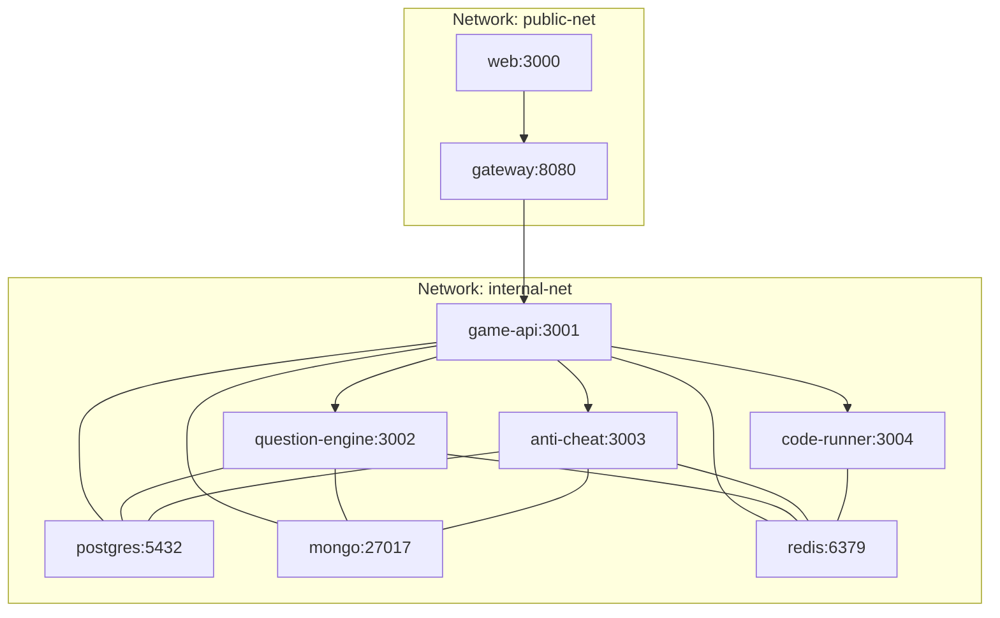
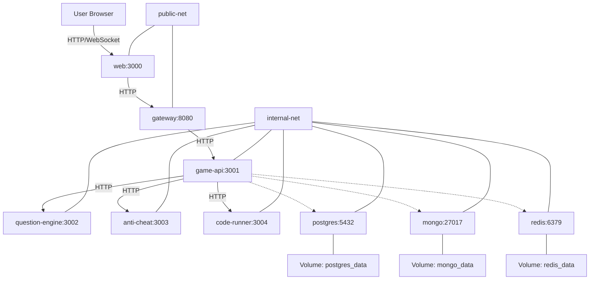
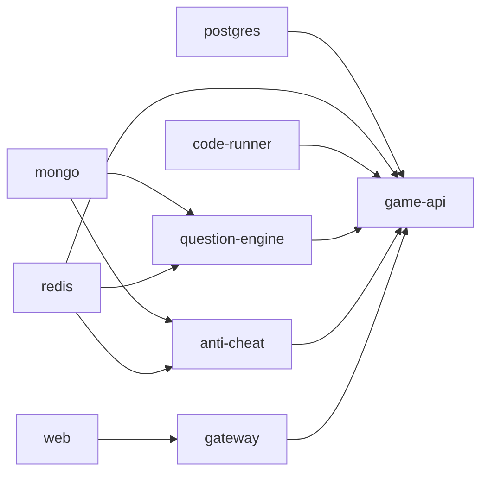

# Docker Containerization

<cite>
**Referenced Files in This Document**
- [docker-compose.yml](file://docker-compose.yml)
- [docker-compose.prod.yml](file://docker-compose.prod.yml)
- [.env](file://.env)
- [.env.example](file://.env.example)
- [.dockerignore](file://.dockerignore)
- [Makefile](file://Makefile)
- [apps/web/Dockerfile](file://apps/web/Dockerfile)
- [apps/game-api/Dockerfile](file://apps/game-api/Dockerfile)
- [apps/gateway/Dockerfile](file://apps/gateway/Dockerfile)
- [apps/anti-cheat/Dockerfile](file://apps/anti-cheat/Dockerfile)
- [apps/question-engine/Dockerfile](file://apps/question-engine/Dockerfile)
- [apps/code-runner/Dockerfile](file://apps/code-runner/Dockerfile)
- [apps/web/package.json](file://apps/web/package.json)
- [apps/game-api/package.json](file://apps/game-api/package.json)
- [apps/gateway/package.json](file://apps/gateway/package.json)
</cite>

## Table of Contents
1. [Introduction](#introduction)
2. [Project Structure](#project-structure)
3. [Core Components](#core-components)
4. [Architecture Overview](#architecture-overview)
5. [Detailed Component Analysis](#detailed-component-analysis)
6. [Dependency Analysis](#dependency-analysis)
7. [Performance Considerations](#performance-considerations)
8. [Troubleshooting Guide](#troubleshooting-guide)
9. [Conclusion](#conclusion)
10. [Appendices](#appendices)

## Introduction
This document describes the Docker containerization strategy for Logic Forge. It covers the multi-stage Docker build process for each microservice, base image selection, dependency installation, and optimization techniques. It also documents container networking, service discovery, inter-container communication, persistent volume management for PostgreSQL, MongoDB, and Redis, environment variable configuration, health checks, service dependencies, and practical examples for building, running, and troubleshooting containers. Security considerations, resource limits, and container orchestration patterns are addressed to support local development and production deployments.

## Project Structure
Logic Forge uses a monorepo with multiple microservices and a shared database stack. Docker Compose orchestrates services across two networks:
- public-net: bridge network for external exposure (port mappings)
- internal-net: bridge network for inter-service communication

Key services:
- Databases: PostgreSQL, MongoDB, Redis
- Microservices: web, game-api, gateway, anti-cheat, question-engine, code-runner
- Persistent volumes: postgres_data, mongo_data, redis_data

**Diagram sources**
- [docker-compose.yml](file://docker-compose.yml#L1-L238)

**Section sources**
- [docker-compose.yml](file://docker-compose.yml#L1-L238)

## Core Components
- PostgreSQL: Core relational data and questions
- MongoDB: Authentication and user sessions
- Redis: Caching, rate limiting, and real-time pub/sub
- web: Next.js frontend
- game-api: HTTP and WebSocket API with Express and Socket.IO
- gateway: Reverse proxy and single entry point
- anti-cheat: Telemetry and risk scoring
- question-engine: Challenge and seed management
- code-runner: Secure code execution sandbox

Environment variables are configured via .env and .env.example, and passed into services at runtime. Health checks ensure readiness across services.

**Section sources**
- [docker-compose.yml](file://docker-compose.yml#L1-L238)
- [.env](file://.env#L1-L66)
- [.env.example](file://.env.example#L1-L62)

## Architecture Overview
The system runs on a two-network model:
- public-net exposes gateway and web to the host
- internal-net enables secure inter-service communication

Services depend on databases and each other as defined by depends_on conditions and health checks. The gateway proxies traffic to internal services, while the web communicates with the gateway.

**Diagram sources**
- [docker-compose.yml](file://docker-compose.yml#L1-L238)

**Section sources**
- [docker-compose.yml](file://docker-compose.yml#L1-L238)

## Detailed Component Analysis

### Multi-Stage Docker Builds

#### web
- Base: node:20-alpine
- Stages:
  - deps: installs workspace dependencies with pnpm
  - builder: copies workspace packages and builds Next.js app
  - runner: minimal runtime with standalone Next.js output and Prisma binaries
- Optimizations:
  - Uses .dockerignore to exclude unnecessary files
  - Copies only required Prisma binaries for Alpine musl
  - Exposes port 3000
- Entrypoint: node apps/web/server.js

**Section sources**
- [apps/web/Dockerfile](file://apps/web/Dockerfile#L1-L59)
- [.dockerignore](file://.dockerignore#L1-L25)
- [apps/web/package.json](file://apps/web/package.json#L1-L116)

#### game-api
- Base: node:20-alpine
- Stages:
  - deps: installs dependencies for game-api and shared packages
  - builder: copies sources and runs Prisma generation (with a dummy DATABASE_URL)
  - runner: production runtime using tsx to execute TypeScript entry
- Optimizations:
  - Minimal copy of compiled artifacts
  - Exposes port 3001
- Entrypoint: pnpm exec tsx src/index.ts

**Section sources**
- [apps/game-api/Dockerfile](file://apps/game-api/Dockerfile#L1-L56)
- [apps/game-api/package.json](file://apps/game-api/package.json#L1-L32)

#### gateway
- Base: node:20-alpine
- Stages:
  - deps: installs dependencies for gateway and shared packages
  - builder: compiles TypeScript to dist
  - runner: production runtime using tsx to execute TypeScript entry
- Optimizations:
  - Minimal build artifacts
  - Exposes port 8080
- Entrypoint: pnpm exec tsx src/index.ts

**Section sources**
- [apps/gateway/Dockerfile](file://apps/gateway/Dockerfile#L1-L55)
- [apps/gateway/package.json](file://apps/gateway/package.json#L1-L33)

#### anti-cheat
- Base: node:20-alpine
- Stages:
  - deps: installs dependencies for anti-cheat and shared packages
  - builder: copies sources and runs Prisma generation (with a dummy DATABASE_URL)
  - runner: production runtime using tsx to execute TypeScript entry
- Optimizations:
  - Minimal copy of compiled artifacts
  - Exposes port 3003
- Entrypoint: pnpm exec tsx src/index.ts

**Section sources**
- [apps/anti-cheat/Dockerfile](file://apps/anti-cheat/Dockerfile#L1-L53)

#### question-engine
- Base: node:20-alpine
- Stages:
  - deps: installs dependencies for question-engine and shared packages
  - builder: copies sources and runs Prisma generation (with a dummy DATABASE_URL)
  - runner: production runtime using tsx to execute TypeScript entry
- Optimizations:
  - Minimal copy of compiled artifacts
  - Exposes port 3002
- Entrypoint: pnpm exec tsx src/index.ts

**Section sources**
- [apps/question-engine/Dockerfile](file://apps/question-engine/Dockerfile#L1-L56)

#### code-runner
- Base: golang:1.22-alpine (builder)
- Stages:
  - builder: downloads Go modules, tidies, and builds the Go binary
  - runner: minimal Alpine runtime with installed language runtimes and compilers
- Optimizations:
  - Installs Python, Java JDK/JRE, G++, Bash in the final image
  - Creates a sandbox directory with broad permissions for execution
  - Exposes port 3004
- Entrypoint: ./code-runner

**Section sources**
- [apps/code-runner/Dockerfile](file://apps/code-runner/Dockerfile#L1-L31)

### Container Networking Strategy
- Networks:
  - public-net: bridge network for host exposure (ports 3000, 8080)
  - internal-net: bridge network with internal=true for service-to-service communication
- Service discovery:
  - Services communicate using service names as hostnames (e.g., game-api:3001)
- Inter-container communication:
  - web ↔ gateway (HTTP)
  - gateway ↔ game-api (HTTP)
  - game-api ↔ question-engine, anti-cheat, code-runner (HTTP)
  - game-api, question-engine, anti-cheat ↔ postgres, mongo, redis (HTTP/connections)

**Section sources**
- [docker-compose.yml](file://docker-compose.yml#L233-L238)

### Volume Management
Persistent volumes are declared for each datastore:
- postgres_data: PostgreSQL data directory
- mongo_data: MongoDB data directory
- redis_data: Redis data directory

Volumes ensure data persists across container recreation.

**Section sources**
- [docker-compose.yml](file://docker-compose.yml#L228-L232)

### Environment Variable Configuration
- Local development:
  - .env defines DATABASE_URL, MONGO_URL, REDIS_URL, NEXTAUTH_* variables, OAuth providers, service URLs, ports, and NODE_ENV
  - .env.example documents the same variables with placeholders
- Docker Compose:
  - Services pass environment variables to containers (e.g., DATABASE_URL, MONGO_URL, REDIS_URL, NEXTAUTH_SECRET, INTER_SERVICE_SECRET)
  - Production compose uses environment variables from the host for DATABASE_URL, MONGO_URL, REDIS_URL
- Build-time variables:
  - web Dockerfile accepts NEXT_PUBLIC_* arguments and sets them at runtime

**Section sources**
- [.env](file://.env#L1-L66)
- [.env.example](file://.env.example#L1-L62)
- [docker-compose.yml](file://docker-compose.yml#L69-L76)
- [docker-compose.prod.yml](file://docker-compose.prod.yml#L17-L24)

### Health Checks Implementation
- postgres: healthcheck using pg_isready
- mongo: healthcheck using mongosh ping
- redis: healthcheck using redis-cli ping
- question-engine: healthcheck GET /api/v1/health
- anti-cheat: healthcheck GET /api/health
- game-api: healthcheck GET /api/v1/health

Health checks define intervals, timeouts, retries, and start periods to ensure services are ready before dependent services start.

**Section sources**
- [docker-compose.yml](file://docker-compose.yml#L14-L18)
- [docker-compose.yml](file://docker-compose.yml#L31-L35)
- [docker-compose.yml](file://docker-compose.yml#L45-L49)
- [docker-compose.yml](file://docker-compose.yml#L84-L89)
- [docker-compose.yml](file://docker-compose.yml#L112-L117)
- [docker-compose.yml](file://docker-compose.yml#L150-L155)

### Service Dependencies
- question-engine depends_on mongo and redis (healthy)
- anti-cheat depends_on postgres and redis (healthy)
- game-api depends_on postgres, redis, question-engine (healthy), code-runner (started), anti-cheat (healthy)
- gateway depends_on game-api, question-engine, anti-cheat, code-runner (started), redis (healthy)
- web depends_on gateway (started) and postgres (healthy)

**Section sources**
- [docker-compose.yml](file://docker-compose.yml#L77-L83)
- [docker-compose.yml](file://docker-compose.yml#L105-L111)
- [docker-compose.yml](file://docker-compose.yml#L137-L147)
- [docker-compose.yml](file://docker-compose.yml#L175-L185)
- [docker-compose.yml](file://docker-compose.yml#L218-L222)

### Building, Running, and Troubleshooting Containers
- Local development:
  - make setup creates .env from .env.example if missing
  - make docker-up starts services in detached mode using docker-compose
  - make docker-down stops and removes containers
  - make clean removes containers, volumes, and node_modules
- Production:
  - docker-compose.prod.yml defines production-ready environment variables and restart policies
- Troubleshooting:
  - Check service logs via docker-compose logs <service>
  - Verify health checks with docker-compose ps
  - Confirm network connectivity using service names as hostnames
  - Inspect volumes with docker volume ls and docker volume inspect

**Section sources**
- [Makefile](file://Makefile#L1-L55)
- [docker-compose.yml](file://docker-compose.yml#L32-L41)
- [docker-compose.prod.yml](file://docker-compose.prod.yml#L1-L143)

## Dependency Analysis
The following diagram shows service dependencies and health-check-driven startup ordering:

**Diagram sources**
- [docker-compose.yml](file://docker-compose.yml#L77-L83)
- [docker-compose.yml](file://docker-compose.yml#L105-L111)
- [docker-compose.yml](file://docker-compose.yml#L137-L147)
- [docker-compose.yml](file://docker-compose.yml#L175-L185)
- [docker-compose.yml](file://docker-compose.yml#L218-L222)

**Section sources**
- [docker-compose.yml](file://docker-compose.yml#L77-L83)
- [docker-compose.yml](file://docker-compose.yml#L105-L111)
- [docker-compose.yml](file://docker-compose.yml#L137-L147)
- [docker-compose.yml](file://docker-compose.yml#L175-L185)
- [docker-compose.yml](file://docker-compose.yml#L218-L222)

## Performance Considerations
- Image size and attack surface:
  - Alpine Linux base images reduce footprint and vulnerability exposure
  - Multi-stage builds minimize final image contents
- Build caching:
  - .dockerignore excludes node_modules, .next, dist, and other build artifacts to improve cache hits
- Runtime efficiency:
  - Next.js standalone output reduces cold-start overhead for web
  - tsx runtime avoids bundling for development-like execution in production stages
- Resource allocation:
  - Consider adding CPU and memory limits in production deployments
  - Use separate containers per service to isolate resource usage

[No sources needed since this section provides general guidance]

## Troubleshooting Guide
Common issues and resolutions:
- Health check failures:
  - Verify database credentials and connection strings in environment variables
  - Ensure depends_on conditions align with healthcheck timing
- Network connectivity:
  - Confirm service names are used as hostnames inside internal-net
  - Check that ports are mapped correctly in public-net
- Data persistence:
  - Confirm volumes are attached and not removed unintentionally
- Build errors:
  - Ensure pnpm lockfiles and workspace manifests are present during deps stage
  - For Prisma, confirm DATABASE_URL is available during generation or use a dummy value during build as shown in service Dockerfiles

**Section sources**
- [docker-compose.yml](file://docker-compose.yml#L14-L18)
- [docker-compose.yml](file://docker-compose.yml#L31-L35)
- [docker-compose.yml](file://docker-compose.yml#L45-L49)
- [docker-compose.yml](file://docker-compose.yml#L84-L89)
- [docker-compose.yml](file://docker-compose.yml#L112-L117)
- [docker-compose.yml](file://docker-compose.yml#L150-L155)
- [apps/game-api/Dockerfile](file://apps/game-api/Dockerfile#L42-L44)
- [apps/anti-cheat/Dockerfile](file://apps/anti-cheat/Dockerfile#L38-L40)
- [apps/question-engine/Dockerfile](file://apps/question-engine/Dockerfile#L42-L44)

## Conclusion
Logic Forge’s Docker strategy leverages multi-stage builds, Alpine-based images, and a two-network architecture to achieve efficient, secure, and maintainable microservice deployment. Environment variables, health checks, and explicit service dependencies ensure predictable startup and operation. Persistent volumes safeguard critical data, while the gateway centralizes ingress for simplified client access. The provided Makefile and Compose configurations streamline local development and production readiness.

[No sources needed since this section summarizes without analyzing specific files]

## Appendices

### Environment Variables Reference
- Database connections:
  - DATABASE_URL (PostgreSQL)
  - MONGO_URL (MongoDB)
  - REDIS_URL (Redis)
- Authentication:
  - NEXTAUTH_URL, NEXTAUTH_SECRET, AUTH_SECRET
  - OAuth providers: GOOGLE_CLIENT_ID/SECRET, GITHUB_ID/SECRET
- Service URLs and ports:
  - GATEWAY_URL, NEXT_PUBLIC_* URLs, PORT_* variables
- Inter-service:
  - INTER_SERVICE_SECRET

**Section sources**
- [.env](file://.env#L1-L66)
- [.env.example](file://.env.example#L1-L62)

### Production Deployment Notes
- Use docker-compose.prod.yml for production builds
- Supply DATABASE_URL, MONGO_URL, REDIS_URL, NEXTAUTH_SECRET, AUTH_SECRET, and provider secrets via environment
- Enable restart policies and monitor health checks
- Consider adding resource limits and secrets management

**Section sources**
- [docker-compose.prod.yml](file://docker-compose.prod.yml#L1-L143)