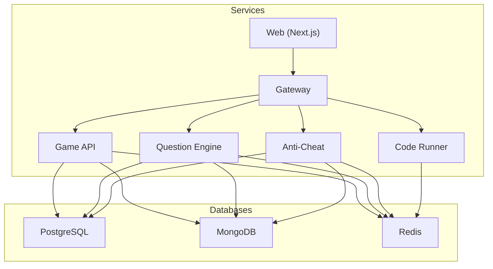
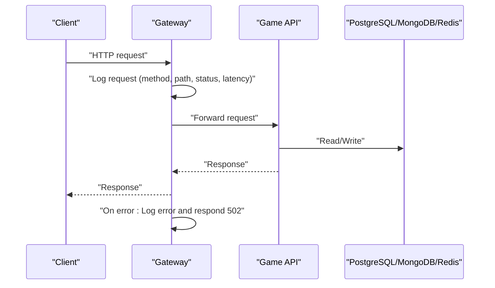
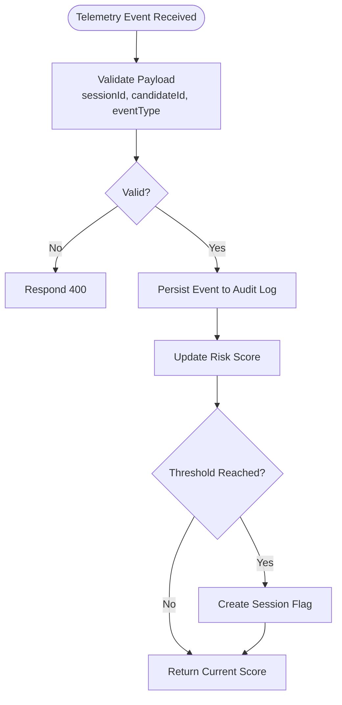
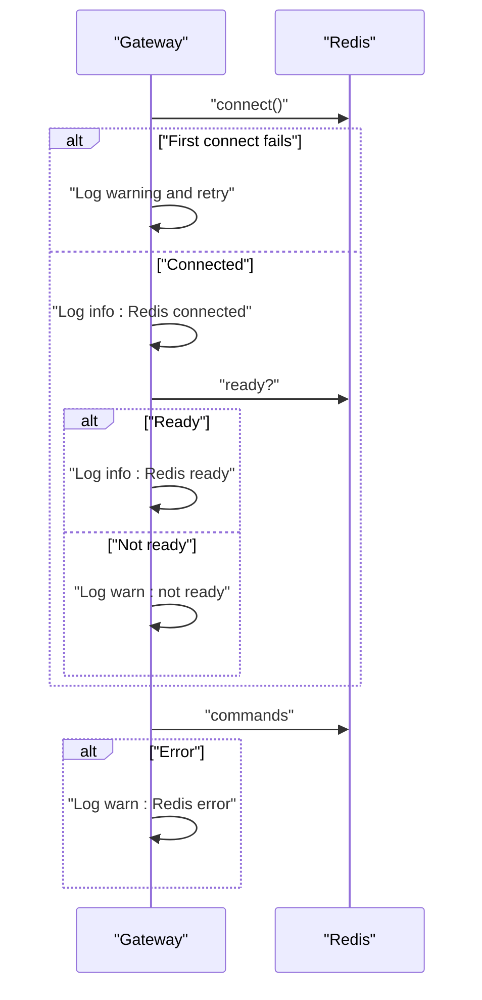
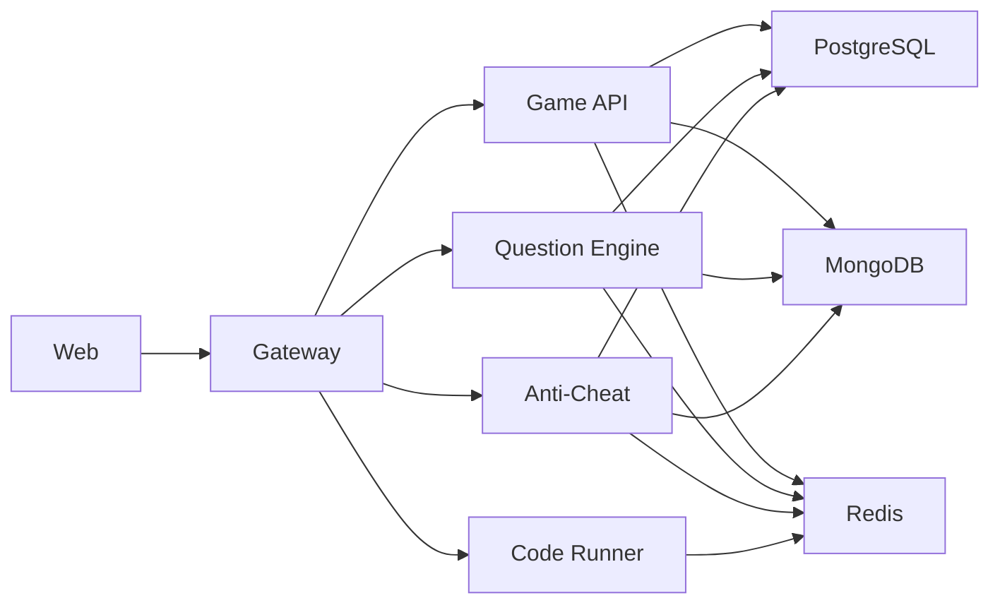

# Monitoring & Observability

<cite>
**Referenced Files in This Document**
- [docker-compose.yml](file://docker-compose.yml)
- [docker-compose.prod.yml](file://docker-compose.prod.yml)
- [.env.example](file://.env.example)
- [packages/logger/src/index.ts](file://packages/logger/src/index.ts)
- [apps/gateway/src/logger.ts](file://apps/gateway/src/logger.ts)
- [apps/gateway/src/middleware/logger.ts](file://apps/gateway/src/middleware/logger.ts)
- [apps/gateway/src/proxy.ts](file://apps/gateway/src/proxy.ts)
- [apps/gateway/src/redis.ts](file://apps/gateway/src/redis.ts)
- [apps/game-api/src/app.ts](file://apps/game-api/src/app.ts)
- [apps/question-engine/src/routes/health.routes.ts](file://apps/question-engine/src/routes/health.routes.ts)
- [apps/anti-cheat/src/handlers/telemetry.handler.ts](file://apps/anti-cheat/src/handlers/telemetry.handler.ts)
- [apps/anti-cheat/src/services/audit-log.service.ts](file://apps/anti-cheat/src/services/audit-log.service.ts)
- [apps/anti-cheat/src/services/risk-scoring.service.ts](file://apps/anti-cheat/src/services/risk-scoring.service.ts)
- [apps/anti-cheat/src/api/routes.ts](file://apps/anti-cheat/src/api/routes.ts)
</cite>

## Table of Contents
1. [Introduction](#introduction)
2. [Project Structure](#project-structure)
3. [Core Components](#core-components)
4. [Architecture Overview](#architecture-overview)
5. [Detailed Component Analysis](#detailed-component-analysis)
6. [Dependency Analysis](#dependency-analysis)
7. [Performance Considerations](#performance-considerations)
8. [Troubleshooting Guide](#troubleshooting-guide)
9. [Conclusion](#conclusion)
10. [Appendices](#appendices)

## Introduction
This document provides comprehensive monitoring and observability guidance for Logic Forge deployments. It covers health checks across databases (PostgreSQL, MongoDB), Redis, and microservices, outlines logging strategies for containers and applications, and describes how to set up container health monitoring, service availability checks, and performance insights. It also includes practical commands for inspecting logs and health, and guidance for interpreting observability data to support operational decisions.

## Project Structure
Logic Forge is a multi-service application orchestrated via Docker Compose. The stack includes:
- Databases: PostgreSQL and MongoDB
- Caching: Redis
- Microservices: Gateway, Web, Game API, Question Engine, Anti-Cheat, and Code Runner
- Centralized logging via a shared logger package

**Diagram sources**
- [docker-compose.yml](file://docker-compose.yml#L1-L238)
- [docker-compose.prod.yml](file://docker-compose.prod.yml#L1-L143)

**Section sources**
- [docker-compose.yml](file://docker-compose.yml#L1-L238)
- [docker-compose.prod.yml](file://docker-compose.prod.yml#L1-L143)

## Core Components
- Container health checks: Implemented at the Docker Compose level for databases and services.
- Application health endpoints: Services expose lightweight GET health endpoints.
- Structured logging: A shared logger package produces structured logs with consistent fields and serializers.
- Gateway observability: Centralized request logging, proxy error logging, and Redis connectivity logging.

Key implementation references:
- Health checks in Compose files
- Health endpoints in services
- Structured logger creation and child logger helpers
- Gateway request and proxy logging

**Section sources**
- [docker-compose.yml](file://docker-compose.yml#L14-L18)
- [docker-compose.yml](file://docker-compose.yml#L31-L35)
- [docker-compose.yml](file://docker-compose.yml#L45-L49)
- [docker-compose.yml](file://docker-compose.yml#L84-L89)
- [docker-compose.yml](file://docker-compose.yml#L112-L117)
- [docker-compose.yml](file://docker-compose.yml#L150-L155)
- [apps/game-api/src/app.ts](file://apps/game-api/src/app.ts#L28-L31)
- [apps/question-engine/src/routes/health.routes.ts](file://apps/question-engine/src/routes/health.routes.ts#L5-L8)
- [packages/logger/src/index.ts](file://packages/logger/src/index.ts#L19-L50)
- [apps/gateway/src/logger.ts](file://apps/gateway/src/logger.ts#L1-L6)
- [apps/gateway/src/middleware/logger.ts](file://apps/gateway/src/middleware/logger.ts#L5-L24)
- [apps/gateway/src/proxy.ts](file://apps/gateway/src/proxy.ts#L29-L38)

## Architecture Overview
The observability architecture combines container-level health checks with application-level health endpoints and structured logging. The Gateway centralizes traffic and logs all requests and proxy errors. Redis connectivity is monitored and logged to detect transient failures.

**Diagram sources**
- [apps/gateway/src/middleware/logger.ts](file://apps/gateway/src/middleware/logger.ts#L10-L21)
- [apps/gateway/src/proxy.ts](file://apps/gateway/src/proxy.ts#L29-L38)
- [apps/game-api/src/app.ts](file://apps/game-api/src/app.ts#L28-L31)

## Detailed Component Analysis

### Container Health Checks
- PostgreSQL: healthcheck uses pg_isready with short intervals and retries.
- MongoDB: healthcheck runs a ping command against mongosh.
- Redis: healthcheck pings the Redis CLI.
- Services: healthcheck performs HTTP GET to the service’s health endpoint.

Operational guidance:
- Use docker compose ps to inspect container health statuses.
- Use docker inspect to review healthcheck configuration and last output.
- For production, adjust intervals/timeouts/retries per environment.

**Section sources**
- [docker-compose.yml](file://docker-compose.yml#L14-L18)
- [docker-compose.yml](file://docker-compose.yml#L31-L35)
- [docker-compose.yml](file://docker-compose.yml#L45-L49)
- [docker-compose.yml](file://docker-compose.yml#L84-L89)
- [docker-compose.yml](file://docker-compose.yml#L112-L117)
- [docker-compose.yml](file://docker-compose.yml#L150-L155)

### Application Health Endpoints
- Game API: GET /api/v1/health returns service status.
- Question Engine: GET /api/v1/health returns service status.

Usage examples:
- curl http://localhost:3001/api/v1/health
- curl http://localhost:3002/api/v1/health

**Section sources**
- [apps/game-api/src/app.ts](file://apps/game-api/src/app.ts#L28-L31)
- [apps/question-engine/src/routes/health.routes.ts](file://apps/question-engine/src/routes/health.routes.ts#L5-L8)

### Logging Strategy
- Structured logging: The shared logger sets service and environment defaults, pretty-prints in development, and serializes errors/requests/responses.
- Child loggers: Add contextual fields (e.g., userId, requestId) to narrow down logs.
- Gateway logging: Logs all requests with method, path, status, response time, and optional userId.
- Proxy logging: Logs proxy errors and responds with a standardized 502 body.

Practical tips:
- Filter by service field to isolate logs per service.
- Use responseTimeMs to identify slow endpoints.
- Correlate proxy errors with upstream service health.

**Section sources**
- [packages/logger/src/index.ts](file://packages/logger/src/index.ts#L19-L50)
- [apps/gateway/src/logger.ts](file://apps/gateway/src/logger.ts#L1-L6)
- [apps/gateway/src/middleware/logger.ts](file://apps/gateway/src/middleware/logger.ts#L5-L24)
- [apps/gateway/src/proxy.ts](file://apps/gateway/src/proxy.ts#L29-L38)

### Telemetry and Risk Scoring Observability
Anti-Cheat service ingests telemetry events, persists them, updates risk scores, and optionally flags sessions. This pipeline is observable via:
- Audit log persistence
- Risk score updates
- Session flag creation

**Diagram sources**
- [apps/anti-cheat/src/api/routes.ts](file://apps/anti-cheat/src/api/routes.ts#L44-L82)
- [apps/anti-cheat/src/services/audit-log.service.ts](file://apps/anti-cheat/src/services/audit-log.service.ts#L4-L18)
- [apps/anti-cheat/src/services/risk-scoring.service.ts](file://apps/anti-cheat/src/services/risk-scoring.service.ts#L18-L75)

**Section sources**
- [apps/anti-cheat/src/handlers/telemetry.handler.ts](file://apps/anti-cheat/src/handlers/telemetry.handler.ts#L30-L51)
- [apps/anti-cheat/src/api/routes.ts](file://apps/anti-cheat/src/api/routes.ts#L44-L82)
- [apps/anti-cheat/src/services/audit-log.service.ts](file://apps/anti-cheat/src/services/audit-log.service.ts#L4-L18)
- [apps/anti-cheat/src/services/risk-scoring.service.ts](file://apps/anti-cheat/src/services/risk-scoring.service.ts#L18-L75)

### Redis Connectivity Observability
Gateway maintains a Redis client with explicit connection lifecycle logging and a readiness gate. It logs connect/ready/error/close events and exposes a function to check readiness.

**Diagram sources**
- [apps/gateway/src/redis.ts](file://apps/gateway/src/redis.ts#L9-L52)

**Section sources**
- [apps/gateway/src/redis.ts](file://apps/gateway/src/redis.ts#L9-L52)

## Dependency Analysis
The services depend on databases and Redis. Compose enforces startup order and health conditions. The Gateway proxies to downstream services and centralizes logging.

**Diagram sources**
- [docker-compose.yml](file://docker-compose.yml#L137-L147)
- [docker-compose.yml](file://docker-compose.yml#L175-L183)
- [docker-compose.prod.yml](file://docker-compose.prod.yml#L74-L80)

**Section sources**
- [docker-compose.yml](file://docker-compose.yml#L77-L81)
- [docker-compose.yml](file://docker-compose.yml#L105-L109)
- [docker-compose.yml](file://docker-compose.yml#L137-L147)
- [docker-compose.yml](file://docker-compose.yml#L175-L183)
- [docker-compose.prod.yml](file://docker-compose.prod.yml#L25-L28)
- [docker-compose.prod.yml](file://docker-compose.prod.yml#L49-L55)
- [docker-compose.prod.yml](file://docker-compose.prod.yml#L74-L80)
- [docker-compose.prod.yml](file://docker-compose.prod.yml#L106-L109)

## Performance Considerations
- Use responseTimeMs from Gateway request logs to identify slow endpoints and correlate with upstream service health.
- Monitor Redis readiness to prevent rate-limiting failures during transient outages.
- Adjust healthcheck intervals/timeouts based on environment characteristics (local vs. production).
- In production, ensure restart policies and resource limits are configured to maintain resilience.

[No sources needed since this section provides general guidance]

## Troubleshooting Guide
Common scenarios and steps:
- Service not healthy
  - Check container health: docker compose ps
  - Inspect healthcheck: docker inspect <service> | jq '.[].State.Health'
  - Review service logs: docker compose logs <service>
- Gateway proxy errors
  - Look for proxy error logs in Gateway logs
  - Verify upstream service health endpoints
- Redis connectivity issues
  - Confirm Redis readiness via Gateway logs
  - Check Redis healthcheck status
- Telemetry ingestion problems
  - Validate payload fields and event type
  - Inspect audit log persistence and risk score updates

Example commands:
- docker compose ps
- docker compose logs game-api
- docker compose logs gateway
- curl http://localhost:3001/api/v1/health
- curl http://localhost:3002/api/v1/health

**Section sources**
- [docker-compose.yml](file://docker-compose.yml#L84-L89)
- [docker-compose.yml](file://docker-compose.yml#L112-L117)
- [docker-compose.yml](file://docker-compose.yml#L150-L155)
- [apps/gateway/src/proxy.ts](file://apps/gateway/src/proxy.ts#L29-L38)
- [apps/gateway/src/redis.ts](file://apps/gateway/src/redis.ts#L22-L40)
- [apps/anti-cheat/src/api/routes.ts](file://apps/anti-cheat/src/api/routes.ts#L44-L82)

## Conclusion
Logic Forge’s observability relies on robust container health checks, lightweight application health endpoints, and structured logging across services. The Gateway centralizes request and proxy observability, while Redis connectivity is explicitly monitored. Together, these components provide a strong foundation for monitoring, alerting, and troubleshooting. Extend this baseline with centralized log aggregation, metrics collection, and dashboards as part of your operational platform.

[No sources needed since this section summarizes without analyzing specific files]

## Appendices

### Environment Variables for Connectivity
- DATABASE_URL: PostgreSQL connection string
- MONGO_URL: MongoDB connection string
- REDIS_URL: Redis connection string
- NEXTAUTH_SECRET: Authentication secret
- INTER_SERVICE_SECRET: Inter-service auth secret

**Section sources**
- [.env.example](file://.env.example#L5-L14)
- [.env.example](file://.env.example#L23-L24)
- [.env.example](file://.env.example#L61-L62)