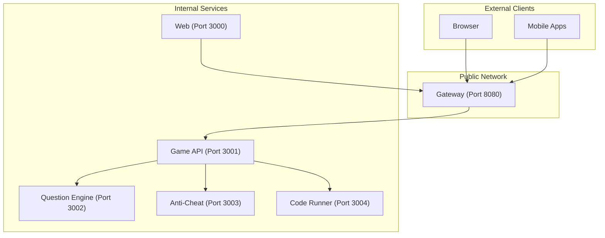
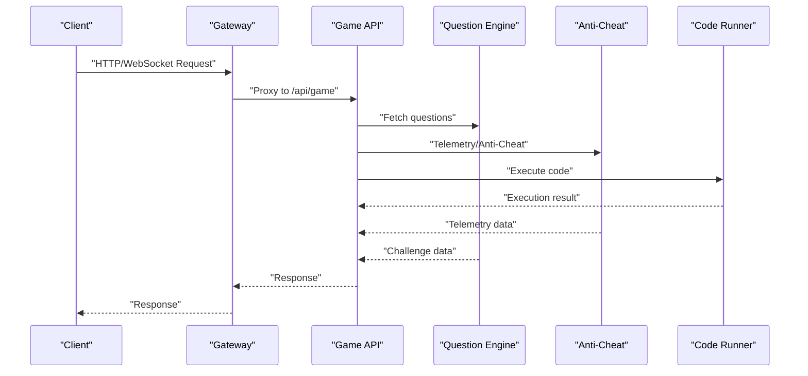
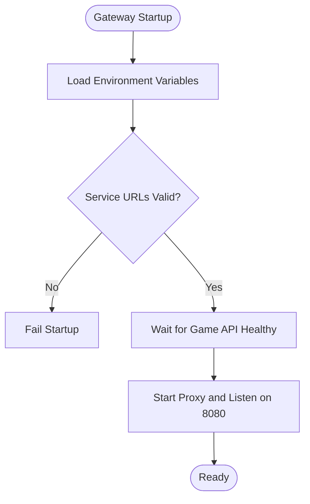
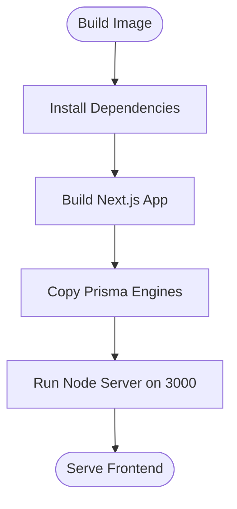
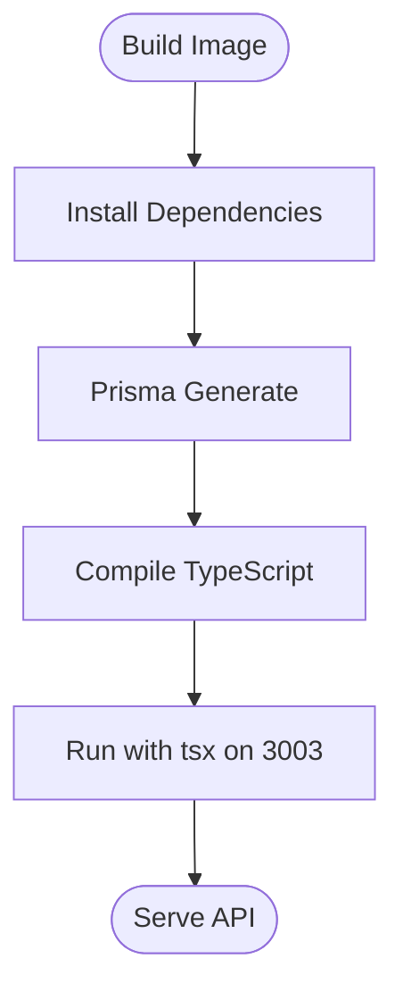
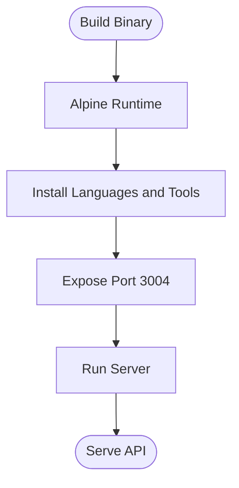
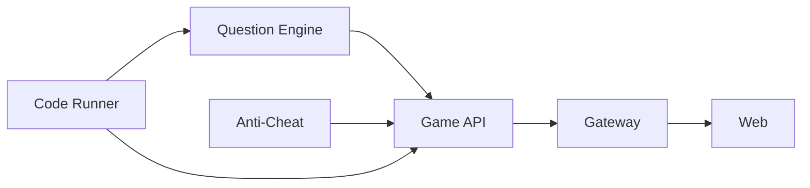

# Production Deployment

<cite>
**Referenced Files in This Document**
- [docker-compose.prod.yml](file://docker-compose.prod.yml)
- [docker-compose.yml](file://docker-compose.yml)
- [.env](file://.env)
- [.env.example](file://.env.example)
- [apps/web/Dockerfile](file://apps/web/Dockerfile)
- [apps/gateway/Dockerfile](file://apps/gateway/Dockerfile)
- [apps/game-api/Dockerfile](file://apps/game-api/Dockerfile)
- [apps/anti-cheat/Dockerfile](file://apps/anti-cheat/Dockerfile)
- [apps/question-engine/Dockerfile](file://apps/question-engine/Dockerfile)
- [apps/code-runner/Dockerfile](file://apps/code-runner/Dockerfile)
- [apps/web/.env](file://apps/web/.env)
- [apps/web/.env.example](file://apps/web/.env.example)
- [apps/game-api/.env](file://apps/game-api/.env)
- [apps/game-api/.env.example](file://apps/game-api/.env.example)
- [apps/anti-cheat/.env.example](file://apps/anti-cheat/.env.example)
- [apps/question-engine/.env](file://apps/question-engine/.env)
- [apps/question-engine/.env.example](file://apps/question-engine/.env.example)
</cite>

## Table of Contents
1. [Introduction](#introduction)
2. [Project Structure](#project-structure)
3. [Core Components](#core-components)
4. [Architecture Overview](#architecture-overview)
5. [Detailed Component Analysis](#detailed-component-analysis)
6. [Dependency Analysis](#dependency-analysis)
7. [Performance Considerations](#performance-considerations)
8. [Troubleshooting Guide](#troubleshooting-guide)
9. [Conclusion](#conclusion)
10. [Appendices](#appendices)

## Introduction
This document provides comprehensive production deployment guidance for Logic Forge using the production compose file. It covers environment preparation, secrets management, security hardening, service configuration, port mappings, external exposure, startup ordering, scaling, load balancing, service discovery, backups, migrations, disaster recovery, monitoring, maintenance, and SSL/TLS setup. The goal is to enable reliable, secure, and scalable production operations for the distributed microservice architecture.

## Project Structure
Logic Forge is a monorepo with multiple services packaged as Docker containers orchestrated by Docker Compose. The production compose file defines the runtime topology, environment variables, health checks, and port mappings for all services. A separate development compose file exists for local iteration and includes persistent volumes and internal networks.

Key production services:
- Gateway: Single public entrypoint for HTTP and WebSocket traffic.
- Web: Next.js frontend containerized and served standalone.
- Game API: Backend API service for game orchestration.
- Question Engine: Question and challenge management.
- Anti-Cheat: Telemetry and anti-cheat services.
- Code Runner: Sandboxed code execution service.

**Diagram sources**
- [docker-compose.prod.yml](file://docker-compose.prod.yml#L1-L143)

**Section sources**
- [docker-compose.prod.yml](file://docker-compose.prod.yml#L1-L143)
- [docker-compose.yml](file://docker-compose.yml#L1-L238)

## Core Components
This section documents each production service’s role, environment variables, health checks, and runtime configuration.

- Gateway
  - Purpose: Centralized ingress for HTTP and WebSocket traffic; proxies to internal services.
  - Ports: Exposes 8080/tcp internally; intended to be published externally via reverse proxy or load balancer.
  - Environment variables: Application URLs, Redis, NextAuth, and service discovery URLs.
  - Dependencies: Requires all internal services to be healthy before starting.
  - Health check: Probes internal health endpoint.

- Web
  - Purpose: Next.js frontend serving the UI.
  - Ports: Exposes 3000/tcp; intended to be proxied behind the Gateway in production.
  - Environment variables: Database, Redis, OAuth providers, and service discovery URLs.
  - Dependencies: Depends on Gateway being started.
  - Health check: None defined in production compose.

- Game API
  - Purpose: Orchestrates gameplay, sessions, and real-time features.
  - Ports: Internal 3001/tcp; accessed via Gateway.
  - Environment variables: Databases, Redis, NextAuth, inter-service URLs, and secrets.
  - Dependencies: Depends on Question Engine, Anti-Cheat, Code Runner, and databases.
  - Health check: Probes internal health endpoint.

- Question Engine
  - Purpose: Manages questions, challenges, and seeds.
  - Ports: Internal 3002/tcp; accessed via Gateway.
  - Environment variables: Databases, Redis, NextAuth, inter-service secret.
  - Dependencies: Depends on Code Runner.
  - Health check: Probes internal health endpoint.

- Anti-Cheat
  - Purpose: Telemetry and anti-cheat services.
  - Ports: Internal 3003/tcp; accessed via Gateway.
  - Environment variables: Databases, Redis, NextAuth, inter-service secret.
  - Dependencies: None specified; health-checked before dependent services start.
  - Health check: Probes internal health endpoint.

- Code Runner
  - Purpose: Sandboxed code execution for supported languages.
  - Ports: Internal 3004/tcp; accessed via Gateway.
  - Environment variables: Port override and production mode.
  - Dependencies: None specified; started early to support Question Engine.
  - Health check: None defined in production compose.

**Section sources**
- [docker-compose.prod.yml](file://docker-compose.prod.yml#L1-L143)

## Architecture Overview
The production architecture exposes a single public entrypoint (Gateway) while keeping internal services isolated. The Web container runs independently and communicates via the Gateway. Health checks enforce readiness across services, and inter-service communication uses internal DNS names.

**Diagram sources**
- [docker-compose.prod.yml](file://docker-compose.prod.yml#L67-L73)
- [docker-compose.prod.yml](file://docker-compose.prod.yml#L98-L101)

## Detailed Component Analysis

### Gateway
- Responsibilities
  - Single public entrypoint for HTTP and WebSocket traffic.
  - Proxies requests to internal services using internal DNS names.
  - Integrates with NextAuth and Redis for session and caching.
- Configuration highlights
  - Port mapping: 8080/tcp.
  - Environment variables: service URLs, NextAuth secret, Redis URL, Web URL, NODE_ENV.
  - Dependencies: Requires Game API to be healthy.
- Security and stability
  - Health check ensures readiness.
  - Secrets and URLs are injected via environment variables.

**Diagram sources**
- [docker-compose.prod.yml](file://docker-compose.prod.yml#L89-L109)

**Section sources**
- [docker-compose.prod.yml](file://docker-compose.prod.yml#L89-L109)

### Web
- Responsibilities
  - Serves the Next.js frontend.
  - Communicates with Game API via Gateway.
  - Integrates OAuth providers and NextAuth.
- Configuration highlights
  - Port mapping: 3000/tcp.
  - Environment variables: Database, Redis, OAuth, service URLs, Gateway URL.
  - Dependencies: Depends on Gateway.
- Build and runtime
  - Multi-stage Dockerfile builds a standalone server and copies Prisma binaries for Alpine.

**Diagram sources**
- [apps/web/Dockerfile](file://apps/web/Dockerfile#L1-L59)

**Section sources**
- [docker-compose.prod.yml](file://docker-compose.prod.yml#L111-L143)
- [apps/web/Dockerfile](file://apps/web/Dockerfile#L1-L59)

### Game API
- Responsibilities
  - Game orchestration, sessions, and real-time features.
  - Integrates with Question Engine, Anti-Cheat, and Code Runner.
- Configuration highlights
  - Port: 3001/tcp (internal).
  - Environment variables: Databases, Redis, NextAuth, inter-service URLs, secrets.
  - Dependencies: Depends on Question Engine, Anti-Cheat, Code Runner, and databases.
- Build and runtime
  - Multi-stage Dockerfile compiles TypeScript and runs with tsx.

**Diagram sources**
- [apps/game-api/Dockerfile](file://apps/game-api/Dockerfile#L1-L56)

**Section sources**
- [docker-compose.prod.yml](file://docker-compose.prod.yml#L57-L87)
- [apps/game-api/Dockerfile](file://apps/game-api/Dockerfile#L1-L56)

### Question Engine
- Responsibilities
  - Question and challenge management.
- Configuration highlights
  - Port: 3002/tcp (internal).
  - Environment variables: Databases, Redis, NextAuth, inter-service secret.
  - Dependencies: Depends on Code Runner.
- Build and runtime
  - Multi-stage Dockerfile compiles TypeScript and runs with tsx.

**Diagram sources**
- [apps/question-engine/Dockerfile](file://apps/question-engine/Dockerfile#L1-L56)

**Section sources**
- [docker-compose.prod.yml](file://docker-compose.prod.yml#L12-L28)
- [apps/question-engine/Dockerfile](file://apps/question-engine/Dockerfile#L1-L56)

### Anti-Cheat
- Responsibilities
  - Telemetry and anti-cheat services.
- Configuration highlights
  - Port: 3003/tcp (internal).
  - Environment variables: Databases, Redis, NextAuth, inter-service secret.
  - Dependencies: None specified; health-checked before dependent services start.
- Build and runtime
  - Multi-stage Dockerfile compiles TypeScript and runs with tsx.

**Diagram sources**
- [apps/anti-cheat/Dockerfile](file://apps/anti-cheat/Dockerfile#L1-L53)

**Section sources**
- [docker-compose.prod.yml](file://docker-compose.prod.yml#L36-L55)
- [apps/anti-cheat/Dockerfile](file://apps/anti-cheat/Dockerfile#L1-L53)

### Code Runner
- Responsibilities
  - Sandboxed code execution for supported languages.
- Configuration highlights
  - Port: 3004/tcp (internal).
  - Environment variables: Port override and production mode.
  - Dependencies: None specified; started early to support Question Engine.
- Runtime
  - Alpine-based image with Python, Java, GCC, and Bash installed.
  - Exposes 3004/tcp.

**Diagram sources**
- [apps/code-runner/Dockerfile](file://apps/code-runner/Dockerfile#L1-L31)

**Section sources**
- [docker-compose.prod.yml](file://docker-compose.prod.yml#L2-L10)
- [apps/code-runner/Dockerfile](file://apps/code-runner/Dockerfile#L1-L31)

## Dependency Analysis
Production compose enforces startup order and readiness:
- Question Engine depends on Code Runner.
- Game API depends on Question Engine, Anti-Cheat, and Code Runner; waits for health.
- Gateway depends on Game API; waits for health.
- Web depends on Gateway; starts after Gateway.

**Diagram sources**
- [docker-compose.prod.yml](file://docker-compose.prod.yml#L25-L27)
- [docker-compose.prod.yml](file://docker-compose.prod.yml#L74-L80)
- [docker-compose.prod.yml](file://docker-compose.prod.yml#L106-L108)
- [docker-compose.prod.yml](file://docker-compose.prod.yml#L140-L142)

**Section sources**
- [docker-compose.prod.yml](file://docker-compose.prod.yml#L25-L27)
- [docker-compose.prod.yml](file://docker-compose.prod.yml#L74-L80)
- [docker-compose.prod.yml](file://docker-compose.prod.yml#L106-L108)
- [docker-compose.prod.yml](file://docker-compose.prod.yml#L140-L142)

## Performance Considerations
- Resource allocation
  - Assign CPU and memory limits per service using Compose profiles or platform constraints.
  - Use separate containers for CPU-intensive tasks (e.g., Code Runner) to isolate resource usage.
- Caching and persistence
  - Ensure Redis and database volumes are mounted to durable storage.
  - Configure Redis eviction policies and persistence modes appropriate for production.
- Concurrency and scaling
  - Scale Game API and Question Engine horizontally behind a load balancer.
  - Use sticky sessions if required by WebSocket connections.
- Network and I/O
  - Prefer SSD-backed volumes for databases and caches.
  - Enable gzip/HTTP compression at the Gateway or reverse proxy.

## Troubleshooting Guide
- Health checks
  - All services define health checks except Web and Code Runner. Monitor failed health probes and logs.
- Logs and diagnostics
  - Inspect container logs for startup errors and runtime exceptions.
  - Verify inter-service connectivity using curl or wget inside containers.
- Secrets and environment
  - Confirm environment variables are set and secrets are mounted securely.
  - Validate NextAuth and OAuth provider credentials.
- Database connectivity
  - Ensure PostgreSQL and MongoDB are reachable and credentials are correct.
  - Check Prisma schema generation and migrations during builds.

**Section sources**
- [docker-compose.prod.yml](file://docker-compose.prod.yml#L29-L34)
- [docker-compose.prod.yml](file://docker-compose.prod.yml#L50-L55)
- [docker-compose.prod.yml](file://docker-compose.prod.yml#L82-L87)
- [docker-compose.prod.yml](file://docker-compose.prod.yml#L139-L143)

## Conclusion
The production deployment model emphasizes a single public entrypoint (Gateway), internal service isolation, and explicit health checks. By securing secrets, validating environment variables, and leveraging health checks and dependencies, Logic Forge achieves a robust and maintainable production setup. Scaling, monitoring, and disaster recovery should be layered on top of this foundation using platform-native tooling.

## Appendices

### A. Environment Preparation and Secrets Management
- Required environment variables (selected)
  - Databases: DATABASE_URL, MONGO_URL
  - Caching: REDIS_URL
  - Authentication: NEXTAUTH_SECRET, NEXTAUTH_URL, AUTH_SECRET, GOOGLE_CLIENT_ID/SECRET, GITHUB_ID/SECRET
  - Service discovery: NEXT_PUBLIC_APP_URL, NEXT_PUBLIC_GAME_API_URL, NEXT_PUBLIC_GAME_WS_URL
  - Inter-service: INTER_SERVICE_SECRET
  - Ports: PORT_GATEWAY, PORT_WEB, PORT_GAME_API, PORT_QUESTION_ENGINE, PORT_ANTI_CHEAT, PORT_CODE_RUNNER
- Secrets management
  - Store secrets outside the repository (e.g., OS keychain, secret manager).
  - Use Compose secrets or environment files for local development; avoid committing secrets.
  - Rotate secrets periodically and update deployments atomically.

**Section sources**
- [.env](file://.env#L1-L66)
- [.env.example](file://.env.example#L1-L62)
- [docker-compose.prod.yml](file://docker-compose.prod.yml#L17-L24)
- [docker-compose.prod.yml](file://docker-compose.prod.yml#L62-L73)
- [docker-compose.prod.yml](file://docker-compose.prod.yml#L122-L138)

### B. Security Hardening
- TLS termination
  - Terminate TLS at a reverse proxy or load balancer; forward unencrypted traffic to Gateway.
  - Use strong ciphers and protocols; configure HSTS and security headers.
- Network segmentation
  - Keep internal services on an internal network; publish only the Gateway publicly.
- Secrets and keys
  - Enforce random, long secrets for NextAuth and inter-service communications.
  - Restrict access to environment files and secrets.
- Container hardening
  - Run containers as non-root where feasible.
  - Remove unnecessary packages and keep images minimal.
- Rate limiting and WAF
  - Apply rate limiting and WAF rules at the Gateway or reverse proxy.

### C. Deployment Commands
- Prepare environment
  - Export required environment variables.
  - Ensure secrets are available to Compose.
- Start services
  - Bring up services in order: databases, internal services, Gateway, Web.
  - Example command: docker compose -f docker-compose.prod.yml up -d
- Verify health
  - docker compose -f docker-compose.prod.yml ps
  - docker compose -f docker-compose.prod.yml logs <service>

**Section sources**
- [docker-compose.prod.yml](file://docker-compose.prod.yml#L1-L143)

### D. Scaling Strategies
- Horizontal scaling
  - Scale Game API and Question Engine behind a load balancer.
  - Use sticky sessions for WebSocket connections if required.
- Service discovery
  - Rely on internal DNS names for inter-service communication.
  - Use a service mesh or registry if needed for advanced routing.
- Load balancing
  - Place a reverse proxy or cloud LB in front of Gateway for external exposure.
  - Distribute WebSocket traffic across Gateway instances if scaled.

### E. Monitoring Setup
- Metrics and logs
  - Collect container logs and application metrics (Prometheus/OpenTelemetry).
  - Centralize logs using a SIEM or log aggregation platform.
- Health and uptime
  - Monitor health checks and external reachability.
  - Set up alerts for failed health probes and elevated error rates.

### F. Maintenance Procedures
- Rolling updates
  - Perform rolling updates with zero downtime using blue/green or rolling strategies.
- Backups and restores
  - Schedule regular backups for PostgreSQL, MongoDB, and Redis.
  - Test restore procedures regularly.
- Data migration
  - Use Prisma migrations for schema changes; validate against staging first.
  - Coordinate migrations with service rollouts.

### G. Backup and Recovery
- Backup strategy
  - PostgreSQL: Logical backups (e.g., pg_dump) or continuous archiving.
  - MongoDB: Logical backups (mongodump) or replica set snapshots.
  - Redis: Snapshot backups or AOF persistence.
- Recovery plan
  - Document point-in-time recovery steps.
  - Practice failover drills and validate recovery times.

### H. Disaster Recovery Planning
- Multi-region replication
  - Replicate databases across regions; configure failover policies.
- RTO/RPO targets
  - Define acceptable recovery times and data loss windows.
- Communication and escalation
  - Establish runbooks and on-call procedures.

### I. SSL/TLS Setup
- External TLS termination
  - Use a reverse proxy or cloud load balancer to terminate TLS.
  - Forward HTTP to Gateway on 8080.
- Internal encryption
  - Consider mTLS between services if sensitive telemetry is involved.
- Certificate management
  - Automate certificate renewal and rotation.

### J. Production Optimizations
- Build-time
  - Use multi-stage builds to minimize runtime images.
  - Cache dependencies and reuse layers.
- Runtime
  - Tune JVM/Go runtime flags for production workloads.
  - Enable connection pooling for databases and Redis.
- Observability
  - Add structured logging and tracing.
  - Instrument slow queries and long-running tasks.